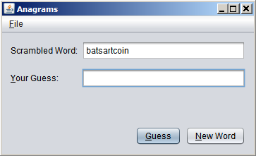
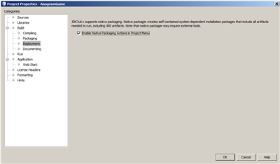
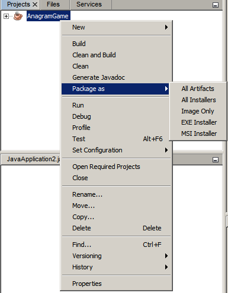
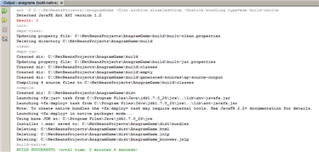
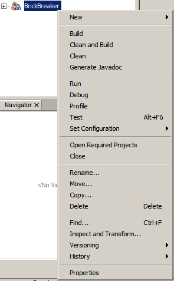
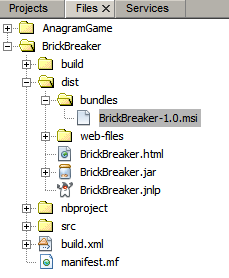

// 
//     Licensed to the Apache Software Foundation (ASF) under one
//     or more contributor license agreements.  See the NOTICE file
//     distributed with this work for additional information
//     regarding copyright ownership.  The ASF licenses this file
//     to you under the Apache License, Version 2.0 (the
//     "License"); you may not use this file except in compliance
//     with the License.  You may obtain a copy of the License at
// 
//       http://www.apache.org/licenses/LICENSE-2.0
// 
//     Unless required by applicable law or agreed to in writing,
//     software distributed under the License is distributed on an
//     "AS IS" BASIS, WITHOUT WARRANTIES OR CONDITIONS OF ANY
//     KIND, either express or implied.  See the License for the
//     specific language governing permissions and limitations
//     under the License.
//

= Создание встроенных пакетов в IDE NetBeans
:jbake-type: tutorial
:jbake-tags: tutorials 
:jbake-status: published
:icons: font
:syntax: true
:source-highlighter: pygments
:toc: left
:toc-title:
:description: Создание встроенных пакетов в IDE NetBeans - Apache NetBeans
:keywords: Apache NetBeans, Tutorials, Создание встроенных пакетов в IDE NetBeans

Авторы: Петр Сомол (Petr Somol) и Алена Сташкова (Alyona Stashkova)

Возможность создания встроенных пакетов была впервые реализована в составе JavaFX 2.2 SDK. Эта возможность позволяет создавать _встроенные пакеты_ приложений и выполнять установку и запуск без внешней зависимости от системы JRE или JavaFX SDK. В дальнейшем эта возможность была добавлена в проекты Java SE.

Создание встроенных пакетов не меняет модель разработки приложения. Приложение включается в пакет как есть, вместе со средой выполнения Java, и для него создается установщик, соответствующий используемой операционной системе. Смысл заключается в том, чтобы сделать приложение независимым от любых компонентов, которые могут присутствовать или отсутствовать в среде выполнения Java на целевых машинах. Такой установщик можно запустить на машине, где не установлены никакие компоненты Java, и он успешно установит как само приложение, так и необходимые компоненты среды выполнения Java. Размер таких установщиков достаточно велик, так как даже к демонстрационному приложению "Hello world" прилагается целый комплект артефактов среды выполнения Java.

В этом практическом руководстве вы узнаете, как создать установщик  ``EXE``  приложения Java SE и установщик  ``MSI``  приложения JavaFX для операционной системы Windows, используя демонстрационные приложения, поставляемые в комплекте с IDE.

*Примечание.*

* Создаваемые установщики  ``EXE``  и  ``MSI``  зависят от платформы и будут работать только в системе, совместимой с целевой платформой Java, для которой созданы установочные пакеты  ``EXE`` / ``MSI`` . (Например, если установщик  ``EXE``  или  ``MSI``  создан на машине, где установлена 64-разрядная версия платформы JDK, его необходимо запускать на машине под управлением 64-разрядной версии Windows.)
* В Windows оба приложения установлены в каталог  ``C:\Users\<username>\AppData\Local\``  и доступны в меню 'Пуск'.

image::images/netbeans-stamp-80-74.png[title="Содержимое на этой странице применимо к IDE NetBeans 7.4 или 8.0"]

*Для работы с этим учебным курсом требуется следующее программное обеспечение и ресурсы.*

|===
|Программное обеспечение или ресурс |Требуемая версия 

|link:http://netbeans.org/downloads/index.html[+IDE NetBeans+] |7.4 или 8.0 

|link:http://www.oracle.com/technetwork/java/javafx/downloads/index.html[+Комплект для разработчика на языке Java (JDK)+] |7 с обновлением 25 (или более поздняя) или 8 

|link:http://www.jrsoftware.org/[+Inno Setup+] |5.5 или более поздняя 

|link:http://wixtoolset.org/[+WiX+] |3.7 или более поздняя 
|===

== Установка и добавление необходимых средств в переменную Path

Чтобы воспользоваться поддержкой создания встроенных пакетов в IDE, необходимо установить следующие средства:

* link:http://www.jrsoftware.org/[+Inno Setup 5.5+] (или более поздняя версия) требуется для создания установщиков EXE в Windows.
* link:http://wixtoolset.org/[+WiX 3.7+] (или более поздняя версия) требуется для создания установщиков MSI в Windows.

*Примечание.* Список средств, необходимых для создания установщиков для различных платформ, см. в разделе "link:http://www.oracle.com/pls/topic/lookup?ctx=nb7400&id=NBDAG2508[+Упаковка приложения во встроенный установщик+]" в документе _Разработка приложений в IDE NetBeans_.

*Установка Inno Setup:*

1. Загрузите файл  ``ispack-5.5.3.exe``  со страницы link:http://www.jrsoftware.org/isdl.php[+Inno Setup Downloads+].
2. Дважды щелкните файл, чтобы запустить установщик.
3. Примите условия лицензионного соглашения Inno Setup и нажмите 'Далее'.
4. Установите Inno Setup, следуя инструкциям мастера.

*Установка WiX:*

1. Загрузите файл  ``wix37.exe``  со страницы link:http://wix.codeplex.com/releases/view/99514[+WiX Toolset - Download+].
2. Дважды щелкните файл, чтобы запустить установщик.
3. Установите WiX, следуя инструкциям мастера.

*Добавление Inno Setup и/или WiX в системную переменную Path:*

1. В Windows 7 выберите Пуск > Компьютер > Свойства > Дополнительные параметры системы.
2. Перейдите на вкладку 'Дополнительно' и нажмите кнопку 'Переменные среды'.
3. В области 'Системные переменные' дважды щелкните переменную Path.
4. В открывшемся диалоговом окне 'Изменение системной переменной' добавьте новый путь в поле 'Значение переменной' (после точки с запятой), например:  ``C:\Program Files (x86)\Inno Setup 5 ``  или  ``C:\Program Files (x86)\WiX Toolset v3.6\bin`` .
5. Нажмите ОК, чтобы закрыть все диалоговые окна.

*Примечания*

* Проверьте, что установленное средство указано в переменной Path. Для этого откройте окно командной строки и введите  ``iscc.exe``  для Inno Setup или  ``candle.exe``  для WiX. (Если при этом окно командной строки сразу закрывается, попробуйте ввести команду  ``cmd.exe /c cmd.exe /k iscc.exe``  или  ``cmd.exe /c cmd.exe /k candle.exe``  соответственно.)
На рисунке показано окно командной строки с результатом, указывающим на успешное добавление Inno Setup в системную переменную Path.

[.feature]
--

image::images/cmd_small.png[role="left", link="images/cmd.png"]

--

* После добавления всех средств в системную переменную Path обязательно перезапустите IDE.

== Создание встроенных пакетов в проектах Java SE

Чтобы воспользоваться поддержкой создания встроенных пакетов в IDE, необходимо выполнить следующие действия:

* <<createse,Создать проект IDE>>
* <<enable,Включить поддержку создания встроенных пакетов для проекта>>
* <<buildse,Очистить и собрать проект>>
* <<instse,Упаковать приложение в установщик>>

=== Настройка проекта Java SE

Перед упаковкой приложения в установщик необходимо создать само приложение.

Создайте новый проект Java SE на основе образца игры Anagram, поставляемого в комплекте с IDE NetBeans.

*Для создания проекта IDE выполните следующие действия:*

1. В меню IDE выберите Файл > Создать проект.
2. В мастере создания проектов разверните категорию 'Образцы' и выберите Java.
3. В списке 'Проекты' выберите 'Игра Anagram'. Затем нажмите кнопку "Дальше".

[.feature]
--

image::images/new_javase_prj_small.png[role="left", link="images/new_javase_prj.png"]

--

. На панели 'Имя и местоположение' оставьте без изменения данные в полях 'Имя проекта' и 'Местоположение проекта'.

. Нажмите 'Готово'.
В IDE создается и открывается проект Java SE.

Чтобы проверить работоспособность проекта, запустите его с помощью команды 'Выполнить >Запуск проекта' в главном меню.
На компьютере должно запуститься и отобразиться приложение Anagram.

=== Включение создания встроенных пакетов в IDE

По умолчанию команды создания встроенных пакетов в IDE отключены.

Щелкните правой кнопкой мыши проект AnagramGame в окне 'Проекты' и проверьте, доступны ли для этого проекта Java SE какие-либо действия. Как видите, контекстное меню проекта не содержит команд создания пакетов.

image::images/context_wo_pkg.png[]

*Включение создания встроенных пакетов для проекта:*

1. В окне 'Проекты' щелкните правой кнопкой мыши узел проекта и выберите 'Свойства' в контекстном меню.
2. В диалоговом окне 'Свойства проекта' выберите категорию 'Развертывание', затем выберите параметр 'Включить команды создания встроенных пакетов в меню проекта'.

[.feature]
--

--

. Нажмите ОК.
В контекстном меню проекта появится команда 'Упаковать'.

=== Сборка приложения

Теперь нужно очистить и собрать приложение для развертывания.

*Очистка и сборка проекта:*

* Выберите 'Выполнить > Очистить и собрать проект' в главном меню.
Результаты выполнения команды отображаются в окне 'Результаты'.

[.feature]
--

image::images/output_small.png[role="left", link="images/output.png"]

--

В каталоге проекта создается папка  ``dist``  с файлом  ``jar`` .

=== Создание установщика  ``EXE`` 

Теперь можно упаковать приложение в установщик для Windows.

*Сборка установщика  ``EXE`` :*

* Щелкните проект AnagramGame правой кнопкой мыши и выберите 'Упаковать в... > Установщик EXE' в контекстном меню.

*Примечание.* IDE создает установщик  ``EXE`` , только если средства Inno Setup <<tool,установлены на компьютере и добавлены в системную переменную Path>>.

IDE отображает ход выполнения и результат процесса упаковки в окне 'Результаты'.

[.feature]
--

--

*Примечание.* При отображении хода выполнения IDE изображение на экране может некоторое время не меняться - именно в этот момент в фоновом режиме работает Inno Setup. Процесс упаковки займет некоторое время.

Готовый установщик  ``EXE``  помещается в каталог  ``AnagramGame/dist/bundles/`` .

image::images/anagram_exe.png[]

== Создание независимых пакетов приложений в проектах JavaFX

Чтобы собрать готовое к установке приложение JavaFX, используя поддержку создания встроенных пакетов в IDE, необходимо выполнить следующие действия.

* <<createfx,Создать новый проект JavaFX в IDE>>
* <<enablefx,Включить поддержку создания встроенных пакетов для проекта>>
* <<buildfx,Очистить и собрать приложение JavaFX>>
* <<instfx,Собрать готовое к установке приложение JavaFX>>

=== Создание проекта JavaFX

Сначала необходимо создать проект JavaFX на основе образца BrickBreaker, поставляемого в комплекте с IDE.

*Создание проекта JavaFX в IDE:*

1. В меню IDE выберите 'Файл > Создать проект'.
2. В мастере создания проектов разверните категорию 'Образцы' и выберите JavaFX.
3. В списке 'Проекты' выберите BrickBreaker. Затем нажмите кнопку "Дальше".
4. На панели 'Имя и местоположение' оставьте без изменения данные в полях 'Имя проекта' и 'Местоположение проекта' и 'Платформа JavaFX'.

[.feature]
--

image::images/new_javafx_prj_small.png[role="left", link="images/new_javafx_prj.png"]

--

. Нажмите 'Готово'. 
Проект JavaFX BrickBreaker отображается в IDE в окне 'Проекты'.

Чтобы проверить работоспособность проекта, запустите его с помощью команды 'Выполнить >Запуск проекта (BrickBreaker)' в главном меню.
На компьютере должно запуститься и отобразиться приложение Brick Breaker.

[.feature]
--

image::images/brickbreaker_small.png[role="left", link="images/brickbreaker.png"]

--

=== Включение создания встроенных пакетов для проекта

Чтобы воспользоваться поддержкой создания встроенных пакетов для проекта в IDE, необходимо сначала включить эту поддержку.

Если щелкнуть проект Brick Breaker правой кнопкой мыши, в контекстном меню не будет команд создания встроенных пакетов.

*Включение команд создания встроенных пакетов для проекта в контекстном меню:*

1. В окне 'Проекты' щелкните правой кнопкой мыши узел проекта и выберите 'Свойства' в контекстном меню.
2. В диалоговом окне 'Свойства проекта' в категории 'Сборка' выберите 'Развертывание', затем выберите параметр 'Включить создание встроенных пакетов'.

[.feature]
--

image::images/enable_native_pkg_fx_small.png[role="left", link="images/enable_native_pkg_fx.png"]

--

. Нажмите ОК.
В контекстном меню проекта появится пункт 'Упаковать'.

image::images/pkg_fx_enabled.png[]

=== Сборка приложения

Приложение JavaFX готово к очистке и сборке.

*Очистка и сборка проекта:*

* Выберите 'Выполнить > Очистить и собрать проект' в главном меню.
Результаты выполнения команды отображаются в окне 'Результаты'.

*Примечание.* Если сборка выполнена успешно, но в окне 'Результаты' отображается  ``предупреждение: [options] путь класса bootstrap не задан в связи с -source 1.6`` , необходимо указать JDK 8 в качестве исходного/двоичного формата в свойствах проекта и выполнить повторную очистку и сборку:

1. Щелкните проект BrickBreaker правой кнопкой мыши в окне 'Проекты' и выберите 'Свойства'.
2. В диалоговом окне 'Свойства проекта' выберите категорию 'Источники'.
3. В списке 'Исходный/двоичный формат' выберите JDK 8 и нажмите ОК.
4. Щелкните проект BrickBreaker правой кнопкой мыши в окне 'Проекты' и выберите 'Очистить и собрать' в контекстном меню.

=== Создание установщика  ``MSI`` 

Теперь можно упаковать приложение в установочный пакет для определенной операционной системы Windows.

*Сборка установщика  ``MSI`` :*

* Щелкните проект BrickBreaker правой кнопкой мыши и выберите 'Упаковать в... > Установщик MSI' в контекстном меню.

*Примечание.* IDE создает установщик  ``MSI`` , только если средства WiX <<tool,установлены на компьютере и добавлены в системную переменную Path>>.

IDE отображает ход выполнения и результат процесса упаковки в окне 'Результаты'.

[.feature]
--

image::images/output_fx_msi_small.png[role="left", link="images/output_fx_msi.png"]

--

*Примечание.* При отображении хода выполнения IDE изображение на экране может некоторое время не меняться - именно в этот момент в фоновом режиме работает WiX. Процесс упаковки займет некоторое время.

Готовое к установке приложение JavaFX помещается в каталог  ``BrickBreaker/dist/bundles/`` .

== [[Проверка готовых к установке приложений]] 

После создания установщиков  ``AnagramGame-1.0.exe``  и  ``BrickBreaker-1.0.msi``  необходимо проверить, в какой каталог установлены приложения Anagram и BrickBreaker в родной системе.

*Проверка установщиков:*

1. Перейдите в каталог с файлом установщика ( ``AnagramGame-1.0.exe``  или  ``BrickBreaker-1.0.msi`` ) на жестком диске.
2. Дважды щелкните файл, чтобы запустить установщик.

Оба приложения должны установиться в каталог  ``C:\Users\<username>\AppData\Local\``  и появиться в меню 'Пуск'.

== См. также

* link:http://www.oracle.com/pls/topic/lookup?ctx=nb8000&id=NBDAG2508[+Упаковка приложения как встроенного установщика+] в документе _Разработка приложений в IDE NetBeans_
* link:http://docs.oracle.com/javafx/2/deployment/self-contained-packaging.htm[+Развертывание приложений JavaFX. Создание независимых пакетов приложений+]
* link:http://docs.oracle.com/javase/7/docs/technotes/guides/jweb/packagingAppsForMac.html[+Упаковка приложений Java для распространения на Mac+]
link:/about/contact_form.html?to=3&subject=Feedback:%20Native%20Packaging%20In%20NetBeans%20IDE[+Отправить отзыв по этому учебному курсу+]

link:../../trails/matisse.html[+Возврат к учебной карте+]

