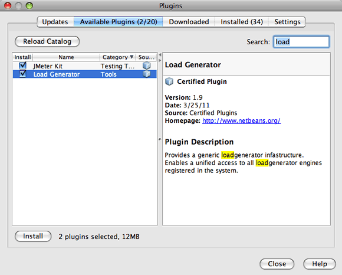

// 
//     Licensed to the Apache Software Foundation (ASF) under one
//     or more contributor license agreements.  See the NOTICE file
//     distributed with this work for additional information
//     regarding copyright ownership.  The ASF licenses this file
//     to you under the Apache License, Version 2.0 (the
//     "License"); you may not use this file except in compliance
//     with the License.  You may obtain a copy of the License at
// 
//       http://www.apache.org/licenses/LICENSE-2.0
// 
//     Unless required by applicable law or agreed to in writing,
//     software distributed under the License is distributed on an
//     "AS IS" BASIS, WITHOUT WARRANTIES OR CONDITIONS OF ANY
//     KIND, either express or implied.  See the License for the
//     specific language governing permissions and limitations
//     under the License.
//

= Using a Load Generator in NetBeans IDE
:jbake-type: tutorial
:jbake-tags: tutorials 
:jbake-status: published
:icons: font
:syntax: true
:source-highlighter: pygments
:toc: left
:toc-title:
:description: Using a Load Generator in NetBeans IDE
:keywords: Using a Load Generator in NetBeans IDE

When testing the performance of an application, it can be beneficial to perform your tests under a typical load. This can be difficult if you are running your application in a development environment. One way to emulate an application running under load is through the use of a load generator script. This document presents an overview of load generator support offered by the IDE.

Instead of supplying its own load generator runtime, the IDE relies on integrating third party tools. NetBeans IDE supports the Apache JMeter Load Testing Tool (link:http://jakarta.apache.org/jmeter[+homepage+]) to replay load testing scripts. To use the JMeter tool in the IDE, you first need to download the required plugins from the Update Center.

== Prerequisites

This document assumes you have some basic knowledge of, or programming experience with, the following technologies:

* Java Programming
* NetBeans IDE

== Software Needed for the Tutorial

For this tutorial you need to have the following software installed on your computer:

|===
|Software or Resource |Version Required 

|xref:../../../download/index.adoc[NetBeans IDE] |7.2, 7.3, 7.4, 8.0 

|link:http://www.oracle.com/technetwork/java/javase/downloads/index.html[+Java Development Kit (JDK)+] |Version 7 or 8 

|JMeter Kit and Load Generator plugins |download from NetBeans Update Center 

|GlassFish application server |3.x, 4.x 
|===

*Notes.*

* The profiling tool is bundled with NetBeans IDE, and no special setup is necessary in order to begin profiling an application.
* To add support for the JMeter Load Testing Tool, use the Plugins Manager to download the JMeter Kit and the Load Generator plugins from the Update Center.

== Installing the JMeter Plugins

You can easily add support for the JMeter load generator by downloading and installing the *JMeter Kit* and *Load Generator* plugins from the NetBeans Update Center.

To download the plugins, do the following:

1. Choose Tools > Plugins from the main menu to open the Plugins manager.
2. Click the Available Plugins tab and select the checkboxes for the JMeter Kit and Load Generator plugins. Click Install.

. Step through the installer to download and install the plugins and click Finish. Click Close to close the Plugins Manager.

After installing the plugins, the category Load Testing Scripts is added to the New File wizard.

== Working with the JMeter Load Testing Script

Support for the JMeter plugins is closely integrated with the IDE's profiling tool. The JMeter plugins enable you to easily create and run JMeter load testing scripts from within the IDE.

To use a load generator script, you create a script for a specific project and modify the script according to the type of project load that would be placed on a server running the application. When you run the script, the script places a load on the server that emulates the behavior of the application under typical running conditions. You can then test the performance of the application and the test results you achieve would more closely approximate the performance of the application under typical conditions.

=== Creating a New Load Testing Script

After you download and install the plugins, a new category is created in the New File wizard. You use the New File wizard to create a load script file in your project.

To create a new load test script, do the following:

1. Right-click the project node in the Projects window and choose New > Other.
2. In the Categories pane, expand Load Testing Scripts, select JMeter Plans and then select New JMeter Plan in the File Types pane. Click Next.
3. Type a name for the script and click Finish.

When you create a new script, the IDE places the script under the Load Generator Scripts node in the Projects window. In the Files window, you can see that the IDE saves the script in the  ``jmeter``  directory. If you already have a load testing script created outside of the IDE, you can create a  ``jmeter``  directory and add the script to the directory to run the script from within the IDE.

image::images/new-plan.png[] 

=== Editing a Load Testing Script

The JMeter external editor enables you to modify the script according to the needs of your application. After you have created a load testing script or added a script to your project, you can invoke the external editor by right-clicking the script in the Projects window and choosing *External Edit*.

For more information about editing the JMeter testing scripts, see the link:http://jakarta.apache.org/jmeter/usermanual/index.html[+JMeter User Manual+].

image::images/jmeter-externaledit.png[title="JMeter load testing script in project structure"] 

=== Starting a Load Testing Script

The load testing script can be started in the following ways:

* *In standalone mode*

In the *Services* window, right-click the Load Generators node and choose *JMeter > Start*. This action will bring up a browse dialog where you can specify the script to run.

image::images/jmeter-services.png[]

* *From the Select Profiling Task window*

When profiling a web application you can specify a load testing script to be run in the Select Profiling Task window. The selected script will be started right before the browser window opens.

image::images/jmeter-profilewindow72.png[]

=== Stopping and Restarting a Load Testing Script

You can stop and restart a load testing script from either the *Output window* or the *Services window*.

A JMeter tab opens in the *Output window* after the script has been loaded. The window displays the current state of the load generator. In the left margin of the Output window there are controls to start, stop or restart the script.

image::images/jmeter-output.png[title="Output window showing Load Generator status"]

The current status of the load generator is also displayed in the *Services window*. You can stop and restart a script by selecting a node under the JMeter node and choosing an item from the popup menu.

image::images/jmeter-services2.png[title="Services window showing status of Load Generator"]

== Additional Resources

This basic overview shows how to use a JMeter load testing script from within the IDE. For information on developing a load testing script for your application, see the following resources:

* link:http://jakarta.apache.org/jmeter[+Apache JMeter Load Testing Tool+]
* link:http://jakarta.apache.org/jmeter/usermanual/index.html[+JMeter User Manual+]
xref:../../../community/mailing-lists.adoc[Send Us Your Feedback]

== See Also

* xref:../web/quickstart-webapps.adoc[+Introduction to Developing Web Applications+]
* xref:profiler-intro.adoc[+Introduction to Profiling Java Applications+]
* xref:../java-ee.adoc[+Java EE &amp; Java Web Learning Trail+]
