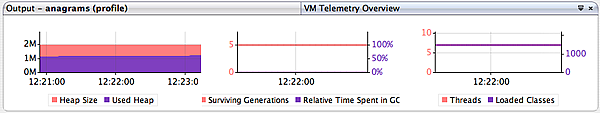
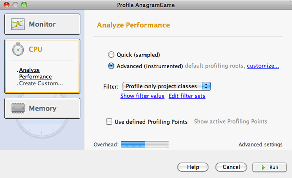
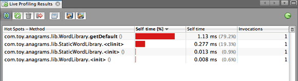
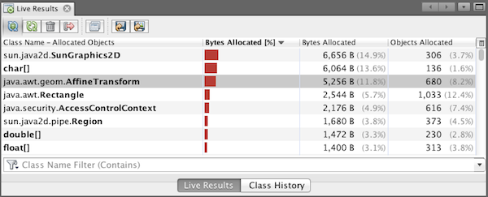

// 
//     Licensed to the Apache Software Foundation (ASF) under one
//     or more contributor license agreements.  See the NOTICE file
//     distributed with this work for additional information
//     regarding copyright ownership.  The ASF licenses this file
//     to you under the Apache License, Version 2.0 (the
//     "License"); you may not use this file except in compliance
//     with the License.  You may obtain a copy of the License at
// 
//       http://www.apache.org/licenses/LICENSE-2.0
// 
//     Unless required by applicable law or agreed to in writing,
//     software distributed under the License is distributed on an
//     "AS IS" BASIS, WITHOUT WARRANTIES OR CONDITIONS OF ANY
//     KIND, either express or implied.  See the License for the
//     specific language governing permissions and limitations
//     under the License.
//

= Introduction to Profiling Java Applications in NetBeans IDE
:jbake-type: tutorial
:jbake-tags: tutorials 
:jbake-status: published
:syntax: true
:icons: font
:source-highlighter: pygments
:toc: left
:toc-title:
:description: Introduction to Profiling Java Applications in NetBeans IDE - Apache NetBeans
:keywords: Apache NetBeans, Tutorials, Introduction to Profiling Java Applications in NetBeans IDE

NetBeans IDE includes a powerful profiling tool that can provide important information about the runtime behavior of your application. The NetBeans profiling tool easily enables you to monitor thread states, CPU performance, and memory usage of your application from within the IDE, and imposes relatively low overhead.

This introductory document is an overview of the profiling tools included in the IDE and a guide to help you quickly start profiling your NetBeans projects. This document is intended to demonstrate the various profiling tasks available in the IDE and the profiling results you can obtain when profiling a project. It does not cover all the profiling features included in the IDE, nor does it explore how to interpret profiling results to resolve specific performance issues you may have in your application.

In this document you will use the profiling tool to obtain profiling data about the Anagram Game sample application, a simple Java application that is included in the IDE. Though the Anagram Game is a very simple Java application project, you would follow the same steps to profile larger, more complex Java applications, as well as web and enterprise application projects.

This document shows how to use the IDE to profile the application and obtain the following profiling results:

* Runtime behavior of an application
* CPU time used by an application's methods
* Object creation

Additionally, this document demonstrates how to take and compare snapshots of profiling results.

== Profiling for the First Time

The first time that you use the profiling tool, the IDE needs to perform some initial operations to ensure that accurate profile results are obtained and to integrate the tool with the project. To demonstrate this, you will first create the AnagramGame project and then run the calibration. The IDE will automatically perform the integration the first time you profile the AnagramGame project.

=== Creating the Sample Project

In this document you will profile the Anagram Game sample application. To do this you will first use the New Project wizard to create the sample application and set the project as the Main Project.

To create the Anagram Game application perform the following steps.

1. Choose File > New Project (Ctrl-Shift-N; ⌘-Shift-N on Mac) from the main menu.
2. In the New Projects wizard, select the Samples > Java category.
3. Select the Anagram Game project. Click Next.
4. Specify a location for the project. Click Finish.

When you click Finish, the IDE creates the Anagram Game sample project.

. Choose Run > Set Main Project > AnagramGame from the main menu.

After you set the project as the main project you can see that the name of the Anagram Game project is in bold in the Projects window. By default, when using the IDE to profile a project, the IDE will profile the main project. If no project is set as the main project the IDE will profile the project that is selected in the Projects window.

=== Using the Profiler for the First Time

To achieve accurate profiling results, you must have calibration data for each Java platform that will be used for profiling. If you are running the profiling tool for the first time, or if valid calibration data is unavailable for the Java platform, the IDE will prompt you to run the calibration process for your platform.

The calibration only needs to be performed once. However, if you make any substantial changes to the configuration of the machine that could affect machine performance, you should run the calibration again. You can run the calibration at any time by performing the following steps.

1. Choose *Advanced Commands* > *Manage Calibration Data* from the Profile menu.
2. Select the Java Platform. Click Calibrate.

image::images/calibrate-select-platform.png[title="Dialog box to select the Java Platform when calibrating."]

A dialog box appears when the calibration operation is complete. You can click Show Details to view a dialog box with information about the calibration results. The calibration data for each Java platform is saved in the  ``.nbprofile``  directory in your home directory.

image::images/calibrate-information.png[title="Calibration Information dialog"]

*Note.* If you are using NetBeans IDE 7.4 or earlier, choose *Advanced Commands* > *Run Profiler Calibration* from the Profile menu and select the Java platform in the Select Java Platform to Calibrate dialog box.

image::images/calibrate-select-platform.png[title="Dialog box to select the Java Platform when calibrating."]

== Selecting a Profiling Task

The IDE provides a number of internal settings that let you tune profiling to your needs. For example, you may decrease the profiling overhead at the cost of some reduction in the amount of generated information. However, it may take some time to understand the meaning and use of the numerous settings available. For many applications, the default settings specified for the profiling tasks are sufficient in most situations.

When profiling a project, you use the Select Profiling Task dialog box to choose a task according to the type of profiling information you want to obtain. The following table describes the profiling tasks and the profiling results obtained from running the task.

|===
|Profiling Task |Results 

|<<monitor,Monitor Application>> |Choose this to obtain high-level information about properties of the target JVM, including thread activity and memory allocations. 

|<<cpu,Analyze CPU Performance>> |Choose this to obtain detailed data on application performance, including the time to execute methods and the number of times the method is invoked. 

|<<memory,Analyze Memory Usage>> |Choose this to obtain detailed data on object allocation and garbage collection. 
|===

The Select Profiling Task dialog box is the main interface for running a profiling task. After you select a task, you can modify the task settings to fine tune the results you will obtain. For each of the profiling tasks, you can also create and save custom profiling tasks based on the task. When you create a custom profiling task, the custom task is listed in the Select Profiling Task dialog box so that you can easily find and run your custom settings later. When you create a custom profiling task, you can modify more advanced profiling settings by clicking *Advanced settings* in the Select Profiling Task dialog box.

=== Monitoring an Application

When you choose the Monitor task, the target application is started without any instrumentation. When monitoring an application, you obtain high-level information about several important properties of the target JVM. Because monitoring an application imposes very low overhead, you can run the application in this mode for extended periods of time.

To monitor the Anagram Game application, perform the following steps.

1. Confirm that the AnagramGame project is set as the main project.
2. Choose Profile > Profile Main Project from the main menu.

Alternatively, right-click the project node in the Projects window and choose Profile.

. Select Monitor in the Select Profiling Task dialog box.

. Select additional monitor options, if desired. Click Run.

image::images/monitor-task.png[title="Selecting the Monitor Application profiling task"]

You can hover the cursor over an option to view a tooltip with details about the option.

When you click Run, the IDE launches the application and the Profiler window opens in the left pane of the IDE. The Profiler window contains the controls that enable you to do the following:

* Control the profiling task
* See the status of the current profiling task
* Display profiling results
* Manage profiling results snapshots
* See basic telemetry statistics

You can use the controls in the Profiler window or the main menu to open the windows where you can view the monitoring data. You can use the Telemetry Overview window to quickly get an overview of the monitoring data in real time. If you place the cursor over a graph, you can see more detailed statistics about the data displayed in the graph. You can double-click on any of the graphs in the Telemetry Overview window to open a larger and more detailed version of the graph.

If the overview does not open automatically you can choose Window > Profiling > VM Telemetry Overview to open the overview in the Output window. You can open the VM Telemetry Overview window and see monitoring data at any time during any profiling session.

=== Analyzing CPU Performance

When you choose the CPU task, the IDE profiles the method-level CPU performance (execution time) of your application and processes the results in real-time. You can choose to analyze the performance by periodically taking a stack trace or by instrumenting the methods in the application. You can choose to instrument all the methods or limit the instrumentation to a part of the application code, even down to a specific code fragment.

To analyze CPU performance, you choose how the application is profiled by selecting one of the following options.

* *Quick (Sampled).* In this mode, the IDE samples the application and takes a stack trace periodically. This option is less precise than instrumenting methods, but the overhead is lower. This option can help you locate methods that you might want to instrument.
* *Advanced (Instrumented).* In this mode, the methods of the profiled application are instrumented. The IDE records when threads enter and exit project methods enabling you to see how much time is spent in each method. When entering a method, threads generate a "method entry" event. Threads generate a corresponding "method exit" event when exiting the method. The timestamps for both of these events are recorded. This data is processed in real time.

You can choose to instrument all the methods in the application or limit the instrumentation to a subset of the application's code by specifying one or more *root methods*. You can specify a root method using the popup menu in the source code or by clicking *customize* to open the Edit Profiling Roots dialog box.

A root method is the method, class or package in your source code that you specify as an instrumentation root. Profiling data is collected when one of the application's threads enters and leaves the instrumentation root. No profiling data is collected until one of the application's threads enters the root method. Specifying a root method can significantly reduce the profiling overhead. For some applications, specifying a root method may be the only way to obtain any detailed and/or realistic performance data because profiling the entire application may generate so much profiling data that the application becomes unusable or may even cause the application to crash.

NOTE: The Quick profile mode is not available in NetBeans IDE 7.0 and earlier. You can only use instrumentation to obtain profiling results, but you can choose to instrument the entire application or limit instrumentation to part of the application by specifying one or more root methods.

You can further fine tune how much code is profiled by using a filter to limit the sources that are instrumented.

You will now use the IDE to analyze the CPU performance of the Anagram Game application. You will choose the Part of Application option and then select  ``WordLibrary.java``  as the profiling root. By selecting this class as the profiling root, you limit the profiling to the methods in this class.

1. Click the Stop button in the Profiler window to stop the previous profiling session (if still running).
2. Choose Profile > Profile Main Project from the main menu.
3. Select CPU in the Select Profiling Task dialog box.
4. Select *Advanced (Instrumented)*.

To use this option you also need to specify a profiling root method.

. Click *customize* to open the Edit Profiling Roots dialog box.

. In the Edit Profiling Roots dialog box, expand the AnagramGame node and select  ``Sources/com.toy.anagrams.lib/WordLibrary`` . When profiling a project you can specify multiple root methods.

image::images/edit-profiling-roots.png[title="Dialog box for selecting the root methods"]

. Click the Advanced button to open the Edit Profiling Roots (Advanced) dialog box which provides more advanced options for adding, editing and removing root methods.

image::images/edit-profiling-roots-adv.png[title="Dialog box for specifying the root methods"]

You can see that  ``WordLibrary``  is listed as the root method. Click OK to close the Edit Profiling Roots (Advanced) dialog box.

. Click OK to close the Edit Profiling Roots dialog box.

After you select the profiling root you can click *edit* in the Select Profiling Task dialog to modify the selected root method.

. Select *Profile only project classes* for the Filter value.

The filter enables you to limit the classes that are instrumented. You can choose from the IDE's predefined profiling filters or create your own custom filters. You can click *Show filter value* to see a list of the classes that will be profiled when the selected filter is applied.

image::images/show-filter-value.png[title="Show Filter Value Dialog box"]

. Click Run in the Select Profiling Task dialog box to start the profiling session.

When you click Run, the IDE launches the application and starts the profiling session. To view the profiling results, click Live Results in the Profiler window to open the Live Results window. The Live Results window displays the profiling data collected thus far. The data displayed is refreshed every few seconds by default. When analyzing CPU performance, the Live Results window displays information on the time spent in each method and the number of invocations of each method. You can see that in the Anagram Game application only the selected root methods are invoked initially.

You can quickly navigate to the source code containing any of the listed methods by right-clicking the name of the method and choosing Go To Source. When you click Go To Source the class opens in the Source editor.

=== Analyzing Memory Usage

The Analyze Memory Usage task gives you data on objects that have been allocated in the target application such as the number, type and location of the allocated objects.

To analyze memory performance, you choose how much data you want to obtain by selecting one of the following options.

* *Quick.* When this option is selected, the profiler samples the application to provide data that is limited to the live objects. This option only tracks live objects and does not track allocations when instrumenting. It is not possible to record stack traces or to use profiling points if you select this option. This option incurs a significantly lower overhead than the Advanced option.
* *Advanced.* When this option is selected application you can obtain information about the number, type, and location of allocated objects. All classes that are currently loaded by the target JVM (and each new class as it is loaded) are instrumented to produce information about object allocations. You need to select this option if you want to use profiling points when analyzing memory usage or if you want to record the call stack. This options incurs a greater profiling overhead than the Quick option.

If you select the Advanced option you can also set the following options.

* *Record Full Object Lifestyle.* Select this option to record all information for each object, including the number of generations survived.
* *Record Stack Trace for Allocations.* Select this option to record the full call stack. This option enables you to view the reverse call tree for method calls when viewing a memory snapshot.
* *Use defined Profiling Points.* Select this option to enable profiling points. Disabled profiling points are ignored. When deselected, all profiling points in the project are ignored.

The Overhead meter in the Select Profiling Tasks window gives a rough approximation of the increase or decrease in the profiling overhead according to the profiling options that you select.

In this exercise you will use the IDE to analyze the memory performance of the Anagram Game application. You will choose the *Advanced* option and select the *Record Stack Trace for Allocations* so that the IDE records the full call stack. By selecting this option, when you take the memory snapshot you will be able to view a reverse call tree.

1. Click the Stop button in the Profiler window to stop the previous profiling session (if still running) and stop the Anagram Game application.
2. Choose Profile > Profile Main Project from the main menu.
3. Select Memory in the Select Profiling Task dialog box.
4. Select *Advanced*.
5. Select *Record Stack Trace for Allocations*. Click Run to start the profiling session.

Notice that when you selected this option the Overhead meter increased substantially, but the application is small enough that the performance hit should be manageable.

image::images/profile-java-memory.png[title="Select Memory Profiling Task"]

When you click Run, the IDE launches the application and starts the profiling session. To view the profiling results, click Live Results in the Profiler window to open the Live Results window. The Live Results window displays information on the size and number of objects that are allocated in our project.

By default the results are sorted and displayed by the number of Live Bytes, but you can click a column header to change how the results are displayed. You can also filter the results by typing a class name in the filter box below the list.

== Taking Snapshots

When a profiling session is in progress, you can capture profiling results by taking a snapshot. A snapshot captures the profiling data at the moment you take the snapshot. However, snapshots differ from live profiling results in the following ways:

* Snapshots can be examined when no profiling session is running.
* Snapshots contain a more detailed record of profiling data than live results.
* Snapshots can be easily compared (memory snapshots).

Because a profiling session does not have to be in progress to open a project's snapshots, you can open a project's snapshot at any time by selecting the snapshot in the list of saved snapshots in the Profiler window and clicking Open.

=== Taking and Comparing Memory Snapshots

For the Anagram Game application, you can take a snapshot of the results to see the allocation stack trace for the objects of type  ``String`` . You can then take another snapshot and compare the two. By comparing memory snapshots you can see what objects have been created or released from the heap in the interval between when you took the two snapshots. The snapshots must be comparable, which means that the profiling type (e.g., Allocations vs. Liveness) and the number of tracked objects must match.

In this exercise you will take and save a snapshot to your project. You will then take a second snapshot and compare the second snapshot to the saved snapshot.

1. Make sure the profiling session is still running.
(If you stopped the profiling session, repeat the steps to analyze memory performance and open the Live Results window.)

. Right-click the line containing  ``java.lang.String``  in the Live Results window and choose Take Snapshot and Show Allocation Stack Traces.

You can use the filter in the Live Results window to help you find the line.

image::images/profile-java-memstack1.png[title="Snapshot of Memory Profiling Results"]

The IDE takes a memory snapshot and opens the snapshot in the Allocation Stack Traces tab. In the Allocation Stack Traces tab you can explore the reverse call tree for the methods that instantiated the selected object.

. Click the Save Snapshot to Project button in the snapshot toolbar (Ctrl-S; ⌘-S on Mac) to save the memory snapshot to your project. When you save the snapshot to your project, the snapshot is added to the list of Anagram Game's saved snapshots in the Profiler window. By default, snapshots are physically saved in the  ``nbproject/private/profiler``  directory of your project. Saved snapshots are appended with the  ``.nps``  suffix.

*Note.* You can save snapshots anywhere on your filesystem, however only snapshots saved in the default location in your project will be listed in the Profiler window. You can also click the "Save current view to image" button in the snapshot's toolbar to save the snapshot as an image files ( ``.png`` ) that can be viewed outside of the IDE.

. Take another snapshot by clicking the Take Snapshot of Collected Results button in the Live Results toolbar (or alternatively, click the Take Snapshot button in the Profiler window). Save the snapshot.

. In the window of one of the memory snapshots, click the Compute Difference button ( image:images/comparesnapshots.png[title="Compare Snapshot button"] ) in the snapshot toolbar. Alternatively, choose Profile > Compare Memory Snapshots from the main menu.

. In the Select Snapshot to Compare, select one of the open snapshots from the list. Click OK.

image::images/profile-java-selectsnap.png[title="Select Snapshots to Compare dialog box"]

When a memory snapshot is open, you can compare it to other comparable memory snapshots. You can compare the snapshot to unsaved snapshots that are currently open or to snapshots that are saved to the project or elsewhere on your system.

When you click OK, the Liveness Comparison window opens displaying the differences between the two memory snapshots.

image::images/profile-java-compare.png[title="tab showing results of Liveness Comparison of two memory snapshots"]

The snapshot comparison looks similar to a memory snapshot but only displays the differences between the two compared snapshots. When you look at the numbers in the columns you can see that a plus sign ( + ) indicates that the value increased and a minus sign ( - ) indicates that the value decreased. In the Live Bytes column a graphical bar enables you to easily see the difference in the bytes allocated. If the left half of the cell in that column is green it means that the number of allocated bytes for that object is lower when the second snapshot was taken than it was when the first was taken. If the right half of the cell is red it means that the number of allocated bytes is higher in the second snapshot than in the first.

*Note.* You can also set Take Snapshot profiling points for more precise control over when snapshots are taken. For more on how to take snapshots using profiling points, see xref:profiler-profilingpoints.adoc[+Using Profiling Points in NetBeans IDE+].

== Conclusion

This concludes the introduction to profiling an application using NetBeans IDE. This document demonstrated the basics of how to use the IDE to profile a simple NetBeans project and view the profiling results. The steps outlined above can be applied when profiling most projects. Profiling more complex projects such as enterprise applications and free-form projects may require additional configuration steps.

<<top,top>>

