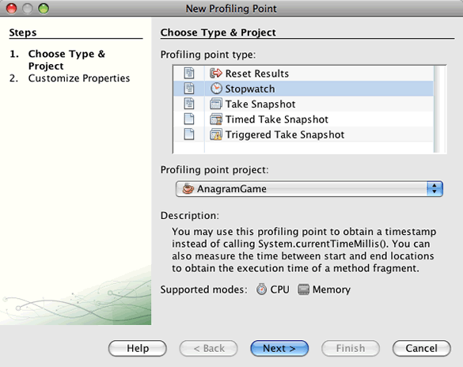
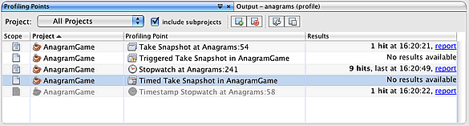
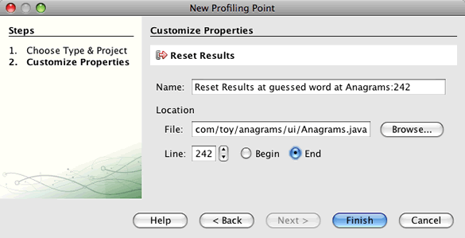
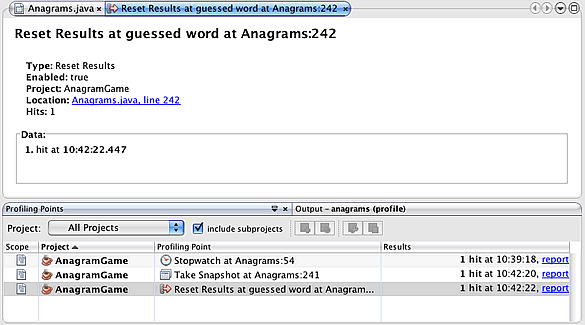

// 
//     Licensed to the Apache Software Foundation (ASF) under one
//     or more contributor license agreements.  See the NOTICE file
//     distributed with this work for additional information
//     regarding copyright ownership.  The ASF licenses this file
//     to you under the Apache License, Version 2.0 (the
//     "License"); you may not use this file except in compliance
//     with the License.  You may obtain a copy of the License at
// 
//       http://www.apache.org/licenses/LICENSE-2.0
// 
//     Unless required by applicable law or agreed to in writing,
//     software distributed under the License is distributed on an
//     "AS IS" BASIS, WITHOUT WARRANTIES OR CONDITIONS OF ANY
//     KIND, either express or implied.  See the License for the
//     specific language governing permissions and limitations
//     under the License.
//

= Using Profiling Points in NetBeans IDE
:jbake-type: tutorial
:jbake-tags: tutorials 
:jbake-status: published
:icons: font
:syntax: true
:source-highlighter: pygments
:toc: left
:toc-title:
:description: Using Profiling Points in NetBeans IDE - Apache NetBeans
:keywords: Apache NetBeans, Tutorials, Using Profiling Points in NetBeans IDE

NetBeans IDE includes a powerful profiling tool that can provide important information about the runtime behavior of your application. The NetBeans profiling tool easily enables you to monitor thread states, CPU performance and the memory usage of your application from within the IDE, and imposes relatively low overhead.

This document describes how to use profiling points as an alternative way of setting up and controlling the profiling session. Profiling points are similar to debugger breakpoints in that you place them directly in the source code and they can trigger behavior when hit. Once you set a profiling point it becomes part of the project until you delete it. You can open the Profiling Points window to view, modify and delete the Profiling Points in your projects.

You can use profiling points to perform the following tasks:

* Reset profiling results
* Take a snapshot or heap dump
* Record the timestamp or execution time of a code fragment
* Stop and start a load generator script (requires the load generator plugin)

This document will demonstrate how to use profiling points to obtain profiling data about the Anagram Game sample application, a simple Java application that is included in the IDE. Though the Anagram Game is a very simple Java application project, you would follow the same steps to profile larger, more complex Java applications, as well as web and enterprise application projects.

Before starting this tutorial you may want to familiarize yourself with using the profiling tool by reading the following documentation.

* xref:profiler-intro.adoc[+Introduction to Profiling Java Applications in NetBeans IDE+]

== Profiling Point Basics

This section is a general guide on how to set profiling points in a project and how to view and modify existing profiling points. There are different types of profiling points, and you choose the profiling point according to the use case. A project might have a number of different profiling points associated with it. You can add, delete, enable and disable profiling points according to the measurements that you want to obtain during that profiling session.

=== Setting a Profiling Point

The easiest way to set a profiling point is in the source code in the editor window. You can simply choose the line in the code where you want to set the profiling point and then open the New Profiling Point window. You can also set profiling points when you are configuring the options for the profiling session.

1. Open the file that contains the code where you want to insert the profiling point.
2. In the source editor, right-click in the line where you want to add the profiling point and choose *Profiling* > *Insert Profiling Point* to open the New Profiling Point wizard.
3. Select a profiling point type and the project. Click Next.

. Type a name for the profiling point and customize the properties of the profiling point. Click Finish.

When you click Finish, an icon representing the profiling point type appears in the left margin of the source editor next to the line where you inserted the profiling point.

image::images/ppoints-icons.png[title="Profiling Points annotations in margin of source editor"] 

=== Enabling, Disabling and Editing Profiling Points

When no profiling session is running, you can edit, enable and disable individual profiling points in either the source editor or in the Profiling Points window. To see a list of all profiling points, open the Profiling Points window by choosing *Window* > *Profiling* > *Profiling Points* from the main menu. The Profiling Points window shows the current status of the profiling points.

When a profiling session is running, the Profiling Points window displays how many times each profiling point was hit and enables you to view a report of the results.

You can quickly navigate to a specific profiling point in your source code by opening the Profiling Points window and right-clicking the profiling point name and choosing Show Source.

To modify the status or the settings of a profiling point, do either of the following.

* In the source editor, right-click the profiling point icon in the margin and choose Profiling Point in the popup menu.
* In the Profiling Points window, select a profiling point and then use the toolbar to edit, remove, enable or disable the profiling point.

Alternatively, you can right-click the profiling point name in the list and choose a command in the popup menu.

If you choose to edit a profiling point, the Customize Profiling Point dialog box opens.

image::images/ppoints-customize.png[title="Screenshot of Customize Profiling Point dialog box"] 

=== Viewing Active Profiling Points in a Project

You can use profiling points when you are analyzing memory usage or application performance. When you are selecting the profiling task you can see the profiling points that are active and enabled for the profiling session.

1. Right-click the project node and choose Profile to open the Select Profiling Task dialog box.
2. Select the profiling task (CPU or Memory).
3. Select *Advanced (instrumented)*.
4. Click *Show active Profiling Points* in the settings pane.

The link to show active profiling points is only available when the Advanced profiling option is selected.

image::images/points-active.png[title="Screenshot of Active Profiling Points dialog box"]

When you click Show active Profiling Points, a dialog box opens that lists all the profiling points that are set in the project. Profiling points that are set but disabled are greyed out.

*Note.* If you want to enable, disable or customize the settings of a profiling point, open the Profiling Points window or locate the profiling point in the project.

== Working with Profiling Points

In this section you will create a sample project and then set different profiling points in the source code. This exercise will demonstrate how to use the different profiling points.

=== Creating the Sample Project

In this document you will use profiling points when profiling the Anagram Game sample application. To do this you will first use the New Project wizard to create the sample application.

To create the Anagram Game application, perform the following steps.

1. Choose File > New Project from the main menu.
2. In the New Projects wizard, select the Samples > Java category.
3. Select the Anagram Game project.
4. Specify a location for the project. Click Finish.

When you click Finish, the IDE creates the Anagram Game sample project.

. Choose Run > Set Main Project > AnagramGame from the main menu.

After you set the project as the main project you can see that the name of the Anagram Game project is in bold in the Projects window. By default, when using the IDE to profile a project, the IDE will profile the main project. If no project is set as the main project the IDE will profile the project that is selected in the Projects window.

=== Measuring Execution Time of a Code Fragment

You use the Stopwatch profiling point to retrieve timestamps when the profiling point is hit. You can also use the Stopwatch profiling point to measure how long it takes to execute a code fragment by calculating the difference between two timestamps. You can set any number of stopwatch profiling points.

When you set a Stopwatch profiling point you choose one of the following types.

* *Timestamp.* This type retrieves a timestamp when the profiling point is hit.
* *Timestamp and Duration.* This type enables you to measure how long it takes to execute a code fragment. You specify the code fragment you want to measure by setting a Stopwatch profiling point at the point where you want the measurement to begin and another Stopwatch profiling point where you want the measurement to end. The start and end stopwatch points are paired by their name.

To measure the execution time of a code fragment, perform the following steps.

1. Open the  ``Anagrams.java``  class in the editor by expanding the  ``com.toy.anagrams.ui``  source package and double-clicking  ``Anagrams.java`` .
2. Locate the line in the source code where you want the measurement to start, for example at line 54.
3. Right-click in the line and choose *Profiling > Insert Profiling Point* from the popup menu.
4. Select *Stopwatch* as the Profiling Point Type. Click Next.
5. Select *Timestamp and duration* as the Setting.

When you choose Timestamp and duration, the dialog box automatically sets the stopwatch to start at the beginning of the line of code and to end at the end of the following line. You can modify the lines where the stopwatch starts and stops.

. Modify the *Location (stop)* setting to change the end line to a couple lines after the begin line. Click Finish.

image::images/stopwatch-dialog.png[title="Screenshot of New Profiling Point dialog box"]

When you set the profiling point, annotations for the start point and end point appear in the left margin of the editor.

image::images/ppoints-editor-stopwatch.png[title="Profiling points active for the profiling session"]

If you open the Profiling Points window you can see that the stopwatch profiling point is added to the list.

. Click Profile Main Project in the toolbar.

. In the Select Profiling Task dialog box, click the *CPU* profiling task and select the *Advanced (instrumented)* option.

image::images/select-profiling-task1.png[title="Select Profiling Task dialog box"]

*Note.* Profiling points can be used when analyzing performance or memory usage.

. Select *Use defined Profiling Points.* Click Run to start the profiling session.

If you click *Show active profiling points* you can view the profiling points that are enabled for the profiling session.

image::images/ppoints-profile-stopwatch-act.png[title="Profiling points active for the profiling session"]

When you click Run, the IDE launches the Anagram Game application and starts the profiling session. If you open the Profiling Points window you can see if the Stopwatch profiling point was hit. After the profiling point is hit you can click *report* in the Results column of the window to open a window that displays data about the profiling point and the length of time it took to execute the code fragment between the begin and end stopwatch profiling points.

image::images/ppoints-result-stopwatch.png[title="Screenshot of report of results for Stopwatch profiling point"]

*Note.* If this is the first time that you are profiling a project, see xref:profiler-intro.adoc[+Introduction to Profiling Java Applications in NetBeans IDE+] for details on calibration and profiler integration.

=== Taking a Snapshot or Heap Dump

If you want to capture profiling data at a very precise moment you can use a profiling point to take a snapshot of profiling results or of the heap (heap dump). To take a profiling results snapshot (either memory or CPU) or a heap dump, you place a Take Snapshot profiling point in the source code, choose the type of snapshot and specify where you want the files to be saved. If you do not specify a location, all snapshots will be saved in the main project folder ( ``nbproject/private`` ).

*Note.* You should exercise caution when placing a snapshot profiling point because the profiling point might be hit several hundred times if it is placed in frequently executed code.

To take a snapshot using a profiling point, perform the following steps.

1. Open the  ``Anagrams.java``  class in the editor by expanding the  ``com.toy.anagrams.ui``  source package and double-clicking  ``Anagrams.java`` .
2. Locate the line in the source code where you want to place the profiling point.
3. Right-click in the line and choose *Profiling > Insert Profiling Point* from the popup menu.
4. Select *Take Snapshot* as the Profiling Point Type. Click Next.
5. Select either *Profiling data snapshot* or *Heap dump* as the Setting.
6. Specify a location where you want the files to be saved or keep the default location. Click Finish.

image::images/ppoints-profile-snapheap.png[title="New Take Snapshot profiling point with heap dump selected"]

. Click Profile Main Project in the toolbar.

. In the Select Profiling Task dialog box, click either *CPU* or *Memory* and select the *Advanced (instrumented)* option.

. Select *Use defined profiling points.* Click Run to start the profiling session.

If you click *Show active profiling points* you can view the profiling points that are enabled for the profiling session.

When you click Run, the IDE launches the Anagram Game application and starts the profiling session. If you open the Profiling Points window you can see if the Take Snapshot profiling point was hit. If the profiling point was hit, you can click *report* in the Results column to open the Take Snapshot window that displays data about the profiling point. To view the snapshot, click "open snapshot" in the Take Snapshot window.

Snapshot points can be effectively paired with Reset points to produce heap deltas.

When you use a Take Snapshot profiling point, the resulting snapshots or heap dumps are automatically saved to the specified location. If you specified that the snapshots should be saved to the project folder, the saved snapshots automatically appear in the Saved Snapshots list in the Profiler window. You can open snapshots in the Saved Snapshots list by selecting the item and clicking Open.

*Note.* If you specify that snapshots should be saved in a location other than the project folder, the snapshots are not automatically listed in the Saved Snapshots list. To open snapshots not listed in the Saved Snapshots list, click the Load button next to the list and navigate to the location of the saved snapshot.

image::images/saved-snapshots.png[title="Screenshot of New Reset Results pane"]

For more about working with snapshots and heap dumps, see the following documents.

* See the Taking Snapshots section of the xref:profiler-intro.adoc[+Introduction to Profiling+] tutorial for more about viewing and comparing snapshots.

=== Resetting Profiling Results

You can reset collected results (either memory or CPU) at any given precise point by placing a Reset Results profiling point in the source code.

To set a Reset Results profiling point, perform the following steps.

1. Open the  ``Anagrams.java``  class in the editor by expanding the  ``com.toy.anagrams.ui``  source package and double-clicking  ``Anagrams.java`` .
2. Locate the line in the source code where you want to place the profiling point.
3. Right-click in the line and choose *Profiling > Insert Profiling Point* from the popup menu.
4. Select *Reset Results* as the Profiling Point Type. Click Next.
5. Specify a name for the profiling point and ensure the location of the profiling point is correct. Click Finish.

. Click Profile Main Project in the toolbar.

. In the Select Profiling Task dialog box, click either *CPU* or *Memory* and select the *Advanced (instrumented)* option

. Select *Use defined Profiling Points.* Click Run to start the profiling session.

If you click *Show active profiling points* you can view the profiling points that are enabled for the profiling session.

When you click Run, the IDE launches the Anagram Game application and starts the profiling session. If you open the Profiling Points window you can see if the Reset Results profiling point was hit. If the profiling point was hit, you can click *report* in the Results column to open a window displaying data about the profiling point.

xref:../../../community/mailing-lists.adoc[Send Us Your Feedback]

== Conclusion

This document demonstrated the basics of how to use profiling points when profiling a simple NetBeans project. The steps outlined above can be applied when profiling most projects. For more detailed information about profiling settings and features not covered in this document, please consult the documentation included in the IDE and available from the Help menu item.

<<top,top>>
