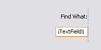
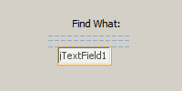
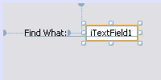
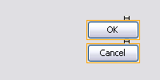

// 
//     Licensed to the Apache Software Foundation (ASF) under one
//     or more contributor license agreements.  See the NOTICE file
//     distributed with this work for additional information
//     regarding copyright ownership.  The ASF licenses this file
//     to you under the Apache License, Version 2.0 (the
//     "License"); you may not use this file except in compliance
//     with the License.  You may obtain a copy of the License at
// 
//       http://www.apache.org/licenses/LICENSE-2.0
// 
//     Unless required by applicable law or agreed to in writing,
//     software distributed under the License is distributed on an
//     "AS IS" BASIS, WITHOUT WARRANTIES OR CONDITIONS OF ANY
//     KIND, either express or implied.  See the License for the
//     specific language governing permissions and limitations
//     under the License.
//

= GUI Builder Visual Feedback Legend
:jbake-type: tutorial
:jbake-tags: tutorials 
:jbake-status: published
:icons: font
:syntax: true
:source-highlighter: pygments
:toc: left
:toc-title:
:description: GUI Builder Visual Feedback Legend - Apache NetBeans
:keywords: Apache NetBeans, Tutorials, GUI Builder Visual Feedback Legend

This document describes visual feedback the IDE's GUI Builder (formerly code-named Matisse) provides during the process of Java GUI creation.

== Alignment Guidelines

Alignment guidelines appear only when adding or moving components, indicating the preferred positions to which components snap when the mouse button is released. Once positioned, alignment guidelines are replaced by solid lines illustrating the common alignments shared among components as well as anchoring indicators.

|===
|*Inset* |image:images/legend5.png[] |Insets are the preferred spacings between components and the containers within which they are located. Insets are suggested by dashed horizontal and vertical guidelines. 

|*Offset* |image:images/legend30.png[] |Offsets are the preferred spacings between adjacent components. Offsets are suggested by dashed horizontal and vertical guidelines. 

|*Baseline* |image:images/legend13.png[] |Baseline alignment is the preferred relationship between adjacent components containing display text. Baseline alignment is suggested by dashed a horizontal guideline. 

|*Edge*

 |

image:images/legend12.png[]

image:images/legend14.png[]

image:images/legend32.png[]

 |
Edge alignments (Top, Bottom, Left, and Right) are the alignment relationships possible between adjacent components. Edge alignments are suggested by dashed horizontal and vertical guidelines. 

|*Indentation* |image:images/legend31b.png[] |Indentation alignment is a special alignment relationship in which one component is located below another and offset slightly to the right. Indentation alignment is suggested by the appearance of two vertical dashed guidelines. 

|*Preferred Distance* | |Preferred distances (Small, Medium, and Large) are gap sizes between adjacent components. Preferred distances are suggested by dashed horizontal or vertical guidelines. 
|===

== Anchoring Indicators

Once components have snapped into position, solid anchoring indicators appear illustrating the common alignments shared among components.

|===
|*Container* |image:images/legend50.png[] |Anchors connecting individual components to the containers within which they are located are represented by small semi-circular indicators with dashed lines extending from the container edge to the component itself. 

|*Component* | |Anchors connecting individual components to adjacent components are represented by small semi-circular indicators with dashed lines extending from the one component to the other. 
|===

== Sizing Indicators

|===
|*Same Size* 

| image:images/legend28.png[] 

| Same Sizing is the state in which a group of components (adjacent or otherwise) are all set to have the same width or height. Same Sizing is illustrated by the appearance of small rectangular indicators appearing on the top edge of each component for which the property is set. 

|*Auto-Resizing* 

| image:images/legend42.png[] image:images/legend41.png[] image:images/legend43.png[]

| Auto-Resizing is the state in which a component's width or height is set to resize dynamically at runtime. Auto-Resizing is indicated by the state of the horizontal and vertical Resizing buttons (called Change horizontal resizeability and Change vertical resizeability respectively) in the GUI Builder's toolbar. Auto-Resizing is enabled by selecting  ``resizable``  in the Other Properties list in the Properties window. 
|===

== Highlighting and Handles

|===
|* Highlighting* |image:images/legend10.png[] |Orange highlighting indicates where a selected component is going to be placed. 

|*Handles* |image:images/legend11.png[] |Small square resize handles appear around a component's perimeter when a component is selected. Clicking, holding, and dragging a handle on the edge of a component resizes the latter. 
|===

xref:../../../community/mailing-lists.adoc[Send Us Your Feedback]

== See Also

* link:http://www.oracle.com/pls/topic/lookup?ctx=nb8000&id=NBDAG920[+Implementing Java GUIs+] in _Developing Applications with NetBeans IDE_
* xref:../index.adoc[+General Java Development Learning Trail+]
