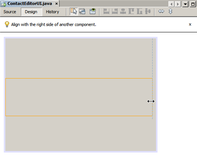
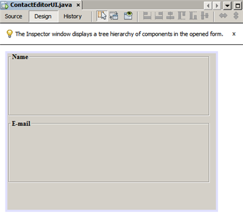
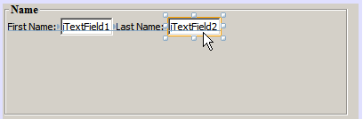
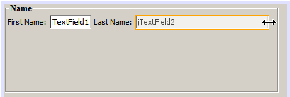
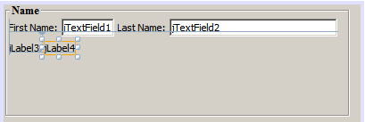
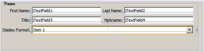
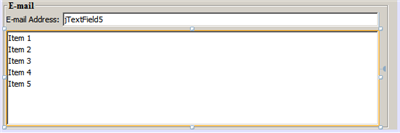
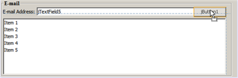
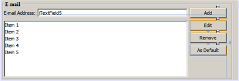

// 
//     Licensed to the Apache Software Foundation (ASF) under one
//     or more contributor license agreements.  See the NOTICE file
//     distributed with this work for additional information
//     regarding copyright ownership.  The ASF licenses this file
//     to you under the Apache License, Version 2.0 (the
//     "License"); you may not use this file except in compliance
//     with the License.  You may obtain a copy of the License at
// 
//       http://www.apache.org/licenses/LICENSE-2.0
// 
//     Unless required by applicable law or agreed to in writing,
//     software distributed under the License is distributed on an
//     "AS IS" BASIS, WITHOUT WARRANTIES OR CONDITIONS OF ANY
//     KIND, either express or implied.  See the License for the
//     specific language governing permissions and limitations
//     under the License.
//

= Designing a Swing GUI in NetBeans IDE
:jbake-type: tutorial
:jbake-tags: tutorials 
:jbake-status: published
:syntax: true
:icons: font
:source-highlighter: pygments
:toc: left
:toc-title:
:description: Designing a Swing GUI in NetBeans IDE - Apache NetBeans
:keywords: Apache NetBeans, Tutorials, Designing a Swing GUI in NetBeans IDE

This tutorial guides you through the process of creating the graphical user interface (GUI) for an application called ContactEditor using the NetBeans IDE GUI Builder. In the process you will layout a GUI front-end that enables you to view and edit contact information of individuals included in an employee database.

In this tutorial you will learn how to: use the GUI Builder Interface, create a GUI Container, add, resize, and align components, adjust component anchoring, set component auto-resizing behavior, edit component properties.

== Getting Started

The IDE's GUI Builder makes it possible to build professional-looking GUIs without an intimate understanding of layout managers. You can lay out your forms by simply placing components where you want them.

For descriptions of the GUI Builder's visual feedback, you can use the xref:quickstart-gui-legend.adoc[+GUI Builder Visual Feedback Legend+].

=== Creating a Project

Because all Java development in the IDE takes place within projects, we first need to create a new  ``ContactEditor``  project within which to store sources and other project files. An IDE project is a group of Java source files plus its associated meta data, including project-specific properties files, an Ant build script that controls the build and run settings, and a  ``project.xml``  file that maps Ant targets to IDE commands. While Java applications often consist of several IDE projects, for the purposes of this tutorial, we will build a simple application which is stored entirely in a single project.

To create a new  ``ContactEditor``  application project:

1. Choose File > New Project. Alternately, you can click the New Project icon in the IDE toolbar.
2. In the Categories pane, select the Java node and in the Projects pane, choose Java Application. Click Next.
3. Enter  ``ContactEditor``  in the Project Name field and specify the project location.
4. Leave the Use Dedicated Folder for Storing Libraries checkbox unselected.
5. Ensure that the Set as Main Project checkbox is selected and clear the Create Main Class field.
6. Click Finish.

The IDE creates the  ``ContactEditor``  folder on your system in the designated location. This folder contains all of the project's associated files, including its Ant script, folders for storing sources and tests, and a folder for project-specific metadata. To view the project structure, use the IDE's Files window.

 
=== Creating a JFrame Container

After creating the new application, you may have noticed that the Source Packages folder in the Projects window contains an empty  ``<default package>``  node. To proceed with building our interface, we need to create a Java container within which we will place the other required GUI components. In this step we'll create a container using the  ``JFrame``  component and place the container in a new package.

To add a  ``JFrame``  container:

1. In the Projects window, right-click the  ``ContactEditor``  node and choose New > JFrame Form. 
Alternatively, you can find a JFrame form by choosing New > Other > Swing GUI Forms > JFrame Form.

. Enter  ``ContactEditorUI``  as the Class Name.

. Enter  ``my.contacteditor``  as the package.

. Click Finish.

The IDE creates the  ``ContactEditorUI``  form and the  ``ContactEditorUI``  class within the  ``ContactEditorUI.java``  application and opens the  ``ContactEditorUI``  form in the GUI Builder. Notice that the  ``my.contacteditor``  package replaces the default package.

 
== Getting Familiar with the GUI Builder

Now that we've set up a new project for our application, let's take a minute to familiarize ourselves with the GUI Builder's interface.

NOTE: To explore the GUI Builder interface with an interactive demo, view the link:http://bits.netbeans.org/media/quickstart-gui-explore.swf[+Exploring GUI Builder (.swf)+] screencast.

[.feature]
--

image::images/01_gb_ui-small.png[role="left", link="images/01_gb_ui.png"]

--

When we added the JFrame container, the IDE opened the newly-created  ``ContactEditorUI``  form in an Editor tab with a toolbar containing several buttons, as shown in the preceding illustration. The ContactEditor form opened in the GUI Builder's Design view and three additional windows appeared automatically along the IDE's edges, enabling you to navigate, organize, and edit GUI forms as you build them.

The GUI Builder's various windows include:

* *Design Area. *The GUI Builder's primary window for creating and editing Java GUI forms. The toolbar's Source button enables you to view a class's source code, the Design button allows you to view a graphical view of the GUI components, the History button allows you to access the local history of changes of the file. The additional toolbar buttons provide convenient access to common commands, such as choosing between Selection and Connection modes, aligning components, setting component auto-resizing behavior, and previewing forms.
* *Navigator. *Provides a representation of all the components, both visual and non-visual, in your application as a tree hierarchy. The Navigator also provides visual feedback about what component in the tree is currently being edited in the GUI Builder as well as allows you to organize components in the available panels.
* *Palette. *A customizable list of available components containing tabs for JFC/Swing, AWT, and JavaBeans components, as well as layout managers. In addition, you can create, remove, and rearrange the categories displayed in the Palette using the customizer.
* *Properties Window. *Displays the properties of the component currently selected in the GUI Builder, Navigator window, Projects window, or Files window.

If you click the Source button, the IDE displays the application's Java source code in the Editor with sections of code that are automatically generated by the GUI Builder indicated by grey areas (they become blue when selected), called Guarded Blocks. Guarded blocks are protected areas that are not editable in Source view. You can only edit code appearing in the white areas of the Editor when in Source view. If you need to make changes to the code within a Guarded Block, clicking the Design button returns the IDE's Editor to the GUI Builder where you can make the necessary adjustments to the form. When you save your changes, the IDE updates the file's sources.

NOTE: For advanced developers, the Palette Manager is available that enables you to add custom components from JARs, libraries, or other projects to the Palette. To add custom components through the Palette Manager, choose Tools > Palette > Swing/AWT Components.

== Key Concepts

The IDE's GUI Builder solves the core problem of Java GUI creation by streamlining the workflow of creating graphical interfaces, freeing developers from the complexities of Swing layout managers. It does this by extending the current NetBeans IDE GUI Builder to support a straightforward "Free Design" paradigm with simple layout rules that are easy to understand and use. As you lay out your form, the GUI Builder provides visual guidelines suggesting optimal spacing and alignment of components. In the background, the GUI Builder translates your design decisions into a functional UI that is implemented using the new GroupLayout layout manager and other Swing constructs. Because it uses a dynamic layout model, GUI's built with the GUI Builder behave as you would expect at runtime, adjusting to accommodate any changes you make without altering the defined relationships between components. Whenever you resize the form, switch locales, or specify a different look and feel, your GUI automatically adjusts to respect the target look and feel's insets and offsets.

=== Free Design

In the IDE's GUI Builder, you can build your forms by simply putting components where you want them as though you were using absolute positioning. The GUI Builder figures out which layout attributes are required and then generates the code for you automatically. You need not concern yourself with insets, anchors, fills, and so forth.

=== Automatic Component Positioning (Snapping)

As you add components to a form, the GUI Builder provides visual feedback that assists in positioning components based on your operating system's look and feel. The GUI Builder provides helpful inline hints and other visual feedback regarding where components should be placed on your form, automatically snapping components into position along guidelines. It makes these suggestions based on the positions of the components that have already been placed in the form, while allowing the padding to remain flexible such that different target look and feels render properly at runtime.

=== Visual Feedback

The GUI Builder also provides visual feedback regarding component anchoring and chaining relationships. These indicators enable you to quickly identify the various positioning relationships and component pinning behavior that affect the way your GUI will both appear and behave at runtime. This speeds the GUI design process, enabling you to quickly create professional-looking visual interfaces that work.

== First Things First

Now that you have familiarized yourself with the GUI builder's interface, it's time to begin developing the UI of our ContactEditor application. In this section we'll take a look at using the IDE's Palette to add the various GUI components that we need to our form.

Thanks to the IDE's Free Design paradigm, you no longer have to struggle with layout managers to control the size and position of the components within your containers. All you need to do is drag and drop the components you need to your GUI form as shown in the illustrations that follow.

NOTE: Refer to the link:http://bits.netbeans.org/media/quickstart-gui-add.swf[+Adding individual and multiple components (.swf)+] screencast for an interactive demo on the section below.

=== Adding Components: The Basics

Though the IDE's GUI Builder simplifies the process of creating Java GUIs, it is often helpful to sketch out the way you want your interface to look before beginning to lay it out. Many interface designers consider this a "best practice" technique, however, for the purposes of this tutorial you can simply peek at how our completed form should look by jumping ahead to the <<previewing_form,Previewing your GUI >>section.

Since we've already added a JFrame as our form's top-level container, the next step is to add a couple of JPanels which will enable us to cluster the components of our UI using titled borders. Refer to the following illustrations and notice the IDE's "drag and drop" behavior when accomplishing this.

To add a JPanel:

1. In the Palette window, select the Panel component from the Swing Containers category by clicking and releasing the mouse button.
2. Move the cursor to the upper left corner of the form in the GUI Builder. When the component is located near the container's top and left edges, horizontal and vertical alignment guidelines appear indicating the preferred margins. Click in the form to place the JPanel in this location.

The  ``JPanel``  component appears in the  ``ContactEditorUI``  form with orange highlighting signifying that it is selected. After releasing the mouse button, small indicators appear to show the component's anchoring relationships and a corresponding JPanel node is displayed in the Navigator window, as shown in the following illustration.

 
[.feature]
--

image::images/02_add_panels_1-small.png[role="left", link="images/02_add_panels_1.png"]

--

Next, we need to resize the JPanel to make room for the components we'll place within it a little later, but let's take a minute to point out another of the GUI Builder's visualization features first. In order to do this we need to deselect the JPanel we just added. Because we haven't added a title border yet, the panel disappears. Notice, however, that when you pass the cursor over the JPanel, its edges change to light gray so that its position can be clearly seen. You need only to click anywhere within the component to reselect it and cause the resize handles and anchoring indicators to reappear.

To resize the JPanel:

1. Select the JPanel you just added. The small square resize handles reappear around the component's perimeter.
2. Click and hold the resize handle on the right edge of the JPanel and drag until the dotted alignment guideline appears near the form's edge.
3. Release the resize handle to resize the component.

The  ``JPanel``  component is extended to span between the container's left and right margins in accordance with the recommended offset, as shown in the following illustration.

 
[.feature]
--

image::images/02_add_panels_2-small.png[role="left", link="images/02_add_panels_2.png"]

--

Now that we've added a panel to contain our UI's Name information, we need to repeat the process to add another directly below the first for the E-mail information. Referring to the following illustrations, repeat the previous two tasks, paying attention to the GUI Builder's suggested positioning. Notice that the suggested vertical spacing between the two JPanels is much narrower than that at the edges. Once you have added the second JPanel, resize it such that it fills the form's remaining vertical space.

[.feature]
--

image::images/02_add_panels_3-small.png[role="left", link="images/02_add_panels_3.png"]

--

[.feature]
--

image::images/02_add_panels_4-small.png[role="left", link="images/02_add_panels_4.png"]

--

[.feature]
--

--

 
Because we want to visually distinguish the functions in the upper and lower sections of our GUI, we need to add a border and title to each JPanel. First we'll accomplish this using the Properties window and then we'll try it using the pop-up menu.

To add title borders to the JPanels:

1. Select the top JPanel in the GUI Builder.
2. In the Properties window, click the ellipsis button (...) next to the Border property.
3. In the JPanel Border editor that appears, select the TitledBorder node in the Available Borders pane.
4. In the Properties pane below, enter  ``Name``  for the Title property.
5. Click the ellipsis (...) next to the Font property, select Bold for the Font Style, and enter 12 for the Size. Click OK to exit the dialogs.
6. Select the bottom JPanel and repeat steps 2 through 5, but this time right-click the JPanel and access the Properties window using the pop-up menu. Enter  ``E-mail``  for the Title property.

Titled borders are added to both  ``JPanel``  components.

 
[.feature]
--

--

=== Adding Individual Components to the Form

Now we need to start adding the components that will present the actual contact information in our contact list. In this task we'll add four JTextFields that will display the contact information and the JLabels that will describe them. While accomplishing this, notice the horizontal and vertical guidelines that the GUI Builder displays, suggesting the preferred component spacing as defined by your operating system's look and feel. This ensures that your GUI is automatically rendered respecting the target operating system's look and feel at runtime.

To add a JLabel to the form:

1. In the Palette window, select the Label component from the Swing Controls category.
2. Move the cursor over the  ``Name``  JPanel we added earlier. When the guidelines appear indicating that the JLabel is positioned in the top left corner of the JPanel with a small margin at the top and left edges, click to place the label.

The JLabel is added to the form and a corresponding node representing the component is added to the Inspector window.

 

Before going further, we need to edit the display text of the JLabel we just added. Though you can edit component display text at any point, the easiest way is to do this as you add them.

To edit the display text of a JLabel:

1. Double-click the JLabel to select its display text.
2. Type  ``First Name:``  and press Enter.

The JLabel's new name is displayed and the component's width adjusts as a result of the edit.

 
Now we'll add a JTextField so we can get a glimpse of the GUI Builder's baseline alignment feature.

To add a JTextField to the form:

1. In the Palette window, select the Text Field component from the Swing Controls category.
2. Move the cursor immediately to the right of the  ``First Name:``  JLabel we just added. When the horizontal guideline appears indicating that the JTextField's baseline is aligned with that of the JLabel and the spacing between the two components is suggested with a vertical guideline, click to position the JTextField.

The JTextField snaps into position in the form aligned with the JLabel's baseline, as shown in the following illustration. Notice that the JLabel shifted downward slightly in order to align with the taller text field's baseline. As usual, a node representing the component is added to the Navigator window.

 
image::images/03_indy_add_1.png[]

Before proceeding further, we need to add an additional JLabel and JTextField immediately to the right of those we just added, as shown in the following illustration. This time enter  ``Last Name:``  as the JLabel's display text and leave the JTextFields' placeholder text as it is for now.

To resize a JTextField:

1. Select the JTextField we just added to the right of the  ``Last Name:``  JLabel.
2. Drag the JTextField's right edge resize handle toward the right edge of the enclosing JPanel.
3. When the vertical alignment guidelines appear suggesting the margin between the text field and right edge of the JPanel, release the mouse button to resize the JTextField.

The JTextField's right edge snaps into alignment with the JPanel's recommended edge margin, as shown in the following illustration.

 

=== Adding Multiple Components to the Form

Now we'll add the  ``Title:``  and  ``Nickname:``  JLabels that describe two JTextFields that we're going to add in a minute. We'll drag and drop the components while pressing the Shift key, to quickly add them to the form. While accomplishing this, again notice that the GUI Builder displays horizontal and vertical guidelines suggesting the preferred component spacing.

To add multiple JLabels to the form:

1. In the Palette window, select the Label component from the Swing Controls category by clicking and releasing the mouse button.
2. Move the cursor over the form directly below the  ``First Name:``  JLabel we added earlier. When the guidelines appear indicating that the new JLabel's left edge is aligned with that of the JLabel above and a small margin exists between them, shift-click to place the first JLabel.
3. While still pressing the Shift key, place another JLabel immediately to the right of the first. Make certain to release the Shift key prior to positioning the second JLabel. If you forget to release the Shift key prior to positioning the last JLabel, simply press the Escape key.

The JLabels are added to the form creating a second row, as shown in the following illustration. Nodes representing each component are added to the Navigator window.

 

Before moving on, we need to edit the JLabels' name so that we'll be able to see the effect of the alignments we'll set later.

To edit the display text of JLabels:

1. Double-click the first JLabel to select its display text.
2. Type  ``Title:``  and press Enter.
3. Repeat steps 1 and 2, entering  ``Nickname:``  for the second JLabel's name property.

The JLabels' new names are displayed in the form and are shifted as a result of their edited widths, as shown in the following illustration.

 
image::images/04_multi-add_2.png[]

=== Inserting Components

NOTE: Refer to the link:http://bits.netbeans.org/media/quickstart-gui-insert.swf[+Inserting components (.swf)+] screencast for an interactive demo on the section below.

Often it is necessary to add a component between components that are already placed in a form. Whenever you add a component between two existing components, the GUI Builder automatically shifts them to make room for the new component. To demonstrate this, we'll insert a JTextField between the JLabels we added previously, as shown in the following two illustrations.

To insert a JTextField between two JLabels:

1. In the Palette window, select the Text Field component from the Swing Controls category.
2. Move the cursor over the  ``Title:``  and  ``Nickname:``  JLabels on the second row such that the JTextField overlaps both and is aligned to their baselines. If you encounter difficulty positioning the new text field, you can snap it to the left guideline of the  ``Nickname``  JLabel as shown in the first image below.
3. Click to place the JTextField between the  ``Title:``  and  ``Nickname:``  JLabels.

The JTextField snaps into position between the two JLabels. The rightmost JLabel shifts toward the right of the JTextField to accommodate the suggested horizontal offset.

 

image::images/05_insert_1.png[]

image::images/05_insert_2.png[]

We still need to add one additional JTextField to the form that will display each contact's nickname on the right side of the form.

To add a JTextField:

1. In the Palette window, select the Text Field component from the Swing category.
2. Move the cursor to the right of the  ``Nickname``  label and click to place the text field.

The JTextField snaps into position next to the JLabel on its left.

 
To resize a JTextField:

1. Drag the resize handles of the  ``Nickname:``  label's JTextField you added in the previous task toward the right of the enclosing JPanel.
2. When the vertical alignment guidelines appear suggesting the margin between the text field and JPanel edges, release the mouse button to resize the JTextField.

The JTextField's right edge snaps into alignment with the JPanel's recommended edge margin and the GUI Builder infers the appropriate resizing behavior.

. Press Ctrl-S to save the file.

== Moving Forward

Alignment is one of the most fundamental aspects of creating professional-looking GUIs. In the previous section we got a glimpse of the IDE's alignment features while adding the JLabel and JTextField components to our ContactEditorUI form. Next, we'll take a more in depth look at the GUI Builder's alignment features as we work with the various other components we need for our application.

=== Component Alignment

NOTE: Refer to the link:http://bits.netbeans.org/media/quickstart-gui-align.swf[+Aligning and anchoring components (.swf)+] screencast for an interactive demo on the sections below.

Every time you add a component to a form, the GUI Builder effectively aligns them, as evidenced by the alignment guidelines that appear. It is sometimes necessary, however, to specify different relationships between groups of components as well. Earlier we added four JLabels that we need for our ContactEditor GUI, but we didn't align them. Now we'll align the two columns of JLabels so that their right edges line up.

To align components:

1. Hold down the  ``Ctrl``  key and click to select the  ``First Name:``  and  ``Title:``  JLabels on the left side of the form.
2. Click the Align Right in Column button (image:images/align_r.png[]) in the toolbar. Alternately, you can right-click either one and choose Align > Right in Column from the pop-up menu.
3. Repeat this for the  ``Last Name:``  and  ``Nickname:``  JLabels as well.

The JLabels' positions shift such that the right edges of their display text are aligned. The anchoring relationships are updated, indicating that the components have been grouped.

 

Before we're finished with the JTextFields we added earlier, we need to make sure that the two JTextFields we inserted between the JLabels are set to resize correctly. Unlike the two JTextFields that we stretched to the right edge of our form, inserted components' resizeability behavior isn't automatically set.

To set component resizeability behavior:

1. Control-click the two inserted JTextField components to select them in the GUI Builder.
2. With both JTextFields selected, right-click either one of them and choose Auto Resizing > Horizontal from the pop-up menu.

The JTextFields are set to resize horizontally at runtime. The alignment guidelines and anchoring indicators are updated, providing visual feedback of the component relationships.

 

To set components to be the same size:

1. Control-click all four of the JTextFields in the form to select them.
2. With the JTextFields selected, right-click any one of them and choose Set Same Size > Same Width from the pop-up menu.

The JTextFields are all set to the same width and indicators are added to the top edge of each, providing visual feedback of the component relationships.

 

Now we need to add another JLabel describing the JComboBox that will enable users to select the format of the information our ContactEditor application will display.

To align a JLabel to a component group:

1. In the Palette window, select the Label component from the Swing category.
2. Move the cursor below the  ``First Name``  and  ``Title``  JLabels on the left side of the JPanel. When the guideline appears indicating that the new JLabel's right edge is aligned with the right edges of the component group above (the two JLabels), click to position the component.

The JLabel snaps into a right-aligned position with the column of JLabels above, as shown in the following illustration. The GUI Builder updates the alignment status lines indicating the component's spacing and anchoring relationships.

 

[.feature]
--

image::images/06_align_1-small.png[role="left", link="images/06_align_1.png"]

--

As in the previous examples, double-click the JLabel to select its display text and then enter  ``Display Format:``  for the display name. Notice that when the JLabel snaps into position, the other components shift to accommodate the longer display text.

=== Baseline Alignment

Whenever you add or move components that include text (JLabels, JTextFields, and so forth), the IDE suggests alignments which are based on the baselines of the text in the components. When we inserted the JTextField earlier, for example, its baseline was automatically aligned to the adjacent JLabels.

Now we'll add the combo box that will enable users to select the format of the information that our ContactEditor application will display. As we add the JComboBox, we'll align its baseline to that of the JLabel's text. Notice once again the baseline alignment guidelines that appear to assist us with the positioning.

To align the baselines of components:

1. In the Palette window, select the Combo Box component from the Swing Controls category.
2. Move the cursor immediately to the right of the JLabel we just added. When the horizontal guideline appears indicating that the JComboBox's baseline is aligned with the baseline of the text in the JLabel and the spacing between the two components is suggested with a vertical guideline, click to position the combo box.

The component snaps into a position aligned with the baseline of the text in the JLabel to its left, as shown in the following illustration. The GUI Builder displays status lines indicating the component's spacing and anchoring relationships.

 

[.feature]
--

image::images/06_align_2-small.png[role="left", link="images/06_align_2.png"]

--

To resize the JComboBox:

1. Select the ComboBox in the GUI Builder.
2. Drag the resize handle on the JComboBox's right edge toward the right until the alignment guidelines appear suggesting the preferred offset between the JComboBox and JPanel edges.

As shown in the following illustration, the JComboBox's right edge snaps into alignment with the JPanel's recommended edge margin and the component's width is automatically set to resize with the form.

[.feature]
--

--

. Press Ctrl-S to save the file.
 

Editing component models is beyond the scope of this tutorial, so for the time being we'll leave the JComboBox's placeholder item list as it is.

== Reviewing What We've Learned

We've got off to a good start building our ContactEditor GUI, but let's take a minute to recap what we've learned while we add a few more of the components our interface requires.

Until now we've concentrated on adding components to our ContactEditor GUI using the IDE's alignment guidelines to help us with positioning. It is important to understand, however, that another integral part of component placement is anchoring. Though we haven't discussed it yet, you've already taken advantage of this feature without realizing it. As mentioned previously, whenever you add a component to a form, the IDE suggests the target look and feel's preferred positioning with guidelines. Once placed, new components are also anchored to the nearest container edge or component to ensure that component relationships are maintained at runtime. In this section, we'll concentrate on accomplishing the tasks in a more streamlined fashion while pointing out the work the GUI builder is doing behind the scenes.

=== Adding, Aligning, and Anchoring

The GUI Builder enables you to lay out your forms quickly and easily by streamlining typical workflow gestures. Whenever you add a component to a form, the GUI Builder automatically snaps them into the preferred positions and sets the necessary chaining relationships so you can concentrate on designing your forms rather than struggling with complicated implementation details.

To add, align, and edit the display text of a JLabel:

1. In the Palette window, select the Label component from the Swing Controls category.
2. Move the cursor over the form immediately below the bottom JPanel's E-mail title. When the guidelines appear indicating that it's positioned in the top left corner of the JPanel with a small margin at the top and left edges, click to place the JLabel.
3. Double-click the JLabel to select its display text. Then type  ``E-mail Address: ``  and press Enter.

The JLabel snaps into the preferred position in the form, anchored to the top and left edges of the enclosing JPanel. Just as before, a corresponding node representing the component is added to the Navigator window.

 

To add a JTextField:

1. In the Palette window, select the Text Field component from the Swing Controls category.
2. Move the cursor immediately to the right of the  ``E-mail Address``  label we just added. When the guidelines appear indicating that the JTextField's baseline is aligned with the baseline of the text in the JLabel and the margin between the two components is suggested with a vertical guideline, click to position the text field.

The JTextField snaps into position on the right of the  ``E-mail Address:``  JLabel and is chained to the JLabel. Its corresponding node is also added to the Inspector window.

. Drag the resize handle of the JTextField toward the right of the enclosing JPanel until the alignment guidelines appear suggesting the offset between the JTextField and JPanel edges.

The JTextField's right edge snaps to the alignment guideline indicating the preferred margins.

 

Now we need to add the JList that will display our ContactEditor's entire contact list.

To add and resize a JList:

1. In the Palette window, select the List component from the Swing Controls category.
2. Move the cursor immediately below the  ``E-mail Address``  JLabel we added earlier. When the guidelines appear indicating that the JList's top and left edges are aligned with the preferred margins along the JPanel's left edge and the JLabel above, click to position the JList.
3. Drag the JList's right resize handle toward the right of the enclosing JPanel until the alignment guidelines appear indicating that it is the same width as the JTextField above.

The JList snaps into the position designated by the alignment guidelines and its corresponding node is displayed in the Inspector window. Notice also that the form expands to accommodate the newly added JList.

 

[.feature]
--

--

Since JLists are used to display long lists of data, they typically require the addition of a JScrollPane. Whenever you add a component which requires a JScrollPane, the GUI Builder automatically adds it for you. Because JScrollPanes are non-visual components, you have to use the Inspector window in order to view or edit any JScrollPanes that the GUI Builder created.

=== Component Sizing

NOTE: Refer to the link:http://bits.netbeans.org/media/quickstart-gui-resize.swf[+Resizing and indenting components (.swf)+] screencast for an interactive demo on the sections below.

It is often beneficial to set several related components, such as buttons in modal dialogues, to be the same size for visual consistency. To demonstrate this we'll add four JButtons to our ContactEditor form that will allow us to add, edit, and remove individual entries from our contact list, as shown in the following illustrations. Afterwards, we'll set the four buttons to be the same size so they can be easily recognized as offering related functionality.

To add, align, and edit the display text of multiple buttons:

1. In the Palette window, select the Button component from the Swing Controls category.
2. Move the JButton over the right edge of the  ``E-mail Address``  JTextField in the lower JPanel. When the guidelines appear indicating that the JButton's baseline and right edge are aligned with that of the JTextField, shift-click to place the first button along the JFrame's right edge. The JTextField's width shrinks to accommodate the JButton when you release the mouse button.

[.feature]
--

--

[.feature]
--

image::images/buttons_2-small.png[role="left", link="images/buttons_2.png"]

--

 

. Move the cursor over the top right corner of the JList in the lower JPanel. When the guidelines appear indicating that the JButton's top and right edges are aligned with that of the JList, shift-click to place the second button along the JFrame's right edge.

[.feature]
--

image::images/buttons_3-small.png[role="left", link="images/buttons_3.png"]

--

. Add two additional JButtons below the two we already added to create a column. Make certain to position the JButtons such that the suggested spacing is respected and consistent. If you forget to release the Shift key prior to positioning the last JButton, simply press the Escape key.

[.feature]
--

image::images/buttons_4-small.png[role="left", link="images/buttons_4.png"]

--

. Set the display text for each JButton. (You can edit a button's text by right-clicking the button and choosing Edit Text. Or you can click the button, pause, and then click again.) Enter `Add` for the top button, `Edit` for the second, `Remove` for the third, and `As Default` for the fourth.

The JButton components snap into the positions designated by the alignment guidelines. The width of the buttons changes to accommodate the new names.

[.feature]
--

image::images/buttons_5-small.png[role="left", link="images/buttons_5.png"]

--

 

Now that the buttons are positioned where we want them, we'll set the four buttons to be the same size for visual consistency as well as to clarify that they are related functionally.

To set components to the same size:

1. Select all four JButtons by pressing the Control key while making your selection.
2. Right-click one of them and choose Same Size > Same Width from the pop-up menu.

The JButtons are set to the same size as the button with the longest name.

[.feature]
--

--

 

=== Indentation

Often it is necessary to cluster multiple components under another component such that it is clear they belong to a group of related functions. One typical case, for example, is placing several related checkboxes below a common label. The GUI Builder enables you to accomplish indenting easily by providing special guidelines suggesting the preferred offset for your operating system's look and feel.

In this section we'll add a few JRadioButtons below a JLabel that will allow users to customize the way the application displays data. Refer to the following illustrations while accomplishing this or click the View Demo link following the procedure to view an interactive demonstration.

To indent JRadioButtons below a JLabel:

1. Add a JLabel named  ``Mail Format``  to the form below the JList. Make certain the label is left aligned with the JList above.
2. In the Palette window, select the Radio Button component from the Swing category.
3. Move the cursor below the JLabel that we just added. When the guidelines appear indicating that the JRadioButton's left edge is aligned with that of the JLabel, move the JRadioButton slightly to the right until secondary indentation guidelines appear. Shift-click to place the first radio button.

[.feature]
--

image::images/07_indent_1-small.png[role="left", link="images/07_indent_1.png"]

--

. Move the cursor to the right of the first JRadioButton. Shift-click to place the second and third JRadioButtons, being careful to respect the suggested component spacing. Make certain to release the Shift key prior to positioning the last JRadioButton.

. Set the display text for each JRadioButton. (You can edit a button's text by right-clicking the button and choosing Edit Text. Or you can click the button, pause, and then click again.) Enter `HTML` for the left radio button, `Plain Text ` for the second, and `Custom` for the third.

Three JRadioButtons are added to the form and indented below the  ``Mail Format``  JLabel.

[.feature]
--

image::images/07_indent_3-small.png[role="left", link="images/07_indent_3.png"]

--

 

Now we need to add the three JRadioButtons to a ButtonGroup to enable the expected toggle behavior in which only one radio button can be selected at a time. This will, in turn, ensure that our ContactEditor application's contact information will be displayed in the mail format of our choosing.

To add JRadioButtons to a ButtonGroup:

1. In the Palette window, select the Button Group component from the Swing Controls category.
2. Click anywhere in the GUI Builder design area to add the ButtonGroup component to the form. Notice that the ButtonGroup does not appear in the form itself, however, it is visible in the Navigator's Other Components area.
3. Select all three of the JRadioButtons in the form.
4. In the Properties window, choose buttonGroup1 from the buttonGroup property combo box.

Three JRadioButtons are added to the button group.

[.feature]
--

image::images/07_group-small.png[role="left", link="images/07_group.png"]

--

. Press Ctrl-S to save the file.
 

== Making the Final Adjustments

We've managed to rough out our ContactEditor application's GUI, but there are still a few things remaining to do. In this section, we'll take a look at a couple of other typical layout tasks that the GUI Builder streamlines.

=== Finishing Up

Now we need to add the buttons that will enable users to confirm the information they enter for an individual contact and add it to the contact list or cancel, leaving the database unchanged. In this step, we'll add the two required buttons and then edit them so that they appear the same size in our form even though their display text are different lengths.

To add and edit the display text of buttons:

1. If the lower JPanel is extended to the bottom edge of the JFrame form, drag the bottom edge of the JFrame down. This gives you space between the edge of the JFrame and the edge of the JPanel for your OK and Cancel buttons.
2. In the Palette window, select the Button component from the Swing Controls category.
3. Move the cursor over the form below the E-mail JPanel. When the guidelines appear indicating that the JButton's right edge is aligned with the lower right corner of the JFrame, click to place the button.

[.feature]
--

image::images/08_cancel-small.png[role="left", link="images/08_cancel.png"]

--

. Add another JButton to the left of the first, making certain to place it using the suggested spacing along the JFrame's bottom edge.

. Set the display text for each JButton. Enter  ``OK``  for the left button and  ``Cancel``  for right one. Notice that the width of the buttons changes to accommodate the new names.

. Set the two JButtons to be the same size by selecting both, right-clicking either, and choosing Same Size > Same Width from the pop-up menu.

[.feature]
--

image::images/08_same_size-small.png[role="left", link="images/08_same_size.png"]

--

The  ``JButton``  components appear in the form and their corresponding nodes are displayed in the Navigator window. The  ``JButton``  components' code is also added to the form's source file which is visible in the Editor's Source view. Each of the JButtons are set to the same size as the button with the longest name.

. Press Ctrl-S to save the file.
 

The last thing we need to do is delete the placeholder text in the various components. Note that while removing placeholder text after roughing out a form can be a helpful technique in avoiding problems with component alignments and anchoring relationships, most developers typically remove this text in the process of laying out their forms. As you go through the form, select and delete the placeholder text for each of the JTextFields. We'll leave the placeholder items in both the JComboBox and JList for a later tutorial.

== Previewing Your GUI

Now that you have successfully built the ContactEditor GUI, you can try your interface to see the results. You can preview your form as you work by clicking the Preview Form button (image:images/test_form.png[]) in the GUI Builder's toolbar. The form opens in its own window, allowing you to test it prior to building and running.

[.feature]
--

image::images/08_preview_gui-small.png[role="left", link="images/08_preview_gui.png"]

--

== Deploying GUI Applications

In order for the interfaces you create with the GUI Builder to work outside of the IDE, the application must be compiled against classes for the GroupLayout layout manager and also have those classes available at runtime. These classes are included in Java SE 6, but not in Java SE 5. If you develop the application to run on Java SE 5, your application needs to use the Swing Layout Extensions library.

If you are running the IDE on JDK 5, the IDE automatically generates your application code to use the Swing Layout Extensions library. When you deploy the application, you need to include the Swing Layout Extensions library with the application. When you build the application (Build > Build Main Project), the IDE automatically provides a copy of the library's JAR file in the application's  ``dist/lib``  folder. The IDE also adds each of the JAR files that are in the  ``dist``  folder to the  ``Class-Path``  element in the application JAR file's  ``manifest.mf``  file.

If you are running the IDE on JDK 6, the IDE generates your application code to use the GroupLayout classes that are in Java SE 6. This means that you can deploy the application to run on systems with Java SE 6 installed and you do not need to package your application with the Swing Layout Extensions library.

NOTE: If you create your application using JDK 6 but you need the application to also run on Java SE 5, you can have the IDE generate its code to use the Swing Layout Extensions library instead of the classes in Java SE 6. Open the ContactEditorUI class in the GUI Editor. In the Navigator, right-click the Form ContactEditorUI node and choose Properties in the popup menu. In the Properties dialog box, change the value of the Layout Generation Style property to Swing Layout Extensions Library.

=== Distributing and Running Standalone GUI Applications

To prepare your GUI application for distribution outside of the IDE:

* Zip the project's  ``dist``  folder into a ZIP archive. (The  ``dist``  folder might also contain a  ``lib``  folder, which you would also need to include.)

To run your application, right-click the project name and select Run in the context menu. In the Run Project dialog select the main class name ( ``my.contacteditor.ContactEditorUI``  if speaking about the project you have just created) and click OK. Your application is up and running.

To run a standalone GUI application from the command line:

1. Navigate to the project's  ``dist``  folder.
2. Type the following:

[source,bash]
----
 ``java -jar <jar_name>.jar`` 
----

NOTE: If you encounter the following error:

[source,bash]
----
Exception in thread "main" java.lang.NoClassDefFoundError: org/jdesktop/layout/GroupLayout$Group
----

Ensure that the  ``manifest.mf``  file references the currently installed version of the Swing Layout Extensions Library.

