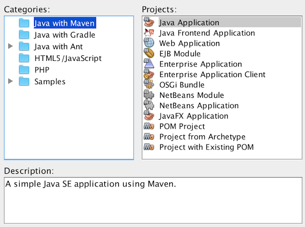
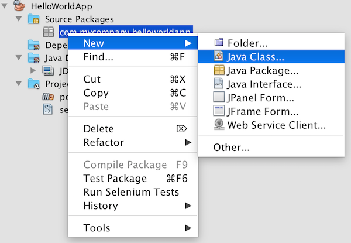
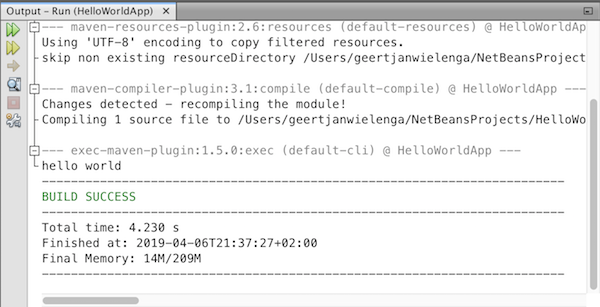

// 
//     Licensed to the Apache Software Foundation (ASF) under one
//     or more contributor license agreements.  See the NOTICE file
//     distributed with this work for additional information
//     regarding copyright ownership.  The ASF licenses this file
//     to you under the Apache License, Version 2.0 (the
//     "License"); you may not use this file except in compliance
//     with the License.  You may obtain a copy of the License at
// 
//       http://www.apache.org/licenses/LICENSE-2.0
// 
//     Unless required by applicable law or agreed to in writing,
//     software distributed under the License is distributed on an
//     "AS IS" BASIS, WITHOUT WARRANTIES OR CONDITIONS OF ANY
//     KIND, either express or implied.  See the License for the
//     specific language governing permissions and limitations
//     under the License.
//

= Java Quick Start Tutorial
:jbake-type: tutorial
:jbake-tags: tutorials 
:jbake-status: published
:syntax: true
:icons: font
:source-highlighter: pygments
:icons: font
:toc: left
:toc-title:
:description: NetBeans IDE Java Quick Start Tutorial - Apache NetBeans
:keywords: Apache NetBeans, Tutorials, NetBeans IDE Java Quick Start Tutorial
:reviewed: 2019-04-06
:experimental:

Welcome to Apache NetBeans IDE!

In this tutorial, which should take about 10 minutes to complete, you are given a quick introduction to the basic Java development workflow in NetBeans IDE. 

NOTE: The aim of this tutorial is to get you started with Java development with Maven in NetBeans IDE. Though not needed to complete this tutorial, to get started understanding and working with the Java language itself, see the link:https://docs.oracle.com/javase/tutorial/index.html[Java Tutorials], and to understand Maven, the link:https://maven.apache.org[Apache Maven Website].

== Setting Up the Project 

Take the steps below to set up a new Java project.

1. In the IDE, choose File > New Project or click the "New Project" button in the toolbar.

. In the New Project wizard, select Java Application, as shown in the figure below. Then click Next.

[.feature]
--

--

NOTE: The first time you create a new Java project, you will be prompted to download and enable support for Java. Follow the prompts and install as recommended by the wizard.

. In the Name and Location page of the wizard, type `HelloWorldApp` in the Project Name field, (as shown in the figure below):

[.feature]
--

image::images/proj-wizard2-maven-small.png[role="left", link="images/proj-wizard2-maven.png"]

--
Click Finish.

The project is created and opened. 

== Creating a Java Source File

Right-click the package name and choose New | Java Class, (as shown in the figure below):

[.feature]
--

--

In the New Java Class wizard, type `Main` in the Class Name field, (as shown in the figure below): 

[.feature]
--

image::images/proj-wizard4-maven-small.png[role="left", link="images/proj-wizard4-maven.png"]

--

Click Finish.

The Java source file is created and opened. 

You should see the following components, (as shown in the figure below):

*  *Projects window:* Top left, contains a tree view of the components of the project, including source files, libraries that your code depends on, and so on.
*  *Source Editor:* Central area, contains files, where most of your work will be done, currently with a Java source file called `Main` open.
*  *Navigator:* Lower left, useful for quickly navigating between elements within the selected class.

[.feature]
--

image::images/proj-opened-maven-small.png[role="left", link="images/proj-opened-maven.png"]

--

== Adding Code to the Java Source File

A skeleton main class has been created for you. Let's add some basic content to produce a 'hello world' message.

1. Between the braces, type `psvm` and press kbd:[Tab]. You should now see `public static void main` statement. 

. Within the `public static void main` statement, type `sout` and press kbd:[Tab]. You should now see a `System.out.println` statement.

. Within the quotation marks, type `hello world`. 

You should now see the following:

[.feature]
--

image::images/file-opened-maven-small.png[role="left", link="images/file-opened-maven.png"]

--

Notice that when you press kbd:[Ctrl+Space], the editor shows you multiple ways of completing the code at the cursor, as well as related documentation:

[.feature]
--

image::images/editor-cc-maven2-small.png[role="left", link="images/editor-cc-maven2.png"]

--

For a full description of editor assistance features, see xref:editor-codereference.adoc[Code Assistance in the NetBeans IDE Java Editor: A Reference Guide].

== Running the Application

Make sure to save the Java source file, right-click the project and choose Run or choose Run Project under the Run menu. Click Select Main Class.

In the Output window (which can be opened from the Window menu), you should see the below.

Congratulations! Your application works.

You can view the build output by opening the Files window (from the Window menu) and expanding the `target` node.

You now know how to accomplish the most common Java development tasks. To learn the complete Java development workflow, including testing and debugging, see xref:javase-intro.adoc[Developing General Java Applications].
