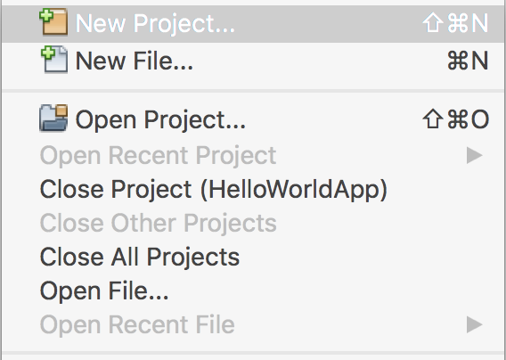
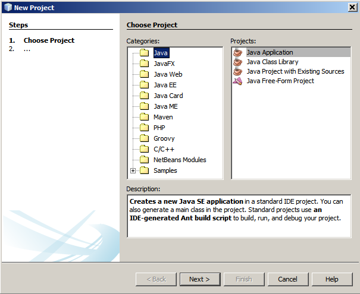
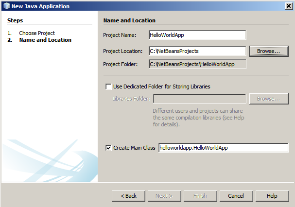
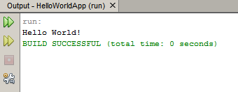

// 
//     Licensed to the Apache Software Foundation (ASF) under one
//     or more contributor license agreements.  See the NOTICE file
//     distributed with this work for additional information
//     regarding copyright ownership.  The ASF licenses this file
//     to you under the Apache License, Version 2.0 (the
//     "License"); you may not use this file except in compliance
//     with the License.  You may obtain a copy of the License at
// 
//       http://www.apache.org/licenses/LICENSE-2.0
// 
//     Unless required by applicable law or agreed to in writing,
//     software distributed under the License is distributed on an
//     "AS IS" BASIS, WITHOUT WARRANTIES OR CONDITIONS OF ANY
//     KIND, either express or implied.  See the License for the
//     specific language governing permissions and limitations
//     under the License.
//

= Guia d'inici ràpid a Java en l'IDE NetBeans
:jbake-type: tutorial
:jbake-tags: tutorials 
:jbake-status: published
:icons: font
:syntax: true
:source-highlighter: pygments
:toc: left
:toc-title:
:description: Guia d'inici ràpid a Java en l'IDE NetBeans - Apache NetBeans
:keywords: Apache NetBeans, Tutorials, Guia d'inici ràpid a Java en l'IDE NetBeans

Benvinguts a l'IDE NetBeans!

Aquesta guia d'aprenentatge proporciona una introducció molt senzilla i ràpida al flux de treball de l'IDE NetBeans, tot passant a través de la creació d'una aplicació senzilla de consola Java de "Hola món!!". Un cop hagueu finalitzat aquesta guia d'aprenentatge, tindreu un coneixement general de com crear i executar aplicacions en l'IDE.

Aquesta guia d'aprenentatge pren menys de 10 minuts per a completar-se.

Un cop hagueu finalitzat aquesta guia d'aprenentatge, podeu dirigir-vos als camins d'aprenentatge, els quals estan enllaçats des de la pàgina de link:../../index.html[+Documentació, Formació i Suport+]. Els camins d'aprenentatge proporcionen guies assimilables que remarquen un ampli ventall de característiques de l'IDE i tècniques de programació per a una varietat de tipus d'aplicació. Si no voleu realitzar l'aplicació "Hola món!", us podeu saltar aquesta guia d'aprenentatge i dirigir-vos als camins d'aprenentatge.

*Continguts*

image::../../../images_www/articles/68/netbeans-stamp.gif[title="El contingut d'aquesta pàgina s'aplica a l'IDE NetBeans 6.5"]

* <<setup,Configurant el projecte>>
* <<code,Afegint codi al fitxer font generat>>
* <<run,Compilant i executant l'aplicació>>
* <<build,Construint i desplegant l'aplicació>>
* <<nextsteps,Passos següents>>

*Per a completar aquesta guia d'aprenentatge, necessiteu el següent programari i els següents recursos*

|===
|Programari o Recurs |Versió necessària 

|link:https://netbeans.org/downloads/index.html[+IDE NetBeans+] |versió 6.8 

|link:http://java.sun.com/javase/downloads/index.jsp[+Kit de desenvolupament de Java(JDK)+] |versió 6 o
versió 5 
|===

== Configurant el projecte 

Per crear un projecte en l'IDE:

1. Inicieu l'IDE NetBeans.
2. En l'IDE, seleccioneu Fitxer > Nou projecte (Ctrl-Maj-N), tal com es mostra en la següent figura.

. En l'assistent de Nou projecte, expandiu la categoria Java i seleccioneu Aplicació Java, tal com es mostra en la següent figura. Després cliqueu a Següent. 

. En la pàgina del nom i la localització de l'assistent, feu el següent (com es mostra en la següent figura):
* En el camp del nom del projecte, escriviu `HelloWorldApp`.
* Deixeu sense marcar la casella de selecció, Utilitzar una carpeta dedicada per a emmagatzemar les biblioteques.
* En el camp Crear la classe principal, escriviu `helloworldapp.HelloWorldApp`.
* Deixeu sense marcar la casella de selecció, Establir com a projecte principal.

. Cliqueu a Finalitzar

Es crea el projecte i s'obre a l'IDE. Hauríeu de visualitzar els següent components:

* La finestra Projectes, la qual conté una visualització en arbre dels components del projecte, incloent els fitxers font, les biblioteques les quals el vostre codi en depèn, i d'altres.
* La finestra d'edició de codi amb un fitxer obert anomenat `HelloWorldApp`.
* La finestra Navegador, que podeu utilitzar-la per a navegar ràpidament entre els elements sense seleccionar la classe.
* La finestra Tasques, la qual llista els errors de compilació així com altres tasques que estiguin marcades amb les paraules clau XXX i TODO.

image::images/proj-opened.png[]

== Afegint codi al fitxer font generat

Degut a que heu deixat la casella, Crear la classe principal, en l'assistent Nou projecte, l'IDE us ha creat l'esquelet de la classe. Podeu afegir el missatge "Hola món!" al codi de l'esquelet tot substituint la línia:

[source,java]
----

            // TODO code application logic here
        
----

amb la línia:

[source,java]
----

            System.out.println("Hola món!");
        
----

Deseu els canvis amb Fitxer > Desar.

El fitxer s'hauria de semblar al següent codi.

[source,java]
----

/*
 * To change this template, choose Tools | Templates
 * and open the template in the editor.
 */

package helloworldapp;

/**
 *
 * @author <your name>
 */
public class HelloWorldApp {

    /**
     * @param args the command line arguments
     */
    public static void main(String[] args) {
            System.out.println("Hola món!");
    }

}

        
----

== Compilant i executant el programa

Degut a la característica de compilar al desar, no teniu que compilar manualment el vostre projecte en ordre d'executa'l en l'IDE. Quant deseu el fitxer font java, l'IDE automàticament el compila.

*Per executar el programa:*

* Seleccioneu Execució > Executar projecte principal (F6).

La següent figura mostra el que hauríeu de visualitzar.

Enhorabona! El vostre programa funciona!

Si hi han errors de compilació, hi haurien marques amb símbols vermells als cantons dret i esquerra de l'editor de codi. Els símbols en el marge esquerra indiquen els errors per a les línies corresponents. Els símbols en el marge dret mostren totes les àrees del fitxer que contenen errors, incloent els errors en línies que no estan visibles. Podeu desplaçar el ratolí pel damunt d'una marca d'error per a obtenir la descripció de l'error. Podeu clicar un símbol en el cantó dret per a saltar a la línia amb l'error.

== Construint i desplegant l'aplicació

Un cop hagueu escrit i provat la vostra aplicació, podeu utilitzar la comanda Netejar i construir, per a construir la vostra aplicació per al desplegament. Quant utilitzeu la comanda Netejar i construir, l'IDE executa un script de construcció que realitza les següents tasques:

* Elimina qualsevol fitxer compilat en anterioritat i altres sortides de construcció.
* Torna a compilar l'aplicació o construeix un fitxer JAR que conté els fitxers compilats.

*Per a construir la vostra aplicació:*

* Seleccioneu Execució > Netejar i Construir proj. principal (Maj-F11).

Podeu visualitzar la sortida de la construcció tot obrint la finestra Fitxers i expandint el node HelloWorldApp. El fitxer compilat amb bytecode `HelloWorldApp.class` està dins del subnode `build/classes/helloworldapp`. Un fitxer JAR desplegable que conté `HelloWorldApp.class` està dins del node `dist`.

image::images/files-window.png[]

link:/about/contact_form.html?to=3&subject=Feedback: NetBeans IDE 6.8 Java Quick Start Guide[+Envia'ns la vostra opinió+]

== Passos següents

Ara ja sabeu com dur a terme algunes de les tasques més comuns en l'IDE.

Per a aprendre més quant al flux de treball de l'IDE per al desenvolupament d'aplicacions Java, incloent la gestió del classpath, vegeu link:javase-intro.html[+Desenvolupant i desplegant Aplicacions generals Java+].

Per a trobar informació específica al tipus d'aplicació que esteu desenvolupant, utilitzeu els camins d'aprenentatge de l'IDE NetBeans per a aquest tipus d'aplicació. Cadascun dels camins d'aprenentatge conté una sèrie de guies d'aprenentatge que inclouen un ventall des de l'àmbit senzill al més l'avançat. Estan disponibles els següents camins d'aprenentatge:

|===
|* link:../../trails/java-se_ca.html[+Desenvolupament general Java +]
* link:../../trails/tools_ca.html[+Integració amb eines i serveis externs+]
* link:../../trails/matisse_ca.html[+Interfícies gràfiques d'usuari Java i JavaFX+]
* link:../../trails/web_ca.html[+Aplicacions web Java+]
* link:../../trails/java-ee_ca.html[+Aplicacions EJB i serveis web+]
 |

* link:../../trails/php_ca.html[+Aplicacions PHP+]
* link:../../trails/platform_ca.html[+Plataforma NetBeans i desenvolupament de mòduls+]
* link:../../trails/cnd_ca.html[+Aplicacions C/C+++]
* link:../../trails/mobility_ca.html[+Aplicacions per a dispositius mòbils+]
 
|===
