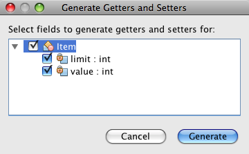
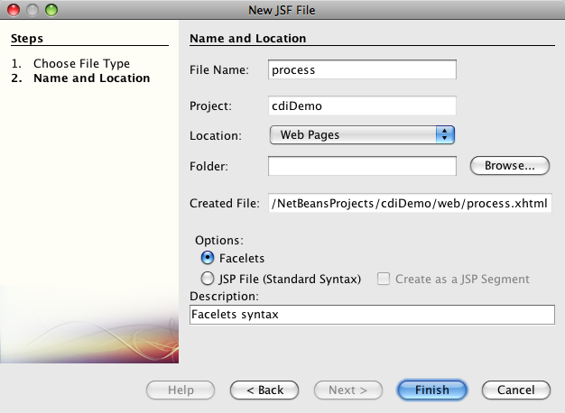
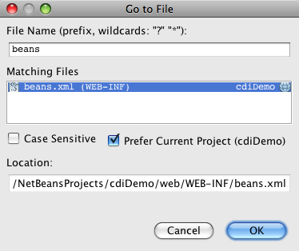
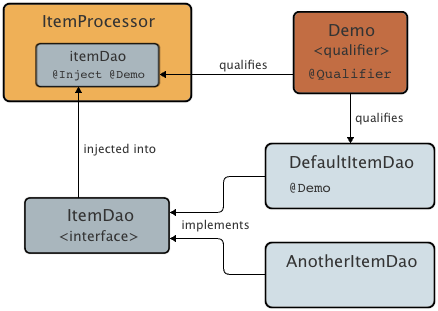

// 
//     Licensed to the Apache Software Foundation (ASF) under one
//     or more contributor license agreements.  See the NOTICE file
//     distributed with this work for additional information
//     regarding copyright ownership.  The ASF licenses this file
//     to you under the Apache License, Version 2.0 (the
//     "License"); you may not use this file except in compliance
//     with the License.  You may obtain a copy of the License at
// 
//       http://www.apache.org/licenses/LICENSE-2.0
// 
//     Unless required by applicable law or agreed to in writing,
//     software distributed under the License is distributed on an
//     "AS IS" BASIS, WITHOUT WARRANTIES OR CONDITIONS OF ANY
//     KIND, either express or implied.  See the License for the
//     specific language governing permissions and limitations
//     under the License.
//

= Working with Injection and Qualifiers in CDI
:jbake-type: tutorial
:jbake-tags: tutorials 
:jbake-status: published
:icons: font
:syntax: true
:source-highlighter: pygments
:toc: left
:toc-title:
:description: Working with Injection and Qualifiers in CDI - Apache NetBeans
:keywords: Apache NetBeans, Tutorials, Working with Injection and Qualifiers in CDI

_Contributed by Andy Gibson_

== Contexts and Dependency Injection

1. xref:cdi-intro.adoc[+Getting Started with CDI and JSF 2.0+]
2. *Working with Injection and Qualifiers in CDI*
* <<inject,Injection: the 'I' in CDI>>
* <<qualifier,Working with Qualifiers>>
* <<alternative,Alternative Injection Methods>>
* <<seealso,See Also>>

. xref:cdi-validate.adoc[+Applying @Alternative Beans and Lifecycle Annotations+]

. xref:cdi-events.adoc[+Working with Events in CDI+]

Contexts and Dependency Injection (CDI), specified by link:http://jcp.org/en/jsr/detail?id=299[+JSR-299+], is an integral part of Java EE 6 and provides an architecture that allows Java EE components such as servlets, enterprise beans, and JavaBeans to exist within the lifecycle of an application with well-defined scopes. In addition, CDI services allow Java EE components such as EJB session beans and JavaServer Faces (JSF) managed beans to be injected and to interact in a loosely coupled way by firing and observing events.

This tutorial is based on the blog post by Andy Gibson, entitled link:http://www.andygibson.net/blog/index.php/2009/12/22/getting-started-with-cdi-part-2-injection/[+Getting Started with CDI part 2 – Injection+]. It demonstrates how you can use CDI injection to _inject_ classes or interfaces into other classes. It also shows how to apply CDI _qualifiers_ to your code, so that you can specify which class type should be injected at a given injection point.

NetBeans IDE provides built-in support for Contexts and Dependency Injection, including the option of generating the `beans.xml` CDI configuration file upon project creation, editor and navigation support for annotations, as well as various wizards for creating commonly used CDI artifacts.

To complete this tutorial, you need the following software and resources.

|===
|Software or Resource |Version Required 

|xref:../../../download/index.adoc[NetBeans IDE] |7.2, 7.3, 7.4, 8.0, Java EE version 

|link:http://www.oracle.com/technetwork/java/javase/downloads/index.html[+Java Development Kit (JDK)+] |version 7 or 8 

|link:http://glassfish.dev.java.net/[+GlassFish server+] |Open Source Edition 3.x or 4.x 

|link:https://netbeans.org/projects/samples/downloads/download/Samples%252FJavaEE%252FcdiDemo.zip[+cdiDemo.zip+] |n/a 
|===

[NOTE]
====
* The NetBeans IDE Java bundle also includes the GlassFish Server Open Source Edition which is a Java EE-compliant container.
* The solution sample project for this tutorial can be downloaded: link:https://netbeans.org/projects/samples/downloads/download/Samples%252FJavaEE%252FcdiDemo2.zip[+cdiDemo2.zip+]
====

[[inject]]
== Injection: the 'I' in CDI

CDI is an API for injecting contexts and dependencies. In Seam and Spring, dependencies work mostly by naming beans and binding them to their injection points by their names. If you are following this tutorial after having completed xref:cdi-intro.adoc[+Getting Started with Contexts and Dependency Injection and JSF 2.0+], you have so far only referenced a managed bean by name from the JSF page when we defined the name for the bean using the `@Named` annotation. The primary role of the `@Named` annotation is to define the bean for the purpose of resolving EL statements within the application, usually through the JSF EL resolvers. Injection _could_ be performed by using names, but this was not how injection in CDI was meant to work since CDI gives us a much richer way to express injection points and the beans to be injected into them.

In the following example, you create an `ItemProcessor` that takes a list of items from a class that implements the `ItemDao` interface. You take advantage of CDI's `@Inject` annotation to demonstrate how it is possible to _inject_ a bean into another class. The following diagram depicts the scenario you construct in this exercise.

image::images/cdi-diagram-inject.png[title="Use CDI injection to loosely couple classes in your application"]

DAO stands for _data access object_.

. Begin by extracting the sample start project from the `cdiDemo.zip` file (See the <<requiredSoftware,table listing required resources>> above.) Open the project in the IDE by choosing File > Open Project (Ctrl-Shift-O; ⌘-Shift-O on Mac), then selecting the project from its location on your computer.

. Right-click the project node in the Projects window and choose Properties.

. Select the Run category and confirm that your GlassFish instance is selected in the Server dropdown list.

. Create a new `Item` class, and store it in a new package named `exercise2`. Click the New File ( image:images/new-file-btn.png[] ) button or press Ctrl-N (⌘-N on Mac) to open the File wizard.

. Select the Java category, then select Java Class. Click Next.

. Enter *Item* as the class name, then type in *exercise2* as the package. (The new package is created upon completing the wizard.) 

image::images/java-class-wizard.png[title="Create a new Java class using the File wizard"]

. Click Finish. The new class and package are generated, and the `Item` class opens in the editor.

. Create `value` and `limit` properties for the `Item` POJO, and implement the `toString()` method. Add the following content to the class.

[source,java]
----

public class Item {

    *private int value;
    private int limit;

    @Override
    public String toString() {
        return super.toString() + String.format(" [Value=%d, Limit=%d]", value,limit);
    }*
}
----

. Add getter and setter methods to the class. To do so, ensure that your cursor is placed between the class definition (i.e., between the class' curly brackets), then right-click in the editor and choose Insert Code (Alt-Insert; Ctrl-I on Mac). Choose Getter and Setter. 

image::images/insert-code.png[title="Create getters and setters using the Insert Code popup"]

. Select the `Item` check box (doing so selects all properties contained in the class). 

. Click Generate. Getter and setter methods are generated for the class.

[source,java]
----

public class Item {

    private int value;
    private int limit;

    *public int getLimit() {
        return limit;
    }

    public void setLimit(int limit) {
        this.limit = limit;
    }

    public int getValue() {
        return value;
    }

    public void setValue(int value) {
        this.value = value;
    }*

    @Override
    public String toString() {
        return super.toString() + String.format(" [Value=%d, Limit=%d]", value, limit);
    }
}
----

. Create a constructor that takes both `value` and `limit` arguments. Again, the IDE can assist with this. Press Ctrl-Space within the class definition and choose the '`Item(int value, int limit) - generate`' option. 

image::images/generate-constructor.png[title="Press Ctrl-Space to utilize the editor's code completion facilities"] 

The following constructor is added to the class.

[source,java]
----

public class Item {

    *public Item(int value, int limit) {
        this.value = value;
        this.limit = limit;
    }*

    private int value;
    private int limit;

    ...
----

. Create an `ItemDao` interface to define how we get the list of `Item` objects. In this test application we anticipate using multiple implementations, so we will code to interfaces.

Click the New File ( image:images/new-file-btn.png[] ) button or press Ctrl-N (⌘-N on Mac) to open the File wizard.

. Select the Java category, then select Java Interface. Click Next.

. Type in *ItemDao* as the class name, then enter *exercise2* as the package.

. Click Finish. The new interface is generated and opens in the editor.

. Add a method called `fetchItems()` that returns a `List` of `Item` objects.

[source,java]
----

public interface ItemDao {

    *List<Item> fetchItems();*

}
----
(Use the editor's hint to add the import statement for `java.util.List`.)

. Create an `ItemProcessor` class. This is the main class that you will inject your beans into and execute the process from. For now, you will start with the DAO and look at how you will inject it into our processor bean.

Click the New File ( image:images/new-file-btn.png[] ) button or press Ctrl-N (⌘-N on Mac) to open the File wizard.

. Select the Java category, then select Java Class. Click Next.

. Type in *ItemProcessor* as the class name, then enter *exercise2* as the package. Click Finish.

The new class is generated and opens in the editor.

. Modify the class as follows:

[source,java]
----

@Named
@RequestScoped
public class ItemProcessor {

    private ItemDao itemDao;

    public void execute() {
        List<Item> items = itemDao.fetchItems();
        for (Item item : items) {
            System.out.println("Found item " + item);
        }
    }
}
----

. Fix imports. Either right-click in the editor and choose Fix Imports, or press Ctrl-Shift-I (⌘-Shift-I on Mac). 

image::images/fix-imports.png[title="Right-click in the editor and choose Fix Imports to add import statements to the class"]

. Click OK. Import statements for the following classes are required:
* `java.util.List`
* `javax.inject.Named`
* `javax.enterprise.context.RequestScoped`

. Begin with a simple DAO that just creates a list of items and returns a fixed list of items. 

In the Projects window, right-click the `exercise2` package node and choose New > Java Class. In the Java Class wizard, name the class `DefaultItemDao`. Click Finish. 

image:images/java-class-wizard2.png[title="Create a new Java class using the Java Class wizard"]

. In the editor, have `DefaultItemDao` implement the `ItemDao` interface, and provide an implementation of `fetchItems()`.

[source,java]
----

public class DefaultItemDao *implements ItemDao* {

    *@Override
    public List<Item> fetchItems() {
        List<Item> results = new ArrayList<Item>();
        results.add(new Item(34, 7));
        results.add(new Item(4, 37));
        results.add(new Item(24, 19));
        results.add(new Item(89, 32));
        return results;
    }*
}
----
(Press Ctrl-Shift-I (⌘-Shift-I on Mac) to add import statements for `java.util.List` and `java.util.ArrayList`.)

. Switch to the `ItemProcessor` class (press Ctrl-Tab). In order to inject the `DefaultItemDao` into `ItemProcessor`, we add the `javax.inject.Inject` annotation to the `ItemDao` field to indicate that this field is an injection point.

[source,java]
----

*import javax.inject.Inject;*
...

@Named
@RequestScoped
public class ItemProcessor {

    *@Inject*
    private ItemDao itemDao;

    ...
}
----

TIP: Utilize the editor's code completion support to add the `@Inject` annotation and import statement to the class. For example, type '`@Inj`', then press Ctrl-Space.#

. Finally, we need some way to call the `execute()` method on the `ItemProcessor`. We can run this in a SE environment, but for now we'll keep it in a JSF page. Create a new page called `process.xhtml` that contains a button to call the `execute()` method. 

Click the New File ( image:images/new-file-btn.png[] ) button or press Ctrl-N (⌘-N on Mac) to open the File wizard.

. Select the JavaServer Faces category, then select JSF Page. Click Next.

. Type in *process* as the file name, then click Finish. 

. In the new `process.xhtml` file, add a button that is wired to the `ItemProcessor.execute()` method. Using EL, the default name for the managed bean is the same as the class name, but with the first letter being lower-case (i.e., `itemProcessor`).

[source,xml]
----

<h:body>
    *<h:form>
        <h:commandButton action="#{itemProcessor.execute}" value="Execute"/>
    </h:form>*
</h:body>
----

. Before running the project, set the `process.xhtml` file as the new welcome page in the project's web deployment descriptor. 

Use the IDE's Go to File dialog to quickly open the `web.xml` file. Choose Navigate > Go to File from the IDE's main menu (Alt-Shift-O; Ctrl-Shift-O on Mac), then type '`web`'. 

. Click OK. In the XML view of the `web.xml` file, make the following change.

[source,xml]
----

<welcome-file-list>
    <welcome-file>faces/*process.xhtml*</welcome-file>
</welcome-file-list>
----

. Click the Run Project ( image:images/run-project-btn.png[] ) button in the IDE's main toolbar. The project is compiled and deployed to GlassFish, and the `process.xhtml` file opens in the browser.

. Click the '`Execute`' button that displays on the page. Switch back to the IDE and examine the GlassFish server log. The server log displays in the Output window (Ctrl-4; ⌘-4 on Mac) under the GlassFish Server tab. When the button is clicked, the log lists the items from our default DAO implementation. 

image::images/output-window.png[title="Examine the server log in the IDE's Output window"] 

TIP: Right-click in the Output window and choose Clear (Ctrl-L; ⌘-L on Mac) to clear the log. In the above image, the log was cleared just prior to clicking the '`Execute`' button.#

We created a class which implements the `ItemDao` interface, and when the application was deployed our managed beans in the module were processed by the CDI implementation (because of the `beans.xml` file in the module). Our `@Inject` annotation specifies that we want to inject a managed bean into that field and the only thing we know about the injectable bean is that it must implement `ItemDao` or some subtype of that interface. In this case, the `DefaultItemDao` class fits the bill perfectly.

What would happen if there were multiple implementations of `ItemDao` that could have been injected? CDI would not know which implementation to choose from and would flag a deploy-time error. To overcome this, you would need to use a CDI qualifier. Qualifiers are explored in the following section.

[[qualifier]]
== Working with Qualifiers

A CDI qualifier is an annotation that can be applied at the class level to indicate the kind of bean the class is, and also at the field level (among other places) to indicate what kind of bean needs to be injected at that point.

To demonstrate the need for a qualifier in the application we are building, let's add another DAO class to our application which also implements the `ItemDao` interface. The following diagram depicts the scenario you are constructing in this exercise. CDI must be able to determine which bean implementation should be used at an injection point. Because there are two implementations of `ItemDao`, we can resolve this by creating a qualifier named `Demo`. Then, we "tag" both the bean we want to use, as well as the injection point in `ItemProcessor`, with a `@Demo` annotation.

Perform the following steps.

1. In the Projects window, right-click the `exercise2` package and choose New > Java Class.
2. In the New Java Class wizard, name the new class *AnotherItemDao* then click Finish. The new class is generated and opens in the editor.
3. Modify the class as follows, so that it implements the `ItemDao` interface, and defines the interface's `fetchItems()` method.

[source,java]
----

public class AnotherItemDao *implements ItemDao* {

    *@Override
    public List<Item> fetchItems() {
        List<Item> results = new ArrayList<Item>();
        results.add(new Item(99, 9));
        return results;
    }*
}
----

Be sure to add import statements for `java.util.List` and `java.util.ArrayList`. To do so, right-click in the editor and choose Fix Imports, or press Ctrl-Shift-I (⌘-Shift-I on Mac).

Now that there are two classes that implement `ItemDao`, the choice is not so clear as to which bean we want to inject.

. Click the Run Project ( image:images/run-project-btn.png[] ) button to run the project. Note that the project now fails to deploy.

You probably only need to save the file because the IDE will automatically deploy the project because Deploy on Save is enabled by default.

. Examine the server log in the Output window (Ctrl-4; ⌘-4 on Mac). You see an error message similar to the following.

[source,java]
----

Caused by: org.jboss.weld.DeploymentException: Injection point has ambiguous dependencies.
Injection point: field exercise2.ItemProcessor.itemDao;
Qualifiers: [@javax.enterprise.inject.Default()];
Possible dependencies: [exercise2.DefaultItemDao, exercise2.AnotherItemDao]
----

To wrap text onto multiple lines in the Output window, right-click and choose Wrap text. This eliminates the need to scroll horizontally.

Weld, the implementation for CDI, gives us an ambiguous dependency error meaning that it cannot determine what bean to use for the given injection point. Most, if not all of the errors that can occur with regard to CDI injection in Weld are reported at deployment time, even down to whether passivation-capable beans are missing a `Serializable` implementation.

We could make our `itemDao` field in the `ItemProcessor` a specific type that matches one of the implementation types (`AnotherItemDao` or `DefaultItemDao`) since it would then match one and only one class type. However, then we would lose the benefits of coding to an interface and find it harder to change implementations without changing the field type. A better solution is to instead look at CDI qualifiers.

When CDI inspects an injection point to find a suitable bean to inject, it takes not only the class type into account, but also any qualifiers. Without knowing it, we have already used one qualifier which is the default qualifier called `@Any`. Let's create a `@Demo` qualifier which we can apply to our `DefaultItemDao` implementation and also to the injection point in `ItemProcessor`.

The IDE provides a wizard that enables you to generate CDI qualifiers.

. Click the New File ( image:images/new-file-btn.png[] ) button or press Ctrl-N (⌘-N on Mac) to open the File wizard.

. Select the Context and Dependency Injection category, then select Qualifier Type. Click Next.

. Enter *Demo* as the class name, then enter *exercise2* as the package.

. Click Finish. The new `Demo` qualifier opens in the editor.

[source,java]
----

package exercise2;

import static java.lang.annotation.ElementType.TYPE;
import static java.lang.annotation.ElementType.FIELD;
import static java.lang.annotation.ElementType.PARAMETER;
import static java.lang.annotation.ElementType.METHOD;
import static java.lang.annotation.RetentionPolicy.RUNTIME;
import java.lang.annotation.Retention;
import java.lang.annotation.Target;
import javax.inject.Qualifier;

/**
*
* @author nbuser
*/
@Qualifier
@Retention(RUNTIME)
@Target({METHOD, FIELD, PARAMETER, TYPE})
public @interface Demo {
}
----

Next you will add this qualifier to the default DAO implementation at the class level.

. Switch to `DefaultItemDao` in the editor (press Ctrl-Tab), then type in '`@Demo`' above the class definition.

[source,java]
----

*@Demo*
public class DefaultItemDao implements ItemDao {

@Override
public List<Item> fetchItems() {
    List<Item> results = new ArrayList<Item>();
    results.add(new Item(34, 7));
    results.add(new Item(4, 37));
    results.add(new Item(24, 19));
    results.add(new Item(89, 32));
    return results;
}
}
----

TIP: After typing '`@`', press Ctrl-Space to invoke code completion suggestions. The editor recognizes the `Demo` qualifier and lists `@Demo` as an option for code completion.#

. Click the Run Project ( image:images/run-project-btn.png[] ) button to run the project. The project builds and deploys without errors.

NOTE: For this modification you might need to explicitly run the project to redeploy the application instead of incrementally deploying the changes.

. In the browser, click the '`Execute`' button, then return to the IDE and examine the server log in the Output window. You see the following output.

[source,java]
----

INFO: Found item exercise2.Item@1ef62a93 [Value=99, Limit=9]
----

The output lists the item from the `AnotherItemDao` class. Recall that we annotated the `DefaultItemDao` implementation but not the injection point in `ItemProcessor`. By adding the `@Demo` qualifier to the default DAO implementation, we made the other implementation a more suitable match for the injection point because it matched on both the type and the qualifier. The `DefaultItemDao` currently has the `Demo` qualifier which is not on the injection point, thus making it less suitable.

Next you will add the `@Demo` annotation to the injection point in `ItemProcessor`.

. Switch to `ItemProcessor` in the editor (press Ctrl-Tab), then make the following change.

[source,java]
----

@Named
@RequestScoped
public class ItemProcessor {

@Inject *@Demo*
private ItemDao itemDao;

public void execute() {
    List<Item> items = itemDao.fetchItems();
    for (Item item : items) {
        System.out.println("Found item " + item);
    }
}
}
----

. In the browser, click the '`Execute`' button, then return to the IDE and examine the server log in the Output window. You see output from the default implementation (`DefaultItemDao`) again.

[source,java]
----

INFO: Found item exercise2.Item@7b3640f1 [Value=34, Limit=7]
INFO: Found item exercise2.Item@26e1cd69 [Value=4, Limit=37]
INFO: Found item exercise2.Item@3274bc70 [Value=24, Limit=19]
INFO: Found item exercise2.Item@dff76f1 [Value=89, Limit=32]
----

This is because you are now matching based on type _and_ qualifiers, and `DefaultItemDao` is the only bean with both the correct type and the `@Demo` annotation.

[[alternative]]
== Alternative Injection Methods

There are multiple ways to define an injection point on the injected class. So far you have annotated the fields that reference the injected object. You do not need to provide getters and setters for field injection. If you wish to create immutable managed beans with final fields, you can use injection in the constructor by annotating the constructor with the `@Inject` annotation. You can then apply any annotations to constructor parameters to qualify beans for injection. (Of course, each parameter has a type that can assist in qualifying beans for injection). A bean may only have one constructor with injection points defined, but it may implement more than one constructor.

[source,java]
----

@Named
@RequestScoped
public class ItemProcessor {

    private final ItemDao itemDao;

    @Inject
    public ItemProcessor(@Demo ItemDao itemDao) {
        this.itemDao = itemDao;
    }
}
----

You can also call an initialization method which can be passed a bean that is to be injected.

[source,java]
----

@Named
@RequestScoped
public class ItemProcessor {

    private ItemDao itemDao;

    @Inject
    public void setItemDao(@Demo ItemDao itemDao) {
        this.itemDao = itemDao;
    }
}
----

While in the above case the setter method is used for initialization, you can create any method and use it for initialization with as many beans as you want in the method call. You can also have multiple initialization methods in a bean.

[source,java]
----

@Inject
public void initBeans(@Demo ItemDao itemDao, @SomeQualifier SomeType someBean) {
    this.itemDao = itemDao;
    this.bean = someBean;
}
----

The same rules apply to bean matching regardless of how the injection point is defined. CDI will try to find the best match based on type and qualifiers and will fail on deployment if there are multiple matching beans, or no matching beans for an injection point.

xref:../../../community/mailing-lists.adoc[Send Feedback on This Tutorial]

[[seealso]]
== See Also

Continue to the next installment of this series on Contexts and Dependency Injection:

* xref:cdi-validate.adoc[+Applying @Alternative Beans and Lifecycle Annotations+]

For more information about CDI and Java EE, see the following resources.

* xref:cdi-intro.adoc[+Getting Started with Contexts and Dependency Injection and JSF 2.0+]
* xref:javaee-gettingstarted.adoc[+Getting Started with Java EE Applications+]
* link:http://blogs.oracle.com/enterprisetechtips/entry/using_cdi_and_dependency_injection[+Enterprise Tech Tip: Using CDI and Dependency Injection for Java in a JSF 2.0 Application+]
* link:http://download.oracle.com/javaee/6/tutorial/doc/gjbnr.html[+The Java EE 6 Tutorial, Part V: Contexts and Dependency Injection for the Java EE Platform+]
* link:http://jcp.org/en/jsr/detail?id=299[+JSR 299: Specification for Contexts and Dependency Injection+]
