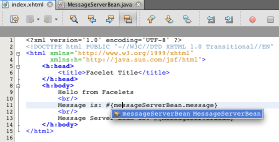

// 
//     Licensed to the Apache Software Foundation (ASF) under one
//     or more contributor license agreements.  See the NOTICE file
//     distributed with this work for additional information
//     regarding copyright ownership.  The ASF licenses this file
//     to you under the Apache License, Version 2.0 (the
//     "License"); you may not use this file except in compliance
//     with the License.  You may obtain a copy of the License at
// 
//       http://www.apache.org/licenses/LICENSE-2.0
// 
//     Unless required by applicable law or agreed to in writing,
//     software distributed under the License is distributed on an
//     "AS IS" BASIS, WITHOUT WARRANTIES OR CONDITIONS OF ANY
//     KIND, either express or implied.  See the License for the
//     specific language governing permissions and limitations
//     under the License.
//

= Getting Started with Contexts and Dependency Injection and JSF 2.x
:jbake-type: tutorial
:jbake-tags: tutorials 
:jbake-status: published
:icons: font
:syntax: true
:source-highlighter: pygments
:toc: left
:toc-title:
:description: Getting Started with Contexts and Dependency Injection and JSF 2.x - Apache NetBeans
:keywords: Apache NetBeans, Tutorials, Getting Started with Contexts and Dependency Injection and JSF 2.x

_Contributed by Andy Gibson_

== Contexts and Dependency Injection

1. *Getting Started with CDI and JSF 2.0*
* <<creating,Creating a Java Web Project with CDI Support>>
* <<named,Accessing Beans from JSF's Expression Language>>
* <<upgrading,Upgrading to an EJB>>
* <<seealso,See Also>>

. xref:cdi-inject.adoc[+Working with Injection and Qualifiers in CDI+]

. xref:cdi-validate.adoc[+Applying @Alternative Beans and Lifecycle Annotations+]

. xref:cdi-events.adoc[+Working with Events in CDI+]

Contexts and Dependency Injection (CDI), specified by link:http://jcp.org/en/jsr/detail?id=299[+JSR-299+], is an integral part of Java EE 6 and provides an architecture that allows Java EE components such as servlets, enterprise beans, and JavaBeans to exist within the lifecycle of an application with well-defined scopes. In addition, CDI services allow Java EE components such as EJB session beans and JavaServer Faces (JSF) managed beans to be injected and to interact in a loosely coupled way by firing and observing events.

This tutorial is based on the blog post by Andy Gibson, entitled link:http://www.andygibson.net/blog/index.php/2009/12/16/getting-started-with-jsf-2-0-and-cdi-in-jee-6-part-1/[+Getting Started with JSF 2.0 and CDI in JEE 6+]. It demonstrates how you can use the IDE to set up a Java web project with support for JSF 2.0 and CDI. It continues by showing how to wire CDI managed beans with Facelets pages, and concludes with a brief example of CDI integration with EJB technology.

NetBeans IDE provides built-in support for Contexts and Dependency Injection, including the option of generating the `beans.xml` CDI configuration file upon project creation, editor and navigation support for annotations, as well as various wizards for creating commonly used CDI artifacts.

To complete this tutorial, you need the following software and resources.

|===
|Software or Resource |Version Required 

|xref:../../../download/index.adoc[NetBeans IDE] |7.2, 7.3, 7.4, 8.0, Java EE bundle 

|link:http://www.oracle.com/technetwork/java/javase/downloads/index.html[+Java Development Kit (JDK)+] |version 7 or 8 

|link:http://glassfish.dev.java.net/[+GlassFish server+] |Open Source Edition 3.x or 4.x 
|===

NOTE: The NetBeans IDE Java bundle also includes the GlassFish Server Open Source Edition, which is a Java EE-compliant container.

[[creating]]
== Creating a Java Web Project with CDI Support

In this exercise you create a JSF 2.x-enabled Java web project with CDI support.

1. Click the New Project ( image:images/new-project-btn.png[] ) button in the IDE's main toolbar (Ctrl-Shift-N; ⌘-Shift-N on Mac).
2. In the New Project wizard, select the Java Web category, then select Web Application. Click Next.
3. Type `cdiDemo` for the project name and set the project location. Click Next.
4. Set the server to GlassFish server.
5. Set the Java EE Version to Java EE 6 Web or Java EE 7 Web.

NOTE:  The Java EE version that you select determines the CDI version that is enabled for your application and there are some important differences between CDI 1.0 and CDI 1.1.

* If you specify Java EE 6 Web as the Java EE version, confirm that the 'Enable Contexts and Dependency Injection' option is selected. The 'Enable Contexts and Dependency Injection' option, when selected, generates a `beans.xml` file in the project's `WEB-INF` folder when the project template is created. The `beans.xml` file is used by CDI to instruct the Java EE-compliant server that the project is a module containing CDI beans. Java EE 6 Web supports CDI 1.0 and the generated `beans.xml` file specifies CDI 1.0 as the version.
* If you specify Java EE 7 Web as the Java EE version, CDI 1.1 is enabled by default and the  ``beans.xml``  file is not required. In Java EE 7, when no  ``beans.xml``  is present the archive that is deployed is an *implicit bean archive*. If you use the New File wizard in the IDE to manually generate a `beans.xml` file in a Java EE 7 Web application, by default the deployed archive will become an *explicit bean archive* because the `beans.xml` file specifies CDI 1.1 as the version and also sets the attribute of the  ``bean-discovery-mode``  to  ``all`` .

For more details on the types of CDI archives, see link:http://docs.oracle.com/javaee/7/tutorial/doc/cdi-adv001.htm[+Packaging CDI Applications+] in the Java EE 7 Tutorial.

image::images/new-web-application1.png[title="The CDI option, when selected, generates a beans.xml file for the project"]

. Click Next.

. In the Frameworks panel, select the JavaServer Faces option.

. Click the Configuration tab and confirm that Facelets is selected as the Preferred Page Language. Click Finish.

When you click Finish, the IDE generates the web application project and opens the `index.xhtml` welcome page in the editor.

. In the Projects window, expand the Libraries > GlassFish Server node you can see that the `weld-osgi-bundle.jar` library was automatically added. The GlassFish Server includes Weld, which is JBoss' implementation of the JSR-299 CDI specification. 

image::images/projects-window1.png[title="New project contains CDI's beans.xml file and the GlassFish library includes the Weld JAR file"]

If you specified Java EE 6 Web as the Java EE version when you created the project, note that the Web Pages > WEB-INF folder includes a `beans.xml` file. This file is currently empty, but can be used to specify bean related information in XML as an alternative to annotations.

[[named]]
== Accessing Beans from JSF's Expression Language

This exercise demonstrates how you can wire CDI managed beans to Facelets pages using EL syntax.

1. In the Projects window, right-click the Source Packages node and choose New > Java Class.
2. In the New Java Class wizard, name the class *MessageServerBean*, and type in *exercise1* as the Package. (The new package is created upon completing the wizard.) Click Finish. 

image::images/new-java-class.png[title="Create new Java classes using the Java Class wizard"]

The new package and class are generated, and the class opens in the editor.

. Annotate the class with the `@Named` and `@Dependent` annotations, and create a single method to return a string.

[source,java]
----

package exercise1;

*import javax.enterprise.context.Dependent;
import javax.inject.Named;*

*@Dependent
@Named*
public class MessageServerBean {

    *public String getMessage() {
        return "Hello World!";
    }*
}
----

As you type the `@Dependent` and `@Named` annotation, press Ctrl-Space to invoke the editor's code completion support, as well as Javadoc documentation. If you apply the annotation using the editor's code completion facilities (i.e., select the appropriate annotation and press Enter), the `import` statement is automatically added to the file. In the Javadoc pop-up, you can also click the 'Show documentation in external web browser' ( image:images/external-web-browser-btn.png[] ) button to display the full-sized Javadoc in a separate window.

NOTE:  The  ``@Dependent``  annotation defines the scope of the managed bean. In an *implicit bean archive* a managed bean is only discoverable and can only be managed by the container when a scope is specified. The application in this tutorial will be packaged as an implicit bean archive if you specified Java EE 7 Web as the Java EE version when you created the project and you did not create  ``beans.xml`` . For details on specifying the scope of managed beans, see link:http://docs.oracle.com/javaee/7/tutorial/doc/jsf-configure001.htm[+Using Annotations to Configure Managed Beans+] in the Java EE 7 Tutorial.

. Save the file (Ctrl-S; ⌘-S on Mac). By adding the `@Named` annotation, the `MessageServerBean` class becomes a _managed bean_, as defined by CDI.

. Switch to the `index.xhtml` Facelets page (press Ctrl-Tab) in the editor, and add the following content to the `<h:body>` tags.

[source,xml]
----

<h:body>
    Hello from Facelets
    * 
    Message is: #{messageServerBean.message}
     
    Message Server Bean is: #{messageServerBean}*
</h:body>
----

TIP: You can press Ctrl-Space in EL expressions to take advantage of code completion suggestions. The editor's code completion lists managed beans and their properties. Because the `@Named` annotation transforms the `MessageServerBean` class into a CDI managed bean, it becomes accessible within EL syntax, just as though it were a JSF managed bean.# 

. Click the Run Project ( image:images/run-project-btn.png[] ) button in the IDE's main toolbar. The project is compiled and deployed to GlassFish, and the application welcome page (`index.xhtml`) opens in the browser. You can see the "Hello World!" message from the `MessageServerBean` displayed on the page. 

image::images/browser-output1.png[title="Application welcome page displays MessageServerBean details"]

. Go back into the message bean and change the message to something else (e.g., "Hello Weld!"). Save the file (Ctrl-S; ⌘-S on Mac), then refresh the browser. The new message automatically appears. Thanks to the IDE's Deploy on Save feature, any changes you save result in automatic compilation and redeployment to the server. 

From the third line in the page you can see that the class name is `exercise1.MessageServerBean`. Note that the bean is just a POJO (Plain Old Java Object). Even though you are developing in Java EE, there is no complex class hierarchy wrapped in layers of transactions, interceptors and all that "heavy" stuff you keep hearing about.

=== What's Going On?

When the application is deployed the server looks for CDI managed beans. In a Java EE 7 application, the classes on the path are scanned for CDI annotations by default. In a Java EE 6 application, the classes are scanned for CDI annotations if the module contains a `beans.xml` file. In a CDI module, all beans are registered with Weld, and the `@Named` annotation is used to match beans to injection points. When the `index.xhtml` page was rendered, JSF tried to resolve the value of `messageServerBean` in the page using the registered expression resolvers in JSF. One of these is the Weld EL Resolver which has the `MessageServerBean` class registered under the name `messageServerBean`. We could have specified a different name with the `@Named` annotation, but since we did not it was registered under the default name, being the class name with a lower-case first letter. The Weld resolver returns an instance of this bean in response to the request from JSF. Bean naming is only needed when using EL expressions and should not be used as a mechanism for injection since CDI provides type-safe injection by class type and qualifier annotations.

[[upgrading]]
== Upgrading to an EJB

As we are using a Java EE stack, we can easily deploy our bean as an EJB with some small changes thanks to EJB 3.1.

. Open the `MessageServerBean` and add the `javax.ejb.Stateless` annotation at the class level and change the string to 'Hello EJB!'.

[source,java]
----

package exercise1;

*import javax.ejb.Stateless;*
import javax.enterprise.context.Dependent;
import javax.inject.Named;

/**
 *
 * @author nbuser
 */
@Dependent
@Named
*@Stateless*
public class MessageServerBean {

    public String getMessage() {
        return "*Hello EJB!*";
    }
}
----

. Save the file (Ctrl-S; ⌘-S on Mac), then go to your browser and refresh. You will see output similar to the following: 

image::images/browser-output-ejb1.png[title="Using the @Stateless annotation transforms MessageServerBean into an EJB"] 

Amazingly, we turned our POJO into a fully-featured EJB with just one annotation. We saved changes then refreshed the page, and our changes appeared. In doing so it wasn't necessary to create any weird project configurations, local interfaces or arcane deployment descriptors.

=== Different EJB types

You can also try using the `@Stateful` annotation. Alternatively, you could try the new `@Singleton` annotation for singleton instances. If you do, you may notice that there is are two annotations: `javax.ejb.Singleton` and `javax.inject.Singleton`. Why two singletons? The CDI singleton (`javax.inject.Singleton`) lets you define a singleton instance outside of EJB in case you are using CDI in a non-EJB environment. The EJB singleton (`javax.ejb.Singleton`) provides all the features of an EJB such as transaction management. Therefore, you have the choice depending on your needs and whether you are working in an EJB environment.

xref:../../../community/mailing-lists.adoc[Send Feedback on This Tutorial]

[[seealso]]
== See Also

The next installment of this series focuses on CDI injection, and provides a closer look at using CDI for managing dependencies in a Java EE environment.

* xref:cdi-inject.adoc[+Working with Injection and Qualifiers in CDI+]

For more information about CDI and JSF 2.0, see the following resources.

=== Contexts and Dependency Injection

* xref:cdi-validate.adoc[+Applying @Alternative Beans and Lifecycle Annotations+]
* xref:cdi-events.adoc[+Working with Events in CDI+]
* link:http://blogs.oracle.com/enterprisetechtips/entry/using_cdi_and_dependency_injection[+Enterprise Tech Tip: Using CDI and Dependency Injection for Java in a JSF 2.0 Application+]
* link:http://docs.oracle.com/javaee/7/tutorial/doc/cdi-basic.htm[+The Java EE 6 Tutorial: Introduction to Contexts and Dependency Injection for Java EE+]
* link:http://jcp.org/en/jsr/detail?id=299[+JSR 299: Specification for Contexts and Dependency Injection+]

=== JavaServer Faces 2.0

* xref:../web/jsf20-intro.adoc[+Introduction to JavaServer Faces 2.x+]
* xref:../web/jsf20-crud.adoc[+Generating a JavaServer Faces 2.x CRUD Application from a Database+]
* xref:../../samples/scrum-toys.adoc[+Scrum Toys - The JSF 2.0 Complete Sample Application+]
* link:http://www.oracle.com/technetwork/java/javaee/javaserverfaces-139869.html[+JavaServer Faces Technology+] (Official homepage)
* link:http://docs.oracle.com/javaee/7/tutorial/doc/jsf-page.htm[+The Java EE 7 Tutorial: Using JavaServer Faces Technology in Web Pages+]
* link:http://jcp.org/en/jsr/summary?id=314[+JSR 314: Specification for JavaServer Faces 2.0+]
