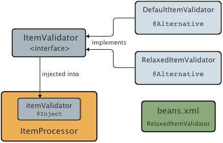
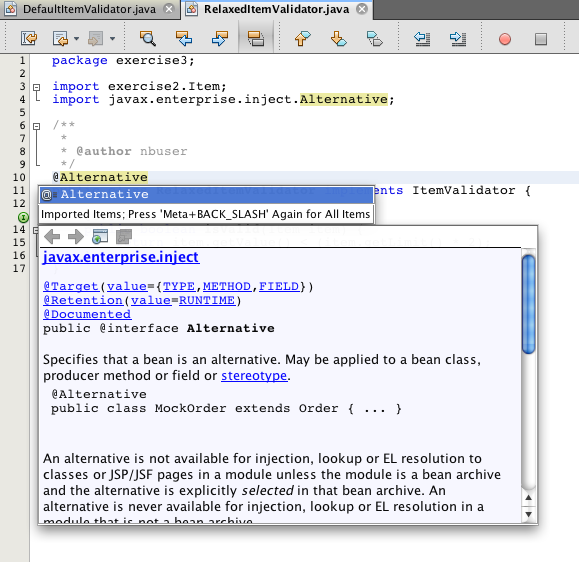

// 
//     Licensed to the Apache Software Foundation (ASF) under one
//     or more contributor license agreements.  See the NOTICE file
//     distributed with this work for additional information
//     regarding copyright ownership.  The ASF licenses this file
//     to you under the Apache License, Version 2.0 (the
//     "License"); you may not use this file except in compliance
//     with the License.  You may obtain a copy of the License at
// 
//       http://www.apache.org/licenses/LICENSE-2.0
// 
//     Unless required by applicable law or agreed to in writing,
//     software distributed under the License is distributed on an
//     "AS IS" BASIS, WITHOUT WARRANTIES OR CONDITIONS OF ANY
//     KIND, either express or implied.  See the License for the
//     specific language governing permissions and limitations
//     under the License.
//

= Applying @Alternative Beans and Lifecycle Annotations
:jbake-type: tutorial
:jbake-tags: tutorials 
:jbake-status: published
:icons: font
:syntax: true
:source-highlighter: pygments
:toc: left
:toc-title:
:description: Applying @Alternative Beans and Lifecycle Annotations - Apache NetBeans
:keywords: Apache NetBeans, Tutorials, Applying @Alternative Beans and Lifecycle Annotations

_Contributed by Andy Gibson_

== Contexts and Dependency Injection

1. xref:cdi-intro.adoc[+Getting Started with CDI and JSF 2.0+]
2. xref:cdi-inject.adoc[+Working with Injection and Qualifiers in CDI+]
3. *Applying @Alternative Beans and Lifecycle Annotations*
* <<alternative,Handling Multiple Deployments>>
* <<lifecycle,Applying Lifecycle Annotations to Managed Beans>>
* <<seealso,See Also>>

. xref:cdi-events.adoc[+Working with Events in CDI+]

Contexts and Dependency Injection (CDI), specified by link:http://jcp.org/en/jsr/detail?id=299[+JSR-299+], is an integral part of Java EE 6 and provides an architecture that allows Java EE components such as servlets, enterprise beans, and JavaBeans to exist within the lifecycle of an application with well-defined scopes. In addition, CDI services allow Java EE components such as EJB session beans and JavaServer Faces (JSF) managed beans to be injected and to interact in a loosely coupled way by firing and observing events.

This tutorial is based on the blog post by Andy Gibson, entitled link:http://www.andygibson.net/blog/index.php/2009/12/22/getting-started-with-cdi-part-2-injection/[+Getting Started with CDI part 2 – Injection+]. It demonstrates how you can take advantage of the `@Alternative` annotation to configure your application for different deployments, and also shows how you can use managed bean lifecycle annotations, such as `@PostConstruct` and `@PreDestroy`, to combine CDI injection with functionality provided by the link:http://jcp.org/en/jsr/detail?id=316[+Java EE 6 Managed Bean Specification+].

NetBeans IDE provides built-in support for Contexts and Dependency Injection, including the option of generating the `beans.xml` CDI configuration file upon project creation, editor and navigation support for annotations, as well as various wizards for creating commonly used CDI artifacts.

To complete this tutorial, you need the following software and resources.

|===
|Software or Resource |Version Required 

|xref:../../../download/index.adoc[NetBeans IDE] |7.2, 7.3, 7.4, 8.0, Java EE version 

|link:http://www.oracle.com/technetwork/java/javase/downloads/index.html[+Java Development Kit (JDK)+] |version 7 or 8 

|link:http://glassfish.dev.java.net/[+GlassFish server+] |Open Source Edition 3.x or 4.x 

|link:https://netbeans.org/projects/samples/downloads/download/Samples%252FJavaEE%252FcdiDemo2.zip[+cdiDemo2.zip+] |n/a 
|===

[NOTE]
====
* The NetBeans IDE Java bundle also includes the GlassFish Server Open Source Edition which is a Java EE-compliant container.
* The solution sample project for this tutorial can be downloaded: link:https://netbeans.org/projects/samples/downloads/download/Samples%252FJavaEE%252FcdiDemo3.zip[+cdiDemo3.zip+]
====

[[alternative]]
== Handling Multiple Deployments

CDI offers the use of the `@Alternative` annotation which lets you package multiple beans that match an injection point without ambiguity errors. In other words, you can apply the `@Alternative` annotation to two or more beans, then, based on your deployment, specify the bean you want to use in CDI's `beans.xml` configuration file.

To demonstrate this, consider the following scenario. We inject an `ItemValidator` into our main `ItemProcessor` class. The `ItemValidator` is implemented by both `DefaultItemValidator` and `RelaxedItemValidator`. Based on our deployment requirements, we'd like to use `DefaultItemValidator` for most cases, but also require `RelaxedItemValidator` for a specific deployment. To resolve this, we annotate both beans, then specify which bean to use for a given deployment by adding an entry to the application's `beans.xml` file.

1. Begin by extracting the sample start project from the `cdiDemo2.zip` file (See the <<requiredSoftware,table listing required resources>> above.) Open the project in the IDE by choosing File > Open Project (Ctrl-Shift-O; ⌘-Shift-O on Mac), then selecting the project from its location on your computer.
2. Right-click the project node in the Projects window and choose Properties.
3. Select the Run category and confirm that your GlassFish instance is selected in the Server dropdown list.
4. Create an `ItemValidator` interface. 

Click the New File ( image:images/new-file-btn.png[] ) button or press Ctrl-N (⌘-N on Mac) to open the File wizard.

. Select the Java category, then select Java Interface. Click Next.

. Type in *ItemValidator* as the class name, then enter *exercise3* as the package.

. Click Finish. The new interface is generated and opens in the editor.

. Add a method called `isValid()` that takes an `Item` object and returns a `boolean` value.

[source,java]
----

public interface ItemValidator {
    *boolean isValid(Item item);*
}
----
(Use the editor's hint to add the import statement for `exercise2.Item`.)

. Expand the `ItemProcessor` class to incorporate the new feature. Open `ItemProcessor` in the editor and make the following changes.

[source,java]
----

@Named
@RequestScoped
public class ItemProcessor {

    @Inject @Demo
    private ItemDao itemDao;

    *@Inject
    private ItemValidator itemValidator;*

    public void execute() {
      List<Item>  items = itemDao.fetchItems();
      for (Item item : items) {
          System.out.println(*"Item = " + item + " valid = " + itemValidator.isValid(item)*);
      }
    }
}
----

Use the editor's hint to add the import statement for `exercise3.ItemValidator`.

. Create an implementation of `ItemValidator` named `DefaultItemValidator` that simply tests the limit against the value.

In the Projects window, right-click the `exercise3` package and choose New > Java Class. Name the class *DefaultItemValidator* and click Finish.

. Have `DefaultItemValidator` implement `ItemValidator` and override the `isValid()` method as follows.

[source,java]
----

public class DefaultItemValidator *implements ItemValidator* {

    *@Override
    public boolean isValid(Item item) {
        return item.getValue() < item.getLimit();
    }*
}
----

(Use the editor's hint to add the import statement for `exercise2.Item`.)

. Click the Run Project ( image:images/run-project-btn.png[] ) button in the IDE's main toolbar. The project is compiled and deployed to GlassFish, and the application's welcome page (`process.xhtml`) opens in the browser.

. Click the '`Execute`' button that displays on the page. Switch back to the IDE and examine the GlassFish server log. The server log displays in the Output window (Ctrl-4; ⌘-4 on Mac) under the GlassFish tab. You can see that items are being validated, and the only valid item listed is the case where the value is less than the limit.

[source,java]
----

INFO: Item = exercise2.Item@e857ac [Value=34, Limit=7] valid = false
INFO: Item = exercise2.Item@63124f52 [Value=4, Limit=37] valid = true
INFO: Item = exercise2.Item@4715c34e [Value=24, Limit=19] valid = false
INFO: Item = exercise2.Item@65c95a57 [Value=89, Limit=32] valid = false
----

image::images/output-window.png[title="View the server log in the Output window"]

. Now consider a scenario where you have to deploy to a different site that is more relaxed and considers an item invalid only if the value is more than twice the limit. You may want to have another bean that implements the `ItemValidator` interface for that logic.

Create a new implementation of `ItemValidator` named `RelaxedItemValidator`. In the Projects window, right-click the `exercise3` package and choose New > Java Class. Name the class *RelaxedItemValidator* and click Finish.

. Have `RelaxedItemValidator` implement `ItemValidator` and override the `isValid()` method as follows.

[source,java]
----

public class RelaxedItemValidator *implements ItemValidator* {

    *@Override
    public boolean isValid(Item item) {
        return item.getValue() < (item.getLimit() * 2);
    }*
}
----

(Use the editor's hint to add the import statement for `exercise2.Item`.)

. Click the Run Project ( image:images/run-project-btn.png[] ) button to run the project. Note that the project now fails to deploy.

. Examine the server log in the Output window (Ctrl-4; ⌘-4 on Mac). You see an error message reporting an 'ambiguous dependency' problem. This occurs because you now have two classes implementing the same interface.

[source,java]
----

org.glassfish.deployment.common.DeploymentException: Injection point has ambiguous dependencies.
Injection point: field exercise2.ItemProcessor.itemValidator;
Qualifiers: [@javax.enterprise.inject.Default()];
Possible dependencies: [exercise3.RelaxedItemValidator, exercise3.DefaultItemValidator]
----

Weld, the implementation for CDI, cannot determine whether to use `RelaxedItemValidator` or `DefaultItemValidator` for the given injection point.

As mentioned, the only difference is based on deployment. For most deployments, you want to use the default validator, but for one deployment you want to use the 'relaxed' implementation. CDI offers the use of the `@Alternative` annotation which lets you package multiple beans that match an injection point without ambiguity errors, and the bean to use is defined in the `beans.xml`. This allows you to deploy both implementations in the same module with the only difference being the `beans.xml` definition, which can change over different deployments.

. Add the `@Alternative` annotation and corresponding import statement to `RelaxedItemValidator` and `DefaultItemValidator`. 

Open `RelaxedItemValidator` in the editor and make the following change.

[source,java]
----

*import javax.enterprise.inject.Alternative;*
...

*@Alternative*
public class RelaxedItemValidator implements ItemValidator {

    public boolean isValid(Item item) {
        return item.getValue() < (item.getLimit() * 2);
    }
}
----

Type '`@Al`' then press Ctrl-Space to invoke code completion. Because only one option is filtered, the `@Alternative` annotation is completed, and the corresponding import statement for `javax.enterprise.inject.Alternative` is automatically added to the top of the file. Typically, pressing Ctrl-Space on annotations also provides a Javadoc documentation popup.

Switch to `DefaultItemValidator` (press Ctrl-Tab) and make the following change.

[source,java]
----

*import javax.enterprise.inject.Alternative;*
...

*@Alternative*
public class DefaultItemValidator implements ItemValidator {

    public boolean isValid(Item item) {
        return item.getValue() < item.getLimit();
    }
}
----

If you deployed the application now you would get an 'unsatisfied dependency' error since you defined the two matching beans as alternative but you did not enable either of them in the `beans.xml` file.

. Use the IDE's Go to File dialog to quickly open the `beans.xml` file. Choose Navigate > Go to File from the IDE's main menu (Alt-Shift-O; Ctrl-Shift-O on Mac), then type '`beans`'. Click OK. 

image::images/go-to-file.png[title="Use the Go to File dialog to quickly locate a project file"]

. Make the following change to the `beans.xml` file.

[source,xml]
----

<beans xmlns="http://java.sun.com/xml/ns/javaee"
    xmlns:xsi="http://www.w3.org/2001/XMLSchema-instance"
    xsi:schemaLocation="http://java.sun.com/xml/ns/javaee http://java.sun.com/xml/ns/javaee/beans_1_0.xsd">

    *<alternatives>
        <class>exercise3.RelaxedItemValidator</class>
    </alternatives>*

</beans>
----

This tells CDI to use the `RelaxedItemValidator` for this deployment. You can think of the `@Alternative` annotation as effectively disabling the bean, making it unavailable for injection, but allowing the implementation to be packaged with the other beans. Adding it as an alternative in the `beans.xml` file effectively re-enables the bean, making it available for injection. By moving this type of metadata to the `beans.xml` file, we can bundle different versions of the file with different deployments.

. Click the Run Project ( image:images/run-project-btn.png[] ) button to run the project (Alternatively, press F6; fn-F6 on Mac). In the browser, click the '`Execute`' button that displays on the page. Switch back to the IDE and examine the GlassFish server log displayed in the Output window (Ctrl-4; ⌘-4 on Mac).

[source,java]
----

INFO: Item = exercise2.Item@672f0924 [Value=34, Limit=7] valid = false
INFO: Item = exercise2.Item@41014f68 [Value=4, Limit=37] valid = true
INFO: Item = exercise2.Item@3d04562f [Value=24, Limit=19] valid = true
INFO: Item = exercise2.Item@67b646f4 [Value=89, Limit=32] valid = false
----

You can see that the `RelaxedItemValidator` implementation is being used, as the third item displays as valid while the provided value (`24`) is greater than the given limit (`19`).

[[lifecycle]]
== Applying Lifecycle Annotations to Managed Beans

In this exercise, you inject an `ItemErrorHandler` into the main `ItemProcessor` class. Because `FileErrorReporter` is the only implementation of the `ItemErrorHandler` interface, it is selected for the injection. To set up lifecycle-specific actions for the class, you use the `@PostConstruct` and `@PreDestroy` annotations from the Managed Bean specification (included in link:http://jcp.org/en/jsr/detail?id=316[+JSR 316: Java Platform, Enterprise Edition 6 Specification+]).

image::images/cdi-diagram-lifecycle.png[title="Use CDI injection to loosely couple classes in your application"]

Continuing with the example, create an `ItemErrorHandler` interface to handle invalid items when they are discovered.

1. In the Projects window, right-click the `exercise3` package and choose New > Java Interface.
2. In the Java Interface wizard, type in *ItemErrorHandler* as the class name, then enter *exercise3* as the package. Click Finish.

The new interface is generated and opens in the editor.

. Add a method called `handleItem()` that takes an `Item` object as an argument.

[source,java]
----

public interface ItemErrorHandler {
    *void handleItem(Item item);*
}
----

(Use the editor's hint to add the import statement for `exercise2.Item`.)

. Begin by implementing the `ItemErrorHandler` with a bogus handler named `FileErrorReporter` that saves item details to a file.

In the Projects window, right-click the `exercise3` package and choose New > Java Class. Name the class *FileErrorReporter* and click Finish.

. Have `FileErrorReporter` implement `ItemErrorHandler` and override the `handleItem()` method as follows.

[source,java]
----

public class FileErrorReporter *implements ItemErrorHandler* {

    *@Override
    public void handleItem(Item item) {
        System.out.println("Saving " + item + " to file");
    }*
}
----

(Use the editor's hint to add the import statement for `exercise2.Item`.)

You want to open the file before you start handling items, leave it open for the duration of the process as content is added to the file, and then close the file when we the processing is done. You could manually add `initProcess()` and `finishProcess()` methods to the error reporter bean, but then you could not code to the interface since the caller would need to know about those class specific methods. You could add those same methods to the `ItemErrorReporter` interface but then you would have to unnecessarily implement those methods in every class that implements that interface. Instead, you can use some of the lifecycle annotations from the Managed Bean specification (included in link:http://jcp.org/en/jsr/detail?id=316[+JSR 316: Java Platform, Enterprise Edition 6 Specification+]) to call methods on the bean at certain points in the bean lifecycle. A `@PostConstruct` annotated method is called when the bean has been constructed and any dependencies the bean has have been injected. Likewise, a `@PreDestroy` annotated method is called just before the bean is disposed of by the container.

. Add the following `init()` and `release()` methods with corresponding `@PostConstruct` and `@PreDestroy` annotations.

[source,java]
----

public class FileErrorReporter implements ItemErrorHandler {

    *@PostConstruct
    public void init() {
        System.out.println("Creating file error reporter");
    }

    @PreDestroy
    public void release() {
        System.out.println("Closing file error reporter");
    }*

    @Override
    public void handleItem(Item item) {
        System.out.println("Saving " + item + " to file");
    }
}
----

. Fix imports. Either right-click in the editor and choose Fix Imports, or press Ctrl-Shift-I (⌘-Shift-I on Mac). Import statements for `javax.annotation.PostConstruct` and `javax.annotation.PreDestroy` are added to the top of the file.

. Finally, add the new `ItemErrorHandler` bean to the `ItemProcessor`.

[source,java]
----

@Named
@RequestScoped
public class ItemProcessor {

    @Inject @Demo
    private ItemDao itemDao;

    @Inject
    private ItemValidator itemValidator;

    *@Inject
    private ItemErrorHandler itemErrorHandler;*

    public void execute() {
        List<Item>  items = itemDao.fetchItems();
        for (Item item : items) {
            *if (!itemValidator.isValid(item)) {
                itemErrorHandler.handleItem(item);
            }*
        }
    }
}
----

(Use the editor's hint to add the import statement for `exercise3.ItemErrorHandler`.)

. Click the Run Project ( image:images/run-project-btn.png[] ) button to run the project (Alternatively, press F6; fn-F6 on Mac). In the browser, click the '`Execute`' button that displays on the page. Switch back to the IDE and examine the GlassFish server log displayed in the Output window (Ctrl-4; ⌘-4 on Mac).

[source,java]
----

INFO: Creating file error reporter
INFO: Saving exercise2.Item@6257d812 [Value=34, Limit=7] to file
INFO: Saving exercise2.Item@752ab82e [Value=89, Limit=32] to file
INFO: Closing file error reporter
----

xref:../../../community/mailing-lists.adoc[Send Feedback on This Tutorial]

[[seealso]]
== See Also

Different application deployments might use different rules for handling invalid items, such as rejecting an item, sending notifications to individuals, flagging them, or just listing them in an output file. In addition, we may want to do a combination of these (e.g., reject an order, send an email to a sales representative, and list the order in a file). One great way to handle this kind of multi-faceted problem is by using _events_. CDI events are the subject of the final installment of this series:

* xref:cdi-events.adoc[+Working with Events in CDI+]

For more information about CDI and Java EE, see the following resources.

* xref:cdi-intro.adoc[+Getting Started with Contexts and Dependency Injection and JSF 2.0+]
* xref:cdi-inject.adoc[+Working with Injection and Qualifiers in CDI+]
* xref:javaee-gettingstarted.adoc[+Getting Started with Java EE Applications+]
* link:http://blogs.oracle.com/enterprisetechtips/entry/using_cdi_and_dependency_injection[+Enterprise Tech Tip: Using CDI and Dependency Injection for Java in a JSF 2.0 Application+]
* link:http://download.oracle.com/javaee/6/tutorial/doc/gjbnr.html[+The Java EE 6 Tutorial, Part V: Contexts and Dependency Injection for the Java EE Platform+]
* link:http://jcp.org/en/jsr/detail?id=299[+JSR 299: Specification for Contexts and Dependency Injection+]
* link:http://jcp.org/en/jsr/detail?id=316[+JSR 316: Java Platform, Enterprise Edition 6 Specification+]
