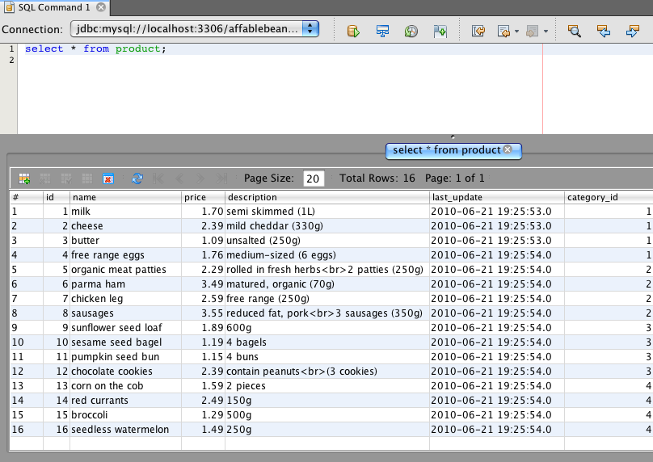
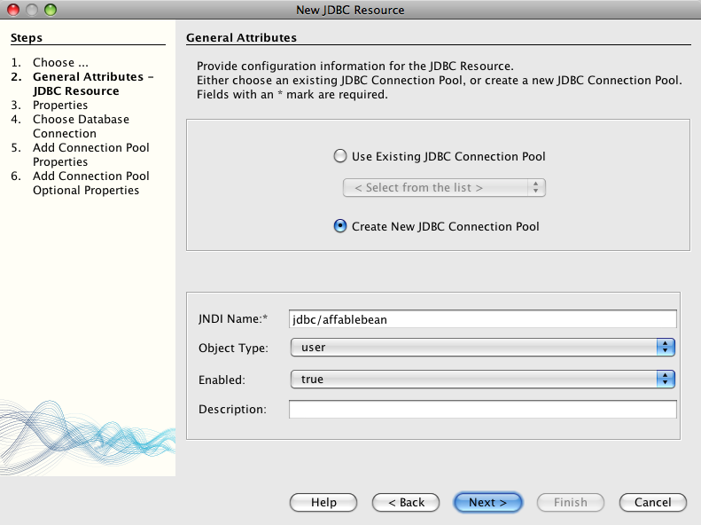
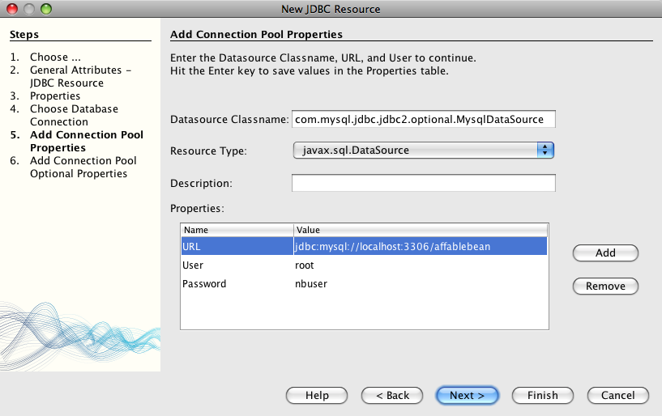
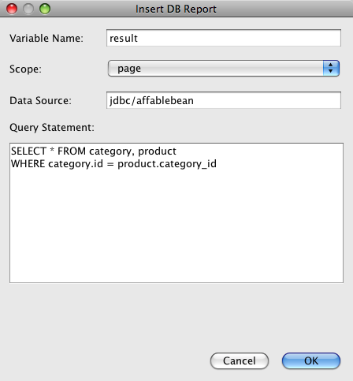
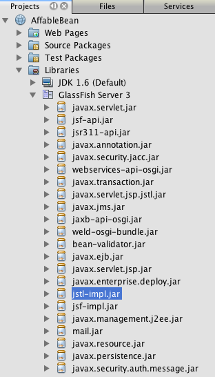
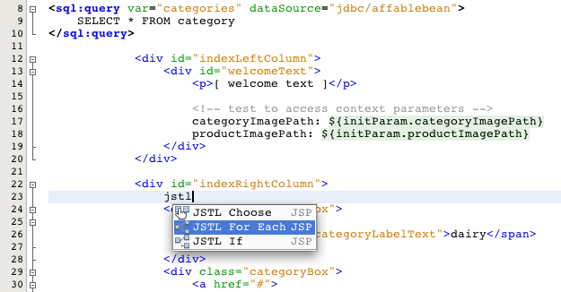
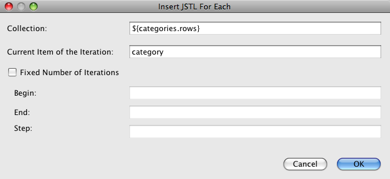
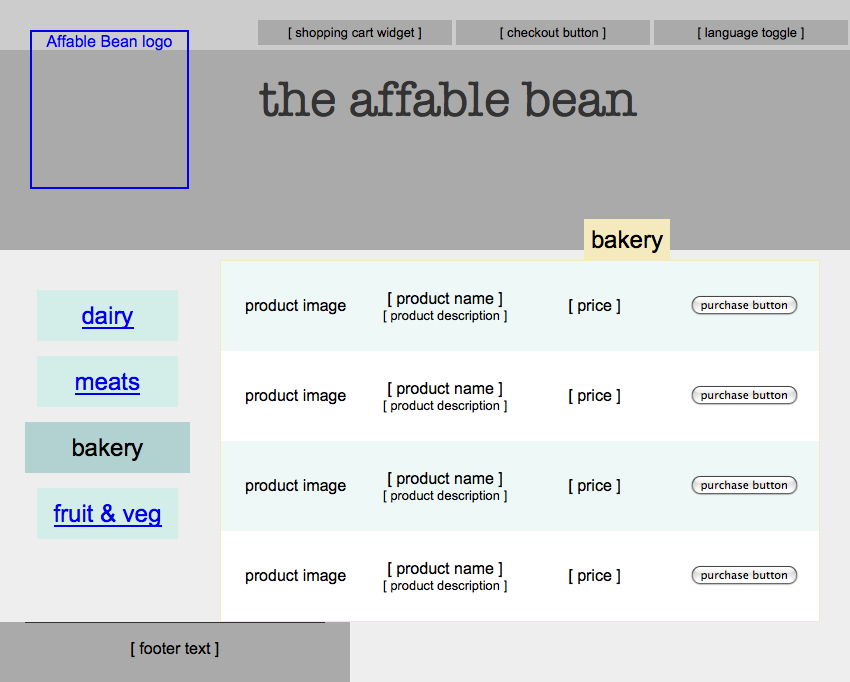
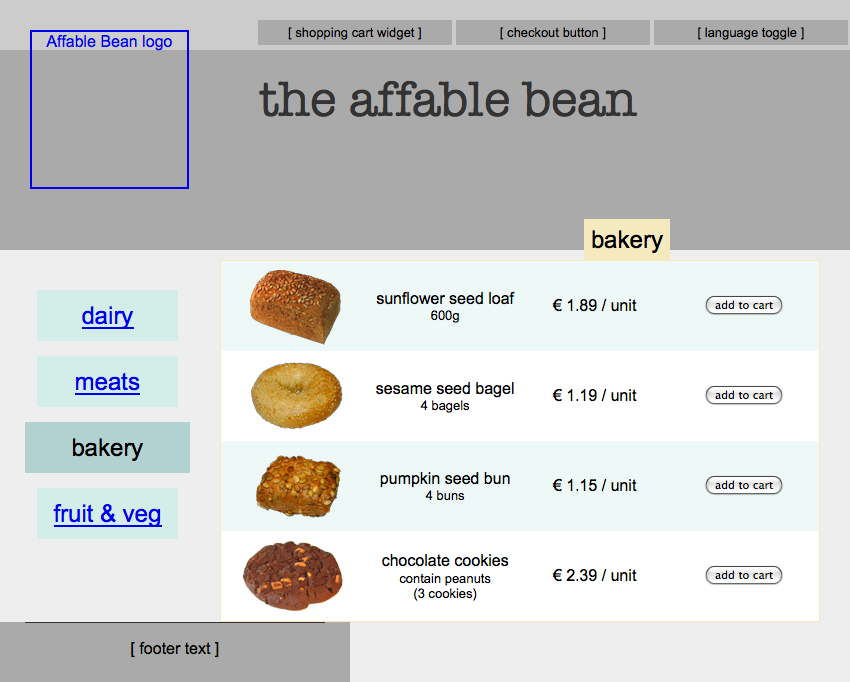

// 
//     Licensed to the Apache Software Foundation (ASF) under one
//     or more contributor license agreements.  See the NOTICE file
//     distributed with this work for additional information
//     regarding copyright ownership.  The ASF licenses this file
//     to you under the Apache License, Version 2.0 (the
//     "License"); you may not use this file except in compliance
//     with the License.  You may obtain a copy of the License at
// 
//       http://www.apache.org/licenses/LICENSE-2.0
// 
//     Unless required by applicable law or agreed to in writing,
//     software distributed under the License is distributed on an
//     "AS IS" BASIS, WITHOUT WARRANTIES OR CONDITIONS OF ANY
//     KIND, either express or implied.  See the License for the
//     specific language governing permissions and limitations
//     under the License.
//

= The NetBeans E-commerce Tutorial - Connecting the Application to the Database
:jbake-type: tutorial
:jbake-tags: tutorials 
:jbake-status: published
:icons: font
:syntax: true
:source-highlighter: pygments
:toc: left
:toc-title:
:description: The NetBeans E-commerce Tutorial - Connecting the Application to the Database - Apache NetBeans
:keywords: Apache NetBeans, Tutorials, The NetBeans E-commerce Tutorial - Connecting the Application to the Database

This tutorial unit focuses on communication between the database and the application. You begin by adding sample data to the database and explore some of the features provided by the IDE's SQL editor. You set up a data source and connection pool on the GlassFish server, and proceed by creating a JSP page that tests the data source by performing a simple query on the database.

This unit also addresses how the application retrieves and displays images necessary for web presentation, and how to set context parameters and retrieve their values from web pages. Once you are certain the data source is working correctly, you apply JSTL's `core` and `sql` tag libraries to retrieve and display category and product images for the xref:design.adoc#index[+index+] and xref:design.adoc#category[+category+] pages.

You can view a live demo of the application that you build in this tutorial: link:http://services.netbeans.org/AffableBean/[+NetBeans E-commerce Tutorial Demo Application+].

|===
|Software or Resource |Version Required 

|xref:../../../../download/index.adoc[NetBeans IDE] |Java bundle, 6.8 or 6.9 

|link:http://www.oracle.com/technetwork/java/javase/downloads/index.html[+Java Development Kit (JDK)+] |version 6 

|<<glassFish,GlassFish server>> |v3 or Open Source Edition 3.0.1 

|link:http://dev.mysql.com/downloads/mysql/[+MySQL database server+] |version 5.1 

|link:https://netbeans.org/projects/samples/downloads/download/Samples%252FJavaEE%252Fecommerce%252FAffableBean_snapshot2.zip[+AffableBean project+] |snapshot 2 

|link:https://netbeans.org/projects/samples/downloads/download/Samples%252FJavaEE%252Fecommerce%252Fimg.zip[+website images+] |n/a 
|===

*Notes:*

* The NetBeans IDE requires the Java Development Kit (JDK) to run properly. If you do not have any of the resources listed above, the JDK should be the first item that you download and install.
* The NetBeans IDE Java Bundle includes Java Web and EE technologies, which are required for the application you build in this tutorial.
* The NetBeans IDE Java Bundle also includes the GlassFish server, which you require for this tutorial. You could link:http://glassfish.dev.java.net/public/downloadsindex.html[+download the GlassFish server independently+], but the version provided with the NetBeans download has the added benefit of being automatically registered with the IDE.
* You can follow this tutorial unit without having completed previous units. To do so, perform the following three steps:
1. *Set up your MySQL database server.* Follow the steps outlined in: xref:setup-dev-environ.adoc#communicate[+Communicating with the Database Server+].
2. *Create the `affablebean` schema on the database server.*
.. Click on link:https://netbeans.org/projects/samples/downloads/download/Samples%252FJavaEE%252Fecommerce%252Faffablebean_schema_creation.sql[+affablebean_schema_creation.sql+] and copy (Ctrl-C; ⌘-C on Mac) the entire contents of the file.
.. Open the IDE's SQL editor. In the Services window (Ctrl-5; ⌘-5 on Mac), right-click the `affablebean` database connection ( image:images/db-connection-node.png[] ) node and choose Execute Command. The IDE's SQL editor opens.
.. Paste (Ctrl-V; ⌘-V on Mac) the entire contents of the `affablebean.sql` file into the editor.
.. Click the Run SQL ( image:images/run-sql-btn.png[] ) button in the editor's toolbar. The script runs on your MySQL server. Tables are generated for the `affablebean` database.

[start=3]
. Open the link:https://netbeans.org/projects/samples/downloads/download/Samples%252FJavaEE%252Fecommerce%252FAffableBean_snapshot2.zip[+project snapshot+] in the IDE. In the IDE, press Ctrl-Shift-O (⌘-Shift-O on Mac) and navigate to the location on your computer where you unzipped the downloaded file.

[[sampleData]]
== Adding Sample Data to the Database

Begin by adding sample data to the `category` and `product` tables. You can do this using the IDE's SQL editor, which allows you to interact directly with the database using native SQL. The IDE's SQL support also includes a GUI editor that enables you to add, remove, modify and delete table records.

* <<category,category table>>
* <<product,product table>>

[[category]]
=== category table

1. In the Services window (Ctrl-5; ⌘-5 on Mac), right-click the `category` table ( image:images/db-table-node.png[] ) node and choose View Data. The SQL editor opens and displays with a GUI representation of the `category` table in the lower region. Note that the table is empty, as no data has yet been added. 

image::images/category-table-empty.png[title="Use the SQL editor to view table data in the IDE"] 

Also, note that the native SQL query used to generate the GUI representation is displayed in the upper region of the editor: '`select * from category`'.

[start=2]
. Delete '`select * from category`' and enter the following SQL statement:

[source,java]
----

INSERT INTO `category` (`name`) VALUES ('dairy'),('meats'),('bakery'),('fruit &amp; veg');
----
This statement inserts four new records, each with a unique entry for the '`name`' column. Because the `id` column was specified as `AUTO_INCREMENT` when you created the schema, you do not need to worry about supplying a value.

[start=3]
. Click the Run SQL ( image:images/run-sql-btn.png[] ) button in the editor's toolbar. The SQL statement is executed.

[start=4]
. To confirm that the data has been added, run the '`select * from category`' query again. To do so, you can use the SQL History window. Click the SQL History ( image:images/sql-history-btn.png[] ) button in the editor's toolbar and double-click the '`select * from category`' entry. The SQL History window lists all SQL statements that you recently executed in the IDE.

Watch the screencast below to see how you can follow the above steps. When typing in the editor, be sure to take advantage of the IDE's code completion and suggestion facilities.

 

[[product]]
=== product table

1. Right-click the `product` table ( image:images/db-table-node.png[] ) node and choose Execute Command. Choosing the Execute Command menu option in the Services window opens the SQL editor in the IDE.
2. Copy and paste the following `INSERT` statements into the editor.

[source,java]
----

--
-- Sample data for table `product`
--

INSERT INTO `product` (`name`, price, description, category_id) VALUES ('milk', 1.70, 'semi skimmed (1L)', 1);
INSERT INTO `product` (`name`, price, description, category_id) VALUES ('cheese', 2.39, 'mild cheddar (330g)', 1);
INSERT INTO `product` (`name`, price, description, category_id) VALUES ('butter', 1.09, 'unsalted (250g)', 1);
INSERT INTO `product` (`name`, price, description, category_id) VALUES ('free range eggs', 1.76, 'medium-sized (6 eggs)', 1);

INSERT INTO `product` (`name`, price, description, category_id) VALUES ('organic meat patties', 2.29, 'rolled in fresh herbs 2 patties (250g)', 2);
INSERT INTO `product` (`name`, price, description, category_id) VALUES ('parma ham', 3.49, 'matured, organic (70g)', 2);
INSERT INTO `product` (`name`, price, description, category_id) VALUES ('chicken leg', 2.59, 'free range (250g)', 2);
INSERT INTO `product` (`name`, price, description, category_id) VALUES ('sausages', 3.55, 'reduced fat, pork 3 sausages (350g)', 2);

INSERT INTO `product` (`name`, price, description, category_id) VALUES ('sunflower seed loaf', 1.89, '600g', 3);
INSERT INTO `product` (`name`, price, description, category_id) VALUES ('sesame seed bagel', 1.19, '4 bagels', 3);
INSERT INTO `product` (`name`, price, description, category_id) VALUES ('pumpkin seed bun', 1.15, '4 buns', 3);
INSERT INTO `product` (`name`, price, description, category_id) VALUES ('chocolate cookies', 2.39, 'contain peanuts (3 cookies)', 3);

INSERT INTO `product` (`name`, price, description, category_id) VALUES ('corn on the cob', 1.59, '2 pieces', 4);
INSERT INTO `product` (`name`, price, description, category_id) VALUES ('red currants', 2.49, '150g', 4);
INSERT INTO `product` (`name`, price, description, category_id) VALUES ('broccoli', 1.29, '500g', 4);
INSERT INTO `product` (`name`, price, description, category_id) VALUES ('seedless watermelon', 1.49, '250g', 4);

----
Examine the above code and note the following points:
* By examining the link:https://netbeans.org/projects/samples/downloads/download/Samples%252FJavaEE%252Fecommerce%252Faffablebean_schema_creation.sql[+`affablebean` schema generation script+], you'll note that the `product` table contains a non-nullable, automatically incremental primary key. Whenever you insert a new record into the table (and don't explicitly set the value of the primary key), the SQL engine sets it for you. Also, note that the `product` table's `last_update` column applies `CURRENT_TIMESTAMP` as its default value. The SQL engine will therefore provide the current date and time for this field when a record is created. 

Looking at this another way, if you were to create an `INSERT` statement that didn't indicate which columns would be affected by the insertion action, you would need to account for all columns. In this case, you could enter a `NULL` value to enable the SQL engine to automatically handle fields that have default values specified. For example, the following statement elicits the same result as the first line of the above code:

[source,java]
----

INSERT INTO `product` VALUES (NULL, 'milk', 1.70, 'semi skimmed (1L)', NULL, 1);
----
After running the statement, you'll see that the record contains an automatically incremented primary key, and the `last_update` column lists the current date and time.
* The value for the final column, '`category_id`', must correspond to a value contained in the `category` table's `id` column. Because you have already added four records to the `category` table, the `product` records you are inserting reference one of these four records. If you try to insert a `product` record that references a `category_id` that doesn't exist, a foreign key constraint fails.

[start=3]
. Click the Run SQL ( image:images/run-sql-btn.png[] ) button in the editor's toolbar. 

*Note:* View the Output window (Ctrl-4; ⌘-4 on Mac) to see a log file containing results of the execution.

[start=4]
. Right-click the `product` table ( image:images/db-table-node.png[] ) node and choose View Data. You can see 16 new records listed in the table. 

 

=== NetBeans GUI Support for Database Tables

In the Services window, when you right-click a table ( image:images/db-table-node.png[] ) node and choose View Data, the IDE displays a visual representation of the table and the data it contains (as depicted in the image above). You can also use this GUI support to add, modify, and delete table data.

* *Add new records:* To add new records, click the Insert Record (  ) button. An Insert Records dialog window displays, enabling you to enter new records. When you click OK, the new data is committed to the database, and the GUI representation of the table is automatically updated. 

Click the Show SQL button within the dialog window to view the SQL statement(s) that will be applied upon initiating the action.

* *Modify records:* You can make edits to existing records by double-clicking directly in table cells and modifying field entries. Modified entries display as green text. When you are finished editing data, click the Commit Record ( image:images/commit-record-btn.png[] ) button to commit changes to the actual database. (Similarly, click the Cancel Edits (  ) button to cancel any edits you have made.
* *Delete individual records:* Click a row in the table, then click the Delete Selected Record ( image:images/delete-selected-record-btn.png[] ) button. You can also delete multiple rows simultaneously by holding Ctrl (⌘ on Mac) while clicking to select rows.
* *Delete all records:* Deleting all records within a table is referred to as '_truncating_' the table. Click the Truncate Table ( image:images/truncate-table-btn.png[] ) button to delete all records contained in the displayed table.

If the displayed data needs to be resynchronized with the actual database, you can click the Refresh Records ( image:images/refresh-records-btn.png[] ) button. Note that much of the above-described functionality can also be accessed from the right-click menu within the GUI editor.

[[createConnPoolDataSource]]
== Creating a Connection Pool and Data Source

From this point onward, you establish connectivity between the MySQL database and the `affablebean` application through the GlassFish server which it is deployed to. This communication is made possible with the Java Database Connectivity (link:http://java.sun.com/products/jdbc/overview.html[+JDBC+]) API. The JDBC API is an integration library contained in the JDK (refer back to the component diagram displayed in the tutorial xref:intro.adoc#platform[+Introduction+]). Although this tutorial does not work directly with JDBC programming, the application that we are building does utilize the JDBC API whenever communication is required between the SQL and Java languages. For example, you start by creating a _connection pool_ on the GlassFish server. In order for the server to communicate directly with the the MySQL database, it requires the link:http://www.mysql.com/downloads/connector/j/[+Connector/J+] JDBC driver which converts JDBC calls directly into a MySQL-specific protocol. Later in this tutorial unit, when you apply JSTL's link:http://download.oracle.com/docs/cd/E17802_01/products/products/jsp/jstl/1.1/docs/tlddocs/sql/query.html[+`<sql:query>`+] tags to query the `affablebean` database, the tags are translated into JDBC link:http://download-llnw.oracle.com/javase/6/docs/api/java/sql/Statement.html[+`Statement`+]s.

A connection pool contains a group of reusable connections for a particular database. Because creating each new physical connection is time-consuming, the server maintains a pool of available connections to increase performance. When an application requests a connection, it obtains one from the pool. When an application closes a connection, the connection is returned to the pool. Connection pools use a JDBC driver to create physical database connections.

A data source (a.k.a. a JDBC resource) provides applications with the means of connecting to a database. Applications get a database connection from a connection pool by looking up a data source using the Java Naming and Directory Interface (link:http://www.oracle.com/technetwork/java/overview-142035.html[+JNDI+]) and then requesting a connection. The connection pool associated with the data source provides the connection for the application.

In order to enable the application access to the `affablebean` database, you need to create a connection pool and a data source that uses the connection pool. Use the NetBeans GlassFish JDBC Resource wizard to accomplish this.

*Note:* You can also create connection pools and data sources directly on the GlassFish server using the GlassFish Administration Console. However, creating these resources in this manner requires that you manually enter database connection details (i.e., username, password and URL). The benefit of using the NetBeans wizard is that it extracts any connection details directly from an existing database connection, thus eliminating potential connectivity problems.

To access the console from the IDE, in the Services window right-click the Servers > GlassFish node and choose View Admin Console. The default username / password is: `admin` / `adminadmin`. If you'd like to set up the connection pool and data source using the GlassFish Administration console, follow steps 3-15 of the xref:setup.adoc[+NetBeans E-commerce Tutorial Setup Instructions+]. The setup instructions are provided for later tutorial units.

1. Click the New File ( image:images/new-file-btn.png[] ) button in the IDE's toolbar. (Alternatively, press Ctrl-N; ⌘-N on Mac.)
2. Select the *GlassFish* category, then select *JDBC Resource* and click Next.
3. In Step 2 of the JDBC Resource wizard, select the `Create New JDBC Connection Pool` option. When you do so, three new steps are added to the wizard, enabling you to specify connection pool settings.
4. Enter details to set up the data source:
* *JNDI Name:* `jdbc/affablebean` 
[tips]#By convention, the JNDI name for a JDBC resource begins with the '`jdbc/`' string.#
* *Object Type:* `user`
* *Enabled:* `true`

[start=5]
. Click Next. In Step 3, Additional Properties, you do not need to specify any additional configuration information for the data source.

[start=6]
. Click Next. In Step 4, Choose Database Connection, type in `AffableBeanPool` as the JDBC connection pool name. Also, ensure that the `Extract from Existing Connection` option is selected, and that the `jdbc:mysql://localhost:3306/affablebean` connection is listed.

[start=7]
. Click Next. In Step 5, Add Connection Pool Properties, specify the following details:
* *Datasource Classname:* `com.mysql.jdbc.jdbc2.optional.MysqlDataSource`
* *Resource Type:* `javax.sql.ConnectionPoolDataSource`
* *Description:* _(Optional)_ `Connects to the affablebean database`
Also, note that the wizard extracts and displays properties from the existing connection. 

[start=8]
. Click Finish. The wizard generates a `sun-resources.xml` file for the project that contains all information required to set up the connection pool and data source on GlassFish. The `sun-resources.xml` file is a deployment descriptor specific to the GlassFish application server. When the project next gets deployed, the server will read in any configuration data contained in `sun-resources.xml`, and set up the connection pool and data source accordingly. Note that once the connection pool and data source exist on the server, your project no longer requires the `sun-resources.xml` file.

[start=9]
. In the Projects window (Ctrl-1; ⌘-1 on Mac), expand the Server Resources node and double-click the `sun-resources.xml` file to open it in the editor. Here you see the XML configuration required to set up the connection pool and data source. (Code below is formatted for readability.)

[source,xml]
----

<resources>
  <jdbc-resource enabled="true"
                 jndi-name="jdbc/affablebean"
                 object-type="user"
                 pool-name="AffableBeanPool">
  </jdbc-resource>

  <jdbc-connection-pool allow-non-component-callers="false"
                        associate-with-thread="false"
                        connection-creation-retry-attempts="0"
                        connection-creation-retry-interval-in-seconds="10"
                        connection-leak-reclaim="false"
                        connection-leak-timeout-in-seconds="0"
                        connection-validation-method="auto-commit"
                        datasource-classname="com.mysql.jdbc.jdbc2.optional.MysqlDataSource"
                        fail-all-connections="false"
                        idle-timeout-in-seconds="300"
                        is-connection-validation-required="false"
                        is-isolation-level-guaranteed="true"
                        lazy-connection-association="false"
                        lazy-connection-enlistment="false"
                        match-connections="false"
                        max-connection-usage-count="0"
                        max-pool-size="32"
                        max-wait-time-in-millis="60000"
                        name="AffableBeanPool"
                        non-transactional-connections="false"
                        pool-resize-quantity="2"
                        res-type="javax.sql.ConnectionPoolDataSource"
                        statement-timeout-in-seconds="-1"
                        steady-pool-size="8"
                        validate-atmost-once-period-in-seconds="0"
                        wrap-jdbc-objects="false">

    <description>Connects to the affablebean database</description>
    <property name="URL" value="jdbc:mysql://localhost:3306/affablebean"/>
    <property name="User" value="root"/>
    <property name="Password" value="nbuser"/>
  </jdbc-connection-pool>
</resources>
----

[start=10]
. In the Projects window (Ctrl-1; ⌘-1 on Mac), right-click the `AffableBean` project node and choose Deploy. The GlassFish server reads configuration data from the `sun-resources.xml` file and creates the `AffableBeanPool` connection pool, and `jdbc/affablebean` data source.

[start=11]
. In the Services window, expand the Servers > GlassFish > Resources > JDBC node. Here you can locate the `jdbc/affablebean` data source listed under JDBC Resources, and the `AffableBeanPool` connection pool listed under Connection Pools. 

image::images/gf-server-jdbc-resources.png[title="View data sources and connection pools registered on the server"] 

Right-click data source and connection pool nodes to view and make changes to their properties. You can associate a data source with any connection pool registered on the server. You can edit property values for connection pools, and unregister both data sources and connection pools from the server.

[[testConnPoolDataSource]]
== Testing the Connection Pool and Data Source

Start by making sure the GlassFish server can successfully connect to the MySQL database. You can do this by pinging the `AffableBeanPool` connection pool in the GlassFish Administration Console.

Then proceed by adding a reference in your project to the data source you created on the server. To do so, you create a `<resource-ref>` entry in the application's `web.xml` deployment descriptor.

Finally, use the IDE's editor support for the link:http://java.sun.com/products/jsp/jstl/[+JSTL+] `sql` tag library, and create a JSP page that queries the database and outputs data in a table on a web page.

* <<ping,Pinging the Connection Pool>>
* <<resourceReference,Creating a Resource Reference to the Data Source>>
* <<query,Querying the Database from a JSP Page>>

[[ping]]
=== Pinging the Connection Pool

1. Ensure that the GlassFish server is already running. In the Services window (Ctrl-5; ⌘-5 on Mac), expand the Servers node. Note the small green arrow next to the GlassFish icon ( image:images/gf-server-running-node.png[] ). 

(If the server is not running, right-click the server node and choose Start.)

[start=2]
. Right-click the server node and choose View Admin Console. The GlassFish Administration Console opens in a browser.

[start=3]
. Log into the administration console. The default username / password is: `admin` / `adminadmin`.

[start=4]
. In the console's tree on the left, expand the Resources > JDBC > Connection Pools nodes, then click `AffableBeanPool`. In the main window, the Edit Connection Pool interface displays for the selected connection pool.

[start=5]
. Click the Ping button. If the ping succeeds, the GlassFish server has a working connection to the `affablebean` database on the MySQL server. 

image::images/ping-succeeded.png[title="Ping the connection pool to determine whether it has a physical connection to the database"] 

(If the ping fails, see suggestions in the <<troubleshoot,Troubleshooting>> section below.)

[[resourceReference]]
=== Creating a Resource Reference to the Data Source

1. In the Projects window, expand the Configuration Files folder and double-click `web.xml`. A graphical interface for the file displays in the IDE's main window.
2. Click the References tab located along the top of the editor. Expand the Resource References heading, then click Add. The Add Resource Reference dialog opens.
3. Enter the following details into the dialog:
* *Resource Name:* `jdbc/affablebean`
* *Resource Type:* `javax.sql.ConnectionPoolDataSource`
* *Authentication:* `Container`
* *Sharing Scope:* `Shareable`
* *Description:* _(Optional)_ `Connects to database for AffableBean application`

image::images/add-resource-ref-dialog.png[title="Specify resource properties in the Add Resource Reference dialog"]

[start=4]
. Click OK. The new resource is added under the Resource References heading. 

image::images/resource-reference.png[title="Create a reference to the data source for the application"] 

To verify that the resource is now added to the `web.xml` file, click the XML tab located along the top of the editor. Notice that the following `<resource-ref>` tags are now included:

[source,xml]
----

<resource-ref>
    <description>Connects to database for AffableBean application</description>
    <res-ref-name>jdbc/affablebean</res-ref-name>
    <res-type>javax.sql.ConnectionPoolDataSource</res-type>
    <res-auth>Container</res-auth>
    <res-sharing-scope>Shareable</res-sharing-scope>
</resource-ref>
----

[[query]]
=== Querying the Database from a JSP Page

1. Create a new JSP page to test the data source. Click the New File ( image:images/new-file-btn.png[] ) button. (Alternatively, press Ctrl-N; ⌘-N on Mac.)
2. Select the Web category, then select the JSP file type and click Next.
3. Enter '`testDataSource`' as the file name. In the Folder field, type in '`test`'. 

image::images/new-jsp-wzd.png[title="Enter details to name and place a new JSP page into the project"] 

The project does not yet have a folder named '`test`' within the Web Pages location (i.e., within the `web` folder). By entering '`test`' into the Folder field, you have the IDE create the folder upon completing the wizard.

[start=4]
. Click finish. The IDE generates a new `testDataSource.jsp` file, and places it into the new `test` folder within the project.

[start=5]
. In the new `testDataSource.jsp` file, in the editor, place your cursor at the end of the line containing the `<h1>` tags (line 17). Press Return, then press Ctrl-Space to invoke code suggestions. Choose DB Report from the list of options. 

image::images/db-report.png[title="Press Ctrl-Space in editor to invoke code suggestions"] 

If line numbers do not display, right-click in the left margin of the editor and choose Show Line Numbers.

[start=6]
. In the Insert DB Report dialog, specify the data source and modify the SQL query to be executed:
* *Data Source:* `jdbc/affablebean`
* *Query Statement:* `SELECT * FROM category, product WHERE category.id = product.category_id`

[start=7]
. Click OK. The dialog adds the `taglib` directives for the JSTL `core` and `sql` libraries to the top of the file:

[source,java]
----

<%@taglib prefix="c" uri="http://java.sun.com/jsp/jstl/core"%>
<%@taglib prefix="sql" uri="http://java.sun.com/jsp/jstl/sql"%>
----
The dialog also generates template code to display the query results in an HTML table:

[source,xml]
----

<sql:query var="result" dataSource="jdbc/affablebean">
    SELECT * FROM category, product
    WHERE category.id = product.category_id
</sql:query>

<table border="1">
    <!-- column headers -->
    <tr>
        <c:forEach var="columnName" items="${result.columnNames}">
            <th><c:out value="${columnName}"/></th>
        </c:forEach>
    </tr>
    <!-- column data -->
    <c:forEach var="row" items="${result.rowsByIndex}">
        <tr>
            <c:forEach var="column" items="${row}">
                <td><c:out value="${column}"/></td>
            </c:forEach>
        </tr>
    </c:forEach>
</table>
----

[start=8]
. Before running the file in a browser, make sure you have enabled the JDBC driver deployment option in NetBeans' GlassFish support. Choose Tools > Servers to open the Servers window. In the left column, select the GlassFish server you are deploying to. In the main column, ensure that the 'Enable JDBC Driver Deployment' option is selected, then click Close. 

image::images/servers-window.png[title="Ensure that the Enable JDBC Driver Deployment option is selected"] 

For Java applications that connect to a database, the server requires a JDBC driver to be able to create a communication bridge between the SQL and Java languages. In the case of MySQL, you use the link:http://www.mysql.com/downloads/connector/j/[+Connector/J+] JDBC driver. Ordinarily you would need to manually place the driver JAR file into the server's `lib` directory. With the 'Enable JDBC Driver Deployment' option selected, the server performs a check to see whether a driver is needed, and if so, the IDE deploys the driver to the server.

[start=9]
. Right-click in the editor and choose Run File (Shift-F6; fn-Shift-F6 on Mac). The `testDataSource.jsp` file is compiled into a servlet, deployed to the server, then runs in a browser.

[start=10]
. Open the Output window (Ctrl-4; ⌘-4 on Mac) and click the 'AffableBean (run)' tab. The output indicates that the driver JAR file (`mysql-connector-java-5.1.6-bin.jar`) is deployed. 

image::images/output-window-mysql-driver.png[title="When JDBC Driver Deployment is enabled, the IDE deploys the MySQL driver to GlassFish when required"]

[start=11]
. Examine `testDataSource.jsp` in the browser. You see an HTML table listing data contained in the `category` and `product` tables. 

image::images/test-data-source.png[title="The JSP page contains data extracted from the 'affablebean' database"] 

(If you receive a server error, see suggestions in the <<troubleshoot,Troubleshooting>> section below.)

At this stage, we have set up a working data source and connection pool on the server, and demonstrated that the application can access data contained in the `affablebean` database.

[[param]]
== Setting Context Parameters

This section demonstrates how to configure context parameters for the application, and how to access parameter values from JSP pages. The owner of an application may want to be able to change certain settings without the need to make intrusive changes to source code. Context parameters enable you application-wide access to parameter values, and provide a convenient way to change parameter values from a single location, should the need arise.

Setting up context parameters can be accomplished in two steps:

1. Listing parameter names and values in the web deployment descriptor
2. Calling the parameters in JSP pages using the `initParam` object

The JSP Expression Language (EL) defines _implicit objects_, which `initParam` is an example of. When working in JSP pages, you can utilize implicit objects using dot notation and placing expressions within EL delimiters (`${...}`). For example, if you have an initialization parameter named `myParam`, you can access it from a JSP page with the expression `${initParam.myParam}`.

For more information on the JSP Expression Language and implicit objects, see the following chapter in the Java EE 6 Tutorial: link:http://docs.oracle.com/javaee/6/tutorial/doc/gjddd.html[+ Chapter 6 - Expression Language+].

By way of demonstration, you create context parameters for the image paths to category and product images used in the `AffableBean` project. Begin by adding the provided image resources to the project, then perform the two steps outlined above.

1. Download the link:https://netbeans.org/projects/samples/downloads/download/Samples%252FJavaEE%252Fecommerce%252Fimg.zip[+website sample images+], and unzip the file to a location on your computer. The unzipped file is an `img` folder that contains all of the image resources required for the `AffableBean` application.
2. Import the `img` folder into the `AffableBean` project. Copy (Ctrl-C; ⌘-C on Mac) the `img` folder, then in the IDE's Projects window, paste (Ctrl-V; ⌘-V on Mac) the folder into the project's Web Pages node. 

image::images/projects-win-img-folder.png[title="Import the 'img' folder into the AffableBean project"] 

The `categories` and `products` folders contain the images that will be displayed in the xref:design.adoc#index[+index+] and xref:design.adoc#category[+category+] pages, respectively.

[start=3]
. Open the project's web deployment descriptor. In the Projects window, expand the Configuration Files node and double-click `web.xml`.

[start=4]
. Click the General tab, then expand Context Parameters and click the Add button.

[start=5]
. In the Add Context Parameter dialog, enter the following details:
* *Parameter Name:* `productImagePath`
* *Parameter Value:* `img/products/`
* *Description:* _(Optional)_ `The relative path to product images`

image::images/add-context-param-dialog.png[title="Add initialization parameters using the Add Context Parameter dialog"]

[start=6]
. Click OK.

[start=7]
. Click the Add button again and enter the following details:
* *Parameter Name:* `categoryImagePath`
* *Parameter Value:* `img/categories/`
* *Description:* _(Optional)_ `The relative path to category images`

[start=8]
. Click OK. The two context parameters are now listed: 

image::images/context-parameters.png[title="Context parameters display in the web.xml interface"]

[start=9]
. Click the XML tab to view the XML content that has been added to the deployment descriptor. The following `<context-param>` entries have been added:

[source,xml]
----

<context-param>
    <description>The relative path to product images</description>
    <param-name>productImagePath</param-name>
    <param-value>img/products/</param-value>
</context-param>
<context-param>
    <description>The relative path to category images</description>
    <param-name>categoryImagePath</param-name>
    <param-value>img/categories/</param-value>
</context-param>
----

[start=10]
. To test whether the values for the context parameters are accessible to web pages, open any of the project's web pages in the editor and enter EL expressions using the `initParam` implicit object. For example, open `index.jsp` and enter the following (New code in *bold*):

[source,html]
----

    

        
[ welcome text ]

        *<!-- test to access context parameters -->
        categoryImagePath: ${initParam.categoryImagePath}
        productImagePath: ${initParam.productImagePath}*
    

----

[start=11]
. Run the project. Click the Run Project ( image:images/run-project-btn.png[] ) button. The project's index page opens in the browser, and you see the values for the `categoryImagePath` and `productImagePath` context parameters displayed in the page. 

image::images/context-params-browser.png[title="Use 'initParam' with JSP EL delimiters to display context parameter values"]

[[jstl]]
== Working with JSTL

So far in this tutorial unit, you've established how to access data from the `affablebean` database, add image resources to the project, and have set up several context parameters. In this final section, you combine these achievements to plug the product and category images into the application. In order to do so effectively, you need to begin taking advantage of the JavaServer Pages Standard Tag Library (JSTL).

Note that you do not have to worry about adding the JSTL JAR file (`jstl-impl.jar`) to your project's classpath because it already exists. When you created the `AffableBean` project and selected GlassFish as your development server, the libraries contained in the server were automatically added to your project's classpath. You can verify this in the Projects window by expanding the `AffableBean` project's Libraries > GlassFish Server 3 node to view all of the libraries provided by the server. 

 

The `jstl-impl.jar` file is GlassFish' implementation of JSTL, version 1.2.

You can also download the GlassFish JSTL JAR file separately from: link:http://jstl.dev.java.net/download.html[+http://jstl.dev.java.net/download.html+]

Before embarking upon an exercise involving JSTL, one implementation detail needs to first be clarified. Examine the files contained in the `categories` and `products` folders and note that the names of the provided image files match the names of the category and product entries found in the database. This enables us to leverage the database data to dynamically call image files within the page. So for example, if the web page needs to access the image for the broccoli product entry, you can make this happen using the following statement.

[source,java]
----

${initParam.productImagePath}broccoli.png
----

After implementing a JSTL `link:http://java.sun.com/products/jsp/jstl/1.1/docs/tlddocs/c/forEach.html[+forEach+]` loop, you'll be able to replace the hard-coded name of the product with an EL expression that dynamically extracts the name of the product from the database, and inserts it into the page.

[source,java]
----

${initParam.productImagePath}${product.name}.png
----

Begin by integrating the category images into the index page, then work within the category page so that data pertaining to the selected category is dynamically handled.

* <<indexJSTL,index page>>
* <<categoryJSTL,category page>>

[[indexJSTL]]
=== index page

1. In the Projects window, double-click the `index.jsp` node to open it in the editor. (If already opened, press Ctrl-Tab to select it in the editor.)
2. At the top of the file, before the first `
` tag, place your cursor on a blank line, then type '`db`' and press Ctrl-Space. In the code-completion pop-up window that displays, choose DB Query. 

image::images/db-query.png[title="Type 'db', then press Ctrl-Space to invoke code completion suggestions"]

[start=3]
. In the Insert DB Query dialog, enter the following details:
* *Variable Name:* `categories`
* *Scope:* `page`
* *Data Source:* `jdbc/affablebean`
* *Query Statement:* `SELECT * FROM category`

image::images/insert-db-query.png[title="Specify query details to create an SQL query using JSTL <sql:query> tags"]

[start=4]
. Click OK. The dialog generates an SQL query using JSTL `<sql:query>` tags. Also, note that the required reference to the `sql` `taglib` directive has been automatically inserted at the top of the page. (Changes displayed in *bold*.)

[source,html]
----

*<%@taglib prefix="sql" uri="http://java.sun.com/jsp/jstl/sql"%>*
<%--
    Document   : index
    Created on : Sep 5, 2009, 4:32:42 PM
    Author     : nbuser
--%>

*<sql:query var="categories" dataSource="jdbc/affablebean">
    SELECT * FROM category
</sql:query>*

            

                

                    
[ welcome text ]

                    
----
The SQL query creates a result set which is stored in the `categories` variable. You can then access the result set using EL syntax, e.g., `${categories}` (demonstrated below).

[start=5]
. Place your cursor at the end of '`
`' (line 22), hit return, type '`jstl`' then press Ctrl-Space and choose JSTL For Each. 

[start=6]
. In the Insert JSTL For Each dialog, enter the following details:
* *Collection:* `${categories.rows}`
* *Current Item of the Iteration:* `category`

[start=7]
. Click OK. The dialog sets up syntax for a JSTL `forEach` loop using `<c:forEach>` tags. Also, note that the required reference to the `core` `taglib` directive has been automatically inserted at the top of the page. (Changes displayed in *bold*.)

[source,html]
----

*<%@taglib prefix="c" uri="http://java.sun.com/jsp/jstl/core"%>*
<%@taglib prefix="sql" uri="http://java.sun.com/jsp/jstl/sql"%>

    ...

    

        *<c:forEach var="category" items="categories.rows">
        </c:forEach>*
        

----

If you are wondering what '`rows`' refers to in the generated code, recall that the `categories` variable represents a result set. More specifically, `categories` refers to an object that implements the `link:http://java.sun.com/products/jsp/jstl/1.1/docs/api/javax/servlet/jsp/jstl/sql/Result.html[+javax.servlet.jsp.jstl.sql.Result+]` interface. This object provides properties for accessing the rows, column names, and size of the query’s result set. When using dot notation as in the above example, '`categories.rows`' is translated in Java to '`categories.getRows()`'.

[start=8]
. Integrate the `<c:forEach>` tags into the page. You can nest the `
` tags within the `forEach` loop so that HTML markup is generated for each of the four categories. Use EL syntax to extract the `category` table's `id` and `name` column values for each of the four records. Make sure to delete the other `
` tags which exist outside the `forEach` loop. When you finish, the complete `index.jsp` file will look as follows. (`<c:forEach>` tags and contents are displayed in *bold*.)

[source,html]
----

<%@taglib prefix="c" uri="http://java.sun.com/jsp/jstl/core"%>
<%@taglib prefix="sql" uri="http://java.sun.com/jsp/jstl/sql"%>
<%--
    Document   : index
    Created on : Sep 5, 2009, 4:32:42 PM
    Author     : nbuser
--%>

<sql:query var="categories" dataSource="jdbc/affablebean">
    SELECT * FROM category
</sql:query>

            

                

                    
[ welcome text ]

                    <!-- test to access context parameters -->
                    categoryImagePath: ${initParam.categoryImagePath}
                    productImagePath: ${initParam.productImagePath}
                

            

            *

                <c:forEach var="category" items="${categories.rows}">
                    

                        <a href="category?${category.id}">

                            ${category.name}

                            
                        </a>
                    

                </c:forEach>
            
*
----

[start=9]
. Click the Run Project ( image:images/run-project-btn.png[] ) button. The project's index page opens in the browser, and you see the names and images of the four categories. 

image::images/index-category-images.png[title="'for each' loop extracts details from the database and utilizes them in the page"]

[start=10]
. Click any of the four images in the browser. The category page displays. 

image::images/category-page.png[title="Category images from index page link to category page"]

To understand how linking takes place between the index and category pages, reexamine the HTML anchor tags within the `forEach` loop:

[source,java]
----

<a href="category?${category.id}">
----

When a user clicks the image link in the browser, a request for '`category`' is sent to the application's context root on the server. In your development environment, the URL is as follows:

[source,java]
----

http://localhost:8080/AffableBean/category
----

This URL can can be explained in the following manner:

* `http://localhost:8080`: The default location of the GlassFish server on your computer
* `/AffableBean`: The context root of your deployed application
* `/category`: The path to the request

Recall that in xref:page-views-controller.adoc#controller[+Preparing the Page Views and Controller Servlet+], you mapped a request for '`/category`' to the `ControllerServlet`. Currently, the `ControllerServlet` internally forwards the request to `/WEB-INF/view/category.jsp`, which is why the category page displays upon clicking an image link.

You can verify the application's context root by expanding the Configuration Files node in the Projects window, and opening the `sun-web.xml` file. The `sun-web.xml` file is a deployment descriptor specific to GlassFish.

Also, note that a question mark (`?`) and category ID are appended to the requested URL.

[source,java]
----

<a href="category*?${category.id}*">
----

This forms the _query string_. As is demonstrated in the next section, you can apply `(pageContext.request.queryString}` to extract the value of the query string from the request. You can then use the category ID from the query string to determine which category details need to be included in the response.

[[categoryJSTL]]
=== category page

Three aspects of the category page need to be handled dynamically. The left column must indicate which category is selected, the table heading must display the name of the selected category, and the table must list product details pertaining to the selected category. In order to implement these aspects using JSTL, you can follow a simple, 2-step pattern:

1. Retrieve data from the database using the JSTL `sql` tag library.
2. Display the data using the JSTL `core` library and EL syntax.

Tackle each of the three tasks individually.

==== Display selected category in left column

1. In the Projects window, double-click the `category.jsp` node to open it in the editor. (If already opened, press Ctrl-Tab to select it in the editor.)
2. Add the following SQL query to the top of the file.

[source,xml]
----

<sql:query var="categories" dataSource="jdbc/affablebean">
    SELECT * FROM category
</sql:query>
----
Either use the Insert DB Query dialog as <<categoryIndex,described above>>, or use the editor's code suggestion and completion facilities by pressing Ctrl-Space while typing.

[start=3]
. Between the `
` tags, replace the existing static placeholder content with the following `<c:forEach>` loop.

[source,html]
----

    *<c:forEach var="category" items="${categories.rows}">

        <c:choose>
            <c:when test="${category.id == pageContext.request.queryString}">
                

                    
                        ${category.name}
                    
                

            </c:when>
            <c:otherwise>
                <a href="category?${category.id}" class="categoryButton">
                    

                        ${category.name}
                    

                </a>
            </c:otherwise>
        </c:choose>

    </c:forEach>*

----
In the above snippet, you access the request's query string using '`pageContext.request.queryString`'. `pageContext` is another link:http://download.oracle.com/docs/cd/E17477_01/javaee/5/tutorial/doc/bnahq.html#bnaij[+implicit object+] defined by the JSP Expression Language. The EL expression uses the `link:http://java.sun.com/webservices/docs/1.6/api/javax/servlet/jsp/PageContext.html[+PageContext+]` to access the current request (an `link:http://java.sun.com/webservices/docs/1.6/api/javax/servlet/http/HttpServletRequest.html[+HttpServletRequest+]` object). From `HttpServletRequest`, the `getQueryString()` method is called to obtain the value of the request's query string.

[start=4]
. Make sure to add the JSTL `core` and `sql` `taglib` directives to the top of the page. (This is done automatically when using the editor's code suggestion and completion facilities.)

[source,java]
----

<%@taglib prefix="c" uri="http://java.sun.com/jsp/jstl/core"%>
<%@taglib prefix="sql" uri="http://java.sun.com/jsp/jstl/sql"%>
----

[start=5]
. Run the project. In the browser, navigate to the category page and click the category buttons in the left column. Each time you click, the page refreshes highlighting the selected category. 

image::images/category-page-bakery.png[title="Select categories by clicking category buttons in the left column"] 

Also, note that the ID of the selected category is displayed in the page's URL. (In the above image, the bakery category is selected, and '`3`' is appended to the URL in the browser's navigation toolbar.) 

Your servlet container (i.e., GlassFish) converts JSP pages into servlets before running them as part of a project. You can view the generated servlet for a JSP page by right-clicking the page node in the Projects window and choosing View Servlet. Of course, you first need to run the project so that the servlet is generated. Taking the `index.jsp` file as an example, when you choose View Servlet, the IDE displays a read-only copy of the generated servlet, `index_jsp.java`, in the editor. The servlet exists on the server at: `_<gf-install-dir>_/glassfish/domains/domain1/generated/jsp/AffableBean/org/apache/jsp/index_jsp.java`.

=== Examining Implicit Object Values using the IDE's Debugger

You can use the IDE's Java debugger to examine values for implicit objects. To do so, set a breakpoint on a line containing JSP or JSTL syntax in a JSP page, then run the debugger. When the debugger suspends on the breakpoint, you can open the Variables window (Window > Debugging > Variables) to inspect values currently held by the application.

Taking your current implementation of `category.jsp` as an example, perform the following steps:

1. Set a breakpoint on the line containing:

[source,java]
----

<c:when test="${category.id == pageContext.request.queryString}">
----
(To set a breakpoint, click in the left margin of the line. A breakpoint ( image:images/breakpoint-icon.png[] ) icon displays.)

[start=2]
. In the IDE's main toolbar, click the Debug Project ( image:images/debug-project-btn.png[] ) button. A debugging session is activated for the project, and the application's index page opens in the browser.

[start=3]
. Click the bakery category in the index page. (You know that the ID for the bakery category is '`3`').

[start=4]
. Return to the IDE, and note that the debugger is suspended on the line containing the breakpoint. When suspended, the margin shows a green arrow on the breakpoint ( image:images/debugger-suspended-icon.png[] ), and the line displays with green background.

[start=5]
. Open the Variables window (Ctrl-Shift-1) and expand the Implicit Objects > pageContext > request > queryString node. Inspect the variable value and note that the value is '`3`', corresponding to the category ID from your selection.

[start=6]
. Press the Finish Debugger Session ( image:images/finish-debugger-session-btn.png[] ) button to terminate the debugger session.

==== Display title heading above product table

1. Add the following SQL query to the top of the file, underneath the query you just implemented. (New query is shown in *bold*.)

[source,xml]
----

<sql:query var="categories" dataSource="jdbc/affablebean">
    SELECT * FROM category
</sql:query>

*<sql:query var="selectedCategory" dataSource="jdbc/affablebean">
    SELECT name FROM category WHERE id = ?
    <sql:param value="${pageContext.request.queryString}"/>
</sql:query>*
----

[start=2]
. Use JSP EL syntax to extract the category name from the query and display it in the page. Make the following change to the `
` element. (Displayed in *bold*.)

[source,xml]
----

*${selectedCategory.rows[0].name}*

----
Since the result from the `selectedCategory` query contains only one item (i.e., user can select only one category), you can retrieve the first row of the result set using '`selectedCategory*.rows[0]*`'. If a user selects the 'meats' category for example, the returned expression would be '`{name=meats}`'. You could then access the category name with '`${selectedCategory.rows[0]*.name*}`'.

[start=3]
. Save (Ctrl-S; ⌘-S on Mac) changes made to the file.

[start=4]
. Return to the browser and refresh the category page. The name of the selected category now displays above the product table. 

 

*Note:* As demonstrated in this and the previous step, you do not need to explicitly recompile, deploy, and run the project with each change to your code base. The IDE provides a Deploy on on Save feature, which is enabled for Java web projects by default. To verify that the feature is activated, right-click your project node in the Projects window and choose Properties. In the Project Properties window, click the Run category and examine the 'Deploy on Save' option.

==== Display product details within the table

1. Add the following SQL query to the top of the file, underneath the previous queries you implemented. (New query is shown in *bold*.)

[source,xml]
----

<sql:query var="categories" dataSource="jdbc/affablebean">
    SELECT * FROM category
</sql:query>

<sql:query var="selectedCategory" dataSource="jdbc/affablebean">
    SELECT name FROM category WHERE id = ?
    <sql:param value="${pageContext.request.queryString}"/>
</sql:query>

*<sql:query var="categoryProducts" dataSource="jdbc/affablebean">
    SELECT * FROM product WHERE category_id = ?
    <sql:param value="${pageContext.request.queryString}"/>
</sql:query>*
----

[start=2]
. Between the `<table id="productTable">` tags, replace the existing static table row placeholders (`<tr>` tags) with the following `<c:forEach>` loop. (Changes are displayed in *bold*.)

[source,xml]
----

<table id="productTable">

    *<c:forEach var="product" items="${categoryProducts.rows}" varStatus="iter">

        <tr class="${((iter.index % 2) == 0) ? 'lightBlue' : 'white'}">
            <td>
                
            </td>
            <td>
                ${product.name}
                 
                ${product.description}
            </td>
            <td>
                &amp;euro; ${product.price} / unit
            </td>
            <td>
                <form action="addToCart" method="post">
                    <input type="hidden"
                           name="productId"
                           value="${product.id}">
                    <input type="submit"
                           value="add to cart">
                </form>
            </td>
        </tr>

    </c:forEach>*

</table>
----
Note that in the above snippet an EL expression is used to determine the background color for table rows:

[source,java]
----

class="${((iter.index % 2) == 0) ? 'lightBlue' : 'white'}"
----
The API documentation for the `link:http://java.sun.com/products/jsp/jstl/1.1/docs/tlddocs/c/forEach.html[+<c:forEach>+]` tag indicates that the `varStatus` attribute represents an object that implements the `link:http://java.sun.com/products/jsp/jstl/1.1/docs/api/javax/servlet/jsp/jstl/core/LoopTagStatus.html[+LoopTagStatus+]` interface. Therefore, `iter.index` retrieves the index of the current round of the iteration. Continuing with the expression, `(iter.index % 2) == 0)` evaluates the remainder when `iter.index` is divided by `2`, and returns a boolean value based on the outcome. Finally, an EL conditional operator (`? :`) is used to set the returned value to '`lightBlue`' if true, '`white`' otherwise. 

For a description of JSP Expression Language operators, see the Java EE 5 Tutorial: link:http://download.oracle.com/docs/cd/E17477_01/javaee/5/tutorial/doc/bnahq.html#bnaik[+JavaServer Pages Technology > Unified Expression Language > Operators+].

[start=3]
. Save (Ctrl-S; ⌘-S on Mac) changes made to the file.

[start=4]
. Return to the browser and refresh the category page. Product details now display within the table for the selected category. 

You have now completed this tutorial unit. In it, you explored how to connect your application to the database by setting up a connection pool and data source on the server, then referenced the data source from the application. You also created several context parameters, and learned how to access them from JSP pages. Finally, you implemented JSTL tags into the application's web pages in order to dynamically retrieve and display database data.

You can download and examine link:https://netbeans.org/projects/samples/downloads/download/Samples%252FJavaEE%252Fecommerce%252FAffableBean_snapshot3.zip[+snapshot 3+] if you'd like to compare your work with the solution project. The solution project contains enhancements to the HTML markup and stylesheet in order to properly display all provided images. It also provides welcome page text, and a basic implementation for the page footer.

xref:../../../../community/mailing-lists.adoc[+Send Us Your Feedback+]

[[troubleshoot]]
== Troubleshooting

If you are having problems, see the troubleshooting tips below. If you continue to have difficulty, or would like to provide constructive feedback, use the Send us Your Feedback link.

* You receive the following exception:

[source,java]
----

org.apache.jasper.JasperException: PWC6188: The absolute uri: http://java.sun.com/jsp/jstl/core cannot be resolved in either web.xml or the jar files deployed with this application
----
This is a link:https://bz.apache.org/netbeans/show_bug.cgi?id=188406[+known issue+] for NetBeans IDE 6.9. Try to deploy the project, then access the file by typing its URL in the browser. For example, if you are trying to view `testDataSource.jsp` in a browser, enter '`http://localhost:8080/AffableBean/test/testDataSource.jsp`' in the browser's URL field directly. Otherwise, add the IDE's JSTL 1.1 library to the project. In the Projects window, right-click the Libraries node and choose Add Library. Select JSTL 1.1. For more information, see: link:http://forums.netbeans.org/topic28571.html[+http://forums.netbeans.org/topic28571.html+].
* You receive the following exception:

[source,java]
----

javax.servlet.ServletException: javax.servlet.jsp.JspException: Unable to get connection, DataSource invalid: "java.sql.SQLException: Error in allocating a connection. Cause: Class name is wrong or classpath is not set for : com.mysql.jdbc.jdbc2.optional.MysqlDataSource"
----
This can occur when the MySQL driver has not been added to the domain `lib` folder. (Note that after adding, it is necessary to restart the server if it is already running.)
* You receive the following exception:

[source,java]
----

javax.servlet.ServletException: javax.servlet.jsp.JspException: Unable to get connection, DataSource invalid: "java.sql.SQLException: No suitable driver found for jdbc/affablebean"
----
This can occur when the `jdbc/affablebean` resource reference hasn't been added to the `web.xml` deployment descriptor.
* You receive the following exception:

[source,java]
----

javax.servlet.ServletException: javax.servlet.jsp.JspException: Unable to get connection, DataSource invalid: "java.sql.SQLException: Error in allocating a connection. Cause: Connection could not be allocated because: Access denied for user 'root'@'localhost' (using password: YES)"
----
This can occur when you are using an incorrect username/password combination. Make sure the username and password you use to connect to the MySQL server are correctly set for your connection pool in the `sun-resources.xml` file. Also, check that the username and password are correctly set for the connection pool in the GlassFish Administration Console.

[[seeAlso]]
== See Also

=== NetBeans Resources

* xref:../../ide/mysql.adoc[+Connecting to a MySQL Database+]
* xref:../../web/quickstart-webapps.adoc[+Introduction to Developing Web Applications+]
* xref:../../web/mysql-webapp.adoc[+Creating a Simple Web Application Using a MySQL Database+]
* xref:../../ide/database-improvements-screencast.adoc[+Screencast: Database Support in NetBeans IDE+]

=== MySQL Resources

* link:http://dev.mysql.com/librarian/[+The MySQL Community Librarian+]
* link:http://dev.mysql.com/doc/refman/5.1/en/[+MySQL 5.1 Reference Manual+]
* link:http://www.mysql.com/why-mysql/java/#howtos[+MySQL and Java+]
* link:http://forums.mysql.com/[+MySQL Forums+]

=== JSP &amp; EL Resources

* *Product Page:* link:http://java.sun.com/products/jsp/[+JavaServer Pages Technology+]
* *Specification Download:* link:http://jcp.org/aboutJava/communityprocess/mrel/jsr245/index.html[+JSR 245: JSP and EL 2.2 Maintenance Release+]
* *API Documentation:* link:http://java.sun.com/products/jsp/2.1/docs/jsp-2_1-pfd2/index.html[+JavaServer Pages 2.1 API Documentation+]
* *Supporting Documentation:* link:http://download.oracle.com/docs/cd/E17477_01/javaee/5/tutorial/doc/bnagx.html[+Java EE 5 Tutorial - Chapter 5: JavaServer Pages Technology+]
* *Syntax Reference:* link:http://java.sun.com/products/jsp/syntax/2.0/syntaxref20.html[+JavaServer Pages 2.0 Syntax Reference+]
* *Official Forum:* link:http://forums.sun.com/forum.jspa?forumID=45[+Web Tier APIs - JavaServer Pages (JSP) and JSTL+]

=== JSTL Resources

* *Product Page:* link:http://java.sun.com/products/jsp/jstl/[+JavaServer Pages Standard Tag Library+]
* *Specification Download:* link:http://jcp.org/aboutJava/communityprocess/final/jsr052/index2.html[+JSR 52: JSTL 1.2 Maintenance Release+]
* *Implementation Download:* link:http://jstl.dev.java.net/download.html[+GlassFish JSTL Project Download+]
* *Tag Library Documentation:* link:http://java.sun.com/products/jsp/jstl/1.1/docs/tlddocs/index.html[+JSTL 1.1 Tag Reference+]
* *API Documentation:* link:http://java.sun.com/products/jsp/jstl/1.1/docs/api/index.html[+JSTL 1.1 API Reference+]

=== Technical Articles &amp; Reference Cards

* link:http://java.sun.com/developer/technicalArticles/javaserverpages/JSP20/[+Developing Web Applications With JavaServer Pages 2.0+]
* link:http://java.sun.com/developer/technicalArticles/J2EE/jsp_21/[+Web Tier to Go With Java EE 5: Summary of New Features in JSP 2.1 Technology+]
* link:http://java.sun.com/products/jsp/reference/techart/unifiedEL.html[+Unified Expression Language+]
* link:http://today.java.net/pub/a/today/2003/10/07/jstl1.html[+Practical JSTL, Part 1+]
* link:http://www.ibm.com/developerworks/java/library/j-jstl0520/index.html[+A JSTL primer, Part 4: Accessing SQL and XML content+]
* link:http://java.sun.com/products/jsp/syntax/2.0/card20.pdf[+JavaServer Pages v2.0 Syntax Card+]
* link:http://refcardz.dzone.com/refcardz/essential-jsp-expression[+Essential JSP Expression Language Reference Card+]
* link:http://download.oracle.com/docs/cd/E17409_01/javase/tutorial/jdbc/index.html[+The Java Tutorials: JDBC Database Access+]
* link:http://java.sun.com/developer/Books/jdbc/[+Database Programming with JDBC and Java, Second Edition+]
* link:http://refcardz.dzone.com/refcardz/essential-jsp-expression[+Essential JSP Expression Language Reference Card+]
* link:http://java.sun.com/products/jndi/tutorial/[+The JNDI Tutorial+]
