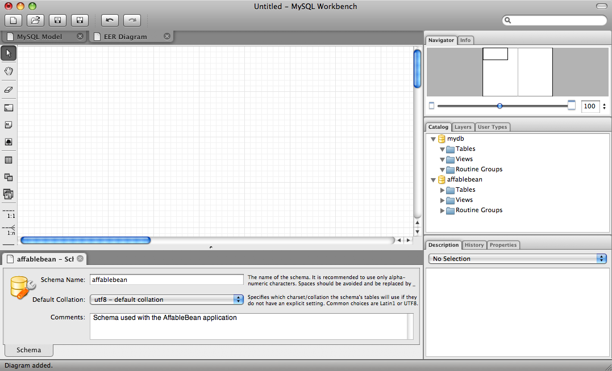
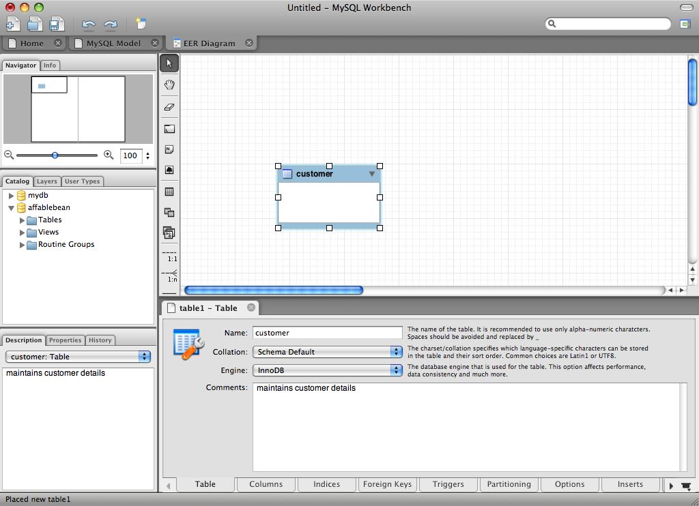
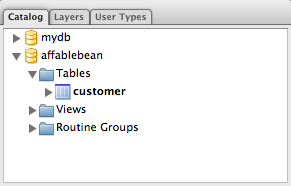
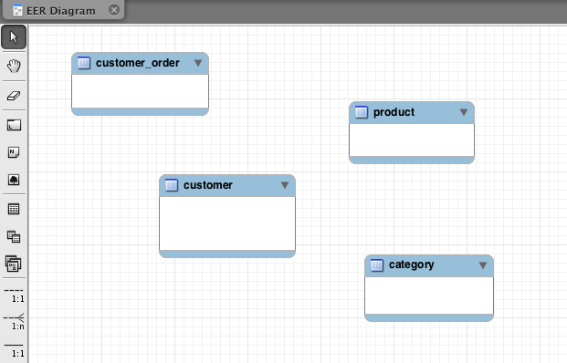
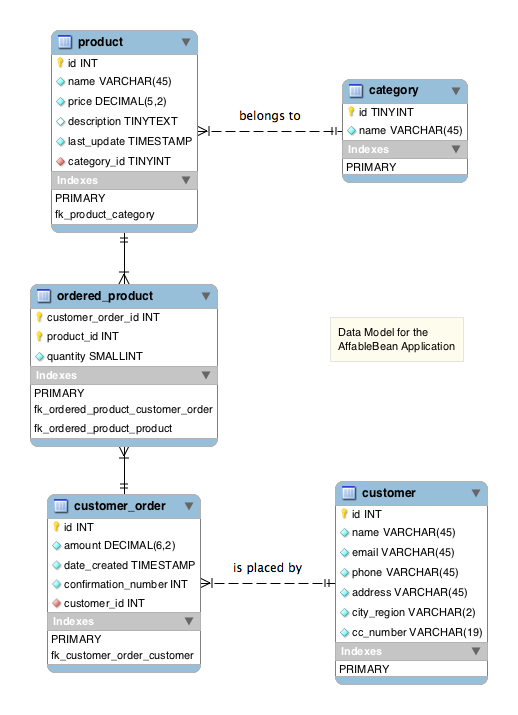

// 
//     Licensed to the Apache Software Foundation (ASF) under one
//     or more contributor license agreements.  See the NOTICE file
//     distributed with this work for additional information
//     regarding copyright ownership.  The ASF licenses this file
//     to you under the Apache License, Version 2.0 (the
//     "License"); you may not use this file except in compliance
//     with the License.  You may obtain a copy of the License at
// 
//       http://www.apache.org/licenses/LICENSE-2.0
// 
//     Unless required by applicable law or agreed to in writing,
//     software distributed under the License is distributed on an
//     "AS IS" BASIS, WITHOUT WARRANTIES OR CONDITIONS OF ANY
//     KIND, either express or implied.  See the License for the
//     specific language governing permissions and limitations
//     under the License.
//

= The NetBeans E-commerce Tutorial - Designing the Data Model
:jbake-type: tutorial
:jbake-tags: tutorials 
:jbake-status: published
:icons: font
:syntax: true
:source-highlighter: pygments
:toc: left
:toc-title:
:description: The NetBeans E-commerce Tutorial - Designing the Data Model - Apache NetBeans
:keywords: Apache NetBeans, Tutorials, The NetBeans E-commerce Tutorial - Designing the Data Model
include::../../../../inc/database.adoc[]

This tutorial unit focuses on data modeling, or the process of creating a conceptual model of your storage system by identifying and defining the entities that your system requires, and their relationships to one another. The data model should contain all the logical and physical design parameters required to generate a script using the Data Definition Language (DDL), which can then be used to create a database.^<<footnote1,[1]>>^

In this unit, you work primarily with link:http://wb.mysql.com/[+MySQL Workbench+], a graphical tool that enables you to create data models, reverse-engineer SQL scripts into visual representations, forward-engineer data models into database schemata, and synchronize models with a running MySQL database server.

You begin by creating an entity-relationship diagram to represent the data model for the `AffableBean` application. When you have completed identifying and defining all entities and the relationships that bind them, you use Workbench to forward-engineer and run a DDL script that converts the data model into a database schema. Finally, you connect to the new schema from the NetBeans IDE.

You can view a live demo of the application that you build in this tutorial: link:http://services.netbeans.org/AffableBean/[+NetBeans E-commerce Tutorial Demo Application+].

|===
|Software or Resource |Version Required 

|xref:../../../../download/index.adoc[NetBeans IDE] |Java bundle, 6.8 or 6.9 

|link:http://www.oracle.com/technetwork/java/javase/downloads/index.html[+Java Development Kit (JDK)+] |version 6 

|link:http://dev.mysql.com/downloads/mysql/[+MySQL database server+] |version 5.1 

|link:http://dev.mysql.com/downloads/workbench/[+MySQL Workbench+] |version 5.1 or 5.2 
|===

*Notes:*

* The NetBeans IDE requires the Java Development Kit (JDK) to run properly. If you do not have any of the resources listed above, the JDK should be the first item that you download and install.
* The NetBeans IDE Java Bundle includes Java Web and EE technologies, which are required for the application you build in this tutorial.
* You can download the complete DDL script that MySQL Workbench generates from the entity-relationship diagram you create in this tutorial: link:https://netbeans.org/projects/samples/downloads/download/Samples%252FJavaEE%252Fecommerce%252Faffablebean_schema_creation.sql[+affablebean_schema_creation.sql+].

[[idEntities]]
== Identifying Entities for the Data Model

In the real world, you may not have the luxury of designing the data model for your application. For example, your task may be to develop an application on top of an existing database system. Provided you do not have a data model to base your application on, creating one should be one of the first design steps you take before embarking on development. Creating a data model involves identifying the objects, or _entities_, required by your system and defining the relationships between them.

To begin identifying the entities we need for the data model, re-examine the use-case presented in xref:design.adoc#mockups[+Designing the Application+]. Search for commonly-occurring nouns. For example:

=== Use-Case

*Customer* visits the welcome page and selects a product *category*. *Customer* browses *products* within the selected category page, then adds a *product* to his or her *shopping cart*. *Customer* continues shopping and selects a different *category*. *Customer* adds several *products* from this *category* to *shopping cart*. *Customer* selects 'view cart' option and updates quantities for cart *products* in the cart page. *Customer* verifies shopping cart contents and proceeds to checkout. In the checkout page, *customer* views the cost of the *order* and other information, fills in personal data, then submits his or her details. The *order* is processed and *customer* is taken to a confirmation page. The confirmation page provides a unique reference number for tracking the customer *order*, as well as a summary of the *order*.

The text highlighted above in *bold* indicates the candidates that we can consider for the data model. Upon closer inspection, you may deduce that the shopping cart does not need to be included, since the data it provides (i.e., products and their quantities) is equally offered by a customer order once it is processed. In fact, as will be demonstrated in Unit 8, xref:manage-sessions.adoc[+Managing Sessions+], the shopping cart merely serves as a mechanism that retains a user session temporarily while the customer shops online. We can therefore settle on the following list:

* *customer*
* *category*
* *product*
* *order*

With these four entities, we can begin constructing an entity-relationship diagram (ERD).

*Note:* In this tutorial, we create a database schema from the ERD, then use the IDE's EclipseLink support to generate JPA entity classes from the existing database. (EclipseLink and the Java Persistence API (JPA) are covered in Unit 7, xref:entity-session.adoc[+Adding Entity Classes and Session Beans+].) This approach is described as _bottom up_ development. An equally viable alternative is the _top down_ approach.

* *Top down:* In _top down_ development, you start with an existing Java implementation of the domain model, and have complete freedom with respect to the design of the database schema. You must create mapping metadata (i.e., annotations used in JPA entity classes), and can optionally use a persistence tool to automatically generate the schema.
* *Bottom up:* _Bottom up_ development begins with an existing database schema. In this case, the easiest way to proceed is to use forward-engineering tools to extract metadata from the schema and generate annotated Java source code (JPA entity classes).

For more information on top down and bottom up design strategies, see link:{wikipedia}Data_modeling#Modeling_methodologies[Data modeling: Modeling methodologies] [Wikipedia].

[[createERDiagram]]
== Creating an Entity-Relationship Diagram

Start by running MySQL Workbench. In this exercise, you use Workbench to design an entity-relationship diagram for the `AffableBean` application.

*Note:* The following instructions work for MySQL Workbench versions 5.1 _and_ 5.2. The images used in this tutorial are taken from version 5.2. There are slight differences in the graphical interface between versions, however the functionality remains consistent. Because version 5.2 incorporates a query editor (previously MySQL Query Browser), as well as a server administration interface (previously MySQL Administrator), you are presented with the Home screen when opening the application (shown below).

[.feature]
--

image::images/workbench-home.png[role="left", link="images/workbench-home.png"]

--

If you are working in Workbench 5.2, click *Create New EER Model* beneath the Data Modeling heading in the Home screen.

* <<createSchema,Creating the `affablebean` Schema>>
* <<createEntities,Creating Entities>>
* <<addProperties,Adding Entity Properties>>
* <<identifyRelationships,Identifying Relationships>>

[[createSchema]]
=== Creating the `affablebean` Schema

1. In the default interface, begin by creating a new schema which will be used with the `AffableBean` application. Click the plus ( image:images/plus-icon.png[] ) icon located to the right of the *Physical Schemata* heading. 

A new panel opens in the bottom region of the interface, enabling you to specify settings for the new schema. 
[.feature]
--

image::images/workbench.png[role="left", link="images/workbench.png"]

--

[start=2]
. Enter the following settings for the new schema:
* *Schema Name:* `affablebean`
* *Default Collation:* `utf8 - utf8_unicode_ci`
* *Comments:* `Schema used with the AffableBean application`

image::images/affablebean-schema.png[title="Enter settings for 'affablebean' schema"] 

The new schema is created, and becomes listed under the Catalog tab in the right region of the Workbench interface. 

For an explanation of character sets and collations, see the MySQL Server Manual: link:http://dev.mysql.com/doc/refman/5.1/en/charset-general.html[+9.1.1. Character Sets and Collations in General+].

[[createEntities]]
=== Creating Entities

Start by creating a new entity-relationship diagram in MySQL Workbench. You can drag-and-drop entity tables onto the canvas.

1. Under the EER Diagrams heading in WorkBench, double-click the Add Diagram ( image:images/add-diagram-btn.png[] ) icon. A new EER Diagram opens displaying an empty canvas. 

[tips]#'EER' stands for Enhanced Entity-Relationship.# 
[.feature]
--

--

[start=2]
. Click the New Table ( image:images/wb-new-table-icon.png[] ) icon located in the left margin, then hover your mouse onto the canvas and click again. A new table displays on the canvas. 

image::images/wb-new-entity-table.png[title="Click the New Table icon to drag empty tables (entities) onto the canvas"]

[start=3]
. Double-click the table. The Table editor opens in the bottom region of the interface, allowing you to configure settings for the table. 

*Note:* The terms 'table' and 'entity' are nearly synonymous in this tutorial unit. From the point of view of a database schema, you are creating tables. From a data modeling perspective, you are creating entities. Likewise, the columns that you later create for each table correspond to entity _properties_.

[start=4]
. In the Table editor, rename the table to one of the nouns you identified from the use-case above. Optionally add a comment describing the purpose of the table. For example:
* *Name:* `customer`
* *Engine:* `InnoDB`
* *Comments:* `maintains customer details`
[.feature]
--

--

The link:http://www.innodb.com/[+InnoDB+] engine provides foreign key support, which is utilized in this tutorial. Later, under <<forwardEngineer,Forward-Engineering to the Database>>, you set the default storage engine used in Workbench to InnoDB.

[start=5]
. Under the *Catalog* tab in the left region of WorkBench (right region for version 5.1), expand the `affablebean` > `Tables` node. The *customer* table now displays. 

More importantly, note that the new `customer` table is now included in the `affablebean` schema. Because the `affablebean` schema was selected when you created the new EER diagram, any changes you make to the diagram are automatically bound to the schema.

[start=6]
. Repeat steps 2 - 4 above to add tables to the canvas for the remaining <<nounList,nouns you identified in the use-case above>>. Before naming your tables however, there is one important consideration which you should take into account. Certain keywords hold special meaning for the SQL dialect used by the MySQL server. Unfortunately, '`order`' is one of them. (For example, '`order`' can be used in an `ORDER BY` statement.) Therefore, instead of naming your table '`order`', name it '`customer_order`' instead. At this stage, don't worry about arranging the tables on the canvas in any special order. 

For a list of reserved words used by the MySQL server, refer to the official manual: link:http://dev.mysql.com/doc/mysqld-version-reference/en/mysqld-version-reference-reservedwords-5-1.html[+2.2. Reserved Words in MySQL 5.1+].

[[addProperties]]
=== Adding Entity Properties

Now that you've added entities to the canvas, you need to specify their properties. Entity properties correspond to the columns defined in a database table. For example, consider the `customer` entity. In regard to the `AffableBean` application, what aspects of a customer would need to be persisted to the database? These would likely be all of the information gathered in the xref:design.adoc#checkout[+checkout page+]'s customer details form, as well as some association to the processed order.

When adding properties, you need to determine the most appropriate data type for each property. MySQL supports a number of data types in several categories: numeric types, date and time types, and string (character) types. Refer to the official manual for a summary of data types within each category: link:http://dev.mysql.com/doc/refman/5.1/en/data-type-overview.html[+10.1. Data Type Overview+]. In this tutorial, the data types have been chosen for you. Choosing the appropriate data type plays a significant role in optimizing storage on your database server. For more information see:

* link:http://dev.mysql.com/doc/refman/5.1/en/storage-requirements.html[+10.5. Data Type Storage Requirements+]
* link:http://dev.mysql.com/doc/refman/5.1/en/choosing-types.html[+10.6. Choosing the Right Type for a Column+]

The following steps describe how you can use MySQL Workbench to add properties to an existing entity in your ERD. As with most of the initial design steps, determining the entity properties would call for careful consideration of the business problem that needs to be solved, and could require hours of analysis as well as numerous consultations with the client.

1. Double-click the `customer` table heading to bring up the Table editor in WorkBench.
2. In the Table editor click the Columns tab, then click inside the displayed table to edit the first column. Enter the following details:
|===

|Column |Datatype |PK (Primary Key) |NN (Not Null) |UN (Unsigned) |AI (Autoincrement) 

|`id` |`INT` |✓ |✓ |✓ |✓ 
|===

image::images/customer-id-column.png[title="Click to edit table columns in the Table editor"]

[start=3]
. Continue working in the `customer` table by adding the following `VARCHAR` columns. These columns should be self-explanatory, and represent data that would need to be captured for the Affable Bean business to process a customer order and send a shipment of groceries to the customer address. 
|===

|Column |Datatype |NN (Not Null) 

|`name` |`VARCHAR(45)` |✓ 

|`email` |`VARCHAR(45)` |✓ 

|`phone` |`VARCHAR(45)` |✓ 

|`address` |`VARCHAR(45)` |✓ 

|`city_region` |`VARCHAR(2)` |✓ 

|`cc_number` |`VARCHAR(19)` |✓ 
|===

[tips]#For an explanation of the `VARCHAR` data type, see the MySQL Reference Manual: link:http://dev.mysql.com/doc/refman/5.1/en/char.html[+10.4.1. The CHAR and VARCHAR Types+].# 

image::images/customer-varchar-columns.png[title="Edit inline to add columns to customer table"]

[start=4]
. With the `customer` table selected on the canvas, choose Arrange > Reset Object Size to resize the table so that all columns are visible on the canvas. Also click the Indexes row so that any table indexes are also visible. (This includes primary and foreign keys, which becomes useful when you begin creating relationships between tables later in the exercise.) 

When you finish, the `customer` entity looks as follows. 

image::images/customer-table.png[title="'customer' table on EER canvas displays columns"]

[start=5]
. Follow the steps outlined above to create columns for the remaining tables.

==== category

|===
|Column |Datatype |PK |NN |UN |AI 

|`id` |`TINYINT` |✓ |✓ |✓ |✓ 

|`name` |`VARCHAR(45)` |  |✓ |  |  
|===

==== customer_order

|===
|Column |Datatype |PK |NN |UN |AI |Default 

|`id` |`INT` |✓ |✓ |✓ |✓ |  

|`amount` |`DECIMAL(6,2)` |  |✓ |  |  |  

|`date_created` |`TIMESTAMP` |  |✓ |  |  |`CURRENT_TIMESTAMP` 

|`confirmation_number` |`INT` |  |✓ |✓ |  |` ` 
|===

==== product

|===
|Column |Datatype |PK |NN |UN |AI |Default 

|`id` |`INT` |✓ |✓ |✓ |✓ |  

|`name` |`VARCHAR(45)` |  |✓ |  |  |  

|`price` |`DECIMAL(5,2)` |  |✓ |  |  |  

|`description` |`TINYTEXT` |  |  |  |  |  

|`last_update` |`TIMESTAMP` |  |✓ |  |  |`CURRENT_TIMESTAMP ON UPDATE CURRENT_TIMESTAMP` 
|===

For details on the `TIMESTAMP` data type, see the MySQL Reference Manual: link:http://dev.mysql.com/doc/refman/5.1/en/timestamp.html[+10.3.1.1. TIMESTAMP Properties+].

When you finish, your canvas will look similar to the following. 

image::images/affablebean-tables.png[title="Use the Table editor to add columns to all tables on canvas"]

[[identifyRelationships]]
=== Identifying Relationships

So far, the entity-relationship diagram contains several entities, but lacks any relationships between them. The data model that we are creating must also indicate whether objects are aware of (i.e., contain references to) one another. If one object contains a reference to another object, this is known as a _unidirectional_ relationship. Likewise, if both objects refer to each other, this is called a _bidirectional_ relationship.

References correlate to foreign keys in the database schema. You will note that, as you begin linking tables together, foreign keys are added as new columns in the tables being linked.

Two other pieces of information are also commonly relayed in an ERD: _cardinality_ (i.e., multiplicity) and _ordinality_ (i.e., optionality). These are discussed below, as you begin adding relationships to entities on the canvas. In order to complete the ERD, you essentially need to create two _one-to-many_ relationships, and one _many-to-many_ relationship. Details follow.

* <<oneToMany,Creating One-To-Many Relationships>>
* <<manyToMany,Creating Many-To-Many Relationships>>

[[oneToMany]]
==== Creating One-To-Many Relationships

Examine the four objects currently on the canvas while considering the business problem. You can deduce the following two _one-to-many_ relationships:

* A category must contain one or more products
* A customer must have placed one or more orders

Incorporate these two relationships into the ERD. You can download a copy of the MySQL Workbench project that contains the four entities required for the following steps: link:https://netbeans.org/projects/samples/downloads/download/Samples%252FJavaEE%252Fecommerce%252Faffablebean.mwb[+affablebean.mwb+].

1. In the left margin, click the 1:n Non-Identifying Relationship ( image:images/one-many-btn.png[] ) button. This enables you to create a _one-to-many_ relationship.
2. Click the `product` table, then click the `category` table. The first table you click will contain the foreign key reference to the second table. Here, we want the `product` table to contain a reference to `category`. In the image below, you see that a new column, `category_id`, has been added to the `product` table, and that a foreign key index, `fk_product_category` has been added to the table's indexes. 

image::images/product-category-relationship.png[title="A one-to-many relationship is defined between the category and product objects"] 

Since foreign keys must be of the same data type as the columns they reference, notice that `category_id` is of type `TINYINT`, similar to the `category` table's primary key. 

[tips]#The entity-relationship diagram in this tutorial uses link:{wikipedia}Entity-relationship_model#Crow.27s_Foot_Notation[Crow's Foot] notation. You can alter the relationship notation in WorkBench by choosing Model > Relationship Notation.#

[start=3]
. Double-click the relationship (i.e., click the dashed line between the two entities). The Relationship editor opens in the bottom region of the interface.

[start=4]
. Change the default caption to '`belongs to`'. In other words, "product x belongs to category y." Note that this is a _unidirectional_ relationship: A `product` object contains a reference to the category it belongs to, but the related `category` object does not contain any references to the products it contains.

[start=5]
. Click the Foreign Key tab in the Relationship editor. You see the following display. 

image::images/foreign-key-tab.png[title="Use the Foreign Key tab to modify a relationship's ordinality and cardinality"] 

Under the Foreign key tab, you can modify a relationship's:
* *cardinality:* whether the relationship between two objects is _one-to-one_ or _one-to-many_.
* *ordinality:* whether a reference between entities must exist in order to maintain the integrity of the model. (Toggle the Mandatory checkbox for either side.)
* *type:* (i.e., _identifying_ or _non-identifying_). A non-identifying relationship, such as this one, refers to the fact that the child object (`product`) can be identified independently of the parent (`category`). An identifying relationship means that the child cannot be uniquely identified without the parent. An example of this is demonstrated later, when you create a many-to-many relationship between the `product` and `order` tables.

[start=6]
. Click the 1:n Non-Identifying Relationship ( image:images/one-many-btn.png[] ) button. In the following steps, you create a _one-to-many_ relationship between the `customer` and `customer_order` objects.

[start=7]
. Click the `order` table first (this table will contain the foreign key), then click the `customer` table. A relationship is formed between the two tables.

[start=8]
. Click the link between the two tables, and in the Relationship editor that displays, change the default caption to '`is placed by`'. The relationship now reads, "customer order x is placed by customer y." 

image::images/order-customer-relationship.png[title="A one-to-many relationship is defined between the customer and order objects"] 

You can click and drag tables on the canvas into whatever position makes the most sense for your model. In the image above, the `order` table has been moved to the left of `customer`.

[[manyToMany]]
==== Creating Many-To-Many Relationships

_Many-to-many_ relationships occur when both sides of a relationship can have numerous references to related objects. For example, imagine the Affable Bean business offered products that could be listed under multiple categories, such as cherry ice cream, sausage rolls, or avocado soufflé. The data model would have to account for this by including a _many-to-many_ relationship between `product` and `category`, since a category contains multiple products, and a product can belong to multiple categories.

In order to implement a _many-to-many_ relationship in a database, it is necessary to break the relationship down into two _one-to-many_ relationships. In doing so, a third table is created containing the primary keys of the two original tables. The `product` - `category` relationship described above might look as follows in the data model.

image::images/many-to-many.png[title="A many-to-many relationship is depicted as two one-to-many relationships"]

Now, consider how the application will persist customer orders. The `customer_order` entity already contains necessary properties, such as the date it is created, its confirmation number, amount, and a reference to the customer who placed it. However, there currently is no indication of the products contained in the order, nor their quantities. You can resolve this by creating a _many-to-many_ relationship between `customer_order` and `product`. This way, to determine which products are contained in a given order, the application's business logic can query the new table that arises from the many-to-many relationship, and search for all records that match an `order_id`. Because customers can specify quantities for products in their shopping carts, we can also add a `quantity` column to the table.

1. In the left margin, click the n:m Identifying Relationship ( image:images/many-many-btn.png[] ) button. This enables you to create a _many-to-many_ relationship.
2. Click the `customer_order` table, then click the `product` table. A new table appears, named `customer_order_has_product`. 

Recall that an _identifying relationship_ means that the child cannot be uniquely identified without the parent. Identifying relationships are indicated on the Workbench canvas by a solid line linking two tables. Here, the `customer_order_has_product` table forms an identifying relationship with its two parent tables, `customer_order` and `product`. A record contained in the `customer_order_has_product` table requires references from both tables in order to exist.

[start=3]
. Arrange the tables according to the following image. The _many-to-many_ relationship is highlighted below. 

image::images/many-to-many-order-product.png[title="The 'customer_order_has_product' table contains two foreign keys to the order and product tables"] 

The new `customer_order_has_product` table contains two foreign keys, `fk_customer_order_has_product_customer_order` and `fk_customer_order_has_product_product`, which reference the primary keys of the `customer_order` and `product` tables, respectively. These two foreign keys form a composite primary key for the `customer_order_has_product` table.

[start=4]
. Change the name of the new `customer_order_has_product` table to '`ordered_product`'. Double-click the `customer_order_has_product` table to open the Table editor. Enter `ordered_product` into the Name field.

[start=5]
. Rename the foreign key indexes to correspond to the new table name. In the `ordered_product`'s Table editor, click the Foreign Keys tab. Then, click into both foreign key entries and replace '`customer_order_has_product`' with '`ordered_product`'. When you finish, the two entries should read:
* `fk_*ordered_product*_customer_order`
* `fk_*ordered_product*_product`

image::images/ordered-product-foreign-key.png[title="Rename the foreign key indexes under the Foreign Keys tab in the Table editor"]

[start=6]
. Double-click the lines between the two objects and delete the default captions in the Relationship editor.

[start=7]
. Create a `quantity` column in the `ordered_product` table. To do so, click the Columns tab in the `ordered_product`'s Table editor. Enter the following details.
|===

|Column |Datatype |NN (Not Null) |UN (Unsigned) |Default 

|`quantity` |`SMALLINT` |✓ |✓ |`1` 
|===

image::images/quantity-column.png[title="Add a 'quantity' column to the 'order_has_product' table"]

You have now completed the ERD (entity-relationship diagram). This diagram represents the data model for the `AffableBean` application. As will later be demonstrated, the JPA entity classes that you create will be derived from the entities existing in the data model.

Choose View > Toggle Grid to disable the canvas grid. You can also create notes for your diagram using the New Text Object ( image:images/text-object-btn.png[] ) button in the left margin.

[[forwardEngineer]]
== Forward-Engineering to the Database

To incorporate the data model you created into the MySQL database, you can employ WorkBench to forward-engineer the diagram into an SQL script (more precisely, a DDL script) to generate the schema. The wizard that you use also enables you to immediately run the script on your database server.

*Important:* Make sure your MySQL database server is running. Steps describing how to setup and run the database are provided in xref:setup-dev-environ.adoc#communicate[+Setting up the Development Environment: Communicating with the Database Server+].

1. Set the default storage engine used in Workbench to InnoDB. Choose Tools > Options (MySQLWorkbench > Preferences on Mac) to open the Workbench Preferences window. Click the MySQL tab, then select InnoDB as the default storage engine. 

image::images/inno-db.png[title="Set the default storage engine to InnoDB"] 

The link:http://www.innodb.com/[+InnoDB+] engine provides foreign key support, which is utilized in this tutorial.

[start=2]
. Click OK to exit the Preferences window.

[start=3]
. Choose Database > Forward Engineer from the main menu.

[start=4]
. In the first panel of the Forward Engineer to Database wizard, select '`DROP Objects Before Each CREATE Object`', and '`Generate DROP SCHEMA`'. 

image::images/forward-engineer-wzd.png[title="Enable DROP options to be generated in the SQL script"] 

These `DROP` options are convenient for prototyping - if you need to make changes to the schema or schema tables, the script will first delete (i.e., _drop_) these items before recreating them. (If you attempt to create items on the MySQL server that already exist, the server will flag an error.)

[start=5]
. Click Continue. In Select Objects to Forward Engineer panel, note that the Export MySQL Table Objects option is selected by default. Click the Show Filter button and note that all five tables in the `affablebean` schema are included.

[start=6]
. Click Continue. In the Review SQL Script panel, you can examine the SQL script that has been generated based on the data model. Optionally, click Save to File to save the script to a location on your computer. 

*Note:* In examining the script, you may notice that the following variables are set at the top of the file:

[source,java]
----

SET @OLD_UNIQUE_CHECKS=@@UNIQUE_CHECKS, UNIQUE_CHECKS=0;
SET @OLD_FOREIGN_KEY_CHECKS=@@FOREIGN_KEY_CHECKS, FOREIGN_KEY_CHECKS=0;
SET @OLD_SQL_MODE=@@SQL_MODE, SQL_MODE='TRADITIONAL';
----

For an explanation of what these variables are, and their purpose in the script, see the official Workbench manual: link:http://dev.mysql.com/doc/workbench/en/workbench-faq.html[+Chapter 11. MySQL Workbench FAQ+].

[start=7]
. Click Continue. In the Connection Options panel, set the parameters for connecting to the running MySQL server.
* *Hostname:* `127.0.0.1` (_or `localhost`_)
* *Port:* `3306`
* *Username:* `root`
* *Password:* `nbuser`
(The parameters you set should correspond to those from xref:setup-dev-environ.adoc#communicate[+Setting up the Development Environment: Communicating with the Database Server+].)

[start=8]
. Click Execute. In the final panel of the wizard, you receive confirmation that the wizard was able to connect to and execute the script successfully.

[start=9]
. Click Close to exit the wizard.

The `affablebean` schema is now created and exists on your MySQL server. In the next step, you connect to the schema, or _database_, from the IDE. At this stage you may ask, "What's the difference between a schema and a database?" In fact, the MySQL command `CREATE SCHEMA` is a synonym for `CREATE DATABASE`. (See link:http://dev.mysql.com/doc/refman/5.1/en/create-database.html[+12.1.10. CREATE DATABASE Syntax+].) Think of a schema as a blueprint that defines the contents of the database, including tables, relationships, views, etc. A database implements the schema by containing data in a way that adheres to the structure of the schema. This is similar to the object-oriented world of Java classes and objects. A class defines an object. When a program runs however, objects (i.e., class instances) are created, managed, and eventually destroyed as the program runs its course.

[[connectDB]]
== Connecting to the Database from the IDE

Now that the `affablebean` schema exists on your MySQL server, ensure that you can view the tables you created in the ERD from the IDE's Services window.

*Important:* Make sure that you have followed the steps outlined in xref:setup-dev-environ.adoc#communicate[+Setting up the Development Environment: Communicating with the Database Server+]. This heading describes how to run the MySQL database server, register it with the IDE, create a database instance, and form a connection to the instance from the IDE.

1. In the IDE, open the Services window (Ctrl-5; ⌘-5 on Mac) and locate the database connection node ( image:images/db-connection-node.png[] ) for the `affablebean` database instance you created in the xref:setup-dev-environ.adoc#communicate[+previous tutorial unit+].
2. Refresh the connection to the `affablebean` database. To do so, right-click the connection node and choose Refresh.
3. Expand the Tables node. You can now see the five tables defined by the schema.
4. Expand any of the table nodes. Each table contains the columns and indexes that you created when working in MySQL Workbench. 

image::images/services-window-schema.png[title="Update the database connection to view schema tables"]

The IDE is now connected to a database that uses the schema you created for the `AffableBean` application. From the IDE, you can now view any table data you create in the database, as well as directly modify, add and delete data. You will explore some of these options later, in xref:connect-db.adoc[+Connecting the Application to the Database+], after you've added sample data to the database.

xref:../../../../community/mailing-lists.adoc[+Send Us Your Feedback+]

[[seeAlso]]
== See Also

=== NetBeans Resources

* xref:../../../articles/mysql.adoc[+MySQL and NetBeans IDE+]
* xref:../../ide/mysql.adoc[+Connecting to a MySQL Database+]
* xref:../../web/mysql-webapp.adoc[+Creating a Simple Web Application Using a MySQL Database+]
* xref:../../ide/database-improvements-screencast.adoc[+Screencast: Database Support in NetBeans IDE+]

=== MySQL &amp; Data Modeling Resources

* link:http://wb.mysql.com/[+MySQL Workbench Blog+]
* link:http://forums.mysql.com/index.php?151[+MySQL Workbench Forum+]
* link:http://dev.mysql.com/librarian/[+The MySQL Community Librarian+]
* link:http://dev.mysql.com/doc/workbench/en/index.html[+MySQL Workbench Reference Manual+]
* link:http://dev.mysql.com/doc/refman/5.1/en/[+MySQL 5.1 Reference Manual+]
* link:{wikipedia}Innodb[InnoDB] [Wikipedia]
* link:{wikipedia}Database_model[Database Model] [Wikipedia]
* link:{wikipedia}Data_modeling[Data Modeling] [Wikipedia]

== References

1. <<fn1,^>> Data Definition Language (DDL) is a subset of the SQL language and includes statements such as `CREATE TABLE`, `DROP`, and `ALTER`. Other subsets include Data Manipulation Language (DML), and Data Control Language (DCL). For more information, see link:{wikipedia}Data_Definition_Language[Data Definition Language] [Wikipedia].
