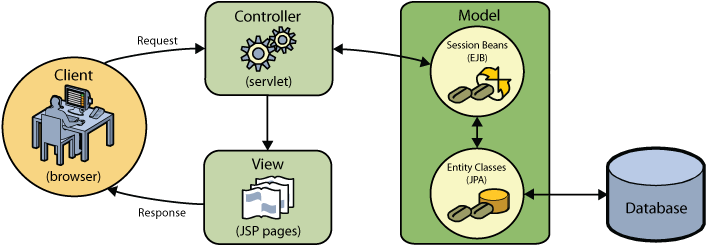

// 
//     Licensed to the Apache Software Foundation (ASF) under one
//     or more contributor license agreements.  See the NOTICE file
//     distributed with this work for additional information
//     regarding copyright ownership.  The ASF licenses this file
//     to you under the Apache License, Version 2.0 (the
//     "License"); you may not use this file except in compliance
//     with the License.  You may obtain a copy of the License at
// 
//       http://www.apache.org/licenses/LICENSE-2.0
// 
//     Unless required by applicable law or agreed to in writing,
//     software distributed under the License is distributed on an
//     "AS IS" BASIS, WITHOUT WARRANTIES OR CONDITIONS OF ANY
//     KIND, either express or implied.  See the License for the
//     specific language governing permissions and limitations
//     under the License.
//

= NetBeans E-commerce チュートリアル－アプリケーションの設計
:jbake-type: tutorial
:jbake-tags: tutorials 
:jbake-status: published
:icons: font
:syntax: true
:source-highlighter: pygments
:toc: left
:toc-title:
:description: NetBeans E-commerce チュートリアル－アプリケーションの設計 - Apache NetBeans
:keywords: Apache NetBeans, Tutorials, NetBeans E-commerce チュートリアル－アプリケーションの設計

このチュートリアルであなたが設計するアプリケーションは、実世界のシナリオに基づいています。チュートリアルのシナリオを紹介した後で、顧客の要件の高レベルのリストを整備します。その後、アプリケーションのビジネスプロセスのフロー図を準備します。あなたとあなたの顧客の両方に役立つ一連の_モックアップ_ を準備します。モックアップは最終的なアプリケーションがエンドユーザーにどう見えるかを画像にして明確にします。最後に、顧客の要件をブレークダウンして、一連の実装タスクのセットに落とし込み、アプリケーションを構造化して、機能コンポーネント間の職責と相互関係を明確に定義します。

この単元では、MVC （モデル- ビュー - コントローラ）デザインパターンについて説明します。このパターンが提供している利点を調査した後、あなたは JSP マッピング、サーブレットについて設定し、および他の技術を MVC アーキテクチャに設定します。そして、 アプリケーションのコンポーネントをＭＶＣの観点から見た図を作成します。

この単元は、 link:http://java.sun.com/blueprints/guidelines/designing_enterprise_applications_2e/[+J2EE プラットフォームを使った エンタープライズアプリケーションの設計。第2版+]から様々な参照をしています。この本には、link:http://java.sun.com/reference/blueprints/index.jsp[+Java BluePrints+]（Java 設計図）で勧めているガイドラインが入っています。

このチュートリアルの単元は、NetBeans IDE の使用を必要としませんが、IDE はこれ以降の単元でカバーするタスクの基盤となるため不可欠です。

あなたはこのチュートリアルで構築するアプリケーションのライブデモを見ることができます： link:http://services.netbeans.org/AffableBean/[+NetBeans E コマースのチュートリアル デモ アプリケーション+]。

[[scenario]]
== シナリオ

このチュートリアルは、次のシナリオに基づいています。これは架空のシナリオですが、あなたがまさに開発しようとしているソフトウエアを実際のビジネスニーズに適用する方法を示しています。また同時に顧客の要件を引き出すことができるプラットフォームとして役に立ちます。お客様の要件は可能な限り明確にされるべきです。またすべての設計や実装を始める前に確立される必要があります。

=== シナリオ

小さな食料品店、Affable Bean（気さくな豆）は、いくつかの地元の農場と提携して、有機農産物、食品を地域社会に提供しています。長年の顧客基盤により、地域に対して豊かさ（地域での売り上げ）が増加しています。食料品店は顧客にオンライン配達サービスを提供する可能性を検討することにしました。最近の調査では、常連の 90％ は継続的なインターネットアクセスを持っており、65％ がこのサービスを利用することに興味があることがわかりました。

食料品店のスタッフは、Java Web 開発者に、顧客がオンラインショッピングできるウェブサイトを作成するよう求めています。また、食料品店のスタッフは、管理スタッフが注文を追跡できるようにウェブサイトに管理コンソールも一緒に作成するよう求めています。

ストアの場所は、プラハ、チェコ共和国です。常連客はチェコ語と英語の両方を話すので、ウェブサイトは両方の言語をサポートするようにスタッフは要求しています。

食料品店はすでにドメインを購入しており、ウェブ指向のスタッフの一人は、アプリケーションの準備ができしだい、ドメインにアプリケーションをデプロイ(配置）することができると言っています。

[[requirements]]
== お客様の要件を収集する

すべてのプロジェクトの初期段階には、デザインや実装を決める前の情報収集があります。その最も一般的な形は、顧客と直接、頻繁にコミュニケーションを行うことです。提供されたシナリオに基づいて、Affable Bean (気さくな豆)のスタッフがあなたに、作成しようとしているアプリケーションは、次の要件を満たす必要があると伝えています：

1. 実際の店舗で販売されている製品のオンラインでの表現。 ４つのカテゴリ（乳製品、肉、パン、フルーツ＆ベジタブル）があります。各カテゴリーには4つの製品があり、オンライン買い物客はそれを閲覧できます。各製品の詳細（すなわち、名前、画像、説明、価格）を提供します。

[start=2]
. ショッピングカート機能は、以下のことができること： 

* 仮想ショッピングカートにアイテムを追加する。

* ショッピングカートからアイテムを削除する。

* ショッピングカートの数量を更新する。

* ショッピングカート内の全ての商品の全体と数量が見える。

* 安全な決済処理を通して、注文と支払いをする。

[start=3]
. 管理コンソール、スタッフが顧客の注文を表示することができる。

[start=4]
. セキュリティ。インターネット上で転送される重要な顧客データを保護でき、管理コンソールへの不正アクセスを防止する。

[start=5]
. 英語とチェコ言のサポート。（ウェブサイトのみ）

会社のスタッフは、製品とカテゴリの画像、説明と価格の詳細を提供することができるだけでなく、使用される任意のWebサイトのグラフィックも提供することができる。スタッフはまたウェブサイトのすべてのテキストと、言語の翻訳を提供することができる。

ソフトウェアの開発管理に専念した多くの実践や方法があります。 link:http://en.wikipedia.org/wiki/Agile_software_development[+アジャイルソフトウェア開発+]もその一つで、開発サイクルの中で、頻繁な顧客の検査とそれへの適合を重要なものとして位置付けています。もちろんアジャイル開発はこのチュートリアルの範囲外ですが、チュートリアルの各単元は、ソフトウエアの機能部品単位で完結しています。ソフトウェアの機能部品はさらなるコミュニケーションとフィードバックのために顧客に提示される可能性があります。

[[mockups]]
== モックアップを準備する

お客様のご要望を収集したら、あなたは、「それらがウェブサイトでどうように見えどのように動作するか」の鮮明なイメージを得るために Affable Bean スタッフと一緒に働きます。あなたはユースケースを作成して、どのようにアプリケーションが使用され、どのようにその動作をカプセル化するかについて説明します：

[[useCase]]
=== ユースケース(Use-Case)

お客様は、ウェルカムページを訪問し、製品カテゴリを選択します。選択したカテゴリのページでお客様は製品をブラウズし、次に彼または彼女のショッピングカートに製品を追加します。お客様は、買い物を続け別のカテゴリを選択します。お客様がこのカテゴリからショッピングカートにいくつかの製品を追加します。お客様は、「 view cart (カートを見る)」オプションを選択し、カートのページでカートの製品の数量を更新します。お客様は、カートの内容を確認しチェックアウトに進みます。チェックアウトのページで、顧客は注文金額やその他の情報を見て、個人データを記入し、彼または彼女の詳細を送信します。注文が処理され、顧客は確認ページを受け取ります。確認ページでは、注文の概要と一緒に、顧客の注文を追跡するため独自の参照番号を提供します。

また、モックアップの作成を開始します。このタスクを実現するのに多くの方法があります。たとえば、ストーリーボードのソフトウェアを使う、またはページ間の関係を中継するように線でつないだセットを作成する方法もあります。もう1つの一般的な方法として知られている link:http://en.wikipedia.org/wiki/Paper_prototyping[+paper prototyping (紙プロトタイピング)+]（顧客と協力しながら紙の上でアイデアをスケッチする方法）があります。

このシナリオでは、ユーザーがウェブサイトを移動して参照する主なページの_モックアップ_ を作成します。後で、我々が MVC デザインパターンを議論するときには、これらのページが、アリケーションで使われる _views_ にマッピングされることに注意してください。

|===
|[.feature]
--

image::images/mockup-index-small.png[role="left", link="images/mockup-index.png"]

--
 |

==== welcom ページ

welcome ページは、 Web サイトのホームページであり、またアプリケーションの入口です。このページは、ユーザーにビジネスとサービスを紹介し、ユーザが任意の4つの製品カテゴリに移動できるようにします。

 

|[.feature]
--

image::images/mockup-category-small.png[role="left", link="images/mockup-category.png"]

--
 |

==== カテゴリページ

カテゴリページには、選択したカテゴリ内のすべての製品の一覧を提供しています。このページから、ユーザーはすべての製品情報を表示することができ、彼または彼女のショッピングカートに表示された商品を追加します。また、ユーザーは提供されている任意のカテゴリに移動することができます。

 

|[.feature]
--

image::images/mockup-cart-small.png[role="left", link="images/mockup-cart.png"]

--
 |

==== カートのページ

カートのページは、ユーザーのショッピングカートに入っているすべての項目を一覧表示します。ここには、各項目の製品の詳細を表示し、カート内の項目の小計を集計。このページで、ユーザーは次のことができます：

* 彼または彼女のカートの全商品のクリア 
（「clear cart (カート空にする]」をクリックすると「proceed to checkout (チェックアウトに進む)」ボタンが現れ、ショッピングカートのテーブルを消去します。 ）

* リストされたすべての項目の数量の更新 
（価格と数量が更新されます。小計が再計算されます。ユーザーがに数量を「 0 」を設定した場合、製品テーブルの行が削除されます。 ）

* 「continue shopping (買い物を続ける)」をクリックすると前のカテゴリに戻る。

* 「 Proceed to checkout (レジに進む)」

 

|[.feature]
--

image::images/mockup-checkout-small.png[role="left", link="images/mockup-checkout.png"]

--
 |

==== チェックアウトのページ

チェックアウトのページで、フォームを使用してお客様の情報を収集します。このページでは、購入条件を表示し、合計の計算をして注文を合計します。

お客様はセキュアなチャネルを介して個人情報を送信することができます。

 

|[.feature]
--

image::images/mockup-confirmation-small.png[role="left", link="images/mockup-confirmation.png"]

--
 |

==== 確認ページ (confirmation page)

確認ページは、注文が正常に登録されたことをお客様が確認するためのメッセージを返します。注文参照番号と同じく、注文の詳細情報の要約リストがお客様に提供されます。

注文の要約と、お客様の個人情報は保護されたチャネル上で返送されます。

 
|===

また、お客様は複数のページに適用される以下のルールについてスタッフと同意します：

* お客様は任意のページからチェックアウトに進めます。その条件は： 

* ショッピングカートが空ではない

* ユーザーはまだチェックアウトのページにいない

* ユーザーはまだチェックアウトしていない（すなわち、確認ページにいる）

* すべてのページで、ユーザーは以下のことができます：

* 言語を選択（英語又はチェコ語）し、その言語でページを表示する

* 彼または彼女のショッピングカートの状態が見える（もしカートが空でない場合）

* ロゴ画像をクリックして welcome ページに戻る

*注：* ここに示されていない事例は、同様にクライアントと一緒にユースケースとモックアップを作る必要があるでしょう。そして管理コンソールのルールを決めます。NetBeans E コマースのチュートリアルは、店頭（つまり、ウェブサイト）の開発に焦点を当てています。しかし、単元11 、<<,アプリケーションの保護>> では、管理コンソールにアクセスするログインメカニズムを作成する方法を示します。また、管理コンソールの実装をしたものを次の方法で調べることができます。 link:https://netbeans.org/projects/samples/downloads/download/Samples%252FJavaEE%252Fecommerce%252FAffableBean_complete.zip[+完成したアプリケーションをダウンロードする+]。

[[business]]
=== ビジネスプロセスフロー

提案したモックアップ間の関係を確立するのを補助するために、各ページが提供すべき機能をうまく図解し、アプリケーションのプロセスフローをデモする図を準備します。

図は、各ページの視覚的な機能のコンポーネントを表示し、ユーザーが購入手続きの完了に至るまでの道筋の主要なアクションをハイライト表示します。

image::images/process-flow.png[title="The process flow of the AffableBean application"]

[[architecture]]
== アーキテクチャを決定する

あなたがコーディングを開始する前に、プロジェクトを設計する方法を調べてみましょう。具体的には、機能コンポーネント間の責任の大枠を決めて、お互いの相互作用を決定する必要があります。

JSP 技術を使う場合は、 スクリプトを使用して JSP ページにすべてのビジネスロジックを書くことができます。スクリプトは、 `<% %>` タグで囲まれた Java コードのスニペット（切れ端）です。あなたは既に気づいているかもしれませんが、JSP ページは実行される前にサーブレットにコンパイルされます。そして、Java のコードは完全に JSP ページでのみ有効です。しかし、このような作業はさけるべきであるといういくつかの理由があります。特に大規模なプロジェクトでの作業は避けてください。いくつかの理由は、link:http://java.sun.com/blueprints/guidelines/designing_enterprise_applications_2e/[+J2EE プラットフォームでのエンタープライズアプリケーション設計 第二版+] に次のように記載されています：^<<footnote1,[1]>>^

* *スクリプトレットコードは再利用できません： * スクリプトレットコードはまさに一つの場所だけに現れます：それが定義されている JSP ページです。もし同じロジックが他に必要な場合は、それを内に含むか（読みやすさが減少）、またはコピーして新しいコンテキストに貼り付ける必要があります

* *スクリプトレットは表示と共にロジックを中に混ぜ込んでいます：* スクリプトレットは、表示コードの海に浮かぶプログラムコードの島です。変更をするには、2つの関係を破壊しないように他が何を行っているかを少しは理解する必要があります。 スクリプトレットでは、プレゼンテーション内にプログラムロジックが入り込んでいるために、JSP ページで何をしているかが、あっけなくわからなくなります。

* *スクリプトレットは開発者の役割の分離を妨げる：* スクリプトレットはプログラムと Web ページの内容の両方が入り混じるため、web ページのデザイナーはプログラミングとページのどの部分を修正してはいけないかの両方を理解する必要にせまられます。

* *スクリプトレットは、JSP ページを読み維持することを困難にする： * スクリプトレットのある JSP ページは、JSP ページ区切りタグと Java 言語コードのタグが混在した構成になっています。

* *スクリプトレット コードをテストすることは困難です： * スクリプトレットコードのユニットテストは事実上不可能です。スクリプトレットが JSP ページに埋め込まれているので、それらを実行する唯一の方法は、ページを実行し結果をテストすることだけです。

適用するに値する様々なデザインパターンがすでにあります。そのようなパターンの一つに MVC（モデル、ビュー、コントローラ）パラダイムがあります。MVC は、アプリケーションを３つの相互運用できるコンポーネントに分割します：^<<footnote2,[2]>>^

* *Model モデル： * ビジネスデータとビジネスロジックを表現します。ビジネスロジックはデータの修正と変更へのアクセスを管理します。それに変更があるとモデルはビューに通知します。そしてビューにその状態についてモデルに問い合わせをさせます。また、コントローラへのアクセスアプリケーションの機能をモデルによってカプセル化することができます。

* *View ビュー： * ビューはモデルの内容をレンダリングします。これは、モデルからデータを取得し、どのようにデータが表示されるかを指定します。モデルが変更したとき、データ表示を更新します。ビューはまた、ユーザ入力をコントローラへ転送します。

* *Controller コントローラ：* コントローラは、アプリケーションの動作を定義します。これは、ユーザの要求を送出し、プレゼンテーションのビューを選択します。これは、ユーザの入力を解釈して、モデルによって実行されるアクションの中にそれらをマッピングします。Web アプリケーションでは、ユーザ入力は HTTP GET と POST です。コントローラは、ユーザーとの対話に基づいて表示する次のビューを選択し、モデル操作の結果を表示します。

image::images/mvc-model.png[title="The Model View Controller pattern"]

MVC デザインパターンを遵守すると多くの利点があります：

* *設計問題を分離する：* プレゼンテーションとコントロールの分離、データの永続性と振る舞いの分離により、アプリケーションがより柔軟になります。 1つのコンポーネントへの変更があっても、他のコンポーネントへの影響を最小化します。たとえば、モデルを書き換えることなく、新しいビューを作成することができます。

* *保守や拡張をもっと簡単にします：* 良い構造は、コードの複雑さを減らすことができます。このように、コードの重複は最小化されます。

* *仕事の分離を促進する： * 異なるスキルセットを持つ開発者たちは、自分のコアスキルに焦点を当てるとともに、はっきりと定義されたインタフェースを通じてお互いに協力することができます。

*注：* JSP テクノロジーは 1999年に初めて導入されました。初期の仕様では、 2つのモデルのアーキテクチャが説明されています：モデル1とモデル2です。モデル１は JSP ページ内に直接ビジネスロジックを実装するのに対し、モデル２は MVC パターンを適用しています。モデル１とモデル２のアーキテクチャの詳細については、link:http://java.sun.com/blueprints/guidelines/designing_enterprise_applications_2e/web-tier/web-tier5.html#1078527[+J2EE プラットフォームを使ったエンタープライズアプリケーションの設計、4.4.1章：構造化 Web 層+]を参照してください。

あなたがアプリケーションで MVC パターンを適用することができます。そして Affable Bean のクライアントの開発をすることができます。入ってくるリクエストを処理する _controller_ としてサーブレットを使用することができます 。 <<processFlowDiagram,ビジネスプロセスフロー図>>のページに_views_ をマッピングすることができます。最後に、データベースに保持されるビジネスデータは、アプリケーションからアクセスしたり、修正することができますし、アクセスや修正は、 link:http://java.sun.com/products/ejb/[+EJB+] のセッション Bean を link:http://java.sun.com/javaee/technologies/persistence.jsp[+JPA+] のエンティティクラスと共に使用します。これらのコンポーネントは _model_ として表現されます。

[[planning]]
== プロジェクトの計画

プロジェクトを計画するには、お客様のご要望から機能のタスクを推定する必要があります。我々が作るタスクは、プロジェクトの実装計画にスケジュール化します。そして以下のチュートリアルの単元の骨子をつくります。実際に、より有能なあなたは、彼らが行う作業タスクを識別し、その結果に従って仕事をします。より上手に、あなたは、あなたと顧客が合意したスケジュールを守ることができるでしょう。したがって、高レベルのタスクリストからはじめます。そして、これらのタスクをドリルダウンして、各タスクを複数のサブタスクに分割してみます。可能ならば、各リストの項目が単一の作業単位になるまでサブタスクをさらに分割します。

* 開発環境をセットアップする

* IDE に開発サーバーを登録する

* IDE に web プロジェクトを作る

* IDE から web プロジェクトを実行する（テストコンパイル、配置、機能の実行、IDE・サーバー・ブラウザ間の相互運用性の確立）

* IDE にデータベースサーバーを登録する

* IDE からデータベースサーバーへの接続を確立する

* データベースサーバーにデータベースインスタンスを生成する

* アプリケーションのデータモデルを準備する

* ER 図を作成する（ビジュアルなデータベース設計ツールを使って）

* オブジェクトを識別する

* スキーマを生成する

* エンティティを生成する

* エンティティのプロパティを追加する

* エンティティ間の関係を特定する

* 一対多 の関係

* 多対多 の関係

* ER 図を Forward-engineer して SQL スクリプトを生成する

* データベース上でスクリプトを実行し、スキーマ（データベース構造）を生成する

* フロントエンドのプロジェクトファイルを作る

* Stylesheet(スタイルシート)

* JSP ページ用のプレースホルダー（モックアップのようにページを表示する HTMLと CSS コンテキストの実装を必要とする)
* welcome page

* category page

* cart page

* checkout page

* confirmation page

* アプリケーションのフロントエンドを準備する

* アプリケーションの `WEB-INF` ディレクトリーに JSP ページを配置する

* ページのヘッダ、フッターを作る

* 重複したコードのインスタンスの削除( JSP ページのヘーダー、フッターのコード）

* web 配置記述子の入ったヘッダー、フッターを登録する

* コントローラサーブレットを作成する

* 配置記述子にビューのマッピングを作る

* サーブレットにスケルトンコードを作り、クライアントのリクエストを処理する

* アプリケーションをデータベースに接続する

* データベースにサンプルデータを追加する

* サーバーにデータソースとコネクションプールを作る

* データソースのテスト（コネクションプールに ping する）

* ビューがデータベースのデータをアクセスできることを確認する
* データベースドライバー JAR をサーバーに追加する

* アプリケーションにデータソースへのリソース参照を作る

* JSP ページからデータベースに query を発行する

* 他に必要なアプリケーション全体のパラメータを設定する

* データベースアクセスおよびユーザセッションを必要としないビューに条件付きロジックのコードを書く(welcome, category)

* ビジネスロジックを開発する

* モデルをセットアップする

* データベーステーブルから JPA エンティティクラスを作る

* 永続化ユニットを生成し設定する

* エンティティクラス用の EJB ステートレス Bean facades を作る

* ビューに EJB モデルを統合する

* コントローラサーブレットに EJB facades を統合する

* ビューを修正してスコープ変数からデータを使えるようにする(全ての JSTL `<sql>` クエリーの代替）

* ショッピングカートの機能を作る

* 一時データを保存する Java クラスを作る（`ShoppingCart`, `ShoppingCartItem`）

* `HttpSession` 用のコードをコントローラサーブレットの中に統合する

* コントローラサーブレットへセッション関係アクションを追加する

* ページヘッダーにショッピングカートのウイジェットを作る

* セッション関係のデータをビュー（カート、チェックアウト）の中に統合する

* 、ユーザがクッキーを無効にしているイベントの中で URL の再書き込みができるようにする JSTL `<c:url>` タグを適用する

* we b配置記述子にセッションのタイムアウトを設定する

* セッションのタイムアウトのイベントでリクエストを扱うコントローラサーブレットのロジックを追加する

* トランザクションロジックを統合する

* チェックアウトのフォームからユーザデータを展開し確認するためのコードを作る

* EJB ステートレスセッション bean を作り、データベースに注文と顧客の挿入処理をする

* 新規に生成されたオーダーをデータベースに問い合わせするロジックを実装する

* 確認ページで注文と顧客の詳細表示を実装する

* 言語サポートを追加する

* アプリケーションのすべてのテキストメッセージを含むプロパティファイルを作成する
* デフォルト言語 (English（英語）)

* English（英語）

* Czech（チェコ語）

* 登録デプロイメント記述子にローカライズ コンテキストパラメータを登録する

* ユーザセッションに保存された言語の値に基づきページの言語を表示するロジックを追加する

* ビューに含まれるすべてのテキストに `<fmt:message>` タグを適用する

* データベースから英語の記述を取り除き、その代わりにプロパティを使用する

* 管理コンソールを作成する

* 新しい人工物 (artifacts) を作る

* ビュー
* ログイン login

* ウエルカム welcome

* エラー error

* コントローラサーブレット

* ログイン機能を作る

* インターフェースを作る

* コントローラサーブレットへアクションを追加する

* 配置記述子にログイン機能を設定する

* 管理者機能を実装する（welcome ページに）

* 注文の詳細を表示するために

* 顧客の詳細を表示するために

* アプリケーションをセキュアにする

* チェックアウト用の SSL 接続、確認ビュー、そして管理コンソールを設定する

* サーバーで SSL を有効にする

* 配置記述子にセキュリティ設定を登録する

* サーバーにユーザーロールと管理コンソール用のアクセス許可を作成する

* サーバーでセキュリティロールを作成する

* 配置記述子へセキュリティロールと制限を宣言する

link:/about/contact_form.html?to=3&subject=Feedback: NetBeans E-commerce Tutorial - Designing the Application[+ご意見をお寄せ下さい+]

[[seeAlso]]
== 関連参照

=== オンラインリソース

* link:http://java.sun.com/reference/blueprints/index.jsp[+Java BluePrints+]

* link:http://java.sun.com/blueprints/patterns/catalog.html[+J2EE パターンカタログ+]

* link:http://java.net/projects/bpcatalog/[+Java 設計図ソリューションカタログ+]

* link:http://java.sun.com/blueprints/patterns/MVC-detailed.html[+Java 設計図：モデル－ビュー－コントローラ+]

* link:http://java.sun.com/blueprints/guidelines/designing_enterprise_applications_2e/web-tier/web-tier5.html[+Web ベース層アプリケーションフレームワークの設計+]

* link:http://download.oracle.com/docs/cd/E17477_01/javaee/5/tutorial/doc/bnadr.html[+Java EE 5 チュートリアル-第3章： Web アプリケーション入門+]

=== 技術関連記事

* link:http://java.sun.com/developer/technicalArticles/javaserverpages/servlets_jsp/[+サーブレットと JSP ページのベストプラクティス+]

* link:http://java.sun.com/developer/technicalArticles/J2EE/despat/[+J2EE アプリケーション柔軟性と保守構築のためのデザインパターン +]

=== 図書

* link:http://volume1.coreservlets.com/[+コアサーブレットおよび JavaServer Pages 第1巻：コア技術、第2版+]

* link:http://volume2.coreservlets.com/[+コアサーブレットおよび JavaServer Pages 第2巻：先端技術、第2版 +]

== 参照

1. <<1,^>> より広範な一覧についてはこれを参照してください。
link:http://java.sun.com/blueprints/guidelines/designing_enterprise_applications_2e/web-tier/web-tier3.html#1097966[+J2EE プラットフォームでのエンタープライズアプリケーションの設計 4.2.6.8章 ：スクリプトレットを避けるためのカスタムタグの使い方+]。

[start=2]
. <<2,^>> MVC パターンについてのより詳細な情報についてはこれを参照してください。
link:http://java.sun.com/blueprints/guidelines/designing_enterprise_applications_2e/app-arch/app-arch2.html#1105854[+J2EE プラットフォームでのエンタープライズアプリケーションの設計 11.1.1章：モデル－ビュー－コントローラのアーキテクチャ+]。

