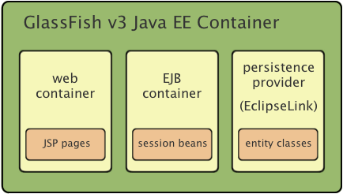
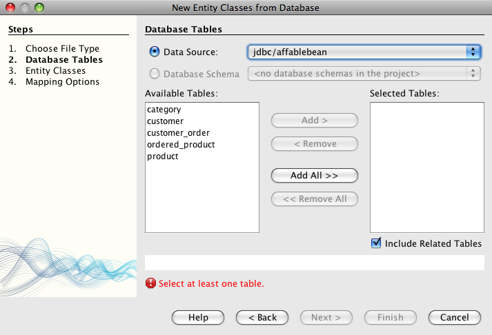
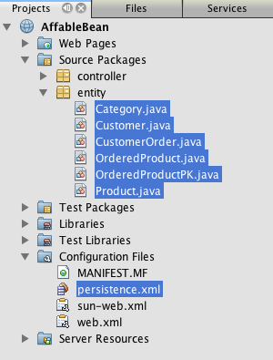
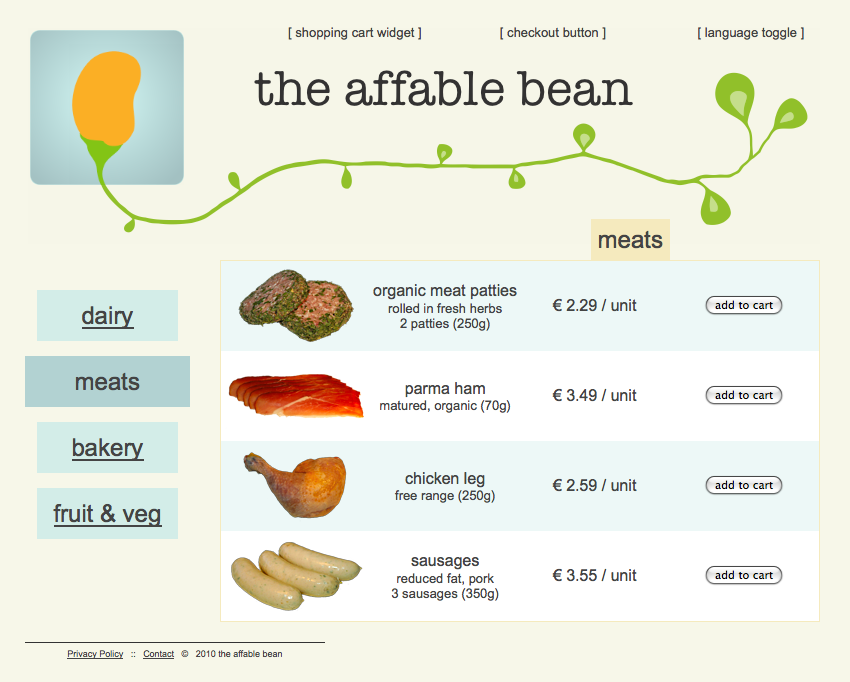

// 
//     Licensed to the Apache Software Foundation (ASF) under one
//     or more contributor license agreements.  See the NOTICE file
//     distributed with this work for additional information
//     regarding copyright ownership.  The ASF licenses this file
//     to you under the Apache License, Version 2.0 (the
//     "License"); you may not use this file except in compliance
//     with the License.  You may obtain a copy of the License at
// 
//       http://www.apache.org/licenses/LICENSE-2.0
// 
//     Unless required by applicable law or agreed to in writing,
//     software distributed under the License is distributed on an
//     "AS IS" BASIS, WITHOUT WARRANTIES OR CONDITIONS OF ANY
//     KIND, either express or implied.  See the License for the
//     specific language governing permissions and limitations
//     under the License.
//

= The NetBeans E-commerce Tutorial - Adding Entity Classes and Session Beans
:jbake-type: tutorial
:jbake-tags: tutorials 
:jbake-status: published
:icons: font
:syntax: true
:source-highlighter: pygments
:toc: left
:toc-title:
:description: The NetBeans E-commerce Tutorial - Adding Entity Classes and Session Beans - Apache NetBeans
:keywords: Apache NetBeans, Tutorials, The NetBeans E-commerce Tutorial - Adding Entity Classes and Session Beans

== Tutorial Contents

1. xref:intro.adoc[+Introduction+]
2. xref:design.adoc[+Designing the Application+]
3. xref:setup-dev-environ.adoc[+Setting up the Development Environment+]
4. xref:data-model.adoc[+Designing the Data Model+]
5. xref:page-views-controller.adoc[+Preparing the Page Views and Controller Servlet+]
6. xref:connect-db.adoc[+Connecting the Application to the Database+]
7. *Adding Entity Classes and Session Beans*
* <<whatEJB,What are EJB and JPA Technologies?>>
* <<whatSession,What are Session Beans?>>
* <<specification,About Specifications and Implementations>>
* <<addEntity,Adding Entity Classes>>
* <<addSession,Adding Session Beans>>
* <<access,Accessing Data with EJBs>>
* <<seeAlso,See Also>>

[start=8]
. xref:manage-sessions.adoc[+Managing Sessions+]

[start=9]
. xref:transaction.adoc[+Integrating Transactional Business Logic+]

[start=10]
. xref:language.adoc[+Adding Language Support+]

[start=11]
. xref:security.adoc[+Securing the Application+]

[start=12]
. xref:test-profile.adoc[+Testing and Profiling+]

[start=13]
. xref:conclusion.adoc[+Conclusion+]

image::../../../../images_www/articles/68/netbeans-stamp-68-69.png[title="Content on this page applies to NetBeans IDE, versions 6.8 and 6.9"]

This tutorial unit introduces the link:http://java.sun.com/products/ejb/[+Enterprise JavaBeans+] (EJB) and link:http://java.sun.com/javaee/technologies/persistence.jsp[+Java Persistence+] (JPA) technologies. In it, you use two of the IDE's wizards that are essential to Java EE development. These are:

* *Entity Classes from Database wizard:* Creates a Java Persistence API entity class for each selected database table, complete with named query annotations, fields representing columns, and relationships representing foreign keys.
* *Session Beans for Entity Classes wizard:* Creates an EJB session facade for each entity class with basic access methods.

These two wizards provide an efficient way for you to quickly set up the model for your application. If you reexamine the xref:design.adoc#mvcDiagram[+MVC diagram+] for the application you are building, you can see where EJB session beans and JPA entity classes fit into its structure.

image::images/mvc-diagram.png[title="MVC diagram of the AffableBean application"]

In this unit, the entity classes you create form a Java-based representation of the `affablebean` database. While each entity class represents a database table, instances of entity classes correspond to records that can be saved (i.e., _persisted_) to the database. The business logic of the application is encapsulated by session beans, which can either be used as _facade_ classes that enable CRUD (Create-Read-Update-Delete) access to entities (as demonstrated here), or they can contain code that implements actions specific to your application. (An example of this is provided in xref:transaction.adoc[+Unit 9: Integrating Transactional Business Logic+]).

You can view a live demo of the application that you build in this tutorial: link:http://services.netbeans.org/AffableBean/[+NetBeans E-commerce Tutorial Demo Application+].

|===
|Software or Resource |Version Required 

|xref:../../../../download/index.adoc[NetBeans IDE] |Java bundle, 6.8 or 6.9 

|link:http://www.oracle.com/technetwork/java/javase/downloads/index.html[+Java Development Kit (JDK)+] |version 6 

|<<glassFish,GlassFish server>> |v3 or Open Source Edition 3.0.1 

|link:http://dev.mysql.com/downloads/mysql/[+MySQL database server+] |version 5.1 

|link:https://netbeans.org/projects/samples/downloads/download/Samples%252FJavaEE%252Fecommerce%252FAffableBean_snapshot3.zip[+AffableBean project+] |snapshot 3 
|===

*Notes:*

* The NetBeans IDE requires the Java Development Kit (JDK) to run properly. If you do not have any of the resources listed above, the JDK should be the first item that you download and install.
* The NetBeans IDE Java Bundle includes Java Web and EE technologies, which are required for the application you build in this tutorial.
* The NetBeans IDE Java Bundle also includes the GlassFish server, which you require for this tutorial. You could link:http://glassfish.dev.java.net/public/downloadsindex.html[+download the GlassFish server independently+], but the version provided with the NetBeans download has the added benefit of being automatically registered with the IDE.
* You can follow this tutorial unit without having completed previous units. To do so, see the xref:setup.adoc[+setup instructions+], which describe how to prepare the database and establish connectivity between the IDE, GlassFish, and MySQL.
* link:https://netbeans.org/projects/samples/downloads/download/Samples%252FJavaEE%252Fecommerce%252FAffableBean_snapshot4.zip[+Snapshot 4+] of the `AffableBean` project is available for download and corresponds to state the project after completing this unit using NetBeans IDE 6.9.

[[whatEJB]]
== What are EJB and JPA Technologies?

Up until now, the project that you've been developing in this tutorial could be run in a web server with a servlet container, such as Apache Tomcat. After all, you've so far only made use of JSTL and servlet technologies, and are connecting to the database directly using JDBC. In fact, you could theoretically continue to develop the application using just these technologies, while manually coding for all aspects of your application, including thread-safety, transactions, and security. However, using Enterprise beans with JPA entity classes allows you focus on the business logic of your application while relying on solutions that have already been tried and tested. The following sections introduce the two technologies and define their role in EE development.

* <<ejb,Enterprise JavaBeans>>
* <<jpa,Java Persistence>>

[[ejb]]
=== Enterprise JavaBeans

The official link:http://java.sun.com/products/ejb/[+EJB product page+] describes EnterPrise JavaBeans technology as a "server-side component architecture" that "enables rapid and simplified development of distributed, transactional, secure and portable applications." You can apply EJBs (i.e., Enterprise beans) to your projects, and the services provided by the technology remain transparent to you as a developer, thus eliminating the tedious and often error-prone task of adding a lot of boiler plate code which would otherwise be required. If you are new to EE development, you may question the need for EJBs in your Java web application. The book link:http://www.manning.com/panda/[+EJB 3 In Action+], by Debu Panda, Reza Rahman and Derek Lane, paraphrases the role of EJB technology nicely:

[NOTE]
====
_Although many people think EJBs are overkill for developing relatively simple web applications of moderate size, nothing could be further from the truth. When you build a house, you don't build everything from scratch. Instead, you buy materials or even the services of a contractor as you need it. It isn't too practical to build an enterprise application from scratch either. Most server-side applications have a lot in common, including churning business logic, managing application state, storing and retrieving information from a relational database, managing transactions, implementing security, performing asynchronous processing, integrating systems, and so on. 

As a framework, the EJB container provides these kinds of common functionality as out-of-the-box services so that your EJB components can use them in your applications without reinventing the wheel. For instance, let's say that when you build a credit card module in your web application, you write a lot of complex and error-prone code to manage transactions and security access control. You could have avoided that by using the declarative transaction and security services provided by the EJB container. These services as well as many others are available to EJB components when they are deployed in an EJB container. This means writing high-quality, feature-rich applications much faster than you might think._^<<footnote1,[1]>>^
====

You can think of EJB both as components, or Java classes that are incorporated in your project, as well as a _framework_ that provides numerous enterprise-related services. Some of the services that we take advantage of in this tutorial are described in link:http://www.manning.com/panda/[+EJB 3 In Action+] as follows:

* *Pooling:* For each EJB component, the EJB platform creates a pool of component instances that are shared by clients. At any point in time, each pooled instance is only allowed to be used by a single client. As soon as an instance is finished servicing a client, it is returned to the pool for reuse instead of being frivolously discarded for the garbage collector to reclaim.
* *Thread Safety:* EJB makes all components thread-safe and highly performant in ways athat are completely invisible. This means that you can write your server components as if you were developing a single-threaded desktop application. It doesn't matter how complex the component itself is; EJB will make sure it is thread-safe.
* *Transactions:* EJB supports declarative transaction management that helps you add transactional behavior to components using simple configuration instead of code. In effect, you can designate any component method to be transactional. If the method completes normally, EJB commits the transaction and makes the data changes made by the method permanent. Otherwise the transaction is rolled back. Container-managed EJB transactions are demonstrated in Unit 9, xref:transaction.adoc[+Integrating Transactional Business Logic+].
* *Security:* EJB supports integration with the Java Authentication and Authorization Service (JAAS) API, so it is easy to completely externalize security and secure an application using simple configuration instead of cluttering up your application with security code.^<<footnote2,[2]>>^ In Unit 11, xref:security.adoc#secureEJB[+Securing the Application+], a demonstration of EJB's link:http://download.oracle.com/javaee/6/api/javax/annotation/security/RolesAllowed.html[+@RolesAllowed+] annotation is provided.

[[jpa]]
=== Java Persistence

In the context of Java Enterprise, _persistence_ refers to the act of automatically storing data contained in Java objects into a relational database. The link:http://java.sun.com/javaee/technologies/persistence.jsp[+Java Persistence API+] (JPA) is an object-relational mapping (ORM) technology that enables applications to manage data between Java objects and a relational database in a way that is transparent to the developer. This means that you can apply JPA to your projects by creating and configuring a set of Java classes (_entities_) that mirror your data model. Your application can then access these entities as though it were directly accessing the database.

There are various benefits to using JPA in your projects:

* JPA has its own rich, SQL-like query language for static and dynamic queries. Using the Java Persistence Query Language (JPQL), your applications remain portable across different database vendors.
* You can avoid the task of writing low-level, verbose and error-prone JDBC/SQL code.
* JPA transparently provides services for data caching and performance optimization.

[[whatSession]]
== What are Session Beans?

Enterprise session beans are invoked by a client in order to perform a specific business operation. The name _session_ implies that a bean instance is available for the duration of a "unit of work". The link:http://jcp.org/aboutJava/communityprocess/final/jsr318/index.html[+EJB 3.1 specification+] describes a typical session object as having the following characteristics:

* Executes on behalf of a single client
* Can be transaction-aware
* Updates shared data in an underlying database
* Does not represent directly shared data in the database, although it may access and update such data
* Is relatively short-lived
* Is removed when the EJB container crashes. The client has to re-establish a new session object to continue computation.

EJB provides three types of session beans: _stateful_, _stateless_, and _singleton_. The following descriptions are adapted from the link:http://download.oracle.com/docs/cd/E17410_01/javaee/6/tutorial/doc/index.html[+Java EE 6 Tutorial+].

* *Stateful:* The state of the bean is maintained across multiple method calls. The "state" refers to the values of its instance variables. Because the client interacts with the bean, this state is often called the _conversational_ state.
* *Stateless:* Stateless beans are used for operations that can occur in a single method call. When the method finishes processing, the client-specific state of the bean is not retained. A stateless session bean therefore does not maintain a conversational state with the client.
* *Singleton:* A singleton session bean is instantiated once per application, and exists for the lifecycle of the application. Singleton session beans are designed for circumstances where a single enterprise bean instance is shared across and concurrently accessed by clients.

For more information on EJB session beans, see the link:http://download.oracle.com/docs/cd/E17410_01/javaee/6/tutorial/doc/gipjg.html[+Java EE 6 Tutorial: What is a Session Bean?+].

For purposes of developing the e-commerce application in this tutorial, we will only be working with stateless session beans.

[[specification]]
== About Specifications and Implementations

EJB and JPA technologies are defined by the following specifications:

* link:http://jcp.org/en/jsr/summary?id=317[+JSR 317: Java Persistence 2.0+]
* link:http://jcp.org/en/jsr/summary?id=318[+JSR 318: Enterprise JavaBeans 3.1+]

These specifications define the technologies. To apply a technology to your project however, you must use an _implementation_ of the specification. When a specification becomes finalized, it includes a reference implementation, which is a free implementation of the technology. If you find this concept confusing, consider the following analogy: A musical composition (i.e., the notes on a page) defines a piece of music. When a musician learns the composition and records her performance, she provides an _interpretation_ of the piece. In this manner the musical composition is likened to the technical specification, and the musician's recording corresponds to the specification's implementation.

See xref:intro.adoc#jcp[+What is the Java Community Process?+] for an explanation of Java technical specifications, and how they are formally standardized.

If you examine the download pages for the final releases of the EJB and JPA specifications, you'll find links to the following reference implementations:

* *JPA:* link:http://www.eclipse.org/eclipselink/downloads/ri.php[+http://www.eclipse.org/eclipselink/downloads/ri.php+]
* *EJB:* link:http://glassfish.dev.java.net/downloads/ri[+http://glassfish.dev.java.net/downloads/ri+]

Implementations of the JPA specification are dubbed _persistence providers_, and the persistence provider which has been chosen as the reference implementation for the JPA 2.0 specification is link:http://www.eclipse.org/eclipselink/[+EclipseLink+].

If you examine the link for the EJB reference implementation, you'll come to a page that lists not only the implementation for EJB, but for all reference implementations provided by link:http://glassfish.dev.java.net/[+Project GlassFish+]. The reason for this is that Project GlassFish forms the reference implementation of the Java EE 6 platform specification (link:http://jcp.org/en/jsr/summary?id=316[+JSR 316+]). The GlassFish v3 application server (or the Open Source Edition), which you are using to build the e-commerce project in this tutorial, contains the reference implementations of all technologies developed under Project GlassFish. As such, it is referred to as a Java EE 6 _container_.

A Java EE container contains three essential components: a web (i.e., servlet) container, an EJB container, and a persistence provider. The deployment scenario for the e-commerce application is displayed in the diagram below. Entity classes that you create in this unit are managed by the persistence provider. The session beans that you create in this unit are managed by the EJB container. Views are rendered in JSP pages, which are managed by the web container.

[[addEntity]]
== Adding Entity Classes

Begin by using the IDE's Entity Classes from Database wizard to generate entity classes based on the `affablebean` schema. The wizard relies on the underlying persistence provider to accomplish this task.

1. Open the link:https://netbeans.org/projects/samples/downloads/download/Samples%252FJavaEE%252Fecommerce%252FAffableBean_snapshot3.zip[+project snapshot+] in the IDE. In the IDE, press Ctrl-Shift-O (�-Shift-O on Mac) and navigate to the location on your computer where you unzipped the downloaded file.
2. Press Ctrl-N (⌘-N on Mac) to open the File wizard.
3. Select the Persistence category, then select Entity Classes from Database. Click Next.
4. In Step 2: Database Tables, choose `jdbc/affablebean` from the Data Source drop-down list. The drop-down list is populated by data sources registered with the application server. 

When you choose the `jdbc/affablebean` data source, the IDE scans the database and lists the database tables in the Available Tables pane. 

[start=5]
. Click the Add All button, then click Next.

[start=6]
. Step 3 of the Entity Classes from Database wizard differs slightly between NetBeans IDE 6.8 and 6.9. Depending on the version IDE you are using, perform the following steps.
* <<68,NetBeans IDE 6.8>>
* <<69,NetBeans IDE 6.9>>

[[68]]
==== NetBeans IDE 6.8

image::images/entity-classes-68.png[title="NetBeans 6.8 - Entity Classes from Database wizard, Step 3: Entity Classes"]

1. Type in *entity* in the Package field. The wizard will create a new package for the entity classes upon completing.
2. Click the Create Persistence Unit button. The Create Persistence Unit dialog opens. 

image::images/create-pu.png[title="Use the Create Persistence Unit dialog to generate a persistence.xml file"] 

A _persistence unit_ refers to a collection of entity classes that exist in an application. The above dialog generates a `persistence.xml` file, which is used by your persistence provider to specify configuration settings for the persistence unit. Note that 'EclipseLink (JPA 2.0)' is the default selection for the server associated with the project. Leave 'Table Generation Strategy' set to '`None`'. This prevents the persistence provider from affecting your database. (For example, if you want the persistence provider to delete then recreate the database based on the existing entity classes, you could set the strategy to '`Drop and Create`'. This action would then be taken each time the project is deployed.)

[start=3]
. Click Create.

[start=4]
. Back in Step 3: Entity Classes, note that the class names for the entities are based on database tables. For example, the `CustomerOrder` entity is mapped to the `customer_order` database table. Also note that the 'Generate Named Query Annotations for Persistent Fields' option is selected by default. We will be using various named queries later in the tutorial.

[start=5]
. Continue to <<step7,step 7>> below.

[[69]]
==== NetBeans IDE 6.9

image::images/entity-classes-69.png[title="NetBeans 6.9 - Entity Classes from Database wizard, Step 3: Entity Classes"]

1. Type in *entity* in the Package field. The wizard will create a new package for the entity classes upon completing.
2. Note the following:
* The class names for the entities are based on database tables. For example, the `CustomerOrder` entity will be mapped to the `customer_order` database table.
* The 'Generate Named Query Annotations for Persistent Fields' option is selected by default. We will be using various named queries later in the tutorial.
* The 'Create Persistence Unit' option is selected by default. A _persistence unit_ is a collection of entity classes that exist in an application. The persistence unit is defined by a `persistence.xml` configuration file, which is read by your persistence provider. Enabling this option therefore means that the wizard will also generate a `persistence.xml` file and populate it with default settings.

[start=7]
. Click Finish. The JPA entity classes are generated, based on the `affablebean` database tables. You can examine the entity classes in the Projects window by expanding the newly created `entity` package. Also, note that the new persistence unit exists under the Configuration Files node. 

 

Note that the wizard generated an additional entity class, `OrderedProductPK`. Recall that the data model's `ordered_product` table uses a composite primary key that comprises the primary keys of both the `customer_order` and `product` tables. (See xref:data-model.adoc#manyToMany[+Designing the Data Model - Creating Many-To-Many Relationships+].) Because of this, the persistence provider creates a separate entity class for the composite key, and _embeds_ it into the `OrderedProduct` entity. You can open `OrderedProduct` in the editor to inspect it. JPA uses the `@EmbeddedId` annotation to signify that the embeddable class is a composite primary key.

[source,java]
----

public class OrderedProduct implements Serializable {
    private static final long serialVersionUID = 1L;
    *@EmbeddedId*
    protected OrderedProductPK orderedProductPK;
----

Press Ctrl-Space on the `@EmbeddedId` annotation to invoke the API documentation.

image::images/embedded-id.png[title="Press Ctrl-Space to invoke the API documentation"]

[start=8]
. Open the persistence unit (`persistence.xml`) in the editor. The IDE provides a Design view for persistence units, in addition to the XML view. The Design view provides a convenient way to make configuration changes to the persistence provider's management of the project. 

image::images/persistence-unit.png[title="Design view of the AffableBeanPU persistence unit"]

[start=9]
. Click the XML tab at the top of the `AffableBeanPU` persistence unit to open the XML view. Add the following property to the file.

[source,xml]
----

<persistence-unit name="AffableBeanPU" transaction-type="JTA">
  <jta-data-source>jdbc/affablebean</jta-data-source>
  *<properties>
    <property name="eclipselink.logging.level" value="FINEST"/>
  </properties>*
</persistence-unit>
----
You set the logging level property to `FINEST` so that you can view all possible output produced by the persistence provider when the application runs. This enables you to see the SQL that the persistence provider is using on the database, and can facilitate in any required debugging. 

See the official EclipseLink documentation for an explanation of logging and a list of all logging values: link:http://wiki.eclipse.org/EclipseLink/Examples/JPA/Logging[+How To Configure Logging+]

[[addSession]]
== Adding Session Beans

In this section, we use the IDE's Session Beans for Entity Classes wizard to generate an EJB _session facade_ for each of the entity classes that you just created. Each session bean will contain basic access methods for its respective entity class.

A _session facade_ is a design pattern advertised in the link:http://java.sun.com/blueprints/enterprise/index.html[+Enterprise BluePrints program+]. As stated in the link:http://java.sun.com/blueprints/corej2eepatterns/Patterns/SessionFacade.html[+Core J2EE Pattern Catalog+], it attempts to resolve common problems that arise in a multi-tiered application environment, such as:

* Tight coupling, which leads to direct dependence between clients and business objects
* Too many method invocations between client and server, leading to network performance problems
* Lack of a uniform client access strategy, exposing business objects to misuse

A session facade abstracts the underlying business object interactions and provides a service layer that exposes only the required functionality. Thus, it hides from the client's view the complex interactions between the participants. Thus, the session bean (representing the session facade) manages the relationships between business objects. The session bean also manages the life cycle of these participants by creating, locating, modifying, and deleting them as required by the workflow.

1. Press Ctrl-N (⌘-N on Mac) to open the File wizard.
2. Select the Persistence category, then select Session Beans for Entity Classes. 

image::images/session-beans-for-entity-classes.png[title="Select Session Beans for Entity Classes to generate a session facade for your persistence model"]

[start=3]
. Click Next.

[start=4]
. In Step 2: Entity Classes, note that all entity classes contained in your project are listed on the left, under Available Entity Classes. Click Add All. All entity classes are moved to the right, under Selected Entity Classes.

[start=5]
. Click Next.

[start=6]
. In Step 3: Generated Session Beans, type in *session* into the Package field. 

image::images/generated-session-beans.png[title="Specify the location of the new session beans, and whether to create interfaces"] 

*Note:* You can use the wizard to generate local and remote interfaces for the session beans. While there is benefit to programming session beans to interfaces (For example, hiding business object interactions behind an interface enables you to further decouple the client from your business logic. This also means that you can code multiple implementations of the interface for your application, should the need arise.), this lies outside the scope of the tutorial. Note that EJB versions prior to 3.1 _require_ that you implement an interface for each session bean.

[start=7]
. Click Finish. The IDE generates session beans for each of the entity classes contained in your project. In the Projects window, expand the new `session` package to examine the session beans. 

|===
|NetBeans 6.8 |NetBeans 6.9 

|image:images/projects-window-session-beans.png[title="Examine new session beans in the Projects window"] |image:images/projects-window-session-beans-69.png[title="Examine new session beans in the Projects window"] 
|===

*Note:* As shown above, NetBeans IDE 6.9 provides slight improvements in the way the Session Beans for Entity Classes wizard generates facade classes. Namely, boiler-plate code that is common to all classes is factored out into an abstract class named `AbstractFacade`. If you are working in version 6.9, open any of the facade classes that have been generated (aside from `AbstractFacade`). You'll see that the class extends `AbstractFacade`.

[start=8]
. Open a session facade in the editor, for example, `ProductFacade`. All of the generated session facades instantiate an link:http://java.sun.com/javaee/6/docs/api/javax/persistence/EntityManager.html[+`EntityManager`+] using the link:http://download.oracle.com/javaee/6/api/javax/persistence/PersistenceContext.html[+`@PersistenceContext`+] annotation.

[source,java]
----

@PersistenceContext(unitName = "AffableBeanPU")
private EntityManager em;
----
The `@PersistenceContext` annotation is used to inject a container-managed `EntityManager` into the class. In other words, we rely on GlassFish' EJB container to open and close `EntityManager`s as and when needed. The `unitName` element specifies the `AffableBeanPU` persistence unit, which has been defined in the application's `persistence.xml` file. 

The `EntityManager` is an integral component of the Java Persistence API, and is responsible for performing persistence actions on the database. The book link:http://www.manning.com/panda/[+EJB 3 In Action+] describes the `EntityManager` as follows:

[NOTE]
====
_The JPA `EntityManager` interface manages entities in terms of actually providing persistence services. While entities tell a JPA provider how they map to the database, they do not persist themselves. The `EntityManager` interface reads the ORM metadata for an entity and performs persistence operations._
====

Your application now contains a persistence model of the `affablebean` database in the form of JPA entity classes. It also contains a session facade consisting of Enterprise beans that can be used to access the entity classes. The next section demonstrates how you can access the database using the session beans and entity classes.

[[access]]
== Accessing Data with EJBs

In the xref:connect-db.adoc[+previous tutorial unit+], you learned how to access the database from the application by configuring a data source on GlassFish, adding a resource reference to the application's deployment descriptor, and using JSTL `<sql>` tags in the application's JSP pages. This is a valuable technique, as it allows you to quickly set up prototypes that include data from the database. However, this is not a realistic scenario for medium to large-sized applications, or applications managed by a team of developers, as it would prove difficult to maintain or scale. Furthermore, if you are developing the application into multiple tiers or are adhering to the MVC pattern, you would not want to keep data-access code in your front-end. Using Enterprise beans with a persistence model enables you better conform to the MVC pattern by effectively decoupling the presentation and model components.

The following instructions demonstrate how to begin using the session and entity beans in the `AffableBean` project. You are going to remove the JSTL data access logic that you previously set up for the index and category pages. In its place, you'll utilize the data access methods provided by the session beans, and store the data in scoped variables so that it can be retrieved from front-end page views. We'll tackle the index page first, then move on to the more complicated category page.

* <<index,index page>>
* <<category,category page>>

[[index]]
=== index page

The index page requires data for the four product categories. In our current setup, the JSTL `<sql>` tags query the database for category details each time the index page is requested. Since this information is rarely modified, it makes more sense from a performance standpoint to perform the query only once after the application has been deployed, and store the data in an application-scoped attribute. We can accomplish this by adding this code to the `ControllerServlet`'s `init` method.

1. In the Projects window, double-click the Source Packages > `controller` > `ControllerServlet` node to open it in the editor.
2. Declare an instance of `CategoryFacade`, and apply the `@EJB` annotation to the instance.

[source,java]
----

public class ControllerServlet extends HttpServlet {

    *@EJB
    private CategoryFacade categoryFacade;*

    ...
}
----
The `@EJB` annotation instructs the EJB container to instantiate the `categoryFacade` variable with the EJB named `CategoryFacade`.

[start=3]
. Use the IDE's hints to add import statements for:
* `javax.ejb.EJB`
* `session.CategoryFacade`

Pressing Ctrl-Shift-I (⌘-Shift-I on Mac) automatically adds required imports to your class.

[start=4]
. Add the following `init` method to the class. The web container initializes the servlet by calling its `init` method. This occurs only once, after the servlet is loaded and before it begins servicing requests.

[source,java]
----

public class ControllerServlet extends HttpServlet {

    @EJB
    private CategoryFacade categoryFacade;

    *public void init() throws ServletException {

        // store category list in servlet context
        getServletContext().setAttribute("categories", categoryFacade.findAll());
    }*

    ...
}
----
Here, you apply the facade class' `findAll` method to query the database for all records of `Category`. You then set the resulting `List` of `Category` objects as an attribute that can be referenced by the "`categories`" string. Placing the reference in the `ServletContext` means that the reference exists in a scope that is application-wide. 

To quickly determine the method signature of the `findAll` method, hover your mouse over the method while holding down the Ctrl key (⌘ on Mac). (The image below displays the popup that appears using NetBeans IDE 6.8.)

image::images/method-signature.png[title="Over your mouse over the method while holding down the Ctrl key to view its signature"] 

Clicking the hyperlink enables you to navigate directly to the method.

[start=5]
. Use the IDE's hint to add the `@Overrides` annotation. The `init` method is defined by `HttpServlet`'s superclass, `GenericServlet`. 

image::images/override.png[title="Use the IDE's hint to add the @Overrides annotation to the method"] 

Adding the annotation is not required, however it does provide several advantages:
* It enables you to use compiler checking to ensure that you are actually overriding a method that you assume you are overriding.
* It improves readability, as it becomes clear when methods in your source code are being overridden.

For more information on annotations, see the link:http://download.oracle.com/javase/tutorial/java/javaOO/annotations.html[+Java Tutorials: Annotations+].

[start=6]
. Now that you have set up an application-scoped attribute that contains a list of categories, modify the index page to access the newly created attribute. 

Double-click the Web Pages > `index.jsp` node in the Projects window to open the file in the editor.

[start=7]
. Comment out (or delete) the `<sql:query>` statement that is listed at the top of the file. To comment out code in the editor, highlight the code, then press Ctrl-/ (⌘-/ on Mac). 

image::images/commented-out.png[title="Press Ctrl-/ to comment out a code snippet in the editor"]

[start=8]
. Modify the opening `<c:forEach>` tag so that its `items` attribute references the new application-scoped `categories` attribute.

[source,java]
----

<c:forEach var="category" items="*${categories}*">
----

[start=9]
. Open the project's web deployment descriptor. Press Alt-Shift-O (Ctrl-Shift-O on Mac) and in the Go to File dialog, type '`web`', then click OK. 

image::images/go-to-file.png[title="Use the Go to File dialog to quickly open files in the editor"]

[start=10]
. Comment out (or delete) the `<resource-ref>` entry. The entry was required for the `<sql>` tags in order to identify the data source registered on the server. We are now relying on JPA to access the database, and the `jdbc/affablebean` data source has already been specified in the persistence unit. (Refer to the <<pu,Design view of the project's persistence unit>> above.) 

Highlight the entire `<resource-ref>` entry, then press Ctrl-/ (⌘-/ on Mac).

[source,xml]
----

*<!-- *<resource-ref>
         <description>Connects to database for AffableBean application</description>
         <res-ref-name>jdbc/affablebean</res-ref-name>
         <res-type>javax.sql.ConnectionPoolDataSource</res-type>
         <res-auth>Container</res-auth>
         <res-sharing-scope>Shareable</res-sharing-scope>
     </resource-ref> *-->*
----

[start=11]
. Run the project. Click the Run Project ( image:images/run-project-btn.png[] ) button. The project's index page opens in the browser, and you see that all four category names and images display. 

image::images/index-page.png[title="Verify that the index page is able to retrieve category details"]

[[category]]
=== category page

The xref:design.adoc#category[+category page+] requires three pieces of data in order to render properly:

1. *category data:* for left column category buttons
2. *selected category:* the selected category is highlighted in the left column, and the name of the selected category displays above the product table
3. *product data for selected category:* for products displayed in the product table

Let's approach each of the three pieces of data individually.

* <<categoryData,category data>>
* <<selectedCategoryData,selected category>>
* <<productData,product data for selected category>>

[[categoryData]]
==== category data

To account for category data, we can reuse the application-scoped `categories` attribute that we created for the index page.

1. Open `category.jsp` in the editor, and comment out (Ctrl-/; ⌘-/ on Mac) the JSTL `<sql>` statements that are listed at the top of the file. 

image::images/comment-out-sql.png[title="Comment out JSTL <sql> statements in the category page"]

[start=2]
. Modify the opening `<c:forEach>` tag so that its `items` attribute references the application-scoped `categories` attribute. (This is identical to what you did above for `index.jsp`.)

[source,java]
----

<c:forEach var="category" items="*${categories}*">
----

[start=3]
. Run the project to examine the current state of the category page. Click the Run Project ( image:images/run-project-btn.png[] ) button. When the project's index page opens in the browser, click any of the four categories. The category buttons in the left column display and function as expected. 

image::images/category-page-left-column.png[title="Category buttons in left column display and function as expected"]

[[selectedCategoryData]]
==== selected category

To retrieve the selected category, we can use the `categoryFacade` that we already created to find the `Category` whose ID matches the request query string.

1. Open the `ControllerServlet` in the editor. (If already opened, press Ctrl-Tab and choose from the pop-up list.)
2. Start implementing functionality to acquire the selected category. Locate the `TODO: Implement category request` comment, delete it and add the following code (in *bold*).

[source,java]
----

// if category page is requested
if (userPath.equals("/category")) {

    *// get categoryId from request
    String categoryId = request.getQueryString();

    if (categoryId != null) {

    }*

// if cart page is requested
} else if (userPath.equals("/viewCart")) {
----
You retrieve the requested category ID by calling `getQueryString()` on the request. 

*Note:* The logic to determine the selected category within the left column category buttons is already implemented in `category.jsp` using an EL expression, which is comparable to calling `getQueryString()` in the servlet. The EL expression is: `pageContext.request.queryString`.

[start=3]
. Add the following line of code within the `if` statement.

[source,java]
----

// get categoryId from request
String categoryId = request.getQueryString();

if (categoryId != null) {

    *// get selected category
    selectedCategory = categoryFacade.find(Short.parseShort(categoryId));*
}
----
You use the `CategoryFacade`'s `find` method to retrieve the `Category` object based on the requested category ID. Note that you must cast `categoryId` to a `Short`, as this is the type used for the `id` field in the `Category` entity class.

[start=4]
. Click the badge ( image:images/editor-badge.png[] ) in the left margin to use the editor's hint to declare `selectedCategory` as a local variable within the `doGet` method. 

image::images/local-variable.png[title="Use editor hints to declare local variables"] 

Because `selectedCategory` is of type `Category`, which hasn't yet been imported into the class, the IDE automatically adds an import statement for `entity.Category` to the top of the file.

[start=5]
. Add the following line to place the retrieved `Category` object in the request scope.

[source,java]
----

// get categoryId from request
String categoryId = request.getQueryString();

if (categoryId != null) {

    // get selected category
    selectedCategory = categoryFacade.find(Short.parseShort(categoryId));

    *// place selected category in request scope
    request.setAttribute("selectedCategory", selectedCategory);*
}
----

[start=6]
. In the editor, switch to `category.jsp`. (Press Ctrl-Tab and choose from the pop-up list.)

[start=7]
. Locate `
` and make the following change.

[source,xml]
----

    *${selectedCategory.name}*

----
You are now using the `selectedCategory` attribute, which you just placed in the request scope from the `ControllerServlet`. Using '`.name`' within the EL expression calls the `getName` method on the given `Category` object.

[start=8]
. Switch back to the browser and refresh the category page. The name of the selected category now displays in the page. 

image::images/category-page-selected-category.png[title="Selected category name displays in the category page"]

[[productData]]
==== product data for selected category

In order to retrieve all products for a selected category, we'll make use of the `Category` entity's `getProductCollection()` method. Start by calling this method on `selectedCategory` to get a collection of all `Product`s associated with the `selectedCategory`. Then store the collection of products as an attribute in the request scope, and finally reference the scoped attribute from the `category.jsp` page view.

1. In the `ControllerServlet`, add the following statement to the code that manages the category request.

[source,java]
----

// if category page is requested
if (userPath.equals("/category")) {

    // get categoryId from request
    String categoryId = request.getQueryString();

    if (categoryId != null) {

        // get selected category
        selectedCategory = categoryFacade.find(Short.parseShort(categoryId));

        // place selected category in request scope
        request.setAttribute("selectedCategory", selectedCategory);

        *// get all products for selected category
        categoryProducts = selectedCategory.getProductCollection();*
    }
----
Calling `getProductCollection()` here enables us to get a collection of all `Product`s associated with the `selectedCategory`.

[start=2]
. Use the editor's hint to define `categoryProducts` as a local variable for the `doGet` method. 

image::images/local-variable2.png[title="Use editor hints to declare local variables"]

[start=3]
. Place the collection of `Product`s in the request scope so that it can be retrieved from the application's front-end.

[source,java]
----

// if category page is requested
if (userPath.equals("/category")) {

    // get categoryId from request
    String categoryId = request.getQueryString();

    if (categoryId != null) {

        // get selected category
        selectedCategory = categoryFacade.find(Short.parseShort(categoryId));

        // place selected category in request scope
        request.setAttribute("selectedCategory", selectedCategory);

        // get all products for selected category
        categoryProducts = selectedCategory.getProductCollection();

        *// place category products in request scope
        request.setAttribute("categoryProducts", categoryProducts);
    }*
----

[start=4]
. Open the `category.jsp` file in the editor and make the following change to the product table.

[source,java]
----

<table id="productTable">

    <c:forEach var="product" items="*${categoryProducts}*" varStatus="iter">
----
The `<c:forEach>` tag now references the `categoryProducts` collection. The `c:forEach` loop will now iterate over each `Product` object contained in the collection, and extract data accordingly.

[start=5]
. Press F6 (fn-F6 on Mac) to run the project. Navigate to the category page in the browser and note that all products now display for each category. 

This tutorial unit provided a brief introduction to JPA and EJB technologies. It also described the role of Java specifications, and how their reference implementations are used by the GlassFish application server. It then demonstrated how to create a set of JPA entity classes that provide a Java implementation of the project database. Then, following the _session facade_ pattern, it showed how to create a set of EJB session beans that exist on top of the entity classes and enable convenient access to them. Finally, you modified the `AffableBean` project to utilize the new session beans and entities for database access required in the index and category pages.

You can download link:https://netbeans.org/projects/samples/downloads/download/Samples%252FJavaEE%252Fecommerce%252FAffableBean_snapshot4.zip[+snapshot 4+] of the `AffableBean` project, which corresponds to state the project after completing this unit using NetBeans IDE 6.9.

In the next unit you explore session management, and how to enable the application to remember a user's actions as he or she clicks through the site. This is key to implementing a shopping cart mechanism in an e-commerce application.

xref:../../../../community/mailing-lists.adoc[Send Feedback on This Tutorial]

[[seeAlso]]
== See Also

=== NetBeans Resources

* xref:../../java-ee.adoc[+Java EE &amp; Java Web Learning Trail+]
* xref:../javaee-intro.adoc[+Introduction to Java EE Technology+]
* xref:../javaee-gettingstarted.adoc[+Getting Started with Java EE Applications+]
* xref:../secure-ejb.adoc[+Building Secure Enterprise Beans in Java EE+]
* xref:../javaee-entapp-ejb.adoc[+Creating an Enterprise Application with EJB 3.1+]
* xref:../jpa-eclipselink-screencast.adoc[+Using JPA Support with EclipseLink+] [screencast]
* xref:../../../../community/media.adoc[+Video Tutorials and Demos for NetBeans IDE+]
* link:http://refcardz.dzone.com/refcardz/netbeans-java-editor-68[+NetBeans Java Editor 6.8 Reference Card+]

=== EJB Resources

* *Product Page:* link:http://java.sun.com/products/ejb/[+Enterprise JavaBeans Technology+]
* *Specification Download:* link:http://jcp.org/aboutJava/communityprocess/final/jsr318/index.html[+JSR 318: EJB 3.1 Final Release+]
* *Reference Implementation:* link:http://glassfish.dev.java.net/downloads/ri[+http://glassfish.dev.java.net/downloads/ri+]
* *Official Forum:* link:http://forums.sun.com/forum.jspa?forumID=13[+Enterprise Technologies - Enterprise JavaBeans+]
* *Java EE 6 Tutorial:* link:http://download.oracle.com/docs/cd/E17410_01/javaee/6/tutorial/doc/bnblr.html[+Part IV - Enterprise Beans+]

=== JPA Resources

* *Product Page:* link:http://java.sun.com/javaee/technologies/persistence.jsp[+Java Persistence API+]
* *Specification Download:* link:http://jcp.org/aboutJava/communityprocess/final/jsr317/index.html[+JSR 317: Java Persistence 2.0 Final Release+]
* *Reference Implementation:* link:http://www.eclipse.org/eclipselink/downloads/ri.php[+http://www.eclipse.org/eclipselink/downloads/ri.php+]
* *Java EE 6 Tutorial:* link:http://download.oracle.com/docs/cd/E17410_01/javaee/6/tutorial/doc/bnbpy.html[+Part VI - Persistence+]

=== GlassFish Resources

* link:http://glassfish.dev.java.net/docs/index.html[+GlassFish v3 Documentation+]
* link:http://www.sun.com/offers/details/GlassFish_Tomcat.html[+Learning GlassFish for Tomcat Users+]
* link:http://glassfish.dev.java.net/javaee5/persistence/persistence-example.html[+GlassFish Project - Java Persistence Example+]
* link:http://docs.sun.com/app/docs/doc/820-7759[+Your First Cup: An Introduction to the Java EE Platform+]
* link:http://glassfish.dev.java.net/downloads/ri/[+Reference Implementation Downloads+]

=== Technical Articles

* link:http://www.theserverside.com/news/1363656/New-Features-in-EJB-31[+New Features in EJB 3.1+]
* link:http://www.ibm.com/developerworks/java/library/j-ejb1008.html[+EJB Best Practices: Entity Bean Protection+]
* link:http://java.sun.com/blueprints/corej2eepatterns/Patterns/SessionFacade.html[+Core J2EE Patterns - Session Facade+]
* link:http://www.ibm.com/developerworks/websphere/library/techarticles/0106_brown/sessionfacades.html[+Rules and Patterns for Session Facades+]
* link:http://www.oracle.com/technology/sample_code/tech/java/j2ee/designpattern/businesstier/sessionfacade/readme.html[+Design Pattern Sample Application - Session Facade+]
* link:http://www.ibm.com/developerworks/websphere/library/bestpractices/using_httpservlet_method.html[+Best Practice: Using HttpServlet `init` Method+]

=== Books

* link:http://www.amazon.com/Beginning-Java-EE-GlassFish-Second/dp/143022889X/ref=dp_ob_title_bk[+Beginning Java EE 6 with GlassFish 3+]
* link:http://www.amazon.com/Java-EE-GlassFish-Application-Server/dp/1849510369/ref=sr_1_1?s=books&ie=UTF8&qid=1281888153&sr=1-1[+Java EE 6 with GlassFish 3 Application Server+]
* link:http://www.apress.com/book/view/1590598954[+Pro NetBeans IDE 6 Rich Client Platform Edition+]
* link:http://www.amazon.com/Real-World-Patterns-Rethinking-Practices/dp/0557078326/ref=pd_sim_b_4[+Real World Java EE Patterns Rethinking Best Practices+]
* link:http://www.amazon.com/Patterns-Enterprise-Application-Architecture-Martin/dp/0321127420/ref=sr_1_1?s=books&ie=UTF8&qid=1281985949&sr=1-1[+Patterns of Enterprise Application Architecture+]
* link:http://www.amazon.com/Domain-Driven-Design-Tackling-Complexity-Software/dp/0321125215/ref=sr_1_1?s=books&ie=UTF8&qid=1281985959&sr=1-1[+Domain-Driven Design: Tackling Complexity in the Heart of Software+]

== References

1. <<1,^>> Adapted from link:http://www.manning.com/panda/[+EJB 3 In Action+] Chapter 1, section 1.1.2: EJB as a framework.
2. <<2,^>> There are many other services provided by EJB. For a more comprehensive list, see link:http://www.manning.com/panda/[+EJB 3 In Action+], Chapter 1, section 1.3.3: Gaining functionality with EJB services.
