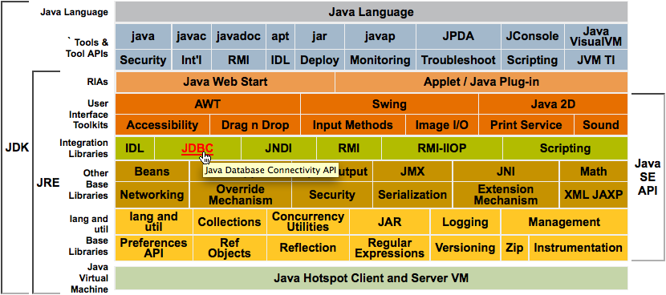
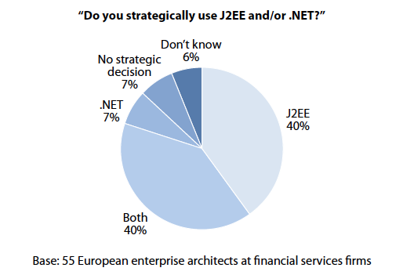

// 
//     Licensed to the Apache Software Foundation (ASF) under one
//     or more contributor license agreements.  See the NOTICE file
//     distributed with this work for additional information
//     regarding copyright ownership.  The ASF licenses this file
//     to you under the Apache License, Version 2.0 (the
//     "License"); you may not use this file except in compliance
//     with the License.  You may obtain a copy of the License at
// 
//       http://www.apache.org/licenses/LICENSE-2.0
// 
//     Unless required by applicable law or agreed to in writing,
//     software distributed under the License is distributed on an
//     "AS IS" BASIS, WITHOUT WARRANTIES OR CONDITIONS OF ANY
//     KIND, either express or implied.  See the License for the
//     specific language governing permissions and limitations
//     under the License.
//

= NetBeans 电子商务教程 - 简介
:jbake-type: tutorial
:jbake-tags: tutorials 
:jbake-status: published
:icons: font
:syntax: true
:source-highlighter: pygments
:toc: left
:toc-title:
:description: NetBeans 电子商务教程 - 简介 - Apache NetBeans
:keywords: Apache NetBeans, Tutorials, NetBeans 电子商务教程 - 简介

1. *简介*
2. link:design.html[+设计应用程序+]
3. link:setup-dev-environ.html[+设置开发环境+]
4. link:data-model.html[+设计数据模型+]
5. link:page-views-controller.html[+准备页面视图和控制器 Servlet+]
6. link:connect-db.html[+将应用程序与数据库连接+]
7. link:entity-session.html[+添加实体类和会话 Bean+]
8. link:manage-sessions.html[+管理会话+]
9. link:transaction.html[+集成事务性业务逻辑+]
10. link:language.html[+添加语言支持+]
11. link:security.html[+保护应用程序+]
12. link:test-profile.html[+测试和性能分析+]
13. link:conclusion.html[+小结+]

image::../../../../images_www/articles/68/netbeans-stamp-68-69.png[title="此页上的内容适用于 NetBeans IDE 版本 6.8 和 6.9"]

欢迎使用 NetBeans 电子商务教程。在这个多部分教程中，您将了解如何创建简单而有效的电子商务应用程序，以演示各种重要的 Java Web 和 EE 开发功能。为此，您要熟悉 NetBeans IDE，并且能够运用它进行自己的开发。

如果花些时间掌握 IDE，您最后会成为更高效、更全能的开发者。在学习本教程单元的过程中，您将了解如何充分利用 IDE 的功能和工具。其中包括：

* *对不同语言的编辑器支持：*语法突出显示、代码完成、API 文档支持、快捷键、重构功能和代码模板
* *窗口系统：*“项目”、“文件”和“服务”窗口、“任务”窗口、"Javadoc" 窗口、HTTP 监视器、“导航器”和“组件面板”
* *与其他服务集成：*自动部署到已注册的服务器、数据库连接和浏览器互操作性
* *开发工具：*调试器、分析器、HTTP 服务器端监视器、本地历史记录支持和图形比较查看器

该教程采用了常见的模块化方式，其中每单元都侧重于 IDE 的特定概念、技术和功能。通过提供的设置说明和应用程序快照（从第 5 单元开始提供），可以自行顺利完成本教程中某单元的学习。不过，如果能够从头至尾连贯地学习所有单元，将可以收到最佳的效果。这也有助于了解开发过程。

第 3 单元是link:setup-dev-environ.html[+设置开发环境+]，其中向您介绍了 NetBeans IDE。在本单元中，将创建 Java Web 项目，这是您在本教程后面单元中进行的开发工作的基础。第 4 单元是link:data-model.html[+设计数据模型+]。在本单元中，将主要使用可视数据库设计工具 link:http://wb.mysql.com/[+MySQL WorkBench+]，为应用程序创建数据模型。本教程各单元之间具有连贯性，它们都为您提供了与该指定单元中项目的起始状态对应的_项目快照_。这样，即使脱离了电子商务教程的大环境，也能完成教程中某个单元的学习。要使用这些快照，请将其下载到计算机上，然后使用“打开项目”向导（Ctrl-Shift-O 组合键；在 Mac 上为 ⌘-Shift-O 组合键）在 IDE 中将其打开。

您可以查看此教程中构建的应用程序的实时演示：link:http://dot.netbeans.org:8080/AffableBean/[+NetBeans 电子商务教程演示应用程序+]。

本单元的其余部分内容介绍了一些与该教程有关的信息，并说明了进行 Java EE 开发所需的基本概念。确保您了解如下所述概念，然后再进行开发。

[[about]]
== 关于本教程

=== 本教程的受众

本教程的内容适用于下面四种用户：

* 有兴趣拓展技能以掌握 Java EE 技术的 Java 开发者
* 希望试用 NetBeans IDE 开发环境的新手
* 希望了解 Java 与其他基于 Web 的技术不同之处的 Web 开发者
* 希望详细了解简单的电子商务应用程序及其开发在实际使用中的运用情况的学生

如果您属于这四类中的任何一类，您会发现本教程对您很有帮助。您可能会发现，该教程中的一些单元比另外一些更难掌握，具体取决于您的背景。了解技术的工作原理是利用 IDE 实现自身目标的关键所在。因此，如果您确实有兴趣学习相关技术，则会发现本教程是 link:http://download.oracle.com/docs/cd/E17410_01/javaee/6/tutorial/doc/[+Java EE 教程+]的最佳辅助教材。对于教程的各个单元，请充分利用其中提供的指向 Java EE 教程中相关区域的链接，以及其他有用的资源。

=== 本教程内容

您在本教程中开发的应用程序涉及各种概念、技术和工具组件：

* *概念*
* 前端开发
* Web 应用程序项目结构
* 数据建模
* 数据库连接
* 对象关系映射
* 会话管理
* 事务业务逻辑
* 客户端和服务器端验证
* 本地化
* Web 应用程序安全
* 设计模式，包括link:http://java.sun.com/blueprints/patterns/MVC.html[+模型-视图-控制器+] (MVC) 和link:http://java.sun.com/blueprints/patterns/SessionFacade.html[+会话 Facade+]
* *技术*
* HTML、CSS 和 JavaScript 技术
* Servlet 和 JavaServer Pages (JSP) 技术
* Enterprise JavaBeans (EJB) 技术
* Java 持久性 API (JPA)
* JavaServer Pages 标准标记库 (JSTL)
* Java 数据库连接 (JDBC)
* *开发工具*
* NetBeans IDE
* GlassFish，一种 Java EE 应用服务器
* MySQL，一种关系数据库管理服务器 (RDBMS)
* MySQL WorkBench，一种可视数据库设计工具

[[whatEcommerce]]
== 什么是电子商务应用程序？

根据我们现在的概念，_电子商务_这一术语是指通过 Internet 买卖商品或服务。例如，您可能会想到 link:http://www.amazon.com/[+Amazon+]，这是一个提供各类产品（如书籍、音乐和电子产品）的网上购物平台。这种形式的电子商务称为_电子零售_，通常涉及物品的运输。我们也称之为企业与客户的_电子商务_，即 B2C。其他众所周知的形式包括：

* *消费者与消费者 (C2C) 之间的电子商务：*个人之间的交易行为，往往通过第三方站点实现，如在线拍卖。对于 C2C 电子商务，典型的例子莫过于 link:http://www.ebay.com/[+eBay+]。
* *企业与企业 (B2B) 之间的电子商务：*企业之间（例如零售商与批发商或批发商与制造商之间）进行的商业活动。
* *企业与政府 (B2G) 之间的电子商务：*企业与政府机关之间进行的商业活动。

本教程着重介绍了企业与客户 (B2C) 之间的电子商务，并运用了小型零售店（目的是创建网站供客户进行网上购物）的典型方案。适用于 B2C 情况的软件通常由下面两部分组成：

1. *店铺前端：*可供客户访问并在 Internet 上购买商品的网站。店铺目录中的数据通常保留在数据库中，而需要此数据的页面是动态生成的。
2. *管理控制台：*一个受口令保护的区域，店员可通过安全连接访问该区域，以便进行网上管理。通常，这包括对店铺目录进行 CRUD（创建、读取、更新和删除）操作访问，管理折扣、发货和付款选项，以及核实客户订单。

[[whatJava]]
== 什么是 Java？

在计算机软件行业，"Java" 这一术语是指 _Java 平台_以及 _Java 编程语言_。

image::images/duke.png[title="Duke，Java 吉祥物"]

Duke，Java 吉祥物

=== Java 是编程语言

Java 语言的概念是由 link:http://en.wikipedia.org/wiki/James_Gosling[+James Gosling+] 于 1991 年提出的。当时，他已着手处理这方面的项目。该语言是按照下面 5 项设计原则^<<footnote1,[1]>>^ 创建的：

1. *面向对象，简单常见：*Java 中包含一小部分连贯的核心基本概念，可以快速掌握。它最初是根据当时最流行的 C++ 语言建模的，因此，编程人员可以轻松迁移到 Java。另外，它还秉承了_面向对象_的理念；系统由封装对象组成，这些封装对象通过相互传递消息进行通信。
2. *安全强大：*该语言包括编译时和运行时检查功能，可确保快速查明错误。它还包含网络和文件访问安全功能，可使分布式应用程序免于入侵或受损。
3. *与体系结构无关，具有可移植性：*Java 的主要优点之一在于_可移植性_。可以轻松地在两个平台之间传输应用程序，而修改量极少或无需进行修改。1995 年，随着 Java 1.0 的发布，“一次编写，随处运行”的口号也浮出水面。这一口号指出了该语言的跨平台优势。
4. *高性能：*应用程序可借助各种低端功能快速有效地运行，如使 Java 解释器从运行时环境独立运行，以及应用自动垃圾回收器释放未使用的内存。
5. *可解释、多线程和动态性：*使用 Java，可将开发者的源代码编译成中间可解释形式，即_字节代码_。字节代码指令集引用了 Java 虚拟机 (JVM) 使用的计算机语言。通过适当的解释器，可以将此语言转换成其上运行该语言的平台的_本机代码_。多线程功能主要是通过 `Thread` 类来提供支持的，它可以使多项任务同时执行。该语言和运行时系统是动态的，应用程序可以在执行期间使用它们满足不断变化的环境要求。

如果要进一步了解 Java 语言，请参见 link:http://java.sun.com/docs/books/tutorial/[+Java 教程+]。

[[platform]]
=== Java 是一个平台

Java 平台是一种基于软件的平台，由下面两部分组成：

* *Java 虚拟机 (JVM)*：JVM 是一种引擎，可用于执行由 Java 编译器生成的指令。我们可以将 JVM 视为 Java 运行时环境 (JRE) 的实例。它可以嵌入到 Web 浏览器、服务器和操作系统等各种产品中。
* *Java 应用程序编程接口 (API)*：预编写的代码，分成很多由类似主题组成的包。例如，小应用程序和 AWT 包中包含用于创建字体、菜单和按钮的类。

Java 开发工具包 (JDK) 是指 Java SE Edition，而其他工具包称为 "SDK"，这是“软件开发工具包”的通用术语。例如，link:http://java.sun.com/javaee/sdk/[+Java EE SDK+]。^<<footnote2,[2]>>^

通过查看 link:http://download.oracle.com/javase/6/docs/index.html[+JDK 文档+]中提供的组件技术的概念图，可以直观地了解 Java 平台。如下所示，这是一张交互式图，您可以在其中单击各组件，了解各种技术的详细信息。 

如该图所示，JDK 包括 Java 运行时环境 (JRE)。您需要 JRE 才能运行软件，并且需要 JDK 才能开发软件。两者可通过 link:http://www.oracle.com/technetwork/java/javase/downloads/index.html[+Java SE 下载+]获得。

Java 平台有多种_版本_，如 link:http://java.sun.com/javase/[+Java SE+] (Standard Edition)、link:http://java.sun.com/javame/index.jsp[+Java ME+] (Micro Edition) 和 link:http://java.sun.com/javaee/[+Java EE+] (Enterprise Edition)。

=== Java EE

Java Platform Enterprise Edition (Java EE) 基于 Java SE 平台构建，提供了一组技术，用于开发和运行安全可靠、灵活强大的可移植服务器端应用程序。

EE 技术大致可以分为两类：

* link:http://java.sun.com/javaee/technologies/webapps/[+Web 应用程序技术+]
* link:http://java.sun.com/javaee/technologies/entapps/[+企业应用程序技术+]

根据需要，您可能希望使用这两类中任一类的某些技术。例如，本教程使用了 link:http://java.sun.com/products/servlet/index.jsp[+Servlet+]、link:http://java.sun.com/products/jsp/[+JSP/EL+] 和 link:http://java.sun.com/products/jsp/jstl/[+JSTL+] "Web" 技术，以及 link:http://java.sun.com/products/ejb/[+EJB+] 和 link:http://java.sun.com/javaee/technologies/persistence.jsp[+JPA+] "Enterprise" 技术。

目前，Java EE 在市场中占据主导地位，这在金融领域表现得尤为突出。下图摘自  2007 年进行的link:http://docs.google.com/viewer?a=v&q=cache:2NNYG8LtVFIJ:www.sun.com/aboutsun/media/analyst/european_fsa.pdf+european_fsa.pdf&hl=en&pid=bl&srcid=ADGEESi3vpbc32J7GzXFiqk__DvMp7_3deYe9td-HP3_QEXh77yBABi35uvL1z7ytj6o17io7_YFPnRFmhju5PQgrpgjVxt-2qXQSUh8xGUbeNP0k00dDsiq1Tl0DWJLOEH3SNubhit5&sig=AHIEtbTKL5tks3AlgEt57h4Aku_H55OXag[+欧洲市场独立调查+]。

有关 Java EE 与 .NET 的最新非正式比较，请参见 Java EE 社区知名成员发布的博客帖子：link:http://www.adam-bien.com/roller/abien/entry/java_ee_or_net_an[+Java EE 或 .NET - 客观评述+]。

=== 二者的区别何在？

有很多缩写和首字母缩写词有待说明。如果您不熟悉所有这些内容，并对上述解释有些迷惑不解，则以下资源可以帮助说明一些常用术语之间的区别。

* link:http://www.java.com/en/download/faq/jre_jdk.xml[+JRE 与 JDK 的区别何在？+]
* link:http://www.java.com/en/download/faq/java_diff.xml[+JRE 与 Java SE 平台的区别何在？+]
* link:http://www.oracle.com/technetwork/java/javaee/javaee-faq-jsp-135209.html#diff[+Java EE 与 J2EE 的区别何在？+]
* link:http://java.sun.com/new2java/programming/learn/unravelingjava.html[+Java 术语揭秘+]

[[jcp]]
== 什么是 Java Community Process？

link:http://jcp.org/[+Java Community Process+] (JCP) 是一种程序，用于管理 Java 技术的标准技术规范的开发。JCP 列出了 Java 规范请求 (JSR)，后者是说明要添加到 Java 平台的技术的正式建议文档。JSR 是由_专业团队_管理的，该团队通常由作为行业利益相关者的公司代表组成。JCP 使 Java 技术可根据社区的需要和趋势来发展和调整。

本教程中使用和引用的技术的 JSR 包括以下内容：

* link:http://jcp.org/en/jsr/summary?id=52[+JSR 52：JavaServer Pages 的标准标记库+]
* link:http://jcp.org/en/jsr/summary?id=245[+JSR 245：JavaServer Pages 2.1+]
* link:http://jcp.org/en/jsr/summary?id=315[+JSR 315：Java Servlet 3.0+]
* link:http://jcp.org/en/jsr/summary?id=316[+JSR 316：Java Platform Enterprise Edition 6+]
* link:http://jcp.org/en/jsr/summary?id=317[+JSR 317：Java 持久性 2.0+]
* link:http://jcp.org/en/jsr/summary?id=318[+JSR 318：Enterprise JavaBeans 3.1+]

您可以使用 link:http://jcp.org/[+JCP 网站+]搜索各个 JSR。此外，还可以在以下网站上查看所有最新的 EE 技术 (Java EE 6)：

* link:http://java.sun.com/javaee/technologies/index.jsp[+http://java.sun.com/javaee/technologies/index.jsp+]

Java EE 5 技术列在以下网页上：

* link:http://java.sun.com/javaee/technologies/javaee5.jsp[+http://java.sun.com/javaee/technologies/javaee5.jsp+]

JSR 的最终发行版提供了_引用实现_，这是该技术的免费实现。在本教程中，将利用这些实现开发电子商务样例应用程序。例如，GlassFish v3 应用服务器包含在 link:https://netbeans.org/downloads/6.8/index.html[+NetBeans 6.8+] 的标准 Java 下载包中，它是 Java EE 6 平台规范 (link:http://jcp.org/en/jsr/summary?id=316[+JSR 316+]) 的引用实现。作为 Java EE 平台的引用实现，它包括该平台中的技术（如 Servlet、EJB 和 JPA 技术）的引用实现。

[[ide]]
== 为何使用 IDE？

首先，_IDE_ 这一术语是_集成开发环境_的缩写。一直以来，IDE 旨在提供以下工具和支持，帮助开发者最大限度地提高工作效率：

* 源代码编辑器
* 编译器和自动构建工具
* 用于查看项目及其工件的窗口系统
* 与其他常用服务的集成
* 调试支持
* 性能分析支持

如果要手动创建基于 Java 的 Web 应用程序，则要考虑哪些操作是必需的。安装 link:http://www.oracle.com/technetwork/java/javase/downloads/index.html[+Java 开发工具包 (JDK)+] 之后，可能需要执行以下步骤来设置开发环境。^<<footnote3,[3]>>^

1. 设置 `PATH` 环境变量，使之指向 JDK 安装。
2. 下载并配置服务器，以便实现计划使用的技术。
3. 创建开发目录，以便根据计划来创建并处理 Web 应用程序。此外，还需要设置应用程序目录结构，使之能够被服务器理解。（例如，请参见 link:http://java.sun.com/blueprints/code/projectconventions.html#99632[+Java 蓝图：Web 应用程序战略+]了解建议的结构。）
4. 设置 `CLASSPATH` 环境变量，使之包括开发目录，以及任何必需的 JAR 文件。
5. 建立一个部署方法，将资源从开发目录复制到服务器的部署区域。
6. 安装相关 API 文档或为其添加书签。

出于教学考虑，不妨手动创建并运行 Java Web 项目，以便于了解所需执行的步骤。但最终，您需要考虑使用工具来减少或消除那些必须执行的繁琐或重复的任务，以便集中精力开发满足特定业务需要的代码。IDE 简化了上述过程。如第 3 单元link:setup-dev-environ.html[+设置开发环境+]所述，您将安装带有 GlassFish 应用服务器的 NetBeans IDE，并且可以使用一个简单的 3 步向导，设置包含常规目录结构的 Web 应用程序项目。此外，IDE 还提供了内置 API 文档，您可以在使用编辑器编写代码时调用该文档，也可以让其在外部窗口中保持打开状态。

通常，IDE 还可以采用对开发者透明的方式编译和部署项目。例如，您在 NetBeans 中创建的 Web 项目包括用于编译、清理、打包和部署该项目的 Ant 构建脚本。这意味着，您可以从 IDE 中运行项目，系统将自动编译和部署该项目，然后在默认浏览器中将其打开。不止于此，很多 IDE 还支持“在保存时部署”功能。换而言之，只要将更改保存到项目，就会自动更新服务器上部署的版本。只需切换至浏览器并刷新页面即可查看所做的更改。

IDE 还提供了各种文件类型的模板，通常可以通过下述方式让用户将其添加到项目中：提供常用位置建议，以及包含必要的默认配置信息。

除了上述“基本支持”，IDE 通常还会提供外部工具和服务（例如应用程序和数据库服务器、Web 服务、调试和性能分析功能，以及协作工具）的接口，如果您的任务是进行 Java 开发，则这些工具和服务是您工作中不可或缺的。

最后，IDE 通常提供了增强的编辑器支持。在大部分的时间里，您可能都在使用编辑器，而 IDE 编辑器通常包括语法突出显示、重构功能、快捷键、代码完成、提示和错误消息，所有这些功能旨在帮助您更高效、更智能地完成工作。

[[netBeans]]
== 为何使用 NetBeans？

NetBeans IDE 是一种完全采用 Java 编写的免费开源集成开发环境。它提供了各种工具，使您可以使用 Java 语言、C/C++ 甚至 PHP、JavaScript、Groovy 和 Ruby 等脚本语言创建专业的桌面、企业、Web 和 Mobile 应用程序。

人们对 NetBeans 给予了高度评价。有关见证的列表，请参见 link:../../../../features/ide/testimonials.html[+NetBeans IDE 见证+]。很多开发者都打算将其应用程序从其他 IDE 迁移到 NetBeans。有关原因，请阅读link:../../../../switch/realstories.html[+改用 NetBeans IDE 的用户的真实案例+]。

IDE 提供了诸多 link:../../../../features/web/index.html[+Web 开发功能+]，并在多个方面优于其他 IDE。下面是几项值得关注的优点：

* *现成可用：*只需下载、安装并运行 IDE 即可。其下载大小不大，安装起来轻而易举。IDE 可在很多平台上运行，包括 Windows、Linux、Mac OS X 和 Solaris。所有 IDE 工具和功能都是全面集成的，因此，不需要寻找插件，只要启动该 IDE，这些工具和功能就能协同工作。
* *免费的开放源代码：*使用 NetBeans IDE 时，您可以加入一个人气很旺的link:../../../../community/index.html[+开源社区+]，该社区由数千名随时愿意提供帮助和做出贡献的用户组成。link:../../../../community/lists/index.html[+NetBeans 项目邮件列表+]中提供了论坛，link:http://www.planetnetbeans.org/[+Planet NetBeans+] 上提供了博客，而link:http://wiki.netbeans.org/[+社区 Wiki+] 上则提供了有用的常见问题解答和教程。
* *性能分析和调试工具：*通过 NetBeans IDE link:../../../../features/java/profiler.html[+分析器+]，可以实时了解内存使用情况和潜在的性能瓶颈问题。此外，还可以分析代码中的特定部分，以免在性能分析期间发生性能下降的情况。link:http://profiler.netbeans.org/docs/help/6.0/heapwalker.html[+堆查看器+]工具可帮助您评估 Java 堆内容并查找内存泄漏。
* *可定制的项目：*通过 NetBeans IDE 构建过程（该过程取决于业界标准，如 link:http://ant.apache.org/[+Apache Ant+]、link:http://www.gnu.org/software/make/[+make+]、link:http://maven.apache.org/[+Maven+] 和 link:http://rake.rubyforge.org/[+rake+]），而不是专用构建过程，可以轻松定制项目和添加功能。您可以在 IDE 外部构建和运行项目，并将项目部署到服务器。
* *协作工具：*IDE 为 CVS、Subversion 和 Mercurial 等版本控制系统提供了内置支持。
* *内容丰富的文档：*IDE 的内置帮助集中包含大量提示和说明。只需在 IDE 的组件中按 F1 键（在 Mac 上为 fn-F1 组合键），即可调用帮助集。另外，IDE 的link:../../../index.html[+官方知识库+]还提供了不断更新的上百种联机教程、文章和link:../../intro-screencasts.html[+截屏视频+]。

如需了解用户选择 NetBeans 的更多原因，请参见link:../../../../switch/why.html[+通过 NetBeans IDE 进行团队开发+]。

link:/about/contact_form.html?to=3&subject=Feedback: NetBeans E-commerce Tutorial - Introduction[+请将您的反馈意见发送给我们+]

[[seeAlso]]
== 另请参见

=== 联机资源

* link:http://java.sun.com/docs/books/tutorial/[+Java 教程+]
* link:http://www.oracle.com/technetwork/java/javaee/javaee-faq-jsp-135209.html[+Java EE 常见问题解答+]
* link:http://java.sun.com/javaee/reference/apis/[+Java EE API 与文档+]
* link:http://java.sun.com/new2java/programming/learn/unravelingjava.html[+Java 术语揭秘+]
* link:http://www.java.com/en/javahistory/index.jsp[+Java 技术的历史+]
* link:http://java.sun.com/new2java/gettingstarted.jsp[+Java 编程新手中心+]

=== 书籍

* link:http://www.apress.com/book/view/1590598954[+专业的 NetBeans IDE 6 富客户端平台版本+]
* link:http://www.informit.com/store/product.aspx?isbn=0130092290[+《Servlet 与 JSP 核心编程》（第 2 版）第 1 卷：核心技术+]
* link:http://www.informit.com/store/product.aspx?isbn=0131482602[+《Servlet 与 JSP 核心编程》（第 2 版）第 2 卷：高级技术+]
* link:http://java.sun.com/docs/books/faq/[+Java 常见问题解答+]

== 参考

1. <<1,^>> 白皮书 link:http://java.sun.com/docs/white/langenv/Intro.doc2.html[+Java 语言环境+]概述了 5 项设计原则。
2. <<2,^>>link:http://download.oracle.com/javase/6/webnotes/version-6.html[+ Java SE 6、平台名称和版本号+]中定义了最新的版本名称和版本号。
3. <<3,^>> 这些步骤大致基于“第 2 章：服务器设置和配置”中的内容，该章摘自《link:http://pdf.coreservlets.com/[+Servlet 与 JSP 核心编程+]》，由 Marty Hall 和 Larry Brown 共同撰写。本书以 PDF 格式在 link:http://pdf.coreservlets.com/[+http://pdf.coreservlets.com/+] 上免费提供
