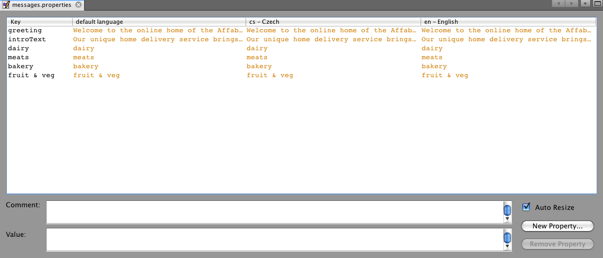
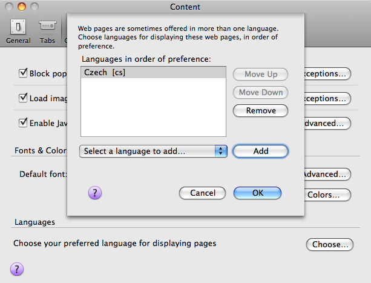
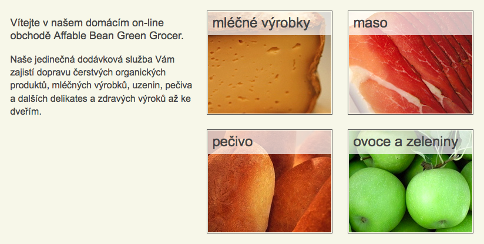
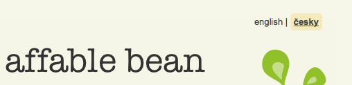

// 
//     Licensed to the Apache Software Foundation (ASF) under one
//     or more contributor license agreements.  See the NOTICE file
//     distributed with this work for additional information
//     regarding copyright ownership.  The ASF licenses this file
//     to you under the Apache License, Version 2.0 (the
//     "License"); you may not use this file except in compliance
//     with the License.  You may obtain a copy of the License at
// 
//       http://www.apache.org/licenses/LICENSE-2.0
// 
//     Unless required by applicable law or agreed to in writing,
//     software distributed under the License is distributed on an
//     "AS IS" BASIS, WITHOUT WARRANTIES OR CONDITIONS OF ANY
//     KIND, either express or implied.  See the License for the
//     specific language governing permissions and limitations
//     under the License.
//

= The NetBeans E-commerce Tutorial - Adding Language Support
:jbake-type: tutorial
:jbake-tags: tutorials 
:jbake-status: published
:icons: font
:syntax: true
:source-highlighter: pygments
:toc: left
:toc-title:
:description: The NetBeans E-commerce Tutorial - Adding Language Support - Apache NetBeans
:keywords: Apache NetBeans, Tutorials, The NetBeans E-commerce Tutorial - Adding Language Support
include::../../../../inc/database.adoc[]

The goal of this tutorial unit is to demonstrate how to enable language support for a web application. "Language support" here refers to the ability to display page views according to the customer-specified languages. Within the context of the `AffableBean` application, we have agreed to provide support for both English and Czech, as per the previously outlined xref:design.adoc#requirements[+customer requirements+].

In order to accomplish this, you rely on Java's support for internationalization. You create a _resource bundle_ for each language and let the Java runtime environment determine the appropriate language for incoming client requests. You also implement a 'language toggle' to enable users to switch the languages manually.

The NetBeans IDE provides special support for localizing application content. This includes a Customizer dialog that enables you to add new locales to an existing resource bundle base name, as well as a special Properties editor that lets you view and edit key-value pairs for all locales in a table layout. These are both utilized in this tutorial.

You can view a live demo of the application that you build in this tutorial: link:http://services.netbeans.org/AffableBean/[+NetBeans E-commerce Tutorial Demo Application+].

|===
|Software or Resource |Version Required 

|xref:../../../../download/index.adoc[NetBeans IDE] |Java bundle, 6.8 or 6.9 

|link:http://www.oracle.com/technetwork/java/javase/downloads/index.html[+Java Development Kit (JDK)+] |version 6 

|<<glassFish,GlassFish server>> |v3 or Open Source Edition 3.0.1 

|link:http://dev.mysql.com/downloads/mysql/[+MySQL database server+] |version 5.1 

|link:https://netbeans.org/projects/samples/downloads/download/Samples%252FJavaEE%252Fecommerce%252FAffableBean_snapshot8.zip[+AffableBean project+] |snapshot 8 

|link:https://netbeans.org/projects/samples/downloads/download/Samples%252FJavaEE%252Fecommerce%252FAffableBean_snapshot9.zip[+AffableBean project+] |snapshot 9 
|===

*Notes:*

* The NetBeans IDE requires the Java Development Kit (JDK) to run properly. If you do not have any of the resources listed above, the JDK should be the first item that you download and install.
* The NetBeans IDE Java Bundle includes Java Web and EE technologies, which are required for the application you build in this tutorial.
* The NetBeans IDE Java Bundle also includes the GlassFish server, which you require for this tutorial. You could link:http://glassfish.dev.java.net/public/downloadsindex.html[+download the GlassFish server independently+], but the version provided with the NetBeans download has the added benefit of being automatically registered with the IDE.
* You can follow this tutorial unit without having completed previous units. To do so, see the xref:setup.adoc[+setup instructions+], which describe how to prepare the database and establish connectivity between the IDE, GlassFish, and MySQL.

[[resourceBundles]]
== Understanding Resource Bundles

In Java, a resource bundle is a representation of the link:http://download.oracle.com/docs/cd/E17409_01/javase/6/docs/api/java/util/ResourceBundle.html[+`java.util.ResourceBundle`+] class. As stated in the Javadoc,

[NOTE]
====
_Resource bundles contain locale-specific objects. When your program needs a locale-specific resource, a String for example, your program can load it from the resource bundle that is appropriate for the current user's locale. In this way, you can write program code that is largely independent of the user's locale isolating most, if not all, of the locale-specific information in resource bundles. 

This allows you to write programs that can:_

* _be easily localized, or translated, into different languages_
* _handle multiple locales at once_
* _be easily modified later to support even more locales_
====

From the Javadoc, you can also note that the `ResourceBundle` is parent to both link:http://download.oracle.com/docs/cd/E17409_01/javase/6/docs/api/java/util/ListResourceBundle.html[+`ListResourceBundle`+] and link:http://download.oracle.com/docs/cd/E17409_01/javase/6/docs/api/java/util/PropertyResourceBundle.html[+`PropertyResourceBundle`+]. In this tutorial we utilize the `PropertyResourceBundle`, which manages resources as text files that use the `.properties` extension and contain locale-specific information in the form of key-value pairs. With new each translation, a new version of the resource bundle is created by appending the locale identifier to the base name using an underscore ('`_`'). For example, snippets from two of the resource bundles you create in this tutorial look as follows:

*messages_en.properties*

[source,java]
----

meats=meats
bakery=bakery
----

*messages_cs.properties*

[source,java]
----

meats=maso
bakery=pečivo
----

In the above example, '`messages`' represents the base name, and the locale identifier is the two-letter code which is appended using an underscore. (i.e., '`en`' for English, '`cs`' for Czech). The two-letter codes are derived from the international link:{wikipedia}ISO_639[ISO 639] standard, which lists codes that represent the names of languages. The ISO 639 standard is adopted by the link:http://www.w3.org/International/[+W3C Internationalization Activity+] and is used by all major browsers (these are the codes understood in the `Accept-Language` HTTP header). It is also internalized in the link:http://download.oracle.com/docs/cd/E17409_01/javase/6/docs/api/java/util/Locale.html[+`java.util.Locale`+] class.

[[multilingual]]
== Making Pages Multilingual

Returning to the `AffableBean` application, after continued discussions with the customer you've agreed on the following implementation details:

* The website initially displays based on the preferred language of the user's browser.
* If the browser's preferred language is neither English nor Czech, the site displays text in English.
* The user has the option of changing the language by means of a 'language toggle' in the page header.
* When using the language toggle to change the language, the user remains in the same page view.
* The language toggle should not appear for the confirmation page, as a user will already have selected his or her language prior to checkout.

In order to implement the above points, divide the task into two parts. Start by creating basic bilingual support for page views. Once bilingual support is in place, implement the language toggle that enables users to manually switch languages.

There are three basic steps that you need to follow to incorporate multilingual support into your web pages.

1. Create a resource bundle for each language you plan to support.
2. Register the resource bundle with the application by setting a context parameter in the `web.xml` deployment descriptor.
3. In page views, replace 'hard-coded' text with `<fmt:message>` tags that reference keys in the resource bundles.

The following exercise demonstrates how to integrate English and Czech language support into the `AffableBean` welcome page by applying the above three steps, and finishes by showing how to test for browser language support using Firefox.

1. <<createResource,Create Resource Bundles>>
2. <<register,Register the Resource Bundle with the Application>>
3. <<replace,Replace 'Hard-Coded' Text with `<fmt:message>` Tags>>
4. <<test,Test Supported Languages>>

[[createResource]]
=== Create Resource Bundles

1. Open the `AffableBean` project link:https://netbeans.org/projects/samples/downloads/download/Samples%252FJavaEE%252Fecommerce%252FAffableBean_snapshot8.zip[+snapshot 8+] in the IDE. Click the Open Project ( image:images/open-project-btn.png[] ) button and use the wizard to navigate to the location on your computer where you downloaded the project.
2. Click the Run Project ( image:images/run-project-btn.png[] ) button to run the project and ensure that it is properly configured with your database and application server. 

If you receive an error when running the project, revisit the xref:setup.adoc[+setup instructions+], which describe how to prepare the database and establish connectivity between the IDE, GlassFish, and MySQL.

[start=3]
. Begin by creating a default resource bundle to contain text used in page views. Click the New File ( image:images/new-file-btn.png[] ) button in the IDE's toolbar. (Alternatively, press Ctrl-N; ⌘-N on Mac.)

[start=4]
. Under Categories select Other, then under File Types select Properties File. 

image::images/new-file-wzd.png[title="Create a new resource bundle using the File wizard"] 

Note that the wizard provides a description for the selected file type:

[NOTE]
====
_Creates a resource bundle (`.properties`) file suitable for internationalizing applications by separating out all human-visible text strings from your code. Resource bundle files can also be used to collect other types of strings, such as properties for Ant scripts. The created resource bundle contains only one locale, but you can add additional locales from the created file's contextual menu. The bundle can be edited in a text file (property-file format) for a specific locale or in a table that displays information for all locales._
====

[start=5]
. Click Next. In the Name and Location step, name the file `messages` and type in `src/java/resources` in the Folder field. This will instruct the wizard to place the resource bundle in a new package named `resources`. 

image::images/new-properties-file-wzd.png[title="Specify the name and location of the resource bundle"]

[start=6]
. Click Finish. The `messages.properties` resource bundle is generated and opens in the editor. 

Note that the new `messages.properties` file name does not have a language code appended to it, as was previously described. This is because this file will be used as the _default_ resource bundle. The default resource bundle is applied when the Java runtime environment does not find a direct match for the requested locale.

[start=7]
. Open the project's `index.jsp` file in the editor and note that the following text is currently used:
* *Greeting:* `Welcome to the online home of the Affable Bean Green Grocer.`
* *Introductory Message:* `Enjoy browsing and learning more about our unique home delivery service bringing you fresh organic produce, dairy, meats, breads and other delicious and healthy items to your doorstep.`
Also, note that we'll need language-specific names for the four categories that display when `index.jsp` renders in the browser. Since these names are currently taken from the database, we can use them as keys in the resource bundle. 

Recall that one of the <<impDeets,implementation details>> outlined above states that "_if the browser's preferred language is neither English nor Czech, the site displays text in English._" Therefore, the values that we apply to the `messages.properties` file will be in English.

[start=8]
. In the `messages.properties` file, begin adding key-value pairs for the text used in the welcome page. Add the following content.

[source,java]
----

# welcome page
greeting=Welcome to the online home of the Affable Bean Green Grocer.
introText=Our unique home delivery service brings you fresh organic produce, dairy, meats, breads and other delicious and healthy items direct to your doorstep.

# categories
dairy=dairy
meats=meats
bakery=bakery
fruit\ &amp;\ veg=fruit &amp; veg
----
Comments are added using a number sign ('`#`'). Also, because the `fruit &amp; veg` category name contains spaces, it is necessary to escape the space characters using a backslash ('`\`') in order to apply the name as a resource bundle key. 

We are now finished with the default resource bundle for the application's welcome page. Let's continue by creating resource bundles for the customer-specified languages.

[start=9]
. In the Projects window, expand the Source Packages node, then right-click the `resources` > `messages.properties` file node and choose Customize. The Customizer dialog opens.

[start=10]
. In the Customizer dialog, click the Add Locale button. In the New Locale dialog that displays, enter '`en`' in the Language Code combo box, then click OK. 

image::images/new-locale-dialog.png[title="The New Locale dialog enables you to add a new locale to an existing resource bundle base name"] 

A _locale_ can be defined by both a language and a geographic region. The optional country code which can be used to specify the region can be applied to define formatting for dates, time, numbers, and currency. For more information, see the technical article, link:http://java.sun.com/developer/technicalArticles/J2SE/locale/[+Understanding Locale in the Java Platform+].

[start=11]
. Click the Add Locale button again, then enter '`cs`' in the Language Code combo box and click OK. The Customizer dialog displays as follows. 

image::images/customizer-dialog.png[title="The New Locale dialog enables you to add a new locale to an existing resource bundle base name"]

[start=12]
. Click Close. In the Projects window, note that your resource bundles look as follows. You can expand a resource bundle to view the keys it contains. 

image::images/projects-window.png[title="View resource bundles and the keys they contain in the Projects window"]

[start=13]
. Right-click any of the three resource bundles and choose Open. The Properties editor opens, enabling you to view and edit key-value pairs for all locales in a table layout. 
[.feature]
--

--

Press Shift-Esc to maximize the window in the IDE.

Note that when you add a new locale using the Customizer dialog, as you did for English and Czech in the previous steps, the keys and values of the default resource bundle are copied to the new locale.

[start=14]
. Modify the values for the Czech resource bundle. You can do this by _either_ clicking into the table cells for each row and typing your entries directly _or_ selecting the cell you want to edit and typing into the *Value* field located at the bottom of the Properties editor.
* *greeting:* `Vítejte v našem domácím on-line obchodě Affable Bean Green Grocer.`
* *introText:* `Naše jedinečná dodávková služba Vám zajistí dopravu čerstvých organických produktů, mléčných výrobků, uzenin, pečiva a dalších delikates a zdravých výroků až ke dveřím.`
* *dairy:* `mléčné výrobky`
* *meats:* `maso`
* *bakery:* `pečivo`
* *fruit &amp; veg:* `ovoce a zeleniny`

You can also add a comment to each key-value pair. Any text you enter into the *Comment* field in the Properties editor is added to the resource bundle text file above the key-value pair as a comment (i.e., following a '`#`' sign).

[start=15]
. Double-click the `messages_cs.properties` file node in the Projects window. Note that the text file has been updated according to your changes in the Properties editor.

[source,java]
----

# welcome page
greeting=Vítejte v našem domácím on-line obchodě Affable Bean Green Grocer.
introText=Naše jedinečná dodávková služba Vám zajistí dopravu čerstvých organických produktů, mléčných výrobků, uzenin, pečiva a dalších delikates a zdravých výroků až ke dveřím.

# categories
dairy=mléčné výrobky
meats=maso
bakery=pečivo
fruit\ &amp;\ veg=ovoce a zeleniny
----

We now have the following resource bundles defined:

* default (English)
* Czech
* English

You might assume that if the default bundle is in English, then there is no need to create a resource bundle explicitly for English. However, consider the following scenario: a client browser's list of preferred languages includes both Czech and English, with English taking precedence over Czech. If the application doesn't provide a resource bundle for English but does for Czech, pages sent to that browser will be in Czech (since a Czech bundle was defined). This is clearly not the desired behavior for that browser.

[[register]]
=== Register the Resource Bundle with the Application

The purpose of this step is to inform JSTL's format (i.e., link:http://download.oracle.com/docs/cd/E17802_01/products/products/jsp/jstl/1.1/docs/tlddocs/fmt/tld-summary.html[+`fmt`+]) tag library where it can locate any resource bundles existing in the application. You accomplish this by instructing the application to create a link:http://download.oracle.com/docs/cd/E17477_01/javaee/5/jstl/1.1/docs/api/javax/servlet/jsp/jstl/fmt/LocalizationContext.html[+`LocalizationContext`+] using the existing resource bundles. This can be done by setting a context parameter in the application's `web.xml` deployment descriptor.

The topic of setting context parameters is also covered in xref:connect-db.adoc#param[+Connecting the Application to the Database+].

1. In the Projects window, expand the Configuration Files node, then double-click `web.xml` to open it in the editor.
2. Under the deployment descriptor's General tab, expand the Context Parameters category.
3. Click the Add button, then in the Add Context Parameter dialog enter the following values.
* *Parameter Name:* `javax.servlet.jsp.jstl.fmt.localizationContext`
* *Parameter Value:* `resources.messages`

image::images/add-context-parameter.png[title="Add context parameters under the General tab for web.xml"]

The `LocalizationContext` class belongs to the `javax.servlet.jsp.jstl.fmt` package. You can verify this by viewing the link:http://java.sun.com/products/jsp/jstl/1.1/docs/api/index.html[+JSTL 1.1 API Reference+] online.

[start=4]
. Click OK. The new context parameter is added to the table of existing context parameters under the General tab.

[start=5]
. Click the deployment descriptor's XML tab. Note that the following entry has been added to the file:

[source,xml]
----

<context-param>
    <param-name>javax.servlet.jsp.jstl.fmt.localizationContext</param-name>
    <param-value>resources.messages</param-value>
</context-param>
----

[[replace]]
=== Replace Hard-Coded Text with `<fmt:message>` Tags

In order to apply the localized text of resource bundles to your web pages, you reference the keys from the key-value pairs you created. You can reference the keys using JSTL's `<fmt:message>` tags.

1. Open the project's `index.jsp` page in the editor. (If already opened, press Ctrl-Tab to switch to the file.)
2. Delete instances of hard-coded text that display in the page's left column, and in their place enter `<fmt:message>` tags using the `key` attribute to specify the resource bundle key. The page's left column will look as follows.

[source,html]
----

    

        
*<fmt:message key='greeting'/>*

        
*<fmt:message key='introText'/>*

    

----

[start=3]
. Add `<fmt:message>` tags for the four category names, but use the `${category.name}` expression as the value for the `key` attribute. Since the category name is also used as the value for the `` tag's `alt` attribute, follow the same procedure. The page's right column will look as follows.

[source,html]
----

    <c:forEach var="category" items="${categories}">
        

            <a href="<c:url value='category?${category.id}'/>">
                
                *<fmt:message key='${category.name}'/>*

                *" class="categoryImage">
            </a>
        

    </c:forEach>

----

[start=4]
. Finally, ensure that you have the `fmt` tag library declared in the web page. Enter the following at the top of the file:

[source,java]
----

<%@ taglib prefix="fmt" uri="http://java.sun.com/jsp/jstl/fmt" %>
----

*Note:* Here you add the tag library declaration to the top of the `index.jsp` file. However, when you begin using `<fmt>` tags elsewhere in the project, it may make more sense to remove the tag library declaration from individual page views, and add it to the header (`header.jspf`) file. This practice is adopted in link:https://netbeans.org/projects/samples/downloads/download/Samples%252FJavaEE%252Fecommerce%252FAffableBean_snapshot9.zip[+snapshot 9+] (and later snapshots).

You've now completed the tasks necessary for providing bilingual support for the application's welcome page. The following step demonstrates how to test the language support in your browser.

[[test]]
=== Test Supported Languages

You could theoretically test for the following scenarios involving the application's supported languages, as well as an unsupported language (e.g., Korean):

|===
|Use-case |Outcome 

| 1. Browser has no preferred language |English displays 

| 2. Browser prefers only English |English displays 

| 3. Browser prefers only Czech |Czech displays 

| 4. Browser prefers only Korean |English displays 

| 5. Browser prefers Korean and English; Korean takes precedence |English displays 

| 6. Browser prefers Korean and English; English takes precedence |English displays 

| 7. Browser prefers Korean and Czech; Korean takes precedence |Czech displays 

| 8. Browser prefers Korean and Czech; Czech takes precedence |Czech displays 

| 9. Browser prefers English and Czech; English takes precedence |English displays 

|10. Browser prefers English and Czech; Czech takes precedence |Czech displays 

|11. Browser prefers, in the following order, English, Czech, Korean |English displays 

|12. Browser prefers, in the following order, English, Korean, Czech |English displays 

|13. Browser prefers, in the following order, Czech, English, Korean |Czech displays 

|14. Browser prefers, in the following order, Czech, Korean, English |Czech displays 

|15. Browser prefers, in the following order, Korean, English, Czech |English displays 

|16. Browser prefers, in the following order, Korean, Czech, English |Czech displays 
|===

Rather than stepping through all 16 scenarios, we'll demonstrate how to examine scenario 3 above, in which the browser's preferred language is Czech, using the Firefox browser.

1. In Firefox, choose Tools > Options (Firefox > Preferences on Mac). In the window that displays, click the Content tab. 

image::images/firefox-content.png[title="Examine your browser's preferred languages"]

[start=2]
. Under the Languages heading, click Choose.

[start=3]
. Select any language that is currently listed in the provided text area, then click Remove. (You should remember your language list and reinstate languages after completing this tutorial.)

[start=4]
. Click the 'Select Language to Add' drop-down and select `Czech [cs]`. Then click the Add button. The Czech language is added to the text area. 

[start=5]
. Click OK, then press Esc to close Firefox' Options window.

[start=6]
. Run the project ( image:images/run-project-btn.png[] ). When the welcome page opens in your browser, note that text is displayed in Czech. 

[[toggle]]
== Implementing a Language Toggle

Now that basic Czech-English language support is in place, continue by implementing the language toggle in the application's page views. We can divide this task into three parts:

* <<toggleDisplay,Create Toggle Display and Synchronize with the Browser's Preferred Language>>
* <<handleRequest,Implement Functionality to Handle a Request from the Language Toggle>>
* <<keepTrack,Enable the Application to Keep Track of the Originating Page View>>

[[toggleDisplay]]
=== Create Toggle Display and Synchronize with the Browser's Preferred Language

1. Use the Go to File dialog to open the `header` JSP fragment in the editor. Press Alt-Shift-O (Ctrl-Shift-O on Mac), then type '`h`' in the dialog and click OK. 

image::images/go-to-file-dialog.png[title="Use the Go to File dialog to quickly open project resources in the editor"]

[start=2]
. In the `header.jspf` file, locate the first `
` tag (line 56), and replace the `[ language toggle ]` placeholder text with the following HTML markup.

[source,html]
----

    *<%-- language selection widget --%>
    english | 
<a href="chooseLanguage?language=cs">česky</a>
*

----
This markup implements the language toggle's appearance when English is the displayed language. In other words, the toggle provides a link allowing the user to select the Czech (i.e., '`česky`') option. The link is used to send a request for `chooseLanguage`, and creates a query string (`?language=cs`) that specifies the requested language code. 

*Note:* Recall that in Unit 5, xref:page-views-controller.adoc#controller[+Preparing the Page Views and Controller Servlet+], you set the `ControllerServlet` to handle the `/chooseLanguage` URL pattern.

Snapshot 8 includes the link:http://jquery.com/[+jQuery+] JavaScript library and takes advantage of various UI effects to enhance the appearance and behavior of the website. Aside from a link:http://plugins.jquery.com/project/validate[+jQuery plugin for client-side validation+] (discussed in the xref:transaction.adoc#client[+previous tutorial unit+]), the snapshot implements an easing effect for category headings in the welcome page, as well as for category buttons in the category page. Configuration is included in `header.jspf` of the project snapshot. Rounded corners are implemented using CSS3's link:http://www.w3.org/TR/css3-background/#corners[+border-radius+] property (applied in `affablebean.css`).

[start=3]
. Run the project ( image:images/run-project-btn.png[] ) to see what the toggle looks like in the browser. 

 

Currently, the language toggle appears as in the above image regardless of what language the page displays in. In the next step, you integrate JSTL logic into the toggle so that it renders according to the language displayed on the page.

[start=4]
. Modify the toggle implementation as follows.

[source,html]
----

    <%-- language selection widget --%>
    *<c:choose>
      <c:when test="${pageContext.request.locale.language ne 'cs'}">
        english
      </c:when>
      <c:otherwise>
        <c:url var="url" value="chooseLanguage">
          <c:param name="language" value="en"/>
        </c:url>
        
<a href="${url}">english</a>

      </c:otherwise>
    </c:choose> |

    <c:choose>
      <c:when test="${pageContext.request.locale.language eq 'cs'}">
        česky
      </c:when>
      <c:otherwise>
        <c:url var="url" value="chooseLanguage">
          <c:param name="language" value="cs"/>
        </c:url>
        
<a href="${url}">česky</a>

      </c:otherwise>
    </c:choose>*

----
In the above implementation, you rely on conditional tags from JSTL's `core` tag library to display the left and right portions of the toggle according to the language used by the request locale. What is the "language used by the request locale"? When a request is made, the browser passes a list of preferred locales in the `Accept-Language` HTTP header. The Java runtime environment on the server reads the list and determines the best match based on the locales defined by the application's resource bundles. This match is then recorded in the `ServletRequest` object, and can be accessed using the `getLocale` method. For example, you could access the preferred locale from a servlet with the following statement.

[source,java]
----

request.getLocale();
----

You can use the IDE's HTTP Monitor (Window > Debugging > HTTP Server Monitor) to examine HTTP headers for client requests. In order to use the HTTP Monitor, you need to first activate it for the server you are using. Unit 8, xref:manage-sessions.adoc[+Managing Sessions+] provides a demonstration under the sub-section, xref:manage-sessions.adoc#http-monitor[+Examining Client-Server Communication with the HTTP Monitor+].

To determine the language of the preferred locale, you use the `Locale` class' `getLanguage` method. Again, from a servlet you could access the language of the client request's preferred locale with the following.

[source,java]
----

request.getLocale().getLanguage();
----

Returning to the code you just added to the `header.jspf` fragment, you utilize the `pageContext.request` implicit object to access the `ServletRequest` for the given client request. Using dot notation, you then proceed to call the same methods as you would from a servlet. In the above example, accessing the "language used by the request locale" is as simple as:

[source,java]
----

${pageContext.request.locale.language}
----

*Note:* The above implementation uses `<c:url>` tags to set up the toggle link. This is done in order to properly encode the request URL in the event that URL rewriting is used as a means for session tracking. Unit 8, xref:manage-sessions.adoc#encodeUrl[+Managing Sessions+] provides a brief explanation of how the `<c:url>` tags can be used.

[start=5]
. Add a basic language test to the `header.jspf` file. This will enable us to check whether the toggle is properly rendering according to the client request's preferred language. Enter the following after the page's `<body>` tag.

[source,html]
----

<body>

    *<%-- Language test --%>
    
<strong>tests:</strong>
         
        <code>\${pageContext.request.locale.language}</code>: ${pageContext.request.locale.language}
    
*

    

----

[start=6]
. Ensure that you have set Czech as your browser's preferred language. (If you are following this tutorial unit sequentially, you've already done this. If not, refer to the steps outlined above in <<test,Test Supported Languages>>.)

[start=7]
. Run the project ( image:images/run-project-btn.png[] ) and examine the application welcome page in the browser. 

image::images/language-test.png[title="Language toggle displays according to request's preferred language"] 

If your browser's preferred language is set to Czech, you can note the following:
* The test that we introduced in the previous step indicates that '`cs`' is the preferred language.
* Czech text is displayed in the page.
* The language toggle provides a link enabling the user to select English.

[[handleRequest]]
=== Implement Functionality to Handle a Request from the Language Toggle

Now that the toggle is in place and it appears according to the language displayed in the page, let's continue by adding code to the `ControllerServlet` that handles the request sent when a user clicks the link in the language toggle.

As indicated in the current language toggle implementation from <<step4,step 4>> above, the requested URL with query string looks as follows:

* *English:* `chooseLanguage?language=en`
* *Czech:* `chooseLanguage?language=cs`

Our goal is to register the language choice, and then display both the page view and language toggle based on the chosen language. We can accomplish this by extracting the `language` parameter from the query string and creating a session-scoped `language` attribute that remembers the language selected by the user. Then we'll return to the `header.jspf` fragment and apply the link:http://download-llnw.oracle.com/javaee/5/jstl/1.1/docs/tlddocs/fmt/setLocale.html[+`<fmt:setLocale>`+] tag to set the page language based on the user's choice. With the `<fmt:setLocale>` tag we can manually switch the language used in the page display. We'll also modify the language toggle so that if the `language` attribute has been set, the toggle's appearance is determined according to the `language` attribute's value.

1. Open the `ControllerServlet` in the editor. Use the Go To File dialog - press Alt-Shift-O (Ctrl-Shift-O on Mac), then type '`controller`' and click OK. In the opened file, locate the portion of the `doGet` method that handles the `chooseLanguage` request (line 126).
2. Delete the `// TODO: Implement language request` comment and enter code to extract the `language` parameter from the request query string.

[source,java]
----

// if user switches language
} else if (userPath.equals("/chooseLanguage")) {

    *// get language choice
    String language = request.getParameter("language");*
}
----

[start=3]
. Place the `language` parameter in the request scope. Add the following.

[source,java]
----

// if user switches language
} else if (userPath.equals("/chooseLanguage")) {

    // get language choice
    String language = request.getParameter("language");

    *// place in request scope
    request.setAttribute("language", language);*
}
----

[start=4]
. As a temporary measure, have the application forward the response to the `index.jsp` welcome page when the language toggle link is clicked. Add the following code.

[source,java]
----

// if user switches language
} else if (userPath.equals("/chooseLanguage")) {

    // get language choice
    String language = request.getParameter("language");

    // place in request scope
    request.setAttribute("language", language);

    *// forward request to welcome page
    try {
        request.getRequestDispatcher("/index.jsp").forward(request, response);
    } catch (Exception ex) {
        ex.printStackTrace();
    }
    return;*
}
----
Naturally, forwarding the user to the welcome page regardless of what page he or she is on is not an ideal way to handle the language toggle's behavior. We'll return to this matter in the next sub-section, <<keepTrack,Enable the Application to Keep Track of the Originating Page View>>. For the meantime however, this will allow us to examine the results of the current language toggle implementation when running the project.

[start=5]
. Switch to the `header.jspf` fragment (If the file is already opened in the editor, press Ctrl-Tab and choose the file.) and apply the link:http://download-llnw.oracle.com/javaee/5/jstl/1.1/docs/tlddocs/fmt/setLocale.html[+`<fmt:setLocale>`+] tag to set the page language based on the new `language` variable. Add the following.

[source,xml]
----

<%@taglib prefix="c" uri="http://java.sun.com/jsp/jstl/core" %>
<%@taglib prefix="fn" uri="http://java.sun.com/jsp/jstl/functions" %>
*<%@taglib prefix="fmt" uri="http://java.sun.com/jsp/jstl/fmt" %>

<%-- Set language based on user's choice --%>
<c:if test="${!empty language}">
    <fmt:setLocale value="${language}" scope="session" />
</c:if>*

<%@page contentType="text/html; charset=UTF-8" pageEncoding="UTF-8"%>
<!DOCTYPE HTML PUBLIC "-//W3C//DTD HTML 4.01 Transitional//EN"
    "http://www.w3.org/TR/html4/loose.dtd">
----
Since the `language` variable is only created when the user clicks the link in the language toggle, you perform a test using link:http://download-llnw.oracle.com/javaee/5/jstl/1.1/docs/tlddocs/c/if.html[+`<c:if>`+] tags to determine whether the variable exists before attempting to set the language. When applying the `<fmt:setLocale>` tag, you set its scope to `session` as you want the user-selected language to take precedence for the remainder of his or her session on the website. Also, since this is the first time the `fmt` library is used in the header, you declare the tag library. 

You can read the EL expression `${!empty language}` as, "False if the `language` variable is null or an empty string." See the link:http://download-llnw.oracle.com/javaee/5/tutorial/doc/bnahq.html#bnaim[+Java EE 5 Tutorial: Examples of EL Expressions+] for other available examples.

[start=6]
. Modify the language toggle implementation so that if a value has been set by the `<fmt:setLocale>` tag, the toggle displays according to the language specified by that value. (You can determine this value using the `${sessionScope['javax.servlet.jsp.jstl.fmt.locale.session']}` expression.) 

Enclose the current implementation within `<c:choose>` tags, and create logic similar to the current implementation in the event that the locale has been manually set. (Changes are displayed in *bold*.)

[source,html]
----

  <%-- language selection widget --%>
  *<c:choose>
    <%-- When user hasn't explicitly set language,
         render toggle according to browser's preferred locale --%>
    <c:when test="${empty sessionScope['javax.servlet.jsp.jstl.fmt.locale.session']}">*
      <c:choose>
        <c:when test="${pageContext.request.locale.language ne 'cs'}">
          english
        </c:when>
        <c:otherwise>
          <c:url var="url" value="chooseLanguage">
            <c:param name="language" value="en"/>
          </c:url>
          
<a href="${url}">english</a>

        </c:otherwise>
      </c:choose> |

      <c:choose>
        <c:when test="${pageContext.request.locale.language eq 'cs'}">
          česky
        </c:when>
        <c:otherwise>
          <c:url var="url" value="chooseLanguage">
            <c:param name="language" value="cs"/>
          </c:url>
          
<a href="${url}">česky</a>

        </c:otherwise>
      </c:choose>
    *</c:when>

    <%-- Otherwise, render widget according to the set locale --%>
    <c:otherwise>
      <c:choose>
        <c:when test="${sessionScope['javax.servlet.jsp.jstl.fmt.locale.session'] ne 'cs'}">
          english
        </c:when>
        <c:otherwise>
          <c:url var="url" value="chooseLanguage">
            <c:param name="language" value="en"/>
          </c:url>
          
<a href="${url}">english</a>

        </c:otherwise>
      </c:choose> |

      <c:choose>
        <c:when test="${sessionScope['javax.servlet.jsp.jstl.fmt.locale.session'] eq 'cs'}">
          česky
        </c:when>
        <c:otherwise>
          <c:url var="url" value="chooseLanguage">
            <c:param name="language" value="cs"/>
          </c:url>
          
<a href="${url}">česky</a>

        </c:otherwise>
      </c:choose>
    </c:otherwise>
  </c:choose>*

----

[start=7]
. Before examining the project in a browser, add another test that displays the value set by the `<fmt:setLocale>` tag. Add the following code beneath the test you created earlier.

[source,xml]
----

<strong>tests:</strong>
     
    <code>\${pageContext.request.locale.language}</code>: ${pageContext.request.locale.language}
    * 
    <code>\${sessionScope['javax.servlet.jsp.jstl.fmt.locale.session']}</code>: ${sessionScope['javax.servlet.jsp.jstl.fmt.locale.session']}*

----

`javax.servlet.jsp.jstl.fmt.locale.session` is the _string literal_ key for the `Locale` set by the `<fmt:setLocale>` tag. You can verify this by clicking in the editor's left margin to set a breakpoint ( image:images/breakpoint-badge.png[] ) on the new test, then running the debugger ( image:images/debug-project-btn.png[] ) on the project. When you click the toggle link to change languages in the browser, examine the Variables window (Alt-Shift-1; Ctrl-Shift-1 on Mac) when the debugger suspends on the breakpoint. 
[.feature]
--

image::images/variables-window.png[role="left", link="images/variables-window.png"]

--
 
EL expressions presented in this tutorial primarily use dot (`.`) notation. The format depicted in the expression above is known as _bracket_ (`[]`) notation whereby you enter the string literal key within quotes in order to extract the object's value:

[source,java]
----

${sessionScope['javax.servlet.jsp.jstl.fmt.locale.session']}
----

Numerous EL resolver classes exist for the purpose of resolving expressions. For example, when the above expression is encountered at runtime, the link:http://download-llnw.oracle.com/javaee/6/api/javax/servlet/jsp/el/ImplicitObjectELResolver.html[+`ImplicitObjectResolver`+] first returns a `Map` that maps session-scoped attribute names to their values. (In the above image of the Variables window, you can verify that session attributes are maintained in a link:http://download-llnw.oracle.com/javase/6/docs/api/java/util/concurrent/ConcurrentHashMap.html[+`ConcurrentHashMap`+].) In order to resolve the remainder of the expression, the link:http://download-llnw.oracle.com/javaee/6/api/javax/el/MapELResolver.html[+`MapELResolver`+] is used to get the value of the key named '`javax.servlet.jsp.jstl.fmt.locale.session`'. 

For more information, refer to the Java EE 5 Tutorial: link:http://download-llnw.oracle.com/javaee/5/tutorial/doc/bnahq.html#bnaif[+Unified Expression Language: Resolving Expressions+].

[start=8]
. Run the project ( image:images/run-project-btn.png[] ) and examine the application welcome page in the browser. 

image::images/toggle-page1.png[title="Welcome page displays according to browser's preferred language"] 

In the above image, the server identifies Czech (`cs`) as the browser's preferred language from the `Accept-Language` HTTP header. This is indicated from the first test. The page displays in Czech, and the language toggle enables the user to choose English. The second test remains blank as the `<fmt:setLocale>` tag has not yet been called.

[start=9]
. Click the toggle link for English. 

image::images/toggle-page2.png[title="Welcome page displays in English, according to toggle selection"] 

When clicking the toggle link, the default Czech language is overridden by means of the `<fmt:setLocale>` tag implemented in the `header.jspf` file. Although the browser's preferred language remains Czech, you see that the page now displays according to the new language made available by the language toggle.

[start=10]
. Click the toggle link for Czech. 

image::images/toggle-page3.png[title="Welcome page displays in Czech, according to toggle selection"] 

Changing the language back to the browser's preferred language works as expected, however note that the deciding factor is no longer the language detected from the `Accept-Language` HTTP header, but is the language specified from the `<fmt:setLocale>` tag.

[start=11]
. Before continuing, remove the tests you added to the `header.jspf` file. (Deleted code in *[.line-through]#strike-through#* text.)

[source,html]
----

<body>

    *[.line-through]#<%-- Language tests --%>#
    [.line-through]#
<strong>tests:</strong>#
        [.line-through]# #
        [.line-through]#<code>\${pageContext.request.locale.language}</code>: ${pageContext.request.locale.language}#
        [.line-through]# #
        [.line-through]#<code>\${sessionScope['javax.servlet.jsp.jstl.fmt.locale.session']}</code>: ${sessionScope['javax.servlet.jsp.jstl.fmt.locale.session']}#
    [.line-through]#
#*

    

----

[[keepTrack]]
=== Enable the Application to Keep Track of the Originating Page View

One of the <<impDeets,implementation details>> which you have agreed on with the Affable Bean staff is that when the language toggle is used to change the language, the user remains in the same page view. In our current implementation, the welcome page is returned whenever the language toggle is clicked. A more user-friendly approach would be to provide the application with a means of tracking the request page view, and forwarding the request to that page view when the language toggle link is clicked.

We can accomplish this by setting a session-scoped `view` attribute within each of the page views, then referencing this attribute in the `ControllerServlet` in order to determine where to forward the request. There are however several caveats to consider when dealing with the language toggle in the confirmation page. These are discussed and dealt with in steps 7-11 below.

Begin this exercise with link:https://netbeans.org/projects/samples/downloads/download/Samples%252FJavaEE%252Fecommerce%252FAffableBean_snapshot9.zip[+snapshot 9+] of the `AffableBean` project. This snapshot includes completed English and Czech resource bundles for all page views, all page views have been modified to use text from the resource bundles, and the language toggle is presented in a state corresponding to this point in the tutorial.

1. Open link:https://netbeans.org/projects/samples/downloads/download/Samples%252FJavaEE%252Fecommerce%252FAffableBean_snapshot9.zip[+snapshot 9+] in the IDE. Click the Open Project ( image:images/open-project-btn.png[] ) button and use the wizard to navigate to the location on your computer where you downloaded the project.
2. Click the Run Project ( image:images/run-project-btn.png[] ) button to run the project. When navigating through the site, note that when you click the language toggle from any of the page views, you are returned to the application's welcome page. 

If you receive an error when running the project, revisit the xref:setup.adoc[+setup instructions+], which describe how to prepare the database and establish connectivity between the IDE, GlassFish, and MySQL.

[start=3]
. Use link:http://download.oracle.com/docs/cd/E17802_01/products/products/jsp/jstl/1.1/docs/tlddocs/c/set.html[+`<c:set>`+] tags to set a session-scoped `view` attribute for each of the page views. Open each of the page views in the editor and add the following code to the top of each file.

==== index.jsp

[source,java]
----

<%-- Set session-scoped variable to track the view user is coming from.
     This is used by the language mechanism in the Controller so that
     users view the same page when switching between English and Czech. --%>
<c:set var='view' value='/index' scope='session' />
----

==== category.jsp

[source,java]
----

<%-- Set session-scoped variable to track the view user is coming from.
     This is used by the language mechanism in the Controller so that
     users view the same page when switching between English and Czech. --%>
<c:set var='view' value='/category' scope='session' />
----

==== cart.jsp

[source,java]
----

<%-- Set session-scoped variable to track the view user is coming from.
     This is used by the language mechanism in the Controller so that
     users view the same page when switching between English and Czech. --%>
<c:set var='view' value='/cart' scope='session' />
----

==== checkout.jsp

[source,java]
----

<%-- Set session-scoped variable to track the view user is coming from.
     This is used by the language mechanism in the Controller so that
     users view the same page when switching between English and Czech. --%>
<c:set var='view' value='/checkout' scope='session' />
----
Based on customer-agreed <<impDeets,implementation details>>, we do not need to provide a means of switching languages on the confirmation page view. From a usability perspective, a user will have already selected his or her preferred language prior to checkout. From an implementation perspective, recall that we destroy the user session upon a successfully completed order. (Refer back to the final paragraph in xref:manage-sessions.adoc[+Managing Sessions+], which describes how to apply the `invalidate` method to explicitly terminate a user session.) If the Affable Bean staff were to insist on allowing customers to view their orders bilingually, you would need to consider the following scenarios, dependent on whether you destroy the user session upon displaying the confirmation page:
1. *Session destroyed:* Would be necessary to take extra measures to ensure that a `chooseLanguage` request from the confirmation page refers to the appropriate order, and can display customer-sensitive details in a secure fashion.
2. *Session maintained:* Would risk enabling users to mistakenly place double orders on their shopping cart. Also, by not terminating user sessions when they are no longer needed, an unnecessary load may be placed on the server.

[start=4]
. Open the `ControllerServlet` in the editor. (If already opened, press Ctrl-Tab and choose the file.) In the opened file, locate the portion of the `doGet` method that handles the `chooseLanguage` request (line 126). 

Note that currently `chooseLanguage` requests are forwarded to the `index.jsp` welcome page.

[source,java]
----

// if user switches language
} else if (userPath.equals("/chooseLanguage")) {

    // get language choice
    String language = request.getParameter("language");

    // place in session scope
    session.setAttribute("language", language);

    *// forward request to welcome page
    try {
        request.getRequestDispatcher("/index.jsp").forward(request, response);
    } catch (Exception ex) {
        ex.printStackTrace();
    }
    return;*
}
----

[start=5]
. Use the `view` session attribute to forward the request back to the originating page view. Make the following changes (in *bold*).

[source,java]
----

// if user switches language
} else if (userPath.equals("/chooseLanguage")) {

    // get language choice
    String language = request.getParameter("language");

    // place in request scope
    request.setAttribute("language", language);

    *String userView = (String) session.getAttribute("view");

    if ((userView != null) &amp;&amp;
        (!userView.equals("/index"))) {     // index.jsp exists outside 'view' folder
                                            // so must be forwarded separately
        userPath = userView;
    } else {

        // if previous view is index or cannot be determined, send user to welcome page*
        try {
            request.getRequestDispatcher("/index.jsp").forward(request, response);
        } catch (Exception ex) {
            ex.printStackTrace();
        }
        return;
    *}*
}
----
In the above implementation, you extract the value of the `view` attribute and, provided that the view:
* can be identified (i.e., the value is not null),
* does not originate from the welcome page (`index.jsp` does not reside in the same location as other page views, and therefore cannot be resolved using the `doGet` method's way of forwarding requests)
[indent]#...you set it to the `doGet` method's `userPath` variable, and forward the request using the method's existing `RequestDispatcher`:#

[source,java]
----

// use RequestDispatcher to forward request internally
String url = "/WEB-INF/view" + userPath + ".jsp";

try {
    request.getRequestDispatcher(url).forward(request, response);
} catch (Exception ex) {
    ex.printStackTrace();
}
----

[start=6]
. Run the project ( image:images/run-project-btn.png[] ) to test it in the browser. When you navigate to the category, cart or checkout pages, switch languages using the language toggle. When you do so, you now remain within the same page view.

[start=7]
. In the browser, complete an order so that the application forwards you to the confirmation page. When you click the language toggle from the confirmation page, note that you are sent back to the website's welcome page. 

Implementation-wise, you may consider this to be sufficient. However, the Affable Bean staff have explicitly asked you to remove the language toggle from this page view. One way to accomplish this is to perform a test to determine whether the request _servlet path_ contains '`/confirmation`'. 

Switch to the `header.jspf` file in the editor and surround the language toggle with the following test. You can use JSTL's functions (i.e., link:http://download.oracle.com/docs/cd/E17802_01/products/products/jsp/jstl/1.1/docs/tlddocs/fn/tld-summary.html[+`fn`+]) library to perform string operations.

[source,html]
----

  *<%-- If servlet path contains '/confirmation', do not display language toggle --%>
  <c:if test="${!fn:contains(pageContext.request.servletPath,'/confirmation')}">*

    <%-- language selection widget --%>
    <c:choose>

        ...
    </c:choose>

  *</c:if>*

----
Examine the above code snippet and note the following points:
* The servlet path can be accessed from the `HttpServletRequest` using the link:http://download.oracle.com/javaee/6/api/javax/servlet/http/HttpServletRequest.html#getServletPath%28%29[+`getServletPath`+] method. Because we use a `RequestDispatcher` to forward the request to the confirmation page (`ControllerServlet`, line 158), the servlet path becomes:

[source,java]
----

/WEB-INF/view/confirmation.jsp
----
* Using the `pageContext.request.servletPath` EL expression is comparable to calling `request.getServletPath()` from a servlet.
* The link:http://download.oracle.com/docs/cd/E17802_01/products/products/jsp/jstl/1.1/docs/tlddocs/fn/contains.fn.html[+`fn:contains()`+] function allows you to test if an input string contains the specified substring.
* The `fn` tag library has already been declared for you at the top of in the `header.jspf` file in snapshot 9:

[source,java]
----

<%@taglib prefix="fn" uri="http://java.sun.com/jsp/jstl/functions" %>
----

[start=8]
. Run the project again and step through to the confirmation page. Note that the page no longer displays the language toggle. 

image::images/confirmation-page.png[title="Language toggle no longer displays in confirmation page"]

[start=9]
. In the browser, step through to the confirmation page but switch languages once along the way using the language toggle. Note that when you complete an order, the confirmation page inadvertently switches back to the originally displayed language. You may rightly identify the cause: upon a successfully completed order, the `ControllerServlet` destroys the user session and consequently the session-scoped locale that was set using the `<fmt:setLocale>` tag is also lost. 

To remedy this, open the `ControllerServlet` and locate the `invalidate()` method which is used to destroy user sessions (approximately line 259). 

Use the editor's quick search facility: press Ctrl-F (⌘-F on Mac) and type in '`invalidate`'.

[start=10]
. Add code that extracts the session-scoped locale value prior to destroying the user session and resets the request-scoped `language` attribute to the locale value after the session has been destroyed. (Changes in *bold*.)

[source,java]
----

// if order processed successfully send user to confirmation page
if (orderId != 0) {

    *// in case language was set using toggle, get language choice before destroying session
    Locale locale = (Locale) session.getAttribute("javax.servlet.jsp.jstl.fmt.locale.session");
    String language = "";

    if (locale != null) {

        language = (String) locale.getLanguage();
    }*

    // dissociate shopping cart from session
    cart = null;

    // end session
    session.invalidate();

    *if (!language.isEmpty()) {                       // if user changed language using the toggle,
                                                     // reset the language attribute - otherwise
        request.setAttribute("language", language);  // language will be switched on confirmation page!
    }*

    // get order details
    Map orderMap = orderManager.getOrderDetails(orderId);

    ...
    userPath = "/confirmation";
}
----

[start=11]
. Run the project and again, step through to the confirmation page but switch languages once along the way using the language toggle. Note that when you complete an order, the confirmation page now displays in the language you selected.

You have now successfully integrated language support into the `AffableBean` application according to customer specification. You've factored out all text from page views, placed it into resource bundles, and have applied JSTL's `fmt` tag library to use resource bundle content based on the user's preferred language. You also implemented a language toggle that enables users to switch between English and Czech, and override their browser's default language choice. Download and examine link:https://netbeans.org/projects/samples/downloads/download/Samples%252FJavaEE%252Fecommerce%252FAffableBean_snapshot10.zip[+snapshot 10+] to compare your work with the state of the project at the end of this tutorial unit.

link:/about/contact_form.html?to=3&subject=Feedback: NetBeans E-commerce Tutorial - Adding Language Support[+Send Us Your Feedback+]

[[seeAlso]]
== See Also

=== NetBeans Resources

* xref:../javaee-intro.adoc[+Introduction to Java EE Technology+]
* xref:../javaee-gettingstarted.adoc[+Getting Started with Java EE Applications+]
* link:https://netbeans.org/projects/www/downloads/download/shortcuts.pdf[+Keyboard Shortcuts &amp; Code Templates Card+]
* xref:../../java-ee.adoc[+Java EE &amp; Java Web Learning Trail+]

=== External Resources

* link:http://download.oracle.com/docs/cd/E17409_01/javase/tutorial/i18n/index.html[+The Java Tutorials: Internationalization+]
* link:http://download.oracle.com/docs/cd/E17477_01/javaee/5/tutorial/doc/bnaxu.html[+Java EE 5 Tutorial: Internationalizing and Localizing Web Applications+]
* link:http://java.sun.com/developer/technicalArticles/Intl/MultilingualJSP/index.html[+Developing Multilingual Web Applications Using JavaServer Pages Technology+]
* link:http://java.sun.com/developer/technicalArticles/J2SE/locale/[+Internationalization: Understanding Locale in the Java Platform+]
* link:http://java.sun.com/developer/technicalArticles/Intl/ResourceBundles/[+Java Internationalization: Localization with ResourceBundles+]
* link:http://www.ibm.com/developerworks/java/library/j-jstl0415/[+A JSTL primer, Part 3: Presentation is everything+]
* link:http://java.sun.com/javase/technologies/core/basic/intl/[+Java Internationalization+] [Technology Homepage]
* link:{wikipedia}Internationalization_and_localization[Internationalization and localization] [Wikipedia]
* link:http://www.loc.gov/standards/iso639-2/php/code_list.php[+ISO 639-2 Language Code List+] [Library of Congress]
* link:http://www.w3.org/International/articlelist#language[+W3C Internationalization Activity: Articles, best practices &amp; tutorials: Language+]
* link:http://jquery.com/[+jQuery+]
