// 
//     Licensed to the Apache Software Foundation (ASF) under one
//     or more contributor license agreements.  See the NOTICE file
//     distributed with this work for additional information
//     regarding copyright ownership.  The ASF licenses this file
//     to you under the Apache License, Version 2.0 (the
//     "License"); you may not use this file except in compliance
//     with the License.  You may obtain a copy of the License at
// 
//       http://www.apache.org/licenses/LICENSE-2.0
// 
//     Unless required by applicable law or agreed to in writing,
//     software distributed under the License is distributed on an
//     "AS IS" BASIS, WITHOUT WARRANTIES OR CONDITIONS OF ANY
//     KIND, either express or implied.  See the License for the
//     specific language governing permissions and limitations
//     under the License.
//

= NetBeans 电子商务教程 - 管理会话
:jbake-type: tutorial
:jbake-tags: tutorials 
:jbake-status: published
:icons: font
:syntax: true
:source-highlighter: pygments
:toc: left
:toc-title:
:description: NetBeans 电子商务教程 - 管理会话 - Apache NetBeans
:keywords: Apache NetBeans, Tutorials, NetBeans 电子商务教程 - 管理会话

1. link:intro.html[+简介+]
2. link:design.html[+设计应用程序+]
3. link:setup-dev-environ.html[+设置开发环境+]
4. link:data-model.html[+设计数据模型+]
5. link:page-views-controller.html[+准备页面视图和控制器 Servlet+]
6. link:connect-db.html[+将应用程序与数据库连接+]
7. link:entity-session.html[+添加实体类和会话 Bean+]
8. *管理会话*
9. link:transaction.html[+集成事务性业务逻辑+]
10. link:language.html[+添加语言支持+]
11. link:security.html[+保护应用程序+]
12. link:test-profile.html[+测试和性能分析+]
13. link:conclusion.html[+小结+]

image::../../../../images_www/articles/68/netbeans-stamp-68-69.png[title="此页上的内容适用于 NetBeans IDE 版本 6.8 和 6.9"]

每个可提供某种形式的购物车功能的电子商务应用程序都需要能够在用户单击浏览网站时，记住特定于用户的数据。遗憾的是，对于开发者来说，在 Internet 上进行通信所使用的 HTTP 协议是一个_无状态_协议。服务器接收到的每一个请求都是一条独立的信息，与之前接收到的请求没有任何关联。因此，如果客户单击按钮将项目添加到他/她的购物车中，应用程序必须采取措施以确保不仅更新该用户的购物车状态，而且此操作不会影响到恰好同时也在浏览该站点的其他用户的购物车。

为了正确的处理上述情况，需要实现一些功能，以便可以在用户访问站点期间创建并维持_会话_。Servlet 技术是所有基于 Java 的 Web 应用程序的基础，为此提供了其 link:http://java.sun.com/javaee/6/docs/api/javax/servlet/http/HttpSession.html[+`HttpSession`+] 接口。此外，还需要定义几个类，即 `ShoppingCart` 和 `ShoppingCartItem`，应用程序可通过这些类在会话保持期间临时存储用户数据。

本单元采用了一种与《NetBeans 电子商务教程》其他单元不同的方法。在其他单元中，您需要创建项目文件，然后遵循提供的步骤将代码片段复制并粘贴到您的项目中。本单元的方法则不同，您只需要打开已完成的项目快照，然后使用 IDE 的调试器和其他工具来检查代码。在此过程中，将了解如何将 `HttpSession` 对象应用于代码，以便每次访问该网站都会产生一个专用会话。还将了解_作用域变量_及其在 Java 类和 JSP 页中的用法。本单元还讨论 `HttpSession` 用于维持会话的默认机制（即 cookie），并演示在用户浏览器中取消激活 cookie 的情况下需要执行哪些步骤。最后介绍会话超时，本单元演示如何通过创建一个截取请求以检查会话是否存在的简单过滤器来处理会话超时。

您可以查看此教程中构建的应用程序的实时演示：link:http://dot.netbeans.org:8080/AffableBean/[+NetBeans 电子商务教程演示应用程序+]。

|===
|软件或资源 |要求的版本 

|link:https://netbeans.org/downloads/index.html[+NetBeans IDE+] |Java 包，6.8 或 6.9 

|link:http://www.oracle.com/technetwork/java/javase/downloads/index.html[+Java 开发工具包 (JDK)+] |版本 6 

|<<glassFish,GlassFish Server>> |v3 或 Open Source Edition 3.0.1 

|link:http://dev.mysql.com/downloads/mysql/[+MySQL 数据库服务器+] |版本 5.1 

|link:https://netbeans.org/projects/samples/downloads/download/Samples%252FJavaEE%252Fecommerce%252FAffableBean_snapshot5.zip[+AffableBean 项目+] |快照 5 
|===

*注：*

* NetBeans IDE 需要 Java 开发工具包 (JDK) 才能正常运行。如果不具备上面列出的任何资源，则应首先下载并安装 JDK。
* NetBeans IDE Java 包包含在本教程中构建的应用程序所需的 Java Web 和 Java EE 技术。
* NetBeans IDE Java 包还包含本教程所需的 GlassFish Server。可以link:https://glassfish.dev.java.net/public/downloadsindex.html[+单独下载 GlassFish Server+]，但是 NetBeans 下载中附带的版本具有在 IDE 中自动注册的额外好处。
* 您可以按照本单元进程操作，而无需完成以前的单元。为此，请参见link:setup.html[+设置说明+]，该说明介绍如何准备数据库以及如何建立 IDE、GlassFish 和 MySQL 之间的连接。

[[session-data]]
== 处理会话数据

应用程序可以使用 `HttpSession` 对象来管理用户会话。可以将用户特定的数据绑定到 `HttpSession` 对象，然后就可以在以后的阶段访问这些数据。绑定和访问操作都可以通过 Java 类来完成，也可以通过 EL 表达式中的会话作用域变量来完成。

* <<httpSession,使用 HttpSession 对象>>
* <<scopedVariables,在 Web 应用程序中使用作用域变量>>

[[httpSession]]
=== 使用 HttpSession 对象

`AffableBean` 应用程序使用 `HttpSession` 对象来在多个请求中标识用户。`HttpSession` 对象可通过对给定请求使用 `getSession()` 来获取：

[source,java]
----

HttpSession session = request.getSession();
----

如果对于该请求，会话对象尚不存在，该方法将创建并返回一个新的会话对象。

可以将会话对象作为在各请求之间传递数据的工具来使用。使用 `setAttribute` 方法将对象绑定到会话。类似地，使用 `getAttribute` 从会话中检索对象。例如，在 `AffableBean` 应用程序中，用户的购物车通过以下方式创建并绑定到用户会话：

[source,java]
----

ShoppingCart cart = new ShoppingCart();
session.setAttribute("cart", cart);
----

为了从会话中检索购物车，将应用 `getAttribute` 方法：

[source,java]
----

cart = (ShoppingCart) session.getAttribute("cart");
----

在 JSP 页中，可以使用 EL 表达式访问被绑定到会话的对象。继续看上面的示例，如果将一个名为 "`cart`" 的 `ShoppingCart` 对象绑定到会话，则可以使用以下 EL 表达式来访问该对象：

[source,java]
----

${cart}
----

但是仅访问 `ShoppingCart` 对象没有什么意义。真正需要的是一种访问存储在对象中的值的方法。如果浏览项目快照中的 `ShoppingCart` 类，将会注意到该类包含了以下属性：

* `double total`
* `int numberOfItems`
* `List<String, ShoppingCartItem> items`

如果属性与 getter 方法匹配，则可以通过在 EL 表达式中使用简单的点表示法来访问单个属性的值。如果检查 `cart.jsp` 页，将看到这正是访问 `numberOfItems` 的值的方式：

[source,html]
----

Your shopping cart contains ${cart.numberOfItems} items.

----

为了从包含多个值的属性（例如上面的 `items` 列表）中提取数据，`cart.jsp` 页使用了一个 `<c:forEach>` 循环：

[source,xml]
----

<c:forEach var="cartItem" items="${cart.items}" varStatus="iter">

  <c:set var="product" value="${cartItem.product}"/>

    <tr class="${((iter.index % 2) == 0) ? 'lightBlue' : 'white'}">
        <td>
            
        </td>

        <td>${product.name}</td>

        <td>
            &amp;euro; ${cartItem.total}
             
            ( &amp;euro; ${product.price} / unit )
        </td>
        ...
    </tr>

</c:forEach>
----

`ShoppingCartItem` 的 `product` 属性用于标识购物车项的产品类型。上面的循环通过首先将一个 `product` 变量设置为表达式 `${cartItem.product}` 来利用此属性。然后，它使用此变量来获取有关该产品的信息（例如名称和价格）。

[[scopedVariables]]
=== 在 Web 应用程序中使用作用域变量

当使用 JSP/Servlet 技术时，在应用程序的领域中有四个作用域对象可供使用。JSP 技术实现了_隐式对象_，可用来访问由 Servlet API 定义的类。

|===
|作用域 |定义 |Servlet 类 |JSP 隐式对象 

|*应用程序* |Web 应用程序的全局内存 |`link:http://java.sun.com/javaee/6/docs/api/javax/servlet/ServletContext.html[+javax.servlet.ServletContext+]` |`applicationScope` 

|*会话* |特定于用户会话的数据 |`link:http://java.sun.com/javaee/6/docs/api/javax/servlet/http/HttpSession.html[+javax.servlet.http.HttpSession+]` |`sessionScope` 

|*请求* |特定于单个服务器请求的数据 |`link:http://java.sun.com/javaee/6/docs/api/javax/servlet/http/HttpServletRequest.html[+javax.servlet.HttpServletRequest+]` |`requestScope` 

|*页面* |仅在单个页面（仅限 JSP）的上下文中有效的数据 |`[n/a]` |`pageScope` 
|===

如果在编辑器中打开项目的 `category.jsp` 文件，将看到 EL 表达式包含了各种作用域变量，包括 `${categories}`、`${selectedCategory}` 和 `${categoryProducts}`。`${categories}` 变量是应用程序作用域的变量，它在 `ControllerServlet` 的 `init` 方法中进行设置：

[source,java]
----

// store category list in servlet context
getServletContext().setAttribute("categories", categoryFacade.findAll());
----

其他两个变量（`${selectedCategory}` 和 `${categoryProducts}`）通过 `ControllerServlet` 放在应用程序的会话作用域中。例如：

[source,java]
----

// place selected category in session scope
session.setAttribute("selectedCategory", selectedCategory);
----

*注：*如果从前面的教程单元继续操作，您可能会注意到，`${selectedCategory}` 和 `${categoryProducts}` 最初是放在请求作用域中的。在前面的单元中，这样做固然很好，但如今要考虑如果用户单击类别页中的 "add to cart" 按钮会发生什么情况。服务器通过返回当前查看的类别页响应 `addToCart` 请求。因此，它需要知道与选定类别相关的 `selectedCategory` 和 `categoryProducts`。您不必为每个请求建立此信息，但可以将其放在 `category` 请求的会话作用域中，使其可以跨多个请求进行保留，并可供您根据需要随时访问。另外，请检查购物车页提供的功能。（<<cartPage,下面提供>>了功能描述。）单击 "Continue Shopping"（继续购物）按钮时，用户将返回以前查看的类别。此外，还需要 `selectedCategory` 和 `categoryProducts` 变量。

在 EL 表达式中引用作用域变量时，不需要指定变量的作用域（前提是在不同的作用域中没有两个同名的变量）。JSP 引擎检查所有四个作用域，然后返回它找到的第一个匹配变量。例如，在 `category.jsp` 中，表达式：

[source,java]
----

${categoryProducts}
----

是以下表达式的缩写：

[source,java]
----

${sessionScope.categoryProducts}
----
[tips]#有关详细信息，请参见以下资源：#

* link:http://java.sun.com/blueprints/guidelines/designing_enterprise_applications_2e/web-tier/web-tier5.html#1079198[+使用 J2EE 平台设计企业应用程序：状态作用域+]
* link:http://download.oracle.com/docs/cd/E17477_01/javaee/5/tutorial/doc/bnafo.html[+共享信息 > 使用作用域对象+]
* link:http://download.oracle.com/docs/cd/E17477_01/javaee/5/tutorial/doc/bnahq.html#bnaij[+统一表达式语言 > 隐式对象+]

[[debug]]
== 使用 Java 调试器检查会话数据

开始了解应用程序在运行时如何工作。使用 IDE 的调试器分步执行代码，检查 `HttpSession` 是如何创建的，以及如何将其他对象放在会话作用域中以供日后检索。

1. 在 IDE 中打开本单元的link:https://netbeans.org/projects/samples/downloads/download/Samples%252FJavaEE%252Fecommerce%252FAffableBean_snapshot5.zip[+项目快照+]。单击 "Open Project"（打开项目）(image:images/open-project-btn.png[]) 按钮，然后使用向导导航至计算机上下载项目的位置。如果要从link:entity-session.html[+上一教程单元+]继续操作，请注意此项目快照包含新的 `cart` 包，其中包含 `ShoppingCart` 和 `ShoppingCartItem` 类。此外，还修改了以下文件：
* `WEB-INF/web.xml`
* `css/affablebean.css`
* `WEB-INF/jspf/header.jspf`
* `WEB-INF/jspf/footer.jspf`
* `WEB-INF/view/cart.jsp`
* `WEB-INF/view/category.jsp`
* `WEB-INF/view/checkout.jsp`
* `controller/ControllerServlet`

[start=2]
. 运行项目 (image:images/run-project-btn.png[]) 以确保它正确配置了数据库和应用服务器。

如果运行项目时接收到错误，请重新访问link:setup.html[+设置说明+]，其中介绍了如何准备数据库及如何在 IDE、GlassFish 和 MySQL 之间建立连接。

[start=3]
. 在浏览器中测试应用程序的功能。如果直接从link:entity-session.html[+上一个教程单元+]继续往下操作，将注意到以下增强功能。

=== 类别页

* 首次单击 "add to cart" 会使购物车和 "proceed to checkout" 窗口部件显示在标题中。
* 单击 "add to cart" 将更新标题中购物车窗口部件中的购物车项目数。
* 单击 "view cart" 将显示购物车页。
* 单击 "proceed to checkout" 将显示结帐页。

image::images/category-page.png[title="类别页包含购物车功能"]

[[cartPage]]
=== 购物车页

* 单击 "clear cart" 将清空购物车中的项目。
* 单击 "continue shopping" 将返回到上一个查看过的类别。
* 单击 "proceed to checkout" 将显示结帐页。
* 在某个项目的数量字段中输入一个数字 (1 - 99) 然后单击 "update" 将重新计算该项目的总价以及小计。
* 在某个项目的数量字段中输入零，然后单击 "update" 将从显示的表格中删除该项目。

image::images/cart-page.png[title="购物车页包含购物车功能"]

=== 结帐页

* 单击 "view cart" 将显示购物车页。
* 单击 "submit purchase" 将显示确认页（不含特定于用户的数据）。

image::images/checkout-page.png[title="结帐页包含购物车功能"]

[start=4]
. 使用 "Go to File"（转至文件）对话框在编辑器中打开 `ControllerServlet`。按 Alt-Shift-O 组合键（在 Mac 上为 Ctrl-Shift-O 组合键），然后在对话框中键入 "`Controller`"，并单击 "OK"（确定）。 

image::images/go-to-file-dialog.png[title="使用 "]

[start=5]
. 在 `doPost` 方法中创建 `HttpSession` 对象的那一行（第 150 行）上设置一个断点。要设置断点，请在编辑器的左旁注处单击。 

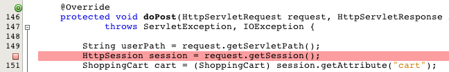

要开启/关闭编辑器的行号，请右键单击左旁注，然后选择 "Show Line Numbers"（显示行号）。

[start=6]
. 运行调试器。单击 IDE 主工具栏中的 "Debug Project"（调试项目）(image:images/debug-project-btn.png[]) 按钮。GlassFish Server 启动（或者如果已在运行，则重新启动）并在其调试端口号上打开一个套接字。应用程序欢迎页在浏览器中打开。 

可以在 "Servers"（服务器）窗口（通过 "Tools"（工具）> "Servers"（服务器）打开）中查看和修改调试端口号。为所使用的服务器选择 "Java" 标签。在 "Debug Settings"（调试设置）下方的 "Address to use"（要使用的地址）字段中指定端口号。

[start=7]
. 当浏览器中出现应用程序的欢迎页时，单击任意类别图像导航至类别页。请回忆一下，单击 "add to cart" 按钮将向服务器发送 `addToCart` 请求：

[source,java]
----

<form action="addToCart" method="post">
----
可以回忆一下link:page-views-controller.html#controller[+准备页面视图和控制器 Servlet+] 的内容，就会想起 `ControllerServlet` 的 `doPost` 方法可以处理 `/addToCart` URL 模式的请求。因此可能期望在用户单击 "add to cart" 按钮时，调用 `doPost` 方法。

[start=8]
. 在类别页中对任意产品单击 "add to cart"。切换回 IDE，注意到调试器在断点处挂起。 

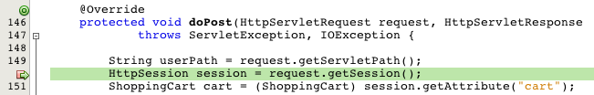

[start=9]
. 将光标放在 `getSession()` 的调用上，然后按 Ctrl-空格键来调用 Javadoc 文档。

image::images/javadoc-getsession.png[title="按 Ctrl-空格键可调用 Javadoc 文档"] 

根据文档，`getSession()` 返回当前与请求相关联的 `HttpSession`，如果会话不存在，该方法将创建一个新的会话对象。 

=== 利用 IDE 的 Javadoc 支持

IDE 为 Java EE 开发提供内置的 Javadoc 支持。IDE 捆绑了 Java EE 6 API 规范，可以通过选择 "Help"（帮助）> "Javadoc References"（Javadoc 引用）> "Java EE 6" 在外部浏览器中打开该规范。

IDE 还包括其他各种用于轻松访问 API 文档的功能：

* *"Javadoc" 窗口：*选择 "Window"（窗口）> "Other"（其他）> "Javadoc"。"Javadoc" 窗口在 IDE 的底部区域中打开，并显示与编辑器中光标位置相关的 API 文档。
* *Javadoc 索引搜索：*选择 "Help"（帮助）> "Javadoc Index Search"（Javadoc 索引搜索）（Shift-F1 组合键；在 Mac 上为 fn-Shift-F1 组合键）。键入要查找的类名称，然后从列出的结果中选择一个类。在窗口的底部窗格中将显示来自 API 规范的完整类描述。
* *编辑器中的文档弹出式窗口：*当您在编辑器中的某个给定元素上按 Ctrl-空格键时，会在一个弹出式窗口中显示 Javadoc 文档。单击 "External Browser"（外部浏览器）(image:images/external-browser-btn.png[]) 按钮即可在浏览器中打开文档。如果希望 Ctrl-空格键仅用于代码完成，可以取消激活文档弹出式窗口，方法是打开 "Options"（选项）窗口（"Tools"（工具）> "Options"（选项）；在 Mac 上为 "NetBeans" > "Preferences"（首选项）），然后选择 "Editor"（编辑器）> "Code Completion"（代码完成）。取消选择 "Auto Popup Documentation Window"（自动弹出式文档窗口）选项。

在用文档记录自己的工作时，可考虑将 Javadoc 注释添加到类和方法中。打开 `ShoppingCart` 类，然后检查添加到类方法中的 Javadoc 注释。Javadoc 注释通过 `/** ... */` 分隔符进行标记。例如，`addItem` 方法在其签名前面有以下注释：

[source,xml]
----

/**
 * Adds a <code>ShoppingCartItem</code> to the <code>ShoppingCart</code>'s
 * <code>items</code> list. If item of the specified <code>product</code>
 * already exists in shopping cart list, the quantity of that item is
 * incremented.
 *
 * @param product the <code>Product</code> that defines the type of shopping cart item
 * @see ShoppingCartItem
 */
public synchronized void addItem(Product product) {
----

这可使您（以及其他参与项目的人）能够查看有关该方法的 Javadoc 文档。要进行演示，请打开 "Navigator"（导航器）（Ctrl-7；在 Mac 上为 ⌘-7），后将鼠标悬停在 `addItem` 方法上。

image::images/javadoc-additem.png[title="在导航器中将鼠标悬停在方法上可查看 Javadoc 文档"]

还可以使用 IDE 生成一组 Javadoc HTML 页。在 "Projects"（项目）窗口中右键单击项目节点，然后选择 "Generate Javadoc"（生成 Javadoc）。IDE 在项目目录下的 `dist/javadoc` 文件夹中生成 Javadoc，并在浏览器中打开索引页。

有关 Javadoc 的更多信息，请参见以下资源：

* link:http://java.sun.com/j2se/javadoc/[+Javadoc 工具官方主页+]
* link:http://java.sun.com/j2se/javadoc/writingdoccomments/index.html[+如何编写适用于 Javadoc 工具的文档注释+]

[start=10]
. 将鼠标悬停在 `session` 变量上。请注意，调试器在_将要执行的行上_挂起。由 `getSession()` 返回的值尚未保存到 `session` 变量中，这时会显示一个弹出式窗口，指出“`session` 在当前上下文中不是已知变量。”

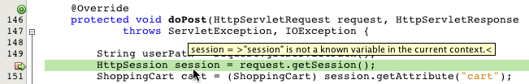

[start=11]
. 在位于编辑器上方的调试器工具栏中单击 "Step Over"（步过）(image:images/step-over-btn.png[]) 按钮。将执行该行，并且调试器执行到文件中的下一行。

[start=12]
. 再次将鼠标悬停在 `session` 变量上。现在，您会看到当前为 `session` 变量设置的值。 
[.feature]
--

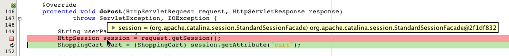

--

在 NetBeans 6.9 中，可在弹出式窗口中单击灰色指针 (image:images/grey-pointer.png[]) 以展开突出显示的元素中包含的变量值列表。

[start=13]
. 单击 "Step Over"（步过）(image:images/step-over-btn.png[]) 按钮（F8 键；在 Mac 上为 fn-F8 组合键）以到达 `if` 语句（第 154 行）。因为刚刚在浏览器中单击了 "add to cart" 按钮，所以表达式 `userPath.equals("/addToCart")` 的值应该为 `true`。

[start=14]
. 突出显示 `userPath.equals("/addToCart")` 表达式（方法是按住 Ctrl 键并单击鼠标）。此时，将看到一个弹出式窗口，其中指示了被突出显示的表达式的值。 

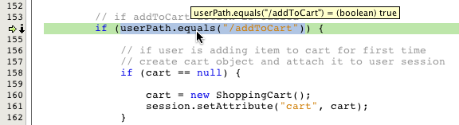

[start=15]
. 按 F8 键（在 Mac 上为 fn-F8 组合键）执行到下一行（第 158 行）。对应用程序进行了设计，以便仅在用户第一次将某个项目添加到购物车中时才创建用户会话的 `ShoppingCart` 对象。由于在此调试会话中，这是第一次收到 `addToCart` 请求，因此可以想到 `cart` 对象的值为`空值`。 

image::images/cart-null.png[title="直到用户将物品添加到购物车后，购物车对象才存在"]

[start=16]
. 按 F8 键（在 Mac 上为 fn-F8 组合键）执行到下一行（第 160 行）。然后，在第 160 行（创建 `ShoppingCart` 对象的位置），单击 "Step Into"（步入）(image:images/step-into-btn.png[]) 按钮。调试器步入正被调用的方法。在这种情况下，将直接转至 `ShoppingCart` 的构造函数。 

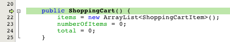

[start=17]
. 按 Ctrl-Tab 组合键以切换回 `ControllerServlet`。请注意，IDE 在第 160 行提供了一个调用堆栈 (image:images/call-stack-badge.png[]) 标记，指出调试器当前在调用堆栈中较高级方法上的某个位置挂起。

按 Alt-Shift-3 组合键（在 Mac 上为 Ctrl-Shift-3 组合键），以打开 IDE 的 "Call Stack"（调用堆栈）窗口。

[start=18]
. 按 F8 键（在 Mac 上为 fn-F8 键）以继续逐步执行代码。当调试器完成 `ShoppingCart` 构造函数时，将转回至 `ControllerServlet`。

`ControllerServlet` 的第 161 行将新创建的 `cart` 对象绑定到会话。

[source,java]
----

session.setAttribute("cart", cart);
----
要查看这一结果，请打开调试器的 "Variables"（变量）窗口。选择 "Window"（窗口）> "Debugging"（调试）> "Variables"（变量），或者按 Alt-Shift-1 组合键（在 Mac 上为 Ctrl-Shift-1 组合键）。
[.feature]
--

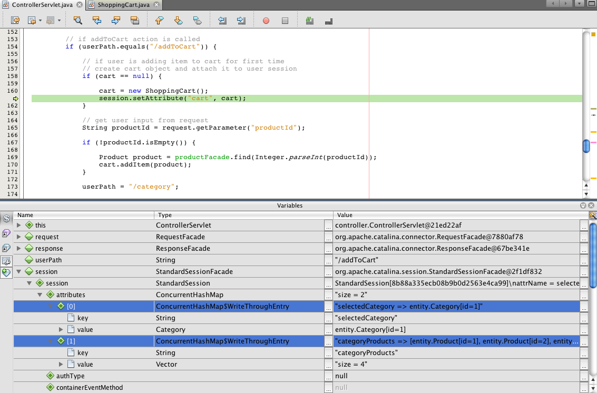

--
 
如果展开 "session" > "session" > "attributes" 节点，可以查看绑定到会话的对象。在上面的图像中，当前有两个项目被绑定到会话（突出显示）。它们是 `selectedCategory` 和 `categoryProducts`，分别在 `ControllerServlet` 中的第 83 和 89 行进行实例化。之前单击类别图像时就绑定了这两个项目，并且 `ControllerServlet` 对类别页请求进行了处理。

[start=19]
. 按 F8 键（在 Mac 上为 fn-F8 组合键）以执行第 161 行。`cart` 对象将被绑定到会话，"Variables"（变量）窗口将更新以反映更改。在 "Variables"（变量）窗口中，请注意现在会话包含了三个属性，其中第三个就是新初始化的 `ShoppingCart` 对象（在下面被突出显示）。 
[.feature]
--

image::images/variables-win-session-cart.png[role="left", link="images/variables-win-session-cart.png"]

--
 

到目前为止，我们还没有“证明”在 "Variables"（变量）窗口中列出的会话代表 `HttpSession`。正如前面所提到的，`HttpSession` 其实是一个接口，所以当提到 `HttpSession` 对象或者会话对象时，实际上指的是实现 `HttpSession` 接口的任何对象。在 "Variables"（变量）窗口中，如果将光标悬停在 "`session`" 上，将出现一个弹出式窗口，指出该变量代表某个 `HttpSession` 对象。`StandardSessionFacade` 类型正如所显示的，是 GlassFish 用来实现 `HttpSession` 接口的内部类。如果对 Tomcat 比较熟悉，而对显示在 "Value"（值）列中的 "`org.apache.catalina`" 路径感到比较困惑，这是因为 GlassFish web/servlet 容器实际上是 Apache Tomcat 容器的派生物。

在会话中添加新的 `ShoppingCart`，并继续处理请求。为了完成 "add to cart" 功能的实现，请执行以下操作：
* 从请求中检索选定产品的 ID（第 165 行）
* 使用 ID 创建 `Product` 对象（第 169 行）
* 使用 `product` 创建新的 `ShoppingCartItem`（第 170 行）
* 将 `ShoppingCartItem` 添加到 `ShoppingCart` 的 `items` 列表中（第 170 行）

[start=20]
. 按 F8 键（在 Mac 上为 fn-F8 键）继续执行代码，同时留意上面列出的四个操作。当调试器在第 170 行上挂起时挂起。

[start=21]
. 在会话上创建监视。这样可以在步入下一步中的 `addItem` 方法中时查看包含在会话中的值。右键单击 "Variables"（变量）窗口中的会话，然后选择 "Create Fixed Watch"（创建固定监视）。 

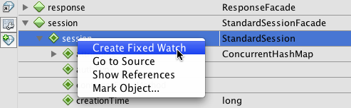

此外，也可以在编辑器中将光标放在 `session` 变量上，然后右键单击并选择 "New Watch"（新建监视）。利用 "New Watch"（新建监视）对话框，可以在调试应用程序时指定要监视的变量或表达式。（如果是表达式的话，先突出显示该表达式，然后右键单击并选择 "New Watch"（新建监视）。） 

image::images/new-watch-dialog.png[title="在编辑器中右键单击变量和表达式，然后选择 "]

将创建对 `session` 变量及其包含的所有变量的新监视。可在 "Watches"（监视）窗口（"Window"（窗口）> "Debugging"（调试）> "Watches"（监视））中查看监视；或者，如果开启 "Variables"（变量）窗口左旁注中的 "Watches"（监视）(image:images/watch-btn.png[]) 按钮，则监视会显示在 "Variables"（变量）窗口的最上方一行中。

使用调试器可以在执行代码时观察变量。这在下面的情况中很有用，例如，要跟踪对特定变量值的更改（而并不需要查看在执行每一步时 "Variables"（变量）窗口中显示的整个列表），或者临时步入的某个类不包含您感兴趣的变量。

[start=22]
. 单击 "Step Into"（步入）(image:images/step-into-btn.png[]) 按钮以步入 `ShoppingCart` 的 `addItem` 方法。

[start=23]
. 逐步执行 `addItem` 方法直到第 53 行。正如 Javadoc 中说明的，`addItem`“将 `ShoppingCartItem` 添加到 `ShoppingCart` 的 `items` 列表中。如果指定的 `product` 的项目已经存在于购物车列表中，该项目的数量将增加”。

[start=24]
. 检查对其创建了监视的 `session` 变量（上面的<<step21,步骤 21>>）。第 51 行中的 `items.add(scItem)` 语句将新的 `ShoppingCartItem` 添加到 `ShoppingCart` 中的 `items` 列表中。通过更进一步地浏览会话中包含的第三个属性（即 `cart` 变量），这就显而易见了。
[.feature]
--

image::images/variables-window-add-item.png[role="left", link="images/variables-window-add-item.png"]

--
 
在此阶段，可以看到如何针对请求创建 `HttpSession`、如何创建 `ShoppingCart` 对象并将其连接到会话、如何根据用户的产品选择创建 `ShoppingCartItem` 然后将其添加到 `ShoppingCart` 的 `items` 列表中。剩下的唯一操作就是将请求转发到 `category.jsp` 视图。

[start=25]
. 在编辑器中打开标题 JSP 片段 (`header.jspf`)，然后在第 86 行上设置一个断点。该行包含了用于显示购物车项目数的购物车窗口部件中的 EL 语句。 

image::images/breakpoint-jsp.png[title="您可以在 JSP 页中挂起调试器"]

[start=26]
. 单击调试器工具栏中的 "Continue"（继续）(image:images/continue-btn.png[]) 按钮。调试器将继续直到执行完成，或者直到遇到另一个断点。在这种情况下，调试器在标题 JSP 片段中的第 86 行上挂起。 

*注：*为了在 JSP 页中挂起调试器，需要设置断点。例如，当 `ControllerServlet` 将请求转发到相应的视图时，调试器不会在 JSP 页中自动挂起。

[start=27]
. 打开 "Variables"（变量）窗口（Alt-Shift-1 组合键；在 Mac 上为 Ctrl-Shift-1 组合键）（如果尚未打开）。与 Java 类不同，在将鼠标悬停在 JSP 页中的变量或表达式上时，调试器_不会_提供工具提示。但是，使用 "Variables"（变量）窗口可以在逐步执行代码时确定变量的值。那么，在哪儿可以找到 `${cart.numberOfItems}` 的值？

[start=28]
. 在 "Variables"（变量）窗口中，展开 "Implicit Objects"（隐式对象）> "pageContext" > "session" > "session" > "attributes" 节点。这将提供对会话对象的访问，正如之前使用 `ControllerServlet` 时所看到的。实际上，可能注意到在上面的步骤 21 中对其创建了监视的会话恰好指向同一个对象。在此可以验证 `${cart.numberOfItems}` 的值等于 "`1`"。 
[.feature]
--

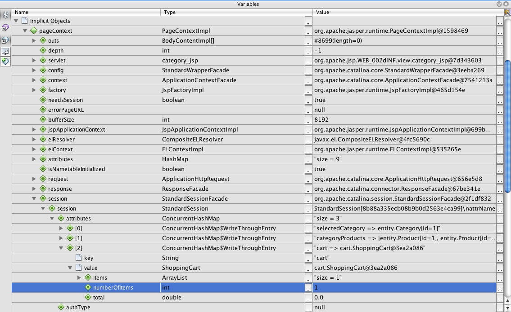

--

最大化 "Variables"（变量）窗口，或 IDE 中的任何窗口，方法是右键单击窗口标题，然后选择 "Maximize"（最大化窗口）（Shift-Esc 组合键）。

使用调试器可以访问 `pageContext` 隐式对象。`pageContext` 代表 JSP 页的上下文，并提供对各种对象的直接访问，其中包括 `HttpServletRequest`、`HttpSession` 和 `ServletContext` 对象。有关详细信息，请参见 link:http://java.sun.com/javaee/5/docs/tutorial/doc/bnahq.html#bnaij[+Java EE 5 教程：隐式对象+]。

[start=29]
. 单击 "Finish Session"（完成会话）(image:images/finish-session-btn.png[]) 按钮。运行时完成执行过程，调试会话终止。浏览器显示一个完全呈现的类别页，可以看到页面标题中的购物车窗口部件包含了一个项目。

希望您现在能够非常熟练地使用 IDE 的调试器，不仅可以在项目运行不正常时检查该项目，还可以用作为进一步熟悉代码的工具。调试器工具栏中其他有用的按钮包括：

* (image:images/step-out.png[]) *Step Out*（步出）：步出当前方法调用。执行并删除调用堆栈中最顶层的方法调用。
* (image:images/run-to-cursor.png[]) *Run to Cursor*（运行至光标位置）：一直执行到放置光标的行。
* () *Apply Code Changes*（应用代码更改）：在编辑文件后，可以按此按钮，以便重新编译文件并将所做的更改考虑到调试会话中。
* (image:images/step-over-expression.png[]) *Step Over Expression*（步过表达式）：使您可以查看表达式中每次方法调用的输入参数和生成的输出值。您可以在 "Local Variables"（局部变量）窗口中检查上一个方法的输出值以及下一个方法的输入参数。当不再执行方法调用时，"Step Over Expression"（步过表达式）的行为类似于 "Step Over"（步过）(image:images/step-over-btn.png[]) 命令。

[[session-track]]
== 检查会话跟踪选项

跟踪客户端和服务器之间的会话有三种传统方式。到目前为止，最常用的方式是使用 cookie。如果不支持或者禁用 cookie，可以应用 URL 重写。隐藏的窗体字段还可用作针对多个请求来“保持状态”的手段，但是这些字段仅限在窗体内使用。

`AffableBean` 项目在类别页和购物车页中包括一个隐藏字段方法的示例。针对产品项目所显示的 "add to cart" 和 "update" 按钮包括一个隐藏字段，当单击这些按钮时，该字段会将产品 ID 传递到服务器。如果在编辑器中打开 `cart.jsp` 页，将看到 `<form>` 标记包含一个隐藏字段。

[source,xml]
----

<form action="updateCart" method="post">
    *<input type="hidden"
           name="productId"
           value="${product.id}">*
    ...
</form>
----

在这种方式下，产品 ID 作为请求参数来发送，服务器使用该参数来标识用户购物车中其数量需要修改的项目。

Servlet API 为管理会话提供了一种高级机制。实际上，它通过每一个请求-响应周期在客户端和服务器之间传递 cookie。如果客户端浏览器不接受 cookie，Servlet 引擎将自动转换为 URL 重写。下面的两个练习演示了此功能。

* <<http-monitor,使用 HTTP 监视器检查客户端和服务器之间的通信>>
* <<url-rewrite,使用 URL 重写维护会话>>

[[http-monitor]]
=== 使用 HTTP 监视器检查客户端和服务器之间的通信

默认情况下，Servlet 引擎使用 cookie 来维护和标识请求之间的会话。将为每个会话对象生成一个随机的字母数字编号，作为唯一标识符。此标识符将作为 "`JSESSIONID`" cookie 传递到客户端。当客户端发出请求时，Servlet 引擎读取 `JSESSIONID` cookie 的值以确定该请求所属的会话。

为了演示这种情况，我们将调试器和 IDE 的 HTTP 监视器一起使用。

1. 从激活正在使用的服务器的 HTTP 监视器开始。选择 "Tools"（工具）> "Servers"（服务器）。在 "Servers"（服务器）窗口的左列中，选择正在使用的服务器 (GlassFish)。然后，在主列中，选择 "Enable HTTP Monitor"（启用 HTTP 监视器）选项。 

image::images/servers-win-http-monitor.png[title="选择 "]

[start=2]
. 如果服务器已经在运行了，则需要重新启动它。不过，由于我们打算使用调试器，并且运行调试器会重新启动服务器以在其他端口上通信，因此只需在 IDE 的主工具栏中单击 "Debug Project"（调试项目）(image:images/debug-project-btn.png[]) 按钮即可。将重新启动服务器，开始一个调试会话，并在浏览器中打开应用程序的欢迎页。HTTP 监视器显示在 IDE 的底部区域中。 

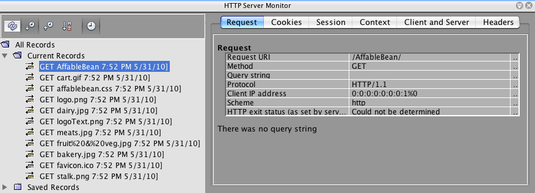

[start=3]
. 单击左列中的 AffableBean 记录（如上图所示）。在选择左列中的记录时，右列（即主列）将刷新以显示相应的数据。在上图中，"Request"（请求）标签显示了请求的 URI (`/AffableBean/`) 和 HTTP 方法 (`GET`)，并指出没有任何查询字符串随请求发送。

[start=4]
. 选择 "Session"（会话）标签。请注意这句话，"The session was created as a result of this request."（由于该请求而创建了会话。）这是因为服务器在其响应中为 `JSESSIONID` cookie 发送了一个 `Set-Cookie` 标题。还请注意，新的会话 ID 列在 "Session properties"（会话属性）下面。下面您还将了解到，会话 ID 是 `JSESSIONID` cookie 的值。

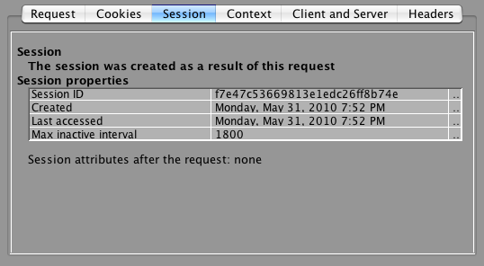 

您可能想知道如何通过对站点欢迎页的请求来创建会话对象。毕竟，`ControllerServlet` 不处理对于 `/AffableBean/` 的初始请求，并且该请求在任何地方都不会遇到 `getSession()`。确实如此吗？请回想一下，在进行部署时，JSP 页被编译成 Servlet。在将项目部署到服务器之后，实际上可以使用 IDE 查看服务器上 JSP 的已编译 Servlet。

[start=5]
. 在 "Projects"（项目）窗口中，右键单击 `index.jsp` 文件，然后选择 "View Servlet"（查看 Servlet）。`index_jsp.java` 文件在编辑器中打开。这就是由 `index.jsp` 页自动编译的 Servlet。

[start=6]
. 在文件中搜索 `getSession`。按 Ctrl-F 组合键（在 Mac 上为 ⌘-F 组合键），在搜索栏中键入 "`getSession`"，然后按 Enter 键。 

Ctrl-F 组合键（在 Mac 上为 ⌘-F 组合键）是 "Edit"（编辑）> "Find"（查找）的快捷键。

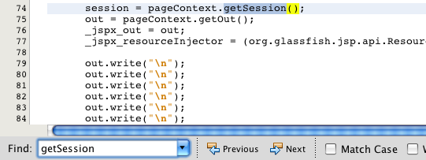 

实际上调用了 `getSession` 方法。发生这种情况的原因是因为 JSP 页在默认情况下包括 `pageContext.session` 隐式对象。如果要取消激活此行为，可以将以下指令添加到 JSP 文件的顶部：

[source,java]
----

<%@page session="false" %>
----
会删除已编译 Servlet 中的 `getSession` 方法。 

要在服务器上找到已编译 Servlet 的位置，可以将鼠标悬停在编辑器上方的 Servlet 的名称标签上。弹出式窗口将显示计算机上文件的路径。

[start=7]
. 在浏览器中，选择一个类别，然后将一个项目添加到购物车中。切换回 IDE。请注意，调试器在 `ControllerServlet` 中之前设置的断点处（第 150 行）挂起。会话之间的所有断点都被记住。要删除断点，可在编辑器的左旁注中单击断点 (image:images/breakpoint-badge.png[]) 标记。然而，由于在项目中已经设置了多个断点，因此可以打开调试器的 "Breakpoints"（断点）窗口（"Window"（窗口）> "Debugging"（调试）> "Breakpoints"（断点））。

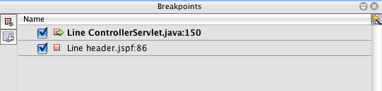 

从 Breakpoints"（断点）窗口中，可以在 IDE 中打开的项目中设置的所有断点上查看和调用操作。

[start=8]
. 右键单击 `header.jspf` 中设置的断点，选择 "Delete"（删除）。然后右键单击 `ControllerServlet` 中设置的断点并选择 "Disable"（禁用）。（稍后将在本练习中重新启用该断点。）

[start=9]
. 单击 "Continue"（继续）(image:images/continue-btn.png[]) 按钮。请求完成执行，在浏览器中显示类别页，并向购物车中添加了一个项目。

[start=10]
. 在 HTTP 监视器的左列中搜索 `addToCart` 请求，然后选择该请求以在主列中显示详细信息。 

单击 "Ascending Sort"（升序排序）(image:images/ascending-sort-btn.png[]) 按钮，使最近的记录列在最上方。

在 "Request"（请求）标签的下面，注意请求的 URI (`/AffableBean/addToCart`)、HTTP 方法 (`POST`) 以及请求参数（`productId` 和 `submit`）。 
[.feature]
--

image::images/http-monitor-add-to-cart.png[role="left", link="images/http-monitor-add-to-cart.png"]

--

[start=11]
. 选择 "Cookie" 标签。在此处会看到存在一个名为 `JSESSIONID` 的 cookie，从客户端发送至服务器。请注意，cookie 的值与 "Session"（会话）标签下显示的会话 ID 相同。

image::images/cookies-tab.png[title="Cookie 显示在 HTTP 监视器中的 "] 

类似地，如果单击 "Header"（标头）标签，将看到列出的 cookie，这是因为 "`Cookie`" 是客户端发送的请求标头。 

image::images/headers-tab.png[title="Cookie 显示在 HTTP 监视器中的 "]

有关请求和响应标头的详细信息，请参见维基百科的 link:http://en.wikipedia.org/wiki/List_of_HTTP_headers[+HTTP 标头列表+]。

[start=12]
. 选择 "Session"（会话）标签。有一条语句表明，"The session existed before this request."（会话在此请求前已存在。）还请注意，`cart` 属性列在 "Session attributes after the request"（请求后的会话属性）下面。这是有道理的，因为我们知道在第一次处理 `addToCart` 请求时，会将 `cart` 对象绑定到会话。

image::images/session-tab-add-to-cart.png[title="会话属性显示在 HTTP 监视器中的 "] 

在接下来的几步中，请在 "Variables"（变量）窗口找到会话 ID 和 `JSESSIONID` cookie。

[start=13]
. 重新启用之前在 `ControllerServlet` 中设置的断点。按 Alt-Shift-5 组合键（在 Mac 上为 Ctrl-Shift-5 组合键），以打开 "Breakpoints"（断点）窗口，然后单击断点条目旁边的复选框以重新启用该断点。

[start=14]
. 在浏览器中，对列出的其中一个产品单击 "add to cart" 按钮。

[start=15]
. 切换到 IDE 并请注意，调试器在 `ControllerServlet` 中设置的断点处挂起。单击 "Step Over"（步过）(image:images/step-over-btn.png[]) 按钮，以便将 `session` 变量指定给会话对象。

[start=16]
. 打开 "Variables"（变量）窗口（Alt-Shift-1 组合键；在 Mac 上为 Ctrl-Shift-1 组合键），展开 "session" > "session"。此时将发现会话 ID 以 `id` 变量值的形式列出。

[start=17]
. 要找到 `JSESSIONID` cookie，请回想一下，可以通过调用 `HttpServletRequest` 上的 link:http://java.sun.com/webservices/docs/1.6/api/javax/servlet/http/HttpServletRequest.html#getCookies%28%29[+`getCookies`+] 方法来正常访问 Servlet 中的 cookie。因此，请向下浏览到请求对象："request" > "Inherited"（已继承）> "request" > "request" > "Inherited"（已继承）> "cookies"。在此处可以看到 `cookies` ArrayList。如果展开列表，将看到 `JSESSIONID` cookie，其值就是会话 ID。

[start=18]
. 单击 "Finish Session"（完成会话）(image:images/finish-session-btn.png[]) 按钮以终止调试会话。

[[url-rewrite]]
=== 使用 URL 重写维护会话

如已经提到的，Servlet 引擎检测客户端浏览器是否支持 cookie，如果不支持，将切换到 URL 重写以作为维护会话的手段。所有这些对客户端都是透明的。对于开发者而言，该过程并不完全透明。

需要确保当禁用 cookie 时，应用程序能够重写 URL。为此，请在应用程序中对 Servlet 返回的所有 URL 调用响应的 `encodeURL` 方法。这样做可以在无法使用 cookie 时，将会话 ID 附加到 URL 中；否则，它将返回未更改的 URL。

例如，浏览器发送对于 `AffableBean` 中第三个类别 (bakery) 的请求：`category?3`。服务器使用 URL 中包含的会话 ID 进行响应：

[source,java]
----

/AffableBean/category*;jsessionid=364b636d75d90a6e4d0085119990*?3
----

如上所述，_必须对应用程序中 Servlet 返回的所有 URL 进行编码_。请记住，JSP 页将被编译成 Servlet。如何在 JSP 页中对 URL 进行编码？JSTL 的 link:http://java.sun.com/products/jsp/jstl/1.1/docs/tlddocs/c/url.html[+`<c:url>`+] 标记可实现此目的。以下练习演示出现的问题和解决方案。

1. 在浏览器中临时禁用 cookie。如果使用的是 Firefox，可以选择 "Tools"（工具）> "Options"（选项）（在 Mac 上为 "Firefox"（Firefox）> "Preferences"（首选项））。在显示的窗口中，选择 "Privacy"（隐私）标签，然后在 "History"（历史）下面提供的下拉列表中选择 "Use custom settings for history"（使用定制历史记录设置）。取消选择 "Accept cookies from sites"（接受自站点的 cookie）选项。 

image::images/firefox.png[title="在浏览器中临时禁用 cookie"]

[start=2]
. 运行 `AffableBean` 项目。当显示欢迎页时，单击进入某个类别，然后尝试将项目添加到购物车中。将看到应用程序的功能在当前状态下被严重削弱。

image::images/compromised.png[title="当客户端不接受 Cookie 时，应用程序的功能会被削弱"] 

和以前一样，服务器生成会话并将对象绑定到该会话。这样，类别页就可以显示所选的类别和产品。但是，服务器在尝试设置 `JSESSIONID` cookie 时失败了。因此，当客户端发出第二次请求时（当用户单击 "add to cart" 时），服务器无法识别该请求所属的会话。因而服务器无法找到之前在会话中设置的任何属性，例如 `selectedCategory` 和 `categoryProducts`。这就是呈现的响应缺少由这些属性指定的信息的原因。

[start=3]
. 在编辑器中打开项目的 `category.jsp` 页。找到实现 "add to cart" 按钮的代码行（第 58 行）。`<form>` 元素的 `action` 属性决定了发送到服务器的请求。

[source,java]
----

<form action="addToCart" method="post">
----

[start=4]
. 修改请求以便通过 `<c:url>` 标记来传递该请求。

[source,java]
----

<form action="*<c:url value='addToCart'/>*" method="post">
----

[start=5]
. 按 Ctrl-S 组合键（在 Mac 上为 ⌘-S）将更改保存到文件。请回想一下，IDE 提供了“在保存时部署”功能，默认情况下该功能处于启用状态。这意味着任何已保存的更改将自动部署到服务器。

[start=6]
. 在浏览器中，选择其他类别以便应用程序呈现新修改的类别页。

[start=7]
. 检查该页的源代码。在 Firefox 中，可以按 Ctrl-U 组合键（在 Mac 上为 ⌘-U 组合键）。将为每一个产品显示 "add to cart" 按钮，并将其会话 ID 附加到 URL。

[source,java]
----

<form action="addToCart*;jsessionid=4188657e21d72f364e0782136dde*" method="post">
----

[start=8]
. 对任一项目单击 "add to cart" 按钮。您将看到现在服务器可以确定请求所属的会话，并且可以正确地呈现响应。

[start=9]
. 在继续往下进行之前，请确保为浏览器重新启用 cookie。

再有，用户能够在应用程序（其响应需要某种形式的与会话相关的数据）中单击的每一个链接都需要进行正确地编码。有时，实现并不像上面显示的示例那样直接。例如，在单击链接时，`cart.jsp` 中使用的 "clear cart" 窗口部件当前会将 `clear` 参数设置为 `true`。

[source,xml]
----

<%-- clear cart widget --%>
<c:if test="${!empty cart &amp;&amp; cart.numberOfItems != 0}">
    <a href="viewCart*?clear=true*" class="bubble hMargin">clear cart</a>
</c:if>
----

可以通过以下方式将 `<c:url>` 标记应用于 URL：

[source,xml]
----

<%-- clear cart widget --%>
<c:if test="${!empty cart &amp;&amp; cart.numberOfItems != 0}">

    *<c:url var="url" value="viewCart">
        <c:param name="clear" value="true"/>
    </c:url>*

    <a href="*${url}*" class="bubble hMargin">clear cart</a>
</c:if>
----

通过在 `<c:url>` 标记之间添加一个 `<c:param` 标记来设置 `clear=true` 参数。使用 <c:url> 的 `var` 属性来设置一个名为 "`url`" 的变量，然后在 HTML 锚点标记中使用 `${url}` 表达式来访问 `var`。

可以下载并检查link:https://netbeans.org/projects/samples/downloads/download/Samples%252FJavaEE%252Fecommerce%252FAffableBean_snapshot6.zip[+快照 6+] 以查看如何对项目中的所有链接进行编码。

仅当 cookie 不是可用的跟踪方法时，才使用 URL 重写。通常认为 URL 重写不是最佳的解决方案，因为除了浏览器的地址栏之外，还会在日志、书签、参考标头和缓存的 HTML 中公开会话 ID。它还需要更多服务器端的资源，因为服务器需要为每一个传入请求执行附加的步骤，以便从 URL 中提取会话 ID 并将其与现有的会话配对。

[[time-out]]
== 处理会话超时

* <<time-interval,设置会话时间间隔>>
* <<programmatically,以编程方式处理会话超时>>

[[time-interval]]
=== 设置会话时间间隔

应考虑服务器维护会话的最大时间间隔。如果网站收到巨大流量，大量会话可能会消耗服务器的内存容量。因此，可能会为了删除未使用的会话而缩短间隔。另一方面，当然不会希望将会话削减得太短，因为这可能会成为对网站后台业务产生负面影响的可用性问题。以 `AffableBean` 应用程序为例，某个用户在向她的购物车填充了物品后进行结帐。然后，她意识到需要输入信用卡详细信息，于是离开去找她的钱包。在拿着信用卡返回到计算机旁边后，填写结帐窗体并单击“提交”。但是在此期间，她在服务器上的会话已过期。该用户看到她的购物车是空的，并且被重定向到了主页。她真地愿意花时间重新逐步完成此过程吗？

以下步骤演示如何将 `AffableBean` 项目中的会话超时间隔设置为 10 分钟。当然，实际的持续时间最终取决于服务器资源、应用程序的业务目标，以及网站的受欢迎程度。

1. 在编辑器中打开应用程序的部署描述符。按 Alt-Shift-O 组合键（在 Mac 上为 Ctrl-Shift-O 组合键），以使用 IDE 的 "Go to File"（转至文件）对话框。键入 "`web`"，然后单击 "OK"（确定）。

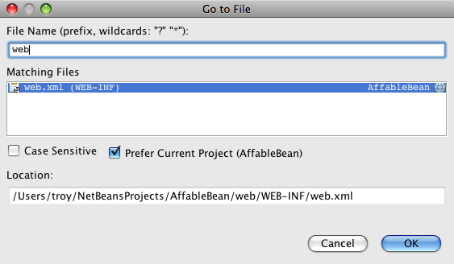 

编辑器在 XML 视图中显示 `web.xml` 文件。NetBeans 为 `web.xml` 文件提供的模板包括一个 30 分钟的默认设置。

[source,xml]
----

<session-config>
    <session-timeout>
        30
    </session-timeout>
</session-config>
----

[start=2]
. 单击 "General"（常规）标签，然后在 "Session Timeout"（会话超时）字段中键入 "`10`"。 

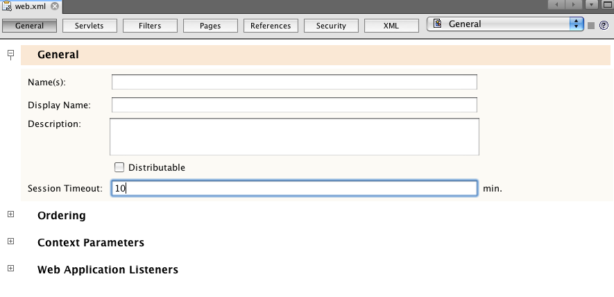

[start=3]
. 保存文件（Ctrl-S；在 Mac 上为 ⌘-S）。

如果切换回 XML 视图，将看到 `<session-timeout>` 元素已经更新。

[source,xml]
----

<session-config>
    <session-timeout>10</session-timeout>
</session-config>
----

*注：*此外，也可以完全删除 `<session-timeout>` 元素，然后编辑 GlassFish 特定的部署描述符 (`sun-web.xml`) 中的 `session-properties` 元素。这会在服务器的 Web 模块中为所有应用程序设置全局超时。有关详细信息，请参见 link:http://docs.sun.com/app/docs/doc/821-1752/beaha[+Oracle GlassFish Server 3.0.1 应用程序开发指南：创建和管理会话+]。

[[programmatically]]
=== 以编程方式处理会话超时

如果应用程序依赖于会话，则需要采取一些措施以确保在收到对已超时或无法识别会话的请求时，它可以正确处理这种情况。可以在 `AffableBean` 应用程序中完成这一点，方法是创建一个简单的过滤器，截取 `ControllerServlet` 的请求标头。该过滤器检查是否存在会话，如果不存在，则会将请求转发到站点的欢迎页。

1. 开始检查在用户访问站点的过程中发生会话超时而引起的问题。临时将会话超时间隔重置为一分钟。打开 Web 部署描述符 (`web.xml`) 然后在 `<session-timeout>` 标记之间输入 "`1`"。

[source,xml]
----

<session-config>
    <session-timeout>*1*</session-timeout>
</session-config>
----

[start=2]
. 运行 `AffableBean` 项目。在浏览器中，单击进入某个类别页，将若干项目添加到购物车中，然后单击 "view cart"。 

image::images/cart-page-session-intact.png[title="购物车页依靠会话对象显示购物车中的物品"]

[start=3]
. 至少等待整一分钟。

[start=4]
. 更新购物车页中显示的任一项目的数量。（可接受 1 到 99 之间的任何数字。）单击 "update"。服务器返回一条 HTTP 状态 500 消息。 

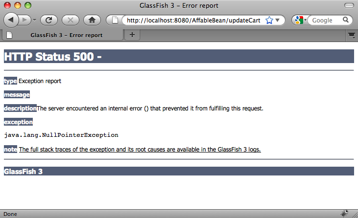

[start=5]
. 在 IDE 中检查 GlassFish Server 日志。打开 "Output"（输出）窗口（Ctrl-4；在 Mac 上为 ⌘-4），然后选择 "GlassFish Server" 标签。滚动至日志的底部，以查看错误的堆栈跟踪。
[.feature]
--

image::images/gf-server-output.png[role="left", link="images/gf-server-output.png"]

--
 
服务器日志表明在 `ControllerServlet` 中的第 184 行上发生了 `NullPointerException`。"Output"（输出）窗口形成了一个链接，指向发生异常错误的代码行。

[start=6]
. 单击该链接。将直接导航至 `ControllerServlet` 中的第 184 行。将鼠标悬停在编辑器左旁注中的错误标记上，会提供一个描述异常错误的工具提示。

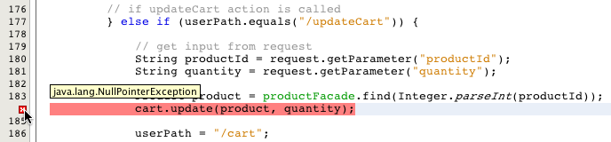 

由于在接收到请求之前会话已过期，所以 Servlet 引擎无法将请求与其相应的会话关联起来。因此，它找不到 `cart` 对象（第 151 行）。当引擎尝试对某个值等于`空值`的变量调用方法时，最终在第 184 行中发生异常错误。

既然我们已查明了问题，让我们通过实现一个过滤器来修复此问题。

[start=7]
. 在 IDE 的工具栏中单击 "New File"（新建文件）(image:images/new-file-btn.png[]) 按钮。（也可以按 Ctrl-N 组合键；在 Mac 上按 ⌘-N 组合键。）

[start=8]
. 选择 *Web* 类别，然后选择 *Filter*（过滤器）并单击 "Next"（下一步）。

[start=9]
. 将过滤器命名为 `SessionTimeoutFilter`。在 "Packages"（包）字段中键入 `filter` 以便在创建过滤器类时将其放入新的包中。

[start=10]
. 单击 "Next"（下一步）。接受默认设置，然后单击 "Finish"（完成）”。`SessionTimeoutFilter` 的模板生成，并在编辑器中打开。 

*注：*当前，在 NetBeans 6.9 中，无法使用向导设置到未在 Web 部署描述符中注册的 Servlet 的映射。（已使用 `@WebServlet` 标注注册了 `ControllerServlet`。）因此，我们将在下一步中修改生成的代码。

[start=11]
. 修改 `@WebFilter` 标注签名以使其如下所示。

[source,java]
----

@WebFilter(*servletNames = {"Controller"}*)
public class SessionTimeoutFilter implements Filter {
----
此代码将过滤器设置为拦截由 `ControllerServlet` 处理的所有请求。（或者，可以保留 `urlPatterns` 属性，并列出 `ControllerServlet` 处理的所有模式。）

请注意，正如在 Servlet 的 `@WebServlet` 标注签名中所指定的，"`Controller`" 是 `ControllerServlet` 的名称。另请注意，已删除了 `filterName` 属性，因为默认情况下使用过滤器类的名称。

IDE 的过滤器模板提供了许多有趣的代码，本身就很值得观摩学习。但是，对于此处的目的而言，其中大多数都不是必需的。任何过滤器类都必须实现 `Filter` 接口，其中定义了三种方法：
* *`init`：*在对过滤器进行初始化之后但在将其放入服务中之前执行任何操作。
* *`destroy`：*从服务中删除过滤器。此方法还可用来执行任何清理操作。
* *`doFilter`：*用来对过滤器拦截的每一个请求执行操作。

使用 Javadoc 索引搜索来提取有关 `Filter` 接口的文档。按 Shift-F1 组合键（在 Mac 上为 fn-Shift-F1），然后在搜索字段中键入 "`Filter`"，并按 Enter 键。选择 "Interface in javax.servlet" 条目。Javadoc 文档将显示在下方的索引搜索工具窗格中。

[start=12]
. 将 `SessionTimeoutFilter` 的主体替换为以下内容。

[source,java]
----

@WebFilter(servletNames = {"Controller"})
public class SessionTimeoutFilter implements Filter {

    *public void doFilter(ServletRequest request, ServletResponse response, FilterChain chain)
            throws IOException, ServletException {

        HttpServletRequest req = (HttpServletRequest) request;

        HttpSession session = req.getSession(false);

        // if session doesn't exist, forward user to welcome page
        if (session == null) {
            try {
                req.getRequestDispatcher("/index.jsp").forward(request, response);
            } catch (Exception ex) {
                ex.printStackTrace();
            }
            return;
        }

        chain.doFilter(request, response);
    }

    public void init(FilterConfig filterConfig) throws ServletException {}

    public void destroy() {}*

}
----

[start=13]
. 按 Ctrl-Shift-I 组合键（在 Mac 上按 ⌘-Shift-I 组合键）以修复 import 语句。（需要对 `HttpServletRequest` 和 `HttpSession` 添加导入。）另外，还可以使用编辑器提示将 `@Override` 标注添加到 `init`、`destroy` 和 `doFilter` 方法中。

在接下来的步骤中，将对项目运行调试器，然后逐步执行 `doFilter` 方法以查看该方法如何确定请求是否已被绑定到某个现有会话。

[start=14]
. 打开 "Breakpoints"（断点）窗口（Alt-Shift-5 组合键；在 Mac 上为 Ctrl-Shift-5 组合键），确保没有设置任何现有的断点。要删除断点，请右键单击该断点，然后选择 "Delete"（删除）。（如果完成了上述练习，<<http-monitor,使用 HTTP 监视器检查客户端和服务器之间的通信>>，则可能在 `ControllerServlet` 中设置了突出显示的断点。）

[start=15]
. 运行调试器。单击 IDE 主工具栏中的 "Debug Project"（调试项目）(image:images/debug-project-btn.png[]) 按钮。

[start=16]
. 当浏览器中显示欢迎页时，请选择某个类别，然后将若干项目添加到购物车中。

[start=17]
. 在 `SessionTimeoutFilter` 中尝试访问会话的 `doFilter` 方法的代码行（第 32 行）上设置一个断点。 

image::images/filter-breakpoint.png[title="对 getSession 方法设置断点"]

[start=18]
. 在浏览器中，单击 "view cart" 按钮。切换到 IDE，并注意到调试器已在断点处挂起。

请回想一下，如果当前没有会话对象，`getSession()` 将创建一个新的会话对象。在这里，我们使用 `getSession(false)` 避免在未找到对象的情况下创建新对象。也就是说，如果会话不存在，该方法将返回`空值`。

[start=19]
. 单击 "Step Over"（步过）(image:images/step-over-btn.png[]) 按钮，然后将鼠标悬停在 `session` 变量上。如果自从发送上一个请求开始还没有过去一分钟，将看到该变量已被指定给 `StandardSessionFacade`。这代表请求的会话对象。 

image::images/session-exists.png[title="将鼠标悬停在变量上可确定其当前值"]

[start=20]
. 继续逐步执行该方法，直到处理请求为止。因为 `session` 不等于`空值`，所以将跳过 `if` 语句和 `chain.doFilter`，然后将请求转发到 `ControllerServlet`（第 44 行）。

[start=21]
. 在浏览器中，请确保过去整一分钟，然后更新购物车中其中一个产品项目的数量。此过程与之前在练习中返回状态 500 消息时所经历的是同一过程。既然过滤器截取了到 `ControllerServlet` 的请求标头，我们来看一下当发生会话超时时会出现什么情况。

[start=22]
. 在单击 "update" 之后，切换到 IDE 并注意到调试器再次在过滤器中设置的断点上挂起。

[start=23]
. 突出显示 `req.getSession(false)` 表达式，然后将鼠标悬停在上面。在这里看到该表达式等于`空值`，因为会话已经过期。 

image::images/session-null.png[title="突出显示表达式，然后将鼠标悬停在表达式上以确定其当前值"]

[start=24]
. 继续逐步执行代码。既然 `session` 变量等于`空值`，则将处理第 35 行的 `if` 语句，并将请求转发到 `/index.jsp`。当调试器完成执行时，将看到浏览器显示站点的欢迎页。

[start=25]
. 单击 "Finish Session"（完成会话）(image:images/finish-session-btn.png[]) 按钮以终止调试会话。

[start=26]
. 打开项目的 `web.xml` 文件，然后将会话超时间隔重新更改为 10 分钟。

[source,xml]
----

<session-config>
    <session-timeout>*10*</session-timeout>
</session-config>
----

[start=27]
. 保存（Ctrl-S；在 Mac 上为 ⌘-S）文件。

link:https://netbeans.org/projects/samples/downloads/download/Samples%252FJavaEE%252Fecommerce%252FAffableBean_snapshot6.zip[+快照 6+] 为您提供了本教程单元中已完成的项目版本。还应当提一下有关会话管理的最后一个主题。可以通过对会话对象调用 `invalidate` 方法来显式终止某个会话。如果不再需要会话，应该将其删除以便节省服务器上的可用内存。完成下一单元（link:transaction.html[+集成事务业务逻辑+]）后，您将了解 `ControllerServlet` 如何在成功处理完客户订单后销毁用户的 `cart` 对象，以及如何使用 `invalidate` 方法终止会话。

[source,java]
----

// if order processed successfully send user to confirmation page
if (orderId != 0) {

    // dissociate shopping cart from session
    cart = null;

    // end session
    session.invalidate();

    ...
}
----

此内容在link:https://netbeans.org/projects/samples/downloads/download/Samples%252FJavaEE%252Fecommerce%252FAffableBean_snapshot8.zip[+项目快照 8+]（以及后面的快照）中进行了介绍。

link:/about/contact_form.html?to=3&subject=Feedback: NetBeans E-commerce Tutorial - Managing Sessions[+请将您的反馈意见发送给我们+]

[[seeAlso]]
== 另请参见

=== NetBeans 资源

* link:../../../../features/java/debugger.html[+NetBeans IDE 功能：调试器+]
* link:../../java/debug-multithreaded.html[+调试多线程应用程序+]
* link:../../java/debug-multithreaded-screencast.html[+使用 NetBeans IDE 进行多线程调试的视频+]
* link:../../java/debug-evaluator-screencast.html[+在 NetBeans 调试器中使用代码片段计算器的视频+]
* link:../../screencasts.html[+NetBeans IDE 6.x 的视频教程和演示+]
* link:https://netbeans.org/projects/www/downloads/download/shortcuts.pdf[+快捷键和代码模板列表+]
* link:../javaee-gettingstarted.html[+Java EE 6 应用程序入门指南+]
* link:../javaee-intro.html[+Java EE 技术简介+]
* link:../../../trails/java-ee.html[+Java EE 和 Java Web 学习资源+]

=== GlassFish 资源

* link:http://wiki.glassfish.java.net/Wiki.jsp?page=Screencasts[+GlassFish 截屏视频+]
* link:https://glassfish.dev.java.net/docs/index.html[+GlassFish v3 文档+]
* link:http://www.sun.com/offers/details/GlassFish_Tomcat.html[+了解针对 Tomcat 用户的 GlassFish+]
* link:http://docs.sun.com/app/docs/doc/821-1751[+Oracle GlassFish Server 3.0.1 管理指南+]
* link:http://docs.sun.com/app/docs/doc/821-1750[+Oracle GlassFish Server 3.0.1 应用程序部署指南+]
* link:http://docs.sun.com/app/docs/doc/821-1752[+Oracle GlassFish Server 3.0.1 应用程序开发指南+]

=== 技术文章和其他资源

* link:http://java.sun.com/javaee/reference/code/[+Java EE 代码样例和应用程序+]
* link:http://java.sun.com/j2se/javadoc/[+Javadoc 工具+] [产品主页]
* link:http://java.sun.com/j2se/javadoc/writingdoccomments/index.html[+如何编写适用于 Javadoc 工具的文档注释+]
* link:http://java.sun.com/products/servlet/Filters.html[+过滤器要点+]
* link:http://java.sun.com/blueprints/corej2eepatterns/Patterns/InterceptingFilter.html[+核心 J2EE 模式 - 截取过滤器+]
* link:http://courses.coreservlets.com/Course-Materials/csajsp2.html[+初级和中级 Servlet、JSP 和 JDBC 教程+]
* link:http://courses.coreservlets.com/Course-Materials/msajsp.html[+高级 Servlet 和 JSP 教程+]
* link:http://courses.coreservlets.com/Course-Materials/java5.html[+Java 5 和 Java 6 教程+]
* link:http://www.ibm.com/developerworks/java/library/j-jstl0211.html[+JSTL 入门，第 1 部分：表达式语言+]
* link:http://www.ibm.com/developerworks/java/library/j-jstl0318/index.html[+JSTL 入门，第 2 部分：深入核心+]
