// 
//     Licensed to the Apache Software Foundation (ASF) under one
//     or more contributor license agreements.  See the NOTICE file
//     distributed with this work for additional information
//     regarding copyright ownership.  The ASF licenses this file
//     to you under the Apache License, Version 2.0 (the
//     "License"); you may not use this file except in compliance
//     with the License.  You may obtain a copy of the License at
// 
//       http://www.apache.org/licenses/LICENSE-2.0
// 
//     Unless required by applicable law or agreed to in writing,
//     software distributed under the License is distributed on an
//     "AS IS" BASIS, WITHOUT WARRANTIES OR CONDITIONS OF ANY
//     KIND, either express or implied.  See the License for the
//     specific language governing permissions and limitations
//     under the License.
//

= The NetBeans E-commerce Tutorial - Preparing the Page Views and Controller Servlet
:jbake-type: tutorial
:jbake-tags: tutorials 
:jbake-status: published
:icons: font
:syntax: true
:source-highlighter: pygments
:toc: left
:toc-title:
:description: The NetBeans E-commerce Tutorial - Preparing the Page Views and Controller Servlet - Apache NetBeans
:keywords: Apache NetBeans, Tutorials, The NetBeans E-commerce Tutorial - Preparing the Page Views and Controller Servlet

== Tutorial Contents

1. xref:intro.adoc[+Introduction+]
2. xref:design.adoc[+Designing the Application+]
3. xref:setup-dev-environ.adoc[+Setting up the Development Environment+]
4. xref:data-model.adoc[+Designing the Data Model+]
5. *Preparing the Page Views and Controller Servlet*
* <<createProjectFiles,Creating Project Files>>
* <<implementHTML,Implementing HTML and CSS content>>
* <<view,Placing JSP Pages in WEB-INF>>
* <<jspf,Creating a Header and Footer>>
* <<dd,Adding a Directive to the Deployment Descriptor>>
* <<controller,Creating the Controller Servlet>>
* <<implement,Implementing the Controller Servlet>>
* <<seeAlso,See Also>>

[start=6]
. xref:connect-db.adoc[+Connecting the Application to the Database+]

[start=7]
. xref:entity-session.adoc[+Adding Entity Classes and Session Beans+]

[start=8]
. xref:manage-sessions.adoc[+Managing Sessions+]

[start=9]
. xref:transaction.adoc[+Integrating Transactional Business Logic+]

[start=10]
. xref:language.adoc[+Adding Language Support+]

[start=11]
. xref:security.adoc[+Securing the Application+]

[start=12]
. xref:test-profile.adoc[+Testing and Profiling+]

[start=13]
. xref:conclusion.adoc[+Conclusion+]

image::../../../../images_www/articles/68/netbeans-stamp-68-69.png[title="Content on this page applies to NetBeans IDE, versions 6.8 and 6.9"]

This tutorial unit demonstrates how to create project files in the IDE, and introduces you to some of the facilities available for HTML and CSS development. After creating necessary project files, you begin organizing the front-end of the application. That is, you'll place JSP files in their proper locations within the project structure, create a header and footer which will be applied to all views, and set up the controller servlet to handle incoming requests.

In this unit, you also create a web deployment descriptor (`web.xml` file) for the application. You can use the deployment descriptor to specify configuration information which is read by the server during deployment. Although the link:http://jcp.org/en/jsr/detail?id=315[+Servlet 3.0 Specification+], included in Java EE 6, enables you to use class annotations in place of XML, you may still require the deployment descriptor to configure certain elements of your application. Specifically, in this unit you add directives for the header and footer and specify which files they will be applied to.

One of the goals of this tutorial unit is to create JSP pages that correspond to the views specified in the application design. Referring back to the xref:design.adoc#mockups[+page mockups+] and xref:design.adoc#business[+process flow diagram+], you begin implementing page layouts according to the mockups by creating _placeholders_ for all visual and functional components. This unit provides a guide for implementing the layout of the welcome page. You can apply the outlined steps to create the other pages on your own, or link:https://netbeans.org/projects/samples/downloads/download/Samples%252FJavaEE%252Fecommerce%252FAffableBean_snapshot1.zip[+download project snapshot 1+], which provides completed layouts for all pages.

You can view a live demo of the application that you build in this tutorial: link:http://services.netbeans.org/AffableBean/[+NetBeans E-commerce Tutorial Demo Application+].

|===
|Software or Resource |Version Required 

|xref:../../../../download/index.adoc[NetBeans IDE] |Java bundle, 6.8 or 6.9 

|link:http://www.oracle.com/technetwork/java/javase/downloads/index.html[+Java Development Kit (JDK)+] |version 6 

|<<glassFish,GlassFish server>> |v3 or Open Source Edition 3.0.1 
|===

*Notes:*

* The NetBeans IDE requires the Java Development Kit (JDK) to run properly. If you do not have any of the resources listed above, the JDK should be the first item that you download and install.
* The NetBeans IDE Java Bundle includes Java Web and EE technologies, which are required for the application you build in this tutorial.
* The NetBeans IDE Java Bundle also includes the GlassFish server, which you require for this tutorial. You could link:http://glassfish.dev.java.net/public/downloadsindex.html[+download the GlassFish server independently+], but the version provided with the NetBeans download has the added benefit of being automatically registered with the IDE.

[[createProjectFiles]]
== Creating Project Files

To create new files for your project, access the IDE's File wizard. You can click the New File ( image:images/new-file-btn.png[] ) button, press Ctrl-N (⌘-N on Mac), or in the Projects window, right-click the folder node that will contain the new file, and choose New > [file-type]. In the following sub-sections, create JSP pages and a stylesheet for the project.

* <<jsp,Creating JSP Pages>>
* <<css,Creating a Stylesheet>>

[[jsp]]
=== Creating JSP Pages

Begin working in the project by creating JSP pages that correspond to the views displayed in the xref:design.adoc#business[+process flow diagram+].

The `index.jsp` page that was generated by the IDE will become the project's welcome page. Create JSP pages for the four remaining views and, for now, place them in the project's webroot with `index.jsp`.

1. Click the New File ( image:images/new-file-btn.png[] ) button to open the File wizard.
2. Select the Web category, then select JSP and click Next.
3. Name the file '`category`'. Note that the Location field is set to `Web Pages`, indicating that the file will be created in the project's webroot. This corresponds to the project's `web` folder, which you can later verify in the IDE's Files window.
4. Click Finish. The IDE generates the new JSP page and opens it in the editor.
5. Repeat steps 1 - 4 above to create the remaining `cart.jsp`, `checkout.jsp`, `confirmation.jsp` pages. 

When you finish, your Projects window will look as follows: 

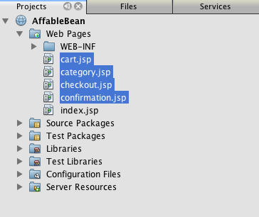

[[css]]
=== Creating a Stylesheet

Create a CSS file to contain all styles specific to the application.

1. In the Projects window, right-click the Web Pages node and choose New > Folder.
2. In the New Folder wizard, name the folder '`css`' and click Finish.
3. Right-click the new `css` folder and choose New > Cascading Style Sheet. (If the Cascading Style Sheet item is not listed, choose Other. In the File wizard, select the Web category, then select Cascading Style Sheet and choose Next.)
4. Name the stylesheet `affablebean`, then click Finish. 

When you finish, you'll see the `affablebean.css` file displayed in your Projects window. 

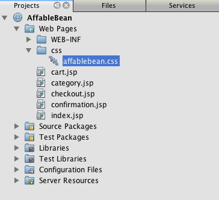

[[implementHTML]]
== Implementing HTML and CSS content

The purpose of this section is to design the page views so that they begin to mirror the provided xref:design.adoc#mockups[+page mockups+]. As such, they'll serve as a scaffolding which you can use to insert dynamic content during later stages of project development. To do so, you'll utilize the IDE's HTML and CSS editors, along with several CSS support windows.

*Browser compatibility note:* This tutorial uses Firefox 3 and _does not_ guarantee that page view markup is compatible with other modern browsers. Naturally, when working with front-end web technologies (HTML, CSS, JavaScript) you would need take measures to ensure that your web pages render properly in the browsers and browser versions that you expect visitors to your site will be using (typically Internet Explorer, Firefox, Safari, Chrome, and Opera). When working in the IDE, you can set the browser you want your application to open in. Choose Tools > Options (NetBeans > Preferences on Mac), and under the General tab in the Options window, select the browser you want to use from the Web Browser drop-down. The IDE detects browsers installed to their default locations. If a browser installed on your computer is not displayed, click the Edit button and register the browser manually.

Preparing the display of your web pages is usually an iterative process which you would fine-tune with regular feedback from the customer. The following steps are designed to introduce you to the facilities provided by the IDE, and demonstrate how to get started using the xref:design.adoc#index[+welcome page mockup+] as an example.

1. In the Projects window, double-click `index.jsp` to open it in the editor.
2. Begin by creating `
` tags for the main areas of the page. You can create five tags altogether: four for main areas (header, footer, left column, and right column), and the fifth to contain the others. Remove any content within the `<body>` tags and replace with the following. (New code is shown in *bold*.)

[source,html]
----

<body>
    *

        

            header
        

        

            left column
        

        

            right column
        

        

            footer
        

    
*
</body>
----

[start=3]
. Add a reference to the stylesheet in the page's head, and change the title text.

[source,xml]
----

<head>
    <meta http-equiv="Content-Type" content="text/html; charset=UTF-8">
    *<link rel="stylesheet" type="text/css" href="css/affablebean.css">*
    <title>*The Affable Bean*</title>
</head>
----

[start=4]
. Open the `affablebean.css` stylesheet in the editor. Begin creating style rules for the `
` IDs you just created.
* Use the `width` and `height` properties to create space for each area.
* Use the `background` property to discern the areas when you view the page.
* In order to horizontally center the four areas in the page, you can include `margin: 20px auto` to the `body` rule. (`20px` applies to the top and bottom; `auto` creates equal spacing to the left and right.) Then include `float: left` to the left and right columns.
* The footer requires `clear: left` so that its top border displays after the bottom borders of any left-floating areas above it (i.e., the left and right columns).

[source,java]
----

body {
    font-family: Arial, Helvetica, sans-serif;
    width: 850px;
    text-align: center;
    margin: 20px auto;
}

#main { background: #eee }

#header {
    height: 250px;
    background: #aaa;
}

#footer {
    height: 60px;
    clear: left;
    background: #aaa;
}

#indexLeftColumn {
    height: 400px;
    width: 350px;
    float: left;
    background: #ccc;
}

#indexRightColumn {
    height: 400px;
    width: 500px;
    float: left;
    background: #eee;
}
----

[start=5]
. Click the Run Project ( image:images/run-project-btn.png[] ) button in the IDE's main toolbar. Project files that contain changes are automatically saved, any Java code in the project compiles, the project is packaged and deployed to GlassFish, and your browser opens to display the current state of the welcome page. 

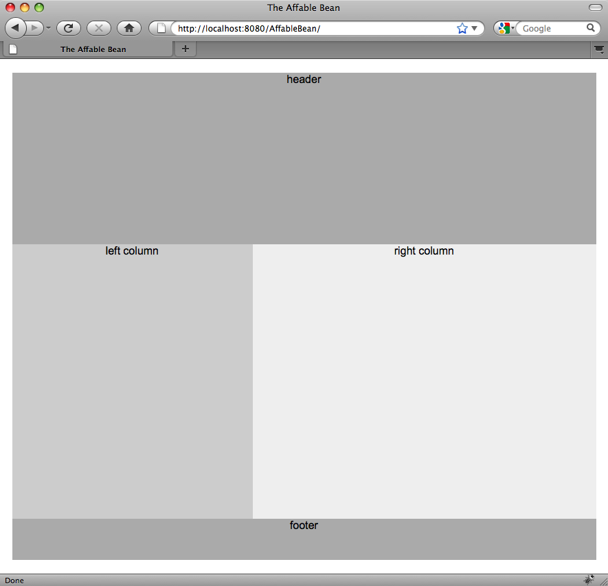

[start=6]
. Now, begin creating placeholders for page components within each of the four visible areas. Start with the header. Reviewing the xref:design.adoc#index[+welcome page mockup+], the header should contain the following components:
* logo
* logo text
* shopping cart widget
* language toggle
Make the following changes to the `index.jsp` file. (New code shown in *bold*.)

[source,html]
----

    *

        

            [ language toggle ]
        

        

            [ shopping cart widget ]
        

    

    

    *

----
In the above code, you use a `
` element to contain the the language toggle and shopping cart widget. 

=== NetBeans HTML Editor Support

When you work in the editor, take advantage of the IDE's HTML support. Aside from typical syntax highlighting that lets you differentiate between tags, attributes, attribute values, and text, there are plenty of other features.

When typing tags and attributes in the editor, you can invoke code-completion and documentation support by pressing Ctrl-Space. The IDE presents a list of suggestions which you can choose from, as well as a documentation window that defines the selected item and provides code examples.

image::images/documentation-popup.png[title="Press Ctrl-Space to view code completion and documentation windows"]

The IDE detects errors in your code and provides you with warnings, error messages, and in some cases, suggestions. Warning messages are displayed in yellow, while errors are shown in red. You can hover your pointer over a designated area to view the message in a tooltip.

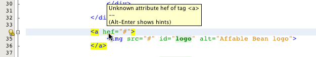

You can also take advantage of numerous keyboard shortcuts. Choose Help > Keyboard Shortcuts Card from the main menu.

[start=7]
. In the stylesheet, create rules for the new IDs and classes. Add the following rules beneath the `header` rule. (New code shown in *bold*.)

[source,java]
----

#header {
    height: 250px;
    background: #aaa;
}

*#logo {
    height: 155px;
    width: 155px;
    float: left;
    margin-left: 30px;
    margin-top: -20px;
}

#logoText {
    float: left;
    margin: 20px 0 0 70px;
    /* font styles apply to text within alt tags */
    font-family: 'American Typewriter', Courier, monospace;
    font-size: 50px;
    color: #333;
}

#widgetBar {
    height: 50px;
    width: 850px;
    float: right;
    background: #ccc;
}

.headerWidget {
    width: 194px;
    margin: 20px 2px;
    font-size: small;
    float: right;
    line-height: 25px;
    background: #aaa;
}*
----
For the `logo` rule, you apply `margin-left` and `margin-top` properties to position the component on the page. 

If there are properties in the above code that you are unfamiliar with, position your cursor on the given property and press Ctrl-Space to invoke a pop-up window that provides documentation support. 

image::images/css-doc-support.png[title="Press Ctrl-Space on a CSS property to invoke documentation support"] 

To see how a property is affecting your page, you can comment it out, then refresh the page in the browser. To comment out code, position your cursor on a line, or highlight a block of code, then press Ctrl-/ (⌘-/ on Mac).

[start=8]
. Save (Ctrl-S; ⌘-S on Mac) the `index.jsp` and `affablebean.css` files, then switch to your browser and refresh the page to view its current state. 

*Note:* The IDE's 'Deploy on Save' facility is automatically activated for Java web projects. This means that every time you save a file, the file is automatically compiled (i.e., if it is a Java class or JSP page) and the project is newly packaged and deployed to your server. Therefore, when you make HTML or CSS changes, you don't need to explicitly rerun the project to view the updated version in a browser. Simply save your file(s), then switch to the browser and refresh the page.

image::images/index-page2.png[title="Placeholders for header are visible when running project"] 

By following the previous steps, you are probably able to see a pattern emerging. For each area on the page, you perform three steps.
1. Create the structure in HTML.
2. Create a set of styles to define the appearance.
3. View the page to examine the results of your changes.
Following these three steps, let's implement the components in the remaining areas.

[start=9]
. Create placeholders for components in the right column. According to the xref:design.adoc#index[+welcome page mockup+], the right column contains four evenly-spaced boxes. 

Create the structure for the four boxes. Insert the following code between the `
` tags. (New code shown in *bold*.)

[source,html]
----

    *

        <a href="#">
            dairy
        </a>
    

    

        <a href="#">
            meats
        </a>
    

    

        <a href="#">
            bakery
        </a>
    

    

        <a href="#">
            fruit &amp; veg
        </a>
    
*

----

[start=10]
. Add style rules to `affablebean.css` for the new `categoryBox` and `categoryLabelText` classes. (New code shown in *bold*.)

[source,java]
----

#indexRightColumn {
    height: 400px;
    width: 500px;
    float: left;
    background: #eee;
}

*.categoryBox {
    height: 176px;
    width: 212px;
    margin: 21px 14px 6px;
    float: inherit;
    background: #ccc;
}

.categoryLabelText {
    line-height: 150%;
    font-size: x-large;
}*
----

=== NetBeans CSS Support

When working in stylesheets, there are two windows that can be particularly helpful. The CSS Preview enables you to view style rules as they are rendered in a browser. To open the CSS Preview, choose Window > Other > CSS Preview from the main menu. When you place your cursor within a style rule in the editor, the CSS Preview automatically refreshes to display sample text according to the properties defined in the rule.

image::images/css-preview.png[title="Use the CSS Preview to view rendered style rules"]

The CSS Style Builder is useful if you do not like to code style rules by hand. To open the CSS Style Builder, choose Window > Other > CSS Style Builder from the main menu. Using this interface, you can construct rules by choosing properties and values from a graphical interface.

image::images/style-builder.png[title="Use the CSS Style Builder to construct style rules"]

Like the CSS Preview, the Style Builder is synchronized with the editor. When you make a selection in the Style Builder, the style rule is automatically updated in the editor. Likewise, when you type changes into the editor, the selections in the Style Builder are instantly updated.

[start=11]
. Save (Ctrl-S; ⌘-S on Mac) the `index.jsp` and `affablebean.css` files, then switch to your browser and refresh the page to view its current state. 

image::images/index-page3.png[title="Placeholders for header and right-column are visible when running project"]

[start=12]
. The left column and footer only require placeholders for static text, so let's implement both simultaneously. 

Insert the following code between the `
` and `
` tags. (New code shown in *bold*.)

[source,html]
----

    *

        
[ welcome text ]

    
*

...

    *

    
[ footer text ]
*

----

[start=13]
. Make changes to the `affablebean.css` stylesheet. It's not necessary to account for all new IDs and classes - you can fine-tune the appearance at a later point when you receive text and images from the customer. 

The horizontal rule (`
`) tag runs the full length of its containing element (`
`. (New code shown in *bold*.)

[source,java]
----

#footer {
    height: 60px;
    *width: 350px;*
    clear: left;
    background: #aaa;
}

*hr {
    border: 0;
    background-color: #333;
    height: 1px;
    margin: 0 25px;
    width: 300px;
}*
----

[start=14]
. Save (Ctrl-S; ⌘-S on Mac) the `index.jsp` and `affablebean.css` files, then switch to your browser and refresh the page to view its current state. 

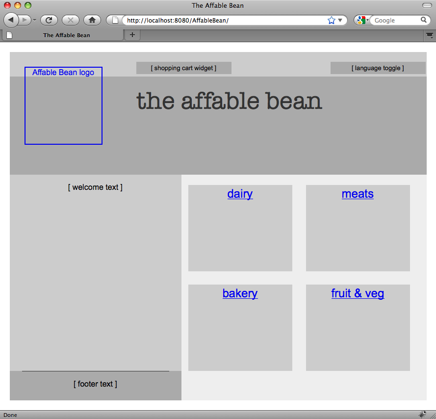 

The welcome page is complete. You've created all necessary placeholders for components that will exist on the page.

You've now completed the initial design of the application's welcome page. All placeholders for page components exist. Later in the tutorial, when you begin to apply dynamic logic to the page views, you can simply plug JSTL and EL expressions into these placeholders.

The task remains for you to implement the initial design for the other pages based on the xref:design.adoc#mockups[+mockups+]. To accomplish this, follow the pattern outlined above, namely:

1. Create `
` tags for the main page areas.
2. Iterate through each area and perform three steps:
.. Create the structure in HTML.
.. Create a set of styles to define the appearance.
.. View the page to examine the results of your changes.

Be sure to take advantage of the HTML and CSS support that the IDE provides for you. Some <<tipsTricks,tips and tricks>> are outlined below. If you just want to grab the code for the remaining pages and proceed with the tutorial, you can link:https://netbeans.org/projects/samples/downloads/download/Samples%252FJavaEE%252Fecommerce%252FAffableBean_snapshot1.zip[+download snapshot 1 of the `AffableBean` project+]. Images of initial mockup implementations for the remaining pages are included here.

[[categoryPage]]
==== category page

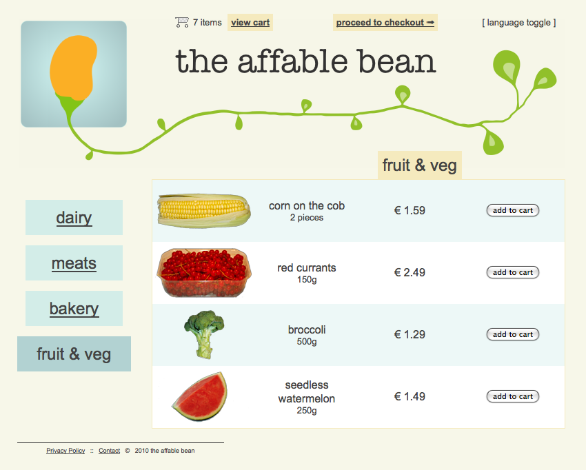 

[[cartPage]]
==== cart page

image::images/cart-page.png[title="Placeholders implemented for cart page"] 

[[checkoutPage]]
==== checkout page

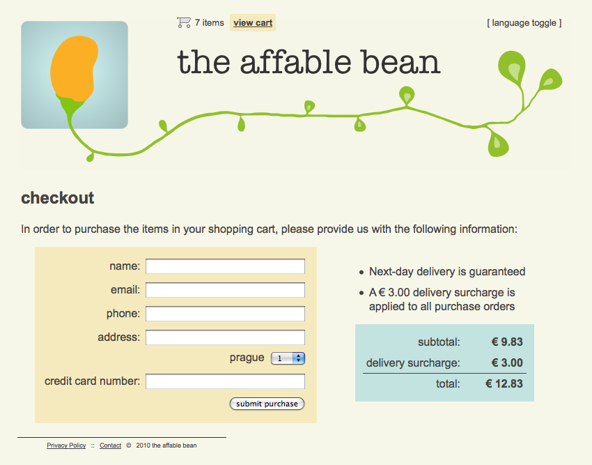 

==== confirmation page

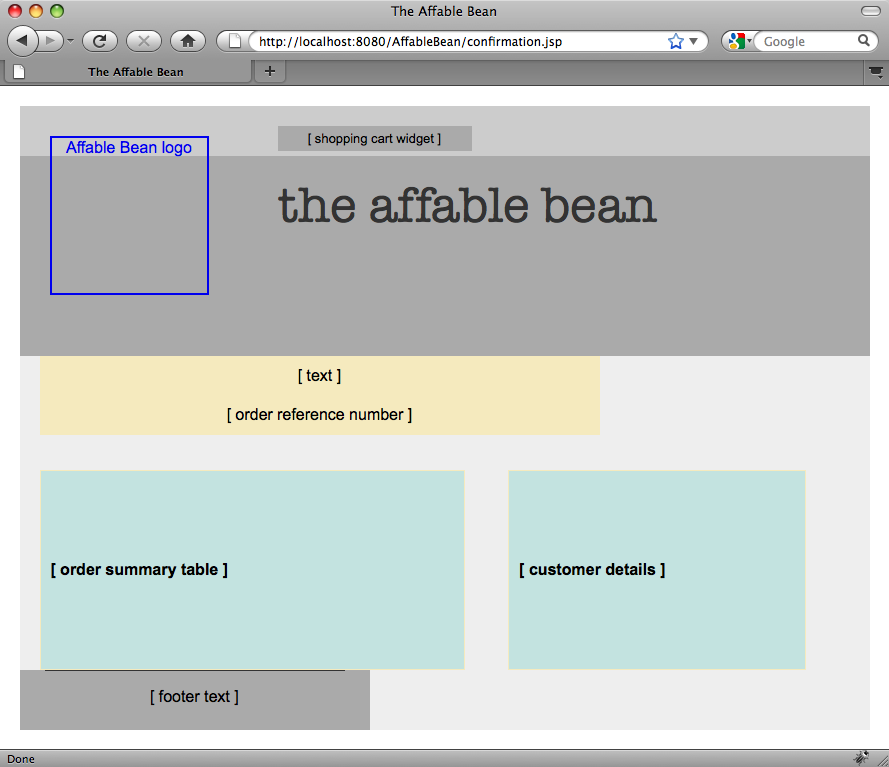 

*Note:* The background colors for each page area only serve to help you position elements while developing the application. Eventually, you'll want to remove them from the stylesheet and apply a background color more suitable for the application. You can do this by adjusting the background rule for the `main` class:

[source,java]
----

#main { background: #f7f7e9 }
----

[[tipsTricks]]
=== Tips and Tricks

The IDE's editor provides many facilities that help you to work more efficiently. If you familiarize yourself with keyboard shortcuts and buttons in the editor toolbar, you can increase your productivity. The following list of tips applies to the editor for HTML and CSS files. To view more keyboard shortcuts, open the IDE's Keyboard Shortcuts Card by choosing Help > Keyboard Shortcuts Card from the main menu.

* *Code completion:* When you type in tags and attributes, suggestions for code completion automatically appear in a pop-up box. Pressing Enter completes the suggested tag.
* *Format your code:* Right-click in the editor and choose Format.
* *Toggle line numbers:* Right-click in the left margin and choose Show Line Numbers.
* *Find occurrences:* Highlight a block of text, and press Ctrl-F (⌘-F on Mac). All matches become highlighted in the editor. To toggle highlighting, press the Toggle Highlight Search ( image:images/toggle-highlight.png[] ) button (Ctrl-Shift-H) in the editor's toolbar.
* *Create a bookmark:* Press the Toggle Bookmark ( image:images/toggle-bookmark.png[] ) button (Ctrl-Shift-M) to create a bookmark in the editor's left margin. Wherever you are in the file, you can then jump to the bookmark by pressing the Previous/Next Bookmark buttons in the editors's toolbar.
* *Copy a code snippet up or down:* Highlight a code snippet, then press Ctrl-Shift-Up/Down.
* *Highlight opening and closing tags:* Place your cursor on either the opening or closing tag, and both are highlighted in yellow.

[[view]]
== Placing JSP Pages in WEB-INF

Looking back at the xref:design.adoc#mockups[+page mockups+] that were created, you can see that the xref:design.adoc#index[+welcome page+] should look the same whenever it is requested, for whomever requests it. That is, the content that displays on the welcome page is not determined by a user's _session_. (Sessions are discussed in Unit 8, xref:manage-sessions.adoc[+Managing Sessions+].) Notice however that all other pages do need some form of user-specific information to display properly. For example, the xref:design.adoc#category[+category page+] requires that the user select a category in order to display, and the xref:design.adoc#cart[+cart page+] needs to know all items currently held in a shopper's cart. These pages will not render properly if the server isn't able to associate user-specific information with an incoming request. Therefore, we do not want these pages to be accessed directly from a browser's address bar. The project's `WEB-INF` folder can be used for this purpose: any resources contained in the `WEB-INF` folder are not directly accessible from a browser.

Create a new folder named `view`, and place it in the `WEB-INF` folder. Then move all JSP pages other than the welcome page into this new folder.

1. In the Projects window, right-click the WEB-INF node and choose New > Folder.
2. In the New Folder wizard, name the folder `view` and click Finish. Notice that a new folder node appears in the Projects window.
3. Move the `category.jsp`, `cart.jsp`, `checkout.jsp`, and `confirmation.jsp` pages into the `view` folder. 

You can do this by clicking on `cart.jsp` to select it, then Shift-clicking on `confirmation.jsp`. This selects the four files. Then, with the four files selected, click and drag them into the `WEB-INF/view` folder. 

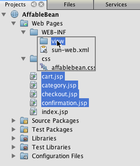

To demonstrate that these pages are no longer accessible from a browser, click the Run Project ( image:images/run-project-btn.png[] ) button to run the project. When the application displays in your browser, enter the full path to any of these files in the address bar. For example, type in:

[source,java]
----

http://localhost:8080/AffableBean/WEB-INF/view/category.jsp
----

You receive an HTTP Status 404 message, indicating that the resource is not available.

[[jspf]]
== Creating a Header and Footer

Looking at the xref:design.adoc#mockups[+page mockups+], it is easy to see that all of the five views share identical content; at the top, they contain the company logo, a language toggle, and other widgets associated with shopping cart functionality. At the bottom, they contain some text with Privacy Policy and Contact links. Rather than including this code in each page source file, we can factor it out into two JSP fragments: a header and a footer. We'll then include the fragment files into page views whenever they need to be rendered.

For these fragments, let's create a new folder named `jspf`, and place it within `WEB-INF`.

1. In the Projects window, right-click the WEB-INF node and choose New > Folder.
2. In the New Folder wizard, name the folder `jspf` and click Finish. 

Menu items provided by the IDE are often context-sensitive. For example, because you right-clicked the WEB-INF node, when the New Folder wizard displayed, `web/WEB-INF` was automatically entered in the Parent Folder field. Likewise, when you right-click a node in the Projects window and choose New, the list of file types is partially determined by your previous selections.

[start=3]
. Create two JSP segments: `header.jspf` and `footer.jspf`. To do so, right-click the newly created `jspf` folder and choose New > JSP. In the New JSP wizard, enter the file name, and under Options, select the Create as a JSP Segment option, then click Finish. 

When you finish, you'll see `header.jspf` and `footer.jspf` displayed in your Projects window: 

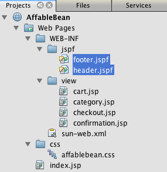 

Now, you can copy the header code from any of the JSP pages and paste it into the `header.jspf` file. Likewise, you can copy the footer code from any of the JSP pages and paste it into the `footer.jspf` file. When you finish this task, you can remove the header and footer code from all of the JSP pages.

[start=4]
. Copy the header code from any of the JSP pages and paste it into the `header.jspf` file. The header should include the page doctype and the opening `<html>`, `<head>`, and `<body>` tags through to the closing tag for the `
` element. Be sure to include placeholders for the shopping cart widget, language toggle, and 'proceed to checkout' button used along the top of page views. After you paste code into `header.jspf`, the file will look as follows.

[source,html]
----

<%@page contentType="text/html" pageEncoding="UTF-8"%>
<!DOCTYPE HTML PUBLIC "-//W3C//DTD HTML 4.01 Transitional//EN"
    "http://www.w3.org/TR/html4/loose.dtd">

<html>
    <head>
        <meta http-equiv="Content-Type" content="text/html; charset=UTF-8">
        <link rel="stylesheet" type="text/css" href="css/affablebean.css">
        <title>The Affable Bean</title>
    </head>
    <body>
        

            

                

                    

                        [ language toggle ]
                    

                    

                        [ checkout button ]
                    

                    

                        [ shopping cart widget ]
                    

                

                

                
            

----

[start=5]
. Copy the footer code from any of the JSP pages and paste it into the `footer.jspf` file. The footer code should include the `
` element, through to the closing `<html>` tag. After you paste code into `footer.jspf`, the file will look as follows.

[source,html]
----

            

                

                
[ footer text ]

            

        

    </body>
</html>
----

[start=6]
. Remove the header and footer code from all five JSP pages (`index.jsp`, `category.jsp`, `cart.jsp`, `checkout.jsp`, and `confirmation.jsp`).

[[dd]]
== Adding a Directive to the Deployment Descriptor

So far, you've placed views in their proper location and have factored out common header and footer code into the `header.jspf` and `footer.jspf` files. The application still needs to know which pages the header and footer files will be applied to. You could add `<jsp:include>` tags to each of the page views. Doing so however would just reintroduce the code repetition which we've just made efforts to eliminate. An alternative solution would be to create a `web.xml` deployment descriptor, and add a JSP Property Group directive to specify which page views the header and footer fragments should apply to.

1. Press Ctrl-N (⌘-N on Mac) to open the New File wizard. Select the Web category, then under File Types, select Standard Deployment Descriptor (web.xml).
2. Click Next. Note that the file is named `web.xml`, and that the wizard will place it in the project's `WEB-INF` directory upon completion.
3. Click Finish. The `web.xml` file is created and added to the project. The IDE's graphical interface for the deployment descriptor opens in the editor. 

The interface is categorized by the areas that can be configured in a web application. These areas are displayed as tabs in the editor toolbar, and include topics such as Servlets, Filters, References, and Security. The XML tab displays the entire source code for the file. Any changes you make in the graphical interface will cause immediate updates to the deployment descriptor's source code, which you can verify by switching to the XML tab. This is demonstrated in the following steps.

[start=4]
. Click the Pages tab, then click the Add JSP Property Group button. The Add JSP Property Group dialog opens.

[start=5]
. Type in '`header and footer settings`' for the Description field. Leave Display Name blank. Both the Display Name and Description fields are optional.

[start=6]
. For URL Patterns, specify the paths to the five views. Type in '`/index.jsp`' and '`/WEB-INF/view/*`'. Separate the two paths with a comma. (The '`*`' is a wildcard that represents all files within the given folder.) 

image::images/add-jsp-prop-group-dialog.png[title="Use the Add JSP Property Group dialog to specify <jsp-config> tags in the deployment descriptor"]

[start=7]
. Click OK. An entry is added to the JSP Properties Groups category in the Pages tab.

[start=8]
. Switch back to the XML tab. Notice that the following code has been added to the deployment descriptor.

[source,xml]
----

<jsp-config>
    <jsp-property-group>
        <description>header and footer settings</description>
        <url-pattern>/index.jsp</url-pattern>
        <url-pattern>/WEB-INF/view/*</url-pattern>
    </jsp-property-group>
</jsp-config>
----

*Note:* You may need to add carriage returns to the code so that it displays on multiple lines. You can right-click in the editor and choose Format (Alt-Shift-F; Ctrl-Shift-F on Mac) to have the code properly indented.

[start=9]
. Switch to the Pages tab again, and in the Include Preludes and Include Codas fields, enter the paths to the `header.jspf` and `footer.jspf` files, respectively. You can click the Browse button and navigate to the files in the provided dialog. 
[.feature]
--

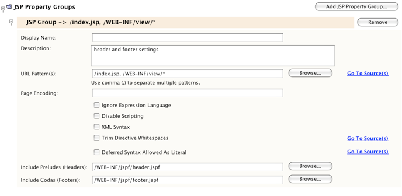

--

[start=10]
. Switch back to the XML tab. Note that the following code has been added. (Changes in *bold*.)

[source,xml]
----

<jsp-config>
    <jsp-property-group>
        <description>header and footer settings</description>
        <url-pattern>/index.jsp</url-pattern>
        <url-pattern>/WEB-INF/view/*</url-pattern>
        *<include-prelude>/WEB-INF/jspf/header.jspf</include-prelude>
        <include-coda>/WEB-INF/jspf/footer.jspf</include-coda>*
    </jsp-property-group>
</jsp-config>
----
The above directive specifies that for all files found within the given `url-pattern`s, the `header.jspf` file will be prepended, and the `footer.jspf` file appended. 

To view the definitions of the above tags, as well as all tags available to you in the web deployment descriptor, consult the link:http://jcp.org/en/jsr/detail?id=315[+Servlet Specification+].

[start=11]
. Run the application again (press F6; fn-F6 on Mac). You've already removed the header and footer code from the `index.jsp` file, so you can determine whether it is automatically being added when the file is requested. 

You will see that the <<welcome-page,welcome page displays as it did previously>>, with header and footer content included.

[[controller]]
== Creating the Controller Servlet

The controller servlet handles incoming requests by initiating any actions needed to generate the model for the request, then forwarding the request to the appropriate view. For a visual representation, refer back to the xref:design.adoc#mvcDiagram[+MVC diagram for the AffableBean project+].

The IDE provides a Servlet wizard that enables you to define the servlet component in a web application either by including the `@WebServlet` annotation in the generated class, or by adding the necessary directives to the deployment descriptor. In the following steps, you create the `ControllerServlet` and define it in the application context using the link:http://java.sun.com/javaee/6/docs/api/javax/servlet/annotation/WebServlet.html[+`@WebServlet`+] annotation.

1. In the Projects window, right-click the `AffableBean` project node and choose New > Servlet.
2. In the wizard, type `ControllerServlet` in the Class Name field.
3. In the Package field, type `controller`. (The new package is automatically created when you complete the wizard.) 

image::images/servlet-wizard.png[title="Use the Servlet wizard to create servlets for your project"]

[start=4]
. Click Next. Step 3 of the wizard lets you configure the servlet. Of primary importance are the URL patterns that you need to specify. The patterns identify the URLs that invoke the servlet. For example, if you enter '`/category`', you are directing the servlet to handle a request that appears as follows.

[source,java]
----

http://localhost/AffableBean*/category*
----
The URL patterns should correspond to the views and actions that a user can initiate. Looking at the xref:design.adoc#index[+welcome page mockup+], a user should be able to select a category. We can therefore associate the `/category` URL with the action of clicking on a category image. Likewise, in the xref:design.adoc#category[+category page+], users should be able to add an item to the shopping cart. We can therefore specify `/addToCart`.

[start=5]
. In the URL Pattern(s) field, type in '`/category, /addToCart, /viewCart`'. Patterns are separated by commas. You can add more patterns directly in the servlet class once it's created. 

image::images/servlet-wizard2.png[title="Configure servlet deployment directly in the wizard"]

[start=6]
. Click Finish. The IDE generates the `ControllerServlet` and opens it in the editor. The servlet and URL patterns are included in the `@WebServlet` annotation that appears above the class signature.

[source,java]
----

*@WebServlet(name="ControllerServlet", urlPatterns={"/category", "/addToCart", "/viewCart"})*
public class ControllerServlet extends HttpServlet {
----
In the previous step, if you had chosen the '`Add information to deployment descriptor (web.xml)`' option in the wizard, the following markup would have been generated in the application's `web.xml` file instead.

[source,xml]
----

<servlet>
    <servlet-name>ControllerServlet</servlet-name>
    <servlet-class>controller.ControllerServlet</servlet-class>
</servlet>
<servlet-mapping>
    <servlet-name>ControllerServlet</servlet-name>
    <url-pattern>/category</url-pattern>
</servlet-mapping>
<servlet-mapping>
    <servlet-name>ControllerServlet</servlet-name>
    <url-pattern>/addToCart</url-pattern>
</servlet-mapping>
<servlet-mapping>
    <servlet-name>ControllerServlet</servlet-name>
    <url-pattern>/viewCart</url-pattern>
</servlet-mapping>
----

[start=7]
. Add other URL patterns directly to the `@WebServlet` annotation's `urlPatterns` element. The application requires more URL patterns for other actions and views. You can type in the following patterns:
* `/updateCart`
* `/checkout`
* `/purchase`
* `/chooseLanguage`
Be sure to separate each pattern with a comma. You can also reformat the annotation as follows:

[source,java]
----

@WebServlet(name="ControllerServlet",
            urlPatterns = {"/category",
                           "/addToCart",
                           "/viewCart"*,
                           "/updateCart",
                           "/checkout",
                           "/purchase",
                           "/chooseLanguage"*})
----

[start=8]
. Finally, include the `loadOnStartup` element so that the servlet is instantiated and initialized when the application is deployed. A value of `0` or greater will cause this to happen (`-1` is the default).

[source,java]
----

@WebServlet(name="ControllerServlet",
            *loadOnStartup = 1,*
            urlPatterns = {"/category",
                           "/addToCart",
                           "/viewCart",
                           "/updateCart",
                           "/checkout",
                           "/purchase",
                           "/chooseLanguage"})
----

[[implement]]
== Implementing the Controller Servlet

As previously stated, the controller servlet handles incoming requests by initiating any actions needed to generate the model for the request, then forwarding the request to the appropriate view. For a visual representation, refer back to the xref:design.adoc#mvcDiagram[+MVC diagram for the AffableBean project+].

Looking at the generated code for the new `ControllerServlet`, you can see that the IDE's servlet template employs a `processRequest` method which is called by both `doGet` and `doPost` methods. (You may need to expand the code fold by clicking the plus icon ( image:images/code-fold-icon.png[] ) in the editor's left margin to view these methods.) Because this application differentiates between `doGet` and `doPost`, you'll add code directly to these methods and remove the `processRequest` method altogether.

=== Modifying File Templates with the IDE's Template Manager

The IDE provides you with a basic template for any new file you create. If the template is not optimal for your work patterns, you can alter it using the IDE's Template Manager. The IDE provides a template for virtually any file type.

For example, to modify the servlet template:

1. Open the Template Manager by choosing Tools > Templates from the main menu.
2. Expand the Web category, then select the Servlet template. 

image::images/template-manager.png[title="Access and modify file templates via the Template Manager"]

[start=3]
. Click the Open in Editor button.

[start=4]
. Modify the template in the editor. The next time you create a new servlet (e.g., using the Servlet wizard), the new version will be applied.

Now that you've mapped URL patterns to the servlet using the `@WebServlet` annotation, set up the `ControllerServlet` to handle these patterns. Also, instantiate a `RequestDispatcher` to forward the requested pattern to the appropriate view.

1. Replace the `ControllerServlet` class template code with the following code.

[source,xml]
----

public class ControllerServlet extends HttpServlet {

    /**
     * Handles the HTTP <code>GET</code> method.
     * @param request servlet request
     * @param response servlet response
     * @throws ServletException if a servlet-specific error occurs
     * @throws IOException if an I/O error occurs
     */
    @Override
    protected void doGet(HttpServletRequest request, HttpServletResponse response)
    throws ServletException, IOException {

        String userPath = request.getServletPath();

        // if category page is requested
        if (userPath.equals("/category")) {
            // TODO: Implement category request

        // if cart page is requested
        } else if (userPath.equals("/viewCart")) {
            // TODO: Implement cart page request

            userPath = "/cart";

        // if checkout page is requested
        } else if (userPath.equals("/checkout")) {
            // TODO: Implement checkout page request

        // if user switches language
        } else if (userPath.equals("/chooseLanguage")) {
            // TODO: Implement language request

        }

        // use RequestDispatcher to forward request internally
        String url = "/WEB-INF/view" + userPath + ".jsp";

        try {
            request.getRequestDispatcher(url).forward(request, response);
        } catch (Exception ex) {
            ex.printStackTrace();
        }
    }

    /**
     * Handles the HTTP <code>POST</code> method.
     * @param request servlet request
     * @param response servlet response
     * @throws ServletException if a servlet-specific error occurs
     * @throws IOException if an I/O error occurs
     */
    @Override
    protected void doPost(HttpServletRequest request, HttpServletResponse response)
    throws ServletException, IOException {

        String userPath = request.getServletPath();

        // if addToCart action is called
        if (userPath.equals("/addToCart")) {
            // TODO: Implement add product to cart action

        // if updateCart action is called
        } else if (userPath.equals("/updateCart")) {
            // TODO: Implement update cart action

        // if purchase action is called
        } else if (userPath.equals("/purchase")) {
            // TODO: Implement purchase action

            userPath = "/confirmation";
        }

        // use RequestDispatcher to forward request internally
        String url = "/WEB-INF/view" + userPath + ".jsp";

        try {
            request.getRequestDispatcher(url).forward(request, response);
        } catch (Exception ex) {
            ex.printStackTrace();
        }
    }

}
----
As you continue through the tutorial, you'll return to the `ControllerServlet` and implement each of the mapped URL patterns individually.

[start=2]
. Examine the code above. There are several points to note:
* The servlet uses a `userPath` instance variable to get the requested URL pattern from the client:

[source,java]
----

String userPath = request.getServletPath();
----
`userPath` is used by both `doGet` and `doPost` methods.
* URL patterns associated primarily with page requests are managed by the `doGet` method. For example, `/category`, `/viewCart`, and `/checkout` result in the display of the category, cart, and checkout pages.)
* URL patterns associated with form submits and the transport of sensitive user data (e.g., `/addToCart`, `/updateCart`, and `/purchase`) are managed by the `doPost` method.
* For both `doGet` and `doPost` methods, the path to the appropriate view is formed using a `url` string:

[source,java]
----

String url = "/WEB-INF/view" + userPath + ".jsp";
----
* The `RequestDispatcher` is obtained from the `HttpServletRequest` and applies the `url` to forward the request:

[source,java]
----

request.getRequestDispatcher(url).forward(request, response);
----
* `TODO` notes have been used to denote work that still needs to be done. For example:

[source,java]
----

// if category page is requested
if (userPath.equals("/category")) {
    // TODO: Implement category request
----
Applying `TODO` notes in your code is a useful way to keep track of tasks that you need to complete. You can use the IDE's Tasks window (Ctrl-6; ⌘-6 on Mac) to view all TODO notes, as well as any syntax or compile errors contained in your project. 

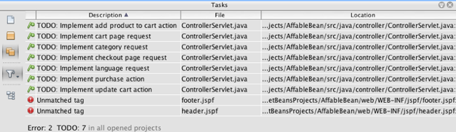 

You can control the keywords that display in the Tasks window. Open the Options window (Tools > Options; NetBeans > Preferences on Mac), then choose Miscellaneous > Tasks.

[start=3]
. Run the project (press F6; fn-F6 on Mac) and test to see whether the `ControllerServlet` is forwarding requests to the appropriate views.
* Type in `http://localhost:8080/AffableBean/category` in the browser's address bar. The application's <<categoryPage,category page>> displays.
* Type in `http://localhost:8080/AffableBean/viewCart` in the browser's address bar. The application's <<cartPage,cart page>> displays.
* Type in `http://localhost:8080/AffableBean/checkout` in the browser's address bar. The application's <<checkoutPage,checkout page>> displays.

*Note:* Entering `http://localhost:8080/AffableBean/purchase` in the browser's address bar does not allow you to view the <<confirmationPage,confirmation page>>. Naturally, this is because the `/purchase` URL pattern is handled by the servlet's `doPost` method, and requests sent from the browser's address bar are typically sent using the HTTP GET method.

At this stage, you've created JSP pages that contain placeholders for functional components. You've also set up the front-end structure of the application. JSP pages now reside within the `WEB-INF` folder, header and footer code has been factored out into separate files, your deployment descriptor is properly configured, and you've set up the `ControllerServlet` to handle incoming requests. In the next tutorial unit, you take measures to enable connectivity between the application and the database.

If you'd like to compare your work with the sample solution for this unit, you can link:https://netbeans.org/projects/samples/downloads/download/Samples%252FJavaEE%252Fecommerce%252FAffableBean_snapshot2.zip[+download snapshot 2 of the AffableBean project+].

xref:../../../../community/mailing-lists.adoc[Send Feedback on This Tutorial]

[[seeAlso]]
== See Also

=== NetBeans Tutorials

* xref:../javaee-intro.adoc[+Introduction to Java EE Technology+]
* xref:../javaee-gettingstarted.adoc[+Getting Started with Java EE Applications+]
* xref:../../web/quickstart-webapps.adoc[+Introduction to Developing Web Applications+]
* xref:../../web/mysql-webapp.adoc[+Creating a Simple Web Application Using a MySQL Database+]
* xref:../../../../community/media.adoc[+Video Tutorials and Demos for NetBeans IDE+]
* link:https://netbeans.org/projects/www/downloads/download/shortcuts.pdf[+Keyboard Shortcuts &amp; Code Templates Card+]
* xref:../../java-ee.adoc[+Java EE &amp; Java Web Learning Trail+]

=== NetBeans Books

* xref:../../../articles/netbeans-tips-and-tricks-book.adoc[+100 NetBeans IDE Tips and Tricks+]
* link:http://www.apress.com/book/view/1590598954[+Pro NetBeans IDE 6 Rich Client Platform Edition+]
* link:http://apress.com/book/view/1430219548[+Beginning Java EE 6 Platform with GlassFish 3: From Novice to Professional+]
* xref:../../../articles/books.adoc[+More books about NetBeans IDE+]

=== External Resources

* link:http://jcp.org/en/jsr/detail?id=315[+Servlet 3.0 Specification+]
* link:https://developer.mozilla.org/en/Common_CSS_Questions[+Common CSS Questions+]
* link:http://quirksmode.org/compatibility.html[+Browser Compatibility Master Table+]
* link:http://refcardz.dzone.com/refcardz/netbeans-ide-67-update[+DZone Refcard for NetBeans Java Editor+]
