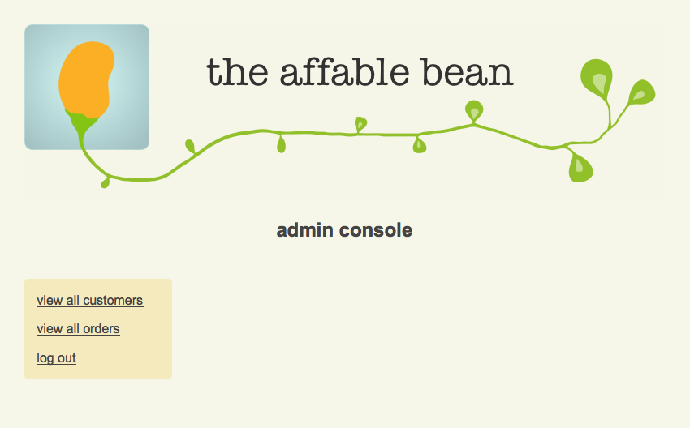
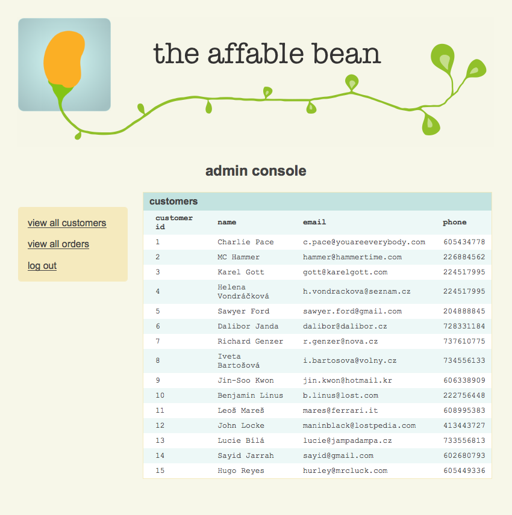
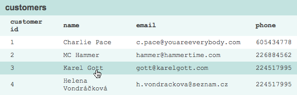
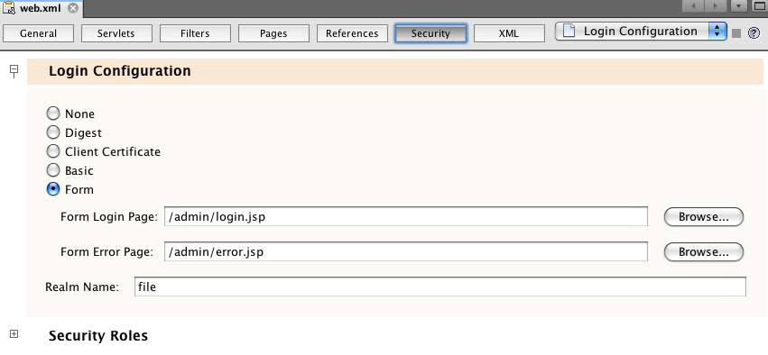
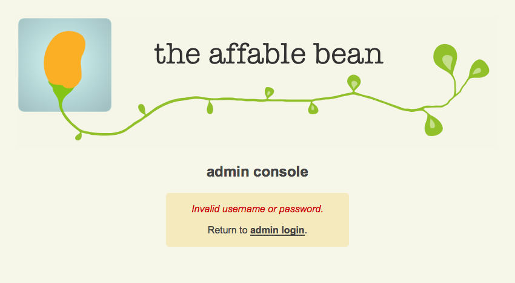
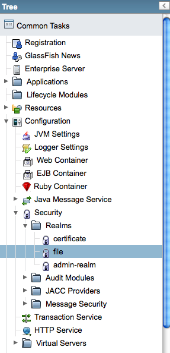
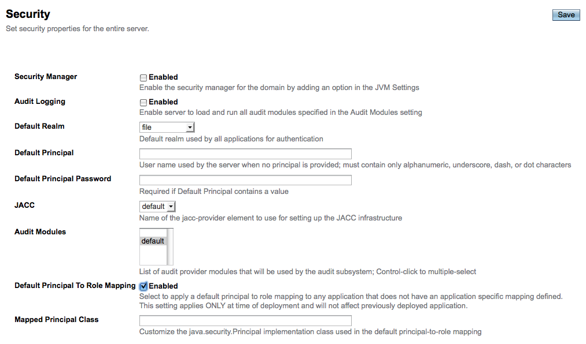

// 
//     Licensed to the Apache Software Foundation (ASF) under one
//     or more contributor license agreements.  See the NOTICE file
//     distributed with this work for additional information
//     regarding copyright ownership.  The ASF licenses this file
//     to you under the Apache License, Version 2.0 (the
//     "License"); you may not use this file except in compliance
//     with the License.  You may obtain a copy of the License at
// 
//       http://www.apache.org/licenses/LICENSE-2.0
// 
//     Unless required by applicable law or agreed to in writing,
//     software distributed under the License is distributed on an
//     "AS IS" BASIS, WITHOUT WARRANTIES OR CONDITIONS OF ANY
//     KIND, either express or implied.  See the License for the
//     specific language governing permissions and limitations
//     under the License.
//

= The NetBeans E-commerce Tutorial - Securing the Application
:jbake-type: tutorial
:jbake-tags: tutorials 
:jbake-status: published
:icons: font
:syntax: true
:source-highlighter: pygments
:toc: left
:toc-title:
:description: The NetBeans E-commerce Tutorial - Securing the Application - Apache NetBeans
:keywords: Apache NetBeans, Tutorials, The NetBeans E-commerce Tutorial - Securing the Application
include::../../../../inc/database.adoc[]

== Tutorial Contents

1. xref:intro.adoc[+Introduction+]
2. xref:design.adoc[+Designing the Application+]
3. xref:setup-dev-environ.adoc[+Setting up the Development Environment+]
4. xref:data-model.adoc[+Designing the Data Model+]
5. xref:page-views-controller.adoc[+Preparing the Page Views and Controller Servlet+]
6. xref:connect-db.adoc[+Connecting the Application to the Database+]
7. xref:entity-session.adoc[+Adding Entity Classes and Session Beans+]
8. xref:manage-sessions.adoc[+Managing Sessions+]
9. xref:transaction.adoc[+Integrating Transactional Business Logic+]
10. xref:language.adoc[+Adding Language Support+]
11. *Securing the Application*
* <<examineSnapshot,Examining the Project Snapshot>>
* <<formBased,Setting up Form-Based Authentication>>
* <<usersGroups,Creating Users, Groups and Roles>>
* <<secureTransport,Configuring Secure Data Transport>>
* <<seeAlso,See Also>>

[start=12]
. xref:test-profile.adoc[+Testing and Profiling+]

[start=13]
. xref:conclusion.adoc[+Conclusion+]

image::../../../../images_www/articles/68/netbeans-stamp-68-69.png[title="Content on this page applies to NetBeans IDE, versions 6.8 and 6.9"]

This tutorial unit focuses on web application security. When securing web applications, there are two primary concerns that need to be addressed:

1. Preventing unauthorized users from gaining access to protected content.
2. Preventing protected content from being read while it is being transmitted.

The first concern, _access control_, is typically a two-step process that involves (1) determining whether a user is who he or she claims to be (i.e., _authentication_), and then (2) either granting or denying the user access to the requested resource (i.e., _authorization_). A simple and common way to implement access control for web applications is with a login form that enables the server to compare user credentials with a pre-existing list of authenticated users.

The second concern, protecting data while it is in transit, typically involves using Transport Layer Security (TLS), or its predecessor, Secure Sockets Layer (SSL), in order to encrypt any data communicated between the client and server.

Upon reviewing the Affable Bean staff's xref:design.adoc#requirements[+list of requirements+], we'll need to secure the application in the following ways:

* Set up a login form for the administration console that enables staff members access to the console's services, and blocks unauthorized users.
* Configure secure data transport for both the customer checkout process, and for any data transmitted to and from the administration console.

In order to implement the above, we'll take advantage of NetBeans' visual editor for the `web.xml` deployment descriptor. We'll also work in the GlassFish Administration Console to configure a "user group" that corresponds to Affable Bean staff members, and verify SSL support.

You can view a live demo of the application that you build in this tutorial: link:http://services.netbeans.org/AffableBean/[+NetBeans E-commerce Tutorial Demo Application+].

|===
|Software or Resource |Version Required 

|xref:../../../../download/index.adoc[NetBeans IDE] |Java bundle, 6.8 or 6.9 

|link:http://www.oracle.com/technetwork/java/javase/downloads/index.html[+Java Development Kit (JDK)+] |version 6 

|<<glassFish,GlassFish server>> |v3 or Open Source Edition 3.0.1 

|link:http://dev.mysql.com/downloads/mysql/[+MySQL database server+] |version 5.1 

|link:https://netbeans.org/projects/samples/downloads/download/Samples%252FJavaEE%252Fecommerce%252FAffableBean_snapshot10.zip[+AffableBean project+] |snapshot 10 
|===

*Notes:*

* The NetBeans IDE requires the Java Development Kit (JDK) to run properly. If you do not have any of the resources listed above, the JDK should be the first item that you download and install.
* The NetBeans IDE Java Bundle includes Java Web and EE technologies, which are required for the application you build in this tutorial.
* The NetBeans IDE Java Bundle also includes the GlassFish server, which you require for this tutorial. You could link:http://glassfish.dev.java.net/public/downloadsindex.html[+download the GlassFish server independently+], but the version provided with the NetBeans download has the added benefit of being automatically registered with the IDE.
* You can follow this tutorial unit without having completed previous units. To do so, see the xref:setup.adoc[+setup instructions+], which describe how to prepare the database and establish connectivity between the IDE, GlassFish, and MySQL.
* Java EE security is an expansive topic that spans well beyond the scope of this tutorial unit. In order to fully appreciate the range of implementation options that are available to you, refer to the link:http://download.oracle.com/javaee/6/tutorial/doc/gijrp.html[+Java EE 6 Tutorial, Part VII: Security+]. This unit provides ample references to relevant sub-sections within the Java EE Tutorial.

[[examineSnapshot]]
== Examining the Project Snapshot

The beginning state of the snapshot helps to illustrate the need for security in the application.

1. Open the link:https://netbeans.org/projects/samples/downloads/download/Samples%252FJavaEE%252Fecommerce%252FAffableBean_snapshot10.zip[+project snapshot+] for this tutorial unit in the IDE. Click the Open Project ( image:images/open-project-btn.png[] ) button and use the wizard to navigate to the location on your computer where you downloaded the project.
2. Run the project ( image:images/run-project-btn.png[] ) to ensure that it is properly configured with your database and application server. 

If you receive an error when running the project, revisit the xref:setup.adoc[+setup instructions+], which describe how to prepare the database and establish connectivity between the IDE, GlassFish, and MySQL.

[start=3]
. Test the application's functionality in your browser. This snapshot provides an implementation of the administration console, as specified in the xref:design.adoc#requirements[+customer requirements+]. To examine the administration console, enter the following URL in your browser:

[source,java]
----

http://localhost:8080/AffableBean*/admin/*
----

 

The administration console enables you to view all customers and orders contained in the database. When you click either of the links in the left panel, the page will update to display a table listing customers or orders, depending on your choice. (The 'log out' link currently does not "log out" an authenticated user.) 

*Note:* The customers and orders that you see displayed in the administration console are dependent on the data stored in your database. You can create new records by stepping through the checkout process in the website. Alternatively, you can run the link:https://netbeans.org/project_downloads/samples/Samples/JavaEE/ecommerce/affablebean_sample_data.sql[+affablebean_sample_data.sql+] script on your `affablebean` database to have your data correspond to the records displayed in the following screenshots. (If you need help with this task, refer to step 2 in the xref:setup.adoc[+setup instructions+].)

 

You can view details for each customer record by hovering your mouse and selecting an individual record. 

 

Likewise, you can view an order summary for each customer either by selecting an order from the administration console's "orders" table, or by clicking the "view order summary" link in a "customer details" display. 

image::images/view-order-summary.png[title="Click 'view order summary' from a customer details display in order to view a customer's order details"] 

Naturally, none of this information should be available to an anonymous site visitor. In the coming steps, you'll create login and error pages, so that when an unauthenticated user attempts to access the administration console, he or she will be directed to the login page. Upon successful login, the user is then redirected to the administration console's menu; upon login failure, the error page is displayed.

[start=4]
. Examine the project snapshot in the Projects window.
|===

|image:images/projects-window.png[title="The AdminServlet forwards requests to resources within the web/admin folder"] |

This implementation of the administration console primarily relies on the following project resources:

* An *`admin`* directory within the project's webroot, which contains all page view files.
* An *`AdminServlet`*, contained in the `controller` package, which forwards requests to page views within the `admin` directory.

Also, the following files have been modified from the previous snapshot:

* *`WEB-INF/web.xml`:* Contains a new `<jsp-property-group>` that includes the header and footer fragments for page views contained in the `admin` directory.
* *`css/affablebean.css`:* Includes new style definitions for elements in the administration console

If you have been following the NetBeans E-commerce Tutorial sequentially, you'll find that there is nothing contained in the implementation for the administration console which hasn't already been covered in previous units. Essentially, the `AdminServlet` processes requests from the `admin/index.jsp` page, EJBs and entity classes are employed to retrieve information from the database, and the information is then forwarded back to the `admin/index.jsp` page to be displayed.

 
|===

[start=5]
. In the browser, return to the customer website by clicking the Affable Bean logo in the upper left corner of the web page. Step through the entire xref:design.adoc#business[+business process flow+] of the application and note that the checkout process is handled over a non-secure channel. 

When customers reach the checkout page, they are expected to submit sensitive personal information in order to complete their orders. Part of your task in this tutorial unit is to ensure that this data is sent over a secure channel. Because the administration console also enables authenticated users to view customers' personal information, it too needs to be configured so that data is sent over the Internet securely.

[[formBased]]
== Setting up Form-Based Authentication

In this section, you set up _form-based authentication_ for the `AffableBean` administration console. Form-based authentication enables the server to authenticate users based on the credentials they enter into a login form. With these credentials, the server is able to make a decision on whether to grant the user access to protected resources. In order to implement this, you'll create login and error pages, and will rely on _declarative security_ by entering security settings in the application's `web.xml` deployment descriptor.

Before you begin implementing a form-based authentication mechanism for the `AffableBean` application, the following background information is provided to help clarify the security terms relevant to our scenario.

* <<declarativeSecurity,Declarative and Programmatic Security>>
* <<authenticationMech,Choosing an Authentication Mechanism>>

[[declarativeSecurity]]
=== Declarative and Programmatic Security

With _declarative security_, you specify all security settings for your application, including authentication requirements, access control, and security roles, using annotations and/or deployment descriptors. In other words, the security for your application is in a form that is external to the application, and relies on the mechanisms provided by the Java EE container for its management.

With _programmatic security_, your classes, entities, servlets, and page views manage security themselves. In this case, security logic is integrated directly into your application, and is used to handle authentication and authorization, and ensure that data is sent over a secure network protocol when necessary.

For the `AffableBean` application, we'll use declarative security by declaring all security information in the `web.xml` deployment descriptor.

For more information on declarative and programmatic security types, see the link:http://download.oracle.com/javaee/6/tutorial/doc/bncat.html[+Java EE 6 Tutorial: Overview of Web Application Security+].

[[authenticationMech]]
=== Choosing an Authentication Mechanism

An _authentication mechanism_ is used to determine how a user gains access to restricted content. The Java EE platform supports various authentication mechanisms, such as _HTTP basic authentication_, _form-based authentication_, and _client authentication_. The authentication mechanism behind our login form will be _form-based authentication_. You'll learn what form-based authentication is when you begin <<loginForm,setting up the login form>> for the `AffableBean` administration console below.

See the Java EE 6 Tutorial: link:http://download.oracle.com/javaee/6/tutorial/doc/gkbaa.html#gkbsa[+Specifying Authentication Mechanisms+] for further information.

Form-based authentication has the advantage of enabling the developer to design the appearance of the login form so that it better suits the application which it belongs to. Our implementation for the form-based authentication mechanism can be divided into two steps. Begin by creating page views for the required login form and error message. Then add entries to the `web.xml` deployment descriptor to inform the servlet container that the application requires form-based authentication for access to the resources that comprise the administration console.

1. <<createPages,Create Pages for Login and Login Failure>>
2. <<addSecurity,Add Security Entries to the Deployment Descriptor>>

[[createPages]]
=== Create Pages for Login and Login Failure

In form-based authentication, the process of authentication and authorization is shown in the following four steps:

1. The client sends a request to the server for a protected resource.
2. The server recognizes that a protected resource has been requested, and returns the login page to the client.
3. The client sends username and password credentials using the provided form.
4. The server processes the credentials, and if an authorized user is identified the protected resource is returned, otherwise the error page is returned.

image::images/form-based-authentication.png[title="Authentication and authorization take place in a four-step process using form-based authentication"]

For more information on form-based authentication, see the Java EE 6 Tutorial: link:http://download.oracle.com/javaee/6/tutorial/doc/gkbaa.html#bncbq[+Form-Based Authentication+].

The `j_security_check` keyword represents the destination in the servlet container that handles authentication and authorization. When implementing the HTML login form, you apply it as the value for the form's `action` attribute. You also apply the "`j_username`" and "`j_password`" keywords, as in the following template:

[source,html]
----

<form action="*j_security_check*" method=post>

    
username: <input type="text" name="*j_username*">

    
password: <input type="password" name="*j_password*">

    
<input type="submit" value="submit">

</form>
----

Perform the following steps.

1. In the Projects window, right-click the `admin` folder node and choose New > JSP.
2. Name the file `login`, then click Finish. The new `login.jsp` file is created and opens in the editor.
3. Repeat the previous two steps to create a new `error.jsp` file. In the New JSP wizard, name the file `error`. When you finish, you'll have two new files listed in the Projects window. 

image::images/projects-window-jsp.png[title="New JSP file nodes displayed in Projects window"]

[start=4]
. Open the project's web deployment descriptor. Press Alt-Shift-O (Ctrl-Shift-O on Mac) and in the Go to File dialog, type '`web`', then click OK. 

image::images/go-to-file.png[title="Use the Go to File dialog to quickly open files in the editor"]

[start=5]
. In the editor, scroll to the bottom of the `web.xml` file and note the `<jsp-property-group>` entry created for JSP pages in the administration console. Add the new login and error JSP pages as `<url-pattern>` entries. (Changes in *bold*.)

[source,xml]
----

<jsp-property-group>
    <description>JSP configuration for the admin console</description>
    <url-pattern>/admin/index.jsp</url-pattern>
    *<url-pattern>/admin/login.jsp</url-pattern>
    <url-pattern>/admin/error.jsp</url-pattern>*
    <include-prelude>/admin/jspf/header.jspf</include-prelude>
    <include-coda>/admin/jspf/footer.jspf</include-coda>
</jsp-property-group>
----
This step ensures that when these two pages are returned to a client, they will be prepended and appended with the defined `header.jspf` and `footer.jspf` fragments, respectively. 

You can equally configure the `<jsp-property-group>` entry from the `web.xml`'s visual editor. Click the Pages tab along the top of the editor, and enter the URL patterns into the respective JSP Property Group.

[start=6]
. Press Ctrl-Tab to switch to the `login.jsp` file in the editor. Delete the entire template contents for the file, then enter the following HTML form.

[source,html]
----

<form action="*j_security_check*" method=post>
    

        
<strong>username:</strong>
            <input type="text" size="20" name="*j_username*">

        
<strong>password:</strong>
            <input type="password" size="20" name="*j_password*">

        
<input type="submit" value="submit">

    

</form>
----
Note that the HTML form is based on the <<template,template provided above>>. Here, you use the "`j_security_check`" keyword as the value for the form's `action` attribute, and the "`j_username`" and "`j_password`" keywords as the values for the `name` attribute of the username and password text fields. The style of the form is implemented by encapsulating the form widgets within a `
` element, then defining a set of rules for the `loginBox` ID in `affablebean.css`.

[start=7]
. Press Ctrl-Tab and switch to the `error.jsp` file in the editor. Delete the entire template contents for the file, then enter the following.

[source,html]
----

    
Invalid username or password.

    
Return to <strong><a href="login.jsp">admin login</a></strong>.

----
The above content includes a simple message indicating that login has failed, and provides a link that allows the user to return to the login form.

[[addSecurity]]
=== Add Security Entries to the Deployment Descriptor

In order to instruct the servlet container that form-based authentication is to be used, you add entries to the `web.xml` deployment descriptor. This is essentially a three-step process, which can be followed by specifying settings under the three headings in the `web.xml` file's Security tab. These are: (1) Login Configuration, (2) Security Roles, and (3) Security Constraints.

1. Open the project's `web.xml` file in the editor. (If it is already opened, you can press Ctrl-Tab and select it.)
2. Click the Security tab along the top of the editor. The IDE's visual editor enables you to specify security settings under the Security tab.
3. Expand the Login Configuration heading, select Form, then enter the following details:
* *Form Login Page:* `/admin/login.jsp`
* *Form Error Page:* `/admin/error.jsp`
* *Realm Name:* `file`

[start=4]
. Click the XML tab along the top of the editor and verify the changes made to the deployment descriptor. The following entry has been added to the bottom of the file:

[source,xml]
----

<login-config>
    <auth-method>FORM</auth-method>
    <realm-name>file</realm-name>
    <form-login-config>
        <form-login-page>/admin/login.jsp</form-login-page>
        <form-error-page>/admin/error.jsp</form-error-page>
    </form-login-config>
</login-config>
----
This entry informs the servlet container that form-based authentication is used, the realm named `file` should be checked for user credentials, and specifies the whereabouts of the login and error pages.

[start=5]
. Click the Security tab again, then expand the Security Roles heading and click Add.

[start=6]
. In the Add Security Role dialog, type in `affableBeanAdmin` for the role name, then click OK. The new role entry is added beneath Security Roles.

[start=7]
. Click the XML tab to examine how the file has been affected. Note that the following entry has been added:

[source,xml]
----

<security-role>
    <description/>
    <role-name>affableBeanAdmin</role-name>
</security-role>
----
Here we've specified the name of a security role used with the application. We'll need to associate this role with the protected resources that define the administration console (under the Security Constraints heading below), and later we'll <<defineRoles,create this role on the GlassFish server>>.

[start=8]
. Click the Security tab again, then click the Add Security Constraint button.

[start=9]
. Type in `Admin` for the Display Name, then under Web Resource Collection click the Add button. Enter the following details, then when you are finished, click OK.
* *Resource Name:* `Affable Bean Administration`
* *URL Pattern(s):* `/admin/*`
* *HTTP Method(s):* `All HTTP Methods`

image::images/add-web-resource.png[title="Specify which resources need to be protected using the Add Web Resource dialog"]

[start=10]
. Under the new Admin security constraint, select the Enable Authentication Constraint option and click the Edit button next to the Role Name(s) text field.

[start=11]
. In the dialog that displays, select the `affableBeanAdmin` role in the left column, then click Add. The role is moved to the right column. 

image::images/edit-role-names.png[title="Specify roles to be associated with an authentication constraint"]

[start=12]
. Click OK. The role is added to the Role Name(s) text field. 

image::images/security-tab.png[title="Security constraints include specifying the web resource collection, and role(s) that are granted access to the collection"]

[start=13]
. Click the XML tab to examine how the file has been affected. Note that the following entry has been added:

[source,xml]
----

<security-constraint>
    <display-name>Admin</display-name>
    <web-resource-collection>
        <web-resource-name>Affable Bean Administration</web-resource-name>
        <description/>
        <url-pattern>/admin/*</url-pattern>
    </web-resource-collection>
    <auth-constraint>
        <description/>
        <role-name>affableBeanAdmin</role-name>
    </auth-constraint>
</security-constraint>
----
In these previous six steps, you've created a security constraint that specifies which resources need to be protected, and identifies the role(s) that are granted access to them. Since the administration console implementation is essentially everything contained within the application's `admin` folder, you use a wildcard (`*`). Although you've specified that all HTTP methods should be protected, you could have equally selected just GET and POST, since these are the only two that are handled by the `AdminServlet`. As previously mentioned, the `affableBeanAdmin` role that we declared still needs to be created on the GlassFish server.

[start=14]
. Run the project ( image:images/run-project-btn.png[] ) to examine how the application now handles access to the administration console.

[start=15]
. When the application opens in the browser, attempt to access the administration console by entering the following URL into the browser's address bar:

[source,java]
----

http://localhost:8080/AffableBean*/admin/*
----
When you attempt to access the administration console, the login page is now presented. 

image::images/login-form.png[title="Unauthenticated attempts to access the administration console are redirected to the login page"]

[start=16]
. Click the 'submit' button to attempt login. You see the error page displayed. 

[[usersGroups]]
== Setting up Users, Groups and Roles

Much of our security implementation is dependent on configuration between the application and the GlassFish server we are using. This involves setting up _users_, _groups_, and _roles_ between the two, and using one of the preconfigured security policy domains, or _realms_, on the server. Start by reading some background information relevant to our scenario, then proceed by configuring users, groups and roles between the application and the GlassFish server.

* <<understandUsers,Understanding Users, Groups, and Roles>>
* <<understandRealms,Understanding Realms on the GlassFish Server>>

[[understandUsers]]
=== Understanding Users, Groups, and Roles

A _user_ is a unique identity recognized by the server. You define users on the server so that it can be able to determine who should have access to protected resources. You can optionally cluster users together into a _group_, which can be understood as a set of authenticated users. In order to specify which users and/or groups have access to protected resources, you create _roles_. As stated in the Java EE 6 Tutorial,

[NOTE]
====
_A role is an abstract name for the permission to access a particular set of resources in an application. A role can be compared to a key that can open a lock. Many people might have a copy of the key. The lock doesn’t care who you are, only that you have the right key._
====

The role that a user or group is assigned to is what specifically allows the server to determine whether protected resources can be accessed. Users and groups can be assigned to multiple roles. As will be demonstrated below, you accomplish this by defining the role in the application, then mapping it to users and groups on the server.

The relationship between users, groups, and roles, and the process in which you establish them in the application and on the server, is presented in the following diagram.

image::images/groups-users-roles.png[title="Users, groups, and roles need to be set up and mapped between the application and server"]

For more information on groups, users, and roles, see link:http://download.oracle.com/javaee/6/tutorial/doc/bnbxj.html[+Working with Realms, Users, Groups, and Roles+] in the Java EE 6 Tutorial.

[[understandRealms]]
=== Understanding Realms on the GlassFish Server

When you define users and groups on the server, you do so by entering details into a security policy domain, otherwise known as a _realm_. A realm protects user credentials (e.g., user names and passwords) through an authentication scheme. For example, user credentials can be stored in a local text file, or maintained in a certificate database.

The GlassFish server provides three preconfigured realms by default. These are the `file`, `admin-realm`, and `certificate` realms. Briefly, the `file` realm stores user credentials in a local text file named `keyfile`. The `admin-realm` also stores credentials in a local text file, and is reserved for server administrator users. The `certificate` realm, the server stores user credentials in a certificate database.

When defining users, groups and roles for the `AffableBean` administration console, we'll use the server's preconfigured `file` realm.

In order to set up users, groups and roles to satisfy the form-based authentication mechanism we've created, perform the following three steps corresponding to the <<usersRolesGroupsDiagram,diagram above>>.

1. <<createUsers,Create Users and/or Groups on the Server>>
2. <<defineRoles,Define Roles in the Application>>
3. <<mapApplication,Map Roles to Users and/or Groups>>

[[createUsers]]
=== Create Users and/or Groups on the Server

In this step, we'll use the GlassFish Administration Console to create a user named `nbuser` within the preexisting `file` security realm. We'll also assign the new `nbuser` to a _group_ that we'll create called `affableBeanAdmin`.

1. Open the Services window (Ctrl-5; ⌘-5 on Mac) and expand the Servers node so that the GlassFish server node is visible.
2. Ensure that the GlassFish server is running. If the server is running, a small green arrow is displayed next to the GlassFish icon ( image:images/gf-server-running-node.png[] ). If you need to start it, right-click the server node and choose Start.
3. Right-click the GlassFish server node and choose View Admin Console. The login form for the GlassFish Administration Console opens in a browser.
4. Log into the Administration Console by typing `admin` / `adminadmin` for the username / password.
5. In the Tree which displays in the left column of the Administration Console, expand the Configuration > Security > Realms nodes, then click the `file` realm. 

[start=6]
. In the main panel of the GlassFish Administration Console, under Edit Realm, click the Manage Users button.

[start=7]
. Under File Users, click the New button.

[start=8]
. Under New File Realm User, enter the following details:
* *User ID:* `nbuser`
* *Group List:* `affableBeanAdmin`
* *New Password:* `secret`
* *Confirm New Password:* `secret`

image::images/new-file-realm-user.png[title="Enter new user and group details in the New File Realm User panel"] 

Here, we are creating a user for the `file` security realm, which we've randomly named `nbuser`. We have also assigned the new user to a randomly named `affableBeanAdmin` group. Remember the `secret` password you set, as you will require it to later log into the `AffableBean` administration console.

[start=9]
. Click OK. The new `nbuser` user is now listed under File Users in the GlassFish Administration Console. 

image::images/nbuser-file-realm.png[title="All users and groups pertaining to the 'file' realm are displayed under File Users"] 

Optionally close the browser window for the GlassFish Administration Console, or leave it open for the time being. You will need to return to the Administration Console in the <<mapApplication,Map Roles to Users and/or Groups>> step below.

[[defineRoles]]
=== Define Roles in the Application

By "defining roles in the application," you specify which roles have access to EJB session beans, servlets, and/or specific methods that they contain. You can accomplish this declaratively by creating entries in the deployment descriptor, or using annotations. For the `AffableBean` administration console, we've actually already completed this step when we <<enableAuthConstraint,added the `affableBeanAdmin` role to the security constraint>> that we created when implementing form-based authentication. However, in more complicated scenarios you may have multiple roles, each with varying degrees of access. In such cases, implementation requires a more fine-grained access control.

The Java EE 6 API includes various security annotations that you can use in place of the XML entries you add to deployment descriptors. The availability of annotations primarily aims to offer ease of development and flexibility when coding. One common method is to use annotations within classes, but override them when necessary using deployment descriptors.

* <<secureServlet,Using Security Annotations in Servlets>>
* <<secureEJB,Using Security Annotations in EJBs>>

[[secureServlet]]
==== Using Security Annotations in Servlets

The following table lists some of the annotations available to you when applying roles to servlets.

|===
|Servlet 3.0 Security Annotations (specified in link:http://www.jcp.org/en/jsr/detail?id=315[+JSR 315+]) 

|`link:http://download.oracle.com/javaee/6/api/javax/servlet/annotation/ServletSecurity.html[+@ServletSecurity+]` |Used to specify security constraints to be enforced by a Servlet container on HTTP protocol messages. 

|`link:http://download.oracle.com/javaee/6/api/javax/servlet/annotation/HttpConstraint.html[+@HttpConstraint+]` |Used within the `ServletSecurity` annotation to represent the security constraints to be applied to all HTTP protocol methods. 
|===

If we wanted to apply the Servlet 3.0 annotations to declare the `affableBeanAdmin` role on the `AdminServlet`, we could do so as follows. (Changes in *bold*.)

[source,java]
----

@WebServlet(name = "AdminServlet",
            urlPatterns = {"/admin/",
                           "/admin/viewOrders",
                           "/admin/viewCustomers",
                           "/admin/customerRecord",
                           "/admin/orderRecord",
                           "/admin/logout"})
*@ServletSecurity( @HttpConstraint(rolesAllowed = {"affableBeanAdmin"}) )*
public class AdminServlet extends HttpServlet { ... }
----

In this case, we could then remove the corresponding entry in the `web.xml` deployment descriptor. (Removed content displayed as [.line-through]#*strike-through*# text.)

[source,xml]
----

<login-config>
    <auth-method>FORM</auth-method>
    <realm-name>file</realm-name>
    <form-login-config>
        <form-login-page>/admin/login.jsp</form-login-page>
        <form-error-page>/admin/error.jsp</form-error-page>
    </form-login-config>
</login-config>

[.line-through]#*<security-constraint>*#
    [.line-through]#*<display-name>Admin</display-name>*#
    [.line-through]#*<web-resource-collection>*#
        [.line-through]#*<web-resource-name>Affable Bean Administration</web-resource-name>*#
        [.line-through]#*<description/>*#
        [.line-through]#*<url-pattern>/admin/*</url-pattern>*#
    [.line-through]#*</web-resource-collection>*#
    [.line-through]#*<auth-constraint>*#
        [.line-through]#*<description/>*#
        [.line-through]#*<role-name>affableBeanAdmin</role-name>*#
    [.line-through]#*</auth-constraint>*#
[.line-through]#*</security-constraint>*#

[.line-through]#*<security-role>*#
    [.line-through]#*<description/>*#
    [.line-through]#*<role-name>affableBeanAdmin</role-name>*#
[.line-through]#*</security-role>*#
----

[[secureEJB]]
==== Using Security Annotations in EJBs

The following table lists some of the annotations available to you when applying roles to EJBs.

|===
|EJB Security Annotations (specified in link:http://www.jcp.org/en/jsr/detail?id=250[+JSR 250+]) 

|`link:http://download.oracle.com/javaee/6/api/javax/annotation/security/DeclareRoles.html[+@DeclareRoles+]` |Used by application to declare roles. It can be specified on a class. 

|`link:http://download.oracle.com/javaee/6/api/javax/annotation/security/RolesAllowed.html[+@RolesAllowed+]` |Specifies the list of roles permitted to access method(s) in an application. 
|===

To demonstrate the use of EJB security annotations, we'll apply the `@RolesAllowed` annotation to a method that should only be called when a user has been identified as belonging to the `affableBeanAdmin` role.

1. Reexamine the <<adminConsole,snapshot implementation for the `AffableBean` administration console>>. Note that in the `CustomerOrderFacade` session bean, a new `findByCustomer` method enables the `AdminServlet` to access a specified `Customer`.
2. Open the `CustomerOrderFacade` bean in the editor, then add the `@RolesAllowed` annotation to the `findByCustomer` method.

[source,java]
----

*@RolesAllowed("affableBeanAdmin")*
public CustomerOrder findByCustomer(Object customer) { ... }
----

[start=3]
. Press Ctrl-Shift-I (⌘-Shift-I on Mac) to fix imports. An import statement for `javax.annotation.security.RolesAllowed` is added to the top of the class. 

The `findByCustomer` method is only called by the `AdminServlet`, which is previously authenticated into the `affableBeanAdmin` role using our implementation of form-based authentication. The use of the `@RolesAllowed` annotation here is not strictly necessary - its application simply guarantees that the method can only be called by a user who has been authenticated in the `affableBeanAdmin` role.

[[mapApplication]]
=== Map Roles to Users and/or Groups

We have so far accomplished the following:

* Defined the `affableBeanAdmin` role for our form-based authentication mechanism (either in the `web.xml` deployment descriptor, or as an annotation in the `AdminServlet`).
* Created a user named `nbuser` on the GlassFish server, and associated it with a group named `affableBeanAdmin`.

It is no coincidence that the group and role names are the same. While it is not necessary that these names be identical, this makes sense if we are only creating one-to-one matching between roles and groups. In more complicated scenarios, you can map users and groups to multiple roles providing access to different resources. In such cases, you would give unique names to groups and roles.

In order to map the `affableBeanAdmin` role to the `affableBeanAdmin` group, you have a choice of performing one of two actions. You can either create a `<security-role-mapping>` entry in GlassFish' `sun-web.xml` deployment descriptor. (In the Projects window, `sun-web.xml` is located within the project's Configuration Files). This would look as follows:

[source,xml]
----

<security-role-mapping>
    <role-name>affableBeanAdmin</role-name>
    <group-name>affableBeanAdmin</group-name>
</security-role-mapping>
----

This action explicitly maps the `affableBeanAdmin` role to the `affableBeanAdmin` group. Otherwise, you can enable GlassFish' Default Principal To Role Mapping service so that roles are automatically assigned to groups of the same name.

The following steps demonstrate how to enable the Default Principal To Role Mapping service in the GlassFish Administration Console.

1. Open the Services window (Ctrl-5; ⌘-5 on Mac) and expand the Servers node so that the GlassFish server node is visible.
2. Ensure that the GlassFish server is running. If the server is running, a small green arrow is displayed next to the GlassFish icon ( image:images/gf-server-running-node.png[] ). If you need to start it, right-click the server node and choose Start.
3. Right-click the GlassFish server node and choose View Admin Console. The login form for the GlassFish Administration Console opens in a browser.
4. Log into the Administration Console by typing `admin` / `adminadmin` for the username / password.
5. In the Tree which displays in the left column of the Administration Console, expand the Configuration node, then click the Security node.
6. In the main panel of the Administration Console, select the Default Principal To Role Mapping option. 
[.feature]
--

--
 

The Java EE 6 Tutorial defines the term _principal_ as, "An entity that can be authenticated by an authentication protocol in a security service that is deployed in an enterprise. A principal is identified by using a principal name and authenticated by using authentication data." See link:http://download.oracle.com/javaee/6/tutorial/doc/bnbxj.html#bnbxq[+Working with Realms, Users, Groups, and Roles: Some Other Terminology+] for more information.

[start=7]
. Click the Save button. 

At this stage, you have taken the necessary steps to enable you to log into the `AffableBean` administration console using the `nbuser` / `secret` username / password combination that you set earlier.

[start=8]
. Run the project ( image:images/run-project-btn.png[] ). When the application opens in the browser, attempt the access the administration console by entering the following URL into the browser's address bar:

[source,java]
----

http://localhost:8080/AffableBean*/admin/*
----

[start=9]
. When the login page displays, enter the username and password you set earlier in the GlassFish Administration Console (`nbuser` / `secret`), then click 'submit'. 

Using form-based authentication, the server authenticates the client using the username and password credentials sent from the form. Because the `nbuser` belongs to the `affableBeanAdmin` group, and that group is associated with the `affableBeanAdmin` role, access is granted to the administration console.

[start=10]
. Click the 'log out' link provided in the administration console. The `nbuser` is logged out of the administration console, and you are returned to the login page. 

The `AdminServlet` handles the '`/logout`' URL pattern by invalidating the user session:

[source,java]
----

// if logout is requested
if (userPath.equals("/admin/logout")) {
    session = request.getSession();
    *session.invalidate();*   // terminate session
    response.sendRedirect("/AffableBean/admin/");
    return;
}
----
Calling `invalidate()` terminates the user session. As a consequence, the authenticated user is dissociated from the active session and would need to login in again in order to access protected resources.

[[secureTransport]]
== Configuring Secure Data Transport

There are two instances in the `AffableBean` application that require a secure connection when data is transmitted over the Internet. The first is when a user initiates the checkout process. On the checkout page, a user must fill in his or her personal details to complete an order. This sensitive data must be protected while it is sent to the server. The second instance occurs when a user logs into the administration console, as the console is used to access sensitive data, i.e., customer and order details.

Secure data transport is typically implemented using Transport Layer Security (TLS) or Secure Sockets Layer (SSL). HTTP is applied on top of the TLS/SSL protocol to provide both encrypted communication and secure identification of the server. The combination of HTTP with TLS or SSL results in an HTTPS connection, which can readily be identified in a browser's address bar (e.g., `*https*://`).

The GlassFish server has a secure (HTTPS) service enabled by default. This service uses a self-signed digital certificate, which is adequate for development purposes. Your production server however would require a certificate signed by a trusted third-party Certificate Authority (CA), such as link:http://www.verisign.com[+VeriSign+] or link:http://www.thawte.com/[+Thawte+].

You can find the generated certificate in: `_<gf-install-dir>_/glassfish/domains/domain1/config/keystore.jks`

Begin this section by verifying that GlassFish' HTTPS service is enabled. Then configure the application so that a secure HTTPS connection is applied to the checkout process and administration console.

* <<verifyHTTPS,Verify HTTPS Support on the Server>>
* <<configureSecure,Configure Secure Connection in the Application>>

[[verifyHTTPS]]
=== Verify HTTPS Support on the Server

1. Open the Services window (Ctrl-5; ⌘-5 on Mac) and expand the Servers node so that the GlassFish server node is visible.
2. Ensure that the GlassFish server is running. If the server is running, a small green arrow is displayed next to the GlassFish icon ( image:images/gf-server-running-node.png[] ). If you need to start it, right-click the server node and choose Start.
3. Switch to your browser and type the following URL into the browser's address bar:

[source,java]
----

https://localhost:8181/
----
The browser displays a warning, indicating that the server is presenting you with a self-signed certificate. In Firefox for example, the warning looks as follows. 

image::images/ff-untrusted-connection.png[title="Firefox provides warnings for self-signed certificates"]

[start=4]
. Enable your browser to accept the self-signed certificate. With Firefox, click the Add Exception button displayed in the warning. The following pane displays, allowing you to view the certificate. 

image::images/ff-confirm-security-exception.png[title="Firefox enables you to view the digital certificate before confirming the security exception"] 

Click Confirm Security Exception. A secure connection is established on port 8181, and your local development server, GlassFish, is then able to display the following page. 

image::images/gf-https.png[title="GlassFish provides a secure connection by default on port 8181"] 

Aside from the HTTPS protocol displayed in the browser's address bar, Firefox indicates that a secure connection is established with the blue background behind `localhost` in the address bar. Also, a lock ( image:images/firefox-lock-icon.png[] ) icon displays in the lower right corner of the browser. You can click the lock icon for secure pages to review certificate details.

The following optional steps demonstrate how you can identify this security support in the GlassFish Administration Console.

[start=5]
. Open the GlassFish Administration Console in the browser. (Either type '`http://localhost:4848/`' in your browser, or click the '`go to the Administration Console`' link in the GlassFish server's welcome page, as displayed in the <<serverWelcomePage,image above>>.)

[start=6]
. In the Tree which displays in the left column of the Administration Console, expand the Configuration > Network Config nodes, then click the Network Listeners node. 

The main panel displays the three network listeners enabled by default on the GlassFish server. `http-listener-2`, which has been configured to listen over port 8181, is the network listener used for secure connections. 

image::images/network-listeners.png[title="View all HTTP listeners from the Network Listeners panel"] 

For more information on network listeners, see the Oracle GlassFish Server 3.0.1 Administration Guide: link:http://docs.sun.com/app/docs/doc/821-1751/giuri?l=en&a=view[+About HTTP Network Listeners+].

[start=7]
. Under the Name column, click the link for `http-listener-2`. In the main panel, note that the Security checkbox is selected. 

image::images/edit-network-listener.png[title="Security is enabled for the 'http-listener-2' network listener"]

[start=8]
. Click the SSL tab. Note that TLS is selected. In the lower portion of the SSL panel, you see the Cipher Suites that are available for the connection. As stated in the Oracle GlassFish Server 3.0.1 Administration Guide, link:http://docs.sun.com/app/docs/doc/821-1751/ablnk[+Chapter 11: Administering System Security+],

[NOTE]
====
_A cipher is a cryptographic algorithm used for encryption or decryption. SSL and TLS protocols support a variety of ciphers used to authenticate the server and client to each other, transmit certificates, and establish session keys. Some ciphers are stronger and more secure than others. Clients and servers can support different cipher suites. During a secure connection, the client and the server agree to use the strongest cipher that they both have enabled for communication, so it is usually sufficient to enable all ciphers._
====
At this stage, you have an understanding of how the GlassFish server supports secure connections out-of-the-box. Naturally, you could set up your own network listener, have it listen on a port other than 8181, enable SSL 3 instead of TLS (or both), or generate and sign your own digital certificates using Java's link:http://download.oracle.com/javase/6/docs/technotes/tools/solaris/keytool.html[+`keytool`+] management utility. You can find instructions on how to accomplish all of these tasks from the following resources:
* The Java EE 6 Tutorial, link:http://download.oracle.com/javaee/6/tutorial/doc/bnbxw.html[+Establishing a Secure Connection Using SSL+]
* Oracle GlassFish Server 3.0.1 Administration Guide, link:http://docs.sun.com/app/docs/doc/821-1751/ablnk[+Chapter 11: Administering System Security+]
* Oracle GlassFish Server 3.0.1 Administration Guide, link:http://docs.sun.com/app/docs/doc/821-1751/ablsw[+Chapter 16: Administering Internet Connectivity+]

[[configureSecure]]
=== Configure Secure Connection in the Application

This example demonstrates how to specify a secure connection using both XML in the web deployment descriptor, as well as Servlet 3.0 annotations directly in a servlet. You begin by creating an `<security-constraint>` entry in `web.xml` for the customer checkout process. Then, to create a secure connection for access to the administration console, you specify a `TransportGuarantee` constraint for the `@HttpConstraint` annotation in the `AdminServlet`.

1. Open the project's `web.xml` file in the editor. (If it is already opened, you can press Ctrl-Tab and select it.)
2. Click the Security tab along the top of the editor, then click the Add Security Constraint button.
3. Type in `Checkout` for the Display Name, then under Web Resource Collection click the Add button. Enter the following details, then when you are finished, click OK.
* *Resource Name:* `Checkout`
* *URL Pattern(s):* `/checkout`
* *HTTP Method(s):* `Selected HTTP Methods` (`GET`)

image::images/add-web-resource2.png[title="Specify which resources need to be protected using the Add Web Resource dialog"]

*Note:* Recall that the `/checkout` URL pattern is handled by the `ControllerServlet`'s `doGet` method, and forwards the user to the checkout page.

[start=4]
. Under the new Checkout security constraint, select the Enable User Data Constraint option, then in the Transport Guarantee drop-down, select `CONFIDENTIAL`. 

image::images/checkout-security-constraint.png[title="Use the web.xml visual editor to specify security settings for the application"]

When you choose `CONFIDENTIAL` as a security constraint, you are instructing the server to encrypt data using TLS/SSL so that it cannot be read while in transit. For more information, see the Java EE 6 Tutorial, link:http://download.oracle.com/javaee/6/tutorial/doc/gkbaa.html#bncbm[+Specifying a Secure Connection+].

[start=5]
. Click the XML tab along the top of the editor. Note that the following `<security-constraint>` entry has been added.

[source,xml]
----

<security-constraint>
    <display-name>Checkout</display-name>
    <web-resource-collection>
        <web-resource-name>Checkout</web-resource-name>
        <url-pattern>/checkout</url-pattern>
        <http-method>GET</http-method>
    </web-resource-collection>
    <user-data-constraint>
        <description/>
        <transport-guarantee>CONFIDENTIAL</transport-guarantee>
    </user-data-constraint>
</security-constraint>
----
Configuration for the customer checkout process is now complete. To ensure that a secure connection is applied for access to the administration console, simply specify that any requests handled by the `AdminServlet` are transmitted over a secure channel.

[start=6]
. Open the `AdminServlet`. Press Alt-Shift-O (Ctrl-Shift-O on Mac) and in the Go to File dialog, type '`admin`', then click OK.

[start=7]
. Use the link:http://download.oracle.com/javaee/6/api/javax/servlet/annotation/HttpConstraint.html[+`@HttpConstraint`+] annotation's `transportGuarantee` element to specify a `CONFIDENTIAL` security constraint. Make the following change (in *bold*).

[source,java]
----

@WebServlet(name = "AdminServlet",
            urlPatterns = {"/admin/",
                           "/admin/viewOrders",
                           "/admin/viewCustomers",
                           "/admin/customerRecord",
                           "/admin/orderRecord",
                           "/admin/logout"})
@ServletSecurity(
    @HttpConstraint(*transportGuarantee = TransportGuarantee.CONFIDENTIAL,*
                    rolesAllowed = {"affableBeanAdmin"})
)
public class AdminServlet extends HttpServlet { ... }
----

[start=8]
. Press Ctrl-Shift-I (⌘-Shift-I on Mac) to fix imports. An import statement for `javax.servlet.annotation.ServletSecurity.TransportGuarantee` is added to the top of the class.

[start=9]
. Run the project ( image:images/run-project-btn.png[] ) to examine the application's behavior in a browser.

[start=10]
. In the browser, step through the `AffableBean` website by selecting a product category and adding several items to your shopping cart. Then click the 'proceed to checkout' button. The website now automatically switches to a secure channel when presenting the checkout page. You see the HTTPS protocol displayed in the browser's address bar, and the port is changed to 8181. 

image::images/secure-checkout.png[title="The browser address bar indicates that a secure connection is established for customer checkout"] 

Also, in Firefox, note the lock ( image:images/firefox-lock-icon.png[] ) icon displayed in the lower right corner of the browser.

[start=11]
. Investigate security for the administration console. Type in the following URL into the browser's address bar:

[source,java]
----

http://localhost:8080/AffableBean/admin/
----
The website now automatically switches to a secure channel when presenting the checkout page. You see the HTTPS protocol displayed in the browser's address bar, and the port is changed to 8181. 

image::images/secure-admin.png[title="The browser address bar indicates that a secure connection is established for customer checkout"]

*Note:* You way wonder at this point how it is possible to switch from a secure connection back to a normal, unsecured one. This practice however is not recommended. The link:http://download.oracle.com/javaee/6/tutorial/doc/gkbaa.html#bncbm[+Java EE 6 Tutorial+] explains as follows:

[NOTE]
====
_If you are using sessions, after you switch to SSL you should never accept any further requests for that session that are non-SSL. For example, a shopping site might not use SSL until the checkout page, and then it might switch to using SSL to accept your card number. After switching to SSL, you should stop listening to non-SSL requests for this session. The reason for this practice is that the session ID itself was not encrypted on the earlier communications. This is not so bad when you’re only doing your shopping, but after the credit card information is stored in the session, you don’t want a bad guy trying to fake the purchase transaction against your credit card. This practice could be easily implemented using a filter._
====

You have now successfully secured the `AffableBean` application according to the defined customer requirements. You've set up a login form for the administration console to authorize or deny access based on user credentials, and you configured the application and server to create a secure connection for access to the administration console, as well as the customer checkout process.

You can compare your work with the link:https://netbeans.org/projects/samples/downloads/download/Samples%252FJavaEE%252Fecommerce%252FAffableBean_complete.zip[+completed `AffableBean` project+]. The completed project includes the security implementation demonstrated in this unit, and also provides a basic implementation for web page error customization, such as when a request for a nonexistent resource is made, and the server returns an HTTP 404 'Not Found' error message.

image::images/http-404.png[title="The browser address bar indicates that a secure connection is established for customer checkout"]

xref:../../../../community/mailing-lists.adoc[Send Feedback on This Tutorial]

[[seeAlso]]
== See Also

=== NetBeans Resources

* xref:../../web/security-webapps.adoc[+Securing a Web Application+]
* xref:../javaee-intro.adoc[+Introduction to Java EE Technology+]
* xref:../javaee-gettingstarted.adoc[+Getting Started with Java EE Applications+]
* link:https://netbeans.org/projects/www/downloads/download/shortcuts.pdf[+Keyboard Shortcuts &amp; Code Templates Card+]
* xref:../../java-ee.adoc[+Java EE &amp; Java Web Learning Trail+]

=== External Resources

* link:http://download.oracle.com/javaee/6/tutorial/doc/bnbwj.html[+The Java EE 6 Tutorial, Chapter 24: Introduction to Security in the Java EE Platform+]
* link:http://download.oracle.com/javaee/6/tutorial/doc/bncas.html[+The Java EE 6 Tutorial, Chapter 25: Getting Started Securing Web Applications+]
* link:http://download.oracle.com/javaee/6/tutorial/doc/bnbyk.html[+The Java EE 6 Tutorial, Chapter 26: Getting Started Securing Enterprise Applications+]
* link:http://docs.sun.com/app/docs/doc/821-1751[+Oracle GlassFish Server 3.0.1 Administration Guide+]
* link:http://java.sun.com/developer/technicalArticles/J2EE/security_annotation/[+Security Annotations and Authorization in GlassFish and the Java EE 5 SDK+]
* link:http://www.infoq.com/news/2010/07/javaee6-security[+Java EE 6: Application Security Enhancements+]
* link:http://refcardz.dzone.com/refcardz/getting-started-java-ee[+Getting Started with Java EE Security+] [RefCard]
* link:{wikipedia}Https[HTTP Secure] [Wikipedia]
* link:{wikipedia}Digital_certificate[Public key certificate] [Wikipedia]
