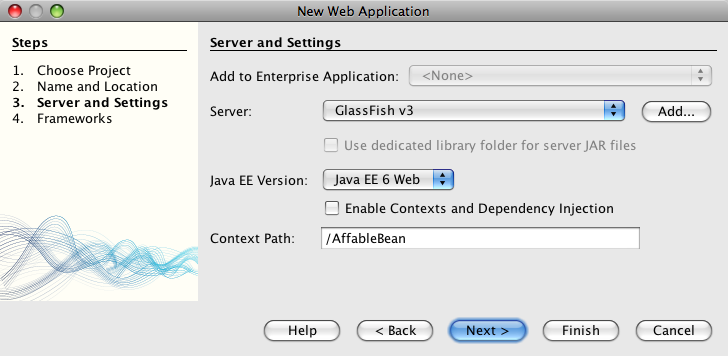
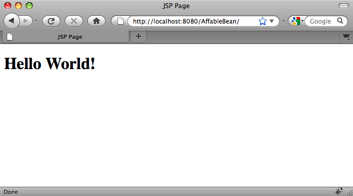
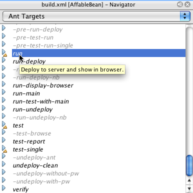

// 
//     Licensed to the Apache Software Foundation (ASF) under one
//     or more contributor license agreements.  See the NOTICE file
//     distributed with this work for additional information
//     regarding copyright ownership.  The ASF licenses this file
//     to you under the Apache License, Version 2.0 (the
//     "License"); you may not use this file except in compliance
//     with the License.  You may obtain a copy of the License at
// 
//       http://www.apache.org/licenses/LICENSE-2.0
// 
//     Unless required by applicable law or agreed to in writing,
//     software distributed under the License is distributed on an
//     "AS IS" BASIS, WITHOUT WARRANTIES OR CONDITIONS OF ANY
//     KIND, either express or implied.  See the License for the
//     specific language governing permissions and limitations
//     under the License.
//

= The NetBeans E-commerce Tutorial - Setting up the Development Environment
:jbake-type: tutorial
:jbake-tags: tutorials 
:jbake-status: published
:icons: font
:syntax: true
:source-highlighter: pygments
:toc: left
:toc-title:
:description: The NetBeans E-commerce Tutorial - Setting up the Development Environment - Apache NetBeans
:keywords: Apache NetBeans, Tutorials, The NetBeans E-commerce Tutorial - Setting up the Development Environment

== Tutorial Contents

1. xref:intro.adoc[+Introduction+]
2. xref:design.adoc[+Designing the Application+]
3. *Setting up the Development Environment*
* <<create,Creating a Web Project>>
* <<run,Running the Web Project>>
* <<communicate,Communicating with the Database Server>>
* <<seeAlso,See Also>>

[start=4]
. xref:data-model.adoc[+Designing the Data Model+]

[start=5]
. xref:page-views-controller.adoc[+Preparing the Page Views and Controller Servlet+]

[start=6]
. xref:connect-db.adoc[+Connecting the Application to the Database+]

[start=7]
. xref:entity-session.adoc[+Adding Entity Classes and Session Beans+]

[start=8]
. xref:manage-sessions.adoc[+Managing Sessions+]

[start=9]
. xref:transaction.adoc[+Integrating Transactional Business Logic+]

[start=10]
. xref:language.adoc[+Adding Language Support+]

[start=11]
. xref:security.adoc[+Securing the Application+]

[start=12]
. xref:test-profile.adoc[+Testing and Profiling+]

[start=13]
. xref:conclusion.adoc[+Conclusion+]

image::../../../../images_www/articles/68/netbeans-stamp-68-69.png[title="Content on this page applies to NetBeans IDE, versions 6.8 and 6.9"]

The following steps describe how to set up your development environment. In the process, you'll learn about some of the primary windows of the IDE and understand how the IDE uses an link:https://ant.apache.org/[+Ant+] build script to perform common actions on your project. By the end of this tutorial unit, you'll have created a web application project, and confirmed that you can successfully build the project, deploy it to your development server, and run it from the IDE.

You also learn how to connect the IDE to a MySQL database server, create database instances, and connect to database instances from the IDE's Services window. In this unit, you create a new database named `affablebean`, which you will use throughout the tutorial.

You can view a live demo of the application that you build in this tutorial: link:http://services.netbeans.org/AffableBean/[+NetBeans E-commerce Tutorial Demo Application+].

|===
|Software or Resource |Version Required 

|xref:../../../../download/index.adoc[+NetBeans IDE+] |Java bundle, 6.8 or 6.9 

|link:http://www.oracle.com/technetwork/java/javase/downloads/index.html[+Java Development Kit (JDK)+] |version 6 

|<<glassFish,GlassFish server>> |v3 or Open Source Edition 3.0.1 

|link:http://dev.mysql.com/downloads/mysql/[+MySQL database server+] |version 5.1 
|===

*Notes:*

* The NetBeans IDE requires the Java Development Kit (JDK) to run properly. If you do not have any of the resources listed above, the JDK should be the first item that you download and install.
* The NetBeans IDE Java Bundle includes Java Web and EE technologies, which are required for the application you build in this tutorial.
* The NetBeans IDE Java Bundle also includes the GlassFish server, which you require for this tutorial. You could link:http://glassfish.dev.java.net/public/downloadsindex.html[+download the GlassFish server independently+], but the version provided with the NetBeans download has the added benefit of being automatically registered with the IDE.

[[create]]
== Creating a Web Project

1. Start the NetBeans IDE. If you are running the IDE for the first time, you will see the IDE's Start Page. 

image::images/ide-start-page.png[title="The NetBeans IDE Start Page"]

[start=2]
. Click the New Project ( image:images/new-project-btn.png[] ) button (Ctrl-Shift-N; ⌘-Shift-N on Mac) to create a new Java web project. The New Project wizard opens to guide you through the process. Under Categories choose Java Web, then under Projects choose Web Application. 

image::images/new-project-wzd.png[title="Create a project using the New Project wizard"]

[start=3]
. Click Next.

[start=4]
. In Step 2: Name and Location, name the project `AffableBean`. In this step, you can also designate the location on your computer where the project will reside. By default, the IDE creates a `NetBeansProjects` folder in your home directory. If you'd like to change the location, enter the path in the Project Location text field.

[start=5]
. Click Next.

[start=6]
. In Step 3: Server and Settings, specify GlassFish v3 as the server to which your project will be deployed during development. Since you've included GlassFish v3 in your NetBeans installation, you'll see that GlassFish v3 is listed in the Server drop-down field. 

If you wanted to deploy to a server that isn't yet registered with the IDE, you would click the Add button, and step through the Add Server Instance wizard. You can view all servers registered with the IDE from the Servers window (Choose Tools > Servers from the main menu).

[start=7]
. For Java EE Version, select Java EE 6 Web. 

The application that you create makes use of various Java EE 6 features, namely servlet annotations (new in the link:http://jcp.org/en/jsr/summary?id=315[+Servlet 3.0 Specification+]), and EJBs used directly in servlet containers (new in the link:http://jcp.org/en/jsr/summary?id=318[+EJB 3.1 Specification+]). Both Servlet 3.0 and EJB 3.1 are part of the Java EE 6 platform, therefore you require an EE-6 compliant server such as GlassFish v3 to work through this tutorial. For more information, see xref:entity-session.adoc#specification[+About Specifications and Implementations+].

[start=8]
. Make sure that the 'Enable Contexts and Dependency Injection' option is deselected. This option is specific to the Contexts and Dependency Injection (CDI) technology, specified by link:http://jcp.org/en/jsr/detail?id=299[+JSR-299+], and is not used in this tutorial. For more information, see xref:../cdi-intro.adoc[+Getting Started with Contexts and Dependency Injection and JSF 2.0+]. 

 

Note that by default the context path for the application is the name of the project. This is the path at which your application can be accessed after it is deployed to the server. For example, GlassFish uses 8080 as its default port number, so during development you'll be able to access the project in a browser window from:

[source,java]
----

http://localhost:8080/AffableBean/
----

[start=9]
. Click Finish. The IDE generates a skeleton project named `AffableBean` that adheres to the link:http://java.sun.com/blueprints/code/projectconventions.html#99632[+J2EE Blueprints conventions for web application structure+]. The IDE displays various windows in its default layout. 
[.feature]
--

image::images/ide-default-layout.png[role="left", link="images/ide-default-layout.png"]

--

[start=10]
. Examine the IDE's default layout. Here's a brief overview of the displayed windows and tabs:
* *The Editor:* The editor (Ctrl-0; ⌘-0 on Mac) is the central component of the IDE, and is likely where you'll spend most of your time. The editor automatically adapts to the language you are working in, providing documentation support, code-completion, hints and error messages specific to the technology you are coding in.
* *Projects window:* The Projects window (Ctrl-1; ⌘-1 on Mac) is the entry point to your project sources. It provides a _logical view_ of important project contents, and groups files together based on their function (e.g., `Configuration Files`). When right-clicking file nodes within the Projects window, you can call actions common to your development tasks (i.e., `Build`, `Clean`, `Deploy`, `Run`).
* *Files window:* The Files window (Ctrl-2; ⌘-2 on Mac) provides a directory-based view of your project. That is, it enables you to view the structure of your project, as it exists in your computer's file system. From this window, you can view all files pertaining to your project, including the Ant build script, (`build.xml`), and files required by the IDE to handle the project (contained in the `nbproject` folder). If you've run your project, you can see the location of compiled Java files (`build` folder). If you've explicitly built your project (by choosing Build, or Clean and Build, from the project node's right-click menu in the Projects window), you can view the project's distributable WAR file (contained in the `dist` folder).
* *Navigator:* The Navigator (Ctrl-7; ⌘-7 on Mac) provides a structural overview of the file opened in the editor. For example, if an HTML web page is displayed, the Navigator lists tag nodes in a way that corresponds to the page's Document Object Model (DOM). If a Java class is opened in the editor, the Navigator displays the properties and methods pertaining to that class. You can use the Navigator to navigate to items within the editor. For example, when you double-click a node in the Navigator, your cursor is taken directly to that element in the editor.
* *Tasks window:* The Tasks window (Ctrl-6; ⌘-6 on Mac) automatically scans your code and lists lines with compile errors, quick fixes, and style warnings. For Java classes, it also lists commented lines containing words such as '`TODO`' or '`FIXME`'.
* *Services window:* The Services window (Ctrl-5; ⌘-5 on Mac) provides an interface for managing servers, web services, databases and database connections, as well as other services relating to team development.
* *Output window:* _(Not displayed)_ The Output window (Ctrl-4; ⌘-4 on Mac) automatically displays when you call an action that invokes a service, generally from an outside resource such as a server, and can mirror server log files. With web projects, it also enables you to view information related to Ant tasks (e.g., `Build`, `Clean and Build`, `Clean`).
* *Palette:* _(Not displayed)_ The Palette (Ctrl-Shift-8; ⌘-Shift-8 on Mac) provides various handy code snippets that you can drag and drop into the editor. Many of the snippets included in the Palette are also accessible by invoking code completion in the editor, as will later be demonstrated.

*Note:* All of the IDE's windows can be accessed from the Window menu item.

[[run]]
== Running the Web Project

1. Run the new `AffableBean` project. In the Projects window, you can do this by right-clicking the project node and choosing Run, otherwise, click the Run Project ( image:images/run-project-btn.png[] ) button (F6; fn-F6 on Mac) in the IDE's main toolbar. 

A browser window opens to display the project's welcome page. 

 

So what just happened? When you run a web project, the IDE invokes the `run` Ant target in your project's build script. You can investigate by opening your project's `build.xml` file in the editor.

[start=2]
. Switch to the Files window (Ctrl-2; ⌘-2 on Mac), expand the project node and double-click the `build.xml` file contained in your project. When the `build.xml` file opens in the editor, the Navigator lists all Ant targets available to the script. 

Normal Ant targets are displayed using the general target (  ) icon. The _emphasized_ Ant target ( image:images/ant-emphasized-icon.png[] ) icon merely indicates that the target includes a description, which is displayed as a tooltip (as shown in the above image). For more information, see link:http://www.oracle.com/pls/topic/lookup?ctx=nb8000&id=NBDAG366[+Creating Java Projects+] in _Developing Applications with NetBeans IDE_.

[start=3]
. Double-click the `run` target. The `build-impl.xml` file opens in the editor and displays the target definition.

[source,java]
----

<target depends="run-deploy,run-display-browser" description="Deploy to server and show in browser." name="run"/>
----
Why did the `build-impl.xml` file open when we clicked on a target from `build.xml`? If you switch back to `build.xml` (press Ctrl-Tab) and examine the file contents, you'll see the following line:

[source,java]
----

<import file="nbproject/build-impl.xml"/>
----

The project's build script is basically an empty file that imports NetBeans-defined targets from `nbproject/build-impl.xml`.

You can freely edit your project's standard `build.xml` script by adding new targets or overriding existing NetBeans-defined targets. However, you should not edit the `build-impl.xml` file.

You can see from the `run` target's definition that it depends on the following targets:
* `run-deploy`
* `run-display-browser`
Both of these targets in turn depend on other targets, which you can examine elsewhere in the `build-impl.xml` file. But essentially, the following actions take place when the `run` target is invoked:
1. The project gets compiled.
2. A WAR file is created.
3. The server starts (if it is not already running).
4. The WAR file gets deployed to the designated server.
5. The browser opens to display the server's URL and application's context path.

Consult the official link:https://ant.apache.org/manual/index.html[+Ant Manual+] for more information on using Ant.

[start=4]
. To generate a distributable WAR file for your project, choose Clean and Build Project (or Clean and Build Main Project) from the IDE's Run menu.

[start=5]
. In the Files window (Ctrl-2; ⌘-2 on Mac) expand the project node. The `dist` folder contains the project WAR file. The `build` folder contains your compiled project. 

image::images/files-window.png[title="Files window provides a directory-based view of your project"]

*Note:* If you _clean_ the project (In the Projects window, choose Clean from the project node's right-click menu), both of these folders are removed.

[start=6]
. Switch to the Services window (Ctrl-5; ⌘-5 on Mac) and expand the Servers > GlassFish Server 3 > Applications node. 

image::images/services-win-deployed-app.png[title="Services window displays server status, deployed applications and resources"]

*Note:* "GlassFish v3" is the default server name for NetBeans 6.8 users.

The green arrow icon on the GlassFish server node ( image:images/gf-server-running-node.png[] ) indicates that the server is running. The Applications folder lists all deployed applications; you can see that the `AffableBean` application has been successfully deployed.

At this stage, you've created a Java web project in the IDE, and have confirmed that it can be successfully built and deployed to your development server, and opened in a browser when run.

[[communicate]]
== Communicating with the Database Server

Once you've downloaded and installed the MySQL database server, you can connect to it from the IDE. A default installation uses '`root`' and '' (an empty string) as the user account and password to connect to the database server. However, due to connectivity issues with GlassFish, it is recommended that you use an account with a non-empty password.^<<footnote1,[1]>>^ The following instructions demonstrate how to run the database server and change the password for the `root` account to '`nbuser`' from the MySQL command-line. The '`root`' / '`nbuser`' combination is used throughout the NetBeans E-commerce Tutorial. With the database server running and properly configured, you register it in the IDE and create a database instance.

*Note:* The command-line instructions below assume that you have added the `mysql` command to your `PATH` environment variable. (If you haven't, you'll receive a '`mysql: command not found`' error when entering `mysql` commands in your command-line.) 

If you haven't added `mysql` to your `PATH`, you can instead call the command by entering the full path to your MySQL installation's `bin` directory. For example, if the `mysql` command is located on your computer at `/usr/local/mysql/bin`, you would enter the following:

[source,java]
----

shell> */usr/local/mysql/bin/*mysql -u root
----

For more information, see the offical MySQL Reference Manual:

* link:http://dev.mysql.com/doc/refman/5.1/en/general-installation-issues.html[+2.1. General Installation Guidance+]
* link:http://dev.mysql.com/doc/refman/5.1/en/default-privileges.html[+2.13.2. Securing the Initial MySQL Accounts+]
* link:http://dev.mysql.com/doc/refman/5.1/en/invoking-programs.html[+4.2.1. Invoking MySQL Programs+]
* link:http://dev.mysql.com/doc/refman/5.1/en/setting-environment-variables.html[+4.2.4. Setting Environment Variables+]

Perform the following steps.

* <<check,Check if the MySQL Server is Running>>
* <<start,Start the Database Server>>
* <<password,Change the Password>>
* <<register,Register the Server in the IDE>>
* <<database,Create a Database Instance>>

[[check]]
=== Check if the MySQL Server is Running

Before connecting to the MySQL server from the IDE, you need to make sure the server is running. One way to do this is by using the link:http://dev.mysql.com/doc/refman/5.1/en/mysqladmin.html[+`mysqladmin`+] client's `ping` command.

1. Open a command-line prompt and type in the following:

[source,java]
----

shell> mysqladmin ping
----
If the server is running, you will see output similar to the following:

[source,java]
----

mysqld is alive
----
If the server is not running, you'll see output similar to the following:

[source,java]
----

mysqladmin: connect to server at 'localhost' failed
error: 'Can't connect to local MySQL server through socket '/tmp/mysql.sock'
Check that mysqld is running and that the socket: '/tmp/mysql.sock' exists!
----

[[start]]
=== Start the Database Server

In the event that your MySQL server is not running, you can start it from the command-line. See link:http://dev.mysql.com/doc/refman/5.1/en/automatic-start.html[+2.13.1.2. Starting and Stopping MySQL Automatically+] for a brief, cross-platform overview. The following steps provide general guidance depending on your operating system.

==== Unix-like systems:

For Unix-like systems, it is recommended to start the MySQL server by invoking link:http://dev.mysql.com/doc/mysql-startstop-excerpt/5.1/en/mysqld-safe.html[+`mysqld_safe`+].

1. Open a command-line prompt and run the `mysqld_safe` command:

[source,java]
----

shell> sudo ./mysqld_safe
----
You will see output similar to the following:

[source,java]
----

090906 02:14:37 mysqld_safe Starting mysqld daemon with databases from /usr/local/mysql/data
----

==== Windows:

The MySQL Windows installer enables you to install the database server as a Windows service, whereby MySQL starts and stops automatically with the operating system. If you need to start the database manually, run the link:http://dev.mysql.com/doc/mysql-startstop-excerpt/5.1/en/mysqld.html[+`mysqld`+] command from the installation directory's `bin` folder.

1. Open a Windows console window (from the Start menu, choose Run and type `cmd` in the text field). A command-line window displays.
2. Enter this command (The indicated path assumes you have installed version 5.1 to the default install location):

[source,java]
----

C:\> "C:\Program Files\MySQL\MySQL Server 5.1\bin\mysqld"
----

For more information, refer to the official MySQL Reference Manual: link:http://dev.mysql.com/doc/refman/5.1/en/windows-start-command-line.html[+2.4.5.5. Starting MySQL from the Windows Command Line+].

[[password]]
=== Change the Password

To set the `root` account's password to '`nbuser`', perform the following steps.

1. Open a command-line prompt and type in the following:

[source,java]
----

shell> mysql -u root
mysql> UPDATE mysql.user SET Password = PASSWORD('nbuser') WHERE User = 'root';
mysql> FLUSH PRIVILEGES;
----

For more information, see the official MySQL Reference Manual: link:http://dev.mysql.com/doc/refman/5.1/en/default-privileges.html[+2.13.2. Securing the Initial MySQL Accounts+].

[[register]]
=== Register the Server in the IDE

The IDE's Services window enables you to connect to the server, start and stop the server, view database instances and the data they contain, as well as run an external administration tool on the server.

1. In the Services window, right-click the Databases node and choose Register MySQL Server. 

image::images/register-mysql-server.png[title="Register a MySQL server in the IDE's Services window"] 

In the MySQL Server Properties dialog, under the Basic Properties tab, you can see the default settings for the MySQL server installation. These are:
* *Server Host Name:* `localhost`
* *Server Port Number:* `3306`
* *Administrator User Name:* `root`
* *Administrator Password:* `nbuser`

[start=2]
. Select the Save Password option. 

image::images/mysql-server-properties.png[title="Specify MySQL server settings"]

[start=3]
. Click OK. The IDE connects to your MySQL database server, and lists database instances that are maintained by the server. If you expand the Drivers node, you can also see that the IDE contains the link:http://dev.mysql.com/doc/refman/5.1/en/connector-j.html[+Connector/J JDBC driver+] for MySQL. 

image::images/services-win-mysql.png[title="Connect to a MySQL server in the Services window"] 

The application server (i.e., GlassFish) requires the driver to enable communication between your Java code and the the MySQL database. Because the IDE already contains the Connector/J driver, you do not need to download it. Furthermore, as will later be demonstrated, you can specify in your server settings to enable JDBC driver deployment so that the driver will be automatically deployed to GlassFish if it is missing on the server. 

Steps 4-7 below are optional. You can configure the IDE to start and stop the MySQL server, as well as run an external administration tool on the server.

[start=4]
. Right-click the MySQL server node and choose Properties. In the MySQL Server Properties dialog, select the Admin Properties tab.

[start=5]
. In the 'Path/URL to admin tool' field, enter the path on your computer to the executable file of a database administration tool, such as link:http://dev.mysql.com/doc/administrator/en/mysql-administrator-introduction.html[+MySQL Administrator+]. The MySQL Administrator is included in the link:http://dev.mysql.com/downloads/gui-tools/[+MySQL GUI Tools+] bundle.

[start=6]
. In the 'Path to start command' field, type in the path to the MySQL start command (i.e., `mysqld` or `mysqld_safe`, depending on your operating system. (See <<start,Start the Database Server>> above.) 

*Note:* For Unix-like systems, you may find that you can only invoke the start command with root or administrative privileges. To overcome this, you can create a script (using link:http://www.nongnu.org/gksu/[+GKSu+] for Linux and Solaris, link:http://developer.apple.com/mac/library/documentation/Darwin/Reference/ManPages/man1/osascript.1.html[+osascript+] for Mac) that will accomplish this task. For more information, see link:http://davidvancouvering.blogspot.com/2008/09/starting-mysql-in-netbeans-as.html[+this blog post+].

[start=7]
. In the 'Path to stop command' field, enter the path to the MySQL stop command (i.e., `mysqladmin shutdown`). Because the command requires a user account with shutdown privileges, you must enter username/password credentials in the Arguments field. For example:
* *Arguments:* `-u root -pnbuser shutdown`

After you have set the fields listed under the Advanced Properties tab, you can:

* *Start the MySQL server:* Right-click the MySQL server node and choose Start.
* *Stop the MySQL server:* Right-click the MySQL server node and choose Stop.
* *Run the external administration tool:* Right-click the MySQL server node and choose Run Administration Tool.

[[database]]
=== Create a Database Instance

1. Create the database instance which you will use in this tutorial. To do so, right-click the MySQL Server node and choose Create Database.
2. In the dialog that displays, type in `affablebean`. Select the 'Grant Full Access to' option, then select `root@localhost` from the drop-down field. This enables the `root` account on the `localhost` host access to the database. Later, when you create a connection pool on the server, you'll need to provide the `root` account and `nbuser` password as username/password credentials in order to grant the server access to the database. 

image::images/create-mysql-db-dialog.png[title="Right-click the server node and choose Create Database to create a new database instance"]

[start=3]
. Click OK. When you do so, the database named `affablebean` is created, and a connection to the database is automatically established. Connections are displayed in the Services window using a connection node ( image:images/db-connection-node.png[] ).

*Note:* Connection nodes are persisted in the Services window. If you restart the IDE, the connection node displays with a jagged line (  ), indicating that the connection is broken. To reconnect to a database, make sure that the database server is running, then right-click the node and choose Connect.

[start=4]
. Expand the connection node for the `affablebean` database. The connection contains the database's default schema (`affablebean`), and within that are nodes for tables, views, and procedures. Currently these are empty since we haven't created anything yet. 

image::images/db-conn-affable-bean.png[title="Database connections contain the database's default schema and nodes for tables, views and procedures"]

At this stage, you've connected to the MySQL server from the IDE and have created a new database named `affablebean` which you'll use throughout the tutorial. Also, you've created a Java web project in the IDE, and have confirmed that it can be successfully built and deployed to your development server, and opened in a browser when run. Now that your development environment is ready, you can begin drafting the application's data model.

xref:../../../../community/mailing-lists.adoc[Send Feedback on This Tutorial]

[[seeAlso]]
== See Also

=== NetBeans Resources

* xref:../../java/project-setup.adoc[+Creating, Importing, and Configuring Java Projects+]
* xref:../../../articles/mysql.adoc[+MySQL and NetBeans IDE+]
* xref:../../ide/mysql.adoc[+Connecting to a MySQL Database+]
* xref:../../web/mysql-webapp.adoc[+Creating a Simple Web Application Using a MySQL Database+]

=== External Resources

* link:https://ant.apache.org/manual/index.html[+Apache Ant User Manual+]
* link:https://ant.apache.org/manual/tutorial-HelloWorldWithAnt.html[+Hello World with Ant+]
* link:http://dev.mysql.com/doc/refman/5.1/en/[+MySQL 5.1 Reference Manual+]
* link:http://dev.mysql.com/doc/administrator/en/index.html[+MySQL Administrator Reference Manual+]

=== Books

* xref:../../../articles/books.adoc[+NetBeans Books+]
* link:http://www.apress.com/book/view/1590598954[+Pro NetBeans IDE 6 Rich Client Platform Edition+]
* link:http://apress.com/book/view/1430219548[+Beginning Java EE 6 Platform with GlassFish 3: From Novice to Professional+]

== References

1. <<1,^>> Using GlassFish v3, you can create a connection pool to a MySQL database server using an empty password. GlassFish Open Source Edition 3.0.1, included with NetBeans IDE 6.9, does not enable a connection using an empty password. See link:http://glassfish.dev.java.net/issues/show_bug.cgi?id=12221[+GlassFish Issue 12221+].
