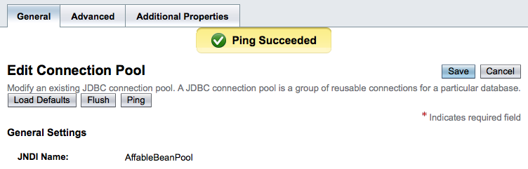
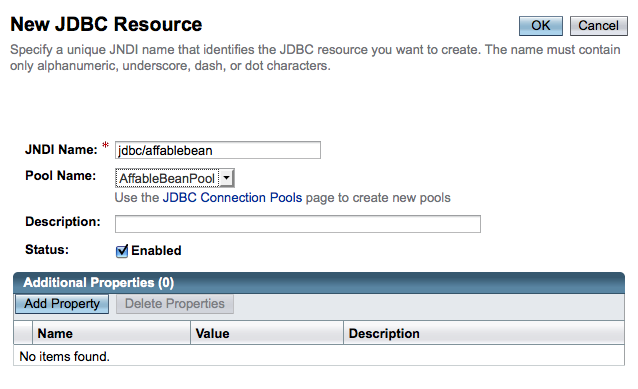

// 
//     Licensed to the Apache Software Foundation (ASF) under one
//     or more contributor license agreements.  See the NOTICE file
//     distributed with this work for additional information
//     regarding copyright ownership.  The ASF licenses this file
//     to you under the Apache License, Version 2.0 (the
//     "License"); you may not use this file except in compliance
//     with the License.  You may obtain a copy of the License at
// 
//       http://www.apache.org/licenses/LICENSE-2.0
// 
//     Unless required by applicable law or agreed to in writing,
//     software distributed under the License is distributed on an
//     "AS IS" BASIS, WITHOUT WARRANTIES OR CONDITIONS OF ANY
//     KIND, either express or implied.  See the License for the
//     specific language governing permissions and limitations
//     under the License.
//

= The NetBeans E-commerce Tutorial - Setup Instructions
:jbake-type: tutorial
:jbake-tags: tutorials 
:jbake-status: published
:icons: font
:syntax: true
:source-highlighter: pygments
:toc: left
:toc-title:
:description: The NetBeans E-commerce Tutorial - Setup Instructions - Apache NetBeans
:keywords: Apache NetBeans, Tutorials, The NetBeans E-commerce Tutorial - Setup Instructions

== Tutorial Contents

1. xref:intro.adoc[+Introduction+]
2. xref:design.adoc[+Designing the Application+]
3. xref:setup-dev-environ.adoc[+Setting up the Development Environment+]
4. xref:data-model.adoc[+Designing the Data Model+]
5. xref:page-views-controller.adoc[+Preparing the Page Views and Controller Servlet+]
6. xref:connect-db.adoc[+Connecting the Application to the Database+]
7. xref:entity-session.adoc[+Adding Entity Classes and Session Beans+]
8. xref:manage-sessions.adoc[+Managing Sessions+]
9. xref:transaction.adoc[+Integrating Transactional Business Logic+]
10. xref:language.adoc[+Adding Language Support+]
11. xref:security.adoc[+Securing the Application+]
12. xref:test-profile.adoc[+Testing and Profiling+]
13. xref:conclusion.adoc[+Conclusion+]

image::../../../../images_www/articles/68/netbeans-stamp-68-69.png[title="Content on this page applies to NetBeans IDE, versions 6.8 and 6.9"]

If you want to follow a tutorial unit without having completed previous units, you need to perform some preliminary steps in order to set up your development environment.

1. *Set up your MySQL database server.* Follow the steps outlined in: xref:setup-dev-environ.adoc#communicate[+Communicating with the Database Server+].
2. *Create the `affablebean` schema on the database server, and populate the database with sample data:*
.. Click on link:https://netbeans.org/projects/samples/downloads/download/Samples%252FJavaEE%252Fecommerce%252Faffablebean.sql[+affablebean.sql+] and copy (Ctrl-C; ⌘-C on Mac) the entire contents of the file.
.. Open the IDE's SQL editor. In the Services window (Ctrl-5; ⌘-5 on Mac), right-click the `affablebean` database connection ( image:images/db-connection-node.png[] ) node and choose Execute Command. 

image::images/execute-command.png[title="Choose Execute Command from a connection node to open the IDE's SQL editor"] 

The IDE's SQL editor opens.

[start=3]
. Paste (Ctrl-V; ⌘-V on Mac) the entire contents of the `affablebean.sql` file into the editor.

[start=4]
. Click the Run SQL (  ) button in the editor's toolbar. The script runs on your MySQL server. Tables are generated for the database, and sample data is added to the `product` and `category` tables.

[start=3]
. *Create a connection pool and JDBC resource on GlassFish.*
1. In the Services window (Ctrl-5; ⌘-5 on Mac), expand the Servers > GlassFish Server 3 node and choose Properties. In the Servers window that displays, make sure the 'Enable JDBC Driver Deployment' option is selected. If your project requires the MySQL link:http://www.mysql.com/downloads/connector/j/[+Connector/J+] driver, this option will ensure that the driver is deployed to GlassFish when your project is deployed. (If the server is already running, you'll need to restart the server.)
2. In the Services window, right-click the GlassFish Server 3 node and choose Start.
3. Once the server is running, right-click the GlassFish Server 3 node and choose View Admin Console.
4. Log into the console (default username/password is: `admin/adminadmin`).
5. In the Admin Console, in the Tree on the left, expand the Resources > JDBC node, then click the Connection Pools node.
6. In the Connection Pools interface, click the New button, and enter the following details:
* *Name:* `AffableBeanPool`
* *Resource Type:* `javax.sql.ConnectionPoolDataSource`
* *Database Vendor:* `MySql`

image::images/connection-pool.png[title="Specify settings to create a connection pool that connects with a MySQL database"]

[start=7]
. Click Next. Accept all defaults and click Finish.

[start=8]
. In the Connection Pools interface, click on your newly created `AffableBeanConnectionPool` to make the following change under the General tab:
* *Datasource Classname:* `com.mysql.jdbc.jdbc2.optional.MysqlDataSource`

image::images/datasource-classname.png[title="Set the datasource classname for the connection pool"]

[start=9]
. Click Save.

[start=10]
. Click the Additional Properties tab and ensure that the following three properties have been set. (There may be other properties listed - these are default settings, however the following three must be set manually.)
* *User:* `root`
* *Password:* `nbuser`
* *URL:* `jdbc:mysql://localhost:3306/affablebean`

image::images/additional-properties.png[title="Set username, password and url to the database"]

[start=11]
. Click Save.

[start=12]
. Click the General tab, then click Ping. You should see a message indicating that the ping succeeded. The `AffableBeanPool` connection pool can now connect to your MySQL database server. 

[start=13]
. In the Admin Console's Tree in the left column, click the Resources > JDBC > JDBC Resources node. The JDBC Resources interface opens in the main window.

[start=14]
. Click the New button to create a new JDBC resource, then enter the following details:
* *JNDI Name:* `jdbc/affablebean`
* *Connection Pool:* `AffableBeanPool`

[start=15]
. Click OK.

You have set up the MySQL server and can connect to it from the IDE's Services window. You created a database named `affablebean`, and populated the database's `product` and `category` tables with sample data. You then started the GlassFish server, and created a connection pool that enables the server to connect to the `affablebean` database. Finally, you created a JDBC resource which your application can use to reference the server's connection pool.

You can now open and run any of the project snapshots provided for you in the tutorial units.

xref:../../../../community/mailing-lists.adoc[Send Feedback on This Tutorial]

