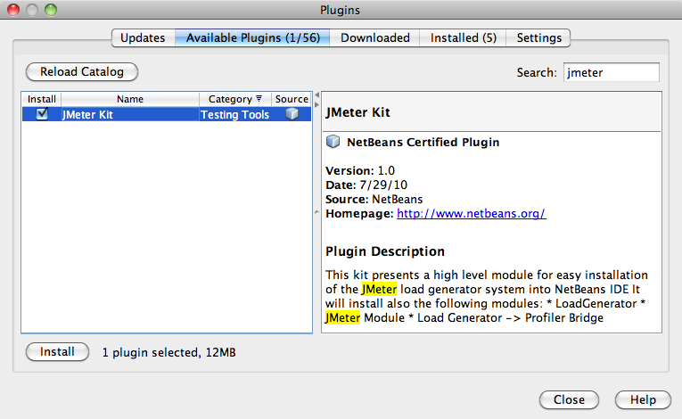
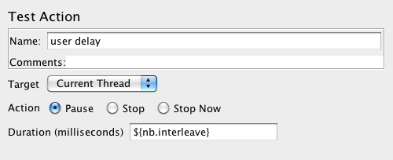
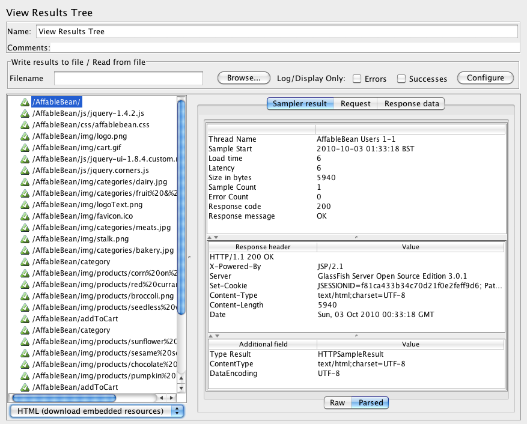
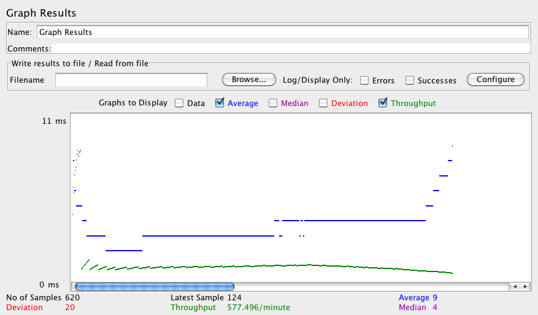
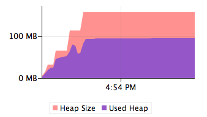
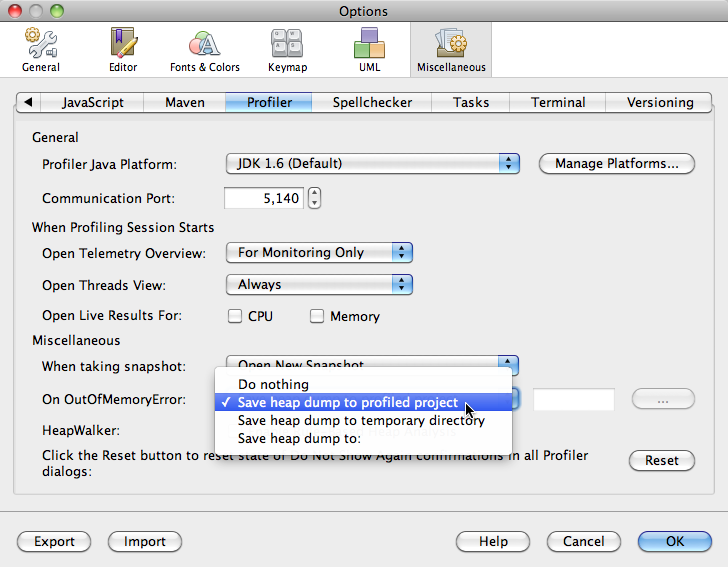

// 
//     Licensed to the Apache Software Foundation (ASF) under one
//     or more contributor license agreements.  See the NOTICE file
//     distributed with this work for additional information
//     regarding copyright ownership.  The ASF licenses this file
//     to you under the Apache License, Version 2.0 (the
//     "License"); you may not use this file except in compliance
//     with the License.  You may obtain a copy of the License at
// 
//       http://www.apache.org/licenses/LICENSE-2.0
// 
//     Unless required by applicable law or agreed to in writing,
//     software distributed under the License is distributed on an
//     "AS IS" BASIS, WITHOUT WARRANTIES OR CONDITIONS OF ANY
//     KIND, either express or implied.  See the License for the
//     specific language governing permissions and limitations
//     under the License.
//

= The NetBeans E-commerce Tutorial - Testing and Profiling
:jbake-type: tutorial
:jbake-tags: tutorials 
:jbake-status: published
:icons: font
:syntax: true
:source-highlighter: pygments
:toc: left
:toc-title:
:description: The NetBeans E-commerce Tutorial - Testing and Profiling - Apache NetBeans
:keywords: Apache NetBeans, Tutorials, The NetBeans E-commerce Tutorial - Testing and Profiling
include::../../../../inc/database.adoc[]

== Tutorial Contents

1. xref:intro.adoc[+Introduction+]
2. xref:design.adoc[+Designing the Application+]
3. xref:setup-dev-environ.adoc[+Setting up the Development Environment+]
4. xref:data-model.adoc[+Designing the Data Model+]
5. xref:page-views-controller.adoc[+Preparing the Page Views and Controller Servlet+]
6. xref:connect-db.adoc[+Connecting the Application to the Database+]
7. xref:entity-session.adoc[+Adding Entity Classes and Session Beans+]
8. xref:manage-sessions.adoc[+Managing Sessions+]
9. xref:transaction.adoc[+Integrating Transactional Business Logic+]
10. xref:language.adoc[+Adding Language Support+]
11. xref:security.adoc[+Securing the Application+]
12. *Testing and Profiling*
* <<test,Testing with JMeter>>
* <<profile,Using the NetBeans Profiler>>
* <<glassFishTune,Tuning the GlassFish Server>>
* <<seeAlso,See Also>>

[start=13]
. xref:conclusion.adoc[+Conclusion+]

image::../../../../images_www/articles/68/netbeans-stamp-68-69.png[title="Content on this page applies to NetBeans IDE, versions 6.8 and 6.9"]

Before delivering any application, it is important to ensure that it functions properly, and that it can perform acceptably for the demands expected of it. Web applications, especially e-commerce applications, by their very nature provide concurrent access to shared resources. In other words, the servers on which they are hosted must be able to respond to multiple users requesting the same resources over the same period of time. Be mindful of this fact when during development your application appears to behave correctly as you click through web pages in your browser. How will the application perform when handling 100 users simultaneously? Are there memory leaks that will degrade the server's performance after the application has been running for long periods of time? What steps can you take to ensure that your production server best handles traffic to your application?

This tutorial unit is designed to introduce you to the IDE's support for testing and profiling. You begin by installing the JMeter Kit plugin, which enables you to create test plans and open them in link:http://jakarta.apache.org/jmeter/[+Apache JMeter+] from the IDE. You then create a basic test plan in JMeter, and proceed by exploring the tool's capacity for functional and performance testing. Finally, you explore the IDE's Profiler, and use it to examine GlassFish' memory consumption while you run the JMeter test plan against the `AffableBean` application over an extended period of time. This unit concludes by presenting various tips that enable you to tune the GlassFish server for your application in a production environment.

You can view a live demo of the application that you build in this tutorial: link:http://services.netbeans.org/AffableBean/[+NetBeans E-commerce Tutorial Demo Application+].

|===
|Software or Resource |Version Required 

|xref:../../../../download/index.adoc[+NetBeans IDE+] |Java bundle, 6.8 or 6.9 

|link:http://www.oracle.com/technetwork/java/javase/downloads/index.html[+Java Development Kit (JDK)+] |version 6 

|<<glassFish,GlassFish server>> |v3 or Open Source Edition 3.0.1 

|<<jmeter,JMeter>> |2.2 or more recent 

|link:http://dev.mysql.com/downloads/mysql/[+MySQL database server+] |version 5.1 

|link:https://netbeans.org/projects/samples/downloads/download/Samples%252FJavaEE%252Fecommerce%252FAffableBean_complete.zip[+AffableBean project+] |complete version 
|===

*Notes:*

* The NetBeans IDE requires the Java Development Kit (JDK) to run properly. If you do not have any of the resources listed above, the JDK should be the first item that you download and install.
* The NetBeans IDE Java Bundle includes Java Web and EE technologies, which are required for the application you build in this tutorial.
* The NetBeans IDE Java Bundle also includes the GlassFish server, which you require for this tutorial. You could link:http://glassfish.dev.java.net/public/downloadsindex.html[+download the GlassFish server independently+], but the version provided with the NetBeans download has the added benefit of being automatically registered with the IDE.
* You can follow this tutorial unit without having completed previous units. To do so, see the xref:setup.adoc[+setup instructions+], which describe how to prepare the database and establish connectivity between the IDE, GlassFish, and MySQL.
* *You do not need to download JMeter for its use in this tutorial.* Instead, you install the NetBeans JMeter Kit plugin, which includes the JMeter distribution. You will therefore require an Internet connection at the point when you install the plugin in the tutorial. JMeter can be downloaded independently from link:http://jakarta.apache.org/site/downloads/downloads_jmeter.cgi[+http://jakarta.apache.org/site/downloads/downloads_jmeter.cgi+].
* The JMeter Kit plugin for NetBeans 6.8 installs JMeter version 2.2 (released June 2006). The plugin for NetBeans 6.9 installs JMeter version 2.4 (released July 2010). There is a significant difference between these two versions.

[[test]]
== Testing with JMeter

Begin by examining the `AffableBean` tutorial application. Then install the JMeter Kit plugin using the IDE's Plugins Manager. Launch JMeter from the IDE, and proceed by creating a test plan based on the tutorial xref:design.adoc#mockups[+use-case+]. Finally, explore some of JMeter's facilities for functional and load testing.

* <<install,Install the JMeter Kit Plugin>>
* <<createTestPlan,Create a Test Plan>>
* <<loadTest,Load Testing>>
* <<stressTest,Stress Testing>>

[[install]]
=== Install the JMeter Kit Plugin

1. Open the link:https://netbeans.org/projects/samples/downloads/download/Samples%252FJavaEE%252Fecommerce%252FAffableBean_complete.zip[+`AffableBean` project+] in the IDE. Click the Open Project ( image:images/open-project-btn.png[] ) button and use the wizard to navigate to the location on your computer where you downloaded the project.
2. Run the project ( image:images/run-project-btn.png[] ) to ensure that it is properly configured with your database and application server. 

If you receive an error when running the project, revisit the xref:setup.adoc[+setup instructions+], which describe how to prepare the database and establish connectivity between the IDE, GlassFish, and MySQL. If you want to log into the project's administration console (not required in this tutorial unit), you'll need to create a user named `nbuser` on the GlassFish server. This task is described in Unit 11, xref:security.adoc#createUsers[+Securing the Application: Create Users and/or Groups on the Server+].

[start=3]
. Open the IDE's Plugins Manager by choosing Tools > Plugins from the main menu. Select the Available Plugins tab, then type in '`jmeter`' into the Search field. When you see JMeter Kit displayed from the filtered results, select it by clicking the checkbox under the Install column. 

[start=4]
. Click Install. The IDE's installer informs you that two plugins will be installed: The JMeter Kit and the Load Generator, which provides a generic infrastructure for load generator engines registered in the IDE. 

image::images/ide-installer.png[title="Plugins dependencies are automatically included during installation"]

[start=5]
. Click Next. Accept the license agreement, then click Install. 

You require an Internet connection to download the selected plugins.

The installer downloads, verifies, and installs the plugins. When installation has successfully completed, click Finish to exit the installer, then click Close to close the Plugins Manager.

[start=6]
. In the Projects window, note that a new Load Generator Scripts node displays in your project. 

image::images/load-generator-scripts.png[title="The Load Generator plugin enables you to access scripts from the Projects window"] 

If you open the Files window (Ctrl-2; ⌘-2 on Mac), you'll see a new `jmeter` folder added to the project. (Recall that the Files window provides a directory-based view of projects, i.e., it displays the folder structure of projects as they exist on your computer's file system.) The `jmeter` folder corresponds to the Project window's Load Generator Scripts node, and will contain any load scripts that you later add to the project.

[[createTestPlan]]
=== Create a Test Plan

To demonstrate how to create a test plan in JMeter, we'll base our plan on the tutorial use-case, which was presented in xref:design.adoc#mockups[+Designing the Application+]. A list of user-initiated requests to the server, based on the given use-case, might look something like the following:

|===
|Use-Case |Server Request 

|_Customer visits the welcome page..._ |`/AffableBean/` 

|_...and selects a product category._ |`/AffableBean/category` 

|_Customer browses products within the selected category page, then adds a product to his or her shopping cart._ |`/AffableBean/addToCart` 

|_Customer continues shopping and selects a different category._ |`/AffableBean/category` 

|_Customer adds several products from this category to shopping cart._ |`/AffableBean/addToCart`
`/AffableBean/addToCart` 

|_Customer selects 'view cart' option..._ |`/AffableBean/viewCart` 

|_...and updates quantities for cart products in the cart page._ |`/AffableBean/updateCart` 

|_Customer verifies shopping cart contents and proceeds to checkout._ |`/AffableBean/checkout` 

|_In the checkout page, customer views the cost of the order and other information, fills in personal data, then submits his or her details._ |`/AffableBean/purchase` 

|_The order is processed and customer is taken to a confirmation page. The confirmation page provides a unique reference number for tracking the customer order, as well as a summary of the order._ |(n/a) 
|===

Let's proceed by creating a JMeter test plan that follows the above list of requests.

1. Click the New File ( image:images/new-file-btn.png[] ) button in the IDE's toolbar. (Alternatively, press Ctrl-N; ⌘-N on Mac.)
2. Under Categories, select *Load Testing Scripts*. 

Instead of scrolling to the bottom of the list, simply begin typing '`load`'. As shown in the image below, the Load Testing Scripts category displays. 

image::images/file-wizard-load.png[title="You can filter category entries by typing the category you are searching for"]

[start=3]
. Expand the Load Testing Scripts category and select *JMeter Plans*. Under File Types, select *New JMeter Plan*, then click Next.

[start=4]
. Name the plan `useCaseTest`, then click Finish. The new test plan displays in the Projects window. 

image::images/use-case-test.png[title="JMeter test plans display under Load Testing Scripts in the Projects window"]

[start=5]
. To begin customizing the plan in JMeter, right-click the `useCaseTest.jmx` node and choose External Edit. JMeter opens. 

image::images/jmeter.png[title="NetBeans template plan is provided when opening JMeter"]

*Note:* The NetBeans template plan includes various user-defined variables, as shown in the above image. Usage of several of these variables will become clear as we work with the test plan. For more information, see the Apache JMeter User's Manual: link:http://jakarta.apache.org/jmeter/usermanual/component_reference.html#User_Defined_Variables[+18.4.13 User Defined Variables+].

[start=6]
. Click the HTTP Request Defaults node in the left column. The link:http://jakarta.apache.org/jmeter/usermanual/component_reference.html#HTTP_Request_Defaults[+HTTP Request Defaults+] panel enables you to set default values for all HTTP requests invoked from your test plan. Note that the entries for Server Name and Port Number are `${nb.server}` and `${nb.port}`, respectively. From the image above, you see that these equate to `localhost` and `8080`, which you typically use when deploying NetBeans projects to GlassFish.

[start=7]
. Click the Thread Group node in the left column. In JMeter, a "thread" refers to a user. Let's rename the Thread Group to `AffableBean` `Users`. Type '`AffableBean` `Users`' into the Name field under Thread Group. 

Let's begin recording requests for the test plan. To do so, we'll use JMeter's link:http://jakarta.apache.org/jmeter/usermanual/component_reference.html#HTTP_Proxy_Server[+HTTP Proxy Server+]. Instead of entering test plan requests manually, we'll run the proxy server and have it record requests sent from the browser. For large test plans this technique is invaluable.

[start=8]
. In the left column, right-click WorkBench and choose Add > Non-Test Elements > HTTP Proxy Server.

[start=9]
. In the HTTP Proxy Server panel, change the port number from `8080` to another, random number, for example `9090`. JMeter provides `8080` as its default port number for the proxy server. However, the GlassFish server also occupies the `8080` port, so we're modifying the proxy server's port number to avoid a port conflict.

[start=10]
. In the Grouping drop-down list, select 'Put each group in a new controller'. Also, deselect the 'Capture HTTP Headers' option. We do not require header information for each recorded request. 

image::images/http-proxy-server.png[title="Configure the proxy server"] 

Note that the 'Use Recording Controller' option is selected by default for the Target Controller field. When you begin recording requests, they will be stored in the Recording Controller that is listed in the left column.

[start=11]
. Switch to your browser and temporarily change its port number to `9090`. 

If you have previously configured your browser's proxy, remember your settings so that you may be able to reenter them after completing this exercise.

In Firefox, you can do this from the Options window (Preferences window on Mac).
* Choose Tools > Options (Firefox > Preferences on Mac).
* Select the Advanced > Network tabs.
* Under the Connection heading, click Settings.
* Select the 'Manual proxy configuration' option, then type in `localhost` and `9090` for the HTTP Proxy and Port fields, respectively.
* Remove the `127.0.0.1` and `localhost` entries in the 'No Proxy for' field. 

image::images/firefox-proxy.png[title="Specify 'localhost:9090' and remove entries in the 'No Proxy for' field"]

* Click OK.

[start=12]
. Clear your browser's cache before you begin recording requests. You want to make sure that the HTTP Proxy Server is able to record all resources required for displaying pages in the Affable Bean website, including images, JavaScript scripts and CSS stylesheets. 

In Firefox, you can do this by pressing Ctrl-Shift-Del (⌘-Shift-Del on Mac) to open the Clear Recent History dialog. Under 'Time range to clear', ensure that you've selected a range that extends to the first time the browser accessed the Affable Bean website. Select Cache, then click Clear Now. 

image::images/ff-clear-recent-history.png[title="Clear your browser's cache before proceeding with recording"]

[start=13]
. Return to the JMeter Test Plan panel (<<testPlanPanel,shown above>>) and change the values for `nb.users` and `nb.rampup` to `99`. 

image::images/user-defined-variables.png[title="Double-click into User Defined Variables table to modify variables"] 

The reason this is recommended is that JMeter automatically inserts user-defined variables throughout the test plan, wherever their values occur. So, for example, when the URL for `/AffableBean/js/jquery-1.4.2.js` is encountered, it will be recorded as: `AffableBean/js/jquery-1.4.*${nb.users}*.js`. Later, when we modify the value and rerun the test plan, URLs such as this will also change, which is not desired behavior. Here, we enter a random value (`99`), since we don't expect it to occur in the URLs that we are about to record.

[start=14]
. Return to the HTTP Proxy Server panel, then at the bottom of the panel, click the Start button. JMeter's proxy server is now listening on port 9090.

[start=15]
. Run the project ( image:images/run-project-btn.png[] ) from the IDE. The project is deployed to GlassFish, and the welcome page opens in the browser.

[start=16]
. Switch to JMeter and inspect the Recording Controller in the left column. All of the requests generated for accessing the welcome page are listed under the Recording Controller in a node named after the first request (i.e., `/AffableBean/`). 

image::images/recording-controller.png[title="Request grouping for welcome page displayed under Recording Controller"] 

If you inspect the `/AffableBean/` node, you'll note that it is a link:http://jakarta.apache.org/jmeter/usermanual/component_reference.html#Simple_Controller[+Simple Controller+]. Although dubbed a "Controller", the Simple Controller doesn't offer any functionality beyond enabling you to group elements together - as demonstrated here.

[start=17]
. Return to the browser and continue clicking through the website according to the use-case <<useCase,outlined above>>. You can select any of the categories and products. Stop when you reach the checkout page - the proxy server will not be able to record requests sent over HTTPS.^<<footnote1,[1]>>^ 

The elements within the Recording Controller will look as follows. 

image::images/recording-controller2.png[title="Requests according to use-case listed under Recording Controller"]

[start=18]
. Stop the proxy server. Click the Stop button in JMeter's HTTP Proxy Server panel.

[start=19]
. In your browser, change the proxy configuration so that it no longer uses port 9090. In Firefox for example, return to the proxy configuration window (<<ff-proxy-config,displayed above>>) and select No Proxy.

[start=20]
. Manually create the request for `/AffableBean/purchase`. Perform the following steps:
1. Click the Simple Controller in JMeter's left column, then press Ctrl-X (⌘-X on Mac) to cut the element.
2. Click the Recording Controller, then press press Ctrl-V (⌘-V on Mac) to paste the element. The Simple Controller now displays beneath the `/AffableBean/checkout` request.
3. Click the Simple Controller node, then in its main panel rename the controller to `/AffableBean/purchase`.
4. Right-click the new `/AffableBean/purchase` node and choose Add > Sampler > link:http://jakarta.apache.org/jmeter/usermanual/component_reference.html#HTTP_Request[+HTTP Request+].
5. Click the new HTTP Request node, then in its main panel configure it as follows:
* *Name:* `/AffableBean/purchase`
* *Server Name or IP:* `${nb.server}`
* *Port Number:* `8181`
* *Protocol:* `https`
* *Method:* `POST`
* *Path:* `/AffableBean/purchase`

[start=6]
. Under 'Send Parameters With the Request', click the Add button and create the following entries:
|===

|Name |Value |Encode? |Include Equals? 

|`name` |`Benjamin Linus` |✓ |✓ 

|`email` |`b.linus@lost.com` |✓ |✓ 

|`phone` |`222756448` |✓ |✓ 

|`address` |`Družstevní 77` |✓ |✓ 

|`cityRegion` |`4` |✓ |✓ 

|`creditcard` |`4444222233331111` |✓ |✓ 
|===

image::images/http-request.png[title="Configure an HTTP Request for HTTPS connection"]

[start=21]
. Now, add an link:http://jakarta.apache.org/jmeter/usermanual/component_reference.html#HTTP_Cookie_Manager[+HTTP Cookie Manager+] to the test plan. Right-click the `AffableBean` `Users` thread group node in JMeter's left column, then choose Add > Config Element > HTTP Cookie Manager. 

Recall that the `AffableBean` application relies on a session-tracking mechanism (i.e., cookies or URL-rewriting) to remember which shopping cart belongs to which request. Therefore, we need to account for this in the test plan. JMeter acts as the client when sending requests to the server, however unlike a browser, it doesn't have cookies "enabled by default." We apply the HTTP Cookie Manager to the thread group so that the `JSESSIONID` cookie can be passed between client and server. 

*Note:* If you want to employ URL rewriting as the session-tracking mechanism, you would need to add the link:http://jakarta.apache.org/jmeter/usermanual/component_reference.html#HTTP_URL_Re-writing_Modifier[+HTTP URL Re-writing Modifier+] to the thread group.

[start=22]
. Finally, add an element to the test plan that simulates a delay between user-initiated requests.
1. Right-click the `/AffableBean/` Simple Controller in the left column and choose Add > Sampler > Test Action.
2. In the main panel, specify the following:
* *Name:* `user delay`
* *Duration (milliseconds):* `${nb.interleave}`

[start=3]
. In JMeter's left column, copy (Ctrl-C; ⌘-C on Mac) the new `user` `delay` Test Action node, then paste it (Ctrl-V; ⌘-V on Mac) into each of the other Simple Controllers ( image:images/simple-controller-node.png[] ) that form the test plan, except for the final one (`/AffableBean/purchase`). 

When you finish, the final six Simple Controllers and their contents will look as follows. 

image::images/user-delay.png[title="Use copy and paste functionality to place existing elements elsewhere in your test plan"]

[start=23]
. (_Optional_.) Clean up the test plan. You can remove the Loop Controller and Constant Timer. (Right-click and choose Remove.) Also, move all of the Recording Controller's child elements directly into the `AffableBean` `Users` thread group, then remove the Recording Controller. When you finish, the test plan will look as follows. 

image::images/test-plan.png[title="Remove unnecessary items from test plan"]

[[loadTest]]
=== Load Testing

link:{wikipedia}Load_testing[Load testing] a web application involves making concurrent requests for resources, typically by simulating multiple users, and then examining the server's behavior. We can use the test plan we created for this purpose, and make adjustments to the number of users and other settings to determine how the server behaves under the given work load.

Load testing should be performed with specific goals in mind, such as determining the link:{wikipedia}Throughput[throughput] for the anticipated average and peak numbers of users. It is also worthwhile to assess the _response time_ for requests, to ensure that site customers are not having to wait too long to be served. In order to measure the response time, you need to take into account the time during which data spends traveling over the Internet. One way to do this is to compare test results between a local server, where network travel time is nearly non-existent, and results from testing the production server remotely. The following example demonstrates how you can perform tests using your local development server. Once you migrate an application to the production server, you can simply change the value for the server variable set under the test plan's User Defined Variables.

The results recorded in this and the following sections were arrived at by running tests on a computer with a 2.4 GHz Intel Core 2 Duo processor and 4 GB of memory. Naturally, the results you get depend on your computer's performance, and will likely not match those displayed here.

When you run load tests, you should be careful not to overload your computer. If you set too many threads (i.e., users), do not place adequate delay between individual requests, or continuously loop through the test plan, there is a chance that JMeter will expend your computer’s processing capacity or memory. JMeter will then become unresponsive and you may need to "force quit" the tool using your computer's task manager. It is therefore recommended that you open the task manager in order to monitor the computer's CPU and memory levels while the test is running. This will allow you to gauge the limits of your computer in terms of running the test plan.

1. Open JMeter if it is not already opened. (In the IDE's Projects window, right-click `useCaseTest.jmx` and choose External Edit.) 

*Note:* If you did not create the JMeter test plan in the <<createTestPlan,previous sub-section>>, you can download the complete link:https://netbeans.org/projects/samples/downloads/download/Samples%252FJavaEE%252Fecommerce%252FuseCaseTest.jmx[+`useCaseTest.jmx`+] file and add it to your project. To add it to the `AffableBean` project, copy it from your computer's file system (Ctrl-C; ⌘-C on Mac), then in the IDE, open the Files window (Ctrl-2; ⌘-2 on Mac), right-click the `jmeter` folder and choose Paste.

[start=2]
. Add several _listeners_ to the test plan:
* Right-click `AffableBean` `Users` and choose Add > Listener > *Summary Report*.
* Right-click `AffableBean` `Users` and choose Add > Listener > *View Results Tree*.
* Right-click `AffableBean` `Users` and choose Add > Listener > *Graph Results*.
In JMeter, you require a _listener_ to record and display the results of your test plan. The link:http://jakarta.apache.org/jmeter/usermanual/component_reference.html#Summary_Report[+Summary Report+] displays a table, with each row corresponding to each differently named request in your test. The link:http://jakarta.apache.org/jmeter/usermanual/component_reference.html#View_Results_Tree[+View Results Tree+] shows a tree of all sample responses, allowing you to view response details for any sample. The link:http://jakarta.apache.org/jmeter/usermanual/component_reference.html#Graph_Results[+Graph Results+] listener displays a simple graph that plots all sample times.

[start=3]
. Click the JMeter Template Plan node, then make the following changes to User Defined Variables:
* *`nb.users`:* `1`
* *`nb.interleave`:* `5000`
We begin the test by simulating just one user. The value for `nb.interleave` is used in the `user` `delay` Test Action that we created, and represents the duration of a pause in milliseconds. Therefore, the test will pause for 5 seconds between each user-initiated request.

[start=4]
. Click the Summary Report node so that you are able to view the test results while the test is running.

[start=5]
. Run the test plan. Choose Run > Start (Ctrl-R; ⌘-R on Mac) from the main menu. 

The test plan runs for approximately 50 seconds. Note that request samples are taken every three seconds, during which you can watch as results are added and updated. Note that values for the `Average`, `Min`, and `Max` columns are represented in milliseconds. 

image::images/summary-report.png[title="Summary Report displays results from the completed test plan"]

From the results displayed in the above image, we can observe that:

* The server, when loaded with a single user, provides a total _throughput_ of approximately 41 per minute. In other words, the server is capable of serving all requests within the test plan 41 times within a minute. According to the link:http://jakarta.apache.org/jmeter/usermanual/glossary.html#Throughput[+JMeter User's Manual+], the throughput is calculated as: `(number` `of` `requests)/(total` `time)`, and includes any delay inserted between samples, as it is supposed to represent the load on the server. When we consider that the `user` `delay` occurs for 5 seconds between each request (9 times in total, 9 * 5 seconds = 45 seconds), we see that with the server would theoretically be utilized for only approximately 15 seconds.
* The `AffableBean/checkout` request, recorded at 33 milliseconds, takes much longer to process than most other requests. This is likely due to the fact that the initial request is redirected to the HTTP + SSL protocol on port 8181. So there are essentially two requests taking place.
* The `AffableBean/purchase` request, recorded at 147 milliseconds, takes the most time to be served. This is likely due to both the write operations required on the database, and the fact that client-server communication takes place over an encrypted channel (i.e., using HTTPS).
* According to the `Error` `%` column, no errors occurred from running the test. In other words, all server responses included an HTTP 200 status.
* The `Avg.` `Bytes` column represents the average size of the sample response. We see that the JQuery core library (`jquery-1.4.2.js`) is the largest file that is served in the test plan, at nearly 164 KB. Because the file is served each time a new user accesses the site, it may be worth linking to this file on a public link:{wikipedia}Content_delivery_network[content delivery network] (CDN) instead of maintaining it on the server. "Unburdening" the server in this manner could have a notable effect on its overall performance. 

For further information, see the official jQuery documentation: link:http://docs.jquery.com/Downloading_jQuery#CDN_Hosted_jQuery[+CDN Hosted jQuery+].

[start=6]
. Click the View Results Tree node. Here you see the individual results from each of the sample requests, listed in the order in which they occurred. 

 

The green ( image:images/jmeter-ok-icon.png[] ) icons indicate an HTTP status response of 200. In the above image, under 'Sampler result' in the right panel, note that the Thread Name for the selected sample is 'AffableBean Users 1-1'. The second '1' represents the thread (i.e., user) number. When testing multiple threads, you can use View Results Tree listener to pinpoint exactly when each thread makes a request within the test. Finally, in the image above, note that the 'HTML (download embedded resources)' option is selected in the lower left corner. When you select the 'Response data' tab in the right panel, JMeter attempts to render the response as it would display in a browser. 

*Note:* Red warning ( image:images/jmeter-warning-icon.png[] ) icons indicate that requests are not being handled properly (i.e., HTTP 404 status messages are being sent). While this begins to happen when a server reaches its performance capacity, 404 status messages under a normal load suggest that the application is not functionally stable. You should then check the server log to determine why requests are failing, and make changes to your application. 

In the coming steps, we'll add an increasing number of users to the test, and examine the server's overall throughput.

[start=7]
. Click the JMeter Template Plan node, then make the following changes to User Defined Variables:
* *`nb.users`:* `20`
* *`nb.rampup`:* `20`
The `nb.rampup` variable is used in the `AffableBean` `Users` Thread Group panel, and specifies the ramp-up period in seconds. In this case, if we test 20 users and the ramp-up period is 20 seconds, then a new user will begin sending requests every second.

[start=8]
. Clear the results from the previous test by choosing Run > Clear All (Ctrl-E; ⌘-E on Mac).

[start=9]
. Click the Graph Results node so that you are able to view the test results while the test is running.

[start=10]
. Run the test plan. Choose Run > Start (Ctrl-R; ⌘-R on Mac) from the main menu. When the test plan runs, make the following observations:
* A green square displays in the upper right corner of the interface, indicating that the test plan is running. Adjacent to the square is a ratio listing the number of active threads against the total number of threads being tested. For example,  demonstrates that the test is running, and that there are currently 15 active threads of a total of 20. Because of the ramp-up period, you should notice that the number of active threads increases each second to 20, remains at 20 for some time, then gradually decreases to zero, at which the square becomes gray indicating that the test has terminated.
* You can filter the graphs you wish to display by selecting the checkboxes above the graph. For an explanation of Median and Deviation, refer to the link:http://jakarta.apache.org/jmeter/usermanual/glossary.html[+JMeter User's Manual Glossary+]. The image below displays graphs for Average and Throughput only. The metric values provided at the bottom of the graph apply to the most recent sample.
* From the green line designating throughput, we see that the server was able to maintain a nearly consistent value as the load increased to 20 users. Toward the end of the test, as user number decreases, we see that the throughput slightly lessens. We can assume that this is simply due to the fact that there are fewer requests per unit of time.
* While the vertical line of the graph represents time (in milliseconds), this doesn't apply to the throughput measurement (nor the measurement for standard deviation, for that matter). The throughput represents the number of requests the server processes during the total time which the test plan runs. In the image below, note that the throughput value listed at the bottom of the graph is: `577.496/minute`. Switching to the Summary Report, the total throughput value is listed as: `9.6/second`. The two values equate: `577.496/60 = 9.6`.
* The blue line, designating the average time (in milliseconds), increases dramatically at the end of the test. If you examine the final request samples in the View Results Tree, you can get an idea why. The final samples taken are all `/checkout` and `/purchase` requests, which as we've already seen, take much longer than the other requests in the test plan.

[[stressTest]]
=== Stress Testing

In the tests we've so far conducted, the throughput for a single user was calculated at 41/min, and for 20 users it was 577/min. You can continue to increase the demand on the server to see if it's possible to determine what the maximum throughput value can be, given your local setup. This is an example of link:{wikipedia}Stress_testing[stress testing], in which the system resources are purposely worked to their limits in order to arrive at a maximum capacity value.

You can adjust the User Defined Variables, then run the test plan and examine the results. For example, experiment by increasing the number of users, or decreasing the ramp-up period or delay between requests.

*Important:* When stress testing, you should monitor your computer's CPU and memory levels. If you see that JMeter is not able to record results under a specific load and becomes unresponsive, you can try to stop the test by choosing Run > Stop (Ctrl-.; ⌘-. on Mac). Otherwise, if JMeter does not respond, you may need to kill the JMeter process from your computer's task manager.

The following table lists results recorded in JMeter's link:http://jakarta.apache.org/jmeter/usermanual/component_reference.html#Summary_Report[+Summary Report+], from increasing the number of users with each test run.

|===
||===
|Users |Ramp-up
(seconds)  |Average
(milliseconds) |Throughput |Error % 

|1 |(n/a) |11 |41/min |0.00% 

|20 |20 |9 |577/min |0.00% 

|50 |25 |8 |22.2/sec |0.00% 

|80 |25 |8 |35.3/sec |0.00% 

|100 |25 |7 |44.1/sec |0.00% 

|120 |25 |7 |52.9/sec |0.00% 

|150 |25 |7 |66.0/sec |0.00% 

|200 |25 |11 |87.5/sec |0.00% 

|250 |25 |16 |109.5/sec |0.00% 

|300 |25 |35 |130.1/sec |0.00% 

|350 |25 |54 |150.4/sec |0.00% 

|400 |25 |120 |164.3/sec |0.00% 

|450 |25 |394 |158.4/sec |0.00% 

|500 |25 |355 |182.9/sec |0.00% 

|550 |25 |369 |198.4/sec |0.00% 

|600 |25 |446 |206.4/sec |0.00% 

|650 |25 |492 |219.9/sec |0.00% 

|700 |25 |599 |225.9/sec |0.00% 

|750 |25 |668 |231.9/sec |0.00% 

|800 |25 |875 |225.6/sec |0.00% 

|850 |25 |976 |230.5/sec |0.00% 

|900 |25 |1258 |220.9/sec |0.00% 

|950 |25 |1474 |215.8/sec |0.00% 

|1000 |25 |1966 |190.8/sec |0.00% 
|===

*Notes and observations:*

* Maximum throughput was recorded at 231.9/sec for 750 users. Throughput is generally much quicker for requests in the first part of the test plan, and then decreases as `/checkout` and `/purchase` requests are served. Because the elapsed time for these requests begins to dramatically increase beyond 750 users, the overall throughput begins to decrease beyond this number.
* When testing for 500 users, JMeter became unresponsive and it was necessary to shut it down from the task manager. It is likely that JMeter was running out of memory to record and display results for the link:http://jakarta.apache.org/jmeter/usermanual/component_reference.html#Graph_Results[+Graph Results+] and link:http://jakarta.apache.org/jmeter/usermanual/component_reference.html#View_Results_Tree[+View Results Tree+] listeners. These two listeners were removed from the test plan, and results for 500 - 1000 users were then recorded using the link:http://jakarta.apache.org/jmeter/usermanual/component_reference.html#Summary_Report[+Summary Report+] listener only.
* In all tests, the `Error` `%` column remained at `0.00%`. The server was able to successfully respond to all requests, even when the computer's CPU levels were at a maximum, and JMeter was lagging in its ability to display results. This would indicate that the bottleneck in these tests was the computer's processing resources. (The computer had available memory for all tests.)
* The Average represents the average elapsed time (in milliseconds) for all requests serviced in the test plan. While the average values for the most demanding tests were still under 2 seconds, the Summary Report's Maximum values recorded for elapsed time were much higher, reaching nearly 70 seconds for the `/purchase` request. When determining what resources are required for a normal load, consider that these results do not include network time, and that most users are willing to wait at most 4 - 8 seconds for a response.^<<footnote2,[2]>>^
 

If the production server is on a machine that has resources similar to those of your development environment, and assuming your computer is not running other CPU-intensive processes while tests are conducted, you can get a rough idea of how many users can be served by examining your computer's CPU usage during tests. For example, if it has been decided that CPU levels for normal and peak loads will be approximately 30% and 70%, respectively, you can watch the CPU monitor as you increase the number of users with each run of the test plan. The following images suggest 150 users could be served during a normal load, and 400 during a peak load.

|===
|*CPU levels for 150 users* |*CPU levels for 400 users* 

|image:images/150-users.png[title="CPU levels when running the test with 150 users"] |image:images/400-users.png[title="CPU levels when running the test with 400 users"] 
|===

Keep in mind that when running tests in this manner, your local server is competing with JMeter for the computer's resources. Eventually, you'll want to test your production server remotely to get more accurate results. See the following resources for more information:

* link:http://jakarta.apache.org/jmeter/usermanual/remote-test.html[+JMeter User's Manual: 15. Remote Testing+]
* link:http://jakarta.apache.org/jmeter/usermanual/jmeter_distributed_testing_step_by_step.pdf[+JMeter Distributed Testing Step-by-Step+] [pdf]

[[profile]]
== Using the NetBeans Profiler

The NetBeans Profiler is an link:http://www.developer.com/java/other/article.php/3795991/Winners-of-the-Developercom-Product-of-the-Year-2009-Are-Announced.htm[+award winning+] development utility that enables you to profile and monitor your application's CPU and memory usage, and thread status. The Profiler is an integral component of the IDE, and offers a click-of-the-button profiling environment that aids you when handling memory and performance-related issues. For an overview of the Profiler's features, see xref:../../../../features/java/profiler.adoc[+NetBeans IDE 6.9 Features: Profiler+].

When profiling web applications, you can use the Profiler to work in tandem with a load script, such as a test plan created in JMeter. Often, problems start to arise only after your application has been running in a host environment for a certain period of time, and has begun serving multiple concurrent requests. In order to get an idea of how the application will perform before it is migrated to a production environment, you can launch the Profiler, run a test script on the application, and examine the results in the Profiler's interface.

* <<memoryLeaks,About Memory Leaks>>
* <<monitoring,Monitoring your Application>>
* <<heapWalker,Evaluating Heap Contents with the HeapWalker>>

[[memoryLeaks]]
=== About Memory Leaks

In Java, memory leaks occur when objects continue to be referenced even after they are no longer needed. This prevents Java's built-in garbage collection mechanism from destroying these objects, and consequently they remain in existence throughout the life of your application. When these objects are regularly created, the Java Virtual Machine (JVM) _heap_ will continue to grow over time, ultimately resulting in an `OutOfMemoryError` when the heap is eventually exhausted.

The JVM heap represents memory that is dynamically allocated by the Virtual Machine during runtime. Because the GlassFish server runs on Java, it relies on the JVM heap for memory resources during execution. All applications that are deployed to the server can be perceived as extensions to this rule; in other words when your web application runs, it consumes resources from the JVM heap.

When building web applications, you need to be mindful of memory allocation. Aside from avoiding memory leaks in your code, you must ensure that the JVM heap is large enough to accommodate all user sessions at a given time, and that your system is able to support the maximum heap size set by your server.

[[monitoring]]
=== Monitoring your Application

The following example aims to familiarize you with the Profiler's interface, and demonstrates how you can utilize its functionality to ensure that the `AffableBean` application will continue to perform efficiently after it has been serving client requests for some time. In this example, you download and add a new JMeter test plan, link:https://netbeans.org/projects/samples/downloads/download/Samples%252FJavaEE%252Fecommerce%252FuseCaseTestRandom.jmx[+`useCaseTestRandom.jmx`+], to the project. The new test plan is an advanced version of the one you created earlier in this unit. It makes use of JMeter's conditional and random controllers to adapt a slightly more realistic simulation of the tutorial's use-case.

Consider that only a small fraction of visits to an e-commerce site will result in a completed order. If you recall from units 8 and 9, xref:manage-sessions.adoc[+Managing Sessions+] and xref:transaction.adoc[+Integrating Transactional Business Logic+], the application terminates the user session upon a successfully completed order. In other words, with each completed order, the server is able to free up any resources that were previously tied to the session. Now, consider the far more common scenario of a user not completing an order, but simply navigating away from the site. Based on the session time-out which you specified in the application's web deployment descriptor, the server will need to wait a period of time before it can free any resources tied to the session. The new load script, `useCaseTestRandom.jmx`, is configured so that on average one in ten user threads completes an order. Our goal by running this load script is to determine whether the application's host environment (i.e., the GlassFish server running locally on your computer) has enough memory capacity to provide continuous, fast service for an extended period of time.

*Note:* Recall that in xref:manage-sessions.adoc#time-out[+Managing Sessions: Handling Session Time-Outs+], you set the `AffableBean` session time-out to 10 minutes.

1. Download link:https://netbeans.org/projects/samples/downloads/download/Samples%252FJavaEE%252Fecommerce%252FuseCaseTestRandom.jmx[+`useCaseTestRandom.jmx`+] and add it to the `AffableBean` project. To add it to the project, copy it from your computer's file system (Ctrl-C; ⌘-C on Mac), then in the IDE, open the Files window (Ctrl-2; ⌘-2 on Mac), right-click the `jmeter` folder and choose Paste. 

image::images/files-window.png[title="JMeter test plans contained in 'jmeter' folder within project"] 

*NetBeans 6.8 note:* The `useCaseTestRandom.jmx` script is not compatible with the JMeter Kit plugin for NetBeans 6.8. Because the script utilizes various logic controllers which unfortunately are not available in JMeter version 2.2, it will not run on the JMeter implementation in NetBeans 6.8. In order to become familiar with the Profiler, use `useCaseTest.jmx` in this exercise instead. If you use `useCaseTest.jmx`, you need to set the load script to run continuously. To do so, open the script in JMeter, select the `AffableBeanUsers` thread group, then in the main panel, select the 'Forever' checkbox for the Loop Count field.

[start=2]
. If you are running the Profiler for the first time, you need to perform a calibration step on the JDK. To do so, choose Profile > Advanced Commands > Run Profiler Calibration. For more information, refer to the NetBeans User FAQ wiki: xref:../../../../wiki/FaqProfilerCalibration.adoc[What exactly does the Profiler Calibration mean?].

[start=3]
. Click the Profile Project ( image:images/profile-btn.png[] ) button. When a project is profiled for the first time, its build script must be modified to enable profiling. The IDE warns you that it will modify the project's build script. 

image::images/enable-profiling.png[title="The project build script must be modified to enable profiling"]

*Note:* You can undo this action at a later point by choosing Profile > Advanced Commands > Unintegrate Profiler from the main menu. Alternatively, you can switch to the Files window, delete your project's `build.xml` file, then rename the `build-before-profiler.xml` file to `build.xml`.

[start=4]
. Click OK. The project's build file is modified, and the Profiler window opens for the project. The window enables you to select from one of three profiling tasks:
* *Monitor Application:* Provides obtain high-level information about properties of the target JVM, including thread activity and memory allocations.
* *Analyze Performance:* Provides detailed data on application performance, including the time to execute methods and the number of times the method is invoked.
* *Analyze Memory:* Provides detailed data on object allocation and garbage collection.

[start=5]
. Click the Monitor button in the left column. Select the 'LoadGenerator Script' option, then choose `useTestCaseRandom.jmx` from the drop-down list. 

image::images/monitor-application.png[title="Profiler window opens, enabling task selection and configuration"]

[start=6]
. Click Run. The IDE takes the following actions:
* Starts the GlassFish server in profile mode. (If the server is already running, it is first stopped.)
* Deploys the web application to GlassFish.
* Starts a profiling session, attaches the profiler to the server, and opens the Profiler Control Panel in the IDE.
* Runs the associated load script (`useTestCaseRandom.jmx`).

*Note:* If the profiler does not run the load script after starting the application in profile mode, you can invoke it yourself. From the Projects window, right-click the script and choose External Edit. Then, in JMeter, press Ctrl-R (⌘-R on Mac) to run the script. If the left-hand graph displayed by the VM Telemetry Overview depicts the purple area as remaining horizontal (shown below), you can be fairly certain that the load script is not running.

[start=7]
. In the Profiler Control Panel, click the Threads ( image:images/threads-btn.png[] ) button. The Threads window opens to display all threads maintained by the server while the application is running. You can select Live Threads Only, or Finished Threads Only in drop-down at the top of the window in order to filter the display according to live or finished threads. 

image::images/live-threads.png[title="View live threads maintained by the server at runtime"]

You can select the Enable Threads Monitoring option in the Profiler window (displayed <<profilerWindow,above>>). This will trigger the Threads window to open by default when running the Profiler.

[start=8]
. In the Profiler Control Panel, click the VM Telemetry ( image:images/vm-telemetry-btn.png[] ) button. 

Similar to the VM Telemetry Overview, the VM Telemetry window provides views on the JVM heap, garbage collection (GC), as well as threads and loaded classes.

[start=9]
. Ensure that the Memory (Heap) tab is selected at the bottom of the window, then allow the Profiler to monitor the heap while the load script runs against the application. 

You can hover your cursor over the graph to view real-time measurements of the heap size versus the used heap. 

image::images/heap-popup.png[title="Hover your cursor over the graph for a real-time display of heap measurements"]

Click the Scale to Fit (  ) button above the graph to maintain a continuous view of the entire monitoring session.

The image below shows the state of the heap after monitoring the server for approximately three hours while running the `useTestCaseRandom.jmx` script continuously with 150 simultaneous users. The `AffableBean` application running on the GlassFish server uses under 175 MB of the JVM heap. 

[[heapWalker]]
=== Evaluating Heap Contents with the HeapWalker

The HeapWalker is a tool that is built into the NetBeans Profiler, which allows you to examine JVM heap contents. You can use it to browse classes and instances of classes on the heap, fields of each instance or class, and references to each instance.

The HeapWalker is particularly useful when locating the cause of memory leaks in your code. You can set the Profiler to automatically take a heap dump if an `OutOfMemoryError` occurs when you are profiling an application. You can then use the HeapWalker to inspect the heap dump and determine which objects were consuming the most memory.

This functionality is enabled by default, but you can view and modify Profiler settings from the IDE's Options window (Tools > Options; NetBeans > Preferences on Mac). From the Options window, select Miscellaneous, then select the Profiler tab. In the On OutOfMemoryError field, note that 'Save heap dump to profiled project' option is selected.

For example, if the GlassFish server utilizes 512 MB of memory, and the JVM attempts to allocate more than 512 MB of memory to the JVM heap (represented by the pink area in the heap size graph of the VM Telemetry monitor, <<vmTelemetryMonitor,shown above>>), an `OutOfMemoryError` will occur, and the IDE will ask you if you would like to view the heap in the HeapWalker.

To take a heap dump while your application is being profiled, choose Profile > Take Heap Dump from the main menu.

image::images/take-heap-dump.png[title="To take a heap dump, choose Profile > Take Heap Dump from the main menu"]

The following example depicts a heap dump from running the `useCaseTestRandom.jmx` script at 500 users, ramp-up period at 100 seconds, and with a loop count of 5. The HeapWalker's Summary provides an Inspect panel which enables you to locate the largest objects in the heap. Specify the number of objects you want to search for, then click Find.

image::images/inspect-heap.png[title="Use the Inspect panel to determine the largest objects in the heap"]

In the above image, you can see that for the `AffableBean` application, the largest object in the heap dump is an instance of the `org.apache.catalina.session.StandardManager` class, with a retained size of nearly 79 MB.

Clicking the object name enables you to open the Instances view on the object. When you do so, you can see the instances of the class that exist on the heap (left column), the fields contained in the class, and their values (right column, top), and other objects on the heap referring to the instance (right column, bottom).

image::images/instances-view.png[title="Use the Instances view to examine class instances, their fields and references"]

In the above image, it appears that 706 `StandardSession` objects were active on the heap, a result of the load script simulating multiple user sessions. The server must have sufficient memory resources to maintain session objects during periods of high traffic.

You can save (Ctrl-S; ⌘-S on Mac) heap dumps. When you do so, they become listed in the Profiler Control Panel under Saved Snapshots.

image::images/saved-snapshots.png[title="Saved heap dumps can be loaded from the Profiler Control Panel"]

[[glassFishTune]]
== Tuning the GlassFish Server

In order to gain optimum performance for your application when it is deployed to GlassFish, you should become acquainted with various tuning parameters which can be adjusted from the Administration Console. The following tips are taken directly from the white paper, link:https://www.sun.com/offers/details/OptimizeGlassFishPerformance.xml[+Optimize GlassFish Performance in a Production Environment+]. Although the paper focuses on GlassFish v2, the tuning tips can be directly applied to GlassFish v3 or Open Source Edition 3.0.1.

There are various mapping changes that occurred between GlassFish v2 and v3. Tables listing changes are provided on the GlassFish wiki: link:http://wikis.sun.com/display/GlassFish/GrizzlyConfigOnePager[+GrizzlyConfig One Pager+].

The GlassFish Administration Console can be accessed from the IDE's Services window:

1. Open the Services window (Ctrl-5; ⌘-5 on Mac) and expand the Servers node so that the GlassFish server node is visible.
2. Ensure that the GlassFish server is running. If the server is running, a small green arrow is displayed next to the GlassFish icon ( image:images/gf-server-running-node.png[] ). If you need to start it, right-click the server node and choose Start.
3. Right-click the GlassFish server node and choose View Admin Console. The login form for the GlassFish Administration Console opens in a browser.
4. Log into the Administration Console by typing `admin` / `adminadmin` for the username / password.

From the GlassFish Administration Console, you can view and make adjustments to the following parameters.

* <<tip3,Tip 3: Java Heap Size>>
* <<tip6,Tip 6: HTTP Request Processing Threads>>
* <<tip10,Tip 10: JDBC Tuning>>

[[tip3]]
=== Tip 3: Java Heap Size

From link:https://www.sun.com/offers/details/OptimizeGlassFishPerformance.xml[+Optimize GlassFish Performance in a Production Environment+]:

[NOTE]
====
The size of the heap is determined by the Java options -Xmx (maximum) and -Xms (minimum). While a larger heap can contain more objects and reduce the frequency of garbage collection, it may result in longer garbage collection times especially for a full GC cycle. The recommendation is to tune the heap based on the size of total available memory in your system, process data model (32-bit or 64-bit) and operating system.
====

1. In the Tree which displays in the left column of the Administration Console, expand the Configuration node, then click JVM Settings.
2. In the main panel, select the JVM Options tab.
3. Scroll the list of options and note the `-Xmx` option:

[source,java]
----

-Xmx512m
----
The GlassFish server (v3 and Open Source Edition 3.0.1) sets the heap to 512 MB by default. If you wanted to increase the heap size to 1 GB, you would enter '`-Xmx1024m`', click the Save button in the upper right corner, and then restart the server.

[[tip6]]
=== Tip 6: HTTP Request Processing Threads

From the link:http://docs.sun.com/app/docs/doc/819-3681/abefm[+Sun Java System Application Server 9.1 Performance Tuning Guide+]:

[NOTE]
====
The [Max Thread Pool Size] parameter specifies the maximum number of simultaneous requests the server can handle. The default value is 5. When the server has reached the limit or request threads, it defers processing new requests until the number of active requests drops below the maximum amount. Increasing this value will reduce HTTP response latency times. 
====

In practice, clients frequently connect to the server and then do not complete their requests. In these cases, the server waits a length of time specified by the Idle Thread Timeout parameter._ [900 seconds, i.e., 15 minutes, is the default entry for GlassFish v3 and Open Source Edition 3.0.1.] 

_Also, some sites do heavyweight transactions that take minutes to complete. Both of these factors add to the maximum simultaneous requests that are required. If your site is processing many requests that take many seconds, you might need to increase the number of maximum simultaneous requests. 

Adjust the thread count value based on your load and the length of time for an average request. In general, increase this number if you have idle CPU time and requests that are pending; decrease it if the CPU becomes overloaded. If you have many HTTP 1.0 clients (or HTTP 1.1 clients that disconnect frequently), adjust the timeout value to reduce the time a connection is kept open. 

Suitable Request Thread Count values range from 100 to 500, depending on the load. If your system has extra CPU cycles, keep incrementally increasing thread count and monitor performance after each incremental increase. When performance saturates (stops improving), then stop increasing thread count._

1. In the Administration Console Tree, expand the Configuration node, then click Thread Pools. 

The GlassFish server provides two thread pools by default. The `http-thread-pool` thread pool is configured for use by network listeners, while `thread-pool-1` is configured for use by the ORB (object request broker) for RMI/IIOP requests. (A stand-alone web application deployed over a non-distributed environment, such as the `AffableBean` application, relies on the `http-thread-pool` by default.)

[start=2]
. Under the Thread Pool ID column, click `http-thread-pool`.

[start=3]
. In the *Max Thread Pool Size* field, adjust the maximum number of threads available to the thread pool.

[start=4]
. Click the Save button in the upper right corner, and then restart the server.

[[tip10]]
=== Tip 10: JDBC Tuning

From link:https://www.sun.com/offers/details/OptimizeGlassFishPerformance.xml[+Optimize GlassFish Performance in a Production Environment+]:

[NOTE]
====
If your application uses Java DataBase Connectivity (JDBC) software for database access, it may be beneficial to tune your database connection pool. A general rule of thumb is to tune the value for `max-pool-size` and `steady-pool-size` to the same number of HTTP request processing threads. If your JDBC driver supports this feature, it is advisable to use JDBC drivers that use statement caching to re-use prepared statements.
====

1. In the Administration Console Tree, expand the Resources > JDBC > Connection Pools node, then click the `AffableBeanPool` node.
2. In the General tab under Pool Settings, specify values for the following fields:
* *Initial and Minimum Pool Size:* (`steady-pool-size`) Minimum and initial number of connections maintained in the pool.
* *Maximum Pool Size:* (`max-pool-size`) Maximum number of connections that can be created to satisfy client requests.
* *Pool Resize Quantity:* (`pool-resize-quantity`) Number of connections to be removed when pool idle timeout expires.
* *Idle Timeout:* (`idle-timeout-in-seconds`) Maximum time that connection can remain idle in the pool.
* *Max Wait Time:* (`max-wait-time-in-millis`) Amount of time caller waits before connection timeout is sent.

[start=3]
. Click the Save button in the upper right corner, and then restart the server.

Connection pool settings can also be specified in the `sun-resources.xml` descriptor:

[source,xml]
----

<jdbc-connection-pool *max-pool-size*="32"
                      *steady-pool-size*="8"
                      *pool-resize-quantity*="2"
                      *idle-timeout-in-seconds*="300"
                      *max-wait-time-in-millis*="60000">
    ...
</jdbc-connection-pool>
----

xref:/about/contact_form.html?to=3&subject=Feedback: NetBeans E-commerce Tutorial - Testing and Profiling[+Send Us Your Feedback+]

[[seeAlso]]
== See Also

=== NetBeans Resources

* link:http://profiler.netbeans.org/[+NetBeans Profiler+] [product page]
* xref:../../../../features/java/profiler.adoc[+NetBeans Profiler Features+]
* xref:../../java/profiler-profilingpoints.adoc[+Using Profiling Points+]
* link:http://profiler.netbeans.org/docs/help/6.0/heapwalker.html[+Using HeapWalker+]
* xref:../../../../wiki/HeapWalkerDemo.adoc[+HeapWalker Demo+]
* xref:../../java/profile-loadgenerator.adoc[+Using a Load Generator+]
* xref:../profiler-javaee.adoc[+Profiling an Enterprise Application+]
* xref:../../java/profiler-intro.adoc[+Introduction to Profiling Java Applications+]
* xref:../../../articles/nb-profiler-uncoveringleaks_pt1.adoc[+Uncovering Memory Leaks Using NetBeans Profiler+]
* xref:../../../../community/magazine/html/04/profiler.adoc[+Advanced Profiling: Theory in Practice with NetBeans+]
* link:https://netbeans.org/download/magazine/01/nb01_profiler.pdf[+Exploring the NetBeans Profiler+] [pdf]
* link:https://channelsun.sun.com/media/show/14757?n=playlist&nid=81[+The New NetBeans IDE 6 Profiler+] [screencast]
* link:https://netbeans.org/project_downloads/www/flashdemo/profiler-demo1.swf[+Getting Started with NetBeans Profiler 5.0+] [screencast]
* link:https://netbeans.org/project_downloads/www/flashdemo/profiler-demo2.swf[+Performance Profiling with NetBeans Profiler 5.0+] [screencast]
* link:http://www.javapassion.com/handsonlabs/javatestjmeter/index.html[+JavaPassion LAB 5116: Finding Memory Leaks Using the NetBeans Profiler+]

=== JMeter

* link:http://jakarta.apache.org/jmeter/[+Apache JMeter+] [product homepage]
* link:http://jakarta.apache.org/jmeter/usermanual/index.html[+Apache JMeter: User's Manual+]
* link:http://jakarta.apache.org/jmeter/usermanual/jmeter_distributed_testing_step_by_step.pdf[+jMeter Distributed Testing+] [pdf]
* link:http://www.javapassion.com/handsonlabs/javatestjmeter/index.html[+JavaPassion LAB 1077: JMeter Load Testing+]
* link:http://vimeo.com/3453772[+Apache JMeter Getting Started Tutorial+] [screencast]
* link:https://www.packtpub.com/beginning-apache-jmeter/book[+Apache JMeter+] [book]

=== GlassFish Performance

* link:http://java.sun.com/performance/reference/whitepapers/tuning.html[+Java Tuning White Paper+]
* link:http://www.google.co.uk/url?sa=t&source=web&cd=3&ved=0CCMQFjAC&url=http%3A%2F%2Fdeveloper.connectopensource.org%2Fdownload%2Fattachments%2F29851654%2FGlassFishDay2008PerfPreso.pdf&rct=j&q=Tuning%20GlassFish%20Performance%20Tips%20Deep%20Singh&ei=ru7WTNjUPIWUjAenyZTHCQ&usg=AFQjCNHLz1wnaG7h-ey6wsPOOIxV-xoDzA&sig2=aNoCg9O132PgIQ0eWmHx6g&cad=rja[+Tuning Your GlassFish - Performance Tips+] [pdf]
* link:https://www.sun.com/offers/details/OptimizeGlassFishPerformance.xml[+Optimize GlassFish Performance in a Production Environment+] [pdf]
* link:http://dlc.sun.com/pdf/819-3681/819-3681.pdf[+Sun Java System Application Server 9.1 Performance Tuning Guide+] [pdf]

== References

1. <<1,^>> Actually, in JMeter version 2.4, using the HTTP Proxy Server to record HTTPS requests should be possible. See the JMeter User's Manual, link:http://jakarta.apache.org/jmeter/usermanual/get-started.html#opt_ssl[+2.2.4 SSL Encryption+] for more details.
2. <<2,^>> The acceptable response time for retail web page response times is debatable, but general concensus seems to waver between 4 and 8 seconds. For example, see:
* link:http://answers.google.com/answers/threadview/id/716510.html[+Google Answers: E-Commerce Site Speed Industry Standards+]
* link:http://www.conversionchronicles.com/The_Billion-Dollar_Question_-_What_is_the_Impact_of_Web_Site_Performance_on_E-commerce.html[+Conversion Chronicles: What is the Impact of Web Site Performance on E-commerce?+]
* link:http://www.akamai.com/html/about/press/releases/2006/press_110606.html[+Akamai and JupiterResearch Identify '4 Seconds' as the New Threshold of Acceptability for Retail Web Page Response Times+]
* link:http://www.websiteoptimization.com/speed/1/[+Response Time: Eight Seconds, Plus or Minus Two+]
