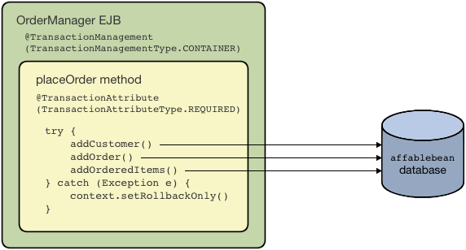
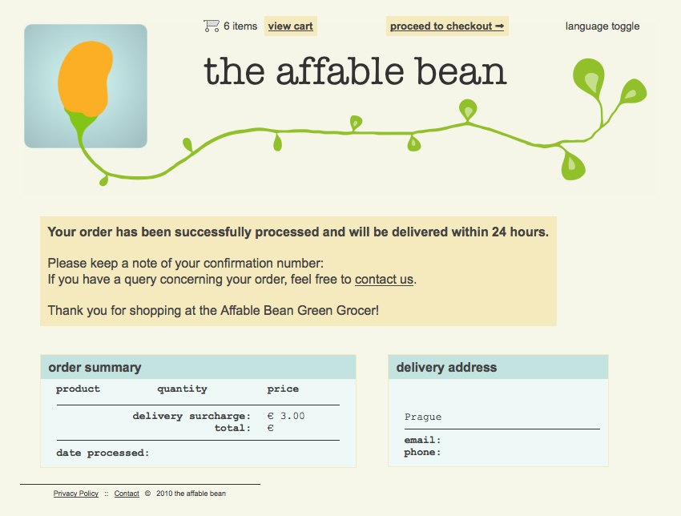
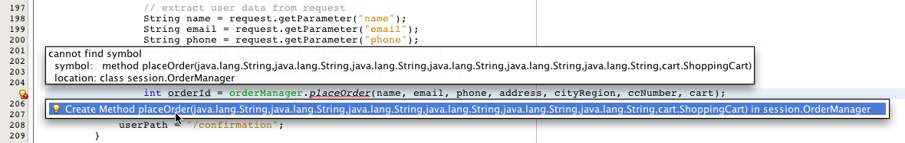
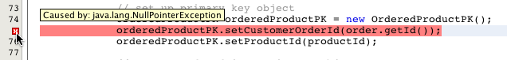
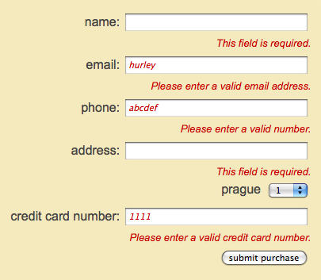
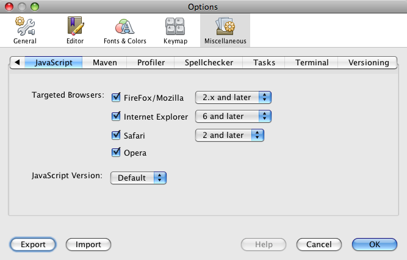

// 
//     Licensed to the Apache Software Foundation (ASF) under one
//     or more contributor license agreements.  See the NOTICE file
//     distributed with this work for additional information
//     regarding copyright ownership.  The ASF licenses this file
//     to you under the Apache License, Version 2.0 (the
//     "License"); you may not use this file except in compliance
//     with the License.  You may obtain a copy of the License at
// 
//       http://www.apache.org/licenses/LICENSE-2.0
// 
//     Unless required by applicable law or agreed to in writing,
//     software distributed under the License is distributed on an
//     "AS IS" BASIS, WITHOUT WARRANTIES OR CONDITIONS OF ANY
//     KIND, either express or implied.  See the License for the
//     specific language governing permissions and limitations
//     under the License.
//

= The NetBeans E-commerce Tutorial - Integrating Transactional Business Logic
:jbake-type: tutorial
:jbake-tags: tutorials 
:jbake-status: published
:icons: font
:syntax: true
:source-highlighter: pygments
:toc: left
:toc-title:
:description: The NetBeans E-commerce Tutorial - Integrating Transactional Business Logic - Apache NetBeans
:keywords: Apache NetBeans, Tutorials, The NetBeans E-commerce Tutorial - Integrating Transactional Business Logic
include::../../../../inc/database.adoc[]

== Tutorial Contents

1. xref:intro.adoc[+Introduction+]
2. xref:design.adoc[+Designing the Application+]
3. xref:setup-dev-environ.adoc[+Setting up the Development Environment+]
4. xref:data-model.adoc[+Designing the Data Model+]
5. xref:page-views-controller.adoc[+Preparing the Page Views and Controller Servlet+]
6. xref:connect-db.adoc[+Connecting the Application to the Database+]
7. xref:entity-session.adoc[+Adding Entity Classes and Session Beans+]
8. xref:manage-sessions.adoc[+Managing Sessions+]
9. *Integrating Transactional Business Logic*
* <<overview,Overview of the Transaction>>
* <<projSnapshot,Examining the Project Snapshot>>
* <<orderManager,Creating the `OrderManager` EJB>>
* <<requestParam,Handling Request Parameters>>
* <<placeOrder,Implementing `placeOrder` and Helper Methods>>
* <<entityManager,Utilizing JPA's EntityManager>>
* <<persistenceContext,Synchronizing the Persistence Context with the Database>>
* <<transaction,Setting up the Transaction Programmatically>>
* <<validate,Validating and Converting User Input>>
* <<seeAlso,See Also>>

[start=10]
. xref:language.adoc[+Adding Language Support+]

[start=11]
. xref:security.adoc[+Securing the Application+]

[start=12]
. xref:test-profile.adoc[+Testing and Profiling+]

[start=13]
. xref:conclusion.adoc[+Conclusion+]

image::../../../../images_www/articles/68/netbeans-stamp-68-69.png[title="Content on this page applies to NetBeans IDE, versions 6.8 and 6.9"]

The purpose of this tutorial unit is to demonstrate how you can use the object-relational mapping (ORM) capabilities provided by EJB and JPA technologies to gather data from a web request and write to a back-end database. Of particular interest is EJB's support for _container-managed_ transactions (refer to the xref:entity-session.adoc#gf-java-ee-container[+GlassFish v3 Java EE Container diagram+]). By applying several non-intrusive annotations, you can transform your EJB class into a transaction manager, thereby ensuring the integrity of the data contained in the database. In other words, the transaction manager handles multiple write actions to the database as a single unit of work. It ensures that the work-unit is performed either in its entirety or, if failure occurs at some point during the process, any changes made are rolled back to the database's pre-transaction state.

Within the context of the `AffableBean` application, this tutorial unit focuses on processing a customer order when data from the checkout form is received. You create an `OrderManager` EJB to process the checkout form data along with the session `cart` object. The `OrderManager` performs a transaction that involves multiple write actions to the `affablebean` database. If any of the actions fails, the transaction is rolled back.

You can view a live demo of the application that you build in this tutorial: link:http://services.netbeans.org/AffableBean/[+NetBeans E-commerce Tutorial Demo Application+].

|===
|Software or Resource |Version Required 

|xref:../../../../download/index.adoc[NetBeans IDE] |Java bundle, 6.8 or 6.9 

|link:http://www.oracle.com/technetwork/java/javase/downloads/index.html[+Java Development Kit (JDK)+] |version 6 

|<<glassFish,GlassFish server>> |v3 or Open Source Edition 3.0.1 

|link:http://dev.mysql.com/downloads/mysql/[+MySQL database server+] |version 5.1 

|link:https://netbeans.org/projects/samples/downloads/download/Samples%252FJavaEE%252Fecommerce%252FAffableBean_snapshot7.zip[+AffableBean project+] |snapshot 7 
|===

*Notes:*

* The NetBeans IDE requires the Java Development Kit (JDK) to run properly. If you do not have any of the resources listed above, the JDK should be the first item that you download and install.
* The NetBeans IDE Java Bundle includes Java Web and EE technologies, which are required for the application you build in this tutorial.
* The NetBeans IDE Java Bundle also includes the GlassFish server, which you require for this tutorial. You could link:http://glassfish.dev.java.net/public/downloadsindex.html[+download the GlassFish server independently+], but the version provided with the NetBeans download has the added benefit of being automatically registered with the IDE.
* You can follow this tutorial unit without having completed previous units. To do so, see the xref:setup.adoc[+setup instructions+], which describe how to prepare the database and establish connectivity between the IDE, GlassFish, and MySQL.

[[overview]]
== Overview of the Transaction

In order to process the data from the checkout form as well as the items contained in the customer's shopping cart, you create an `OrderManager` EJB. The `OrderManager` uses the provided data and performs the following write actions to the database:

* A new `Customer` record is added.
* A new `CustomerOrder` record is added.
* New `OrderedProduct` records are added, according to the items contained in the `ShoppingCart`.

We'll implement this by creating a `placeOrder` method which performs the three write actions by sequentially calling private helper methods, `addCustomer`, `addOrder`, and `addOrderedItems`. We'll also implement the three helper methods in the class. To leverage EJB's container-managed transaction service, we only require two annotations. These are:

* link:http://java.sun.com/javaee/6/docs/api/javax/ejb/TransactionManagement.html[+`@TransactionManagement`+]`(`link:http://java.sun.com/javaee/6/docs/api/javax/ejb/TransactionManagementType.html[+`TransactionManagementType`+].`_CONTAINER_)`: Used to specify that any transactions occurring in the class are container-managed.
* link:http://java.sun.com/javaee/6/docs/api/javax/ejb/TransactionAttribute.html[+`@TransactionAttribute`+]`(`link:http://java.sun.com/javaee/6/docs/api/javax/ejb/TransactionAttributeType.html[+`TransactionAttributeType`+].`_REQUIRED_)`: Used on the method that invokes the transaction to specify that a new transaction should be created (if one does not already exist).

Because we are implementing the transaction within a larger context, we'll approach this exercise by dividing it into several easily-digestible tasks.

* <<projSnapshot,Examining the Project Snapshot>>
* <<orderManager,Creating the OrderManager EJB>>
* <<requestParam,Handling Request Parameters>>
* <<placeOrder,Implementing `placeOrder` and Helper Methods>>
* <<entityManager,Utilizing JPA's EntityManager>>
* <<persistenceContext,Synchronizing the Persistence Context with the Database>>
* <<transaction,Setting up the Transaction Programmatically>>

[[projSnapshot]]
== Examining the Project Snapshot

Begin by examining the project snapshot associated with this tutorial unit.

1. Open the link:https://netbeans.org/projects/samples/downloads/download/Samples%252FJavaEE%252Fecommerce%252FAffableBean_snapshot7.zip[+project snapshot+] for this tutorial unit in the IDE. Click the Open Project ( image:images/open-project-btn.png[] ) button and use the wizard to navigate to the location on your computer where you downloaded the project. If you are proceeding from the xref:manage-sessions.adoc[+previous tutorial unit+], note that this project snapshot is identical to the state of the project after completing the previous unit, but with the following exceptions:
* The `confirmation.jsp` page is fully implemented.
* The `affablebean.css` stylesheet includes rules specific to the `confirmation.jsp` page implementation.

[start=2]
. Run the project ( image:images/run-project-btn.png[] ) to ensure that it is properly configured with your database and application server. 

If you receive an error when running the project, revisit the xref:setup.adoc[+setup instructions+], which describe how to prepare the database and establish connectivity between the IDE, GlassFish, and MySQL.

[start=3]
. Test the application's functionality in your browser. In particular, step through the entire xref:design.adoc#business[+business process flow+]. When you click the submit an order from the checkout page, the confirmation page currently displays as follows: 

 

No data related to the order is displayed on the confirmation page. In fact, in its current state the application doesn't do anything with the data from the checkout form. By the end of this tutorial unit, the application will gather customer data and use it to process an order. In its final state, the application will display a summary of the processed order on the confirmation page, remove the user's `ShoppingCart` and terminate the user session. (link:https://netbeans.org/projects/samples/downloads/download/Samples%252FJavaEE%252Fecommerce%252FAffableBean_snapshot8.zip[+Snapshot 8+] completes the request-response cycle when a checkout form is submitted.)

[[orderManager]]
== Creating the OrderManager EJB

1. Click the New File ( image:images/new-file-btn.png[] ) button in the IDE's toolbar. (Alternatively, press Ctrl-N; ⌘-N on Mac.) In the New File wizard, select the Java EE category, then select Session Bean.
2. Click Next. Name the EJB '`OrderManager`', place the EJB in the `session` package, and accept other default settings. (Create a stateless session bean, and do not have the wizard generate an interface for the bean.) 

image::images/ejb-wizard.png[title="Create a stateless EJB session bean using the Session Bean wizard"]

[start=3]
. Click Finish. The new `OrderManager` class is generated and opens in the editor.

[[requestParam]]
== Handling Request Parameters

1. Open the project's `ControllerServlet`. (Either select it from the Projects window, or press Alt-Shift-O (Ctrl-Shift-O on Mac) and use the Go to File dialog.)
2. Locate the area in the `doPost` method where the `/purchase` request will be implemented (line 190). 

Press Ctrl-G to use the Go To Line dialog.

[start=3]
. Implement code that extracts the parameters from a submitted checkout form. Locate the `TODO: Implement purchase action` comment, delete it, and add the following:

[source,java]
----

// if purchase action is called
} else if (userPath.equals("/purchase")) {

    *if (cart != null) {

        // extract user data from request
        String name = request.getParameter("name");
        String email = request.getParameter("email");
        String phone = request.getParameter("phone");
        String address = request.getParameter("address");
        String cityRegion = request.getParameter("cityRegion");
        String ccNumber = request.getParameter("creditcard");
    }*

    userPath = "/confirmation";
}
----

[[placeOrder]]
== Implementing placeOrder and Helper Methods

1. In the `ControllerServlet`, add a reference to the `OrderManager` EJB. Scroll to the top of the class and add a reference beneath the session facade EJBs that are already listed.

[source,java]
----

public class ControllerServlet extends HttpServlet {

    private String userPath;
    private String surcharge;
    private ShoppingCart cart;

    @EJB
    private CategoryFacade categoryFacade;
    @EJB
    private ProductFacade productFacade;
    *@EJB
    private OrderManager orderManager;*
----

[start=2]
. Press Ctrl-Shift-I (⌘:-Shift-I on Mac) to allow the editor to add an import statement for `session.OrderManager`.

[start=3]
. Use the extracted parameters, as well as the session `cart` object, as arguments for the `OrderManager.placeOrder` method. Add the following code:

[source,java]
----

// if purchase action is called
} else if (userPath.equals("/purchase")) {

    if (cart != null) {

        // extract user data from request
        String name = request.getParameter("name");
        String email = request.getParameter("email");
        String phone = request.getParameter("phone");
        String address = request.getParameter("address");
        String cityRegion = request.getParameter("cityRegion");
        String ccNumber = request.getParameter("creditcard");

        *int orderId = orderManager.placeOrder(name, email, phone, address, cityRegion, ccNumber, cart);*
    }

    userPath = "/confirmation";
}
----
Note that we haven't created the `placeOrder` method yet. This is why the editor flags an error. You can use the tip that displays in the left margin, which allows you to generate the method signature in the appropriate class. 
[.feature]
--

--

[start=4]
. Click the tip. The IDE generates the `placeOrder` method in the `OrderManager` class.

[source,java]
----

@Stateless
public class OrderManager {

    *public int placeOrder(String name, String email, String phone, String address, String cityRegion, String ccNumber, ShoppingCart cart) {
        throw new UnsupportedOperationException("Not yet implemented");
    }*

    ...
}
----
The import statement for `cart.ShoppingCart` is also automatically inserted at the top of the file.

[start=5]
. In the new `placeOrder` method, use the method arguments to make calls to the (yet nonexistent) helper methods. Enter the following:

[source,java]
----

public int placeOrder(String name, String email, String phone, String address, String cityRegion, String ccNumber, ShoppingCart cart) {

    *Customer customer = addCustomer(name, email, phone, address, cityRegion, ccNumber);
    CustomerOrder order = addOrder(customer, cart);
    addOrderedItems(order, cart);*
}
----
Note that we need to follow a particular order due to database constraints. For example, a `Customer` record needs to be created before the `CustomerOrder` record, since the `CustomerOrder` requires a reference to a `Customer`. Likewise, the `OrderedItem` records require a reference to an existing `CustomerOrder`.

[start=6]
. Press Ctrl-Shift-I (⌘:-Shift-I on Mac) to fix imports. Import statements for `entity.Customer` and `entity.CustomerOrder` are automatically added to the top of the file.

[start=7]
. Use the editor hints to have the IDE generate method signatures for `addCustomer`, `addOrder`, and `addOrderedItems`. After utilizing the three hints, the `OrderManager` class looks as follows.

[source,java]
----

@Stateless
public class OrderManager {

    public int placeOrder(String name, String email, String phone, String address, String cityRegion, String ccNumber, ShoppingCart cart) {

        Customer customer = addCustomer(name, email, phone, address, cityRegion, ccNumber);
        CustomerOrder order = addOrder(customer, cart);
        addOrderedItems(order, cart);
    }

    *private Customer addCustomer(String name, String email, String phone, String address, String cityRegion, String ccNumber) {
        throw new UnsupportedOperationException("Not yet implemented");
    }

    private CustomerOrder addOrder(Customer customer, ShoppingCart cart) {
        throw new UnsupportedOperationException("Not yet implemented");
    }

    private void addOrderedItems(CustomerOrder order, ShoppingCart cart) {
        throw new UnsupportedOperationException("Not yet implemented");
    }*

}
----
Note that an error is still flagged in the editor, due to the fact that the method is currently lacking a return statement. The `placeOrder` signature indicates that the method returns an `int`. As will later be demonstrated, the method returns the order ID if it has been successfully processed, otherwise `0` is returned.

[start=8]
. Enter the following return statement.

[source,java]
----

public int placeOrder(String name, String email, String phone, String address, String cityRegion, String ccNumber, ShoppingCart cart) {

    Customer customer = addCustomer(name, email, phone, address, cityRegion, ccNumber);
    CustomerOrder order = addOrder(customer, cart);
    addOrderedItems(order, cart);
    *return order.getId();*
}
----
At this stage, all errors in the `OrderManager` class are resolved.

[start=9]
. Begin implementing the three helper methods. For now, simply add code that applies each method's input parameters to create new entity objects. 

=== addCustomer

Create a new `Customer` object and return the object.

[source,java]
----

private Customer addCustomer(String name, String email, String phone, String address, String cityRegion, String ccNumber) {

    *Customer customer = new Customer();
    customer.setName(name);
    customer.setEmail(email);
    customer.setPhone(phone);
    customer.setAddress(address);
    customer.setCityRegion(cityRegion);
    customer.setCcNumber(ccNumber);

    return customer;*
}
----

==== addOrder

Create a new `CustomerOrder` object and return the object. Use the `java.util.Random` class to generate a random confirmation number.

[source,java]
----

private CustomerOrder addOrder(Customer customer, ShoppingCart cart) {

    *// set up customer order
    CustomerOrder order = new CustomerOrder();
    order.setCustomer(customer);
    order.setAmount(BigDecimal.valueOf(cart.getTotal()));

    // create confirmation number
    Random random = new Random();
    int i = random.nextInt(999999999);
    order.setConfirmationNumber(i);

    return order;*
}
----

==== addOrderedItems

Iterate through the `ShoppingCart` and create `OrderedProduct`s. In order to create an `OrderedProduct`, you can use the `OrderedProductPK` entity class. The instantiated `OrderedProductPK` can be passed to the `OrderedProduct` constructor, as demonstrated below.

[source,java]
----

private void addOrderedItems(CustomerOrder order, ShoppingCart cart) {

    *List<ShoppingCartItem> items = cart.getItems();

    // iterate through shopping cart and create OrderedProducts
    for (ShoppingCartItem scItem : items) {

        int productId = scItem.getProduct().getId();

        // set up primary key object
        OrderedProductPK orderedProductPK = new OrderedProductPK();
        orderedProductPK.setCustomerOrderId(order.getId());
        orderedProductPK.setProductId(productId);

        // create ordered item using PK object
        OrderedProduct orderedItem = new OrderedProduct(orderedProductPK);

        // set quantity
        orderedItem.setQuantity(scItem.getQuantity());
    }*
}
----

[start=10]
. Press Ctrl-Shift-I (⌘-Shift-I on Mac) to fix imports. A dialog opens to display all classes that will be imported. Note that the dialog correctly guesses for `java.util.List`. 

image::images/fix-all-imports.png[title="Press Ctrl-Shift-I to fix imports in a file"]

[start=11]
. Click OK. All necessary import statements are added, and the class becomes free of any compiler errors.

[[entityManager]]
== Utilizing JPA's EntityManager

As was mentioned in xref:entity-session.adoc[+Adding Entity Classes and Session Beans+], the `EntityManager` API is included in JPA, and is responsible for performing persistence operations on the database. In the `AffableBean` project, all of the EJBs employ the `EntityManager`. To demonstrate, open any of the session facade beans in the editor and note that the class uses the `@PersistenceContext` annotation to express a dependency on a container-managed `EntityManager` and its associated persistence context (`AffableBeanPU`, as specified in the `persistence.xml` file). For example, the `ProductFacade` bean looks as follows:

[source,java]
----

@Stateless
public class ProductFacade extends AbstractFacade<Product> {
    *@PersistenceContext(unitName = "AffableBeanPU")
    private EntityManager em;*

    protected EntityManager getEntityManager() {
        return em;
    }

    ...

    // manually created
    public List<Product> findForCategory(Category category) {
        return em.createQuery("SELECT p FROM Product p WHERE p.category = :category").
               setParameter("category", category).getResultList();
    }

}
----

To be able to write to the database, the `OrderManager` EJB must take similar measures. With an `EntityManager` instance, we can then modify the helper methods (`addCustomer`, `addOrder`, `addOrderedItems`) so that the entity objects they create are written to the database.

1. In `OrderManager`, apply the `@PersistenceContext` annotation to express a dependency on a container-managed `EntityManager` and the `AffableBeanPU` persistence context. Also declare an `EntityManager` instance.

[source,java]
----

@Stateless
public class OrderManager {

    *@PersistenceContext(unitName = "AffableBeanPU")
    private EntityManager em;*

    ...
}
----

[start=2]
. Press Ctrl-Shift-I (⌘:-Shift-I on Mac) to fix imports. Import statements for `javax.persistence.EntityManager` and `javax.persistence.PersistenceContext` are added to the top of the class.

[start=3]
. Use the `EntityManager` to mark entity objects to be written to the database. This is accomplished using the `persist` method in the `EntityManager` API. Make the following modifications to the helper methods. 

=== addCustomer

[source,java]
----

private Customer addCustomer(String name, String email, String phone, String address, String cityRegion, String ccNumber) {

    Customer customer = new Customer();
    customer.setName(name);
    customer.setEmail(email);
    customer.setPhone(phone);
    customer.setAddress(address);
    customer.setCityRegion(cityRegion);
    customer.setCcNumber(ccNumber);

    *em.persist(customer);*
    return customer;
}
----

=== addOrder

[source,java]
----

private CustomerOrder addOrder(Customer customer, ShoppingCart cart) {

    // set up customer order
    CustomerOrder order = new CustomerOrder();
    order.setCustomer(customer);
    order.setAmount(BigDecimal.valueOf(cart.getTotal()));

    // create confirmation number
    Random random = new Random();
    int i = random.nextInt(999999999);
    order.setConfirmationNumber(i);

    *em.persist(order);*
    return order;
}
----

=== addOrderedItems

[source,java]
----

private void addOrderedItems(CustomerOrder order, ShoppingCart cart) {

    List<ShoppingCartItem> items = cart.getItems();

    // iterate through shopping cart and create OrderedProducts
    for (ShoppingCartItem scItem : items) {

        int productId = scItem.getProduct().getId();

        // set up primary key object
        OrderedProductPK orderedProductPK = new OrderedProductPK();
        orderedProductPK.setCustomerOrderId(order.getId());
        orderedProductPK.setProductId(productId);

        // create ordered item using PK object
        OrderedProduct orderedItem = new OrderedProduct(orderedProductPK);

        // set quantity
        orderedItem.setQuantity(String.valueOf(scItem.getQuantity()));

        *em.persist(orderedItem);*
    }
}
----
The `EntityManager`'s `persist` method does not immediately write the targeted object to the database. To describe this more accurately, the `persist` method places the object in the _persistence context_. This means that the `EntityManager` takes on the responsibility of ensuring that the entity object is synchronized with the database. Think of the persistence context as an intermediate state used by the `EntityManager` to pass entities between the object realm and the relational realm (hence the term 'object-relational mapping'). 

What is the scope of the persistence context? If you open the IDE's Javadoc Index Search (Shift-F1; Shift-fn-F1 on Mac) and examine the Javadoc documentation for the link:http://java.sun.com/javaee/6/docs/api/javax/persistence/PersistenceContext.html[+`@PersistenceContext`+] annotation, you'll note that the `type` element is used to "specif[y] whether a transaction-scoped persistence context or an extended persistence context is to be used." A _transaction-scoped_ persistence context is created at the start of a transaction, and terminated when the transaction ends. An _extended_ persistence context applies to stateful session beans only, and spans multiple transactions. The Javadoc documentation also informs us that `javax.persistence.PersistenceContextType.TRANSACTION` is the default value for the `type` element. Therefore, although we didn't specify that the `EntityManager` place objects in a transaction-scoped persistence context, this is in fact how a container-managed `EntityManager` behaves by default.

[[persistenceContext]]
== Synchronizing the Persistence Context with the Database

At this stage you might assume that, transaction or no transaction, the `OrderManager` is now able to successfully write entity objects to the database. Run the project and see how customer orders are currently being processed.

1. Press F6 (fn-F6 on Mac) to run the project.
2. Step through the xref:design.adoc#business[+business process flow+]. When you arrive at the checkout page, be sure to enter data that you know will not cause SQL errors to occur when the write actions are performed. (Validation is discussed in a later tutorial unit.) For example, enter the following into the checkout form:
* *name:* `Hugo Reyes`
* *email:* `hurley@mrcluck.com`
* *phone:* `606252924`
* *address:* `Karlova 33`
* *prague:* `1`
* *credit card number:* `1111222233334444`

In the coming steps, you are going to examine the server log in the IDE's Output window. Before submitting the checkout form, open the Output window and clear the server log. You can accomplish this by right-clicking in the server log and choosing Clear (Ctrl-L; ⌘-L on Mac).

[start=3]
. Click the 'submit purchase' button. The server responds with an HTTP status 500 message. 

image::images/gf-error-report.png[title="Server responds with an HTTP status 500 message"]

[start=4]
. Switch to the IDE and examine the server log. The server log is located in the Output window (Ctrl-4; ⌘-4 on Mac) under the GlassFish server tab. You come across the following text.

[source,java]
----

WARNING: A system exception occurred during an invocation on EJB OrderManager method
public int session.OrderManager.placeOrder(java.lang.String,java.lang.String,java.lang.String,java.lang.String,java.lang.String,java.lang.String,cart.ShoppingCart)
javax.ejb.EJBException
...
Caused by: java.lang.NullPointerException
        [.underline]#at session.OrderManager.addOrderedItems(OrderManager.java:75)#
        [.underline]#at session.OrderManager.placeOrder(OrderManager.java:33)#
----

Maximize the Output window by pressing Shift-Esc.

The underlines displayed in the server log form links allowing you to navigate directly to the lines in your source files where errors are occurring.

[start=5]
. Click the link to `session.OrderManager.addOrderedItems`. The editor displays the line that is causing the exception. 

 

To understand why `order.getId` method returns `null`, consider what the code is actually trying to accomplish. The `getId` method attempts to get the ID of an order which is currently in the process of being created. Since the ID is an auto-incrementing primary key, the database automatically generates the value only when the record is added. One way to overcome this is to manually synchronize the persistence context with the database. This can be accomplished using the `EntityManager`'s link:http://java.sun.com/javaee/6/docs/api/javax/persistence/EntityManager.html#flush%28%29[+`flush`+] method.

[start=6]
. In the `addOrderedItems` method, add a call to flush the persistence context to the database.

[source,java]
----

private void addOrderedItems(CustomerOrder order, ShoppingCart cart) {

    *em.flush();*

    List<ShoppingCartItem> items = cart.getItems();

    // iterate through shopping cart and create OrderedProducts
    for (ShoppingCartItem scItem : items) {

        int productId = scItem.getProduct().getId();

        // set up primary key object
        OrderedProductPK orderedProductPK = new OrderedProductPK();
        orderedProductPK.setCustomerOrderId(order.getId());
        orderedProductPK.setProductId(productId);

        // create ordered item using PK object
        OrderedProduct orderedItem = new OrderedProduct(orderedProductPK);

        // set quantity
        orderedItem.setQuantity(String.valueOf(scItem.getQuantity()));

        em.persist(orderedItem);
    }
}
----

[start=7]
. Rerun the project and step through the business process flow. This time, when you submit the checkout form the confirmation page displays.

[start=8]
. To confirm that the details have been recorded in the database, open the IDE's Services window (Ctrl-5; ⌘-5 on Mac). Locate the `affablebean` connection node. If the node appears broken ( image:images/connection-broken.png[] ), right-click the node and choose Connect.

[start=9]
. Drill into the connection and locate the `affablebean` database's `customer` table. Right-click the table and choose View Data. A graphical display of the `customer` table appears in the editor. The customer details that you added in the checkout form display as a record in the table. 

image::images/customer-record.png[title="View Data menu option performs a 'select *' query on the selected table"] 

In this manner, you can also examine the `customer_order` and `ordered_product` tables to determine whether data has been recorded.

[[transaction]]
== Setting up the Transaction Programmatically

A transaction's primary function is to ensure that all operations are performed successfully, and if not, then none of the individual operations are performed.^<<footnote1,[1]>>^ The following steps demonstrate how to ensure that the write operations performed in the `placeOrder` method are treated as a single transaction.

1. Refer to the <<transactionDiagram,transaction diagram>> above. Add the two transaction-related annotations to the `OrderManager` EJB.

[source,java]
----

@Stateless
*@TransactionManagement(TransactionManagementType.CONTAINER)*
public class OrderManager {

    @PersistenceContext(unitName = "AffableBeanPU")
    private EntityManager em;

    *@TransactionAttribute(TransactionAttributeType.REQUIRED)*
    public int placeOrder(String name, String email, String phone, String address, String cityRegion, String ccNumber, ShoppingCart cart) {

        try {
            ...
----
The `@TransactionManagement` annotation is used to specify that any transactions occurring in the `OrderManager` EJB are container-managed. The `@TransactionAttribute` annotation placed on the `placeOrder` method specifies that any operations occurring in the method must be treated as part of a transaction. 

According to the link:http://jcp.org/aboutJava/communityprocess/final/jsr318/index.html[+EJB Specification+], container-managed transactions are enabled by default for session beans. Furthermore, if you examine the Javadoc for both of the above annotations, you will rightly point out that `CONTAINER` is the default `TransactionManagementType`, and `REQUIRED` is the default `TransactionAttributeType`. In other words, neither of the two annotations is required for your code to run properly. However, it is often helpful to explicitly include default settings in your sources to improve readability.

[start=2]
. Currently, the `placeOrder` method returns the ID of the processed order. In the event that the transaction fails and the order isn't processed, have the method return '`0`'. Use a `try-catch` expression.

[source,java]
----

@TransactionAttribute(TransactionAttributeType.REQUIRED)
public int placeOrder(String name, String email, String phone, String address, String cityRegion, String ccNumber, ShoppingCart cart) {

    *try {*
        Customer customer = addCustomer(name, email, phone, address, cityRegion, ccNumber);
        CustomerOrder order = addOrder(customer, cart);
        addOrderedItems(order, cart);
        return order.getId();
    *} catch (Exception e) {
        return 0;
    }*
----

=== NetBeans Support for Code Templates

When you work in the editor, take advantage of the IDE's support for code templates. Becoming proficient in using code templates ultimately enables you to work more efficiently and reliably.

For example, in the above step you can apply the `trycatch` template by typing in '`trycatch`' then pressing Tab. The template is added to your file.

[source,java]
----

@TransactionAttribute(TransactionAttributeType.REQUIRED)
public int placeOrder(String name, String email, String phone, String address, String cityRegion, String ccNumber, ShoppingCart cart) {

    *try {

    } catch (Exception e) {
    }*
    Customer customer = addCustomer(name, email, phone, address, cityRegion, ccNumber);
    CustomerOrder order = addOrder(customer, cart);
    addOrderedItems(order, cart);
    return order.getId();
----

You can then move the four existing lines into the `try` clause by highlighting the lines, then holding Alt-Shift (Ctrl-Shift on Mac) and pressing the up arrow key. When you are finished, press F while holding Alt-Shift (Ctrl-Shift on Mac) to format the code.

[source,java]
----

@TransactionAttribute(TransactionAttributeType.REQUIRED)
public int placeOrder(String name, String email, String phone, String address, String cityRegion, String ccNumber, ShoppingCart cart) {

    try {
        *Customer customer = addCustomer(name, email, phone, address, cityRegion, ccNumber);
        CustomerOrder order = addOrder(customer, cart);
        addOrderedItems(order, cart);
        return order.getId();*
    } catch (Exception e) {
    }
----

It is also possible to view and edit existing code templates, and add new templates in the IDE. Choose Tools > Options (NetBeans > Preferences on Mac) to open the Options window. Select Editor > Code Templates.

image::images/code-templates.png[title="View default code templates and define new templates in the Options window"] 

If you'd like to see more templates, consult the Keyboard Shortcuts Card. The Keyboard Shortcuts Card provides a list of commonly-used code templates and keyboard shortcuts. Choose Help > Keyboard Shortcuts Card from the main menu.

[start=3]
. Add the following code. Explanation follows.

[source,java]
----

@PersistenceContext(unitName = "AffableBeanPU")
private EntityManager em;
*@Resource
private SessionContext context;*

@TransactionAttribute(TransactionAttributeType.REQUIRED)
public int placeOrder(String name, String email, String phone, String address, String cityRegion, String ccNumber, ShoppingCart cart) {

    try {
        Customer customer = addCustomer(name, email, phone, address, cityRegion, ccNumber);
        CustomerOrder order = addOrder(customer, cart);
        addOrderedItems(order, cart);
        return order.getId();
    } catch (Exception e) {
        *context.setRollbackOnly();*
        return 0;
    }
}
----
Unfortunately, placing the three methods in the `try` clause means that if one of them fails during runtime, the engine immediately jumps to the `catch` clause, thus skipping any rollback operations that would normally follow. 

You can test this by commenting out the `em.flush()` line you previously added. This way, you know that the first two methods (`addCustomer` and `addOrder`) process successfully, but the third method (`addOrderedItems`) fails. Run the project and submit the checkout form in the browser. Since the transaction doesn't roll back, the customer and order records are written to the database, but any ordered items are not. This leads to a situation where the database is corrupt.

To overcome this, you explicitly set the transaction for rollback in the `catch` clause. The above `@Resource` annotation is applied to grab an instance of the EJB's current `SessionContext`. The transaction is marked for rollback using the `setRollbackOnly` method.

[start=4]
. Run the project and step through the business process flow. When you submit an order, return to the IDE and examine the server log. You'll see output similar to the following: 
[.feature]
--

image::images/transaction-output.png[role="left", link="images/transaction-output.png"]

--

Press Shift-Esc on the Output window to maximize it.

As shown in the above image, the green text indicates output from EclipseLink. Recall how in xref:entity-session.adoc[+Adding Entity Classes and Session Beans+] you set EclipseLink's logging level to `FINEST` in the persistence unit. Being able to examine this output is key to understanding how the persistence provider interacts with the database and is a great help when you need to debug your project.

You've now successfully integrated the transaction into the `AffableBean` project. You can link:https://netbeans.org/projects/samples/downloads/download/Samples%252FJavaEE%252Fecommerce%252FAffableBean_snapshot8.zip[+download snapshot 8+] to examine code that completes the request-response cycle when a checkout form is submitted. The snapshot implements a `getOrderDetails` method in the `OrderManager`, which gathers all details pertaining to the placed order. If the transaction succeeds, the `ControllerServlet` places order details in the request scope, destroys the user's `cart` object, terminates the session, and forwards the request to the confirmation view. If the transaction fails, the `ControllerServlet` flags an error and forwards the response to the checkout view, enabling the user to attempt a resubmit.

image::images/checkout-page.png[title="Upon transaction failure, the checkout page redisplays with error message"]

[[validate]]
== Validating and Converting User Input

Also included in link:https://netbeans.org/projects/samples/downloads/download/Samples%252FJavaEE%252Fecommerce%252FAffableBean_snapshot8.zip[+snapshot 8+] are implementations for client and server-side validation for the checkout form. Form validation is the process of checking that a form has been filled in correctly before it is processed. This not only aids users by providing meaningful feedback for fields with invalid entries, but it also serves to thwart any malicious attempts to submit content that could adversely affect processing or storage.

There are two primary methods for validating forms: server-side (in our case, using Java), and client-side (using JavaScript). Both methods are usually essential for providing a pleasant user experience, as well as robust security for your application. Client-side validation is useful for offering immediate feedback to the user without the need to initiate a round-trip between the browser and server. As such, it can stem network traffic and decrease the server load. Modern forms of client-side validation are often implemented to provide immediate, "as-you-type", field-specific feedback to the user. Client-side JavaScript is run on the browser, and browsers generally allow JavaScript to be disabled. For this reason alone, your application cannot rely on client-side validation as the sole means of guarding against malformed or nefarious input. Server-side validation checks should therefore be performed when form data reaches the server. Data is extracted from the request and checked prior to being processed and/or stored. If a validation error is detected, the server responds by returning the form to the user with an appropriate message. If all data passes validation, data is converted to a different format if required.

* <<client,Client-Side Validation>>
* <<server,Server-Side Validation>>
* <<data,Data Conversion>>

[[client]]
=== Client-Side Validation

For the `AffableBean` application, client-side validation is provided by a popular link:http://plugins.jquery.com/project/validate[+jQuery plugin+]. jQuery is a cross-browser JavaScript library designed to simplify client-side scripting of HTML.

link:https://netbeans.org/projects/samples/downloads/download/Samples%252FJavaEE%252Fecommerce%252FAffableBean_snapshot8.zip[+Snapshot 8+] includes a `js` folder that contains the jQuery core library (`jquery-1.4.2.js`) as well as the script for the validation plugin (`jquery.validate.js`). The core library is referenced in the application `header.jspf` file, while the validation plugin script is referenced directly in `checkout.jsp` since it is only required by that file. Within `checkout.jsp`, the plugin is customized to suit the checkout form based on link:http://docs.jquery.com/Plugins/Validation/validate#toptions[+available documentation+].

[source,xml]
----

----

The IDE provides support for jQuery by enabling you to invoke code completion and documentation in the editor when pressing Ctrl-Space.

image::images/jquery-editor-support.png[title="Press Ctrl-Space on JavaScript code to invoke jQuery documentation"]

When you code in JavaScript, the IDE lets you specify which browsers your application is targeting. Open the Options window (Choose Tools > Options; NetBeans > Preferences on Mac), select Miscellaneous, then select the JavaScript tab.

If the function you are calling documentation on does not support all of your targeted browsers, the documentation popup flags a warning. For example in the image below, Internet Explorer version 5.5 has been included in the application's targeted browsers.

image::images/ie-55.png[title="Documentation popup warns of method calls to non-compatible browser versions"]

[[server]]
=== Server-Side Validation

The purpose of server-side validation is to ensure that each piece of data is in a format that is ready for further processing or is acceptable for storage. By "format", we mean both the data type as well as the size of the piece of data. The generated JPA entity classes are guaranteed to map their properties to the appropriate data types of the corresponding database table columns. When relying on these entity classes, we need to not only make sure that user data can be applied to create (or update) entity classes, but that the size of the data is appropriate for the data types of the database columns.

To illustrate an example, consider the checkout form's credit card number field. Client-side validation checks that the entered data does not include letters.^<<footnote2,[2]>>^ Because the `maxlength` attribute in the HTML markup is set to `19`, users cannot enter more than 19 characters into this field. Server-side validation also places a limit at 19 characters. Keep in mind that the data type of the `cc_number` column in the database's `customer` table is: `VARCHAR(19)` (Refer to step 3 of xref:data-model.adoc#addProperties[+Designing the Data Model: Adding Entity Properties+].) Now, consider what would happen if the data type of the `cc_number` column is set to `VARCHAR(16)`, and a user enters a number that is 19 characters long. When the checkout form is submitted, the `creditcard` parameter is extracted from the request and converted into a `String` so that it becomes the `ccNumber` property in a newly created `Customer` object. Because 16 is the maximum number of characters the database column will hold, the database server will either truncate the number to 16 characters or produce a `MysqlDataTruncation` error, depending on the SQL mode set for the server. (For more information on the `VARCHAR` data type, see link:http://dev.mysql.com/doc/refman/5.1/en/char.html[+10.4.1. The CHAR and VARCHAR Types+].) In this manner, by not having client and server-side validation properly handle the size (i.e., length) of the data received for a credit card number, we risk a failed attempt at placing an order, or perhaps even worse, a truncated credit card number, which obviously won't allow payment.

Server-side validation in the `AffableBean` project is implemented by means of a `Validator` class. The `ControllerServlet` creates a `Validator` object and calls its `validateForm` method on the user data:

[source,java]
----

// validate user data
boolean validationErrorFlag = false;
validationErrorFlag = validator.validateForm(name, email, phone, address, cityRegion, ccNumber, request);

// if validation error found, return user to checkout
if (validationErrorFlag == true) {
    request.setAttribute("validationErrorFlag", validationErrorFlag);
    userPath = "/checkout";

    // otherwise, save order to database
} else {

    ...
}
----

If a validation error is found (i.e., if `validateForm` returns `true`), a flag is raised in the form of a request-scoped attribute, and the server sends the checkout page back to the client. When the flag is detected in `checkout.jsp`, a new table row is created to display error messages at the top of the table.

[source,xml]
----

<form id="checkoutForm" action="<c:url value='purchase'/>" method="post">
    <table id="checkoutTable">
      <c:if test="${!empty validationErrorFlag}">
        <tr>
            <td colspan="2" style="text-align:left">
                Please provide valid entries for the following field(s):

                  <c:if test="${!empty nameError}">
                     <strong>name</strong> (e.g., Bilbo Baggins)
                  </c:if>
                  <c:if test="${!empty emailError}">
                     <strong>email</strong> (e.g., b.baggins@hobbit.com)
                  </c:if>
                  <c:if test="${!empty phoneError}">
                     <strong>phone</strong> (e.g., 222333444)
                  </c:if>
                  <c:if test="${!empty addressError}">
                     <strong>address</strong> (e.g., Korunní 56)
                  </c:if>
                  <c:if test="${!empty cityRegionError}">
                     <strong>city region</strong> (e.g., 2)
                  </c:if>
                  <c:if test="${!empty ccNumberError}">
                     <strong>credit card</strong> (e.g., 1111222233334444)
                  </c:if>

                
            </td>
        </tr>
      </c:if>

      ...
    </table>
</form>
----

You can test server-side validation by temporarily disabling JavaScript in your browser.

image::images/server-side-validation.png[title="Temporarily disable JavaScript in your browser to test server-side validation"]

The provided implementation of server-side validation here serves merely to demonstrate how server-side validation can be set up in your project. The actual validation logic contained in the `Validator` class does not perform anything beyond the most basic of checks and should certainly not be used in a production environment!

[[data]]
=== Data Conversion

Sometimes, after data has passed validation, you may need to convert it into a different format. For example, this might apply to dates when users are allowed to enter them manually, or numbers that have been received as `String` objects but require calculation. This important step is referred to as server-side _data conversion_.

Although not implemented in the `AffableBean` application, consider again the checkout form's credit card number field. Both client and server-side validation allows for different formats for numbers. For example, validation will accept the following number:

[source,java]
----

1111222233334444
----

Validation will also accept the same number in the following format.

[source,java]
----

1111-2222-3333-4444
----

Because of the ambiguous nature in which this piece of user data is acquired, it might be necessary to remove any hyphens ('`-`') or other non-numeric characters prior to processing payment. This step would likely occur before the data is placed in storage.

xref:../../../../community/mailing-lists.adoc[Send Feedback on This Tutorial]

[[seeAlso]]
== See Also

=== NetBeans Resources

* xref:../javaee-intro.adoc[+Introduction to Java EE Technology+]
* xref:../javaee-gettingstarted.adoc[+Getting Started with Java EE Applications+]
* link:https://netbeans.org/projects/www/downloads/download/shortcuts.pdf[+Keyboard Shortcuts &amp; Code Templates Card+]
* xref:../../java-ee.adoc[+Java EE &amp; Java Web Learning Trail+]

=== External Resources

* link:http://jcp.org/aboutJava/communityprocess/final/jsr318/index.html[+JSR 318: EJB 3.1 Final Release+] [Specification Download]
* link:http://download.oracle.com/docs/cd/E17410_01/javaee/6/tutorial/doc/bncih.html[+Java EE 6 Tutorial: Transactions+]
* link:http://www.manning.com/panda/[+EJB 3 in Action+] [Book]
* link:{wikipedia}Database_transaction[Database Transaction] [Wikipedia]
* link:{wikipedia}Ejb[Enterprise JavaBean] [Wikipedia]
* link:{wikipedia}ACID[+ACID+] [Wikipedia]
* link:http://jquery.com/[+jQuery+]
* link:{wikipedia}Jquery[jQuery] [Wikipedia]

== References

1. <<1,^>> This _all or nothing_ concept can be further extrapolated into the four defining characteristics of transactions: _atomicity_, _consistency_, _isolation_, and _durability_ (ACID). For more information, see: link:{wikipedia}ACID[ACID] [Wikipedia].
2. <<2,^>> Actually, for credit card number entries, validation typically ensures that the entered string conforms to the Luhn algorithm, which is a simple method of differentiating between valid numbers and a collection of random digits. This applies to the link:http://plugins.jquery.com/project/validate[+jQuery validation plugin+] as well. For more information, see link:{wikipedia}Luhn_algorithm[Luhn algorithm] [Wikipedia].
