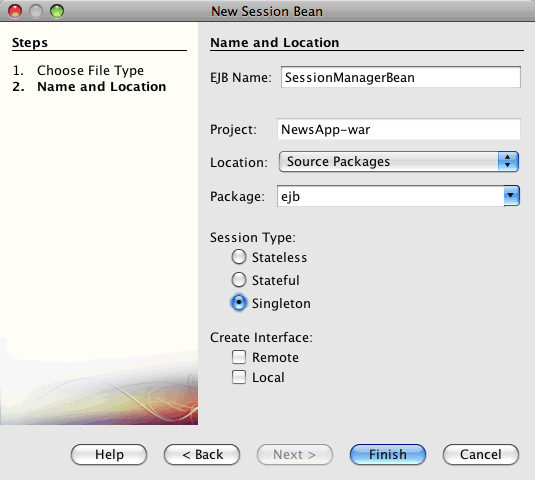
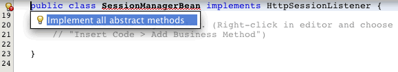
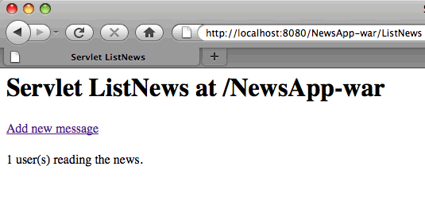

// 
//     Licensed to the Apache Software Foundation (ASF) under one
//     or more contributor license agreements.  See the NOTICE file
//     distributed with this work for additional information
//     regarding copyright ownership.  The ASF licenses this file
//     to you under the Apache License, Version 2.0 (the
//     "License"); you may not use this file except in compliance
//     with the License.  You may obtain a copy of the License at
// 
//       http://www.apache.org/licenses/LICENSE-2.0
// 
//     Unless required by applicable law or agreed to in writing,
//     software distributed under the License is distributed on an
//     "AS IS" BASIS, WITHOUT WARRANTIES OR CONDITIONS OF ANY
//     KIND, either express or implied.  See the License for the
//     specific language governing permissions and limitations
//     under the License.
//

= Creating an Enterprise Application with EJB 3.1
:jbake-type: tutorial
:jbake-tags: tutorials 
:jbake-status: published
:syntax: true
:icons: font
:icons: font
:source-highlighter: pygments
:toc: left
:toc-title:
:description: Creating an Enterprise Application with EJB 3.1 - Apache NetBeans
:keywords: Apache NetBeans, Tutorials, Creating an Enterprise Application with EJB 3.1

This tutorial takes you through the basics of developing a Java EE 6 enterprise application and demonstrates some of the EJB 3.1 technology features that were introduced as part of the Java EE 6 specification. In this tutorial you will create an enterprise application that enables a user to post to and retrieve messages from a database.

The application contains an EJB module and a web module. The EJB module contains an entity class, a session facade for the entity class and a message-driven bean. The web module contains servlets for displaying and posting messages and a singleton session bean that counts the number of users in the session.

Before starting this tutorial you may want to familiarize yourself with the following document.

* xref:javaee-gettingstarted.adoc[+Getting Started with Java EE Applications+]

*Tutorial Exercises*

* <<intro,About the NewsApp Enterprise Application>>
* <<Exercise_1,Creating the Enterprise Application Project>>
* <<Exercise_2,Coding the EJB Module>>
* <<Exercise_2a,Creating the Entity Class>>
* <<Exercise_2b,Creating the Message-Driven Bean>>
* <<Exercise_2c,Creating the Session Facade>>
* <<Exercise_3,Coding the Web Module>>
* <<Exercise_3a,Creating the Singleton Session Bean>>
* <<Exercise_3b,Creating the ListNews Servlet>>
* <<Exercise_3c,Creating the PostMessage Servlet>>
* <<Exercise_4,Running the Project>>
* <<Exercise_5,Downloading the Solution Project>>
* <<Exercise_6,Troubleshooting>>

*To follow this tutorial, you need the following software and resources.*

|===
|Software or Resource |Version Required 

|xref:../../../download/index.adoc[NetBeans IDE] |7.2, 7.3, 7.4, 8.0, Java EE version 

|link:http://www.oracle.com/technetwork/java/javase/downloads/index.html[+Java Development Kit (JDK)+] |version 7 or 8 

|GlassFish Server Open Source Edition |3.x, 4.x 
|===

*Prerequisites*

This document assumes you have some basic knowledge of, or programming experience with, the following technologies:

* Java Programming
* NetBeans IDE

You can download link:https://netbeans.org/projects/samples/downloads/download/Samples/JavaEE/NewsAppEE6.zip[+a zip archive of the finished project+].

== About the NewsApp Enterprise Application

In this tutorial you will create a simple example of a multi-tiered, Java EE 6 enterprise application named NewsApp. The NewsApp application uses some of the features introduced in the Java EE 6 specification.

The structure of the NewsApp application generally corresponds to the following tiers.

* *Web Tier.* The Web Tier contains the presentation logic of the application and runs on a Java EE server. In the NewsApp application, the Web Tier is represented by the web module and contains servlets that access the business logic in the EJB module.
* *Business Tier.* Business Tier applications also run on Java EE servers and contain the business logic of the application. In the NewsApp application, the Business Tier is represented by the EJB module. The EJB module contains the code that handles requests from the Web Tier clients and manages transactions and how objects are persisted to the database.
* *EIS Tier.* The EIS Tier is the persistent storage layer of the application. In the NewsApp application, this tier is represented by the database where the messages are stored.

When you build an enterprise application in the IDE, the EJB and web application modules are packaged in an EAR archive that is then deployed to the server. The application is then typically accessed from the *Client Tier.* The Client Tier is the environment where the client is run and is often a web browser on a user's local system.

NOTE:  In the example in this tutorial you will use a single machine to host the Java EE server, the database and view the web pages. In large enterprise applications, the different tiers are often distributed across multiple machines. The Web Tier and Business Tier applications are often deployed to Java EE servers that are hosted on different machines.

For more details about the structure of Java EE enterprise applications, see the chapter on link:http://download.oracle.com/javaee/6/tutorial/doc/bnaay.html[+Distributed Multitiered Applications+] in the link:http://download.oracle.com/javaee/6/tutorial/doc/[+Java EE 6 Tutorial, Part I+].

== Creating the Enterprise Application Project

The goal of this exercise is to create the NewsApp enterprise application project. You will use the New Project wizard to create an enterprise application that contains an EJB module and a web module.

1. Choose File > New Project (Ctrl-Shift-N; ⌘-Shift-N on Mac) from the main menu.
2. Select Enterprise Application from the Java EE category and click Next.
3. Name the project *NewsApp* and set the project location.
4. Deselect the Use Dedicated Folder option, if selected.
(For this tutorial there is little reason to copy project libraries to a dedicated folder because you will not need to share libraries with other users or projects.)
Click Next.

. Set the server to GlassFish Server and set the Java EE Version to Java EE 6 or Java EE 7.

. Select Create EJB Module and Create Web Application Module. Click Finish.

image::images/new-entapp-wizard.png[title="New Project wizard"]

When you click Finish, the IDE creates three projects: NewsApp, NewsApp-ejb and NewsApp-war. If you expand the NewsApp node in the Projects window, you can see that the enterprise application project does not contain any sources. All the sources will be contained in the two modules that the wizard created and which are listed under the Java EE Modules node.

The enterprise application project only contains configuration and packaging details about the application. When you build and run an enterprise application the IDE creates an EAR archive and deploys the EAR to the server. In some cases, the enterprise application project will contain deployment descriptor files with additional information, but deployment descriptor files are not required when you create a Java EE enterprise application that is deployed to GlassFish Server.

image::images/ejb-projectswindow.png[title="Projects window showing structure of the application"] 

== Coding the EJB Module

In this exercise you will create an entity class, a message-driven bean and a session facade in the EJB module. You also will also create a persistence unit to provide the container with information about the data source and how the entities are managed, and Java Message Service (JMS) resources that are used by the message-driven bean.

=== Creating the Entity Class

In this exercise you will create the  ``NewsEntity``  entity class. An entity class is a simple Java class that generally represents a table in a database. When you create the entity class, the IDE adds the  ``@Entity``  annotation to define the class as an entity class. After you create the class, you will create fields in the class to represent the data that you want in your table.

Each entity class must have a primary key. When you create the entity class, the IDE adds the  ``@Id``  annotation to declare which field to use as the primary key. The IDE also adds the  ``@GeneratedValue``  annotation and specifies the key generation strategy for the primary Id.

To create the  ``NewsEntity``  class, perform the following steps.

1. Right-click the EJB module in the Projects window and choose New > Other to open the New File wizard.
2. From the Persistence category, select Entity Class and click Next.
3. Type *NewsEntity* for the Class Name.
4. Type *ejb* for the Package.
5. Leave the Primary Key Type as  ``Long``  in the New Entity Class wizard.
6. Select Create Persistence Unit. Click Next.
7. Keep the default Persistence Unit Name.
8. For the Persistence Provider, choose  ``EclipseLink (JPA2.0)(default)`` .
9. For the Data Source, choose a data source (for example, select  ``jdbc/sample``  if you want to use JavaDB).
10. Confirm that the persistence unit is using the Java Transaction API and that the Table Generation Strategy is set to Create so that the tables based on your entity classes are created when the application is deployed.

image::images/new-pu-wizard.png[title="Provider and Database panel"]

. Click Finish.

When you click Finish, the IDE creates  ``persistence.xml``  and the entity class  ``NewsEntity.java`` . The IDE opens  ``NewsEntity.java``  in the Source Editor.

In the Source Editor, perform the following steps.

1. Add the following field declarations to the class:

[source,java]
----

private String title;
private String body;
----

. Right-click in the Source Editor and choose Insert Code (Alt-Insert; Ctrl-I on Mac) and select Getter and Setter to open the Generate Getters and Setters dialog box.

. Select the  ``body``  and  ``title``  fields in the dialog box. Click Generate.

image::images/ejb-gettersetter.png[title="Generate Getters and Setters dialog box"]

When you click Generate, the IDE adds getter and setter methods for the fields.

. Save the changes to  ``NewsEntity.java`` .

You can close  ``NewsEntity.java`` .

For more details about entity classes, see the chapter link:http://java.sun.com/javaee/6/docs/tutorial/doc/bnbpz.html[+Introduction to the Java Persistence API+] in the link:http://download.oracle.com/javaee/6/tutorial/doc/[+Java EE 6 Tutorial, Part I+].

=== Creating the Message-Driven Bean

In this exercise you will use a wizard to create the NewMessage message-driven bean in the EJB module. The wizard will also help you to create the necessary JMS resources. The message-driven bean receives and processes messages sent to the queue by a servlet in the web module.

To create the message-driven bean, perform the following steps:

1. Right-click the EJB module in the Projects window and choose New > Other to open the New File wizard.
2. From the Enterprise JavaBeans category, select the Message-Driven Bean file type. Click Next.
3. Type *NewMessage* for the EJB Name.
4. Select  ``ejb``  from the Package drop-down list.
5. Click the Add button next to the Project Destination field to open the Add Message Destination dialog box.
6. In the Add Message Destination dialog box, type *jms/NewMessage* and select Queue for the destination type. Click OK.
7. Confirm that the project destination is correct. Click Finish.

image::images/ejb-newmessage.png[title="New Message-Driven Bean Wizard"]

When you click Finish, the bean class  ``NewMessage.java``  opens in the Source Editor. You can see that the IDE added the  ``@MessageDriven``  annotation and configuration properties to the class.

[source,java]
----

       
@MessageDriven(mappedName = "jms/NewMessage", activationConfig =  {
        @ActivationConfigProperty(propertyName = "acknowledgeMode", propertyValue = "Auto-acknowledge"),
        @ActivationConfigProperty(propertyName = "destinationType", propertyValue = "javax.jms.Queue")
    })
public class NewMessage implements MessageListener {
----

The  ``@MessageDriven``  annotation tells the container that the component is a message-driven bean and specifies the JMS resource used by the bean. When the IDE generates the class, the Mapped Name of the resource ( ``jms/NewMessage`` ) is derived from the name of the class ( ``NewMessage.java`` ). The JMS resource is mapped to the JNDI name of the destination from which the bean receives messages. The New Message-Driven Bean wizard also adds the information for the JMS resources to  ``glassfish-resources.xml`` . You do not need to configure deployment descriptors to specify the JMS resources. If you use the Run action in the IDE to deploy the application to GlassFish, the JMS resources are created on the server on deployment.

The EJB specifications allow you to use annotations to introduce resources directly into a class. You will now use annotations to introduce the  ``MessageDrivenContext``  resource into your class, and then inject the  ``PersistenceContext``  resource which will be used by the EntityManager API to manage the persistent entity instances. You will add the annotations to the class in the Source Editor.

1. Inject the  ``MessageDrivenContext``  resource into the class by adding the following annotated field (in bold) to the class:

[source,java]
----

public class NewMessage implements MessageListener {

*@Resource
private MessageDrivenContext mdc;*
----

. Introduce the entity manager into the class by right-clicking in the code and choosing Insert Code (Alt-Insert; Ctrl-I on Mac) and choosing Use Entity Manager from the pop-up menu. The IDE adds the following  ``@PersistenceContext``  annotation to your source code.

[source,java]
----

@PersistenceContext(unitName = "NewsApp-ejbPU")
private EntityManager em;
----
The IDE also generates the following  ``persist``  method.

[source,java]
----

public void persist(Object object) {
    em.persist(object);
}
----

. Modify the  ``persist``  method to change the name to  ``save`` . The method should look like the following:

[source,java]
----

public void *save*(Object object) {     
    em.persist(object);
}
----

. Modify the  ``onMessage``  method by adding the following code (in bold) to the body of the method.

[source,java]
----

public void onMessage(Message message) {
    *ObjectMessage msg = null;
    try {
        if (message instanceof ObjectMessage) {
            msg = (ObjectMessage) message;
            NewsEntity e = (NewsEntity) msg.getObject();
            save(e);            
        }
    } catch (JMSException e) {
        e.printStackTrace();
        mdc.setRollbackOnly();
    } catch (Throwable te) {
        te.printStackTrace();
    }*
}
----

. Right-click in the editor and choose Fix Imports (Alt-Shift-I; ⌘-Shift-I on Mac) to generate any necessary import statements. Save your changes.

NOTE:  When generating the import statements, you want to *make sure to import the  ``javax.jms``  and  ``javax.annotation.Resource``  libraries*.

For more details about message-driven beans, see the chapter link:http://java.sun.com/javaee/6/docs/tutorial/doc/gipko.html[+What is a Message-Driven Bean?+] in the link:http://download.oracle.com/javaee/6/tutorial/doc/[+Java EE 6 Tutorial, Part I+].

=== Creating the Session Facade

In this exercise you will create a session facade for the NewsEntity entity class. The EJB 3.0 specification simplified the creation of session beans by reducing the amount of required code and allowing the use of annotations to declare a class as a session bean. The EJB 3.1 specification further simplifies the requirements for session beans by making business interfaces optional. Sessions beans can be accessed by local clients either by a local interface or a no-interface view. In this tutorial you will not create an interface for the bean. The servlets in the web application will access the bean through a no-interface view.

To create the session facade, perform the following steps:

1. Right-click the EJB module and choose New > Other.
2. From the Persistence category, select Session Beans for Entity Classes. Click Next.
3. Select  ``ejb.NewsEntity``  from the list of available entity classes and click Add to move the class to the Selected Entity Classes pane. Click Next.
4. Check that the Package is set to  ``ejb`` . Click Finish.

image::images/ejb-sessionforentity.png[title="New Message-Driven Bean Wizard"]

When you click Finish, the IDE generates the session facade class  ``NewsEntityFacade.java``  and  ``AbstractFacade.java``  and opens the files in the editor. As you can see in the generated code, the annotation  ``@Stateless``  is used to declare  ``NewsEntityFacade.java``  as a stateless session bean component. The IDE also adds the  ``PersistenceContext``  annotation to inject the resource directly into the session bean component.  ``NewsEntityFacade.java``  extends  ``AbstractFacade.java`` , which contains the business logic and manages the transaction.

NOTE:  Remote interfaces are still required if the beans will be accessed by remote clients.

For more information about session beans, see the chapter link:http://java.sun.com/javaee/6/docs/tutorial/doc/gipjg.html[+What is a Session Bean?+] in the link:http://download.oracle.com/javaee/6/tutorial/doc/[+Java EE 6 Tutorial, Part I+].

== Coding the Web Module

In this section you will create two servlets in the web module. The ListNews servlet retrieves messages from the database through the entity facade in the EJB module. The PostMessage servlet is used to send JMS messages.

In this section you will also create a singleton session bean in the web module that will count the number of users that are currently in the session. The EJB 3.1 specification enables you to create enterprise beans in web applications. Prior to EJB 3.1, all enterprise beans had to be in EJB modules.

=== Creating the Singleton Session Bean

The EJB 3.1 specification introduces  ``@Singleton``  annotation that enables you to easily create singleton session beans. EJB 3.1 also defines additional annotations for configuring properties of singleton session beans such as when the bean is instantiated.

After the singleton session bean is instantiated it exists for the lifecycle of the application. As its name implies, there can only be a single instance of a singleton session bean in the application. Like stateless session beans, singleton session beans can have multiple clients.

To create the singleton session bean, perform the following steps.

1. Right-click the Web module and choose New > Other to open the New File wizard.
2. Select Session Bean in the Enterprise JavaBeans category. Click Next.
3. Type *SessionManagerBean* for the EJB Name.
4. Type *ejb* for the Package name.
5. Select Singleton. Click Finish.

When you click Finish, the IDE creates the singleton session bean class and opens the class in the editor. You can see that the IDE added the annotation  ``@Singleton``  to the class to declare a singleton session bean. The wizard also annotated the class with  ``@LocalBean`` .

[source,java]
----

@Singleton
@LocalBean
public class SessionManagerBean {

}
----

1. Annotate the class with  ``@WebListener``  and implement  ``HttpSessionListener`` .

[source,java]
----

@Singleton
@LocalBean
*@WebListener*
public class SessionManagerBean *implements HttpSessionListener*{

}
----

The  ``@WebListener``  annotation is part of the Servlet 3.0 API and enables you to implement a listener directly in your code.

When you implement  ``HttpSessionListener`` , the IDE displays a warning in the margin.

. Click the warning badge in the left margin and choose "Implement all abstract methods".

The IDE adds the  ``sessionCreated``  and  ``sessionDestroyed``  methods.

. Add the static field  ``counter``  and set the initial value to  ``0`` .

[source,java]
----

@LocalBean
@WebListener
public class SessionManagerBean implements HttpSessionListener{
    *private static int counter = 0;*
----

. Modify the generated bodies of the  ``sessionCreated``  and  ``sessionDestroyed``  methods to increase the value of a field when a new session starts and to decrease the value when a session finishes. The value will be stored in the field  ``counter`` .

[source,java]
----

public void sessionCreated(HttpSessionEvent se) {
    *counter++;*
}

public void sessionDestroyed(HttpSessionEvent se) {
    *counter--;*
}
----

. Add the following method that returns the current value of  ``counter`` .

[source,java]
----

public int getActiveSessionsCount() {
        return counter;
    }
----

You will call this method from a servlet to display the current number of users/open sessions.

. Save your changes.

The code for the session bean should now look like the following.

[source,java]
----

@Singleton
@LocalBean
@WebListener
public class SessionManagerBean implements HttpSessionListener {
    private static int counter = 0;

    public void sessionCreated(HttpSessionEvent se) {
        counter++;
    }

    public void sessionDestroyed(HttpSessionEvent se) {
        counter--;
    }

    public int getActiveSessionsCount() {
        return counter;
    }

}
----

For more details about singleton session beans, see the chapter link:http://java.sun.com/javaee/6/docs/tutorial/doc/gipjg.html[+What is a Session Bean?+] in the link:http://download.oracle.com/javaee/6/tutorial/doc/[+Java EE 6 Tutorial, Part I+].

=== Creating the  ``ListNews``  Servlet

In this exercise you will create a simple servlet for displaying the stored messages. You will use annotations to call the enterprise bean NewsEntityFacade from the servlet.

1. Right-click the web module project and choose New > Servlet.
2. Type *ListNews* for the Class Name.
3. Enter *web* for the Package name. Click Finish.

When you click Finish, the class  ``ListNews.java``  opens in the Source Editor. In the source editor, perform the following steps.

1. Right-click in the source editor and choose Insert Code (Alt-Insert; Ctrl-I on Mac) and select Call Enterprise Bean.
2. In the Call Enterprise Bean dialog box, expand the NewsApp-ejb node and select NewsEntityFacade. Click OK.

The IDE adds the  ``@EJB``  annotation to inject the enterprise bean.

. Use the Call Enterprise Bean dialog box again to inject the SessionManagerBean under the NewsApp-war node.

In your code you will see the following annotations that inject the two enterprise beans.

[source,java]
----

@WebServlet(name = "ListNews", urlPatterns = {"/ListNews"})
public class ListNews extends HttpServlet {

    @EJB
    private SessionManagerBean sessionManagerBean;
    @EJB
    private NewsEntityFacade newsEntityFacade;
                
----

You can also see that the  ``@WebServlet``  annotation is used to declare the class a servlet and to specify the servlet name. The  ``@WebServlet``  annotation is part of the Servlet 3.0 API introduced in the Java EE 6 specification. You can identify servlets using the annotation instead of in the  ``web.xml``  deployment descriptor. The NewsApp application does not contain  ``web.xml`` .

. In the  ``processRequest``  method, add the following code (in bold) to return the current session or create a new one.

[source,java]
----

protected void processRequest(HttpServletRequest request, HttpServletResponse response)
        throws ServletException, IOException {
        *request.getSession(true);*
        response.setContentType("text/html;charset=UTF-8");
----

. Add the following code (in bold) to the  ``processRequest``  method to print the messages and add a link to the PostMessage servlet. (Uncomment the code in the method if necessary.)

[source,xml]
----

out.println("<h1>Servlet ListNews at " + request.getContextPath () + "</h1>");

*List news = newsEntityFacade.findAll();
for (Iterator it = news.iterator(); it.hasNext();) {
    NewsEntity elem = (NewsEntity) it.next();
    out.println(" <b>"+elem.getTitle()+" </b> ");
    out.println(elem.getBody()+"  ");
}
out.println("<a href='PostMessage'>Add new message</a>");*

out.println("</body>");
                    
----

. Add the following code (in bold) to retrieve and print the number of users/open sessions.

[source,xml]
----

out.println("<a href='PostMessage'>Add new message</a>");

*out.println("  ");
out.println(sessionManagerBean.getActiveSessionsCount() + " user(s) reading the news.");*

out.println("</body>");
                    
----

. Press Ctrl-Shift-I to generate any necessary import statements for the class. When generating the import statements, you want to *import the  ``java.util``  libraries*.

. Save the changes to the file.

=== Creating the  ``PostMessage``  Servlet

In this exercise you will create the  ``PostMessage``  servlet that will be used to post messages. You will use annotations to inject the JMS resources you created directly into the servlet, specifying the variable name and the name to which it is mapped. You will then add the code to send the JMS message and the code for the HTML form for adding a message.

1. Right-click the web module project and choose New > Servlet.
2. Type  ``PostMessage``  for the Class Name.
3. Enter  ``web``  for the Package name and click Finish.

When you click Finish, the class  ``PostMessage.java``  opens in the source editor. In the source editor, perform the following steps.

1. Use annotations to inject the  ``ConnectionFactory``  and  ``Queue``  resources by adding the following field declarations (in bold):

[source,java]
----

@WebServlet(name="PostMessage", urlPatterns={"/PostMessage"})
public class PostMessage extends HttpServlet {                
    *@Resource(mappedName="jms/NewMessageFactory")
    private  ConnectionFactory connectionFactory;

    @Resource(mappedName="jms/NewMessage")
    private  Queue queue;*
----

. You now add the code to send the JMS messages by adding the following code in bold to the  ``processRequest``  method:

[source,java]
----

response.setContentType("text/html;charset=UTF-8");

// Add the following code to send the JMS message
*String title=request.getParameter("title");
String body=request.getParameter("body");
if ((title!=null) &amp;&amp; (body!=null)) {
    try {
        Connection connection = connectionFactory.createConnection();
        Session session = connection.createSession(false, Session.AUTO_ACKNOWLEDGE);
        MessageProducer messageProducer = session.createProducer(queue);

        ObjectMessage message = session.createObjectMessage();
        // here we create NewsEntity, that will be sent in JMS message
        NewsEntity e = new NewsEntity();
        e.setTitle(title);
        e.setBody(body);

        message.setObject(e);                
        messageProducer.send(message);
        messageProducer.close();
        connection.close();
        response.sendRedirect("ListNews");

    } catch (JMSException ex) {
        ex.printStackTrace();
    }
}*
                        
PrintWriter out = response.getWriter();
                    
----

. Add the following lines (in bold) to the  ``processRequest``  method to add the web form for adding a message. (Uncomment the code to print the HTML if necessary.)

[source,xml]
----

out.println("Servlet PostMessage at " + request.getContextPath() + "</h1>");

// The following code adds the form to the web page
*out.println("<form>");
out.println("Title: <input type='text' name='title'> ");
out.println("Message: <textarea name='body'></textarea> ");
out.println("<input type='submit'> ");
out.println("</form>");*

out.println("</body>");
                
----

. Press Ctrl-Shift-I to generate any necessary import statements for the class.

NOTE: When selecting the libraries to import for  ``Connection`` ,  ``ConnectionFactory`` ,  ``Session``  and  ``Queue`` , *confirm that you import the  ``javax.jms``  libraries*.

image::images/import-jms.png[title="Select the JMS libraries in the Fix All Imports dialog"]

. Save your changes to the file.

==  Running the Project

You can now run the project. When you run the project, you want the browser to open to the page with the  ``ListNews``  servlet. You do this by specifying the URL in the Properties dialog box for the enterprise application. The URL is relative to the context path for the application. After you enter the relative URL, you can build, deploy and run the application from the Projects window.

To set the relative URL and run the application, do the following:

1. In the Projects window, right-click the NewsApp enterprise application node and select Properties in the pop-up menu.
2. Select Run in the Categories pane.
3. In the Relative URL textfield, type */ListNews*.
4. Click OK.
5. In the Projects window, right-click the NewsApp enterprise application node and choose Run.

When you run the project, the  ``ListNews``  servlet opens in your browser and displays a list of the messages in the database. When you first run the project, the database is empty, but you can click Add Message to add a message.

When you add a message with the  ``PostMessage``  servlet, the message is sent to the message-driven bean for writing to persistent storage, and the  ``ListNews``  servlet is called to display the messages in the database. The list of messages in the database retrieved by  ``ListNews``  often does not yet contain the new message because our message service is asynchronous.

== Downloading the Solution Project

You can download the solution to this tutorial as a project in the following ways.

* Download link:https://netbeans.org/projects/samples/downloads/download/Samples%252FJavaEE%252FNewsAppEE6.zip[+a zip archive of the finished project+].
* Checkout the project sources from the NetBeans Samples by performing the following steps:
1. Choose Team > Subversion > Checkout from the main menu.
2. In the Checkout dialog box, enter the following Repository URL:
 ``https://svn.netbeans.org/svn/samples~samples-source-code`` 
Click Next.

. Click Browse to open the Browse Repository Folders dialog box.

. Expand the root node and select *samples/javaee/NewsAppEE6*. Click OK.

. Specify the Local Folder for the sources (the local folder must be empty).

. Click Finish.

When you click Finish, the IDE initializes the local folder as a Subversion repository and checks out the project sources.

. Click Open Project in the dialog that appears when checkout is complete.

NOTE: You need a Subversion client to checkout the sources. For more about installing Subversion, see the section on xref:../ide/subversion.adoc#settingUp[+Setting up Subversion+] in the xref:../ide/subversion.adoc[+Guide to Subversion in NetBeans IDE+].

== Troubleshooting

The following are some of the problems you may encounter when creating your project.

=== Problem with JMS Resources

When using the wizard to create JMS resources, you may see the following server error message in the output window:

[source,java]
----

[com.sun.enterprise.connectors.ConnectorRuntimeException:
                    JMS resource not created : jms/Queue]
                
----

This message could indicate that the JMS resource was not created or was not registered with the application server. You can use the Admin Console of the application server to check, create and edit JMS resources.

To open the Admin Console, do the following:

1. Confirm that the application server is running by expanding the Servers node in the Services window of the IDE. A small green arrow next to the application server node indicates the server is running.
2. Right-click the application server node and choose View Admin Console to open the login window in your browser.
3. Log in to the server. The default user name and password are  ``admin``  and  ``adminadmin`` .
4. In the Admin Console in your browser, expand the Resources node and JMS Resources node in the left frame.
5. Click on the Connection Factories and Destination Resources links in the left frame to check if the resources are registered with the server and if necessary modify the resources. If the resources do not exist, you can create them in the Admin Console.

You need to make sure that the JMS connection factory resource in the PostMessage servlet is mapped to the correct JNDI name of the JMS connection factory resource registered with the GlassFish server.

The following resources should be registered with the GlassFish server:

* a Destination resource with the JNDI name  ``jms/NewMessage``  and type  ``javax.jms.Queue`` 
* a Connection Factory resource with the JNDI name  ``jms/NewMessageFactory``  and type  `` javax.jms.QueueConnectionFactory`` 

xref:../../../community/mailing-lists.adoc[Send Feedback on This Tutorial]

== See Also

For more information about using NetBeans IDE to develop Java EE applications, see the following resources:

* xref:javaee-intro.adoc[+Introduction to Java EE Technology+]
* xref:javaee-gettingstarted.adoc[+Getting Started with Java EE Applications+]
* xref:../web/quickstart-webapps.adoc[+Introduction to Developing Web Applications+]
* xref:../java-ee.adoc[+Java EE &amp; Java Web Learning Trail+]

You can find more information about using enterprise beans in the link:http://docs.oracle.com/javaee/7/tutorial/doc/ejb-intro.htm[+Java EE 7 Tutorial+].

To send comments and suggestions, get support, and keep informed on the latest developments on the NetBeans IDE Java EE development features, xref:../../../community/mailing-lists.adoc[+join the nbj2ee mailing list+].

