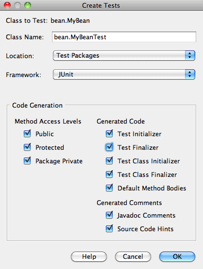
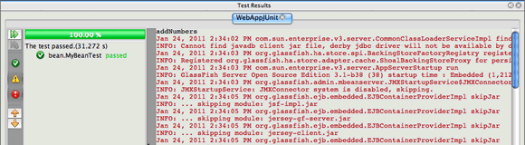

// 
//     Licensed to the Apache Software Foundation (ASF) under one
//     or more contributor license agreements.  See the NOTICE file
//     distributed with this work for additional information
//     regarding copyright ownership.  The ASF licenses this file
//     to you under the Apache License, Version 2.0 (the
//     "License"); you may not use this file except in compliance
//     with the License.  You may obtain a copy of the License at
// 
//       http://www.apache.org/licenses/LICENSE-2.0
// 
//     Unless required by applicable law or agreed to in writing,
//     software distributed under the License is distributed on an
//     "AS IS" BASIS, WITHOUT WARRANTIES OR CONDITIONS OF ANY
//     KIND, either express or implied.  See the License for the
//     specific language governing permissions and limitations
//     under the License.
//

= Using the Embedded EJB Container to Test Enterprise Applications
:jbake-type: tutorial
:jbake-tags: tutorials 
:jbake-status: published
:icons: font
:syntax: true
:source-highlighter: pygments
:toc: left
:toc-title:
:description: Using the Embedded EJB Container to Test Enterprise Applications - Apache NetBeans
:keywords: Apache NetBeans, Tutorials, Using the Embedded EJB Container to Test Enterprise Applications

This tutorial demonstrates how to create and run JUnit tests for a Java EE enterprise application. In this tutorial you will create a web application with an entity class and a session bean. You will first create a JUnit test class for the session bean and run the test in the embedded EJB container. You will then add an entity class to the project and modify the test class to add a test method for the entity class.

*Tutorial Exercises*

* <<Exercise_1,Testing a Session Bean>>
* <<Exercise_1a,Creating the Project>>
* <<Exercise_1b,Creating the Session Bean>>
* <<Exercise_1c,Testing the Session Bean>>
* <<Exercise_1d,Modifying the Test to Specify Container Properties>>
* <<Exercise_1e,Using @BeforeClass and @AfterClass Annotations>>
* <<Exercise_2,Testing an Entity Class>>
* <<Exercise_2a,Creating the Entity Class>>
* <<Exercise_2b,Modifying the Session Bean>>
* <<Exercise_2c,Testing the Entity Class>>
* <<Exercise_3,Downloading the Solution Project>>

*To follow this tutorial, you need the following software and resources.*

|===
|Software or Resource |Version Required 

|xref:../../../download/index.adoc[+NetBeans IDE+] |7.2, 7.3, 7.4, 8.0, Java EE bundle 

|link:http://www.oracle.com/technetwork/java/javase/downloads/index.html[+Java Development Kit (JDK)+] |version 7 or 8 

|GlassFish Server Open Source Edition |3.1.x or 4.x 
|===

NOTE: This tutorial requires the JUnit plugin. If you did not install the JUnit plugin when you installed the IDE, open the Plugins manager, select the Available plugins tab and install the JUnit plugin.

*Prerequisites*

This document assumes you have some basic knowledge of, or programming experience with, the following technologies:

* Java Programming
* NetBeans IDE

Before starting this tutorial you may want to familiarize yourself with the following documents.

* xref:javaee-gettingstarted.adoc[+Getting Started with Java EE Applications+]
* xref:../java/junit-intro.adoc[+Writing JUnit Tests in NetBeans IDE+]
* link:http://download.oracle.com/docs/cd/E19798-01/821-1754/gjlde/index.html[+Using the EJB 3.1 Embeddable API with Embedded GlassFish Server+]

You can download link:https://netbeans.org/projects/samples/downloads/download/Samples%252FJavaEE%252FWebAppJUnit.zip[+a zip archive of the finished project+].

== Testing a Session Bean

In this section you will create a simple Java EE web application that will contain a session bean and an entity class.

=== Creating the Project

1. Choose File > New Project (Ctrl-Shift-N; ⌘-Shift-N on Mac) from the main menu.
2. Select Web Application from the Java Web category. Click Next.
3. Name the project *WebAppJUnit* and set the project location.
4. Deselect the Use Dedicated Folder option, if selected.
Click Next.

. Set the server to *GlassFish Server* and set the Java EE Version to *Java EE 6 Web* or *Java EE 7 Web*. 
Click Finish.

=== Creating the Session Bean

In this exercise you will create a very simple session bean that contains one method that adds two numbers.

1. Right-click the WebAppJUnit project in the Projects window and choose New > Other.
2. Select Session Bean in the Enterprise JavaBeans category. Click Next.
3. Type *MyBean* as the EJB Name.
4. Type *bean* for the Package name.
5. Select Stateless as the Session Type. Click Finish.

When you click Finish, the new class opens in the editor.

. In the editor, add the following method  ``addNumbers``  to the class.

[source,java]
----

@Stateless
public class MyBean {
    *public int addNumbers(int numberA, int numberB) {
        return numberA + numberB;
    }*
}
----

NOTE: It is not necessary to add an  ``@LocalBean``  annotation or implement an interface in this tutorial. By default the bean exposes a no-interface view when no view is explicitly specified.

. Save your changes.

=== Testing the Session Bean

In this exercise you will create a test class for the session bean that will test the  ``addNumbers``  method. The IDE can generate the new test class and skeleton test methods based on the methods in the target class.

1. Right-click the  ``MyBean``  class in the Projects window and choose Tools > Create Tests.
2. Select JUnit in the Frameworks dropdown list.
3. Use the default values in the Create Tests dialog box. Click OK.

NOTE:  The first time that you create a JUnit unit test you need to specify the JUnit version. Select JUnit 4.x in the Select JUnit Version dialog box and click Select.

When you click OK, the IDE generates the  ``MyBeanTest.java``  file and opens the class in the editor.

In the Projects window you can see that the IDE generated the test class under the Test Packages node. By default, the IDE generates a skeleton test method in the test class that calls  ``javax.ejb.embeddable.EJBContainer.createEJBContainer()``  to create an EJB container instance. The  ``createEJBContainer()``  method is one of the methods in the link:http://download.oracle.com/javaee/6/api/javax/ejb/embeddable/EJBContainer.html[+  ``EJBContainer`` +] class that is part of the EJB 3.1 Embeddable API.

If you expand the Test Libraries node in the Projects window, you can see that the IDE automatically added GlassFish Server (embeddable container) and JUnit 4.x as test libraries. If you expand the GlassFish Server library, you can see that the library contains the  ``glassfish-embedded-static-shell.jar`` .

image::images/embedded-static-shell-jar.png[title="Structure of project in the Projects window"]

NOTE:  The  ``glassfish-embedded-static-shell.jar``  JAR does not contain the sources for the embedded EJB container. The  ``glassfish-embedded-static-shell.jar``  JAR requires a local installation of GlassFish. The classpath for the local GlassFish installation is determined by the target server for the project. You can change the target server in the project's Properties dialog box.

. Modify the generated skeleton test method to specify values for  ``numberA`` ,  ``numberB``  and  ``expResult``  and remove the default call to fail.

[source,java]
----

@Test
public void testAddNumbers() throws Exception {
    System.out.println("addNumbers");
    *int numberA = 1;
    int numberB = 2;*
    EJBContainer container = javax.ejb.embeddable.EJBContainer.createEJBContainer();
    MyBean instance = (MyBean)container.getContext().lookup("java:global/classes/MyBean");
    *int expResult = 3;*
    int result = instance.addNumbers(numberA, numberB);
    assertEquals(expResult, result);
    container.close();
}
----

. Right-click the project in the Projects window and choose Test.

When you run the test, the Test Results window opens in the IDE and displays the progress and results of the test.

You will see output similar to the following in the Output window.

[source,java]
----

Testsuite: bean.MyBeanTest
addNumbers
...
Tests run: 1, Failures: 0, Errors: 0, Time elapsed: 31.272 sec

------------- Standard Output ---------------
addNumbers
...
------------- ---------------- ---------------
test-report:
test:
BUILD SUCCESSFUL (total time: 35 seconds)
----

=== Modifying the Test to Specify Container Properties

When you used the Create Tests wizard, the IDE generated a default skeleton test class that contained code for starting the EJB container. In this exercise you will modify the generated code that starts the container to enable you to specify additional properties for the embedded container instance.

1. Add the following code (in bold) to the test class.

[source,java]
----

@Test
public void testAddNumbers() throws Exception {
    System.out.println("addNumbers");
    int numberA = 1;
    int numberB = 2;

    // Create a properties map to pass to the embeddable container:
    *Map<String, Object> properties = new HashMap<String, Object>();*
    // Use the MODULES property to specify the set of modules to be initialized,
    // in this case a java.io.File 
    *properties.put(EJBContainer.MODULES, new File("build/jar"));*

    // Create the container instance, passing it the properties map:
    EJBContainer container = javax.ejb.embeddable.EJBContainer.createEJBContainer(*properties*);

    // Create the instance using the container context to look up the bean 
    // in the directory that contains the built classes
    MyBean instance = (MyBean) container.getContext().lookup("java:global/classes/MyBean");

    int expResult = 3;

    // Invoke the addNumbers method on the bean instance:
    int result = instance.addNumbers(numberA, numberB);

    assertEquals(expResult, result);

    // Close the embeddable container:
    container.close();
}
----

. Right-click in the editor and choose Fix Imports (Alt-Shift-I; ⌘-Shift-I on Mac) to add import statements for  ``java.util.HashMap``  and  ``java.util.Map`` .

. Run the test again to confirm that the modified test works and that the container is created correctly.

You can click the Rerun button in the Test Results window.

 

=== Using  ``@BeforeClass``  and  ``@AfterClass``  Annotations

In this exercise you will modify the test class to create individual methods for creating and shutting down the container instance. This can be useful when you want to run several tests that can use the same container instance. In this way you do not need to open and close a container instance for each test, and instead create one instance that is created before the tests are run and is then closed after all the tests are completed.

In this exercise you will move the code that creates the EJB container to the  ``setUpClass``  method. The  ``setUpClass``  method is annotated with  ``@BeforeClass``  that is used to indicate a method that will be run first, before the other methods in the test class. In this example, the container instance will be created before the  ``testAddNumbers``  test method and the container will exist until it is shut down.

Similarly, you will move the code that shuts down the container to the  ``tearDownClass``  method that is annotated with  ``@AfterClass`` .

1. Add the following field to the test class.

[source,java]
----

private static EJBContainer container;
----

. Copy the code that creates the container from the  ``testAddNumbers``  test method to the  ``setUpClass``  method and

[source,java]
----

@BeforeClass
public static void setUpClass() *throws Exception* {
    *Map<String, Object> properties = new HashMap<String, Object>();
    properties.put(EJBContainer.MODULES, new File("build/jar"));
    container = EJBContainer.createEJBContainer(properties);
    System.out.println("Opening the container");*
}
----

. Copy the code that closes the container from the  ``testAddNumbers``  test method to the  ``tearDownClass``  method.

[source,java]
----

@AfterClass
public static void tearDownClass() *throws Exception* {
    *container.close();
    System.out.println("Closing the container");*
}
----

. Remove the redundant code from the  ``testAddNumbers``  method. Save your changes.

The test class should now look like the following.

[source,java]
----

public class MyBeanTest {
    private static EJBContainer container;

    public MyBeanTest() {
    }

    @BeforeClass
    public static void setUpClass() throws Exception {
        Map<String, Object> properties = new HashMap<String, Object>();
        properties.put(EJBContainer.MODULES, new File("build/jar"));
        container = EJBContainer.createEJBContainer(properties);
        System.out.println("Opening the container");
    }

    @AfterClass
    public static void tearDownClass() throws Exception {
        container.close();
        System.out.println("Closing the container");
    }

    @Before
    public void setUp() {
    }

    @After
    public void tearDown() {
    }

    /**
     * Test of addNumbers method, of class MyBean.
     */ 
    @Test
    public void testAddNumbers() throws Exception {
        System.out.println("addNumbers");
        int numberA = 1;
        int numberB = 2;

        // Create the instance using the container context to look up the bean 
        // in the directory that contains the built classes
        MyBean instance = (MyBean) container.getContext().lookup("java:global/classes/MyBean");

        int expResult = 3;

        // Invoke the addNumbers method on the bean instance:
        int result = instance.addNumbers(numberA, numberB);

        assertEquals(expResult, result);
    }
}
----

If you run the test again to confirm that the container is created and shut down correctly, you will see output similar to the following in the Test Results window.

image::images/test-results2a.png[title="Test Results window"]

You can see that the  ``setUpClass``  method ran before the  ``addNumbers``  test and printed "Opening the container".

== Testing an Entity Class

In this section you will create an entity class and persistence unit and modify the session bean to inject the entity manager and access the entities. You will add a simple method to the new entity class that prints the id number of the entry to the output. You will then add some simple methods to the session bean to create and verify entries in the database.

=== Creating the Entity Class

In this section you will use the New Entity Class wizard to create an entity class and persistence unit with the database connection details.

1. Right-click the WebAppJUnit project in the Projects window and choose New > Other.
2. Select Entity Class in the Persistence category. Click Next.
3. Type *SimpleEntity* as the Class Name.
4. Select bean from the Package dropdown list.
5. Type *int* as the Primary Key Type. Click Next.
6. Use the default Persistence Unit Name and Persistence Provider.
7. Select  ``jdbc/sample``  as the data source and Drop and Create as the strategy. Click Finish.

image::images/create-entity-wizard.png[title="Create Entity Class dialog"]

When you click Finish, the new entity class opens in the editor. If you expand the Configuration Files node in the Projects window, you can see that the IDE automatically generated the  ``persistence.xml``  file that defines the properties of the persistence unit  ``WebAppJUnitPU`` .

. In the editor, add the following private field to the entity class.

[source,java]
----

private String name;
----

. Right-click in the Source Editor and choose Insert Code (Alt-Insert; Ctrl-I on Mac) and select Getter and Setter to open the Generate Getters and Setters dialog box.

. Select the  ``name``  field in the dialog box. Click Generate.

. Add the following method to the class.

[source,java]
----

public SimpleEntity(int id) {
    this.id = id;
    name = "Entity number " + id + " created at " + new Date();
}
----

. Use the  ``@NamedQueries``  and  ``@NamedQuery``  annotations to create a named SQL query.

[source,java]
----

@Entity
*@NamedQueries({@NamedQuery(name = "SimpleEntity.findAll", query = "select e from SimpleEntity e")})*
public class SimpleEntity implements Serializable {
----

. Create a default constructor.

You can click the suggestion icon that is displayed in the gutter next to the class declaration if you want the IDE to generate the constructor for you.

. Fix your imports to add import statements for  ``javax.persistence.NamedQueries`` ,  ``javax.persistence.NamedQuery``  and  ``java.util.Date`` . Save your changes.

In addition to the default generated code, the entity class should now look similar to the following:

[source,java]
----

package bean;

import java.io.Serializable;
import java.util.Date;
import javax.persistence.Entity;
import javax.persistence.GeneratedValue;
import javax.persistence.GenerationType;
import javax.persistence.Id;
import javax.persistence.NamedQueries;
import javax.persistence.NamedQuery;

@Entity
@NamedQueries({@NamedQuery(name = "SimpleEntity.findAll", query = "select e from SimpleEntity e")})
public class SimpleEntity implements Serializable {
    private static final long serialVersionUID = 1L;
    @Id
    @GeneratedValue(strategy = GenerationType.AUTO)
    private int id;

    private String name;

    public SimpleEntity() {
    }

    public String getName() {
        return name;
    }

    public void setName(String name) {
        this.name = name;
    }

    public SimpleEntity(int id) {
        this.id = id;
        name = "Entity number " + id + " created at " + new Date();
    }

    

    ...

}
----

=== Modifying the Session Bean

In this exercise you will edit the  ``MyBean``  session bean to add methods for inserting and retrieving data to the database table.

1. Open  ``MyBean.java``  in the editor.
2. Right-click in the editor and choose Insert Code (Alt-Insert; Ctrl-I on Mac) and choose Use Entity Manager from the popup menu.

When you chose Use Entity Manager, the IDE added the following code to the class to inject the entity manager. You can see that the name of the persistence unit is generated automatically.

[source,java]
----

@PersistenceContext(unitName="WebAppJUnitPU")
private EntityManager em;
----

. Add the following  ``verify``  and  ``insert``  methods.

[source,java]
----

@PermitAll
public int verify() {
    String result = null;
    Query q = em.createNamedQuery("SimpleEntity.findAll");
    Collection entities = q.getResultList();
    int s = entities.size();
    for (Object o : entities) {
        SimpleEntity se = (SimpleEntity)o;
        System.out.println("Found: " + se.getName());
    }

    return s;
}

@PermitAll
public void insert(int num) {
    for (int i = 1; i <= num; i++) {
        System.out.println("Inserting # " + i);
        SimpleEntity e = new SimpleEntity(i);
        em.persist(e);
    }
}
----

. Fix your imports to import  ``javax.persistence.Query``  and save your changes.

=== Testing the Entity Class

In this exercise you will edit the test class to add a method to test that the application is able to look up the EJB and that the  ``insert``  and  ``verify``  methods are behaving correctly.

1. Start the JavaDB database.
2. Open the  ``MyBeanTest.java``  test class in the editor.
3. Edit the test class to add the following  ``testInsert``  test method.

[source,java]
----

@Test
public void testInsert() throws Exception {

    // Lookup the EJB
    System.out.println("Looking up EJB...");
    MyBean instance = (MyBean) container.getContext().lookup("java:global/classes/MyBean");

    System.out.println("Inserting entities...");
    instance.insert(5);
    int res = instance.verify();
    System.out.println("JPA call returned: " + res);
    System.out.println("Done calling EJB");

    Assert.assertTrue("Unexpected number of entities", (res == 5));
    System.out.println("..........SUCCESSFULLY finished embedded test");
}
----

. Right-click the project node in the Projects window and choose Test from the popup menu.

The Test Results window will open and display output that is similar to the following.

image::images/test-results2b.png[title="Test Results window after adding testInsert test"]

You can see the progress of the tests and the order in which the tests were run from the print messages that were added to the test class.

Now that you have a test for your session bean and know that your entity class connection works, you can start coding a web interface for the application. 

== Downloading the Solution Project

You can download the solution to this tutorial as a project in the following ways.

* Download link:https://netbeans.org/projects/samples/downloads/download/Samples%252FJavaEE%252FWebAppJUnit.zip[+a zip archive of the finished project+].
* Checkout the project sources from the NetBeans Samples by performing the following steps:
1. Choose Team > Subversion > Checkout from the main menu.
2. In the Checkout dialog box, enter the following Repository URL:
 ``https://svn.netbeans.org/svn/samples~samples-source-code`` 
Click Next.

. Click Browse to open the Browse Repository Folders dialog box.

. Expand the root node and select *samples/javaee/WebAppJUnit*. Click OK.

. Specify the Local Folder for the sources (the local folder must be empty).

. Click Finish.

When you click Finish, the IDE initializes the local folder as a Subversion repository and checks out the project sources.

. Click Open Project in the dialog that appears when checkout is complete.

NOTE: You need a Subversion client to checkout the sources. For more about installing Subversion, see the section on xref:../ide/subversion.adoc#settingUp[+Setting up Subversion+] in the xref:../ide/subversion.adoc[+Guide to Subversion in NetBeans IDE+].

xref:../../../community/mailing-lists.adoc[Send Feedback on This Tutorial]

== See Also

For more information about using NetBeans IDE to develop Java EE applications, see the following resources:

* xref:javaee-intro.adoc[+Introduction to Java EE Technology+]
* xref:javaee-gettingstarted.adoc[+Getting Started with Java EE Applications+]
* xref:../web/quickstart-webapps.adoc[+Introduction to Developing Web Applications+]
* xref:../java-ee.adoc[+Java EE &amp; Java Web Learning Trail+]

You can find more information about using EJB 3.1 Enterprise Beans in the link:http://download.oracle.com/javaee/6/tutorial/doc/[+Java EE 6 Tutorial+].

To send comments and suggestions, get support, and keep informed on the latest developments on the NetBeans IDE Java EE development features, xref:../../../community/mailing-lists.adoc[+join the nbj2ee mailing list+].

