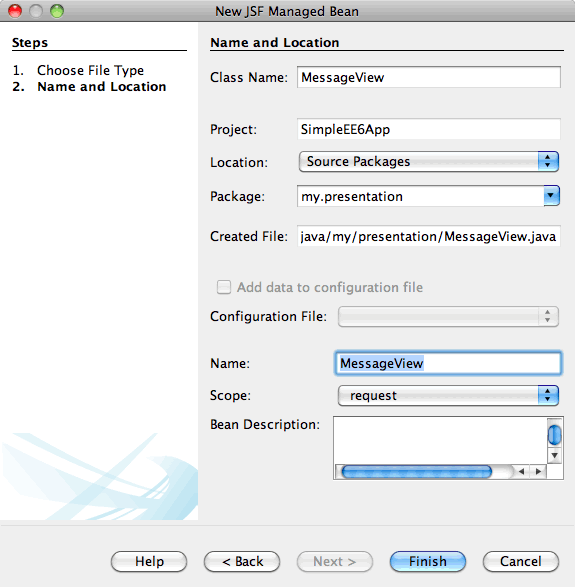

// 
//     Licensed to the Apache Software Foundation (ASF) under one
//     or more contributor license agreements.  See the NOTICE file
//     distributed with this work for additional information
//     regarding copyright ownership.  The ASF licenses this file
//     to you under the Apache License, Version 2.0 (the
//     "License"); you may not use this file except in compliance
//     with the License.  You may obtain a copy of the License at
// 
//       http://www.apache.org/licenses/LICENSE-2.0
// 
//     Unless required by applicable law or agreed to in writing,
//     software distributed under the License is distributed on an
//     "AS IS" BASIS, WITHOUT WARRANTIES OR CONDITIONS OF ANY
//     KIND, either express or implied.  See the License for the
//     specific language governing permissions and limitations
//     under the License.
//

= Getting Started with Java EE Applications
:jbake-type: tutorial
:jbake-tags: tutorials 
:jbake-status: published
:icons: font
:syntax: true
:source-highlighter: pygments
:toc: left
:toc-title:
:description: Getting Started with Java EE Applications - Apache NetBeans
:keywords: Apache NetBeans, Tutorials, Getting Started with Java EE Applications

This document provides a brief introduction to some of the features introduced as part of Java Enterprise Edition 6 (Java EE 6) specification. To illustrate the new features, this tutorial will demonstrate how to create a simple Java EE web application that contains an EJB 3.1 stateless session bean facade for an entity class. You will use wizards in the IDE to generate the entity class and the session bean. The code generated by the wizard uses queries that are defined in the Criteria API that is part of JPA 2.x and contained in the Java EE 6 specification. You will then create a named managed bean that accesses the session facade and a presentation layer that uses the Facelets view framework as specified in JSF 2.x.

This tutorial is based on the blog post link:http://www.adam-bien.com/roller/abien/entry/simplest_possible_jsf_2_ejb[+ Simplest Possible JSF 2 / EJB 3.1 / JPA Component - With WAR Deployment+] by Adam Bien. You can find additional Java EE examples at Adam Bien's Kenai project link:http://kenai.com/projects/javaee-patterns[+ Java EE Patterns and Best Practices+] and in his book "Real World Java EE Patterns - Rethinking Best Practices", available at link:http://press.adam-bien.com[+http://press.adam-bien.com+].

*Tutorial Exercises*

* <<Exercise_1,Creating the Web Application Project>>
* <<Exercise_2,Creating the Entity Class and Session Facade>>
* <<Exercise_2a,Creating the Entity Class>>
* <<Exercise_2b,Creating the Session Facade>>
* <<Exercise_3,Creating the JSF Managed Bean and JSF Pages>>
* <<Exercise_3a,Creating the Managed Bean>>
* <<Exercise_3b,Modifying the Index Page>>
* <<Exercise_3c,Creating the Results Page>>
* <<Exercise_4,Running the Project>>
* <<Exercise_5,Downloading the Solution Project>>

*To follow this tutorial, you need the following software and resources.*

|===
|Software or Resource |Version Required 

|xref:../../../download/index.adoc[NetBeans IDE] |7.2, 7.3, 7.4, 8.0, Java EE version 

|link:http://www.oracle.com/technetwork/java/javase/downloads/index.html[+Java Development Kit (JDK)+] |version 7 or 8 

|GlassFish Server Open Source Edition |3.x, 4.x 
|===

*Prerequisites*

This document assumes you have some basic knowledge of, or programming experience with, the following technologies:

* Java Programming
* NetBeans IDE

You can download link:https://netbeans.org/projects/samples/downloads/download/Samples/JavaEE/SimpleEE6App72.zip[+a zip archive of the finished project+].

== Creating the Web Application Project

In this exercise you create a simple web application. When you create the web application you will specify GlassFish Server as the target Java EE container. The GlassFish server is Java EE-compatible and includes the JSF 2.x libraries that are required in this application.

In the New Project wizard you can choose Java EE 6 Web or Java EE 7 Web as the Java EE version. Java EE 6 Web and Java EE 7 Web are lightweight Java EE profiles that contain a subset of the full Java EE platform. The Java EE Web profiles are designed for web applications that do not require advanced Java EE technologies such as support for remote interfaces, the full EJB 3.1 specification and the Java Message Service (JMS) API.

The Web profiles support the transaction processing and persistence management that are commonly used in enterprise web applications. You can use Java EE Web profiles for web applications that use session beans with a local interface or no interface. The full Java EE profile is required if the application uses a remote interface.

1. Choose File > New Project (Ctrl-Shift-N; ⌘-Shift-N on Mac) from the main menu.
2. Select Web Application from the Java Web category and click Next.
3. Type *SimpleEE6App* for the project name and set the project location.
4. Deselect the Use Dedicated Folder option, if selected. Click Next.
(For this tutorial there is little reason to copy project libraries to a dedicated folder because you will not need to share libraries with other users or projects.)

. Select the GlassFish server and set the Java EE Version to Java EE 6 Web or Java EE 7 Web. Click Next.

image::images/newappwizard.png[title="Server and Settings panel in New Project wizard"]

. Select JavaServer Faces in the Frameworks pane. Click Finish.

By default, the IDE will select the JSF 2.x library if you are developing a Java EE web application and deploying to the GlassFish server. The version of the default JSF library depends on the version bundled with your GlassFish server. The JSF 2.x library enables you to use Facelets as the page language and also provides support for JSF 1.2 and JSP.

image::images/newappwizard2.png[title="Frameworks panel in New Project wizard"]

When you click Finish, the IDE creates the project and opens the project in the Projects window. The IDE automatically creates the page  ``index.xhtml``  and opens the page in the editor.

== Creating the Entity Class and Session Facade

In this section you will create an entity class and a session facade for the entity class. An entity class is a plain old Java object (POJO), a simple Java class that is identified as an entity by the  ``@Entity``  annotation. Starting with the Java EE 5 specification, you can use entity classes as persistent objects to represent tables in a database. The Java Persistence API enables you to use persistence in web applications without the need to create an EJB module.

The session facade for the entity class in this application is a stateless session bean. The Enterprise JavaBean (EJB) 3.1 architecture introduced as part of the Java EE 6 specification enables you to create session beans without the business interfaces that were required in EJB 3.0. The Java EE 6 specification also allows you to package EJB components directly in a WAR archive. This simplifies development of smaller web applications by eliminating the need to create separate EJB modules that are packaged as a JAR archive in an EAR archive. However, for larger enterprise applications that are distributed across different machines, you will still want to create EAR archives to separate your business logic from the presentation layer.

For more about using EJB 3.1 in the IDE, see the tutorial xref:javaee-entapp-ejb.adoc[+Creating an Enterprise Application with EJB 3.1+].

For more details about entity classes, see the chapter link:http://docs.oracle.com/javaee/7/tutorial/doc/persistence-intro.htm[+Introduction to the Java Persistence API+] in the link:http://download.oracle.com/javaee/7/tutorial/doc/[+Java EE 7 Tutorial+].

For more information about session beans, see the chapter link:http://docs.oracle.com/javaee/7/tutorial/doc/ejb-intro002.htm[+What is a Session Bean?+] in the link:http://download.oracle.com/javaee/7/tutorial/doc/[+Java EE 7 Tutorial+].

=== Creating the Entity Class

In this exercise you will use the New Entity Class wizard to create a simple persistent entity class. You will also use the wizard to create a persistence unit that defines the data source and entity manager used in the application. You will add one field in the class to represent the data in your table and generate a getter and setter for the new field.

An entity class must have a primary key. When you create the entity class using the wizard, the IDE by default generates the field  ``id``  and annotates the field with the  ``@Id``  annotation to declare the field as the primary key. The IDE also adds the  ``@GeneratedValue``  annotation and specifies the key generation strategy for the primary id field.

Using Java Persistence in your project greatly simplifies application development by removing the need for configuring deployment descriptors to provide object-relational mapping information for persistent fields or properties. Instead, you can use annotations to define these properties directly in a simple Java class.

Entity persistence is managed by the EntityManager API. The EntityManager API handles the persistence context, and each persistence context is a group of entity instances. When developing your application, you can use annotations in your class to specify the persistent context instance of your entity instances. The life-cycle of the entity instances is then handled by the container.

To create the entity class, perform the following steps.

1. Right-click the project node and choose New > Other.
2. Select Entity Class from the Persistence category. Click Next.
3. Type *Message* for the Class Name.
4. Type *entities* for the Package.
5. Select Create Persistence Unit. Click Next.
6. Select a datasource (for example, select  ``jdbc/sample``  if you want to use JavaDB).

The datasource for  ``jdbc/sample``  is bundled with the IDE when you install the IDE and the GlassFish server, but you can specify a different datasource if you want to use a different database.

You can keep the other default options (persistence unit name, EclipseLink persistence provider). Confirm that the persistence unit is using the Java Transaction API and that the Table Generation Strategy is set to Create so that the tables based on your entity classes are created when the application is deployed.

. Click Finish in the New Entity Class wizard.

When you click Finish, the IDE creates the entity class and opens the class in the editor. You can see that the IDE generated the id field  ``private Long id;``  and annotated the field with  ``@Id``  and  ``@GeneratedValue(strategy = GenerationType.AUTO)`` .

. In the editor, add the  ``message``  field (in bold) below the  ``id``  field.

[source,java]
----

private Long id;
*private String message;*
----

. Right-click in the editor and choose Insert Code (Alt-Insert; Ctrl-I on Mac) and then select Getter and Setter.

. In the Generate Getters and Setters dialog box, select the  ``message``  field and click Generate.

The IDE generates getter and setter methods for the field  ``message`` .

image::images/getters-dialog.png[title="Create Persistence Unit wizard"]

. Save your changes.

The entity class represents a table in the database. When you run this application, a database table for Message will be automatically created. The table will contain the columns  ``id``  and  ``message`` .

If you look at the persistence unit in the XML editor, you can see that the application will use the Java Transaction API (JTA) ( ``transaction-type="JTA"`` ). This specifies that the responsibility for managing the lifecycle of entities in the persistence context is assigned to the container. This results in less code because the entity lifecycle is managed by the container and not by the application. For more about using JTA to manage transactions, see the link:http://www.oracle.com/technetwork/java/javaee/jta/index.html[+Java Transaction API+] documentation.

=== Creating the Session Facade

In this exercise you will use a wizard to create a stateless session facade for the Message entity. The EJB 3.1. specification states that business interfaces for session beans are now optional. In this application where the client accessing the bean is a local client, you have the option to use a local interface or a no-interface view to expose the bean.

To create the session bean, perform the following steps.

1. Right-click the project node and choose New > Other.
2. Select Session Beans for Entity Classes from the Enterprise JavaBeans category. Click Next.
3. Select the  ``Message``  entity and click Add. Click Next.
4. Type *boundary* for the package. Click Finish.

Notice that you did not need to create a business interface for the session bean. Instead, in this application the bean will be exposed to a local managed bean using a no-interface view.

image::images/sessionwizard.png[title="Session Beans for Entity Classes wizard"]

When you click Finish, the IDE generates the session facade class  ``MessageFacade.java``  and  ``AbstractFacade.java``  and opens the files in the editor. As you can see in the generated code, the annotation  ``@Stateless``  is used to declare  ``MessageFacade.java``  as a stateless session bean component.  ``MessageFacade.java``  extends  ``AbstractFacade.java`` , which contains the business logic and manages the transaction.

[source,java]
----

@Stateless
public class MessageFacade extends AbstractFacade<Message> {
    @PersistenceContext(unitName = "SimpleEE6AppPU")
    private EntityManager em;
            
----

When you create the facade for the entity using the wizard, by default the IDE adds the  ``PersistenceContext``  annotation ( ``@PersistenceContext(unitName = "SimpleEE6AppPU")`` ) to inject the entity manager resource into the session bean component and to specify the name of the persistence unit. In this example the name of the persistence unit is declared explicitly, but the name is optional if the application has only one persistence unit.

The IDE also generates methods in  ``AbstractFacade.java``  to create, edit, remove and find entities. The EntityManager API defines the methods that are used to interact with the persistence context. You can see that the IDE generates some commonly used default query methods that can be used to find entity objects. The  ``findAll`` ,  ``findRange``  and  ``count``  methods use methods defined in the Criteria API for creating queries. The Criteria API is part of the JPA 2.x specification that is included in the Java EE 6 specification.

== Creating the JSF Managed Bean and JSF Pages

In this section you will create the presentation layer for the application using JavaServer Faces (JSF) 2.x and a managed backing bean that is used by the JSF pages. The JSF 2.x specification adds support for Facelets as the preferred view technology for JSF-based applications. Starting with JSF 2.x, you can also use the  ``@ManagedBean``  annotation in your source code to declare a class a managed bean. You are no longer required to add entries in the  ``faces-config.xml``  file to declare JSF managed beans. You can use bean names in JSF pages to access methods in the managed bean.

For more about IDE support for the JavaServer Faces 2.x specification, see xref:../web/jsf20-support.adoc[+JSF 2.x Support in NetBeans IDE+].

For more about the JavaServer Faces 2.x specification, see the link:http://docs.oracle.com/javaee/7/tutorial/doc/jsf-intro.htm[+JavaServer Faces Technology+] chapter in the Java EE 7 Tutorial.

=== Creating the Managed Bean

In this exercise you will create a simple JSF managed bean that is used to access the session facade. The JSF 2.x specification enables you to use annotations in the bean class to identify the class as a JSF managed bean, to specify the scope and to specify a name for the bean.

To create the managed bean, perform the following steps.

1. Right-click the project node and choose New > Other.
2. Select JSF Managed Bean from the JavaServer Faces category. Click Next.
3. Type *MessageView* for the Class Name.

You will use the Managed Bean name  ``MessageView``  as the value for the  ``inputText``  and  ``commandButton``  in the JSF page  ``index.xhtml``  when calling methods in the bean.

. Type *my.presentation* for the Package.

. Type *MessageView* for the Name that will be used for the managed bean.

NOTE:  When you create a managed bean using the wizard, the IDE will by default assign a name to the bean based on the name of the bean class and beginning with a lower-case letter. For this tutorial and demonstration purposes, you are explicitly assigning the bean a name that begins with an upper-case letter. When you reference the bean in the JSF pages you will use  ``MessageView``  instead of  ``messageView`` . If you did not explicitly assign the name, you would use the default  ``messageView``  in the JSF page.

. Set Scope to Request. Click Finish.

When you click Finish, the IDE creates the bean class and opens the class in the editor. In the Projects window you will see the following files.

image::images/projectswindow.png[title="Project window showing file structure"]

In the editor, you can see that the IDE added the  ``@ManagedBean``  and  ``@RequestScoped``  annotations and the name of the bean.

[source,java]
----

@ManagedBean(name="MessageView")
@RequestScoped
public class MessageView {

    /** Creates a new instance of MessageView */
    public MessageView() {
    }

}

----

You will now add an  ``@EJB``  annotation to use dependency injection to obtain a reference to the MessageFacade session bean. You will also call the  ``findAll``  and  ``create``  methods that are exposed in the facade. The IDE's code completion can help you when typing the methods.

1. Right-click in the editor and choose Insert Code (Alt-Insert; Ctrl-I on Mac) and choose Call Enterprise Bean in the popup menu.
2. Select MessageFacade in the Call Enterprise Bean dialog box. Click OK.

image::images/callbean.png[title="Call Enterprise Bean dialog"]

When you click OK, the IDE adds the following code (in bold) to inject the bean.

[source,java]
----

public class MessageView {

    /** Creates a new instance of MessageView */
    public MessageView() {
    }

    // Injects the MessageFacade session bean using the @EJB annotation
    *@EJB
    private MessageFacade messageFacade;*
}

----

. Add the following code to create a new instance.

[source,java]
----

/** Creates a new instance of MessageView */
    public MessageView() {
       this.message = new Message();
    }
----

. Add the following code to the class.

[source,java]
----

    // Creates a new field
    private Message message;

    // Calls getMessage to retrieve the message
    public Message getMessage() {
       return message;
    }

    // Returns the total number of messages
    public int getNumberOfMessages(){
       return messageFacade.findAll().size();
    }

    // Saves the message and then returns the string "theend"
    public String postMessage(){
       this.messageFacade.create(message);
       return "theend";
    }

----

. Right-click in the editor and choose Fix Imports (Alt-Shift-I; ⌘-Shift-I on Mac) and save your changes.

You can use the code completion in the editor to help you type your code.

Notice that the  ``postMessage``  method returns the string "theend". The JSF 2.x specification enables the use of implicit navigation rules in applications that use Facelets technology. In this application, no navigation rules are configured in  ``faces-config.xml`` . Instead, the navigation handler will try to locate a suitable page in the application. In this case, the navigation handler will try to locate a page named  ``theend.xhtml``  when the  ``postMessage``  method is invoked.

=== Modifying the Index Page

In this exercise you will make some simple changes to the  ``index.xhtml``  page to add some UI components. You will add a form with an input text field and a button.

1. Open  ``index.xhtml``  in the editor.
2. Modify the file to add the following simple form between the  ``<h:body>``  tags.

[source,xml]
----

<h:body>
    *<f:view>
        <h:form>
            <h:outputLabel value="Message:"/><h:inputText value="#{MessageView.message.message}"/>
            <h:commandButton action="#{MessageView.postMessage}" value="Post Message"/>
        </h:form>
    </f:view>*
</h:body>
----

The JSF code completion can help you when you type the code.

image::images/jsfcodecompletion1.png[title="Code completion in the source editor"]

NOTE:  If you copy and paste the code into the file, you will see a warning in the left margin next to the line containing  ``<f:view>`` . You can place your insert cursor in the line and type Alt-Space to open the hint on how to resolve the error. The hint informs you that you need to add the  ``xmlns:f="http://xmlns.jcp.org/jsf/core"``  library declaration.

. Save your changes.

The  ``inputText``  and  ``commandButton``  components will invoke the methods in the named JSF managed bean  ``MessageView`` . The  ``postMessage``  method will return "theend", and the navigation handler will look for a page named  ``theend.xhtml`` .

=== Creating the Results Page

In this exercise you will create the JSF page  ``theend.xhtml`` . The page will be displayed when the user clicks the Post Message button in  ``index.xhtml``  and invokes the  ``postMessage``  method in the JSF managed bean.

1. Right-click the project node and choose New > Other.
2. Select JSF Page from the JavaServer Faces category. Click Next.
3. Type *theend* as the File Name.
4. Confirm that the Facelets option is selected. Click Finish.

image::images/result-jsf-page.png[title="Creating the theend JSF file in the New JSF File wizard"]

. Modify the file by typing the following between the <h:body> tags.

[source,xml]
----

<h:body>
    *<h:outputLabel value="Thanks! There are "/>
    <h:outputText value="#{MessageView.numberOfMessages}"/>
    <h:outputLabel value=" messages!"/>*
</h:body>
----

When you start typing, the IDE automatically adds the  ``xmlns:h="http://xmlns.jcp.org/jsf/html"``  tag library definition to the file for the JSF elements.

== Running the Application

You are now finished coding the application. You can now test the application in your browser.

1. Right-click the project node in the Projects window and choose Run.

When you choose Run, the IDE builds and deploys the application and opens  ``index.xhtml``  in your browser.

. Type a message in the text field. Click Post Message. 

image::images/browser1.png[title="Application in browser"]

When you click Post Message, the message is saved to the database and the number of messages is retrieved and displayed.

image::images/browser2.png[title="Application in browser showing results"] 

== Downloading the Solution Project

You can download the sample projects used in this tutorial in the following ways.

* Download link:https://netbeans.org/projects/samples/downloads/download/Samples/JavaEE/SimpleEE6App72.zip[+a zip archive of the finished project+].
* Checkout the project sources from the NetBeans Samples by performing the following steps:
1. Choose Team > Subversion > Checkout from the main menu.
2. In the Checkout dialog box, enter the following Repository URL:
 ``https://svn.netbeans.org/svn/samples~samples-source-code`` 
Click Next.

. Click Browse to open the Browse Repository Folders dialog box.

. Expand the root node and select *samples/javaee/SimpleEE6App*. Click OK.

. Specify the Local Folder for the sources (the local folder must be empty).

. Click Finish.

When you click Finish, the IDE initializes the local folder as a Subversion repository and checks out the project sources.

. Click Open Project in the dialog that appears when checkout is complete.

NOTE: You need a Subversion client to checkout the sources. For more about installing Subversion, see the section on xref:../ide/subversion.adoc#settingUp[+Setting up Subversion+] in the xref:../ide/subversion.adoc[+Guide to Subversion in NetBeans IDE+].

xref:../../../community/mailing-lists.adoc[Send Feedback on This Tutorial]

== See Also

For more information about using NetBeans IDE to develop Java EE applications, see the following resources:

* xref:javaee-intro.adoc[+Introduction to Java EE Technology+]
* xref:../web/jsf20-support.adoc[+JSF 2.x Support in NetBeans IDE+]
* xref:../java-ee.adoc[+Java EE &amp; Java Web Learning Trail+]

You can find more information about using Java EE technologies to develop applications in the link:http://download.oracle.com/javaee/7/tutorial/doc/[+Java EE 7 Tutorial+].

To send comments and suggestions, get support, and keep informed on the latest developments on the NetBeans IDE Java EE development features, xref:../../../community/mailing-lists.adoc[+join the nbj2ee mailing list+].

