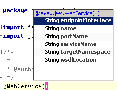

// 
//     Licensed to the Apache Software Foundation (ASF) under one
//     or more contributor license agreements.  See the NOTICE file
//     distributed with this work for additional information
//     regarding copyright ownership.  The ASF licenses this file
//     to you under the Apache License, Version 2.0 (the
//     "License"); you may not use this file except in compliance
//     with the License.  You may obtain a copy of the License at
// 
//       http://www.apache.org/licenses/LICENSE-2.0
// 
//     Unless required by applicable law or agreed to in writing,
//     software distributed under the License is distributed on an
//     "AS IS" BASIS, WITHOUT WARRANTIES OR CONDITIONS OF ANY
//     KIND, either express or implied.  See the License for the
//     specific language governing permissions and limitations
//     under the License.
//

= NetBeans IDEでのJava EEテクノロジのサポートの概要
:jbake-type: tutorial
:jbake-tags: tutorials 
:jbake-status: published
:icons: font
:syntax: true
:source-highlighter: pygments
:toc: left
:toc-title:
:description: NetBeans IDEでのJava EEテクノロジのサポートの概要 - Apache NetBeans
:keywords: Apache NetBeans, Tutorials, NetBeans IDEでのJava EEテクノロジのサポートの概要

NetBeans IDEは、Java EEおよびGlassFishの各チームとの密接な協力のもとで、Java EE仕様との最大限の統合と、できるかぎり容易な使用方法を実現するために開発されました。NetBeans IDEは、Java EEプログラミングを迅速に学習し、生産性を向上させる最善の方法です。

このドキュメントでは、Java EE仕様の主な概念を紹介し、それらが実際のプログラミングにどのように関係するかを説明します。このチュートリアルは、次の項で構成されます。

image::images/netbeans-stamp-80-74-73.png[title="このページの内容は、NetBeans IDE 7.2、7.3、7.4および8.0に適用されます"]

* <<annotations,デプロイメント・ディスクリプタに代わる注釈>>
* <<ejb,簡素化されたEJBソフトウェア開発>>
* <<injection,依存性インジェクションを使用した、リソースへのアクセス>>
* <<persistence,Java Persistence APIモデル>>
* <<webservice,Webサービス>>

Java EEアプリケーションの開発とデプロイの詳細は、link:http://download.oracle.com/javaee/7/tutorial/doc/[+Java EE 7チュートリアル+]およびlink:http://download.oracle.com/javaee/6/tutorial/doc/[+Java EE 6チュートリアル+]を参照してください。

== デプロイメント・ディスクリプタに代わる注釈

Java EEプラットフォームでは、サーブレットの仕様で要求されるデプロイメント・ディスクリプタ、 ``web.xml`` ファイルを除き、デプロイメント・ディスクリプタの必要性を除去することによってデプロイメントを簡素化しています。 ``ejb-jar.xml`` のようなその他のデプロイメント・ディスクリプタや、 ``web.xml`` のWebサービスに関連するエントリは、旧式です。J2EE 1.4のデプロイメント・ディスクリプタは、複雑になることが多く、記述時に誤りが起こりやすいものでした。Java EEプラットフォームでは、かわりに「注釈」を利用します。注釈は ``public`` や ``private`` と同様に、コード内で指定するJavaの修飾子です。たとえば、Java EE仕様のサブセットであるEJB 3仕様は、Beanタイプ、インタフェース・タイプ、リソース参照、トランザクション属性、セキュリティなどのための注釈を定義します。JAX-WS 2.0仕様も、Webサービスのためのよく似た注釈のセットを提供しています。アーティファクトの生成に使用される注釈もあります。また、コードの記録に使用されるその他の注釈もあります。その他にも、セキュリティや実行時に特有のロジックのような拡張サービスを提供するものがあります。要約すると、Java EEプラットフォームは、特に次の作業のための注釈を提供しています。

* Webサービスの定義と使用
* EJBソフトウェア・アプリケーションの開発
* XMLへのJavaテクノロジのクラスのマッピング
* データベースへのJavaテクノロジのクラスのマッピング
* 操作へのメソッドのマッピング
* 外部依存性の指定
* セキュリティ属性を含むデプロイメント情報の指定

注釈には ``@`` 記号がマークされています。IDEでは、Java EEの注釈を利用した型を作成すると、生成されたコード内に関連するプレースホルダが用意されます。たとえば、IDEを使用してステートレス・セッションBeanを作成すると、 ``@Stateless() `` という注釈を含んだ次のコードが生成されます。

[source,java]
----

package mypackage;

import javax.ejb.*;

@Stateless()
public class HelloWorldSessionBean implements mypackage.HelloWorldSessionLocal {

}
----

コード補完により、カーソルの下にある項目に固有の注釈の属性にアクセスできます。たとえば、 ``@WebService()`` という注釈の括弧内で[Ctrl]-[Space]を押すと、次のように表示されます。

各属性はデフォルト値を持っています。そのため、デフォルト値以外の値を使用しない限り、どの属性の値も指定する必要はありません。単純な事例では、デフォルト値で十分に事足ります。これは、属性をまったく入力しなくてもよいことを意味します。

== 簡素化されたEJBソフトウェア開発

新しいEJB 3.0 APIは、開発者に必要とされる作業の量を減らして簡素化することによって、ソフトウェア開発を容易にしています。つまり、クラスの数とコードの量が少なくなっています。これは、作業の多くがコンテナによって実行されるために可能になりました。EJB 3の機能と利点の一部を次に示します。

* *必要なクラスおよびインタフェースが減少。*必要なメソッドの公開はコンテナが担当するため、EJBコンポーネントのホーム・インタフェースおよびオブジェクト・インタフェースは必要ありません。ビジネス・インタフェースを用意するのみで済みます。EJBコンポーネントの宣言に注釈を使用することができ、コンテナがそのトランザクションを管理します。
* *デプロイメント・ディスクリプタが不要。*以前はデプロイメント・ディスクリプタで定義していた依存性および構成についての指示を、直接クラス内で注釈を使用してコンテナに指示できます。特に指示がない場合、コンテナはデフォルト・ルールを使用して、ごく一般的な状況を処理します。
* *単純なルックアップ。*`EJBContext`を使用して、クラス内のJNDI名前空間にあるオブジェクトを直接検索できます。
* *簡素化されたオブジェクト・リレーショナル・マッピング。*新しいJava Persistence APIにより、POJO内で注釈を使用してJavaオブジェクトをリレーショナル・データベースにマッピングすることで、オブジェクト・リレーショナル・マッピングがより単純で透過性の高いものになっています。

IDEでは、他のJavaクラスをコーディングするように、エンタープライズBeanをコーディングすることができ、コード補完とエディタ・ヒントを使用して、適切なメソッドを実装し、インタフェースでクラスの同期を保持できます。ビジネス・メソッドやWebサービス操作などを生成するために特別なコマンドやダイアログ・ボックスを使用する必要はありませんが、コマンドは、ユーザーがJava EEコードの構文に慣れるのを支援するために、まだ使用できます。

== 依存性インジェクションを使用した、リソースへのアクセス

_依存性インジェクション_により、オブジェクトは注釈を使用して外部リソースを直接リクエストすることが可能になります。その結果、リソース作成およびルックアップのコードの使用によってコードが煩雑になることがないため、より整理されたコードになります。EJBコンポーネント、Webコンテナおよびクライアントでリソース・インジェクションを使用できます。

リソースの注入をリクエストするために、コンポーネントは`@Resource`という注釈か、または特別なリソースの場合には`@EJB`および`@WebServiceRef`という注釈を使用します。注入できるリソースには、次のものがあります。

* `SessionContext`オブジェクト
* `DataSources`オブジェクト
* `EntityManager`インタフェース
* その他のエンタープライズBean
* Webサービス
* メッセージ・キューおよびトピック
* リソース・アダプタのための接続ファクトリ

IDEでは、Java EEプラットフォームによって提供されるリソース・インジェクションの注釈のための完全なコード補完が、ソース・エディタに用意されています。また、「EJBのコール」および「データベースを使用」などのコマンドを実行すると、IDEによって、ファイルにリソースが自動的に注入されます。

== Java Persistence APIモデル

Java EEプラットフォームには、link:http://jcp.org/en/jsr/detail?id=220[+JSR-220+]の一部として開発されたJava Persistence APIが導入されています。Java Persistence APIは、Webアプリケーションやアプリケーション・クライアントなど、EJBコンポーネント以外でも使用できます。また、Java EEプラットフォーム以外でJava SEアプリケーションでも使用できます。

Java Persistence APIの主な特徴として、次の点があります。

* *エンティティがPOJO。*コンテナ管理対象持続性(CMP)を使用していたEJBコンポーネントとは異なり、新しいAPIを使用するエンティティ・オブジェクトはコンポーネントではないため、EJBモジュール内に存在する必要はありません。
* *標準化されたオブジェクト・リレーショナル・マッピング。*新しい仕様はオブジェクト・リレーショナル・マッピングの処理方法を標準化しているため、開発者はベンダー固有の戦略を学ばなくてもよくなります。Java Persistence APIは、オブジェクト・リレーショナル・マッピングの情報を指定するために注釈を使用しますが、これまでどおりXMLディスクリプタもサポートしています。
* *名前付き問合せ。*この名前付き問合せは、メタデータ内に表現された静的な問合せです。この問合せはJava Persistence API問合せまたはネイティブ問合せのどちらかになります。これにより、問合せの再利用が非常に単純になります。
* *単純なパッケージング・ルール。*エンティティBeanはJavaテクノロジの単純なクラスであるため、Java EEアプリケーション内の任意の場所でパッケージ化できます。たとえば、エンティティBeanは、EJBの`JAR`、アプリケーション・クライアントの`JAR`、`WEB-INF/lib`、`WEB-INF/classes`の一部にできます。あるいは、エンタープライズ・アプリケーションのアーカイブ(EAR)ファイル内のユーティリティの`JAR`の一部にすることさえできます。これらの単純なパッケージング・ルールを使用すれば、Webアプリケーションまたはアプリケーション・クライアントからエンティティBeanを使用するためにEARファイルを作成する必要はありません。
* *デタッチされたエンティティ。*エンティティBeanはPOJOであるため、シリアライズしてネットワーク経由で別のアドレス・スペースに送信し、持続性を意識しない環境で使用できます。そのため、データ転送オブジェクト(DTO)を使用する必要はありません。
* *EntityManager API。*アプリケーション・プログラマは、標準のEntityManager APIを使用して、エンティティに関連する作成/読取り/更新/削除(CRUD: `Create Read Update Delete`)操作を実行できるようになりました。

IDEには、新しいJava Persistence APIを利用したツールが用意されています。エンティティ・クラスは、データベースから自動的に作成でき、手動でコーディングすることもできます。IDEには、持続性ユニットの作成および管理を行うためのテンプレートおよびグラフィック・エディタも提供されています。Java Persistence APIの使用の詳細は、link:javaee-gettingstarted.html[+Java EEアプリケーションの開始+]を参照してください。

== Webサービス

Java EEプラットフォームでは、注釈の使用によってWebサービスのサポートが大幅に向上し、簡素化されています。この領域に関与する仕様には、JSR 224 (Java API for XML-Based Web Services (JAX-WS) 2.0)、JSR 222 (Java Architecture for XML Binding (JAXB) 2.0)およびJSR 181 (Web Services Metadata for the Java Platform)があります。

=== JAX-WS 2.0

JAX-WS 2.0は、Java EEプラットフォーム内のWebサービスのための新しいAPIです。JAX-RPC 1.1の後継としてのJAX-WS 2.0は、データ・バインディング、プロトコルとトランスポートの独立性、`REST`スタイルのWebサービスのサポート、各開発の容易さなど、いくつかの面が改善されている一方で、自然なRPCプログラミング・モデルを保持しています。

JAX-RPC 1.1との決定的な違いは、すべてのデータ・バインディングがJAXB 2.0に委託されたことです。これにより、JAX-WSベースのWebサービスはXMLスキーマを100パーセント活用でき、相互運用性および使い勝手の向上につながっています。この2つのテクノロジが十分に統合されているため、ユーザーが2種類のツール・セットを使い分ける必要はありません。Javaテクノロジのクラスから始めると、JAXB 2.0は、WSDL (Web Service Description Language)ドキュメント内部に自動的に埋め込まれたXMLスキーマ・ドキュメントを生成できるため、ユーザーが手動でこの誤りが起こりやすい統合を実行しなくてすみます。

追加設定をしなくても、JAX-WS 2.0はSOAP 1.1、SOAP 1.2およびXML/HTTPプロトコルをサポートしています。プロトコル拡張性は当初からの目標であったため、JAX-WS 2.0では、たとえばFAST Infosetのような、より優れたパフォーマンス、または特化されたアプリケーションのために、ベンダーが追加のプロトコルおよびエンコーディングをサポートすることが可能です。大きなバイナリ・データの送受信を最適化するためにアタッチメントを使用するWebサービスは、W3CのMTOM/XOP (Message Transmission Optimization Mechanism/XML-binary Optimized Packagingの略)標準をプログラミング・モデルへの影響なしに使用できます。(詳細はlink:http://www.w3.org/TR/2005/REC-soap12-mtom-20050125/[+MTOM/XOP+]のページを参照。)Java EEテクノロジ以前は、Webサービスを定義するのに、長くて扱いにくいディスクリプタが必要でした。今では、`@WebService`という注釈をJavaテクノロジのクラスに付けるのみです。このクラスのすべてのpublicメソッドは、Webサービス操作として自動的に公開され、その引数はすべてJAXB 2.0を使用してXMLスキーマ・データ型にマッピングされます。

=== 非同期Webサービス

Webサービスの呼出しはネットワーク上で行われるため、こうしたコールにかかる時間は予測できません。多くのクライアント、特にJFC/Swingベースのデスクトップ・アプリケーションのような対話型のものでは、サーバーからのレスポンスを待つ必要があるため、重大なパフォーマンスの低下が起こることがあります。そうしたパフォーマンスの低下を避けるため、JAX-WS 2.0は新しい非同期式のクライアントAPIを提供しています。このAPIにより、アプリケーション・プログラマは独自にスレッドを作成する必要がなくなります。かわりに、長時間実行されるリモート呼出しの管理をJAX-WSランタイムに任せることができます。

非同期メソッドは、WSDLによって生成された任意のインタフェースに加えて、より動的な`Dispatch` APIとも同時に使用できます。WSDLドキュメントのインポート時には、Webサービスによって定義された任意の操作のために、非同期メソッドの要求できます。

2つの使用モデルがあります。

* ポーリング・モデルでは、コールを行います。準備ができてから、結果をリクエストします。
* コールバック・モデルでは、ハンドラを登録します。レスポンスが届き次第、通知されます。

非同期呼出しのサポートはすべてクライアント側に実装されるため、対象のWebサービスには変更は必要ありません。

IDEには、JAX-WSを操作するツールが用意されています。新規ファイル・ウィザードのテンプレートを使用してJAX-WSアーティファクトを生成できます。非同期Webサービスは、Webサービス・カスタマイゼーション・エディタを使用して作成できます。このエディタのコード補完機能には、Webサービスで使用できる注釈も含まれます。

link:/about/contact_form.html?to=3&subject=Feedback:%20Intro%20to%20Java%20EE%205%20Technology[+このチュートリアルに関するご意見をお寄せください+]

== 次の手順

NetBeans IDEを使用したJava EEアプリケーションの開発方法の詳細は、次のリソースを参照してください。

* link:javaee-gettingstarted.html[+Java EEアプリケーションの開始+]
* link:../websvc/jax-ws.html[+JAX-WS Webサービスについて+]
* link:../../trails/java-ee.html[+Java EEおよびJava Webの学習+]

link:../../../community/lists/top.html[+nbj2ee@netbeans.orgメーリング・リスト+]に登録することによって、NetBeans IDE Java EE開発機能に関するご意見やご提案を送信したり、サポートを受けたり、最新の開発情報を入手したりできます。

