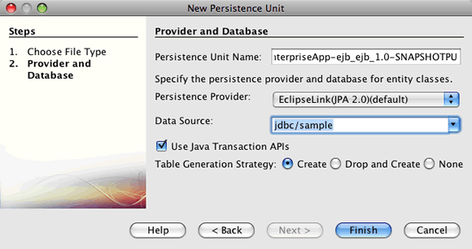
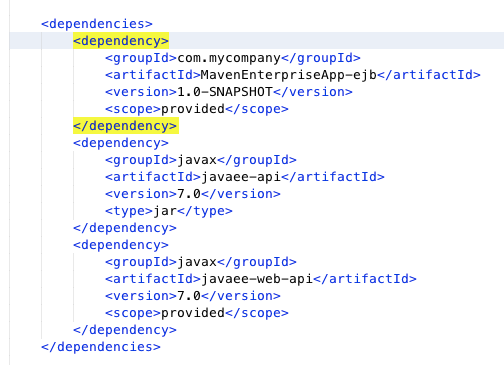
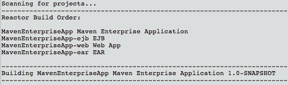
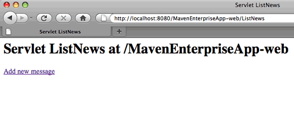

// 
//     Licensed to the Apache Software Foundation (ASF) under one
//     or more contributor license agreements.  See the NOTICE file
//     distributed with this work for additional information
//     regarding copyright ownership.  The ASF licenses this file
//     to you under the Apache License, Version 2.0 (the
//     "License"); you may not use this file except in compliance
//     with the License.  You may obtain a copy of the License at
// 
//       http://www.apache.org/licenses/LICENSE-2.0
// 
//     Unless required by applicable law or agreed to in writing,
//     software distributed under the License is distributed on an
//     "AS IS" BASIS, WITHOUT WARRANTIES OR CONDITIONS OF ANY
//     KIND, either express or implied.  See the License for the
//     specific language governing permissions and limitations
//     under the License.
//

= 使用 Maven 创建企业应用程序
:jbake-type: tutorial
:jbake-tags: tutorials 
:jbake-status: published
:icons: font
:syntax: true
:source-highlighter: pygments
:toc: left
:toc-title:
:description: 使用 Maven 创建企业应用程序 - Apache NetBeans
:keywords: Apache NetBeans, Tutorials, 使用 Maven 创建企业应用程序

本教程说明了如何使用 NetBeans IDE 和 Maven 原型创建简单的企业应用程序。本教程还提供了一些有关使用 IDE 创建和构建 Maven 应用程序的说明和提示。

在本教程中，将创建一个企业应用程序，该应用程序将打包为 EAR 档案并部署到 GlassFish Server Open Source Edition 3。在新建项目向导中，将使用 Maven 企业应用程序原型创建应用程序。该应用程序包含一个 EJB 项目，其中包含实体的持久性实体类、消息驱动 Bean 和会话 Bean Facade。该应用程序还包含一个 Web 项目，其中包含两个 Servlet。

*教程练习*

* <<intro,在 IDE 中使用 Maven>>
* <<Exercise_1,创建 Maven 企业应用程序项目>>
* <<Exercise_2,对 EJB 模块进行编码>>
* <<Exercise_2a,创建持久性单元>>
* <<Exercise_2b,创建实体类>>
* <<Exercise_2c,创建消息驱动 Bean>>
* <<Exercise_2d,创建会话 Facade>>
* <<Exercise_3,对 Web 模块进行编码>>
* <<Exercise_3a,创建 ListNews Servlet>>
* <<Exercise_3b,创建 PostMessage Servlet>>
* <<Exercise_4,使用 Maven 构建应用程序>>
* <<Exercise_4a,处理项目依赖关系>>
* <<Exercise_4b,使用依赖关系构建>>
* <<Exercise_5,部署并运行应用程序>>
* <<Exercise_5a,从 IDE 中部署>>
* <<Exercise_5b,从 GlassFish Server 管理控制台中部署>>
* <<Exercise_7,下载解决方案项目>>

*要学习本教程，您需要具备以下软件和资源。*

|===
|软件或资源 |要求的版本 

|link:https://netbeans.org/downloads/index.html[+NetBeans IDE+] |7.2、7.3、7.4、8.0、Java EE 版本 

|link:http://www.oracle.com/technetwork/java/javase/downloads/index.html[+Java 开发工具包 (JDK)+] |版本 7 或 8 

|GlassFish Server Open Source Edition |4.x 
|===

*先决条件*

本文档假定您具备以下技术的一些基本知识或编程经验：

* Java 编程
* NetBeans IDE

在开始本教程之前，您可以先阅读下面这些文档。

* link:http://wiki.netbeans.org/MavenBestPractices[+NetBeans IDE 中的 Apache Maven 最佳做法+]
* link:http://books.sonatype.com/mvnref-book/reference/introduction.html[+Chapter 1. Introducing Apache Maven+]（第 1 章. Apache Maven 简介，来自 link:http://books.sonatype.com/mvnref-book/reference/index.html[+Maven: The Complete Reference+]（Maven：完整参考））

您可以下载link:https://netbeans.org/projects/samples/downloads/download/Samples%252FJavaEE%252FMavenEnterpriseApp.zip[+已完成项目的 zip 档案文件+]。

== 在 IDE 中使用 Maven

NetBeans IDE 中完全集成了 Maven 支持。开发使用 Maven 框架的项目几乎与在 Ant 中开发项目完全相同。不过，Maven 构建项目和使用依赖关系的方式有一些区别。如果是第一次创建 Maven 应用程序，以下提示可帮助您避免某些问题。

*检查 Maven 设置*

如果这是您首次创建 Maven 项目，则需要在 "Options"（选项）窗口中检查 Maven 配置设置。Maven 与 IDE 捆绑在一起，并随同 IDE 一起安装。

1. 在 IDE 中打开“选项”窗口（“工具”>“选项”；在 Mac 上为 "NetBeans" >“首选项”）。
2. 在“选项”窗口中选择 "Java" 类别，然后单击 "Maven" 标签。

您可以使用与 IDE 捆绑在一起的 Maven 版本，也可以指定 Maven 在本地的安装位置（要求为 2.0.9 或更高版本）。

. 选择 "OK"（确定）以关闭 "Options"（选项）窗口。

NOTE: 在 IDE 中启用 Java 后，会自动启用 Maven 支持。您将需要启用 Java EE 插件（如果尚未启用）。

*更新 Maven 资源库*

本地和远程 Maven 资源库可用于代码完成以及构建项目。应更新 Maven 远程资源库索引，以确保在开发项目时可方便地使用所需的任何工件。可以在 "Options"（选项）窗口的 "Maven" 标签中配置 IDE 检查更新的频率。您可以执行即时更新检查，并在“服务”窗口中浏览本地和远程 Maven 资源库。

1. 选择“窗口”>“服务”以打开“服务”窗口。
2. 在“服务”窗口中展开“Maven 资源库”节点。
3. 展开资源库节点以查看工件。
4. 右键单击资源库节点并在弹出式菜单中选择“更新索引”。

在单击 "Update Indexes"（更新索引）时，IDE 将检查并下载每个 Maven 远程资源库的最新索引。索引表示位于资源库中的工件的当前状态，并用于提供对可用于应用程序的工件的引用。默认情况下，在明确需要工件之前，IDE 不会从资源库中下载该工件。

在 "Services"（服务）窗口中右键单击 "Maven Repositories"（Maven 资源库）并选择 "Find"（查找）可搜索工件。

[NOTE]
====
* 索引非常大，因此可能需要一些时间才能全部更新。
* 如果您使用的是 NetBeans IDE 7.1 或更早版本，您将需要选择 "Window"（窗口）> "Other"（其他）> "Maven Repository Browser"（Maven 资源库浏览器），并在 "Maven Repository Browser"（Maven 资源库浏览器）窗口顶部单击 "Update Indexes"（更新索引）(image:images/maven-refreshrepo.png[title=""Update Indexes"（更新索引）按钮"])。
====

有关在 NetBeans IDE 中使用 Maven 的更多详细信息，请参见link:https://netbeans.org/kb/docs/java/maven-hib-java-se.html[+使用 Hibernate 创建 Maven Swing 应用程序+]教程中的link:https://netbeans.org/kb/docs/java/maven-hib-java-se.html#02[+配置 Maven+] 部分以及 link:http://wiki.netbeans.org/MavenBestPractices[+NetBeans IDE 中的 Apache Maven 最佳做法+]。

== 创建 Maven 企业应用程序项目

本练习的目标是使用与 IDE 捆绑在一起的 Maven 企业应用程序原型创建企业应用程序项目。该企业应用程序原型还会创建 EJB 项目和 Web 应用程序项目。

IDE 在新建项目向导中包含几个 Maven 原型，以帮助您快速创建常见类型的 NetBeans 项目，如企业应用程序项目 (EAR)、Web 应用程序项目 (WAR) 和 EJB 模块项目 (JAR)。该向导还允许使用注册的远程资源库中的原型创建项目。

1. 从主菜单中选择 "File"（文件）> "New Project"（新建项目）（Ctrl-Shift-N 组合键；在 Mac 上为 ⌘-Shift-N 组合键）。
2. 从 "Maven" 类别中选择 "Enterprise Application"（企业应用程序）。单击 "Next"（下一步）。

image::images/maven-newproject1.png[title="新建项目向导中的 "Maven Enterprise Application"（Maven 企业应用程序）项目类型"]

. 键入 *MavenEnterpriseApp* 作为项目名称并设置项目位置。

. （可选）修改工件详细信息。单击 "Next"（下一步）。 

image::images/maven-newproject2.png[title="新建项目向导中的 "Maven Project"（Maven 项目）详细信息"]

. 选择 GlassFish Server 作为服务器。

. 将 "Java EE Version"（Java EE 版本）设置为 "Java EE 6" 或 "Java EE 7"。

. 选中 "Create EJB Module"（创建 EJB 模块）和 "Create Web App Module"（创建 Web 应用程序模块）。单击 "Finish"（完成）。

单击 "Finish"（完成），此时 IDE 将使用 Maven 企业应用程序原型创建以下项目。

* *EJB*。(MavenEnterpriseApp-ejb) EJB 项目通常包含应用程序业务逻辑的源代码。EJB 项目将打包为 EJB JAR 档案。
* *Web 应用程序*。(MavenEnterpriseApp-web) Web 应用程序项目通常包含应用程序的表示层，例如 JSF 和 JSP 页以及 Servlet。Web 应用程序项目可能还包含业务逻辑源代码。Web 应用程序项目将打包为 WAR 档案。
* *汇编*。(MavenEnterpriseApp) 汇编项目用于汇编 EJB 和 WAR 档案中的 EAR 档案。Assembly 项目不包含任何源代码。
* *企业应用程序*。(MavenEnterpriseApp-ear) 企业应用程序项目不包含任何源代码。企业应用程序仅包含 POM 文件 ( ``pom.xml`` ) 以及企业应用程序中包含的模块的详细信息。

image::images/maven-projectswindow2.png[title="显示已生成项目的 "Projects"（项目）窗口"]

在创建企业应用程序项目后，如果有任何依赖关系不可用，则将标记该企业应用程序项目。如果展开 MavenEnterpriseApp-ear 项目的 "Dependencies"（依赖关系）节点，则可以看到是否缺少任何所需的库或所需的库不在类路径中。企业应用程序项目依赖于在编译 EJB 项目和 Web 项目后打包和提供的 JAR 和 WAR。您可以看到， ``MavenEnterpriseApp-ejb``  和  ``MavenEnterpriseApp-web``  作为依赖关系列出。

在某些情况下，您会在状态栏中看到 "Maven" 图标，您可以单击该图标以运行初期构建，并解决缺少依赖关系的问题。

image::images/priming-build.png[title="使用状态栏中的 Maven 图标可以运行初期构建"] 

== 对 EJB 项目进行编码

EJB 项目包含应用程序的业务逻辑。在此应用程序中，GlassFish 容器将使用 Java 事务 API (JTA) 管理事务。在本教程中，将在 EJB 项目中创建一个实体类及其消息驱动 Bean 和会话 Facade。

=== 创建持久性单元

在本练习中，将在 EJB 项目中创建一个持久性单元。持久性单元指定数据库连接详细信息以及如何管理事务。对于此应用程序，将在新建持久性单元向导中指定 JTA，因为您希望由 GlassFish Server 管理事务。

要创建持久性单元，请执行以下步骤。

1. 右键单击 EJB 项目节点，然后从弹出式菜单中选择 "New"（新建）＞ "Other"（其他）打开新建文件向导。
2. 从 "Persistence"（持久性）类别中选择 "Persistence Unit"（持久性单元）。单击 "Next"（下一步）。
3. 在 "New Persistence Unit"（新建持久性单元）对话框中，选择 EclipseLink 作为持久性提供器。
4. 选择数据源（例如，如果要使用 JavaDB，则选择  ``jdbc/sample`` ）。

在安装 IDE 和 GlassFish Server 时， ``jdbc/sample``  的数据源将与 IDE 资源包捆绑在一起；但如果要使用不同的数据库，则可以指定不同的数据源。

您可以保留其他默认选项（持久性单元名称、EclipseLink 持久性提供器）。

. 确保选中 "Use Java Transaction APIs"（使用 Java 事务 API），并且将 "Table Generation Strategy"（表生成策略）设置为 "Create"（创建），以便在部署应用程序时创建基于实体类的表。单击 "Finish"（完成）。

单击 "Finish"（完成），此时 IDE 将创建 XML 文件  ``persistence.xml``  并在编辑器中打开该文件。在 "Projects"（项目）窗口中，您可以看到在  ``"Other Sources"（其他源）> "src/main/resources" > "META-INF"``  目录中创建了该文件。该文件包含连接到数据库以及如何管理事务的详细信息。如果在编辑器中单击 "Source"（源）标签，则可以查看与持久性单元相关的以下详细信息。

[source,xml]
----

...
<persistence-unit name="com.mycompany_MavenEnterpriseApp-ejb_ejb_1.0-SNAPSHOTPU" transaction-type="JTA">
    <provider>org.eclipse.persistence.jpa.PersistenceProvider</provider>
    <jta-data-source>jdbc/sample</jta-data-source>
    <exclude-unlisted-classes>false</exclude-unlisted-classes>
    <properties>
      <property name="eclipselink.ddl-generation" value="create-tables"/>
    </properties>
</persistence-unit>
            
----

您可以看到将  ``JTA``  指定为事务类型，并且应用程序使用注册的数据源  ``jdbc/sample`` 。

=== 创建实体类

在本练习中，将在 EJB 项目中创建一个实体类以表示永久保存到数据库中的对象。要创建 NewsEntity 实体类，请执行以下步骤。

1. 右键单击 "Projects"（项目）窗口中的 EJB 模块，然后选择 "New"（新建）＞ "Other"（其他）打开新建文件向导。
2. 从 "Persistence"（持久性）类别中，选择 "Entity Class"（实体类）。单击 "Next"（下一步）。
3. 键入 *NewsEntity* 作为类名。
4. 键入 *ejb* 作为包名，并将 "Primary Key Type"（主键类型）保留为 Long。单击 "Finish"（完成）。

单击 "Finish"（完成），此时将在源代码编辑器中打开实体类  ``NewsEntity.java`` 。在源代码编辑器中，执行以下步骤以添加一些字段。

1. 将以下字段声明添加到类中。

[source,java]
----

private String title;
private String body;
----

. 在源代码编辑器的类定义之间右键单击，然后选择 "Insert Code"（插入代码）（Alt-Insert 组合键；在 Mac 上为 Ctrl-I 组合键）> "Getter and Setter"（Getter 和 Setter）。

. 在 "Generate Getters and Setters"（生成 Getter 和 Setter）对话框中，选择  ``body``  和  ``title``  字段。单击 "Generate"（生成）。

. 保存对该类所做的更改。

=== 创建消息驱动 Bean

在本练习中，将在 EJB 项目中创建一个消息驱动 Bean。消息驱动 Bean 是一个可异步交换消息的企业 Bean。NewsApp 应用程序使用消息驱动 Bean 接收并处理 Web 模块中的 Servlet 发送到队列的消息。

要在应用程序中使用消息驱动 Bean，需要在服务器中注册该 Bean 使用的连接器资源。在部署到 GlassFish Server 时，您可以直接通过管理控制台在服务器上创建资源，也可以在部署时在  ``glassfish-resources.xml``  描述符文件中指定详细信息以创建资源。将应用程序部署到服务器时，服务器将根据描述符文件注册资源。在 IDE 中使用新建文件向导创建消息驱动 Bean 时，IDE 将在描述符文件中为您生成元素。

对于 Maven 项目， ``glassfish-resources.xml``  文件位于 "Files"（文件）窗口的项目节点下方的  ``src/main/setup``  目录中。

1. 右键单击 "Projects"（项目）窗口中的 EJB 模块，然后选择 "New"（新建）＞ "Other"（其他）打开新建文件向导。
2. 从 "Enterprise JavaBeans" 类别中，选择 "Message-Driven Bean"（消息驱动 Bean）。单击 "Next"（下一步）。
3. 键入 *NewMessage* 作为 EJB 名称。
4. 从 "Package"（包）下拉列表中选择 *ejb*。
5. 单击 "Project Destination"（项目目标）字段旁边的 "Add"（添加）按钮，以打开 "Add Message Destination"（添加消息目标）对话框。
6. 在 "Add Message Destination"（添加消息目标）对话框中，键入 *jms/NewMessage* 并选择 "Queue"（队列）作为目标类型。单击 "OK"（确定）。

image::images/maven-messagedestination.png[title=""Add Message Destination"（添加消息目标）对话框"]

. 确认项目目标正确无误。单击 "Next"（下一步）。

image::images/maven-newmdb.png[title="新建消息驱动 Bean 向导"]

. 接受 "Activation Config Properties"（激活配置属性）中的默认设置。单击 "Finish"（完成）。

单击 "Finish"（完成），此时 IDE 将生成 Bean 类，并添加以下标注（将该类标识为消息驱动 Bean）和配置属性。

[source,java]
----

@MessageDriven(mappedName = "jms/NewMessage", activationConfig =  {
        @ActivationConfigProperty(propertyName = "acknowledgeMode", propertyValue = "Auto-acknowledge"),
        @ActivationConfigProperty(propertyName = "destinationType", propertyValue = "javax.jms.Queue")
    })
public class NewMessage implements MessageListener {

    public NewMessage() {
    }

    @Override
    public void onMessage(Message message) {
    }
}
----

. 在类中添加以下带标注的字段，以将  ``MessageDrivenContext``  资源注入到类中。

[source,java]
----

public class NewMessage implements MessageListener {

*@Resource
private MessageDrivenContext mdc;*

----

. 添加以下带标注的字段（以粗体显示），以将实体管理器引入到类中。

[source,java]
----

public class NewMessage implements MessageListener {

@Resource
private MessageDrivenContext mdc;
*@PersistenceContext(unitName="com.mycompany_MavenEnterpriseApp-ejb_ejb_1.0-SNAPSHOTPU")
private EntityManager em;*
                   
----

 ``@PersistenceContext``  标注通过声明持久性单元来指定上下文。 ``unitName``  值是持久性单元的名称。

. 添加以下  ``save``  方法（以粗体显示）。

[source,java]
----

public NewMessage() {
}

@Override
public void onMessage(Message message) {
}

*private void save(Object object) {
    em.persist(object);
}*
----

. 在  ``onMessage``  方法主体中，添加以下内容（以粗体显示）以修改该方法：

[source,java]
----

public void onMessage(Message message) {
     *ObjectMessage msg = null;
     try {
          if (message instanceof ObjectMessage) {
          msg = (ObjectMessage) message;
              NewsEntity e = (NewsEntity) msg.getObject();
              save(e);
          }
     } catch (JMSException e) {
          e.printStackTrace();
          mdc.setRollbackOnly();
     } catch (Throwable te) {
          te.printStackTrace();
     }*
}
----

. 修复 import 语句（Ctrl-Shift-I 组合键；在 Mac 上为 ⌘-Shift-I 组合键）并保存所做的更改。

NOTE: 在生成 import 语句时，您需要确保导入 * ``jms`` * 和 * ``javax.annotation.Resource`` *。

有关消息驱动 Bean 的更多详细信息，请参见 link:http://download.oracle.com/javaee/6/tutorial/doc/index.html[+Java EE 6 教程第 I 部分+]中的link:http://download.oracle.com/javaee/6/tutorial/doc/gipko.html[+什么是消息驱动 Bean？+]一章。

=== 创建会话 Bean

在本练习中，将使用向导为 NewsEntity 实体类创建会话 Bean Facade。向导将生成  ``create`` 、 ``edit``  和  ``find``  方法，将通过 Web 应用程序项目中的 Servlet 访问这些方法。

1. 右键单击 EJB 模块，然后选择 "New"（新建）＞ "Other"（其他）。
2. 从 "Persistence"（持久性）类别中，选择 "Session Beans for Entity Classes"（实体类的会话 Bean），然后单击 "Next"（下一步）。
3. 从可用实体类的列表中选择 *ejb.NewsEntity*，然后单击 "Add"（添加）以将该类移动到 "Selected Entity Classes"（选定的实体类）窗格中。单击 "Next"（下一步）。
4. 选择 *ejb* 作为包。单击 "Finish"（完成）。

在单击 "Finish"（完成）后，IDE 将生成两个会话 Facade 类： ``AbstractFacade.java``  和  ``NewsEntityFacade.java`` ，后者用于扩展抽象 Facade 类。抽象 Facade 类用于定义几个常用于实体类的方法。

image::images/maven-sessionwizard.png[title="实体类的会话 Bean 向导"]

== 对 Web 应用程序进行编码

在此部分，将在 Web 应用程序项目中创建两个 Servlet。

=== 创建 ListNews Servlet

在本练习中，将创建用于显示发布的消息列表的 ListNews Servlet。将使用标注注入会话 Facade，并访问  ``findAll``  方法以检索发布的消息。

1. 右键单击 Web 模块项目，然后选择 "New"（新建）> "Servlet"。
2. 键入 *ListNews* 作为类名。
3. 键入 *web* 作为包名。单击 "Finish"（完成）。

单击 "Finish"（完成），此时将在源代码编辑器中打开类  ``ListNews.java`` 。

. 在源代码编辑器中的类定义之间右键单击，然后选择 "Insert Code"（插入代码）（Alt-Insert 组合键；在 Mac 上为 Ctrl-I 组合键）> "Call Enterprise Bean"（调用企业 Bean）。

. 在 "Call Enterprise Bean"（调用企业 Bean）对话框中，展开 "MavenEnterpriseApp-ejb" 节点，然后选择 "NewsEntityFacade"。单击 "OK"（确定）。

image::images/maven-callbean.png[title=""Call Enterprise Bean"（调用企业 Bean）对话框"]

在单击 "OK"（确定）时，将使用  ``@EJB``  标注将 EJB 资源注入到 Servlet 中。

[source,java]
----

@WebServlet(name = "ListNews", urlPatterns = {"/ListNews"})
public class ListNews extends HttpServlet {
    @EJB
    private NewsEntityFacade newsEntityFacade;
----

. 在  ``processRequest``  方法中，将以下代码行（以粗体显示）添加到方法主体中以修改该方法：

[source,xml]
----

out.println("<h1>Servlet ListNews at " + request.getContextPath () + "</h1>");
*
List news = newsEntityFacade.findAll();
for (Iterator it = news.iterator(); it.hasNext();) {
  NewsEntity elem = (NewsEntity) it.next();
  out.println(" <b>"+elem.getTitle()+" </b> ");
  out.println(elem.getBody()+"  ");
}
out.println("<a href='PostMessage'>Add new message</a>");
*
out.println("</body>");
   
----

NOTE: 如果您使用的是早期版本的 IDE，可能需要注释掉该代码。

. 修复 import 语句（Ctrl-Shift-I 组合键；在 Mac 上为 ⌘-Shift-I 组合键）并保存所做的更改。

在生成 import 语句时，您希望导入  ``java.util``  库。

=== 创建 PostMessage Servlet

在本练习中，您将创建用于传递消息的 PostMessage Servlet。您将使用标注向该 Servlet 中直接注入创建的 JMS 资源，从而指定变量名称及其映射到的名称。然后，您将添加用于发送 JMS 消息的代码，以及用于在 HTML 窗体中添加消息的代码。

1. 右键单击 Web 模块项目，然后选择 "New"（新建）> "Servlet"。
2. 键入 *PostMessage* 作为类名。
3. 选择 *web* 作为包名。单击 "Finish"（完成）。

单击 "Finish"（完成），此时将在源代码编辑器中打开类  ``PostMessage.java`` 。

. 在源代码编辑器中，添加以下字段声明以使用标注注入  ``ConnectionFactory``  和  ``Queue``  资源。

[source,java]
----

@WebServlet(name="PostMessage", urlPatterns={"/PostMessage"})
public class PostMessage extends HttpServlet {
   *@Resource(mappedName="jms/NewMessageFactory")
   private  ConnectionFactory connectionFactory;

   @Resource(mappedName="jms/NewMessage")
   private  Queue queue;*
----

. 修复 import 语句以导入 * ``javax.jms`` * 库。

image::images/maven-searchdepend1.png[title=""Fix All Imports"（修复所有导入）对话框"]

NOTE: 如果 IDE 未提供  ``javax.jms``  以供选择，您可以在资源库中搜索合适的工件，方法是：在  ``private ConnectionFactory connectionFactory;``  旁边的旁注中单击建议图标，然后选择 "Search Dependency at Maven Repositories"（在 Maven 资源库中搜索依赖关系）。

image::images/maven-searchdependencies.png[title="编辑器中用于在资源库中搜索依赖关系的提示"]

使用 "Search in Maven Repositories"（在 Maven 资源库中搜索）对话框，可以找到包含  ``ConnectionFactory``  的  ``javaee-api-6.0``  工件。

image::images/maven-searchdepend2.png[title=""Search in Maven Repositories"（在 Maven 资源库中搜索）对话框"]

. 添加以下代码以将 JMS 消息发送到  ``processRequest``  方法。

[source,java]
----

response.setContentType("text/html;charset=UTF-8");

*// Add the following code to send the JMS message
String title=request.getParameter("title");
String body=request.getParameter("body");
if ((title!=null) &amp;&amp; (body!=null)) {
    try {
        Connection connection = connectionFactory.createConnection();
        Session session = connection.createSession(false, Session.AUTO_ACKNOWLEDGE);
        MessageProducer messageProducer = session.createProducer(queue);

        ObjectMessage message = session.createObjectMessage();
        // here we create NewsEntity, that will be sent in JMS message
        NewsEntity e = new NewsEntity();
        e.setTitle(title);
        e.setBody(body);

        message.setObject(e);
        messageProducer.send(message);
        messageProducer.close();
        connection.close();
        response.sendRedirect("ListNews");

    } catch (JMSException ex) {
        ex.printStackTrace();
    }
}*
----

. 为用于添加消息的 Web 窗体添加以下代码（以粗体显示）。

[source,xml]
----

out.println("Servlet PostMessage at " + request.getContextPath() + "</h1>");

*// The following code adds the form to the web page
out.println("<form>");
out.println("Title: <input type='text' name='title'> ");
out.println("Message: <textarea name='body'></textarea> ");
out.println("<input type='submit'> ");
out.println("</form>");
*
out.println("</body>");
    
----

NOTE: 如果您使用的是早期版本的 IDE，可能需要注释掉该代码。

. 修复导入并保存更改。

image::images/maven-jms-imports.png[title=""Fix All Imports"（修复所有导入）对话框"]

NOTE: 您需要为  ``Connection`` 、 ``ConnectionFactory`` 、 ``Session``  和  ``Queue``  导入 * ``javax.jms`` * 库。

== 使用 Maven 构建应用程序

现在，已完成了应用程序编码，接下来可以使用 Maven 构建企业应用程序。在此部分，将构建项目，并将其打包到 EAR 档案中。EAR 档案包含 EJB JAR 档案和 WAR 档案。在创建 EAR 档案后，您可以将该档案部署到目标服务器上。

=== 处理项目依赖关系

在本练习中，将检查 Web 项目的 POM ( ``pom.xml`` )，并修改该 POM，以防打包时将不必要的工件包含在 WAR 中。  每个 Maven 项目包含一个  ``pom.xml``  文件，其中包含档案内容的详细信息。项目所需的任何外部库都在 POM 中作为依赖关系列出。您可以修改 POM，以指定将档案打包时需要包含或应该排除的依赖关系。

在此应用程序中，EJB JAR 和 WAR 档案将打包到 EAR 档案中。如果查看 MavenEnterpriseApp-ear 项目的  ``pom.xml`` ，则可以看到 EJB 和 WAR 已声明为依赖关系。

image::images/maven-earpom.png[title="EAR 项目的 pom.xml"]

如果在编辑器中查看 Web 项目的  ``pom.xml`` ，则可以看到 EJB 档案已声明为依赖关系，而作用域已指定为  ``provided`` 。如果工件的作用域元素值为  ``provided`` ，则打包时将不包含该工件。Web 项目要求将 EJB 档案作为依赖关系，但对于此应用程序，您不希望在打包时将 EJB 档案包含在 WAR 中，因为 EJB 档案将作为 EAR 档案的一部分使用和提供。

可以在编辑器中打开  ``pom.xml`` ，然后单击 "Graph"（图形）标签以查看项目依赖关系的可视表示形式。如果您使用的是 IDE 的早期版本，则可以在编辑器中右键单击  ``pom.xml`` ，然后选择 "Show Dependency Graph"（显示依赖关系图形）。可以将光标放在工件上以显示包含工件详细信息的工具提示。

image::images/maven-webpomgraph.png[title="依赖关系图"]

执行以下步骤，修改 Web 项目的 POM，以便将  ``scope``  元素添加到  ``javaee-api``  工件的依赖关系中。

1. 展开 Web 项目下方的 "Project Files"（项目文件）节点。
2. 双击  ``pom.xml`` ，该文件在编辑器中打开。
3. 确认为  ``javaee-api``  工件的  ``<scope>``  值设置了  ``provided`` 。

如果此值不是  ``provided`` ，则您需要编辑 POM 以进行以下更改：

[source,xml]
----

<dependency>
    <groupId>javax</groupId>
    <artifactId>javaee-api</artifactId>
    <version>7.0</version>
    <type>jar</type>
    *<scope>provided</scope>*
</dependency>
----

可以在 POM 编辑器中使用代码完成功能帮助编辑该文件。

image::images/maven-addscope-javaee.png[title="POM 中作用域元素的代码完成"]

通过声明提供了依赖关系，在构建 WAR 档案时，Maven 将不打包该工件。

. 保存所做的更改。

=== 使用依赖关系构建

Maven 构建框架包含一系列特定的阶段，每个阶段包含一个或多个目标，可以配置这些阶段以使用各种不同的 Maven 插件。"Build with Dependencies"（使用依赖关系构建）菜单项将映射到 Maven 构建生命周期的  ``install``  阶段，并配置为使用 Reactor 插件。在弹出式菜单中选择 "Build with Dependencies"（使用依赖关系构建）时，Maven 将构建应用程序和任何所需的依赖关系，并将构建工件复制到本地资源库中。

可以在项目 "Properties"（属性）对话框的 "Actions"（操作）面板中修改将 Maven 阶段和目标映射到菜单操作的方式。

要构建 EAR 档案，请执行以下步骤。

* 右键单击 MavenEnterpriseApp-ear 项目节点，然后选择 "Build with Dependencies"（使用依赖关系构建）。

在使用 Reactor 插件构建 EAR 项目时，首先将构建作为 EAR 项目的依赖关系的子项目，然后再构建 EAR 项目。"Output"（输出）窗口将显示构建顺序。

还会在 "Output"（输出）窗口中显示构建结果。

image::images/maven-reactor2.png[title="显示反应器构建状态的 "Output"（输出）窗口"]

在构建 EAR 项目后，您可以在 "Files"（文件）窗口中的 EAR 项目节点下方的  ``target``  目录中看到最终的 EAR 档案。

image::images/maven-earfileswindow1.png[title="显示 EAR 档案的 "Files"（文件）窗口"]

如果使用默认工件名称  ``com.mycompany`` ，则可以在 "Maven Repository Browser"（Maven 资源库浏览器）中展开 "Local Repository"（本地资源库）中的  ``com.mycompany``  以查看构建工件。

有关构建 Maven 项目的详细信息，请参见 link:http://maven.apache.org[+maven.apache.org+] 上的 link:http://maven.apache.org/guides/introduction/introduction-to-the-lifecycle.html[+Maven - Introduction to the Build Lifecycle+]（Maven - 构建生命周期简介）。

== 部署并运行应用程序

本节介绍了两种将 EAR 档案部署到服务器上的方法。可通过以下方法将应用程序部署到 GlassFish Server 上：使用 IDE 中的菜单操作或 GlassFish 管理控制台中的 "Deploy"（部署）工具。

=== 从 IDE 中部署并运行应用程序

在本练习中，将使用 "Run"（运行）操作，将 EAR 档案部署到 GlassFish Server。部署应用程序之后，将在浏览器中打开该应用程序的 ListNews 页，并添加一条消息。

1. 在 "Projects"（项目）窗口中右键单击 EAR 项目节点，然后选择 "Run"（运行）。

单击 "Run"（运行）后，IDE 将在服务器上部署 EAR 档案并创建 JMS 资源。IDE 将在浏览器中打开默认的项目索引页 (link:http://localhost:8080/MavenEnterpriseApp-web/[+http://localhost:8080/MavenEnterpriseApp-web/+])。

. 打开浏览器，访问下列 URL 以显示 ListNews 页。

link:http://localhost:8080/MavenEnterpriseApp-web/ListNews[+http://localhost:8080/MavenEnterpriseApp-web/ListNews+]。

第一次运行项目时，数据库为空，并且没有要显示的消息。

. 单击 "Add New Message"（添加新消息）。

. 在 PostMessage Servlet 的窗体中键入消息。单击 "Submit Query"（提交查询）。

image::images/maven-browser2.png[title="在浏览器中打开的 PostMessage 页"]

使用 PostMessage Servlet 添加消息时，会将该消息发送到消息驱动 Bean 以写入持久性存储，并且将调用 ListNews Servlet 以显示数据库中的消息。ListNews 检索到的数据库中消息的列表通常不包含新消息，因为消息服务是异步的。

默认情况下，对于将 GlassFish Server 指定为目标服务器的 Maven 项目，将启用 "Compile on Save"（在保存时编译）和 "Deploy on Save"（在保存时部署）。例如，如果修改并保存 Servlet，则可以在浏览器中重新加载该 Servlet 并查看所做的更改，而不用重新部署应用程序。

=== 从 GlassFish 管理控制台中部署

在本练习中，将使用 GlassFish 管理控制台中的 "Deploy"（部署）工具部署 EAR 档案。

1. 在 "Services"（服务）窗口中展开 "Servers"（服务器）节点。
2. 启动 GlassFish Server。
3. 右键单击 GlassFish Server 节点，然后选择 "View Admin Console"（查看管理控制台）以在浏览器中打开 GlassFish 管理控制台。
4. 在管理控制台的左窗格中，单击 "Applications"（应用程序）节点。
5. 在管理控制台的主窗格中，单击 "Deploy"（部署）按钮。
6. 单击 "Browse"（浏览）以查找企业应用程序的 EAR 档案。

EAR 档案位于本地系统上的企业应用程序目录的  ``target``  目录中。

. 单击 "OK"（确定）。

在单击 "OK"（确定）时，GlassFish 部署工具将部署应用程序。

NOTE: 如果在 GlassFish 管理控制台中使用部署工具部署应用程序，则还需要手动创建应用程序所需的资源（如不存在）。

== 下载解决方案项目

您可以采用下列方法下载本教程的解决方案（作为一个项目）。

* 下载link:https://netbeans.org/projects/samples/downloads/download/Samples%252FJavaEE%252FMavenEnterpriseApp.zip[+已完成项目的 zip 档案文件+]。
* 通过执行以下步骤从 NetBeans 样例检出项目源代码：
1. 从主菜单中选择 "Team"（团队开发）> "Subversion" > "Checkout"（检出）。
2. 在 "Checkout"（检出）对话框中，输入以下资源库 URL：
 ``https://svn.netbeans.org/svn/samples~samples-source-code`` 
单击 "Next"（下一步）。

. 单击 "Browse"（浏览）以打开 "Browse Repostiory Folders"（浏览资源库文件夹）对话框。

. 展开根节点并选择 *samples/javaee/MavenEnterpriseApp*。单击 "OK"（确定）。

. 指定用于存储源代码的本地文件夹（本地文件夹必须为空）。

. 单击 "Finish"（完成）。

单击 "Finish"（完成），此时 IDE 会将本地文件夹初始化为 Subversion 资源库，并检出项目源代码。

. 在完成检出操作后将会显示一个对话框，在该对话框中单击 "Open Project"（打开项目）。

NOTE: 有关安装 Subversion 的更多信息，请参见 link:../ide/subversion.html[+NetBeans IDE 中的 Subversion 指南+]中有关link:../ide/subversion.html#settingUp[+设置 Subversion+] 的部分。

link:/about/contact_form.html?to=3&subject=Feedback:%20Creating%20an%20Enterprise%20Application%20Using%20Maven[+发送有关此教程的反馈意见+]

== 另请参见

有关使用 NetBeans IDE 开发 Java EE 应用程序的更多信息，请参见以下资源：

* link:javaee-intro.html[+Java EE 技术简介+]
* link:javaee-gettingstarted.html[+Java EE 应用程序入门指南+]
* link:maven-entapp-testing.html[+测试 Maven 企业应用程序+]
* link:../../trails/java-ee.html[+Java EE 和 Java Web 学习资源+]

您可以在 link:http://download.oracle.com/javaee/7/tutorial/doc/[+Java EE 7 教程+]中找到有关使用 企业 Bean 的详细信息。

要发送意见和建议、获得支持以及随时了解 NetBeans IDE Java EE 开发功能的最新开发情况，请link:../../../community/lists/top.html[+加入 nbj2ee 邮件列表+]。

