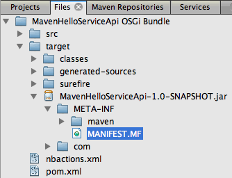
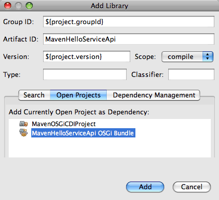
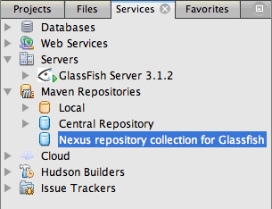

// 
//     Licensed to the Apache Software Foundation (ASF) under one
//     or more contributor license agreements.  See the NOTICE file
//     distributed with this work for additional information
//     regarding copyright ownership.  The ASF licenses this file
//     to you under the Apache License, Version 2.0 (the
//     "License"); you may not use this file except in compliance
//     with the License.  You may obtain a copy of the License at
// 
//       http://www.apache.org/licenses/LICENSE-2.0
// 
//     Unless required by applicable law or agreed to in writing,
//     software distributed under the License is distributed on an
//     "AS IS" BASIS, WITHOUT WARRANTIES OR CONDITIONS OF ANY
//     KIND, either express or implied.  See the License for the
//     specific language governing permissions and limitations
//     under the License.
//

= Using CDI to Inject OSGi Bundles as Services in NetBeans IDE
:jbake-type: tutorial
:jbake-tags: tutorials 
:jbake-status: published
:icons: font
:syntax: true
:source-highlighter: pygments
:toc: left
:toc-title:
:description: Using CDI to Inject OSGi Bundles as Services in NetBeans IDE - Apache NetBeans
:keywords: Apache NetBeans, Tutorials, Using CDI to Inject OSGi Bundles as Services in NetBeans IDE

This document demonstrates how the integrated support for the link:http://www.osgi.org/Main/HomePage[+Open Services Gateway Initiative+] (OSGi) framework in NetBeans IDE simplifies the process of creating OSGi bundles and using the bundles in your projects. In this tutorial you will create two simple OSGi bundles from the Maven OSGi bundle archetype and then deploy the bundles to the GlassFish Server Open Source Edition 3.1.

After you create the basic OSGi bundles, you will create a web client application and use CDI to inject the bundles as a service. You will then deploy the web application as a bundle to the server. The tutorial will then demonstrate how to use the OSGi Admin Console to work with OSGi bundles.

Using an OSGi bundle in an Enterprise Application can provide greater modularity and flexibility with respect to updating individual bundles. The out-of-the-box support for OSGi in the GlassFish server makes incorporating bundles into your application very easy.

This tutorial is based on the link:http://blogs.oracle.com/arungupta/entry/totd_154_dynamic_osgi_services[+ TOTD #154: Dynamic OSGi services in GlassFish 3.1 - Using CDI and @OSGiService +] blog post and other blog entries which can be found on link:http://blog.arungupta.me/[+Arun Gupta's blog+]. Be sure to visit the blog and see many other excellent entries on working with OSGi.

Additionally, the following resources contain a wealth of information about using OSGi and CDI in hybrid applications.

* link:http://weblogs.java.net/blog/2009/06/14/developing-hybrid-osgi-java-ee-applications-glassfish[+ Developing Hybrid (OSGi + Java EE) applications in GlassFish+]
* link:http://blogs.oracle.com/sivakumart/entry/typesafe_injection_of_dynamic_osgi[+ Typesafe injection of dynamic OSGi services in hybrid Java EE applications +]
* link:http://weblogs.java.net/blog/2009/06/04/osgi-enabled-web-applications-inglassfish[+ OSGi enabled web applications in GlassFish+]
* link:http://www.youtube.com/watch?v=vaOpJJ-Xm70[+ YouTube video: Type-safe injection of OSGi dynamic services with GlassFish 3.1 and CDI +]
* link:http://glassfish.java.net/public/GF-OSGi-Features.pdf[+ OSGi Application Development using GlassFish Server"+] [PDF]

*Tutorial Exercises*

* <<Exercise_1,Creating the Parent POM Project>>
* <<Exercise_2,Creating the OSGi Bundle Projects>>
* <<Exercise_2a,Creating the MavenHelloServiceApi Interface Bundle>>
* <<Exercise_2b,Creating the MavenHelloServiceImpl Implementation Bundle>>
* <<Exercise_2c,Building and Deploying the OSGi Bundles>>
* <<Exercise_3,Creating the Web Client Application>>
* <<Exercise_3a,Configuring Dependencies in the POM Project>>
* <<Exercise_3b,Creating the MavenHelloWebClient Web Application>>
* <<Exercise_3c,Building the Web Application as a Bundle>>
* <<Exercise_3d,Deploying the Web Application Bundle>>
* <<Exercise_4,Installing and Using the OSGi Admin Console>>
* <<Exercise_5,References and Further Reading>>

*To follow this tutorial, you need the following software and resources.*

|===
|Software or Resource |Version Required 

|link:http://download.netbeans.org/netbeans/7.1/beta/[+NetBeans IDE+] |7.2, 7.3, 7.4, 8.0, Java EE version 

|link:http://www.oracle.com/technetwork/java/javase/downloads/index.html[+Java Development Kit (JDK)+] |version 7 or 8 

|GlassFish Server Open Source Edition |3.1.x or 4.x 
|===

*Prerequisites*

This document assumes you have some basic knowledge of, or programming experience with, the following technologies:

* Java Programming
* NetBeans IDE
* Maven framework

Before starting this tutorial you may want to familiarize yourself with the following documentation.

* xref:../../../wiki/MavenBestPractices.adoc[+Best Practices for Apache Maven in NetBeans IDE+]
* link:http://books.sonatype.com/mvnref-book/reference/introduction.html[+Chapter 1. Introducing Apache Maven+] (from link:http://books.sonatype.com/mvnref-book/reference/index.html[+Maven: The Complete Reference +])
* link:http://www.osgi.org/javadoc/r4v42/[+OSGi Framework+]

 

== Creating the Parent POM Project

In this section you will create a parent POM project for the OSGi bundles that you will create in this tutorial. You will edit the project POM ( ``pom.xml`` ) to add Dependency Management elements that will be inherited as dependencies by the child projects.

1. Choose New Project (Ctrl-Shift-N; ⌘-Shift-N on Mac) from the main menu.
2. Select POM Project from the Maven category.

image::images/cdi-newpomproject.png[title="Maven POM Project archetype in the New Project wizard"]

. Type *MavenOSGiCDIProject* as the Project name. Click Finish.

When you click Finish, the IDE creates the POM project and opens the project in the Projects window.

. Expand the Project Files node in the Projects window and double-click  ``pom.xml``  to open the file in the editor.

The basic POM for the project should be similar to the following.

[source,xml]
----

<?xml version="1.0" encoding="UTF-8"?>
<project xmlns="http://maven.apache.org/POM/4.0.0" xmlns:xsi="http://www.w3.org/2001/XMLSchema-instance" xsi:schemaLocation="http://maven.apache.org/POM/4.0.0 http://maven.apache.org/xsd/maven-4.0.0.xsd">
    <modelVersion>4.0.0</modelVersion>
    <groupId>com.mycompany</groupId>
    <artifactId>MavenOSGiCDIProject</artifactId>
    <version>1.0-SNAPSHOT</version>
    <packaging>pom</packaging>
    <properties>
        <project.build.sourceEncoding>UTF-8</project.build.sourceEncoding>
    </properties>
</project>
        
----

. Modify the parent  ``pom.xml``  to add the following elements. Save your changes.

[source,xml]
----

<?xml version="1.0" encoding="UTF-8"?>
<project xmlns="http://maven.apache.org/POM/4.0.0" xmlns:xsi="http://www.w3.org/2001/XMLSchema-instance" xsi:schemaLocation="http://maven.apache.org/POM/4.0.0 http://maven.apache.org/xsd/maven-4.0.0.xsd">
    <modelVersion>4.0.0</modelVersion>
    <groupId>com.mycompany</groupId>
    <artifactId>MavenOSGiCDIProject</artifactId>
    <version>1.0-SNAPSHOT</version>
    <packaging>pom</packaging>
    <properties>
        <project.build.sourceEncoding>UTF-8</project.build.sourceEncoding>
    </properties>

    *<dependencyManagement>
        <dependencies>
            <dependency>
                <groupId>org.osgi</groupId>
                <artifactId>org.osgi.core</artifactId>
                <version>4.2.0</version>
                <scope>provided</scope>
            </dependency>
        </dependencies>
    </dependencyManagement>*
</project>
        
----

In this exercise you specified explicitly an artifact and artifact version that will be used in the project. By using Dependency Management and specifying the artifacts in the parent POM, you can make the POMs in the child projects simpler and ensure that the versions of dependencies are consistent in the project.

For more on using Dependency Management, see the link:http://maven.apache.org/guides/introduction/introduction-to-dependency-mechanism.html[+ Introduction to Dependency Mechanism+].

== Creating the OSGi Bundle Projects

The Maven category in the New Projects wizard includes an OSGi Bundle archetype for creating OSGi bundle projects. When you create an OSGi bundle project, the generated POM declares the  ``org.osgi.core``  JAR as a dependency and specifies the  ``maven-bundle-plugin``  for building the project.

=== Creating the MavenHelloServiceApi Interface Bundle

In this exercise you will use the New Project wizard to create an OSGi bundle project that will provide a simple interface that will be implemented by other bundles. After you create the bundle and interface, you will modify the POM to update the dependency on the  ``org.osgi.core``  artifact that you specified in the parent POM project.

1. Choose File > New Project to open the New Project wizard.
2. Choose OSGi Bundle from Maven category. Click Next.

image::images/cdi-new-osgiproject.png[title="Maven OSGi Bundle archetype in the New Project wizard"]

. Type *MavenHelloServiceApi* for the Project Name.

. Click Browse and select the *MavenOSGiCDIProject* POM project as the Location. Click Finish.

When you click Finish, the IDE creates the bundle project and opens the project in the Projects window. If you open  ``pom.xml``  for the MavenHelloServiceApi project in the editor you can see that the  ``packaging``  element specifies  ``bundle``  and that the  ``maven-bundle-plugin``  will be used when building the bundle.

[source,xml]
----

<project>
    <modelVersion>4.0.0</modelVersion>
    <parent>
    <artifactId>MavenOSGiCDIProject</artifactId>
    <groupId>com.mycompany</groupId>
    <version>1.0-SNAPSHOT</version>
    </parent>

    <groupId>com.mycompany</groupId>
    <artifactId>MavenHelloServiceApi</artifactId>
    <version>1.0-SNAPSHOT</version>
    *<packaging>bundle</packaging>*
    <name>MavenHelloServiceApi OSGi Bundle</name>

    <properties>
        <project.build.sourceEncoding>UTF-8</project.build.sourceEncoding>
    </properties>

    <dependencies>
        <dependency>
            <groupId>org.osgi</groupId>
            <artifactId>org.osgi.core</artifactId>
            <version>4.3.0</version>
            <scope>provided</scope>
        </dependency>
    </dependencies>

    <build>
        <plugins>
            <plugin>
                <groupId>org.apache.felix</groupId>
                *<artifactId>maven-bundle-plugin</artifactId>*
                <version>2.3.7</version>
                <extensions>true</extensions>
                <configuration>
                    <instructions>
                        <Bundle-Activator>com.mycompany.mavenhelloserviceimpl.Activator</Bundle-Activator>
                        <Export-Package />
                    </instructions>
                </configuration>
            </plugin>

            ...
        </plugins>
    </build>

    ...
<project>
----

You can also see that when you create an OSGi bundle project using the Maven OSGi Bundle archetype, the IDE added the  ``org.osgi.core``  artifact as a dependency by default.

. Right-click the MavenHelloServiceApi project node in the Projects window and choose Properties.

. Select the Sources category in the Project Properties dialog box.

. Set the *Source/Binary Format* to 1.6 and confirm that the *Encoding* is UTF-8. Click OK.

. Right-click Source Packages node in the Projects window and choose New > Java Interface.

. Type *Hello* for the Class Name.

. Select *com.mycompany.mavenhelloserviceapi* as the Package. Click Finish.

. Add the following  ``sayHello``  method to the interface (in bold) and save your changes.

[source,java]
----

public interface Hello {
    *String sayHello(String name);*
}
----

. Right-click the project node in the Projects window and choose Build.

After you build the project, if you open the Files window and expand the project node you can see that  ``MavenHelloServiceApi-1.0-SNAPSHOT.jar``  is created in the  ``target``  folder.

The  ``maven-bundle-plugin``  handles the generation of the  ``MANIFEST.MF``  file when you build the project. If you open the  ``MANIFEST.MF``  file in the compiled JAR you will see that the plugin generated a manifest header that declares the export packages. For OSGi, all bundles that you want to be exposed and available to other bundles must be listed in the  ``Export-Package``  element in  ``MANIFEST.MF`` .

. Confirm that the  ``MANIFEST.MF``  contains the  ``Export-Package``  element (the element shown in *bold* in the example below).

[source,text]
----

Manifest-Version: 1.0
Bnd-LastModified: 1395049732676
Build-Jdk: 1.7.0_45
Built-By: nb
Bundle-Activator: com.mycompany.mavenhelloserviceapi.Activator
Bundle-ManifestVersion: 2
Bundle-Name: MavenHelloServiceApi OSGi Bundle
Bundle-SymbolicName: com.mycompany.MavenHelloServiceApi
Bundle-Version: 1.0.0.SNAPSHOT
Created-By: Apache Maven Bundle Plugin
*Export-Package: com.mycompany.mavenhelloserviceapi;uses:="org.osgi.frame
 work";version="1.0.0.SNAPSHOT"*
Import-Package: org.osgi.framework;version="[1.6,2)"
Tool: Bnd-1.50.0
----

The OSGi container will read the  ``Export-Package``  manifest header to determine the classes in the bundle that can be accessed from outside the bundle. In this example, the classes in the  ``com.mycompany.mavenhelloserviceapi``  package are exposed.

NOTE:  If the  ``MANIFEST.MF``  does not contain the  ``Export-Package``  element, you will need to enable the default plugin behavior for the plugin in the Project Properties window and rebuild the project. In the Project Properties window, select the Export Packages category and select the *Default maven-bundle-plugin behavior* option. You can use the Export Packages panel of the Project Properties window to explicitly specify the packages that should be exposed or specify the packages directly in  ``pom.xml`` .

   

=== Creating the MavenHelloServiceImpl Implementation Bundle

In this exercise you will create the MavenHelloServiceImpl in the POM project.

1. Choose File > New Project to open the New Project wizard.
2. Choose OSGi Bundle from the Maven category. Click Next.
3. Type *MavenHelloServiceImpl* for the Project Name.
4. Click Browse and select the *MavenOSGiCDIProject* POM project as the Location (if not selected). Click Finish.
5. Right-click the project node in the Projects window and choose Properties.
6. Select the Sources category in the Project Properties dialog box.
7. Set the *Source/Binary Format* to 1.6 and confirm that the *Encoding* is UTF-8. Click OK.
8. Right-click Source Packages node in the Projects window and choose New > Java Class.
9. Type *HelloImpl* for the Class Name.
10. Select *com.mycompany.mavenhelloserviceimpl* as the Package. Click Finish.
11. Type the following (in bold) and save your changes.

[source,java]
----

public class HelloImpl *implements Hello {
    
    public String sayHello(String name) {
        return "Hello " + name;*
    }
}
----

When you implement  ``Hello`` , the IDE will display an error that you need to resolve by adding the MavenHelloServiceApi project as a dependency.

. Right-click the Dependencies node of *MavenHelloServiceImpl* in the Projects window and choose Add Dependency.

. Click the Open Projects tab in the Add Library dialog.

. Select MavenHelloServiceApi OSGi Bundle. Click Add.

. Right-click in the  ``HelloImpl.java``  class that is open in the editor and choose Fix Imports (Alt-Shift-I; ⌘-Shift-I on Mac) to add an import statement for  ``com.mycompany.mavenhelloserviceapi.Hello`` . Save your changes.

. Expand the  ``com.mycompany.mavenhelloserviceimpl``  package and double-click  ``Activator.java``  to open the file in the editor.

image::images/cdi-activator.png[title="Activator class in the Projects window"]

The IDE automatically created the  ``Activator.java``  bundle activator class in your project. A bundle activator is used to manage the lifecycle of a bundle. The bundle activator class is declared in the  ``MANIFEST.MF``  of the bundle and instantiated when the bundle is started by the container.

An OSGi bundle does not require a bundle activator class, but you can use the  ``start()``  method in the activator class, for example, to initialize services or other resources that are required by the bundle. In this exercise you will add some lines of code to the class that will print messages to the Output window. This will make it easier for you to identify when the bundle starts and stops.

. Modify the  ``start()``  and  ``stop()``  methods in the bundle activator class to add the following lines (in bold).

[source,java]
----

public class Activator implements BundleActivator {

    public void start(BundleContext context) throws Exception {
        *System.out.println("HelloActivator::start");
        context.registerService(Hello.class.getName(), new HelloImpl(), null);
        System.out.println("HelloActivator::registration of Hello service successful");*
    }

    public void stop(BundleContext context) throws Exception {
        *context.ungetService(context.getServiceReference(Hello.class.getName()));
        System.out.println("HelloActivator stopped");*
    }
}
----

You can see that the bundle activator class imports  ``org.osgi.framework.BundleActivator``  and  ``org.osgi.framework.BundleContext`` . By default the generated class contains two methods:  ``start()``  and  ``stop()`` . The OSGi framework invokes the  ``start()``  and  ``stop()``  methods to start and to stop the functionality provided by the bundle. When the bundle is started, the service component provided by the bundle is registered in the OSGi service registry. After a bundle is registered, other bundles can use the registry to look up and then use the active services via the bundle context.

If you look at the POM for the project you can see the  ``<Bundle-Activator>``  element that specifies the bundle activator under the configuration element for the  ``maven-bundle-plugin`` .

[source,xml]
----

<plugin>
    <groupId>org.apache.felix</groupId>
    <artifactId>maven-bundle-plugin</artifactId>
    <version>2.3.7</version>
    <extensions>true</extensions>
      <configuration>
            <instructions>
                  *<Bundle-Activator>com.mycompany.mavenhelloserviceimpl.Activator</Bundle-Activator>*
            </instructions>
      </configuration>
</plugin>
----

When you build the bundle, the plugin will generate a Manifest Header in the bundle's manifest file in the JAR and specify the Bundle Activator class. The OSGi runtime looks for the  ``Bundle-Activator``  header in the manifest file when a bundle is deployed.

. Fix the import statements in  ``Activator.java``  to import  ``com.mycompany.mavenhelloserviceapi.Hello`` . Save your changes.

. Expand the Dependencies node and confirm that the  ``org.osgi.core``  artifact is listed as a dependency.

NOTE:  Remove any older versions of the artifact that are listed under the Dependencies node by right-clicking the artifact and choosing Remove Dependency. The only dependencies should be the MavenHelloServiceApi project and the  ``org.osgi.core``  artifact.

image::images/cdi-implproject.png[title="Activator class in the Projects window"]
   

=== Building and Deploying the OSGi Bundles

In this exercise you will build the OSGi bundles and deploy the bundles to GlassFish.

1. Right-click the MavenOSGiCDIProject node in the Projects window and choose Clean and Build.

When you build the project the IDE will create the JAR files in the  ``target``  folder of each of the projects and also install the snapshot JAR in the local repository. In the Files window, you can expand the  ``target``  folder for each of the two bundle projects to see the two JAR archives ( ``MavenHelloServiceApi-1.0-SNAPSHOT.jar``  and  ``MavenHelloServiceImpl-1.0-SNAPSHOT.jar`` ).

. Start the GlassFish server if not already started.

. Copy the  ``MavenHelloServiceApi-1.0-SNAPSHOT.jar``  to the  ``glassfish/domains/domain1/autodeploy/bundles/``  directory of your GlassFish installation.

You should see output similar to the following in the GlassFish Server log in the Output window.

[source,java]
----

INFO: Started bundle: file:/glassfish-4.0/glassfish/domains/domain1/autodeploy/bundles/MavenHelloServiceApi-1.0-SNAPSHOT.jar

----

Right-click the GlassFish server node in the Services window and choose View Domain Server Log if the server log is not visible in the Output window.

. Repeat the steps to copy the  ``MavenHelloServiceImpl-1.0-SNAPSHOT.jar``  to the  ``autodeploy/bundles``  directory.

You should now see output similar to the following in the GlassFish server log.

[source,java]
----

INFO: HelloActivator::start
INFO: HelloActivator::registration of Hello service successful
INFO: Started bundle: file:/glassfish-4.0/glassfish/domains/domain1/autodeploy/bundles/MavenHelloServiceImpl-1.0-SNAPSHOT.jar
INFO: Started bundle: file:/glassfish-4.0/glassfish/domains/domain1/autodeploy/bundles/MavenHelloServiceImpl-1.0-SNAPSHOT.jar
        
----

Alternatively, you can install the bundles from the GlassFish OSGi Admin Console. For more, see the <<Exercise_4,Installing and Using the OSGi Admin Console>> section.

== Creating a Web Client Application

This section demonstrates how to create a Java EE web client that accesses the service provided by the OSGi bundle. You will create a simple servlet in a web application and then inject the declared services. Before you create the project you will add some dependency management elements to the parent POM project.

=== Configuring Dependencies in Parent POM Project

In this exercise you will specify dependency elements in the parent POM project. You will also add a repository for artifacts that will be used by the project.

1. Expand the Project Files node of the *MavenOSGiCDIProject* project in the Projects window and double-click  ``pom.xml``  to open the file in the editor.
2. Modify the parent  ``pom.xml``  to add the following Dependency Management elements (in bold). Save your changes.

[source,xml]
----

<?xml version="1.0" encoding="UTF-8"?>
<project xmlns="http://maven.apache.org/POM/4.0.0" xmlns:xsi="http://www.w3.org/2001/XMLSchema-instance" xsi:schemaLocation="http://maven.apache.org/POM/4.0.0 http://maven.apache.org/xsd/maven-4.0.0.xsd">
    <modelVersion>4.0.0</modelVersion>
    <groupId>com.mycompany</groupId>
    <artifactId>MavenOSGiCDIProject</artifactId>
    <version>1.0-SNAPSHOT</version>
    <packaging>pom</packaging>
    <properties>
        <project.build.sourceEncoding>UTF-8</project.build.sourceEncoding>
    </properties>

    ...    
            
    <dependencyManagement>
        <dependencies>
            <dependency>
                <groupId>org.osgi</groupId>
                <artifactId>org.osgi.core</artifactId>
                <version>4.3.0</version>
                <scope>provided</scope>
            </dependency>
            *<dependency>
                <groupId>org.osgi</groupId>
                <artifactId>org.osgi.compendium</artifactId>
                <version>4.2.0</version>
                <scope>provided</scope>
            </dependency>
            <dependency>
                <groupId>org.glassfish</groupId>
                <artifactId>osgi-cdi-api</artifactId>
                <version>3.1-b41</version>
                <type>jar</type>
                <scope>provided</scope>
            </dependency>*
          
        </dependencies>
    </dependencyManagement>

    ...
</project>

----

. Add the the following elements to add the GlassFish repository to the POM. Save your changes.

[source,xml]
----

<project>

    ...

    </dependencyManagement>

    *<repositories>
        <!-- glassfish nexus repo for glassfish dependencies -->
        <repository>
            <id>glassfish-repo-archive</id>
            <name>Nexus repository collection for Glassfish</name>
            <url>http://maven.glassfish.org/content/groups/glassfish</url>
            <snapshots>
                <updatePolicy>never</updatePolicy>
            </snapshots>
        </repository>
    </repositories>*
    <modules>
        <module>MavenHelloServiceApi</module>
        <module>MavenHelloServiceImpl</module>
    </modules>
</project>
            
----

After you add the GlassFish repository to the POM, if you view the list of repositories under the Maven Repositories node in the Services window you will see that the IDE automatically added a node for the GlassFish repository. By default, the IDE displays a node for the Local Maven repository. When an open project specifies a repository, the IDE automatically adds a node for the repository under the Maven Repositories node.

In this exercise you added additional artifacts and artifact versions that will be used in the project. You also added the GlassFish repository that contains the  ``osgi-cdi-api``  artifacts.

=== Creating the MavenHelloWebClient Web Application

You will first create a regular web application and then modify the project to make it an OSGi bundle (Web Application bundle (WAB)).

1. Choose File > New Project from the main menu.
2. Select Web Application from the Maven category. Click Next.
3. Type *MavenHelloWebClient* as the Project name.
4. Click Browse and select the *MavenOSGiCDIProject* POM project as the Location (if not already selected). Click Next.
5. Select GlassFish Server as the server and Java EE 6 Web or Java EE 7 Web as the Java EE version. Click Finish.
6. Right-click the project node and choose New > Servlet.
7. Type *HelloServlet* for the Class Name.
8. Select  ``com.mycompany.mavenhellowebclient``  as the Package. Click Finish.
9. Delete the default methods in the servlet that were generated by the IDE ( ``processRequest`` ,  ``doGet`` ,  ``doPost`` ,  ``getServletInfo`` ).

NOTE:  You will need to expand the editor fold to delete the HttpServlet methods.

. Type the following code (in bold) to inject the service.

[source,java]
----

@WebServlet(name = "HelloServlet", urlPatterns = {"/HelloServlet"})
public class HelloServlet extends HttpServlet {

    *@Inject
    @OSGiService(dynamic=true)
    Hello hello;*
}
----

. Add the following  ``doGet``  method.

[source,java]
----

    @Override
    protected void doGet(HttpServletRequest request, HttpServletResponse response)
            throws ServletException, IOException {
        PrintWriter out = response.getWriter();
        out.println(hello.sayHello("Duke"));
    }
----

. Right-click the project node and choose New > Other.

. Select *beans.xml* in the Contexts and Dependency Injection category. Click Next.

. Use the default file name ( ``beans`` ). Click Finish.

When you click Finish, the wizard will create the  ``beans.xml``  file in the web application. CDI is automatically enabled if  ``beans.xml``  is part of the application.

. Modify the  ``beans.xml``  file to change the default value for  ``bean-discovery-mode``  to  ``all`` .

[source,java]
----

bean-discovery-mode="*all*"
----

Save your changes and close the file.

For more details about the differences between the  ``bean-discovery-mode``  values, see the following pages:

* link:http://docs.oracle.com/javaee/7/tutorial/doc/cdi-adv001.htm[+25.1 Packaging CDI Applications+] in the Java EE 7 Tutorial
* link:http://stackoverflow.com/questions/18107858/cdi-inject-fails-on-maven-embedded-glassfish-plugin-org-jboss-weld-exceptions[+http://stackoverflow.com/questions/18107858/cdi-inject-fails-on-maven-embedded-glassfish-plugin-org-jboss-weld-exceptions+]

. Right-click the Dependencies node of MavenHelloWebClient in the Projects window and choose Add Dependency.

. Select *Provided* as the Scope.

. Click the Open Projects tab in the Add Library dialog and select *MavenHelloServiceApi OSGi Bundle*. Click Add.

. Right-click the Dependencies node again and choose Add Dependency.

. Click the Dependency Management tab in the Add Library dialog and choose the  ``osgi-cdi-api``  artifact that you specified in the parent POM project. Click Add.

image::images/cdi-add-dependency3.png[title="Dependency Management tab in the Add Library dialog"]

. Right-click in  ``HelloServlet.java``  in the editor and choose Fix Imports (Alt-Shift-I; ⌘-Shift-I on Mac) to add  ``com.mycompany.mavenhelloserviceapi.Hello`` ,  ``javax.inject.Inject``  and  ``org.glassfish.osgicdi.OSGiService`` . Save your changes.

NOTE:  You might need to manually add an import statements for  ``com.mycompany.mavenhelloserviceapi.Hello``  if the IDE does not automatically add it for you.

. Right-click the MavenOSGiCDIProject and choose Clean and Build.

When you build the project, you should see output similar to the following in the Output window.

[source,java]
----

Reactor Summary:

MavenOSGiCDIProject ............................... SUCCESS [0.798s]
MavenHelloServiceApi OSGi Bundle .................. SUCCESS [7.580s]
MavenHelloServiceImpl OSGi Bundle ................. SUCCESS [1.142s]
MavenHelloWebClient ............................... SUCCESS [8.072s]
------------------------------------------------------------------------
BUILD SUCCESS
----

NOTE:  You will need to build the web application manually if the web application is not built automatically when you build the MavenOSGiCDIProject project .

In the Files window, expand the project node for the web application and confirm that the archive  ``MavenHelloWebClient-1.0-SNAPSHOT.war``  was created in the target directory. If you expand the WAR archive of the web client and examine the  ``MANIFEST.MF`` , you will see that the manifest contains lines similar to the following.

[source,java]
----

Manifest-Version: 1.0
Archiver-Version: Plexus Archiver
Created-By: Apache Maven
Built-By: nb
Build-Jdk: 1.7.0_45
----

=== Building the Web Application as an OSGi Bundle

To use  ``@OSGiService``  and retrieve registered OSGi bundles, you need to make the web application a bundle which can access  ``BundleContext`` . To make the WAR an OSGi bundle (Web Application Bundle), you add the  ``Web-ContextPath``  meta-data to the  ``MANIFEST.MF``  in the WAR.  To do this, specify the  ``<Web-ContextPath>``  element in the instructions for the  ``maven-bundle-plugin``  and the manifest generated by the plugin will contain the element. You then modify the  ``maven-war-plugin``  configuration to instruct the plugin to add the manifest that was generated by the  ``maven-bundle-plugin``  to the WAR archive.

1. In the Projects window, expand the Project Files node under MavenHelloWebClient and double-click  ``pom.xml``  to open the file in the editor.
2. Add the following entry to add the  ``maven-bundle-plugin``  to the POM.

[source,xml]
----

<build> 
    <plugins>
        *<plugin>
             <groupId>org.apache.felix</groupId>
             <artifactId>maven-bundle-plugin</artifactId>
             <version>2.2.0</version>
             <extensions>true</extensions>
             <configuration>
                 <supportedProjectTypes>
                     <supportedProjectType>ejb</supportedProjectType>
                     <supportedProjectType>war</supportedProjectType>
                     <supportedProjectType>bundle</supportedProjectType>
                     <supportedProjectType>jar</supportedProjectType>
                 </supportedProjectTypes>
                 <instructions>
                     <!-- Specify elements to add to MANIFEST.MF -->
                     <Web-ContextPath>/mavenhellowebclient</Web-ContextPath>
                     <!-- By default, nothing is exported -->
                     <Export-Package>!*.impl.*, *</Export-Package>
                 </instructions>
             </configuration>
             <executions>
                 <execution>
                     <id>bundle-manifest</id>
                     <phase>process-classes</phase>
                     <goals>
                         <goal>manifest</goal>
                     </goals>
                 </execution>
                 <execution>
                     <id>bundle-install</id>
                     <phase>install</phase>
                     <goals>
                         <goal>install</goal>
                     </goals>
                 </execution>
             </executions>
         </plugin>*
            
----

. Modify the configuration elements of the  ``maven-war-plugin``  to add bundle information to  ``MANIFEST.MF`` . Save your changes.

[source,xml]
----

 <plugin>
     <groupId>org.apache.maven.plugins</groupId>
     <artifactId>maven-war-plugin</artifactId>
     <version>2.3</version>
     <configuration>
         *<archive>
             <!-- add bundle plugin generated manifest to the war -->
             <manifestFile>
                 ${project.build.outputDirectory}/META-INF/MANIFEST.MF
             </manifestFile>
             <!-- For some reason, adding Bundle-ClassPath in maven-bundle-plugin
             confuses that plugin and it generates wrong Import-Package, etc.
             So, we generate it here.-->
             <manifestEntries>
                 <Bundle-ClassPath>WEB-INF/classes/</Bundle-ClassPath>
             </manifestEntries>
         </archive>*
         <failOnMissingWebXml>false</failOnMissingWebXml>
     </configuration>
 </plugin>
----

. Right-click the MavenHelloWebClient project node in the Projects window and choose Clean and Build.

If you now expand the WAR archive and open  ``MANIFEST.MF``  in the editor, you can see that  ``MANIFEST.MF``  now contains additional information, including the  ``Web-ContextPath: /mavenhellowebclient``  entry that you specified in the  ``maven-bundle-plugin``  configuration and bundle name entries.

[source,java]
----

Manifest-Version: 1.0
Export-Package: com.mycompany.mavenhellowebclient;uses:="com.mycompany
 .mavenhelloserviceapi,javax.servlet,org.glassfish.osgicdi,javax.injec
 t,javax.servlet.annotation,javax.servlet.http";version="1.0.0.SNAPSHO
 T"
Bundle-ClassPath: WEB-INF/classes/
Built-By: nb
Tool: Bnd-1.50.0
Bundle-Name: MavenHelloWebClient
Created-By: Apache Maven Bundle Plugin
*Web-ContextPath: /mavenhellowebclient*
Build-Jdk: 1.7.0_45
Bundle-Version: 1.0.0.SNAPSHOT
Bnd-LastModified: 1395053424008
Bundle-ManifestVersion: 2
Import-Package: com.mycompany.mavenhelloserviceapi;version="[1.0,2)",j
 avax.inject,javax.servlet,javax.servlet.annotation,javax.servlet.http
 ,org.glassfish.osgicdi;version="[1.0,2)"
Bundle-SymbolicName: com.mycompany.MavenHelloWebClient
Archiver-Version: Plexus Archiver
----

For more information on how to build web applications as OSGi bundles, see the following pages.

* link:http://weblogs.java.net/blog/2009/06/04/osgi-enabled-web-applications-inglassfish[+ http://weblogs.java.net/blog/2009/06/04/osgi-enabled-web-applications-inglassfish+]
* link:http://felix.apache.org/site/apache-felix-maven-bundle-plugin-bnd.html[+ http://felix.apache.org/site/apache-felix-maven-bundle-plugin-bnd.html+]

=== Deploying the Web Application Bundle

In this exercise you will copy the web application bundle to the  ``autodeploy/bundles``  folder in the GlassFish installation.

1. Navigate to the  ``target``  directory that contains  ``MavenHelloWebClient-1.0-SNAPSHOT.war`` .
2. Copy the  ``MavenHelloWebClient-1.0-SNAPSHOT.war``  to the  ``autodeploy/bundles``  folder of your GlassFish installation.

When you copy the WAR archive to the directory, output similar to the following will appear in the GlassFish server log.

[source,java]
----

INFO: Started bundle: file:/glassfish-3.1.1/glassfish/domains/domain1/autodeploy/bundles/MavenHelloWebClient-1.0-SNAPSHOT.war
...
INFO: ---- Injection requested for framework service type interface com.mycompany.mavenhelloserviceapi.Hello and annotated with dynamic=true, serviceCriteria=
INFO: WEB0671: Loading application [com.mycompany.MavenHelloWebClient_1.0.0.SNAPSHOT] at [/mavenhellowebclient]
INFO: Registered ServletContext as a service with properties: {osgi.web.symbolicname=com.mycompany.MavenHelloWebClient, osgi.web.version=1.0.0.SNAPSHOT, osgi.web.contextpath=/mavenhellowebclient} 
        
----

You can now view the servlet in your browser by clicking on the following link link:http://localhost:8080/mavenhellowebclient/HelloServlet[+http://localhost:8080/mavenhellowebclient/HelloServlet+].

== Installing and Using the OSGi Admin Console

You can use the GlassFish OSGi Admin Console to install, start and stop OSGi bundles that are deployed to the server. In this exercise you will enable the GlassFish OSGi Admin Console and then view the list of registered OSGi bundles.

Perform the following steps to install the required GlassFish add-ons to enable the OSGi Console and view the deployed bundles in the GlassFish Domain Admin Console.

1. Open the GlassFish Domain Admin Console in your browser.

Right-click the GlassFish server node in the Services window and choose View Domain Admin Console.

. Click Update Tool in the left navigation column.

. Select  ``glassfish-osgi-gui``  from the list of available add-ons.

Click Install and accept the license.

image::images/cdi-glassfish-addons.png[title="Update Tool GlassFish Admin Console"]

. Restart the GlassFish server.

*Important: * If you are running GlassFish Server 3.1.2.2 you need to modify the  ``osgi.properties``  file located in the  ``_GLASSFISH-INSTALL_/glassfish/config/``  directory and set the value of the  ``org.osgi.framework.startlevel.beginning``  property to "2" ( ``org.osgi.framework.startlevel.beginning=2`` ).
See the following forum post for more details: 
link:http://www.java.net/forum/topic/glassfish/glassfish/cannot-start-web-console-glassfish-version-3122[+ Cannot start web console in Glassfish version 3.1.2.2+].

. Open the Admin Console again and click *server (Admin Server)* in the left navigation column.

. Click the OSGi Console tab to view a list of the deployed OSGi bundles. 

image::images/cdi-glassfish-console.png[title="Dependency Management tab in the Add Library dialog"]

NOTE:  You might be prompted to enter the username and password to view the list of OSGi bundles. Confirm that the authorization dialog is not hidden if you do not see a list of bundles in the OSGi Console tab. The default username for the GlassFish 4 server is  ``admin``  if you installed the server when you installed the IDE. The password is empty by default.

You can scroll down the list to view the status of registered OSGi bundles and start and stop individual bundles. If you sort the list by Id (highest to lowest), you will see that the three bundles that you have deployed are displayed near the top of the list.

xref:../../../community/mailing-lists.adoc[Send Feedback on This Tutorial]

== See Also

For more information about using NetBeans IDE and Maven to develop OSGi bundles, see the following resources:

* xref:../../../wiki/OSGiAndNetBeans.adoc[+OSGi And NetBeans at wiki+]
* xref:../../../wiki/MavenBestPractices.adoc[+Best Practices for Apache Maven in NetBeans IDE+]
* link:https://blogs.oracle.com/arungupta/entry/totd_125_creating_an_osgi[+TOTD #125: Creating an OSGi bundles using NetBeans and deploying in GlassFish+]
* xref:../java-ee.adoc[+Java EE &amp; Java Web Learning Trail+]

To send comments and suggestions, get support, and keep informed on the latest developments on the NetBeans IDE Java EE development features, xref:../../../community/mailing-lists.adoc[+join the nbj2ee mailing list+].

