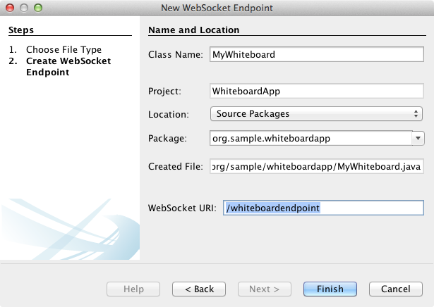
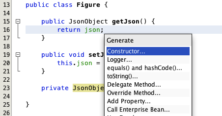

// 
//     Licensed to the Apache Software Foundation (ASF) under one
//     or more contributor license agreements.  See the NOTICE file
//     distributed with this work for additional information
//     regarding copyright ownership.  The ASF licenses this file
//     to you under the Apache License, Version 2.0 (the
//     "License"); you may not use this file except in compliance
//     with the License.  You may obtain a copy of the License at
// 
//       http://www.apache.org/licenses/LICENSE-2.0
// 
//     Unless required by applicable law or agreed to in writing,
//     software distributed under the License is distributed on an
//     "AS IS" BASIS, WITHOUT WARRANTIES OR CONDITIONS OF ANY
//     KIND, either express or implied.  See the License for the
//     specific language governing permissions and limitations
//     under the License.
//

= Using the WebSocket API in a Web Application
:jbake-type: tutorial
:jbake-tags: tutorials 
:jbake-status: published
:icons: font
:syntax: true
:source-highlighter: pygments
:toc: left
:toc-title:
:description: Using the WebSocket API in a Web Application - Apache NetBeans
:keywords: Apache NetBeans, Tutorials, Using the WebSocket API in a Web Application

This tutorial demonstrates how to create a simple web application that enables collaboration between client browsers that are connected to a single server application. When a user draws a graphic element on a canvas in the client browser the element appears on the canvas of all connected clients. How does it work? When the browser loads the web page a client-side script sends a WebSocket handshake request to the application server. The application can accept JSON and binary messages from the clients connected in the session and broadcast the messages to all the connected clients.

In this tutorial you will create a web application that uses the Java API for WebSocket (link:http://www.jcp.org/en/jsr/detail?id=356[+JSR 356+]) to enable bi-directional communication between browser clients and the application server. The Java API for WebSocket provides support for creating WebSocket Java components, initiating and intercepting WebSocket events and creating and consuming WebSocket text and binary messages. The tutorial will also demonstrate how you can use the Java API for JSON Processing (link:http://jcp.org/en/jsr/detail?id=353[+JSR 353+]) to produce and consume JSON. The Java API for WebSocket and the Java API for JSON Processing are part of the Java EE 7 platform (link:http://jcp.org/en/jsr/detail?id=342[+JSR 342+]).

The application contains a WebSocket endpoint and decoder and encoder interfaces, a web page and some JavaScript files that are run in the client browser when the page is loaded or when invoked from a form in the web page. You will deploy the application to GlassFish Server Open Source Edition 4, the reference implementation of Java EE 7 technology.

NOTE:  This tutorial is based on the link:https://blogs.oracle.com/arungupta/entry/collaborative_whiteboard_using_websocket_in[+ Collaborative Whiteboard using WebSocket in GlassFish 4 - Text/JSON and Binary/ArrayBuffer Data Transfer (TOTD #189) +] blog post and other blog entries which can be found on link:http://blog.arungupta.me/[+Arun Gupta's blog+]. Be sure to visit the blog and see many other excellent entries on working with the WebSocket API and GlassFish 4.

You can also watch the xref:maven-websocketapi-screencast.adoc[+Video of Using the WebSocket API in a Web Application+].

*Tutorial Exercises*

* <<Exercise_1,Creating the Web Application Project>>
* <<createendpoint,Creating the WebSocket Endpoint>>
* <<createendpoint1,Create the Endpoint>>
* <<createendpoint2,Initiate the WebSocket Session>>
* <<createendpoint3,Test the Endpoint>>
* <<createwhiteboard,Creating the Whiteboard>>
* <<createwhiteboard1,Add the Canvas>>
* <<createwhiteboard2,Create the POJO>>
* <<createwhiteboard3,Create a Coordinates Class>>
* <<createwhiteboard6,Generate the JSON String>>
* <<createwhiteboard4,Implement the Encoder and Decoder Interfaces>>
* <<createwhiteboard5,Run the Application>>
* <<sendbinary,Sending Binary Data to the Endpoint>>

*To follow this tutorial, you need the following software and resources.*

|===
|Software or Resource |Version Required 

|xref:../../../download/index.adoc[NetBeans IDE] |7.3.1, 7.4, 8.0, Java EE version 

|link:http://www.oracle.com/technetwork/java/javase/downloads/index.html[+Java Development Kit (JDK)+] |version 7 or 8 

|link:https://glassfish.java.net/[+GlassFish Server Open Source Edition+] |4 
|===

NOTE:  GlassFish 4 is bundled with the Java EE download bundle of NetBeans IDE.

*Prerequisites*

This document assumes you have some basic knowledge of, or programming experience with, the following technologies:

* Java Programming
* JavaScript/HTML Programming
* NetBeans IDE

Before starting this tutorial you may want to familiarize yourself with the following documentation.

* xref:../../../wiki/MavenBestPractices.adoc[Best Practices for Apache Maven in NetBeans IDE]
* link:http://books.sonatype.com/mvnref-book/reference/introduction.html[+Chapter 1. Introducing Apache Maven+] (from link:http://books.sonatype.com/mvnref-book/reference/index.html[+Maven: The Complete Reference +])

You can download link:http://web.archive.org/web/20210118011547/https://netbeans.org/project_downloads/samples/Samples/JavaEE/WhiteboardApp.zip[+a zip archive of the finished project+].

== Creating the Web Application Project

The goal of this exercise is to create a web application project using the New Project wizard in the IDE. When you create the project you will select Java EE 7 as the Java EE version and GlassFish 4 as the application server. GlassFish 4 is the reference implementation of the Java EE 7 platform. You must have an application server that supports Java EE 7 registered with the IDE to create the application in this tutorial.

1. Choose File > New Project (Ctrl-Shift-N on Windows; ⌘-Shift-N on Mac) from the main menu.
2. Select Web Application from the Maven category. Click Next.
3. Type *WhiteboardApp* for the the Project Name and set the Project Location.
4. Type *org.sample* for the Group Id. Click Next.
5. Select *GlassFish Server 4.0* for the Server.
6. Set the Java EE Version to *Java EE 7 Web*. Click Finish.

image::images/websocket-newproject.png[title="Server and Java EE versions in the New Project wizard"]

When you click Finish, the IDE creates the project and opens the project in the Projects window.

== Creating the WebSocket Endpoint

In this section you will create a WebSocket endpoint class and a JavaScript file. The WebSocket endpoint class contains some basic methods that are run when the session is opened. You will then create a JavaScript file that will initiate the handshake with the server when the page is loaded. You will then run the application to test that the connection is successful.

For more about using WebSocket APIs and annotations, see the summary of the link:https://javaee-spec.java.net/nonav/javadocs/javax/websocket/package-summary.html[+ javax.websocket+] package.

=== Creating the Endpoint

In this exercise you will use a wizard in the IDE to help you create the WebSocket endpoint class.

1. Right-click the Source Packages node in the Projects window and choose New > Other.
2. Select WebSocket Endpoint in the Web category. Click Next.
3. Type *MyWhiteboard* as the Class Name.
4. Select  ``org.sample.whiteboardapp``  in the Package dropdown list.
5. Type */whiteboardendpoint* as the WebSocket URI. Click Finish.

When you click Finish the IDE generates the WebSocket Endpoint class and opens the file in the source editor. In the editor you can see that the IDE generated some annotations that are part of the WebSocket API. The class is annotated with  ``link:https://javaee-spec.java.net/nonav/javadocs/javax/websocket/server/ServerEndpoint.html[+@ServerEndpoint+]``  to identify the class as an endpoint and the WebSocket URI is specified as a parameter of the annotation. The IDE also generated a default  ``onMessage``  method that is annotated with  ``link:https://javaee-spec.java.net/nonav/javadocs/javax/websocket/OnMessage.html[+@OnMessage+]`` . A method annotated with  ``@OnMessage``  is invoked each time that the client receives a WebSocket message.

[source,java]
----

@ServerEndpoint("/whiteboardendpoint")
public class MyWhiteboard {

    @OnMessage
    public String onMessage(String message) {
        return null;
    }
    
}
----

. Add the following field (in *bold*) to the class.

[source,java]
----

@ServerEndpoint("/whiteboardendpoint")
public class MyWhiteboard {
    *private static Set<Session> peers = Collections.synchronizedSet(new HashSet<Session>());*

    @OnMessage
    public String onMessage(String message) {
        return null;
    }
}
----

. Add the following  ``onOpen``  and  ``onClose``  methods.

[source,java]
----

    @OnOpen
    public void onOpen (Session peer) {
        peers.add(peer);
    }

    @OnClose
    public void onClose (Session peer) {
        peers.remove(peer);
    }
----

You can see that the  ``onOpen``  and  ``onClose``  methods are annotated with  ``link:https://javaee-spec.java.net/nonav/javadocs/javax/websocket/OnOpen.html[+@OnOpen+]``  and  ``link:https://javaee-spec.java.net/nonav/javadocs/javax/websocket/OnClose.html[+@OnClose+]``  WebSocket API annotations. A method annotated with  ``@OnOpen``  is called when the web socket session is opened. In this example the annotated  ``onOpen``  method adds the browser client to the group of peers in the current session and the  ``onClose``  method removes the browser from the group.

Use the hints and code completion in the source editor to help you generate the methods. Click the hint glyph in the left margin next to the class declaration (or place the insert cursor in the class declaration and type Alt-Enter) and select the method in the popup menu. The code completion can help you code the method.

image::images/websocket-endpoint-hint.png[title="Code Hint in the Source Editor"]

. Right-click in the editor and choose Fix Imports (Alt-Shift-I; ⌘-Shift-I on Mac). Save your changes.

You will see that import statements for classes in  ``javax.websocket``  are added to the file.

The endpoint is now created. You now need to create a JavaScript file to initiate the WebSocket session.

 

=== Initiate the WebSocket Session

In this exercise you will create a JavaScript file that will initiate a WebSocket session. The browser client joins a session via an HTTP 'handshake' with the server over TCP. In the JavaScript file you will specify the name of the  ``wsURI``  of the endpoint and declare the WebSocket. The  ``wsURI``  URI scheme is part of the WebSocket protocol and specifies the path to the endpoint for the application.

1. Right-click the project node in the Projects window and choose New > Other.
2. Select JavaScript File in the Web category of the New File wizard. Click Next.
3. Type *websocket* for the JavaScript File Name. Click Finish.
4. Add the following to the JavaScript file.

[source,javascript]
----

var wsUri = "ws://" + document.location.host + document.location.pathname + "whiteboardendpoint";
var websocket = new WebSocket(wsUri);

websocket.onerror = function(evt) { onError(evt) };

function onError(evt) {
    writeToScreen('ERROR: ' + evt.data);
}
----

This script will initiate the session handshake with the server when  ``websocket.js``  is loaded by the browser.

. Open  ``index.html``  and add the following code (in *bold*) to the bottom of the file to load  ``websocket.js``  when the page is finished loading.

[source,html]
----

<body>
    *<h1>Collaborative Whiteboard App</h1>
        
    *
</body>
----

You can now test that the WebSocket endpoint is working and that the session is started and the client is added to the session.

 

=== Testing the Endpoint

In this exercise you will add some some simple methods to the JavaScript file to print the  ``wsURI``  to the browser window when the browser is connected to the endpoint.

1. Add the following  ``
``  tag (in *bold*) to  ``index.html`` 

[source,html]
----

<h1>Collaborative Whiteboard App</h1>
        
*

*

----

. Add the following declaration and methods to  ``websocket.js`` . Save your changes.

[source,javascript]
----

// For testing purposes
var output = document.getElementById("output");
websocket.onopen = function(evt) { onOpen(evt) };

function writeToScreen(message) {
    output.innerHTML += message + " ";
}

function onOpen() {
    writeToScreen("Connected to " + wsUri);
}
// End test functions
----

When the page loads the JavaScript functions will print the message that the browser is connected to the endpoint. You can delete the functions after you confirm that the endpoint is performing correctly.

. Right-click the project in the Projects window and choose Run.

When you run the application the IDE will start the GlassFish server and build and deploy the application. The index page will open in your browser and you will see the following message in the browser window.

image::images/websocket-browser1.png[title="Connected to endpoint message in browser window"]

In the browser window you can see the following endpoint where messages are accepted:  ``http://localhost:8080/WhiteboardApp/whiteboardendpoint`` 

== Creating the Whiteboard

In this section you will create the classes and JavaScript files to send and receive JSON text messages. You will also add an link:http://www.whatwg.org/specs/web-apps/current-work/multipage/the-canvas-element.html[+HTML5 Canvas+] element for painting and displaying some content and an HTML  ``<form>``  with radio buttons that enable you to specify the shape and color of the paintbrush.

=== Add the Canvas to the Web Page

In this exercise you add a  ``canvas``  element and a  ``form``  element to the default index page. The checkboxes in the form determine the properties of the paintbrush for the canvas.

1. Open  ``index.html``  in the source editor.
2. Delete the  ``
``  tag that you added to test the endpoint and add the following  ``<table>``  and  ``<form>``  elements (in *bold*) after the opening body tag.

[source,html]
----

<h1>Collaborative Whiteboard App</h1>
        
    *<table>
        <tr>
            <td>
            </td>
            <td>
                <form name="inputForm">
                    

                </form>
            </td>
        </tr>
    </table>*
    
    </body>
----

. Add the following code (in *bold*) for the canvas element.

[source,html]
----

        <table>
            <tr>
                <td>
                    *<canvas id="myCanvas" width="150" height="150" style="border:1px solid #000000;"></canvas>*
                </td>
----

. Add the following  ``<table>``  to add radio buttons to select the color and shape. Save your changes.

[source,html]
----

        <table>
            <tr>
                <td>
                    <canvas id="myCanvas" width="150" height="150" style="border:1px solid #000000;"></canvas>
                </td>
                <td>
                    <form name="inputForm">
                        *<table>

                            <tr>
                                <th>Color</th>
                                <td><input type="radio" name="color" value="#FF0000" checked="true">Red</td>
                                <td><input type="radio" name="color" value="#0000FF">Blue</td>
                                <td><input type="radio" name="color" value="#FF9900">Orange</td>
                                <td><input type="radio" name="color" value="#33CC33">Green</td>
                            </tr>

                            <tr>
                                <th>Shape</th>
                                <td><input type="radio" name="shape" value="square" checked="true">Square</td>
                                <td><input type="radio" name="shape" value="circle">Circle</td>
                                <td> </td>
                                <td> </td>
                            </tr>

                        </table>*
                    </form>
----

The shape, color, and coordinates of any figure drawn on the canvas will be converted to a string in a JSON structure and sent as a message to the WebSocket endpoint.

 

=== Creating the POJO

In this exercise you will create a simple POJO.

1. Right-click the project node and choose New > Java Class.
2. Type *Figure* as the Class Name and choose  ``org.sample.whiteboardapp``  in the Package dropdown list. Click Finish.
3. In the source editor, add the following (in *bold*):

[source,java]
----

public class Figure {
    *private JsonObject json;*
}
----

When you add the code you will be prompted to add an import statement for  ``javax.json.JsonObject`` . If you are not prompted, type Alt-Enter.

For more about  ``javax.json.JsonObject`` , see the Java API for JSON Processing (link:http://jcp.org/en/jsr/detail?id=353[+JSR 353+]), which is part of the Java EE 7 Specification.

. Create a getter and setter for  ``json`` .

You can select getter and setter in the Insert Code popup menu (Alt-Ins on Windows; Ctrl-I on Mac) to open the Generate Getters and Setter dialog box. Alternatively, you can choose Source > Insert Code from the main menu.

image::images/websocket-generategetter.png[title="Generate Getter and Setter dialog box"]

. Add a constructor for  ``json`` .

[source,java]
----

    public Figure(JsonObject json) {
        this.json = json;
    }
----

You can choose Constructor in the Insert Code popup menu (Ctrl-I).

. Add the following  ``toString``  method:

[source,java]
----

    @Override
    public String toString() {
        StringWriter writer = new StringWriter();
        Json.createWriter(writer).write(json);
        return writer.toString();
    }
----

. Right-click in the editor and choose Fix Imports (Alt-Shift-I; ⌘-Shift-I on Mac). Save your changes.
 

=== Create a Coordinates Class

You now create a class for the coordinates of the figures that are painted on the canvas.

1. Right-click the project node and choose New > Java Class.
2. In the New Java Class wizard, type *Coordinates* as the Class Name and select  ``org.sample.whiteboardapp``  in the Package dropdown list. Click Finish.
3. In the source editor, add the following code. Save your changes.

[source,java]
----

    private float x;
    private float y;

    public Coordinates() {
    }

    public Coordinates(float x, float y) {
        this.x = x;
        this.y = y;
    }

    public float getX() {
        return x;
    }

    public void setX(float x) {
        this.x = x;
    }

    public float getY() {
        return y;
    }

    public void setY(float y) {
        this.y = y;
    }
                
----

The class only contains a fields for the  ``x``  and  ``y``  coordinates and some getters and setters.

 

=== Generate the JSON String

In this exercise you will create a JavaScript file that puts the details of the figure that is drawn on the  ``canvas``  element into a JSON structure that is sent to the websocket endpoint.

1. Right-click the project node and choose New > JavaScript File to open the New JavaScript File wizard.
2. Type *whiteboard* for the File Name. Click Finish.

When you click Finish the IDE creates the empty JavaScript file and opens the file in the editor. You can see the new file under the Web Pages node in the Projects window.

. Add the following code to initialize the canvas and to add an event listener.

[source,javascript]
----

var canvas = document.getElementById("myCanvas");
var context = canvas.getContext("2d");
canvas.addEventListener("click", defineImage, false);
----

You can see that the  ``defineImage``  method is invoked when the user clicks in the  ``canvas``  element.

. Add the following  ``getCurrentPos`` ,  ``defineImage``  and  ``drawImageText``  methods to construct the JSON structure and send it to the endpoint ( ``sendText(json)`` ).

[source,javascript]
----

function getCurrentPos(evt) {
    var rect = canvas.getBoundingClientRect();
    return {
        x: evt.clientX - rect.left,
        y: evt.clientY - rect.top
    };
}
            
function defineImage(evt) {
    var currentPos = getCurrentPos(evt);
    
    for (i = 0; i < document.inputForm.color.length; i++) {
        if (document.inputForm.color[i].checked) {
            var color = document.inputForm.color[i];
            break;
        }
    }
            
    for (i = 0; i < document.inputForm.shape.length; i++) {
        if (document.inputForm.shape[i].checked) {
            var shape = document.inputForm.shape[i];
            break;
        }
    }
    
    var json = JSON.stringify({
        "shape": shape.value,
        "color": color.value,
        "coords": {
            "x": currentPos.x,
            "y": currentPos.y
        }
    });
    drawImageText(json);
        sendText(json);
}

function drawImageText(image) {
    console.log("drawImageText");
    var json = JSON.parse(image);
    context.fillStyle = json.color;
    switch (json.shape) {
    case "circle":
        context.beginPath();
        context.arc(json.coords.x, json.coords.y, 5, 0, 2 * Math.PI, false);
        context.fill();
        break;
    case "square":
    default:
        context.fillRect(json.coords.x, json.coords.y, 10, 10);
        break;
    }
}
----

The JSON structure that is sent will be similar to the following:

[source,javascript]
----

{
 "shape": "square",
 "color": "#FF0000",
 "coords": {
 "x": 31.59999942779541,
 "y": 49.91999053955078
 }
} 
----

You now need to add a  ``sendText(json)``  method to send the JSON string using  ``websocket.send()`` .

. Open  ``websocket.js``  in the editor and add the following methods for sending JSON to the endpoint and for drawing the image when a message is received from the endpoint.

[source,javascript]
----

websocket.onmessage = function(evt) { onMessage(evt) };

function sendText(json) {
    console.log("sending text: " + json);
    websocket.send(json);
}
                
function onMessage(evt) {
    console.log("received: " + evt.data);
    drawImageText(evt.data);
}
----

NOTE:  You can delete the code that you added to  ``websocket.js``  for testing the endpoint.

. Add the following line (in *bold*) to the bottom of  ``index.html``  to load  ``whiteboard.js`` .

[source,html]
----

        </table>
    
    **
<body>
                
----
 

=== Implement the Encoder and Decoder Interfaces

In this exercise you create classes to implement decoder and encoder interfaces to decode web socket messages (JSON) to the POJO class  ``Figure``  and to encode  ``Figure``  as a JSON string for sending to the endpoint.

For more details, see the section about message types and encoders and decoders in the technical article link:http://www.oracle.com/technetwork/articles/java/jsr356-1937161.html[+JSR 356, Java API for WebSocket+].

1. Right-click the project node and choose New > Java Class.
2. Type *FigureEncoder* as the Class Name and choose  ``org.sample.whiteboardapp``  in the Package dropdown list. Click Finish.
3. In the source editor, implement the WebSocket Encoder interface by adding the following code (in *bold*):

[source,java]
----

            
public class FigureEncoder *implements Encoder.Text<Figure>* {
    
}
----

. Add an import statement for  ``javax.websocket.Encoder``  and implement the abstract methods.

Place your cursor in the class declaration and type Alt-Enter and choose *Implement all abstract methods* from the popup menu.

. Modify the generated abstract methods by making the following changes (in *bold*). Save your changes.

[source,java]
----

    @Override
    public String encode(Figure *figure*) throws EncodeException {
        *return figure.getJson().toString();*
    }

    @Override
    public void init(EndpointConfig ec) {
        *System.out.println("init");*
    }

    @Override
    public void destroy() {
        *System.out.println("destroy");*
    }
----

. Right-click the project node and choose New > Java Class.

. Type *FigureDecoder* as the Class Name and choose  ``org.sample.whiteboardapp``  in the Package dropdown list. Click Finish.

. In the source editor, implement the WebSocket Decoder interface by adding the following code (in *bold*):

[source,java]
----

            
public class FigureDecoder *implements Decoder.Text<Figure>* {
    
}
----

. Add an import statement for  ``javax.websocket.Decoder``  and implement abstract methods.

. Make the following changes (in *bold*) to the generated abstract methods.

[source,java]
----

    @Override
    public Figure decode(String *string*) throws DecodeException {
        *JsonObject jsonObject = Json.createReader(new StringReader(string)).readObject();
        return  new Figure(jsonObject);*
    }

    @Override
    public boolean willDecode(String *string*) {
        *try {
            Json.createReader(new StringReader(string)).readObject();
            return true;
        } catch (JsonException ex) {
            ex.printStackTrace();
            return false;
        }*
    
    }

    @Override
    public void init(EndpointConfig ec) {
        *System.out.println("init");*
    }

    @Override
    public void destroy() {
        *System.out.println("destroy");*
    }
----

. Fix the imports and save your changes.

You now need to modify  ``MyWhiteboard.java``  to specify the encoder and decoder.

 

=== Running the Application

You are now almost ready to run the application. In this exercise you modify the WebSocket endpoint class to specify the encoder and decoder for the JSON string and to add a method to send the JSON string to connected clients when a message is received.

1. Open  ``MyWhiteboard.java``  in the editor.
2. Modify the  ``@ServerEndpoint``  annotation to specify the encoder and decoder for the endopoint. Note that you need to explicitly specify the  ``value``  parameter for the name of the endpoint.

[source,java]
----

@ServerEndpoint(*value=*"/whiteboardendpoint"*, encoders = {FigureEncoder.class}, decoders = {FigureDecoder.class}*)
        
----

. Delete the  ``onMessage``  method that was generated by default.

. Add the following  ``broadcastFigure``  method and annotate the method with  ``@OnMessage`` .

[source,java]
----

    @OnMessage
    public void broadcastFigure(Figure figure, Session session) throws IOException, EncodeException {
        System.out.println("broadcastFigure: " + figure);
        for (Session peer : peers) {
            if (!peer.equals(session)) {
                peer.getBasicRemote().sendObject(figure);
            }
        }
    }
----

. Right-click in the editor and choose Fix Imports (Alt-Shift-I; ⌘-Shift-I on Mac). Save your changes.

. Right-click the project in the Projects window and choose Run.

When you click Run the IDE opens a browser window to link:http://localhost:8080/WhiteboardApp/[+http://localhost:8080/WhiteboardApp/+].

NOTE:  You might need to undeploy the previous application from the application server or force reload the page in the browser.

If you view the browser messages you can see that a string is sent via JSON to the endpoint each time you click in the canvas.

image::images/websocket-onebrowser.png[title="Canvas with figures in browser and JSON displayed in web console"]

If you open another browser to  ``http://localhost:8080/WhiteboardApp/``  you can see that each time you click in the canvas in one browser the new circle or square is reproduced in the canvas of the other browser.

image::images/websocket-twobrowsers.png[title="Two browsers sending JSON via the endpoint"]

== Sending Binary Data to the Endpoint

The application can now process and send a string via JSON to the endpoint and the string is then sent to the connected clients. In this section you will modify the JavaScript files to send and receive binary data.

To send binary data to the endpoint you need to set the  ``binaryType``  property of WebSocket to  ``arraybuffer`` . This ensures that any binary transfers using WebSocket are done using  ``ArrayBuffer`` . The binary data conversion is performed by the  ``defineImageBinary``  method in  ``whiteboard.js`` .

1. Open  ``websocket.js``  and add the following code to set the  ``binaryType``  property of WebSocket to  ``arraybuffer`` .

[source,javascript]
----

websocket.binaryType = "arraybuffer";
----

. Add the following method to send binary data to the endpoint.

[source,javascript]
----

function sendBinary(bytes) {
    console.log("sending binary: " + Object.prototype.toString.call(bytes));
    websocket.send(bytes);
}
----

. Modify the  ``onMessage``  method to add the following code (in *bold*) to select the method for updating the canvas according to the type of data in the incoming message.

[source,javascript]
----

function onMessage(evt) {
    console.log("received: " + evt.data);
    *if (typeof evt.data == "string") {*
        drawImageText(evt.data);
    *} else {
        drawImageBinary(evt.data);
    }*
}
----

The  ``drawImageBinary``  method is invoked if a message with binary data is received.

. Open  ``whiteboard.js``  and add the following methods. The  ``drawImageBinary``  method is invoked to update the canvas after parsing the incoming binary data. The  ``defineImageBinary``  method is used to prepare a snapshot of the canvas as binary data.

[source,javascript]
----

function drawImageBinary(blob) {
    var bytes = new Uint8Array(blob);
//    console.log('drawImageBinary (bytes.length): ' + bytes.length);
    
    var imageData = context.createImageData(canvas.width, canvas.height);
    
    for (var i=8; i<imageData.data.length; i++) {
        imageData.data[i] = bytes[i];
    }
    context.putImageData(imageData, 0, 0);
    
    var img = document.createElement('img');
    img.height = canvas.height;
    img.width = canvas.width;
    img.src = canvas.toDataURL();
}
                    
function defineImageBinary() {
    var image = context.getImageData(0, 0, canvas.width, canvas.height);
    var buffer = new ArrayBuffer(image.data.length);
    var bytes = new Uint8Array(buffer);
    for (var i=0; i<bytes.length; i++) {
        bytes[i] = image.data[i];
    }
    sendBinary(buffer);
}
----

You now need to add a way to invoke  ``defineImageBinary``  when you want to generate the binary data as the type  ``ArrayBuffer``  and send it to the endpoint.

. Open  ``index.html``  and modify the  ``<table>``  element to add the following row to the table in the form.

[source,html]
----

<tr>
    <th> </th>
    <td><input type="submit" value="Send Snapshot" onclick="defineImageBinary(); return false;"></td>
    <td> </td>
    <td> </td>
    <td> </td>
</tr>
                
----

The new row contains a Send Snapshot button to send a binary snapshot of the canvas to the connected peers. The  ``defineImageBinary``  method in  ``whiteboard.js``  is invoked when the button is clicked.

. Open  ``MyWhiteboard.java``  and add the following method that will send the binary data to peers when the endpoint receives a message with binary data.

[source,java]
----

@OnMessage
public void broadcastSnapshot(ByteBuffer data, Session session) throws IOException {
    System.out.println("broadcastBinary: " + data);
    for (Session peer : peers) {
        if (!peer.equals(session)) {
            peer.getBasicRemote().sendBinary(data);
        }
    }
}
----

NOTE:  You will need to add an import statement for  ``java.nio.ByteBuffer`` .

You can modify the application to enable the user to stop sending data to the endpoint. By default all peers are connected as soon as they open the page and data is sent from the browser to all connected peers. You can add a simple conditional so that data is not sent to the endpoint unless the option is selected. This does not affect receiving data. Data is still received from the endpoint.

1. Modify the  ``defineImage``  method in  ``whiteboard.js``  to add the following code (in *bold*).

[source,javascript]
----

        drawImageText(json);
*    if (document.getElementById("instant").checked) {*
        sendText(json);
*    }*
}
----

The conditional code that you checks that if the element with the id  ``checked`` 

. Open  ``index.html``  and modify the  ``<table>``  element to add a checkbox to the form.

[source,html]
----

<tr>
    <th> </th>
    <td><input type="submit" value="Send Snapshot" onclick="defineImageBinary(); return false;"></td>
    <td>*<input type="checkbox" id="instant" value="Online" checked="true">Online*</td>
    <td> </td>
    <td> </td>
</tr>
                
----

No data is sent when the Online checkbox is deselected, but the client will still receive data from the endpoint.

If you add the Send Snapshot button and the Online checkbox and run the application again you will see the new elements in the index page. If you open another browser and deselect the Online button you can see that the JSON message is not sent to the endpoint when you click in the canvas.

image::images/websocket-onebrowser-binary.png[title="Web console in browser displaying message that binary data was sent"]

If you click Send Snapshot the binary data is sent to the endpoint and broadcast to the connected clients.

xref:../../../community/mailing-lists.adoc[Send Feedback on This Tutorial]

== See Also

For more information about using NetBeans IDE to develop Java EE applications, see the following resources:

* Demo: xref:maven-websocketapi-screencast.adoc[+Using the WebSocket API in a Web Application+]
* xref:javaee-intro.adoc[+Introduction to Java EE Technology+]
* xref:javaee-gettingstarted.adoc[+Getting Started with Java EE Applications+]
* xref:../java-ee.adoc[+Java EE &amp; Java Web Learning Trail+]

You can find more information about using Java EE in the link:http://download.oracle.com/javaee/6/tutorial/doc/[+Java EE Tutorial+].

To send comments and suggestions, get support, and keep informed on the latest developments on the NetBeans IDE Java EE development features, xref:../../../community/mailing-lists.adoc[+join the nbj2ee mailing list+].

