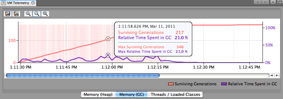
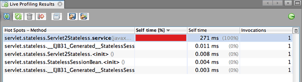
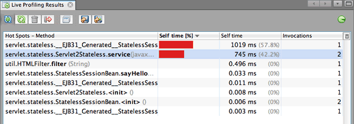
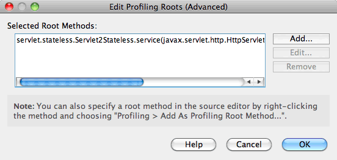
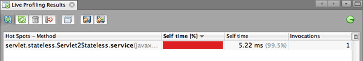
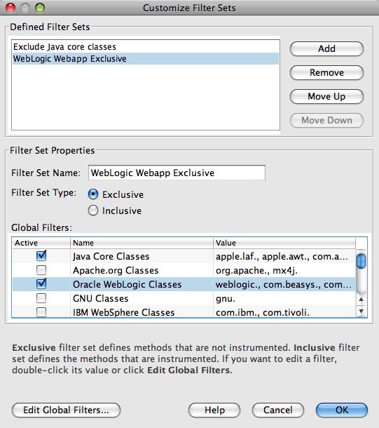
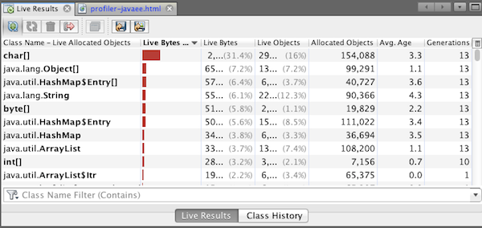

// 
//     Licensed to the Apache Software Foundation (ASF) under one
//     or more contributor license agreements.  See the NOTICE file
//     distributed with this work for additional information
//     regarding copyright ownership.  The ASF licenses this file
//     to you under the Apache License, Version 2.0 (the
//     "License"); you may not use this file except in compliance
//     with the License.  You may obtain a copy of the License at
// 
//       http://www.apache.org/licenses/LICENSE-2.0
// 
//     Unless required by applicable law or agreed to in writing,
//     software distributed under the License is distributed on an
//     "AS IS" BASIS, WITHOUT WARRANTIES OR CONDITIONS OF ANY
//     KIND, either express or implied.  See the License for the
//     specific language governing permissions and limitations
//     under the License.
//

= Profiling an Enterprise Application in NetBeans IDE
:jbake-type: tutorial
:jbake-tags: tutorials 
:jbake-status: published
:syntax: true
:icons: font
:icons: font
:source-highlighter: pygments
:toc: left
:toc-title:
:description: Profiling an Enterprise Application in NetBeans IDE - Apache NetBeans
:keywords: Apache NetBeans, Tutorials, Profiling an Enterprise Application in NetBeans IDE

NetBeans IDE includes a powerful profiling tool that can provide important information about the runtime behavior of enterprise applications. Using the profiling tool you can easily monitor thread states and obtain data on the CPU performance and memory usage of an application.

In this document you will use the profiling tool to obtain data about a simple enterprise application that is deployed as an WAR to an application server. This document shows how to use the IDE to obtain profiling results about the following.

* Runtime behavior of an application
* CPU time used by an application's methods
* Object creation

If you are deploying an application to a local registered Tomcat, GlassFish server or JBoss installation, you can profile the application with only a few mouse clicks and almost zero configuration. The process of profiling the project is very similar to using the Run command in the IDE. You can easily start profiling enterprise application projects or individual web and EJB modules by choosing Profile > Profile Main Project from the main menu.

*To follow this tutorial, you need the following software and resources.*

|===
|Software or Resource |Version Required 

|xref:../../../download/index.adoc[NetBeans IDE] |7.3, 7.4, 8.0, Java EE bundle 

|link:http://www.oracle.com/technetwork/java/javase/downloads/index.html[+Java Development Kit (JDK)+] |JDK 7 or 8 

|GlassFish server |3.1, 4.0 
|===

[NOTE]
====
* If you are using the profiler for the first time, it is recommended that you read the xref:../java/profiler-intro.adoc[+Introduction to Profiling Java Applications in NetBeans IDE+] which provides an overview of the monitoring and profiling tasks.
//* If you are using NetBeans IDE 7.2 or earlier, see xref:../../72/javaee/profiler-javaee.adoc[+Profiling an Enterprise Application in NetBeans IDE 7.2+]
* In this document you will profile an enterprise application deployed to the GlassFish server. The preferred and the easiest configuration for profiling an enterprise or web application during development is when the the application is running on a local Tomcat, GlassFish or JBoss server.
====

== About Profiling Enterprise Applications in the IDE

When profiling enterprise applications, in most cases you will want to analyze the performance of the application to see the execution time of the project's methods. This enables you to troubleshoot the application and try to improve the performance. In some cases you will also want to obtain data on memory usage to optimize garbage collection.

The process for profiling enterprise applications, EJB modules and web applications is basically the same as for running the project using the Run command. After selecting the profiling task and specifying profiling options, you click Run in the Select Profiling Task dialog box to start the profiling session. When you start a profiling session, the IDE does the following:

* Compiles the application
* Starts the target server in profiling mode
* Deploys the application
* Attaches to the application
* Opens the web browser to the web page (if specified in project properties)
* Opens the Live Profiling Results tab

Depending on your profiling options, the IDE will immediately start displaying profiling results in the Live Profiling Results tab. In some cases, such as when you have specified profiling root methods, you may need to perform some actions in the web browser before results are displayed.

=== Profiling Enterprise Application Projects

An enterprise application that you create in the IDE will typically be either a web application project that is deployed to an application server as a web archive (WAR) or an enterprise application project that contains a web application and additional libraries and is deployed as an enterprise application archive (EAR).

If you want to deploy your application as an EAR archive, you can create a NetBeans enterprise application project that contains the sub-projects and libraries. The enterprise application project does not contain any source files, only information about building and deploying the application and server configuration metadata. In an enterprise application project, the business logic of the application is generally contained in the EJB module and the source code for the presentation layer is contained in the web module.

If you have all the sources for the enterprise application project, the best and easiest method for profiling the application is to profile the enterprise application project rather than one of the project's sub-projects. This ensures that all the necessary code is compiled and deployed and that the application behaves correctly. You can profile an enterprise application project by doing either of the following:

* If the enterprise application project is set as the Main Project, click Profile Main Project from the IDE toolbar or choose Profile > Profile Main Project in the main menu.
* Right-click the enterprise application project node in the Projects window and choose Profile from the popup menu.

When profiling an enterprise application, you can increase the relevance of the profiling results by specifying profiling root methods and using instrumentation filters to limit the classes that are profiled. This can help minimize the impact that the profiling overhead imposes on the performance of the application and increase the relevance of the profiling results.

Unlike web applications, when you run an enterprise applications the browser is not always opened automatically. (This depends on the project configuration.) This means that in some cases you may need to manually launch the web application front end and then invoke code such as the business logic in an EJB module from the web browser.

=== Profiling EJB and Web Module Subprojects

You can start a profiling session from any EJB module or web module project. In this case, you may want to try one of the following approaches:

* *Profiling an EJB module.* If you take this approach, you will probably need to invoke the application code manually from the web browser or another client because EJB module projects are generally not configured to open a web browser. After the EJB module is deployed to the server, you should invoke its code the same way as you would for debugging or evaluating application functionality, typically by launching the web application front end and then performing actions in the web browser.
* *Profiling a web module.* If you take this approach you will need to compile and deploy the EJB module to the server before profiling the web module project. Typically, the EJB's code is performed as a result of some user action in a browser. If this action is performed/handled by the web application code, you will see the EJB code in its call tree.

== Creating the Sample Project

In this document you will profile the ServletStateless sample application. The ServletStateless application is a simple enterprise web application that is included as a sample project in the IDE.

To create the ServletStateless application, perform the following steps.

1. Choose File > New Project (Ctrl-Shift-N; ⌘-Shift-N on Mac) from the main menu.
2. In the New Projects wizard, select the Samples > Java EE category.
3. Select the Servlet Stateless project. Click Next.
4. Specify a location for the project. Click Finish.

When you click Finish, the IDE creates the ServletStateless sample project. You can see the ServletStateless project in the Projects window.

[NOTE]
====
* By default, when using the IDE to profile a project, the IDE will profile the project that is selected in the Projects window if more than one project is open. If you choose Run > Set Main Project from the main menu and set a project as the Main Project, the Main Project is profiled by default. You can right-click a project node in the Projects window and choose Profile in the popup menu.
* If you want to profile a file such as  ``.jsp``  page or a servlet, right-click the file and choose Profile File from the popup menu. The behavior is similar to Profile (Main) Project, but when you start the profiling session the selected web page will open in the browser instead of the default web page for the project.
====

== Monitoring the Application

Monitoring an application enables you to obtain high-level information about properties of the target JVM, including thread activity and memory allocations. Because monitoring an application imposes very low overhead, you can run the application in this mode for extended periods of time. When you choose the Monitor task, the target application is started without any instrumentation.

To monitor the ServletStateless application perform the following steps.

1. Choose Run > Set Main Project > ServletStateless to set the project as the main project.

When you set the project as the Main Project the name of the project will be in bold in the Projects window.

. Choose Profile > Profile Main Project from the main menu.

NOTE:  Select JDK 1.7 or JDK 1.8 if you are prompted to select a Java platform for profiling.

. Select Monitor in the Select Profiling Task dialog box.

. Click Run.

NOTE:  If you have not used the profiler before you might be prompted to calibrate the profiler before you can click Run. For more on calibrating the profiler, see the section on xref:../java/profiler-intro.adoc#calibrate[+Using the Profiler for the First Time+] in the xref:../java/profiler-intro.adoc[+Introduction to Profiling Java Applications in NetBeans IDE+].

When you click Run, the IDE builds the application, starts the server in profile mode and then deploys the application to the server. The IDE then attaches to the application and starts retrieving data.

Data on threads in the target JVM is displayed in the Threads tab. The Threads tab displays data on all threads, server threads as well as threads in the application.

You can view additional monitoring information by clicking the Telemetry Overview button in the Profiler window to open the VM Telemetry Overview window. The VM Telemetry Overview window enables you to quickly get an overview of the monitoring data in real time. You can double-click any of the graphs in the VM Telemetry Overview window to open a larger version of the graph.

When monitoring an enterprise application, the Memory(Heap) and Memory (GC) graphs can help you quickly see the memory usage of the application. You can place your cursor over the graph to open a tooltip with more detailed information. If the heap size or the number of surviving generations is steadily increasing, it could indicate a memory leak. If you suspect a memory leak, you may then want to profile the application's memory usage.

 

== Analyzing the Performance of the Application

The Analyze CPU Performance task enables you to see data on the method-level CPU performance (execution time) of your application and the number of times methods are invoked. You can choose to analyze the performance of the entire application or select a profiling root to limit the profiling to a part of the application code.

image::images/sample-task.png[title="Sample Application mode selected in the CPU pane of Select Profiling Task dialog box"]

When you choose the analyze CPU performance task in the Profiling Tasks window you can choose how much of the application you want to profile by selecting one of the following options.

* *Quick (sampled).* In this mode, the IDE samples the application and takes a stack trace periodically. This option is less precise than instrumenting methods, but the overhead is lower. This option can help you locate methods that you might want to instrument.
* *Advanced (instrumented).* In this mode, the methods of the profiled application are instrumented. The IDE records when threads enter and exit project methods enabling you to see how much time is spent in each method. When entering a method, threads generate a "method entry" event. Threads generate a corresponding "method exit" event when exiting the method. The timestamps for both of these events are recorded. This data is processed in real time.

You can choose to instrument all the methods in the application or limit the instrumentation to a subset of the application's code by specifying one or more *root methods*. Specifying a root method can greatly reduce the profiling overhead. A root method is the method, class or package in your source code that you specify as an instrumentation root. Profiling data is collected when one of the application's threads enters and leaves the instrumentation root. No profiling data is collected until one of the application's threads enters the root method. You can specify a root method using the popup menu in the source code or by clicking *customize* to open the Edit Profiling Roots dialog box.

*Tips for Profiling Web Applications*

* In addition to the Java core classes, an enterprise application will typically invoke a number of methods in classes in the target server. For this reason it is important to choose a filter to limit the sources that are instrumented. It is recommended that you use the *Profile only project classes* filter when profiling enterprise applications.
* Profiling results are collected as soon as the profiling session is started. If you are using the Advanced method and you do not specify any profiling root methods, some interesting data is available immediately after server startup, specifically the web application's listeners and filters initialization. If you specify some profiling root methods you probably will not get this data, depending on the root methods that you select.
* Usually you are not interested in data about listeners or filters, so you can click Reset Collected Results to clear that data. The first usable data will be collected after some code is invoked as a result of some action in the web browser, typically displaying a JSP page that uses JavaBeans and/or custom tags or processing servlet's  ``doGet`` / ``doPost``  method. You should note that the data collected when the application starts up the first time often only represents the startup behavior of the web application.
* If a JSP page is being displayed for the first time, it is compiled to the servlet internally by the server, which affects the call tree and the methods timing. Also, the behavior of servlets and other application code can be slightly different during the first run than it is in a real production environment, where the application is running constantly. To obtain profiling data that better represents real application performance, you should generate some workload on the profiled code before measuring any times (call trees should not be affected by this). You can use a load generators to help you with this. (For more, see xref:../java/profile-loadgenerator.adoc[+Using a Load Generator in NetBeans IDE+].) The caching capabilities of various browsers can also have an impact on performance.

NOTE:  If you are profiling web applications on the GlassFish application server on a Windows machine, starting the server for profiling may fail if the NetBeans IDE is installed in a path that contains spaces (such as the default installation to  ``C:\Program Files\netbeans-7.4`` ). The workaround is to install/copy your NetBeans IDE installation directory to a location that does not contain spaces in the path (such as  ``C:\netbeans-7.4`` ).

=== Sampling the Application

You should choose the Quick option if you need an overview of the behavior of the entire application and you do not want to instrument the methods. In the Quick profile mode the IDE periodically takes a stack trace. The overhead of the Quick profile mode is less than the Advanced profile mode.

In this exercise you will analyze the performance of the application by selecting the Quick profile mode.

1. Stop the monitoring session by clicking the Stop button in the Profiler window.
2. Choose Profile > Profile Main Project from the main menu.
3. Select CPU in the Select Profiling Task dialog box.
4. Select the *Quick (sampled)* mode.
5. Select *Profile only project classes* from the Filter drop-down list. Click Run.

NOTE:  This filter will limit the classes that are instrumented to the classes that are found in the enterprise application project. Click *Show filter value* to see a list of the filtered classes.

image::images/sample-task.png[title="Sample Application mode selected in the CPU pane of Select Profiling Task dialog box"]

You can see on the scale in the dialog that the overhead will be relatively low.

. Click the Live Profiling Results button in the Profiler window to open the Live Profiling Results tab.

image::images/sample-task-results.png[title="Results of Sample Application mode"]

In the Live Profiling Results tab you can see the execution time for the  ``service``  method for the servlet in the  ``Servlet2Stateless``  class and that the method was invoked one time.

=== Instrumenting All Methods

In the Profile Application mode, the methods of your application are instrumented. Though you get a more exact measurement of the performance of the application, the profiling overhead is higher than if you choose the sample mode. You can specify profiling root methods to limit the methods that are instrumented and reduce the profiling overhead. For some applications, specifying a root method may be the only way to obtain any detailed and/or realistic performance data because profiling the entire application may generate so much profiling data that the application becomes unusable or may even cause the application to crash.

In this exercise you will analyze the performance of the application by instrumenting all the methods in the enterprise application.

1. Stop the monitoring session by clicking the Stop button in the Profiler window.
2. Choose Profile > Profile Main Project from the main menu.
3. Select CPU in the Select Profiling Task dialog box.
4. Select the *Advanced (instrumented)* mode.
5. Select *Profile only project classes* from the Filter drop-down list. Click Run.

image::images/advanced-cpu-task.png[title="Profile Application mode selected in the CPU pane of Select Profiling Task dialog box"]

You can see on the scale in the dialog that the overhead will be higher than in the Quick profile mode.

. Click the Live Profiling Results button in the Profiler window to open the Live Profiling Results tab.

You can see that the Live Profiling Results tab shows the execution time for the  ``init``  and  ``service``  methods for the servlet in the  ``Servlet2Stateless``  class and that each method was invoked one time. The  ``init``  method in the  ``StatelessSessionBean``  class was also invoked.

NOTE:  By default, the auto-refresh mode is active so that the data displayed is refreshed every few seconds. You can activate and de-activate the auto-refresh mode by clicking the Auto-Refresh button in the toolbar.

To improve the readability of the collected data, you can use the Results filter in the Hot Spots view in the Live Profiling Results window to filter the displayed results. The Results filter only filters the display of results and does not affect the classes that are instrumented. When you use the Results filter, you filter the results which start, contain or end with a defined pattern. You can also use more complex regular expressions for filtering. Data is filtered based on package/class/method names exactly as they appear in the first results table column. You can specify more than one pattern, separating the patterns by a space or comma with space.

. In the web browser, type your name in the field and click Submit Query.

When you click Submit Query, you can see that the Live Profiling Results tab is updated to reflect the action in the web browser. Clicking the button invoked the  ``sayHello``  method in the  ``StatelessSessionBean``  class and invoked the  ``init``  method again. The  ``service``  method for the servlet in the  ``Servlet2Stateless``  was also invoked again. The tab also displays how much time was spent in each of the methods.

You can click the DrillDown button to see a graphic representation of the relative time spent in various areas of the application, for example, servlets, listeners, etc. You can click on the graphic to drill down into the displayed profiling results.

image::images/drill-down.png[title="Drilldown graph of relative time spent in servlets in the application"]

Instrumenting an application will always impose some overhead when profiling the application. In such a simple application the overhead is not noticeable, but in a complex application the overhead can be quite significant. You can reduce the overhead by limiting the classes that are profiled by selecting a profiling root method.

=== Using Profiling Root Methods

In this exercise you will profile only part of the application. You should use this profiling method if you think you know where a performance bottleneck is, or if you want to profile some specific part of your code, such as only one or a few servlets. This method typically imposes significantly lower profiling overhead than instrumenting all the application methods. By instrumenting only part of the application, only the data you are really interested in is collected and displayed.

To profile part of an application you need to set one or more profiling root methods. The IDE instruments only those methods that are called by a thread entering a profiling root method. For example, if you set the  ``sayHello``  method in the  ``StatelessSessionBean``  class as the root method and use the Profile only project classes filter, the IDE will start instrumenting methods when the method is invoked and an application thread enters the method. In this application the  ``init``  constructor will not be instrumented because it is invoked before  ``sayHello`` .

image::images/profileroot-sayhello-project.png[title="Drilldown graph of relative time spent in servlets in the application"]

If you select the Profile all classes filter the IDE will instrument all methods called by  ``sayHello`` , including any Java core classes.

image::images/profileroot-sayhello-all.png[title="Drilldown graph of relative time spent in servlets in the application"]

NOTE: In a more complex application you may want to specify several root methods. You can select individual methods, entire classes and packages as profiling roots.

To specify a profiling root and analyze the performance of the application, perform the following steps.

1. Stop the previous profiling session (if still running) by clicking the Stop button in the Profiler window.
2. Choose Profile > Profile Main Project from the main menu.
3. Select CPU in the Select Profiling Task dialog box.
4. Select the *Advanced (instrumented)* mode.
5. Click *customize* to open the Edit Profiling Roots dialog box.

To profile part of an application you need to first specify the root methods. By selecting the profiling root, you limit the profiling to the methods called by the thread entering the profiling root.

. In the Edit Profiling Roots dialog box, select Web Application View in the Select View drop-down list.

. Expand the ServletStateless node and select the  ``service``  method in the Servlets package. Click OK.

image::images/edit-profiling-roots.png[title="Web Application View in Edit Profiling Roots dialog"]

Alternatively, you can choose the Package View to view all the source packages in the application and select the  ``service``  method in the  ``Servlet2Stateless``  class in the  ``servlet.stateless``  package.

image::images/edit-profiling-roots-pkg.png[title="Package View in Edit Profiling Roots dialog"]

NOTE:  Notice that the  ``Servlet2Stateless``  constructor is not selected. You can use the Edit Profiling Roots dialog to limit the instrumentation to specific methods in a class. If you do not want to limit the instrumentation to specific methods, you can use the Package View to select an entire class or package. For example, if you select the  ``Servlet2Stateless``  class in the Package View of the Edit Profiling Roots dialog box, the IDE will instrument the  ``init``  constructor and the  ``service``  method.

If you click the Advanced button you can see that the  ``service``  method is listed as the only root method in the Edit Profiling Roots (Advanced) dialog box. You can click Add to explicitly define a method by typing the method signature and class.

. Click OK in the Edit Profiling Roots dialog box.

In the Select Profiling Task dialog box you can see that the Advanced profiling mode will be run using custom profiling roots. You can click *edit* to view and modify the selected root methods. Notice that the profiling overhead is now less than when no root methods were specified.

. Select *Profile only project classes* from the Filter drop-down list. Click Run.

image::images/advanced-cpu-task-custom.png[title="Profile Application mode selected with a custom profiling root"]

When you click Run, the IDE builds and deploys the application and opens the web browser to the servlet page.

The IDE displays the profiling results in the Live Profiling Results tab.

You can see that the IDE only displays the results for the method specified as the profiling root. The application thread has not entered any other methods in the application after entering the profiling root.

Though the application has entered other methods since entering the profiling root, these other methods are not displayed because the instrumentation filter limits the instrumentation to classes that are part of the project.

. In the web browser, type your name in the field and click Submit Query.

image::images/cpu-pane2-results1.png[title="Results of instrumenting methods using a profiling root after invoking sayHello method"]

When you click Submit Query, you can see that the Live Profiling Results tab is updated to reflect the action in the web browser. Clicking the button invoked the  ``sayHello``  method in the  ``StatelessSessionBean``  class one time. The  ``service``  method was also invoked again.

The results display the performance of the application, but may not accurately represent the performance of an application that has been running for some time. One way to emulate the performance of a web application under more realistic conditions is to run a load generator script.

. Repeat the previous step a few times in the browser and then click Reset Results in the Live Profiling Results tab to clear the results.

. After the profiling results are reset, type your name and click Submit Query one more time.

image::images/cpu-pane2-results2.png[title="Results of instrumenting methods using a profiling root after invoking sayHello method"]

If you look at the profiling results, in many cases you may see that the performance has improved.

=== Using Instrumentation Filters

When you are analyzing CPU performance you can reduce the profiling overhead by choosing an instrumentation filter from the drop-down list to limit profiling to the source code that you are interested in. You can use the filter to specify the packages/classes that are instrumented. You can choose from the following default filters or create a custom filter.

* *Profile all classes.* If you select this filter when profiling a web application or enterprise application, all classes including core Java classes and server classes are instrumented. You need to exercise caution if you choose this filter option because instrumenting so many classes can impose a *very* significant overhead .
* *Profile only project classes* If you are profiling an enterprise application it is recommended that you use this filter to limit the instrumented code to the classes in the project. Server classes will not be instrumented.
* *Profile project and subproject classes.* If you are profiling an enterprise application project that contains sub-projects such as a web application, EJB modules or class libraries, you can choose this filter to limit the instrumented code to the classes in the sub-projects.

You can create custom filters to use in specific projects or for specific types of profiling. For example, if you want an instrumentation filter to use when profiling web applications on the Oracle WebLogic server, you can click "Edit filter sets" to create a filter set that excludes Java Core Classes, Oracle WebLogic Classes and NetBeans Classes (useful when HTTP Monitor is enabled). You can then give the filter set a name such as "WebLogic Webapp Exclusive" and then choose that filter from the Filter drop-down list when profiling applications deployed to the WebLogic server.

You can define a simple instrumentation filter by selecting Quick Filter from the Filter drop-down list to open the Set Quick Filter dialog box. You can then quickly edit the list of packages or classes that are instrumented. This creates a Quick Filter that you can then select from the Filter drop-down list.

image::images/set-quick-filter.png[title="dialog box that appears when profiling a project for the first time"]

For more information about defining and using instrumentation filters, consult the profiling documentation in the IDE.

== Analyzing Memory Usage of the Application

You can use the IDE's profiling tool to analyze an enterprise application's memory usage to obtain detailed data on object allocation and garbage collection. The Analyze Memory Usage task gives you data on objects that have been allocated in the target application such as the number, type and location of the allocated objects.

When profiling memory usage you cannot set the profiling root methods and/or instrumentation filters, so all objects created during the server's life are tracked. This can lead to significant profiling overhead and memory consumption for complex application servers. Therefore you should be aware of the potential limitations of your machine before performing this type of profiling. To lower the profiling overhead, you can modify the setting so that only every 10th object is profiled. You may also want to disable (limit) the recording of stack traces for object allocations.

When profiling enterprise applications to detect memory leaks, using the metrics for Surviving Generations can be very useful. By tracking the number of various object generations surviving garbage collection cycles, the tool can help you to detect memory leaks early, before the application uses any noticeable amount of memory.

To analyze memory performance, you choose how much data you want to obtain by selecting one of the following options:

* *Quick.* When this option is selected, the profiler samples the application to provide data that is limited to the live objects. Live objects are all the reachable (and unreachable) objects that have not been reclaimed by the Garbage Collector. This option only tracks live objects and does not track allocations when instrumenting. It is not possible to record stack traces or to use profiling points if you select this option. This option incurs a significantly lower overhead than the Advanced option.
* *Advanced.* When this option is selected you can obtain information about the number, type, and location of allocated objects. The allocated objects are the objects created since the application started (or since the Collected Results in the profiler was last reset). All classes that are currently loaded by the target JVM (and each new class as it is loaded) are instrumented to produce information about object allocations. You need to select this option if you want to use profiling points when analyzing memory usage or if you want to record the call stack. This options incurs a greater profiling overhead than the Quick option.

If you select the Advanced option you can also set the following options.

* *Record Full Object Lifestyle.* Select this option to record all information for each object, including the number of generations survived.
* *Record Stack Traces for Allocation.* Select this option to record the full call stack. This option enables you to view the reverse call tree for method calls when viewing a memory snapshot.
* *Use defined Profiling Points.* Select this option to enable profiling points. Disabled profiling points are ignored. When deselected, all profiling points in the project are ignored.

The Overhead meter in the Select Profiling Tasks window gives a rough approximation of the increase or decrease in profiling overhead according to the profiling options that you select.

You will now use the IDE to analyze the memory performance of the enterprise application. If you want to obtain information about surviving generations you will need to choose the *Advanced* option. Alternatively, if you just want data about the live objects you can select the *Quick* option.

1. Stop the previous profiling session (if still running) by clicking the Stop button in the Profiler window.
When you click Stop, the IDE detaches from the application.

. Choose Profile > Profile Main Project from the main menu.

. Select *Memory* in the Select Profiling Task dialog box.

. Select *Advanced*.

. Select *Record full object lifecycle* to obtain data about surviving generations.

NOTE:  If you select this option you will notice that the Overhead meter will increase substantially. When profiling an enterprise application, it is quite possible that you will need to increase the memory for the IDE because of the amount of collected data.

. Deselect *Use defined Profiling Points* (if selected). Click Run.

image::images/profile-memory-advanced.png[title="Select Profiling Task dialog showing Memory task and options"]

When you click Run, the IDE compiles the application, starts the server in profile mode and deploys the application to the server. To view the profiling results, click Live Results in the Profiler window to open the Live Results window. The Live Results window displays information on the size and number of objects that are allocated on the target JVM. In addition to the objects allocated by the enterprise application, the results also include all the objects allocated by the application server.

By default the results are sorted and displayed by the number of Live Bytes, but you can click a column header to change how the results are displayed. You can also filter the results by typing a class name in the filter box below the list.

xref:../../../community/mailing-lists.adoc[Send Feedback on This Tutorial]

== See Also

This document demonstrated basic approaches to obtaining profiling data when profiling an enterprise application that is deployed to the GlassFish application server.

For more detailed information about profiling settings and features not covered in this document, please consult the documentation included in the product and available from the Help menu item.

For related documentation, see the following resources:

* xref:../../../wiki/NetBeansUserFAQ.adoc#section-NetBeansUserFAQ-Profiler[+NetBeans Profiler FAQs+]
A document containing frequently asked questions regarding profiling applications in NetBeans IDE
* xref:../../../wiki/FaqProfilerProfileFreeForm.adoc[+FAQ: Profiling a Free-form project+]
* xref:../java/profiler-screencast.adoc[+Screencast: Profiling Points, Drill Down Graph, Heap Walker+]
Demo showing some of the profiling features in NetBeans IDE.
* xref:../../../community/magazine/html/04/profiler.adoc[+Advanced Profiling: Theory in Practice+]
* link:http://profiler.netbeans.org/index.html[+profiler.netbeans.org+]
The NetBeans profiler project site
* link:http://blogs.oracle.com/nbprofiler/[+NetBeans Profiler blog+]
* link:http://profiler.netbeans.org/mailinglists.html[+NetBeans Profiler Mailing Lists+]
* link:http://profiler.netbeans.org/docs/help/5.5/index.html[+Using NetBeans Profiler 5.5+]

