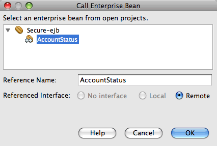

// 
//     Licensed to the Apache Software Foundation (ASF) under one
//     or more contributor license agreements.  See the NOTICE file
//     distributed with this work for additional information
//     regarding copyright ownership.  The ASF licenses this file
//     to you under the Apache License, Version 2.0 (the
//     "License"); you may not use this file except in compliance
//     with the License.  You may obtain a copy of the License at
// 
//       http://www.apache.org/licenses/LICENSE-2.0
// 
//     Unless required by applicable law or agreed to in writing,
//     software distributed under the License is distributed on an
//     "AS IS" BASIS, WITHOUT WARRANTIES OR CONDITIONS OF ANY
//     KIND, either express or implied.  See the License for the
//     specific language governing permissions and limitations
//     under the License.
//

= Java EEでのセキュリティ保護されたエンタープライズBeansのビルド
:jbake-type: tutorial
:jbake-tags: tutorials 
:jbake-status: published
:icons: font
:syntax: true
:source-highlighter: pygments
:toc: left
:toc-title:
:description: Java EEでのセキュリティ保護されたエンタープライズBeansのビルド - Apache NetBeans
:keywords: Apache NetBeans, Tutorials, Java EEでのセキュリティ保護されたエンタープライズBeansのビルド

NetBeans IDEではJava EE仕様がサポートされており、アプリケーション開発を簡単にするJava EEの数多くの機能を最大限に活用できます。Java EE 5仕様の大きな開発特長として、注釈が取り入れられています。注釈を使用すると、アプリケーションのコーディング時に使用する定型コードの多くを除外し、アプリケーションのデプロイ時に必要な構成の量を減らすことができます。

注釈の使用によって大幅に簡素化された領域として、エンタープライズBeansの開発と構成があります。以前はデプロイメント・ディスクリプタ・ファイルで指定していた多くの構成プロパティを注釈で指定できるので、多くのデプロイメント・ディスクリプタ・ファイルが不要になります。いくつかのデプロイメント・ディスクリプタ・ファイル( ``web.xml`` など)はまだアプリケーションに必要である場合がありますが、IDEのマルチビューのデプロイメント・ディスクリプタ・エディタによってファイルの編集が非常に簡単になっています。

注釈を使用すると、セキュリティ保護されたエンタープライズBeansを非常に簡単にビルドできます。エンタープライズBeanのセキュリティを ``ejb-jar.xml`` デプロイメント・ディスクリプタで構成するかわりに、セキュリティ注釈を使用して認証をソース・コード内で直接構成できます。Java EE 5のエンタープライズ・アプリケーションには ``ejb-jar.xml`` または ``application.xml`` は必要ありません。

Java EE仕様の特徴の概要については、link:javaee-intro.html[+Java EEテクノロジ入門+]を参照してください。注釈の仕様については、link:http://jcp.org/en/jsr/detail?id=250[+JSR 250: Javaプラットフォームの一般的な注釈+]を参照してください。

*このチュートリアルに従うには、次のソフトウェアとリソースが必要です。*

|===
|ソフトウェアまたはリソース |必須バージョン 

|link:https://netbeans.org/downloads/index.html[+NetBeans IDE+] |7.2、7.3、7.4、8.0、Java EEバージョン 

|link:http://www.oracle.com/technetwork/java/javase/downloads/index.html[+Java Development Kit (JDK)+] |バージョン7または8 

|GlassFish Server |3.1.x、4.x 
|===

このチュートリアルでは、GlassFishサーバーのローカル・インスタンスをIDEに登録する必要があります。IDEのJava EE版をインストールした場合、アプリケーション・サーバーはすでにインストールされ、登録されているはずです。アプリケーション・サーバーがIDEに登録されていない場合は、「ツール」>「サーバー」を選択してサーバー・マネージャでサーバーを登録します。Tomcat Webサーバーにエンタープライズ・アプリケーションをデプロイすることはできません。

*前提条件*

このドキュメントは、次のテクノロジについて基本的な知識またはプログラミング経験を持つ読者を想定して書かれています。

* Javaプログラミング
* NetBeans IDE

== [[アプリケーション・サーバーへのセキュリティ・グループの作成]] 

この例では、 ``bank_users`` グループのユーザーのみがエンタープライズBeanにアクセスできるようにします。アプリケーション・サーバーの ``file`` セキュリティ・レルムで ``bank_users`` グループ内にユーザー ``manager`` を作成します。

1. 「サービス」ウィンドウでアプリケーション・サーバーのノードを右クリックして「起動」を選択し、サーバーを起動します。
2. アプリケーション・サーバーのノードを右クリックし、「ドメイン管理コンソールの表示」を選択して、ブラウザでGlassFishサーバー管理コンソールを開きます。
3. 左側のナビゲーション・バーで、「構成」ノードの下の「*server-config*」ノードを展開します。
4. *「セキュリティ」>「レルム」>「file」*をクリックして「レルムを編集」フレームを開きます。

image::images/console-file-realm.png[title="アプリケーション・サーバーの管理コンソールでのfileレルム・ノードの選択"]

. 「レルムを編集」パネルの上部にある「ユーザー管理」ボタンをクリックして、「ファイル・ユーザー」パネルを開きます。

image::images/console-edit-realm.png[title="アプリケーション・サーバーの管理コンソールの「レルムを編集」パネル・ノード"]

. 「ファイル・ユーザー」パネルの「ファイル・ユーザー」表の上部にある「新規」ボタンをクリックします。

. 「新規ファイル・レルム・ユーザー」フォームに次のデータを入力します。「OK」をクリックします。
|===

|名前 |値 

|ユーザーID |manager 

|グループ・リスト |bank_users 

|パスワード |password 
|===

フォームは次のイメージのようになるはずです。

image::images/console-new-user.png[title="アプリケーション・サーバーの管理コンソールの新規ファイル・レルム・ユーザー・パネル"]

「OK」をクリックすると、サーバーによってユーザーが作成され、「ファイル・ユーザー」パネルが開きます。 ``manager`` という名前のユーザーがあることがわかります。

image::images/console-file-users.png[title="ユーザーの一覧が表示された管理コンソールのファイル・ユーザー・パネル"]

ユーザーが作成されたので、このユーザーがデータを参照できることを確認するエンタープライズ・アプリケーションを作成します。

== リモート・インタフェース用のJavaクラス・ライブラリの作成

この課題では、セッションBean用のリモート・インタフェースを含む単純なJavaクラス・ライブラリ・プロジェクトを作成します。コンパイルされたクラス・ライブラリJARは、セッションBeanをコールするために使用されるEJBモジュールとアプリケーション・クライアントのクラスパスに追加されます。

1. 「ファイル」>「新規プロジェクト」を選択し、「Java」カテゴリの「Javaクラス・ライブラリ」を選択します。「次」をクリックします。
2. 「プロジェクト名」に「SecureRemoteInterface」と入力します。
3. プロジェクトの場所を指定します。「終了」をクリックします。

次の項では、エンタープライズ・アプリケーション内にセッションBeanを作成します。このセッションBeanは、リモート・インタフェースを経由してアクセスされます。セッションBeanを作成すると、IDEによって自動的にクラス・ライブラリ内にリモート・インタフェースが作成され、エンタープライズ・アプリケーションのクラスパスにクラス・ライブラリJARが追加されます。

== エンタープライズ・アプリケーションの作成とセキュリティ保護

このエンタープライズ・アプリケーションは、クラス・ライブラリ・プロジェクト内のリモート・インタフェースを経由してアクセスされる単純なセッションBeanで構成されます。

=== エンタープライズ・アプリケーション・プロジェクトの作成

この課題では、EJBモジュールを含むエンタープライズ・アプリケーションを作成します。

1. 「ファイル」>「新規プロジェクト」([Ctrl]-[Shift]-[N]、Macの場合は[⌘]-[Shift]-[N])を選択し、「Java EE」カテゴリから「エンタープライズ・アプリケーション」テンプレートを選択します。「次」をクリックします。
2. 「プロジェクト名」に「*Secure*」と入力し、「プロジェクトの場所」を設定します。
3. 専用フォルダを使用するオプションが選択されている場合は選択解除します。

このチュートリアルでは、ライブラリを他のユーザーまたはプロジェクトと共有する必要がないので、プロジェクト・ライブラリを専用のフォルダにコピーする理由はほとんどありません。

「次」をクリックします。

. サーバーをGlassFishに設定し、Java EEバージョンをJava EE 6に設定します。

. 「EJBモジュールを作成」を選択し、「Webアプリケーション・モジュールを作成」を選択解除します。「終了」をクリックします。

image::images/new-entapp-wizard.png[title="アプリケーション・サーバーの管理コンソールの新規ファイル・レルム・ユーザー・パネル"] 

=== セッションBean内のメソッドのセキュリティ保護

この課題では、EJBモジュール・プロジェクト内にセッションBeanを作成します。このセッションBeanでは、特別な処理は行いません。サンプルの残高を返すのみです。 ``getStatus`` メソッドを作成し、 ``@RolesAllowed`` 注釈を付けることでメソッドBeanをセキュリティ保護し、メソッドへのアクセスを許可するセキュリティ・ロールを指定します。このセキュリティ・ロールはアプリケーションで使用され、サーバーのユーザーやグループと同じではありません。後でデプロイメント・ディスクリプタを構成するときに、セキュリティ・ロールをユーザーとグループにマップします。

セキュリティ注釈はクラス内のメソッドごとに、またはクラス全体に適用できます。この単純な課題では、 ``@RolesAllowed`` 注釈をメソッドに付けますが、Java EE仕様では、エンタープライズBeansで使用できるセキュリティ注釈が他にも定義されています。

1. 「プロジェクト」ウィンドウでEJBモジュールのノード(Secure-ejb)を右クリックし、「新規」>「セッションBean」を選択します。
2. Bean名に「*AccountStatus*」と入力し、パッケージに「*bean*」と入力します。
3. インタフェースのタイプとして「プロジェクトでのリモート」を選択します。
4. ドロップダウン・リストで「SecureRemoteInterface」を選択します。「終了」をクリックします。

image::images/new-sessionbean-wizard.png[title="新規セッションBeanウィザードで選択されたリモート・インタフェース"]

「終了」をクリックすると、IDEによって ``AccountStatus`` クラスが作成され、ファイルがソース・エディタで開きます。

また、IDEによってSecureRemoteInterfaceクラス・ライブラリ・プロジェクト内の ``bean`` パッケージのBeanのために ``AccountStatusRemote`` リモート・インタフェースが作成され、EJBモジュール・プロジェクトのクラスパスにSecureRemoteInterfaceクラス・ライブラリJARが追加されます。

image::images/projects-window-bean.png[title="セッションBeanとクラスパス上のクラス・ライブラリを示す「プロジェクト」ウィンドウ"]

EJBモジュールの「プロパティ」ダイアログ・ボックスの「ライブラリ」カテゴリを開くと、このJARがコンパイル時ライブラリに追加されていることがわかります。

. ソース・エディタで次のフィールド宣言(太字部分)を ``AccountStatus`` に追加します。

[source,java]
----

public class AccountStatus implements AccountStatusRemote {
    *private String amount = "250";*
----

. ソース・エディタで、クラス内を右クリックして「コードを挿入」([Alt]-[Insert]、Macの場合は[Ctrl]-[I])を選択し、「ビジネス・メソッドを追加」を選択して「ビジネス・メソッドを追加」ダイアログ・ボックスを開きます。

. メソッド名に「*getStatus*」と入力し、戻り型を ``String`` に設定します。

ビジネス・メソッドが自動的にリモート・インタフェースに公開されます。

. ソース・エディタで次に示す太字の行を ``getStatus`` メソッドに追加します。

[source,java]
----

public String getStatus() {
*    return "The account contains $" + amount;*
}
----

. 次に示す太字の部分を入力して ``getStatus`` メソッドに注釈を付けます。*@RolesAllowed({"USERS"})*

[source,java]
----

public String getStatus() {
----

この注釈は、セキュリティ・ロール ``USERS`` のユーザーのみが ``getStatus`` メソッドにアクセスできることを示します。

. エディタ内を右クリックして「インポートを修正」([Alt]-[Shift]-[I]、Macの場合は[⌘]-[Shift]-[I])を選択し、変更内容を保存します。ファイルに ``javax.annotation.security.RolesAllowed`` が追加されていることを確認します。

=== デプロイメント・ディスクリプタの構成

Java EEエンタープライズ・アプリケーションには通常、 ``ejb-jar.xml`` などのデプロイメント・ディスクリプタ・ファイルは必要ありません。「Secure-ejb」または「Secure」エンタープライズ・アプリケーションの下にある「構成ファイル」ノードを展開すると、デプロイメント・ディスクリプタがないことがわかります。注釈を使用して、 ``ejb-jar.xml`` 内で構成されていたプロパティの多くを指定できます。この例では、セッションBean内で ``@RolesAllowed`` 注釈を使用してEJBメソッドにセキュリティ・ロールを指定しました。

ただし、アプリケーションにセキュリティを構成するときは、デプロイメント・ディスクリプタでいくつかプロパティを指定する必要があります。この例では、エンタープライズ・アプリケーションで使用しているセキュリティ・ロール( ``USERS`` )を、アプリケーション・サーバーで構成したユーザーとグループにマップする必要があります。アプリケーション・サーバーに ``bank_users`` グループを作成したので、このグループをエンタープライズ・アプリケーション内のセキュリティ・ロール ``USERS`` にマップする必要があります。これを行うには、エンタープライズ・アプリケーション用の ``glassfish-application.xml`` デプロイメント・ディスクリプタを編集します。

エンタープライズ・アプリケーションは、実行のためにデプロイメント・ディスクリプタが必要ないので、デプロイメント・ディスクリプタはデフォルトで作成されていません。そのため、最初にデプロイメント・ディスクリプタ・ファイルを作成し、次にそのファイルをマルチビュー・エディタで編集してセキュリティ・ロール・マッピングを構成する必要があります。

1. 「Secure」エンタープライズ・アプリケーション・プロジェクトを右クリックし、「新規」>「その他」を選択して新規ファイル・ウィザードを開きます。

または、メイン・メニューから「ファイル」>「新規ファイル」を選択して新規ファイル・ウィザードを開くこともできます。その場合は、必ず「プロジェクト」ドロップダウン・リストで「Secure」プロジェクトを選択してください。

. 「GlassFish」カテゴリで「GlassFishディスクリプタ」ファイル・タイプを選択します。「次」をクリックします。

image::images/new-gf-descriptor.png[title="新規ファイル・ウィザードの「GlassFishディスクリプタ」ファイル・タイプ"]

. ウィザードのデフォルト値を受け入れ、「終了」をクリックします。

「終了」をクリックすると、IDEによって ``glassfish-application.xml`` が作成され、ファイルがマルチビュー・エディタで開きます。

「プロジェクト」ウィンドウで「Secure」エンタープライズ・アプリケーション・プロジェクトのノードを展開すると、「構成ファイル」ノードの下にディスクリプタ・ファイルが作成されたことがわかります。

image::images/glassfish-application-descriptor.png[title="マルチビュー・エディタの「セキュリティ」タブ"]

. マルチビュー・エディタの「セキュリティ」タブで、「セキュリティ・ロール・マッピングの追加」をクリックし、「セキュリティ・ロール名」に「*USERS*」と入力します。

. 「グループを追加」をクリックし、ダイアログ・ボックスの「グループ名」に「*bank_users*」と入力します。「OK」をクリックします。

エディタは次のようになっているはずです。

image::images/security-tab-descriptor.png[title="マルチビュー・エディタの「セキュリティ」タブ"]

. 変更を保存します。

マルチビュー・エディタ内の「XML」タブをクリックして、デプロイメント・ディスクリプタ・ファイルをXMLビューに表示できます。デプロイメント・ディスクリプタ・ファイルに次の内容が含まれることがわかります。

[source,xml]
----

<glassfish-application>
  <security-role-mapping>
    <role-name>USERS</role-name>
    <group-name>bank_users</group-name>
  </security-role-mapping>
</glassfish-application>
----

これで、 ``getStatus`` メソッドがセキュリティ保護され、サーバー上で指定した ``bank_users`` グループ内のユーザーのみがこのメソッドにアクセスできます。

次に、セキュリティ設定をテストする手段が必要です。最も簡単な方法は、ユーザーにユーザー名とパスワードの入力を求める基本的なアプリケーション・クライアントを作成することです。

== アプリケーション・クライアントの作成

この項では、 ``AccountStatus`` セッションBeanにアクセスするための単純なアプリケーション・クライアントを作成します。リモート・インタフェース経由でBeanをコールするためにコード内で ``@EJB`` 注釈を使用すると、アプリケーション・クライアントのクラスパスへのインタフェースを含むクラス・ライブラリJARがIDEによって自動的に追加されます。

1. 「ファイル」>「新規プロジェクト」を選択し、「Java EE」カテゴリの「エンタープライズ・アプリケーション・クライアント」を選択します。「次」をクリックします。
2. 「プロジェクト名」に「SecureAppClient」と入力します。「次」をクリックします。
3. 「エンタープライズ・アプリケーションに追加」ドロップダウン・リストで「*<なし>*」を選択します。
4. 「サーバー」ドロップダウン・リストで「GlassFish Server」を選択し、「Java EEバージョン」として「Java EE 6」または「Java EE 7」を選択します。「終了」をクリックします。

「終了」をクリックすると、 ``Main.java`` がソース・エディタに表示されます。

. ソース・エディタで ``Main.java`` ファイル内を右クリックして「コードを挿入」([Alt]-[Insert]、Macの場合は[Ctrl]-[I])を選択し、「エンタープライズBeanをコール」を選択します。

. 「エンタープライズBeanをコール」ダイアログ・ボックスで、「Secure-ejb」ノードを展開し、「AccountStatus」を選択します。「OK」をクリックします。

セッションBeanを検索できるように、IDEによってアプリケーション・クライアントに次のコードが追加されます。

[source,java]
----

@EJB
private static AccountStatusRemote accountStatus;
----

「プロジェクト」ウィンドウの「ライブラリ」ノードを展開すると、IDEによってSecureRemoteInterface JARがプロジェクトのクラスパスに追加されたことがわかります。

.  ``main`` メソッドを変更して次のコードを追加し、変更内容を保存します。

[source,java]
----

public static void main(String[] args) {
    *System.out.println(accountStatus.getStatus());*
}
----

アプリケーション・クライアントの詳細は、link:entappclient.html[+GlassFish Server上でのアプリケーション・クライアントの作成と実行+]を参照してください。

== アプリケーションの実行

これでアプリケーションの準備が完了しました。まず、エンタープライズ・アプリケーションをサーバーにデプロイします。エンタープライズ・アプリケーションをデプロイした後、アプリケーション・クライアントを実行して、エンタープライズ・アプリケーション内のメソッドがセキュリティ保護されていること、およびユーザー・ロールが正しくマップされていることをテストできます。アプリケーション・クライアントを実行すると、 ``bank_users`` グループ内のユーザーのユーザー名とパスワードの入力を求められます。

. 「プロジェクト」ウィンドウで「Secure」エンタープライズ・アプリケーション・プロジェクトのノードを右クリックし、「デプロイ」を選択します。

「デプロイ」をクリックすると、IDEはEARファイルをビルドし、アプリケーション・サーバーを起動し(実行されていない場合)、EARファイルをサーバーにデプロイします。

. 「プロジェクト」ウィンドウでSecureAppClientプロジェクト・ノードを右クリックし、「実行」を選択します。ユーザー名とパスワードの入力を求めるダイアログ・ボックスが表示されます。

image::images/login-window.png[title="ユーザー名とパスワードの入力を求める「ログイン」ウィンドウ"]

. ダイアログ・ボックスでユーザー名( ``manager`` )とパスワード( ``password`` )を入力し、「OK」をクリックします。「出力」ウィンドウに次のように表示されます。

[source,java]
----

The account contains 250$
----

この非常に基本的な例は、Java注釈を使用してエンタープライズBean内のメソッドをセキュリティ保護する方法を示しています。

link:/about/contact_form.html?to=3&subject=Feedback:%20Building%20Secure%20Enterprise%20Beans[+このチュートリアルに関するご意見をお寄せください+]

== 関連項目

注釈およびデプロイメント・ディスクリプタを使用したエンタープライズBeanのセキュリティ保護の詳細は、次のリソースを参照してください。

* Java EE 7チュートリアルのlink:http://docs.oracle.com/javaee/7/tutorial/doc/partsecurity.htm[+セキュリティ+]のセクションのlink:http://docs.oracle.com/javaee/7/tutorial/doc/security-intro003.htm[+コンテナのセキュリティ保護+]およびlink:http://docs.oracle.com/javaee/7/tutorial/doc/security-advanced008.htm[+デプロイメント・ディスクリプタを使用したセキュリティの構成+]の章

NetBeans IDEを使用したJava EEアプリケーションの開発方法の詳細は、次のリソースを参照してください。

* link:javaee-intro.html[+Java EEテクノロジ入門+]
* link:javaee-gettingstarted.html[+Java EEアプリケーションの開始+]
* link:../../trails/java-ee.html[+Java EEおよびJava Webの学習+]

link:../../../community/lists/top.html[+nbj2eeメーリング・リストに登録する+]ことによって、NetBeans IDE Java EE開発機能に関するご意見やご提案を送信したり、サポートを受けたり、最新の開発情報を入手したりできます。

