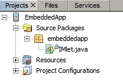
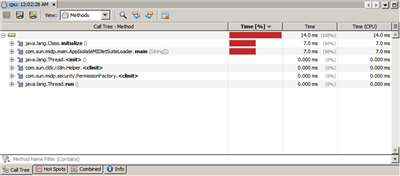

// 
//     Licensed to the Apache Software Foundation (ASF) under one
//     or more contributor license agreements.  See the NOTICE file
//     distributed with this work for additional information
//     regarding copyright ownership.  The ASF licenses this file
//     to you under the Apache License, Version 2.0 (the
//     "License"); you may not use this file except in compliance
//     with the License.  You may obtain a copy of the License at
// 
//       http://www.apache.org/licenses/LICENSE-2.0
// 
//     Unless required by applicable law or agreed to in writing,
//     software distributed under the License is distributed on an
//     "AS IS" BASIS, WITHOUT WARRANTIES OR CONDITIONS OF ANY
//     KIND, either express or implied.  See the License for the
//     specific language governing permissions and limitations
//     under the License.
//

= 创建、调试 Mobile 嵌入式应用程序并进行性能分析
:jbake-type: tutorial
:jbake-tags: tutorials 
:jbake-status: published
:icons: font
:syntax: true
:source-highlighter: pygments
:toc: left
:toc-title:
:description: 创建、调试 Mobile 嵌入式应用程序并进行性能分析 - Apache NetBeans
:keywords: Apache NetBeans, Tutorials, 创建、调试 Mobile 嵌入式应用程序并进行性能分析

Sungmoon Cho、Alyona Stashkova

Mobile 嵌入式应用程序应用于小型嵌入式设备，例如，工业测量设备、自动贩卖机、安全系统、调制解调器、家用电子设备，以及具有简易显示器（或没有显示器）和某种有限网络连接的类似设备。本示例演示如何使用 Oracle Java Micro Edition Embedded 平台在 NetBeans IDE 中开发新 Java ME 嵌入式项目，该平台包括对 link:http://jcp.org/en/jsr/detail?id=228[+JSR 228+] 信息模块配置文件 - 下一代 API (IMP-NG) 的支持。本示例还将介绍如何使用 Oracle Java ME Embedded 的 NetBeans 支持调试您自己的 IMlet 并对其进行性能分析。

image::images/netbeans-stamp-80-74-73.png[title="此页上的内容适用于 NetBeans IDE 7.3 及更高版本"]

*要学完本教程，您需要具备以下软件和资源：*

|===
|软件或资源 |要求的版本 

|link:https://netbeans.org/downloads/index.html[+带有 Java ME 的 NetBeans IDE+] |版本 7.3 及更高版本 

|link:http://www.oracle.com/technetwork/java/javase/downloads/index.html[+Java 开发工具包+] (JDK) |版本 6、7 或 8 

|link:http://www.oracle.com/technetwork/java/javame/javamobile/download/sdk/index.html[+Java ME SDK+] |版本 3.2 及更高版本 
|===

*重要提示：*本教程仅在与 Win32 兼容的平台上运行。

== 安装 Oracle Java ME Embedded

要在 Windows 平台上设置带有 Oracle Java ME Embedded 软件的 NetBeans IDE，您需要：

* 安装 Oracle Java ME SDK
* 在 NetBeans IDE 中激活 Java ME 功能
* 在 NetBeans IDE 中安装 Oracle Java ME Embedded 平台

*安装 Oracle Java ME SDK：*

1. 访问 link:http://www.oracle.com/technetwork/java/javame/javamobile/download/sdk/index.html[+Java ME SDK download+]（Java ME SDK 下载）页。
2. 单击 "Accept License Agreement"（接受许可协议）选项。
3. 下载 Oracle Java ME SDK 安装文件（例如 oracle-jmesdk-3-4-rr-win32-bin.exe）并将其保存到计算机上的任意位置。
4. 双击此安装文件以运行安装程序，并按照说明操作。
安装完成后，Windows 系统托盘中会显示 "Java (TM) ME Platform SDK Device Manager"（Java (TM) ME Platform SDK 设备管理器）图标 ()。

*激活 Java ME 功能：*

1. 从 IDE 主工具栏中选择 "Tools"（工具）> "Plugins"（插件）。
2. 在 "Plugins"（插件）对话框中，单击 "Installed"（已安装）标签，并在可用功能列表中选择 "Java ME"。

[.feature]
--

image::images/plugins-small.png[role="left", link="images/plugins.png"]

--

[start=3]
. 单击 "Activate"（激活）。

[start=4]
. 在 "Installer"（安装程序）对话框的 "Welcome"（欢迎使用）面板上，单击 "Activate"（激活）。

[.feature]
--

image::images/installer-small.png[role="left", link="images/installer.png"]

--

[start=5]
. 在成功完成激活过程后，单击 "Finish"（完成）。

[start=6]
. 单击 "Close"（关闭）以关闭 "Plugins"（插件）对话框。

*安装 Oracle Java ME Embedded 平台：*

1. 选择 "Tools"（工具）> "Java Platforms"（Java 平台）。
此时将显示 "Java Platform Manager"（Java 平台管理器）对话框。

[.feature]
--

image::images/jpmanager-small.png[role="left", link="images/jpmanager.png"]

--

[start=2]
. 单击 "Add Platform"（添加平台）。

[start=3]
. 在 "Add Java Platform"（添加 Java 平台）向导的 "Select Platform Type"（选择平台类型）中，选择 "Java ME CLDC Platform Emulator"（Java ME CLDC 平台仿真器）并单击 "Next"（下一步）。
IDE 随即会显示 "Choose directory to search for platforms"（选择要在其中搜索平台的目录）对话框。

[start=4]
. 选择要在其中安装 Java ME SDK 平台的目录（例如， ``C:\Java_ME_Platform_SDK_3.2`` ），然后单击 "Open"（打开）。

[start=5]
. 在 "Add Java Platform"（添加 Java 平台）向导的 "Platform Folders"（平台文件夹）面板中，确保选择上一步骤中的所选平台，然后单击 "Next"（下一步）。

[start=6]
. 在 IDE 检测到平台之后，请立即在 "Add Java Platform"（添加 Java 平台）向导的 "Detected Platforms"（已检测到平台）面板中单击 "Finish"（完成）。

[.feature]
--

image::images/jpdetected-small.png[role="left", link="images/jpdetected.png"]

--

现在将在 Netbeans IDE 中注册 Oracle Java ME 平台。

[.feature]
--

image::images/jpregistered-small.png[role="left", link="images/jpregistered.png"]

--

[start=7]
. 在 "Java Platform Manager"（Java 平台管理器）对话框中，单击 "Close"（关闭）。

现在您已设置 NetBeans IDE，可以进行 Mobile 开发了。

== 创建嵌入式项目

创建新项目是使用 NetBeans IDE 开发新 Java ME Embedded 应用程序的首要步骤。

1. 选择 "File"（文件）> "New Project"（新建项目）。
此时将显示 "New Project"（新建项目）对话框。

[start=2]
. 选择 "Java ME" 类别，然后选择 "Embedded Application"（嵌入式应用程序）项目。单击 "Next"（下一步）。

[start=3]
. 在 "New Embedded Application"（新建嵌入式应用程序）向导的 "Name and Location"（名称和位置）面板中，指定  ``EmbeddedApp``  作为项目名称。

[.feature]
--

image::images/newappname-small.png[role="left", link="images/newappname.png"]

--

[start=4]
. 保持选中 "Create Default Package and IMlet Class"（创建默认包和 IMlet 类）选项，然后单击 "Next"（下一步）。

[start=5]
. 确保选择 "CLDC Oracle Java(TM) Platform Micro Edition SDK" 作为仿真器平台，并选择 "IMPNGPhone1" 作为设备。

[start=6]
. 单击 "Finish"（完成）。
此时将在标准 IDE 项目中创建一个具有 IMLet 的 IMP-NG 应用程序。

<<top,返回页首>>

== 运行应用程序

要验证应用程序是否正常运行，请修改应用程序源代码，如下所示：

1. 在 "Projects"（项目）窗口中，双击  ``IMlet.java``  文件并选择 "Edit"（编辑）。
IDE 随即会在源代码编辑器中打开  ``IMlet.java``  文件。

[start=2]
. 滚动查看源代码并查找  ``StartApp``  方法。

[start=3]
. 在  ``StartApp``  方法的主体中插入以下用粗体显示的行：

[source,java]
----

 public void startApp() {
      *System.out.println("Hello, world!");*
 }
----

[start=4]
. 从 IDE 主菜单中选择 "File"（文件）> "Save"（保存）以保存所做的编辑。

现在您已创建应用程序，您可以按照下述方法在 IDE 中运行该应用程序：

1. 右键单击  ``EmbeddedApp``  项目节点，然后选择 "Clean and Build"（清理并构建）。
"Output"（输出）窗口将显示 BUILD SUCCESSFUL 语句。

*注：*如果 "Output"（输出）窗口不可见，请从 IDE 主菜单中选择 "Window"（窗口）> "Output"（输出）> "Output"（输出）。

[start=2]
. 从 IDE 菜单栏中，选择 "Run"（运行）> "Run Project"（运行项目）。
IMPNGPhone1 仿真器随即启动并显示 EmbeddedApp 应用程序正在运行。

[.feature]
--

image::images/emulator-small.png[role="left", link="images/emulator.png"]

--

*注：*《link:http://docs.oracle.com/javame/config/cldc/rel/3.2/get-started-win/title.htm[+面向 Windows 32 平台的 Oracle Java ME Embedded 入门指南+]》中提供了有关 Java ME Embedded Emulator 的详细信息。

在 "Output"（输出）窗口中，您应当可以看到程序输出 `Hello, world!`

[.feature]
--

image::images/output-small.png[role="left", link="images/output.png"]

--

[start=3]
. 在仿真器中，选择  ``Embedded App (running)``  并单击右侧的 "Suspend"（挂起）。
此时将暂停应用程序。

[start=4]
. 单击 "Resume"（恢复）。
此时将恢复运行应用程序。

[start=5]
. 要停止应用程序并关闭仿真器，请单击 "Stop"（停止）并从仿真器菜单中选择 "Application"（应用程序）> "Exit"（退出）。
此运行进程随即在 IDE 中终止。

<<top,返回页首>>

== 调试应用程序

调试嵌入式项目与调试一般 Java 项目类似。

右键单击相应项目，然后选择“调试”以启动调试会话。此时将打开仿真器，并且程序执行过程会在设置的任意断点处停止。

<<top,返回页首>>

== 对应用程序进行性能分析

使用常见性能分析任务（例如，标准 CPU 或内存性能分析）构建可靠的 Mobile 嵌入式应用程序。

在对应用程序进行性能分析之前，您需要按如下方式安装 Java ME SDK Tools 插件：

1. 在 NetBeans IDE 中，选择 "Tools"（工具）> "Plugins"（插件）。
2. 在插件管理器中，选择 "Available Plugins"（可用插件）标签。
3. 在 "Available Plugins"（可用插件）标签中，滚动查找 "Java ME SDK Tools" 插件，并选择该插件以便安装。

[.feature]
--

image::images/available-plugins-small.png[role="left", link="images/available-plugins.png"]

--

[start=4]
. 单击 "Install"（安装）。

[start=5]
. 在 "Installer"（安装程序）对话框的欢迎页，单击 "Next"（下一步）。

[start=6]
. 在 "License Agreement"（许可证协议）页上，阅读与该插件相关的许可证协议。如果您同意所有许可证协议条款，请单击适当的选项，然后单击 "Install"（安装）。

[start=7]
. 安装过程完成后，保持选中 "Restart IDE now"（立即重新启动 IDE）选项并单击 "Finish"（完成）。

在重新启动 NetBeans IDE 之后，您即可开始使用 IDE 对您的 Mobile 嵌入式应用程序进行性能分析。

1. 在 IDE 的 "Projects"（项目）标签中，选择 `EmbeddedApp` 项目名称。
2. 从主菜单中选择 "Profile"（分析）> "Profile Project"（分析项目）以便启动性能分析会话。

*注：*当首次对项目进行性能分析时，系统会提示您集成分析器。

[.feature]
--

image::images/enable-small.png[role="left", link="images/enable.png"]

--

[start=3]
. （适用于首次对项目进行性能分析）在 "Enable Profiling"（启用性能分析）对话框中，单击 "Yes"（是）执行集成。

[start=4]
. 在 "Profile"（分析）对话框中，选择 "CPU Profiler"（CPU 分析器），并选择性地选中 "Profile System Classes"（分析系统类）。

[start=5]
. 单击 "Run"（运行）。
此时将打开仿真器，并显示正在运行的 `EmbeddedApp` 应用程序。

[start=6]
. 与应用程序交互。

[start=7]
. 退出应用程序或关闭仿真器。
IDE 会在 `cpu:_时间_`窗口中显示分析数据。

[.feature]
--

--

*注：*要保存在仿真会话中收集的数据以供将来参考，您可以执行以下任一操作：

* 通过单击 "Export to"（导出至）按钮 () 将数据导出到 `nps` 文件
* 通过单击 "Save Current View to Image"（将当前视图另存为图像）按钮 (image:images/image.png[]) 将快照保存到 `png` 文件
link:/about/contact_form.html?to=6&subject=Creating,%20Debugging,%20and%20Profiling%20an%20Embedded%20Application[+发送有关此教程的反馈意见+]

<<top,返回页首>>

== 另请参见

* link:imp-ng-screencast.html[+演示：NetBeans IDE 中的 IMP-NG 配置文件支持+]
* link:http://www.oracle.com/technetwork/java/javame/javamobile/training/jmesdk/index.html[+Java Mobile - 开始学习+]
* link:http://www.oracle.com/technetwork/java/embedded/resources/me-embeddocs/index.html[+Oracle Java ME Embedded 客户端文档+]
* link:https://blogs.oracle.com/javamesdk/[+Java ME SDK 团队博客+]
* _使用 NetBeans IDE 开发应用程序_中的link:http://www.oracle.com/pls/topic/lookup?ctx=nb8000&id=NBDAG1552[+开发 Java ME 应用程序+]

<<top,返回页首>>

