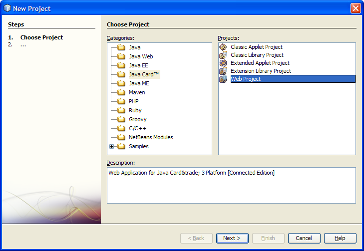
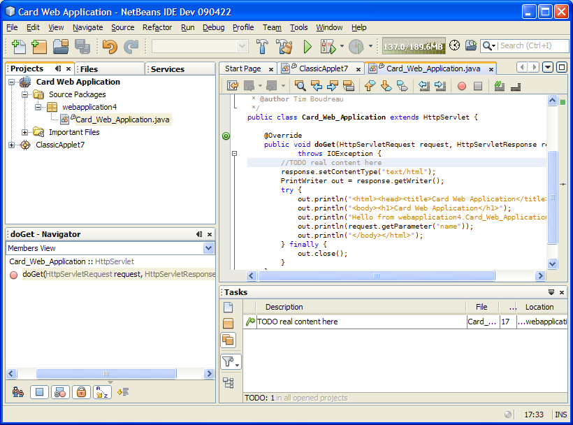
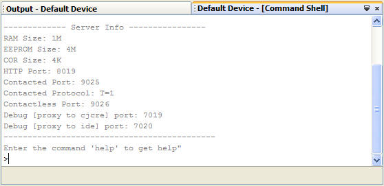
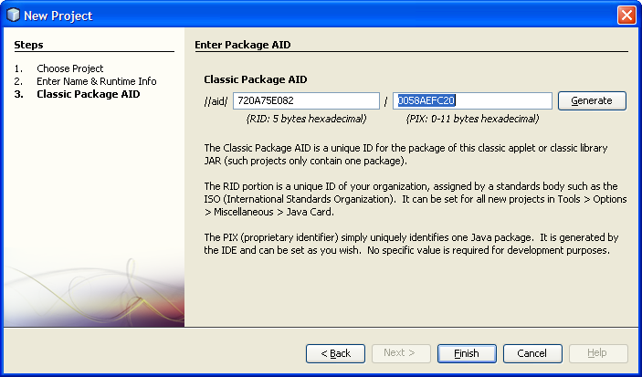

// 
//     Licensed to the Apache Software Foundation (ASF) under one
//     or more contributor license agreements.  See the NOTICE file
//     distributed with this work for additional information
//     regarding copyright ownership.  The ASF licenses this file
//     to you under the Apache License, Version 2.0 (the
//     "License"); you may not use this file except in compliance
//     with the License.  You may obtain a copy of the License at
// 
//       http://www.apache.org/licenses/LICENSE-2.0
// 
//     Unless required by applicable law or agreed to in writing,
//     software distributed under the License is distributed on an
//     "AS IS" BASIS, WITHOUT WARRANTIES OR CONDITIONS OF ANY
//     KIND, either express or implied.  See the License for the
//     specific language governing permissions and limitations
//     under the License.
//

= Java Card Development Quick Start Guide
:jbake-type: tutorial
:jbake-tags: tutorials 
:jbake-status: published
:syntax: true
:icons: font
:source-highlighter: pygments
:toc: left
:toc-title:
:description: Java Card Development Quick Start Guide - Apache NetBeans
:keywords: Apache NetBeans, Tutorials, Java Card Development Quick Start Guide
include::../../../inc/database.adoc[]

image::images/java-smart-card-sm.jpg[]

_Contributed by Tim Boudreau, maintained by Ruth Kusterer_

Java Card is an interesting platform to work with - a JVM that runs on link:{wikipedia}Smart_card[smart cards] and tiny devices that fit in the palm of your hand. As of Java Card 3.0, it comes in two flavors:

*Classic*::: This is the same as earlier versions of Java Card. The platform is extremely limited. For example,  ``java.lang.String``  does not exist, there is no  ``java.lang.Object.hashCode()``  method, and no floating point numbers.
*Extended*::: For newer, more powerful smart cards—this is new in Java Card 3.0. It supports a much more complete implementation of the Java Platform. Probably the coolest thing about it is native support for Servlets—you can actually write a web application using familiar APIs, which runs on a smart card!

== Requirements

*To complete this tutorial, you need the following software and resources:*

image::../../../images_www/articles/69/netbeans-stamp.gif[title="Content on this page applies to the NetBeans IDE 6.8 and 6.9"]

|===
|Software or Resource |Version Required 

|xref:../../../download/index.adoc[+NetBeans IDE+] |6.9 

|link:http://java.sun.com/javacard/downloads/index.jsp[+Java Card SDK+] |3.02 

|Java Card Plugin for NetBeans |1.3 

|link:http://www.oracle.com/technetwork/java/javase/downloads/index.html[+Java Development Kit+] (JDK) |Version 6 
|===

== Getting the Project Environment Set Up

Since a smart card does not have a user interface, you either need a smart card reader to read and write the data on your cards, or use the emulator included in the Java Card Reference Implementation (RI). This tutorial will use the emulator.

NOTE: the Java Card plugin works on any operating system, but the Java Card Reference Implementation emulator is only available for Windows. However, you can set it up as a Java Platform on other operating systems by pointing NetBeans to an installation of the RI on a Windows partition on a Mac or Linux system, but you won't be able to run projects using this setup.

=== Installing Plugins into the NetBeans IDE

1. Download and install NetBeans IDE 6.9.
2. After installation go to the Tools > Plugins menu.
3. Under Available Plugins, there are two Java Card-related plugins: Java Card, and Java Card Runtime Bundle.
* Java Card is the plugin that adds Java Card project support to the NetBeans IDE.
* The Java Card 3.0.2 Runtime Bundle is required only if you do not already have a copy of the Java Card Reference Implementation installed.

image::images/install-javacard-plugins.png[]

[start=4]
. You need to to restart the IDE after installing the plugins to continue the tutorial steps that follow.

=== Registering the Java Card Platform

If you downloaded the Java Card 3.0.2 Runtime Bundle from the Plugin Manager, the Java Card SDK is already set up as a platform for you. However if downloaded and installed the Platform from link:http://java.sun.com/javacard/devkit/[+java.sun.com+] you can use the Tools > Java Platforms menu to add the Java Card Platform to the IDE the same way as registering any Java platform.

image::images/installPlatform.png[]

Once you have set up the Java Card platform it is listed in the Services tab in the IDE. If the Services tab isn't visible, choose Windows > Services from the menu.

image::images/services-tab.png[]

One "platform" may have multiple "devices". You deploy a project to a specific device on a specific platform.

== Understanding Java Card Project Types

Choose File > New Project from the menu, and click the Java Card category. There are several kinds of Java Card projects you can create. All of them are built with link:http://ant.apache.org/[+Apache Ant+], just like NetBeans Java SE projects.

Classic Applet projects create a traditional Java Card applet for smaller devices, just like the applets used in Java Card 2.0 and older. Classic library projects are like Classic Applet projects, without the applet — it's some code that you expect to be on the device, that might be shared between applets.

Extended Applet and Library projects use the extended API in Java Card 3.0—so you can use java.lang.String and so forth. The boot classpath will be different for Classic and Extended projects, so, for example, code completion will not show java.lang.String in Classic projects, but will in Extended projects.

image::images/create-applet-app.png[]

Web Application projects are probably the coolest feature of Java Card 3.0. You get a skeleton project with a Servlet implemented, and you have access to the full Servlet API. This is vastly easier to work with than either of the Applet-style application types—you don't need any special code on the client to interact with an application running on a device, just a web browser! You can test your applications locally using the Reference Implementation and your desktop web browser.

image::images/create-web-app.png[]

== Working With a Project

For this tutorial we create a new Web Project.

In the new web project Enter "Card Web Application" as project name and set the project location to your NetBeansProjects directory. Click Finish and the project appears in the Project tab.

Right-click the project node in the Project tab and choose Properties from the context menu. In the Run section of the Project Properties window, you can change the platform and device that a project deploys to. Click Close to save your changes.

Working on a Java Card web application is just like working on any other web application that you deploy to a servlet container. Press the Run button in the toolbar to run the Hello World sample. When running a Java Card web app, a web browser window will open, showing the servlet's output:  ``Hello from webapplication1.MyServlet`` .

When you run applet-type projects, the NetBeans IDE offers two useful interfaces: command-line output, and the Java Card console. Use the console to interact with the applet: You can send data in hexadecimal and read the replies.

Tip: The RI contains further sample projects that are ready to be opened and run in the NetBeans IDE.

image::images/run-customizer.png[]

== Using Special Plugin Features

Java Card involves two bits of arcana which you don't encounter in other Java platforms:

*Application Identifiers (AID)*:: These are unique identifiers that look like //aid//720A75E082/0058AEFC20. The first part of hexadecimals is a vendor ID (you get one from the link:http://iso.org/[+International Standards Organization (ISO)+]); the second part is a unique value you come up with. AIDs are used to identify applet classes, Java packages (classic applet &amp; classic library projects only), and unique instances of applets (you can deploy the same applet multiple times on one device — the instance AID is used to select which applet to send information to).
*APDU scripts*:: These are scripts to send data to an applet. It involves a somewhat sadistic amount of hand-typed hexadecimal; the script needs to select a specific applet instance, and then send data to it. You can also use the Java Card console in place of sending a pre-written script.

While these two things are somewhat complicated, the NetBeans plug-ins do their best to abstract away the complexities of dealing with them, as follows:

* When you create a project, reasonable values for Applet AID, Classic Package AID, and one Instance AID are automatically generated.

* When you select the Applets tab in the Project Properties dialog, the project scans its classpath for all Java Card applet subclasses it can find:

image::images/customize-applets-pre.png[]

* Once it has found them, the dialog allows you to select what applets are actually deployed, and customize the AID values used, deployment parameters and so forth. The IDE validates all of the data you entered, so that it is hard to enter invalid data:

image::images/customize-applets.png[]

* If you want to deploy two instances of the same applet, you can set that up as well; however, for simple cases where you just want to deploy one applet instance, you don't need to think about it:

image::images/customize-instances.png[]

* For testing running applets, you do not need to hand-write an entire APDU script—you can use the built-in Console to interact with deployed applets directly:

image::images/open-console.png[]

* The "package AID" for Classic projects (they are only allowed to contain one Java package) is also taken care of by the IDE, but is customizable.

* Part of all AID values in your projects will be an ISO-assigned vendor ID (called the RID). For quickly getting started, the IDE will generate a random value for the RID, which is fine for development and testing. If you have an offical RID, you can enter that in Tools > Options and it will be used for all new projects. Click the Generate button in the Project Properties to update the values in existing projects.

image::images/global-rid.png[]

== Integrating Third-Party SDKs

Currently the tools only support the Java Card 3.0.2 Reference Implementation, but they have an extensible API for integrating vendor cards. The platform and device definitions are simply Properties files which are imported by the build script.

Deployment is done through a set of Ant tasks provided by the card vendor. This means that the projects created can be run outside the IDE, there is no lock-in. The sources for the Ant tasks that are part of the Java Card RI can be downloaded from the link:http://kenai.com/projects/javacard[+Java Card project portal+], along with NetBeans-ready sample projects.

Are you a card vendor who has created Java Card deployment tools? Contact plugin author link:mailto:tboudreau@sun.com[+Tim Boudreau+] for details on xref:../../../wiki/JavaCardPlatformIntegration.adoc[+how to integrate your card+]! Integration can be done at several levels, depending on how much support you wish to provide within the IDE for your card.

xref:../../../community/mailing-lists.adoc[Send Us Your Feedback]

== Related Links

* A lot of the credit for these modules goes to link:https://blogs.oracle.com/javacard/[+Anki Nelaturu+] and the rest of the Java Card team.
* link:http://java.sun.com/javacard[+Sun's Official Java Card Portal+] — news, development kits, reference, specifications, FAQ.
* link:http://kenai.com/projects/javacard/pages/Home[+Java Card project portal+] — sources, sample projects, forums, documentation.
* xref:../../../wiki/JavaCardPlatformIntegration.adoc[+Platform Integration for Card vendors+]
* link:http://java.sun.com/developer/technicalArticles/javacard/javacard-servlets/[+Deploying Servlets on Smart Cards: Portable Web Servers with Java Card 3.0+]
