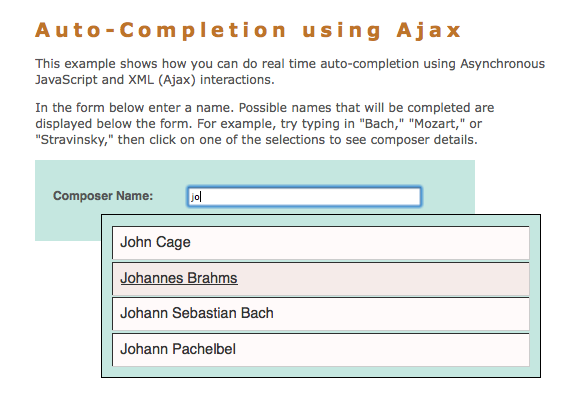
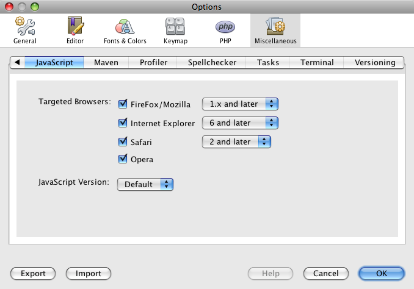
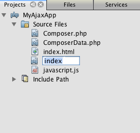

// 
//     Licensed to the Apache Software Foundation (ASF) under one
//     or more contributor license agreements.  See the NOTICE file
//     distributed with this work for additional information
//     regarding copyright ownership.  The ASF licenses this file
//     to you under the Apache License, Version 2.0 (the
//     "License"); you may not use this file except in compliance
//     with the License.  You may obtain a copy of the License at
// 
//       http://www.apache.org/licenses/LICENSE-2.0
// 
//     Unless required by applicable law or agreed to in writing,
//     software distributed under the License is distributed on an
//     "AS IS" BASIS, WITHOUT WARRANTIES OR CONDITIONS OF ANY
//     KIND, either express or implied.  See the License for the
//     specific language governing permissions and limitations
//     under the License.
//

= Introduction to Ajax for PHP Web Applications
:jbake-type: tutorial
:jbake-tags: tutorials 
:jbake-status: published
:syntax: true
:icons: font
:source-highlighter: pygments
:toc: left
:toc-title:
:description: Introduction to Ajax for PHP Web Applications - Apache NetBeans
:keywords: Apache NetBeans, Tutorials, Introduction to Ajax for PHP Web Applications

This document provides an introduction to Ajax and demonstrates some of the features in the NetBeans IDE that allow you to program faster and more efficiently when working with Ajax-related technologies. While learning about the low-level functionality of Ajax, you build a simple application that employs auto-completion in a text field. Content here has been adapted from Greg Murray's article and sample application from link:http://weblogs.java.net/blog/gmurray71/archive/2005/12/using_ajax_with_1.html[+Using Ajax with Java Technology+].

Ajax stands for Asynchronous JavaScript and XML. In essence, Ajax is an efficient way for a web application to handle user interactions with a web page - a way that reduces the need to do a page refresh or full page reload for every user interaction. This enables rich behavior (similar to that of a desktop application or plugin-based web application) using a browser. Ajax interactions are handled asynchronously in the background. As this happens, a user can continue working with the page. Ajax interactions are initiated by JavaScript code. When the Ajax interaction is complete, JavaScript updates the HTML source of the page. The changes are made immediately without requiring a page refresh. Ajax interactions can be used to do things such as validate form entries (while the user is entering them) using server-side logic, retrieve detailed data from the server, dynamically update data on a page, and submit partial forms from the page.

*To complete this tutorial, you need the following software and resources.*

|===
|Software or Resource |Version Required 

|link:http://www.php.net/downloads.php[+PHP engine+] |PHP 5 

|link:http://httpd.apache.org/download.cgi[+Apache web server+] |2.2 
|===

NOTE: PHP development environment is often configured using an *AMP package, depending on your operating system. This includes the PHP engine and Apache web server. For instructions on configuring your environment, see the xref:../php.adoc[+PHP Learning Trail+].

NOTE: This tutorial assumes that you have a working knowledge of the various technologies it employs (i.e., HTML, CSS, JavaScript, and PHP). It attempts to provide an overview of the functionality provided by the code, but _does not_ explain how the code works on a line-to-line basis.

NOTE: If you need to compare your project with a working solution, you can link:https://netbeans.org/projects/samples/downloads/download/Samples%252FPHP%252FMyAjaxApp.zip[+download the sample application+]. Use the IDE's New Project wizard (Ctrl-Shift-N; ⌘-Shift-N on Mac), and select the PHP with Existing Sources project type. In the wizard, point to the downloaded sources on your computer.

[[overview]]
== Overview of the Application

Imagine a web page in which a user can search for information about musical composers. The page includes a field where the user can enter the name of the composer. In the example application, the entry field has an auto-complete feature. In other words, the user can type in part of the composer name, and the web application attempts to complete the name by listing all composers whose first or last name begins with the characters entered. The auto-complete feature saves the user from having to remember the complete name of the composer and can provide a more intuitive and direct path to the sought-after information.

Implementing auto-completion in a search field is something that can be performed using Ajax. Ajax works by employing an `XMLHttpRequest` object to pass requests and responses asynchronously between the client and server. The following diagram illustrates the process flow of the communication that takes place between the client and server.

image::images/ajax-process-flow.png[title="Ajax process flow diagram"]

The process flow of the diagram can be described by the following steps:

1. The user triggers an event, for example by releasing a key when typing in a name. This results in a JavaScript call to a function that initializes an `XMLHttpRequest` object.
2. The `XMLHttpRequest` object is configured with a request parameter that includes the ID of the component that triggered the event, and any value that the user entered. The `XMLHttpRequest` object then makes an asynchronous request to the web server.
3. On the web server, an object such as a servlet or listener handles the request. Data is retrieved from the data store, and a response is prepared containing the data in the form of an XML document.
4. Finally, the `XMLHttpRequest` object receives the XML data using a callback function, processes it, and updates the HTML DOM (Document Object Model) to display the page containing the new data.

This tutorial demonstrates how to construct the auto-complete scenario by following the process flow indicated in the above diagram. You first create the client-side files for the presentation and functionality needed to generate the `XMLHttpRequest` object. Then, you set up the server-side by creating the data store and business logic using PHP-based technology. Finally, you return to the client-side and implement `callback()`, and other JavaScript functionality to update the HTML DOM.

[[client1]]
== Programming the Client-Side: Part 1

Begin by creating a new PHP application project in the IDE.

1. Choose File > New Project. Under Categories, select *PHP*. Under Projects, select *PHP Application* then click *Next*.
2. In Step 2: Name and Location, name the project `MyAjaxApp`. The Sources Folder field enables you to specify the location of the project on your computer. Leave other options at their defaults and click *Next*. 

image::images/php-name-location.png[title="New PHP Project wizard - Name and Location panel"]

. In Step 3: Run Configuration, specify how you want to deploy your application. If you have set up your PHP development environment by configuring an *AMP package, you should select *Local Web Site* from the drop-down list, and specify the URL of the project, as it will appear in a browser.
. Select the Copy files from Sources Folder to another location option. Then, in the Copy to Folder field, type in the path to the deployment location on the server. (On Apache, this is the default `htdocs` directory.) 

[.feature]
--

image::images/php-run-config.png[role="left", link="images/php-run-config.png"]

--

. Click *Finish*. The IDE creates the project folder in your file system and the project opens in the IDE. 

You can also use the Project wizard to add  framework support to your project (provided in Step 4 of the wizard).

A default `index.php` index page is generated and opens in the IDE's editor. Also, your project appears in the Projects window.

image::images/php-proj-win.png[title="Projects window displays MyAjaxApp project"]

. Before beginning to code, quickly try running the application to ensure that configuration between the IDE, your server, and browser is set up properly. 

In the IDE's editor, add an `echo` statement to the index page:

[source,php]
----

<?php
    // put your code here
    *echo "<h2>Hello World!</h2>";*
?>

----

. In the Projects window, right-click on the project node and choose Run. The IDE opens your default browser and displays the Hello World message you just created in `index.php`. 

NOTE: If you have difficulty setting up your project or establishing communication between the IDE, the server and browser, see xref:project-setup.adoc[+Setting Up a PHP Project+] for a more thorough description. The xref:../php.adoc[+PHP Learning Trail+] can provide more information on configuring your environment.

[[html]]
=== Using the HTML Editor

image::images/palette.png[title="Palette displaying HTML elements"] 

Now that you are certain your environment is set up correctly, begin by developing the auto-complete interface that will be viewed by users. Because the index page that we'll create does not require any server-side scripting elements, start by creating an HTML page and setting it as the entry point for the application.

One of the advantages of using an IDE is that the editor you work in often provides you with code completion which, if you learn to apply it when you code, can rapidly increase your productivity. The IDE's editor generally adapts to the technology you are using, so if you are working in an HTML page, pressing the code completion key combination (Ctrl-Space) will produce suggestions for HTML tags and attributes. As will later be shown, the same applies for other technologies, such as CSS and JavaScript.

A second feature you can make use of is the IDE's Palette. The Palette provides easy-to-use templates for elements that are commonly applied in the technology you are coding in. You simply click on an item, and drag it to a location in the file open in the Source Editor.

You can view large icons (as displayed here) by right-clicking in the Palette and choosing Show Big Icons.

1. In the Projects window, right-click the `MyAjaxApp` project node and choose New > HTML File.
2. In the HTML File wizard, name the file `index`, then click *Finish*. The new `index.html` file opens in the editor.
3. Replace the existing content for the file as follows.

[source,html]
----

<!DOCTYPE HTML PUBLIC "-//W3C//DTD HTML 4.01 Transitional//EN"
    "http://www.w3.org/TR/html4/loose.dtd">

<html>
    <head>
        <meta http-equiv="Content-Type" content="text/html; charset=UTF-8">
        <title>Auto-Completion using AJAX</title>
    </head>
    <body>
        <h1>Auto-Completion using AJAX</h1>
    </body>
</html>

----

. Add some explanatory text to describe the purpose of the text field. You can copy and paste in the following text at a point just beneath the `<h1>` tags:

[source,html]
----

This example shows how you can do real time auto-completion using Asynchronous
    JavaScript and XML (Ajax) interactions.

In the form below enter a name. Possible names that will be completed are displayed
    below the form. For example, try typing in "Bach," "Mozart," or "Stravinsky,"
    then click on one of the selections to see composer details.

----

. Add an HTML form to the page. You can do this by making use of the elements listed in the IDE's Palette. If the Palette is not open, choose Window > Palette from the main menu. Then, under HTML Forms, click on and drag a Form element into the page to a point beneath the `
` tags that you just added. The Insert Form dialog box opens. Specify the following: 

* Action: autocomplete.php
* Method: GET
* Name: autofillform

image::images/php-insert-form.png[title="Insert form dialog"]

Click OK. The HTML `<form>` tags are inserted into the page containing the attributes you specified. (GET is applied by default, and so is not explicitly declared.)

. Add an HTML table to the page. Under the HTML category in the Palette, click on a Table element and drag it to a point between the `<form>` tags. The Insert Table dialog box opens. Specify the following: 

* Rows: 2
* Columns: 2
* Border Size: 0
* Width: 0
* Cell Spacing: 0
* Cell Padding: 5

image::images/insert-table.png[title="Insert table dialog"]

. Right-click inside the Source Editor and choose Format. This tidies up the code. Your form should now display similar to that below:

[source,html]
----

<form name="autofillform" action="autocomplete.php">
  <table border="0" cellpadding="5">
    <thead>
      <tr>
        <th></th>
        <th></th>
      </tr>
    </thead>
    <tbody>
      <tr>
        <td></td>
        <td></td>
      </tr>
      <tr>
        <td></td>
        <td></td>
      </tr>
    </tbody>
  </table>
</form>

----

. Within the first row of the table, type the following text into the first column (changes in *bold*):

[source,html]
----

<td>*<strong>Composer Name:</strong>*</td>
----

. Within the second column of the first row, instead of dragging a Text Input field from the Palette, type in the code below manually.

[source,html]
----

<input type="text"
    size="40"
    id="complete-field"
    onkeyup="doCompletion();">

----
When you type, try using the IDE's built-in code completion support. For example, type in `<i`, then press Ctrl-Space. A list of suggested options displays below your cursor, and a description of the selected element appears in a box above. You can in fact press Ctrl-Space at anytime you are coding in the Source Editor to bring up possible options. Also, if there is only one possible option, pressing Ctrl-Space will automatically complete the element name. 
image:images/code-completion.png[title="Ctrl-Space triggers code completion in the Source Editor"] 
The `onkeyup` attribute that you typed in above points to a JavaScript function named `doCompletion()`. This function is called each time a key is pressed in the form text field, and maps to the JavaScript call depicted in the Ajax <<flow-diagram,flow diagram>> above.

. Before moving on to work in the JavaScript editor, make the new `index.html` file replace the `index.php` file as the entry point for the application. 

To do so, right-click the project node in the Projects window and choose Properties. Select the *Run Configuration* category, then enter `index.html` in the Index File field. image:images/php-entry-point.png[title="Specify the application's entry point in the Project Properties window"]

. Click OK to save changes and exit the Project Properties window.

. Run the project to see what it looks like in a browser. Click the Run Project (  ) button. The `index.html` file displays in your default browser. 
image:images/index-page.png[title="Run project to view its current state in browser"]

[[javascript]]
=== Using the JavaScript Editor

The IDE's JavaScript Editor provides many advanced editing capabilities, such as intelligent code completion, semantic highlighting, instant renaming and refactoring capabilities, as well as many more features. For more information on the JavaScript editing features in the IDE, see link:http://docs.oracle.com/cd/E50453_01/doc.80/e50452/dev_html_apps.htm#BACFIFIG[+Creating JavaScript Files+] in the link:http://www.oracle.com/pls/topic/lookup?ctx=nb8000&id=NBDAG[+Developing Applications with NetBeans IDE User's Guide+]. See link:http://wiki.netbeans.org/JavaScript[+http://wiki.netbeans.org/JavaScript+] for a detailed specification.

JavaScript code completion is automatically provided when you code in `.js` files, as well as within `

----

You can quickly toggle between pages opened in the editor by pressing Ctrl-Tab.

. Insert a call to `init()` in the opening `<body>` tag.

[source,html]
----

<body *onload="init()"*>

----
This ensures that `init()` is called each time the page is loaded.

The role of `doCompletion()` is to:

* create a URL that contains data that can be utilized by the server-side,
* initialize an `XMLHttpRequest` object, and
* prompt the `XMLHttpRequest` object to send an asynchronous request to the server.

The `XMLHttpRequest` object is at the heart of Ajax and has become the de facto standard for enabling XML data to be passed asynchronously over HTTP. _Asynchronous_ interaction implies that the browser can continue to process events in the page after the request is sent. Data is passed in the background, and can be automatically loaded into the page without requiring a page refresh.

Notice that the `XMLHttpRequest` object is actually created by `initRequest()`, which is called by `doCompletion()`. The function checks whether `XMLHttpRequest` can be understood by the browser, and if so it creates an `XMLHttpRequest` object. Otherwise, it performs a check on `ActiveXObject` (the `XMLHttpRequest` equivalent for Internet Explorer 6), and creates an `ActiveXObject` if identified.

Three parameters are specified when you create an `XMLHttpRequest` object: a URL, the HTTP method (`GET` or `POST`), and whether or not the interaction is asynchronous. In the above example, the parameters are:

* The URL `autocomplete.php`, and the text entered into the `complete-field` by the user:

[source,php]
----

var url = "autocomplete.php?action=complete&amp;id=" + escape(completeField.value);
----
* `GET`, signifying that HTTP interactions use the `GET` method, and
* `true`, signifying that the interaction is asynchronous:

[source,php]
----

req.open("GET", url, true);
----

If the interaction is set as asynchronous, a callback function must be specified. The callback function for this interaction is set with the statement:

[source,php]
----

req.onreadystatechange = callback;
----

and a `callback()` function <<callback,must later be defined>>. The HTTP interaction begins when `XMLHttpRequest.send()` is called. This action maps to the HTTP request that is sent to the web server in the above <<flow-diagram,flow diagram>>.

[[serverside]]
== Programming the Server-Side

The NetBeans IDE provides comprehensive support for web development using PHP. You can set up your development environment using an *AMP package, enabling you to edit and deploy from the IDE quickly and efficiently. The IDE allows you to configure your environment with a local server, as well as remotely, using FTP or SFTP. You can also configure an external debugger, such as link:http://xdebug.org/[+Xdebug+], and set up unit testing with link:http://www.phpunit.de/[+PHPUnit+] from the IDE's PHP Options window (Choose Tools > Options; NetBeans > Preferences on Mac, then select the PHP tab.) The PHP editor provides standard editing features such as code completion, syntax highlighting, mark occurrences, refactoring, code templates, documentation pop-up, code navigation, editor warnings and, for NetBeans 6.9, error badges for malformed syntax. See the xref:../intro-screencasts.adoc[+NetBeans Video Tutorials and Demos+] page for screencasts on PHP support.

For applications requiring a database, the IDE supports wide-ranging support for most main-stream databases, especially MySQL. See the xref:../../articles/mysql.adoc[+NetBeans MySQL screencast+] and xref:../../../features/ide/database.adoc[+Database Integration+] features for more details.

The business logic for the auto-complete application that you are building needs to process requests by retrieving data from the data store, then prepare and send the response. This is implemented here using a PHP file named `autocomplete`. Before you begin coding the file, set up the data store and the functionality required by the file to access data.

* <<data,Creating the Data Store>>
* <<business,Creating the Business Logic>>

[[data]]
=== Creating the Data Store

For this simple application, you create a class called `Composer` that enables the business logic to retrieve data from entries contained in a `composers` array. You then create a class called `ComposerData` that retains composer data using the array.

1. Right-click the `MyAjaxApp` project node in the Projects window and choose New > PHP Class.
2. Name the class `Composer`, and click Finish. The class is created and opens in the editor.
3. Paste in the following code within the class (changes in *bold*).

[source,php]
----

<?php

class Composer {

    *public $id;
    public $firstName;
    public $lastName;
    public $category;

    function __construct($id, $firstName, $lastName, $category) {
        $this->id = $id;
        $this->firstName = $firstName;
        $this->lastName = $lastName;
        $this->category = $category;
    }*
}

?>
----

Create the `ComposerData` class.

1. Right-click the `MyAjaxApp` project node in the Projects window and choose New > PHP Class.
2. Name the class `ComposerData`, and click Finish. The class is created and opens in the IDE's editor.
3. Add a `require` statement to the top of the class to specify that the class requires the `Composer.php` class that you just created (changes in *bold*).

[source,php]
----

<?php

*require "Composer.php";*

class ComposerData {

}
----

. In the editor, paste in the following code within the class (changes in *bold*).

[source,php]
----

<?php

require "Composer.php";

class ComposerData {

    *public $composers;

    function __construct() {
        $this->composers = array(
            new Composer("1", "Johann Sebastian", "Bach", "Baroque"),
            new Composer("2", "Arcangelo", "Corelli", "Baroque"),
            new Composer("3", "George Frideric", "Handel", "Baroque"),
            new Composer("4", "Henry", "Purcell", "Baroque"),
            new Composer("5", "Jean-Philippe", "Rameau", "Baroque"),
            new Composer("6", "Domenico", "Scarlatti", "Baroque"),
            new Composer("7", "Antonio", "Vivaldi", "Baroque"),

            new Composer("8", "Ludwig van", "Beethoven", "Classical"),
            new Composer("9", "Johannes", "Brahms", "Classical"),
            new Composer("10", "Francesco", "Cavalli", "Classical"),
            new Composer("11", "Fryderyk Franciszek", "Chopin", "Classical"),
            new Composer("12", "Antonin", "Dvorak", "Classical"),
            new Composer("13", "Franz Joseph", "Haydn", "Classical"),
            new Composer("14", "Gustav", "Mahler", "Classical"),
            new Composer("15", "Wolfgang Amadeus", "Mozart", "Classical"),
            new Composer("16", "Johann", "Pachelbel", "Classical"),
            new Composer("17", "Gioachino", "Rossini", "Classical"),
            new Composer("18", "Dmitry", "Shostakovich", "Classical"),
            new Composer("19", "Richard", "Wagner", "Classical"),

            new Composer("20", "Louis-Hector", "Berlioz", "Romantic"),
            new Composer("21", "Georges", "Bizet", "Romantic"),
            new Composer("22", "Cesar", "Cui", "Romantic"),
            new Composer("23", "Claude", "Debussy", "Romantic"),
            new Composer("24", "Edward", "Elgar", "Romantic"),
            new Composer("25", "Gabriel", "Faure", "Romantic"),
            new Composer("26", "Cesar", "Franck", "Romantic"),
            new Composer("27", "Edvard", "Grieg", "Romantic"),
            new Composer("28", "Nikolay", "Rimsky-Korsakov", "Romantic"),
            new Composer("29", "Franz Joseph", "Liszt", "Romantic"),

            new Composer("30", "Felix", "Mendelssohn", "Romantic"),
            new Composer("31", "Giacomo", "Puccini", "Romantic"),
            new Composer("32", "Sergei", "Rachmaninoff", "Romantic"),
            new Composer("33", "Camille", "Saint-Saens", "Romantic"),
            new Composer("34", "Franz", "Schubert", "Romantic"),
            new Composer("35", "Robert", "Schumann", "Romantic"),
            new Composer("36", "Jean", "Sibelius", "Romantic"),
            new Composer("37", "Bedrich", "Smetana", "Romantic"),
            new Composer("38", "Richard", "Strauss", "Romantic"),
            new Composer("39", "Pyotr Il'yich", "Tchaikovsky", "Romantic"),
            new Composer("40", "Guiseppe", "Verdi", "Romantic"),

            new Composer("41", "Bela", "Bartok", "Post-Romantic"),
            new Composer("42", "Leonard", "Bernstein", "Post-Romantic"),
            new Composer("43", "Benjamin", "Britten", "Post-Romantic"),
            new Composer("44", "John", "Cage", "Post-Romantic"),
            new Composer("45", "Aaron", "Copland", "Post-Romantic"),
            new Composer("46", "George", "Gershwin", "Post-Romantic"),
            new Composer("47", "Sergey", "Prokofiev", "Post-Romantic"),
            new Composer("48", "Maurice", "Ravel", "Post-Romantic"),
            new Composer("49", "Igor", "Stravinsky", "Post-Romantic"),
            new Composer("50", "Carl", "Orff", "Post-Romantic"),
        );
    }*
}

?>

----

[[business]]
=== Creating the Business Logic

Implement the logic to handle the `autocomplete` URL that is received by the incoming request. Instead of creating a new PHP file using the File wizard as demonstrated in the previous section, modify the existing `index.php` file for this purpose.

1. In the Projects window, click the `index.php` file node. The file name becomes editable, enabling you to modify the name. 

. Name the file `autocomplete`, then click Enter. Double-click the new `autocomplete.php` file to have it display in the editor.

. Replace the file's existing code with the following script.

[source,php]
----

<?php

require_once("ComposerData.php");

session_start();

$composerData = new ComposerData();
$composers = $composerData->composers;

$results = array();
$namesAdded = false;

// simple matching for start of first or last name, or both
if(isset($_GET['action']) &amp;&amp; $_GET['action'] == "complete") {
    foreach($composers as $composer) {
        if(!is_numeric($_GET['id']) &amp;&amp;

            // if id matches first name
            (stripos($composer->firstName, $_GET['id']) === 0 ||

            // if id matches last name
            stripos($composer->lastName, $_GET['id']) === 0) ||

            // if id matches full name
            stripos($composer->firstName." ".$composer->lastName, $_GET['id']) === 0) {

                $results[] = $composer;
        }
    }

    // prepare xml data
    if(sizeof($results) != 0) {
        header('Content-type: text/xml');
        echo "<composers>";
        foreach($results as $result) {
            echo "<composer>";
            echo "<id>" . $result->id . "</id>";
            echo "<firstName>" . $result->firstName . "</firstName>";
            echo "<lastName>" . $result->lastName . "</lastName>";
            echo "</composer>";
        }
        echo "</composers>";
    }
}

// if user chooses from pop-up box
if(isset($_GET['action']) &amp;&amp; isset($_GET['id']) &amp;&amp; $_GET['action'] == "lookup") {
    foreach($composers as $composer) {
        if($composer->id == $_GET['id']) {
            $_SESSION ["id"] = $composer->id;
            $_SESSION ["firstName"] = $composer->firstName;
            $_SESSION ["lastName"] = $composer->lastName;
            $_SESSION ["category"] = $composer->category;

            header("Location: composerView.php");
        }
    }
}

?>
----

*Note: * The file composerView.php is not described in this tutorial. You may create such a file to see the final result of the search. A sample of the file is included in the link:https://netbeans.org/projects/samples/downloads/download/Samples%252FPHP%252FMyAjaxApp.zip[+sample application+].

As you can see, there is nothing really new you need to learn to write server-side code for Ajax processing. The response content type needs to be set to `text/xml` for cases where you want to exchange XML documents. With Ajax, you can also exchange plain text or even snippets of JavaScript which may be evaluated or executed by the callback function on the client. Note too that some browsers might cache the results, and so it may be necessary to set the Cache-Control HTTP header to `no-cache`.

In this example, the `autocomplete.php` file generates an XML document that contains all composers with a first or last name beginning with the characters typed in by the user. This document maps to the XML Data depicted in the <<flow-diagram,flow diagram>> above. Here is an example of an XML document that is returned to the `XMLHttpRequest` object:

[source,xml]
----

<composers>
    <composer>
        <id>12</id>
        <firstName>Antonin</firstName>
        <lastName>Dvorak</lastName>
    </composer>
    <composer>
        <id>45</id>
        <firstName>Aaron</firstName>
        <lastName>Copland</lastName>
    </composer>
    <composer>
        <id>7</id>
        <firstName>Antonio</firstName>
        <lastName>Vivaldi</lastName>
    </composer>
    <composer>
        <id>2</id>
        <firstName>Arcangelo</firstName>
        <lastName>Corelli</lastName>
    </composer>
</composers>

----

[[client2]]
== Programming the Client-Side: Part 2

You must define the callback function to handle the server's response, and add any functionality necessary to reflect changes in the page that is viewed by the user. This requires modifying the HTML DOM. Finally, you can work in the IDE's CSS Editor to add a simple stylesheet to the presentation.

* <<callback,Adding Callback Functionality>>
* <<htmldom,Updating the HTML DOM>>
* <<stylesheet,Attaching a Stylesheet>>

[[callback]]
=== Adding Callback Functionality

The callback function is called asynchronously at specific points during HTTP interaction when the `readyState` property of the `XMLHttpRequest` object changes. In the application you are building, the callback function is `callback()`. You recall that in `doCompletion()`, `callback` was set as the `XMLHttpRequest.onreadystatechange` property to a function. Now, implement the callback function as follows.

1. Open `javascript.js` in the editor and type in the code below.

[source,java]
----

function callback() {
    if (req.readyState == 4) {
        if (req.status == 200) {
            parseMessages(req.responseXML);
        }
    }
}

----

A `readyState` of "4" signifies the completion of the HTTP interaction. The API for `XMLHttpRequest.readState` indicates that there are 5 possible values that can be set. These are:

|===
|`readyState` Value |Object Status Definition 

|0 |uninitialized 

|1 |loading 

|2 |loaded 

|3 |interactive 

|4 |complete 
|===

Notice that the `parseMessages()` function is called only when the `XMLHttpRequest.readyState` is "4" and the `status` -- the HTTP status code definition of the request -- is "200", signifying a success. You will define `parseMessages()` next in <<htmldom,Updating the HTML DOM>>.

[[htmldom]]
=== Updating the HTML DOM

The `parseMessages()` function handles the incoming XML data. In doing so, it relies on several ancillary functions, such as `appendComposer()`, `getElementY()`, and `clearTable()`. You must also introduce new elements to the index page, such as a second HTML table which serves as the auto-complete box, and ID's for elements so they can be referenced in `javascript.js`. Finally, you create new variables corresponding to ID's for elements in `index.php`, initialize them in the `init()` function that you previously implemented, and add some functionality that is needed each time `index.php` is loaded.

NOTE: The functions and elements that you create in the following steps work interdependently. It is recommended that you work through this section, then examine the code once it is all in place.

1. Open `index.html` in the editor and type in the below code for the second row of the HTML table you previously created.

[source,xml]
----

<tr>
    *<td id="auto-row" colspan="2">

    <td/>*
</tr>
----
This new row, which can be identified as '`auto-row`', serves as a handle for the JavaScript code in order to insert a new HTML table that will form the auto-complete box.

. Open `javascript.js` in the editor and the following three variables to the top of the file.

[source,java]
----

var completeField;
var completeTable;
var autoRow;
----

. Add the following lines (in *bold*) to the `init()` function.

[source,java]
----

function init() {
    completeField = document.getElementById("complete-field");
    *completeTable = document.createElement("table");
    completeTable.setAttribute("class", "popupBox");
    completeTable.setAttribute("style", "display: none");
    autoRow = document.getElementById("auto-row");
    autoRow.appendChild(completeTable);
    completeTable.style.top = getElementY(autoRow) + "px";*
}
----
One purpose of `init()` is to make elements inside `index.html` accessible to other functions that will modify the index page's DOM. Above, the script creates a new HTML `table`, adds the `popupBox` class and modifies the element's style to `display: none`. Finally, it gets the element whose `id` is `auto-row` and inserts the new `table` into it. In other words, the modified HTML looks as follows when the code is run.

[source,xml]
----

<tr>
    <td id="auto-row" colspan="2">
        *<table class="popupBox" style="display: none"></table>*
    <td/>
</tr>
----

. Add `appendComposer()` to `javascript.js`.

[source,java]
----

function appendComposer(firstName,lastName,composerId) {

    var row;
    var cell;
    var linkElement;

    if (isIE) {
        completeTable.style.display = 'block';
        row = completeTable.insertRow(completeTable.rows.length);
        cell = row.insertCell(0);
    } else {
        completeTable.style.display = 'table';
        row = document.createElement("tr");
        cell = document.createElement("td");
        row.appendChild(cell);
        completeTable.appendChild(row);
    }

    cell.className = "popupCell";

    linkElement = document.createElement("a");
    linkElement.className = "popupItem";
    linkElement.setAttribute("href", "autocomplete.php?action=lookup&amp;id=" + composerId);
    linkElement.appendChild(document.createTextNode(firstName + " " + lastName));
    cell.appendChild(linkElement);
}
----
This function creates a new table row, inserts a link to a composer into it using the data passed to the function via its three parameters, and inserts the row into the index page's `complete-table` element.

. Add `clearTable()` to `javascript.js`.

[source,java]
----

function clearTable() {
    if (completeTable.getElementsByTagName("tr").length > 0) {
        completeTable.style.display = 'none';
        for (loop = completeTable.childNodes.length -1; loop >= 0 ; loop--) {
            completeTable.removeChild(completeTable.childNodes[loop]);
        }
    }
}
----
This function sets the display of the `complete-table` element to 'none', (i.e., makes it invisible), and it removes any existing composer name entries that were created.

. Add `getElementY()` to `javascript.js`.

[source,java]
----

function getElementY(element){

    var targetTop = 0;

    if (element.offsetParent) {
        while (element.offsetParent) {
            targetTop += element.offsetTop;
            element = element.offsetParent;
        }
    } else if (element.y) {
        targetTop += element.y;
    }
    return targetTop;
}
----
This function is applied to find the vertical position of the parent element. This is necessary because the actual position of the element, when it is displayed, is often dependent on browser type and version. Note that the `complete-table` element, when displayed containing composer names, is shifted to the lower right of the table in which it exists. The correct height positioning is determined by `getElementY()`. 

NOTE: See link:http://www.quirksmode.org/js/findpos.html[+this explanation+] of `offset` on link:http://www.quirksmode.org/[+http://www.quirksmode.org/+].

. Modify the `callback()` function to call `clearTable()` each time new data is received from the server. Any composer entries that already exist in the auto-complete box are therefore removed before it becomes populated with new entries.

[source,java]
----

function callback() {

    *clearTable();*

    if (req.readyState == 4) {
        if (req.status == 200) {
            parseMessages(req.responseXML);
        }
    }
}
----

. Add `parseMessages()` to `javascript.js`.

[source,java]
----

function parseMessages(responseXML) {

    // no matches returned
    if (responseXML == null) {
        return false;
    } else {

        var composers = responseXML.getElementsByTagName("composers")[0];

        if (composers.childNodes.length > 0) {
            completeTable.setAttribute("bordercolor", "black");
            completeTable.setAttribute("border", "1");

            for (loop = 0; loop < composers.childNodes.length; loop++) {
                var composer = composers.childNodes[loop];
                var firstName = composer.getElementsByTagName("firstName")[0];
                var lastName = composer.getElementsByTagName("lastName")[0];
                var composerId = composer.getElementsByTagName("id")[0];
                appendComposer(firstName.childNodes[0].nodeValue,
                    lastName.childNodes[0].nodeValue,
                    composerId.childNodes[0].nodeValue);
            }
        }
    }
}
----

The `parseMessages()` function receives as a parameter an object representation of the XML document returned by the `autocomplete.php` file. The function programmatically traverses the XML document, extracting the `firstName`, `lastName`, and `id` of each entry, then passes this data to `appendComposer()`. This results in a dynamic update to the contents of the `complete-table` element. For example, an entry that is generated and inserted into `complete-table` might look as follows:

[source,xml]
----

<tr>
    <td class="popupCell">
        <a class="popupItem" href="autocomplete?action=lookup&amp;id=12">Antonin Dvorak</a>
    </td>
</tr>

----

The dynamic update to the `complete-table` element represents the final step of the process flow of communication that takes place during communication using Ajax. This update maps to the HTML &amp; CSS data being sent to the presentation in the <<flow-diagram,flow diagram>> above.

[[stylesheet]]
=== Attaching a Stylesheet

At this stage, you have completed all the code needed for the functionality of the application. To see the results of your efforts, try running the application now.

1. Run the project to see what it looks like in a browser. Click the Run Project (  ) button. The `index.html` file displays in your browser. 
image:images/no-css.png[title="Successful deployment without stylesheet"]

To attach a stylesheet to your application, simply create a CSS (Cascading Style Sheets) file and link to it from your presentation page(s). When you work in CSS files, the IDE provides you with code completion support, as well as several other features that can aid in producing stylesheet rules. These include:

* *CSS Style Builder:* An interface designed to enable you to create rules using a selection of controls and widgets. (Window > Other > CSS Style Builder)
* *CSS Preview:* A preview window which, when you place your cursor within a rule, displays sample text rendered according to the declaration block of that rule. (Window > Other > CSS Preview)
* *Style Rule Editor:* A dialog enabling you to create rules based on classes, ID's and HTML elements, and set their position in the document hierarchy. (Create Rule ( image:images/style-rule-editor-btn.png[] ) button, located in upper-left region of CSS editor toolbar)

NetBeans 6.9 provides Rename Refactoring and Find Usages support. This support is available not only in css files, but in all files containing embedded CSS code (e.g., HTML, PHP). CSS classes, id's and type elements can be refactored in all project files. To make use of this refactoring support, press Ctrl-R on a given CSS element and use the provided dialog to perform the rename action. You can also preview changes before performing the rename action. To utilize Find Usages support, right-click a CSS element and choose Find Usages. See link:http://wiki.netbeans.org/wiki/index.php?title=NewAndNoteworthy69m1&section=T-25#Web_Languages[+NewAndNoteworthy69m1+] for more details.

Perform the following steps to attach a stylesheet to your application.

1. In the Projects window, right-click on the project node and choose New > Cascading Style Sheet (If Cascading Style Sheet is not listed, choose Other. Then choose Cascading Style Sheet from the Other category in the New File wizard.)
2. In the CSS File Name text field, type in `stylesheet`.
3. Click Finish. The new file is added to the Projects window, and opens in the IDE's editor.
4. In `stylesheet.css`, type in the following rules. You can make use of the IDE's code completion support by pressing Ctrl-Space at points when you want to call up suggestions.

[source,java]
----

body {
   font-family: sans-serif;
   font-size: smaller;
   padding: 50px;
   color: #555;
   width: 650px;
}

h1 {
   letter-spacing: 6px;
   font-size: 1.6em;
   color: #be7429;
   font-weight: bold;
}

h2 {
   text-align: left;
   letter-spacing: 6px;
   font-size: 1.4em;
   color: #be7429;
   font-weight: normal;
   width: 450px;
}

table {
   width: 550px;
   padding: 10px;
   background-color: #c5e7e0;
}

td {
   padding: 10px;
}

a {
  color: #be7429;
  text-decoration: none;
}

a:hover {
  text-decoration: underline;
}

.popupBox {
  position: absolute;
  top: 170px;
  left: 140px;
}

.popupCell {
   background-color: #fffafa;
}

.popupCell:hover {
  background-color: #f5ebe9;
}

.popupItem {
  color: #333;
  text-decoration: none;
  font-size: 1.2em;
}
----

Perform a check on the validity of your CSS code by right-clicking in the CSS Editor and choosing Check CSS. Any errors encountered are displayed in the Output window (Windows > Output).

. Switch to the `index.html` page in the editor (press Ctrl-Tab), and add a reference to the stylesheet between the `<head>` tags.

[source,java]
----

<link rel="stylesheet" type="text/css" href="stylesheet.css">

----

. Run the application again. The index page displays in the browser using the stylesheet you just created. Each time you type in a character, an asynchronous request is sent to the server, and returned with XML data that has been prepared by `autocomplete.php`. As you enter more characters, the number of composer names decreases to reflect the new list of matches.

[[conclusion]]
== Conclusion

This concludes the Introduction to Ajax. Hopefully by now you realize that Ajax is simply exchanging information over HTTP in the background, and updating that page dynamically based on the results.

You may note that the application you built has numerous shortcomings, for example, nothing happens when a composer name is selected from the auto-complete box! You are welcome to link:https://netbeans.org/projects/samples/downloads/download/Samples%252FPHP%252FMyAjaxApp.zip[+download the sample application+] to see how this can be implemented using PHP technology. Furthermore, you might want to investigate validation that prevents a user from requesting a name that does not exist in the data store. 
