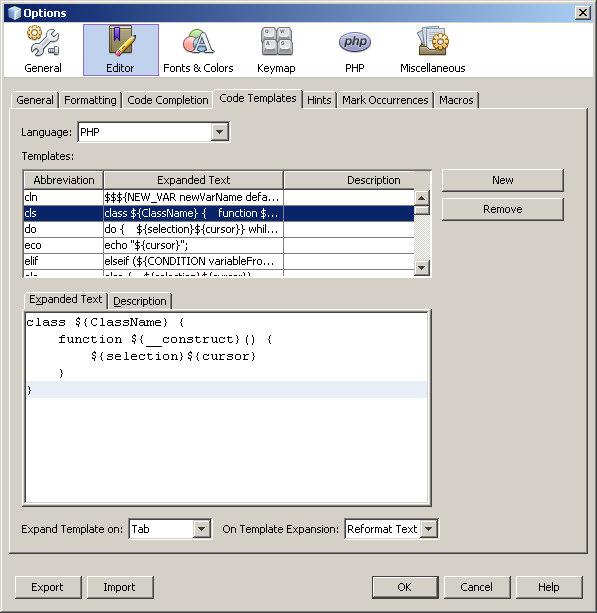
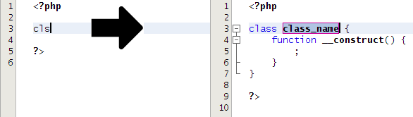
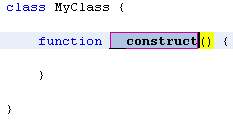
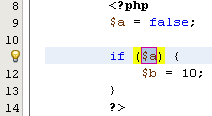
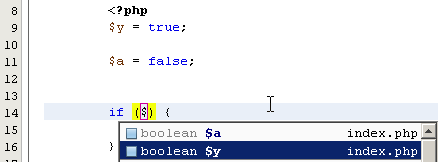
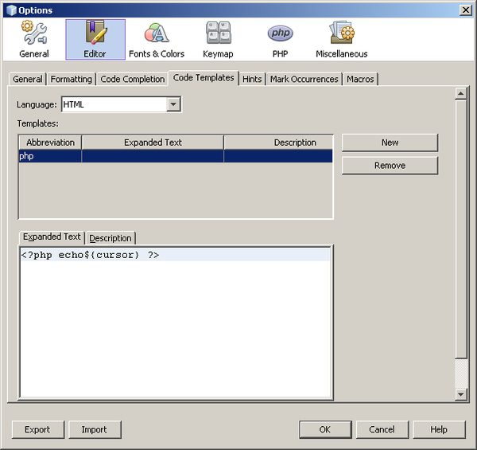

// 
//     Licensed to the Apache Software Foundation (ASF) under one
//     or more contributor license agreements.  See the NOTICE file
//     distributed with this work for additional information
//     regarding copyright ownership.  The ASF licenses this file
//     to you under the Apache License, Version 2.0 (the
//     "License"); you may not use this file except in compliance
//     with the License.  You may obtain a copy of the License at
// 
//       http://www.apache.org/licenses/LICENSE-2.0
// 
//     Unless required by applicable law or agreed to in writing,
//     software distributed under the License is distributed on an
//     "AS IS" BASIS, WITHOUT WARRANTIES OR CONDITIONS OF ANY
//     KIND, either express or implied.  See the License for the
//     specific language governing permissions and limitations
//     under the License.
//

= Modelos de Código no NetBeans IDE para PHP
:jbake-type: tutorial
:jbake-tags: tutorials 
:jbake-status: published
:icons: font
:syntax: true
:source-highlighter: pygments
:toc: left
:toc-title:
:description: Modelos de Código no NetBeans IDE para PHP - Apache NetBeans
:keywords: Apache NetBeans, Tutorials, Modelos de Código no NetBeans IDE para PHP

Os modelos de código são snippets pré-escritos de código fornecidos pelo NetBeans IDE. Você pode colar um snippet no código utilizando a funcionalidade autocompletar código ou a abreviação do modelo seguida da tecla Tab. Você também pode incluir o código entre snippets apropriados de PHP. Finalmente, você pode definir seus próprios modelos de código. Este tutorial mostra como utilizar os modelos de código e sugere casos úteis para definição de seus próprios modelos de código.

*Para concluir este tutorial, você precisa dos seguintes recursos e softwares.*

|===
|Software ou Recurso |Versão Necessária 

|link:https://netbeans.org/downloads/index.html[+NetBeans IDE+] |Pacote de download do PHP 

|link:http://www.oracle.com/technetwork/java/javase/downloads/index.html[+JDK (Java Development Kit)+] |7 ou 8 
|===

 

== Modelos de Código PHP Definidos

Para exibir os modelos de código definidos no NetBeans, abra Ferramentas > Opções (NetBeans > Preferências no Mac), selecione as funcionalidades do Editor e selecione a guia Modelos de Código. Para ver os modelos de código PHP, selecione PHP na lista drop-down Linguagens. Uma tabela de abreviações e textos expandidos de modelos de códigos será exibida. Se selecionar um modelo de código na tabela, o seu texto expandido será exibido na guia Texto Expandido.

Nesta imagem, o novo modelo de código classe ( ``cls)``  está selecionado e na guia Texto Expandido você vê como fica o modelo quando está expandido. Na próxima seção, você usa a função Tab para expandir este modelo no código.

NOTE:  a sintaxe do novo modelo de código classe ( ``cls`` ) é explorada na seção <<syntax,Sintaxe do Modelo de Código PHP>>.

== Usando Modelos de Código PHP

Há três formas de inserir modelos de código no código PHP. Cada forma de inserção de modelos de código tem sua utilidade, dependendo do caso. As três formas de inserir modelos de código são:

* <<expand-with-abb,Expanda o modelo>> utilizando a abreviação do modelo seguida da tecla Tab (ou de outra tecla ou de uma combinação de teclas definida por você).
* <<expand-with-cc,Insira o modelo expandido>> utilizando a função autocompletar código.
* <<surround-code,Inclua o código>> no modelo utilizando dicas da margem ou Alt-Enter.

Após a inserção do modelo, o IDE ajuda você a <<edit-parameters,editar os parâmetros>> do código de modelo expandido.

=== Expandindo o modelo de código usando abreviação + Tab

Examine novamente a guia Modelos de Código da caixa de diálogo Opções. Na parte inferior há um campo drop-down para selecionar a combinação de teclas Expandir Modelo Em. Esta será a combinação de teclas que você pressionará depois de digitar a abreviação do modelo de código para expandir o modelo de código. A tecla Tab está selecionada por default, mas você pode selecionar outras combinações.

image::images/expand-template-on.png[]

O restante desta seção pressupõe que a tecla Tab esteja selecionada por default no campo Expandir Modelo em:.

Quando a abreviatura de um modelo também fizer parte de uma palavra-chave da funcionalidade autocompletar código, pode ser difícil expandir a abreviação. Neste caso, será mais fácil utilizar <<expand-with-cc,autocompletar código>> para inserir o modelo.

*Para expandir o novo modelo de código de classe utilizando sua abreviação + Tab:*

1. Crie um arquivo PHP vazio.
2. No bloco PHP desse arquivo, digite  ``cls``  e pressione Tab. O modelo de código  ``cls``  se expandirá.

*Advertência:* digite corretamente a abreviação! A expansão não funcionará, caso a abreviação esteja mal escrita.

. O nome de classe do placeholder ( ``*class_name*`` ) é selecionado automaticamente. Você pode mover-se entre os placeholders pressionando Tab. Você pode digitar imediatamente o nome desejado para a classe e este nome substitui o placeholder. Pressione Enter quando tiver terminado e o IDE selecionará o nome da primeira função, que neste caso é o construtor.

NOTE: os nomes do placeholder são abordados com mais detalhes na <<placeholder,seção Nome do Placeholder>>.

. Edite o nome da função ou aceite o default. Pressione Enter novamente e o cursor irá para dentro do corpo da função. Em uma situação real, você poderia agora começar a codificar a função e o resto da classe.

A posição final do cursor é determinada pelo parâmetro  ``${cursor}`` . Este parâmetro será descrito na seção <<reserved-name,Nomes Reservados>>.

=== Inserindo o modelo de código com a função autocompletar código

Para inserir um modelo de código utilizando a função autocompletar código, digite o início do snippet expandido (e _não_ a abreviação do modelo). A caixa de diálogo da função autocompletar código será aberta para mostrar o snippet.

*Para inserir o novo modelo de código de classe utilizando a função autocompletar código:*

1. Digite  ``cla``  no bloco PHP de um arquivo PHP.
2. Espere que a caixa de diálogo da função autocompletar código seja aberta.
3. Localize o novo modelo de classe, que está listado com a abreviação ( ``cls`` ). O quadro do PHPDoc mostra o modelo expandido.

image::images/insert-template-with-cc.png[]

. Selecione o novo modelo de classe e pressione Enter. O IDE o insere no código.

. O nome de classe do placeholder ( ``*class_name*`` ) é selecionado automaticamente. Você pode mover-se entre os placeholders pressionando Tab. Você pode digitar imediatamente o nome desejado para a classe e este nome substitui o placeholder. Pressione Enter quando tiver terminado e o IDE selecionará o nome da primeira função, que neste caso é o construtor.

. Edite o nome da função ou aceite o default. Pressione Enter novamente e o cursor irá para dentro do corpo da função. Em uma situação real, você poderia agora começar a codificar a função e o resto da classe.

=== Incluindo o código em um modelo

Você pode incluir o código nos seguintes modelos de PHP:

*  ``while`` 
*  ``do`` 
*  ``switch`` 
*  ``if``  /  ``elseif`` 
*  ``try``  e  ``catch`` 
*  ``foreach`` 
*  ``for`` 
*  ``ob_start``  e  ``ob_end_clean`` 

Além disso, você pode <<create,criar um novo modelo>> que pode circundar o código, se o modelo incluir `allowSurround` <<complex,parameter hint>>. (Dica para o link:http://www.mybelovedphp.com/2012/05/14/tips-for-using-the-netbeans-editor-for-kohana-and-kostache-mustache-templates-using-surround-with/[+ Blog My Beloved PHP+].)

Para circundar o código com um modelo, selecione o código e abra a caixa de diálogo Circundar com... Para abrir a caixa de diálogo Circundar com..., pressione Alt-Enter ou clique no ícone Dica .

*Para circundar o código em um modelo if(true):*

1. Crie um bloco PHP com as variáveis  ``$a = true``  e  ``$b = 10`` .

[source,php]
----

<?php$a = false;$b = 10;?>
----

. Selecione a linha  ``$b = 10;`` 

image::images/selected-variable.png[]

. Clique no ícone Dica  ou pressione Alt-Enter. A caixa de diálogo Circundar com... será aberta.

image::images/surround-hint.png[]

. Clique em  ``Circundar com if{*true*){...`` 

image::images/surround-if-true.png[]

. O IDE circunda a linha  ``$b = 10;``  com um modelo  ``if(*true*){...`` .

O IDE insere automaticamente a variável apropriada precedente mais próxima como a condição da instrução  ``if`` . Neste caso, essa variável é  ``$a`` , porque  ``$a``  é um booliana e a instrução  ``if(*true*){}`` toma uma variável booliana como sua condição. Além disso, a condição é selecionada automaticamente para edição caso a variável que o IDE insira na condição não seja a variável correta. Isso significa que você pode começar a digitar a variável correta imediatamente depois que o modelo tiver sido inserido. A funcionalidade autocompletar código pode ajudar você a selecionar a variável correta neste caso.

NOTE: o modelo  ``if(*true*){}``  é descrito com detalhes na seção <<complex,Parâmetro definido por dicas>>.

Pressione Enter para sair da condição de instrução. O cursor se desloca para o local apropriado, que neste caso é o fim da linha  ``$b = 10;`` . Você pode editar a condição e pressionar Enter ou aceitar a condição inserida automaticamente e pressionar Enter. Em qualquer um dos casos, o cursor sai da condição e se desloca para o local apropriado.

image::images/cursor-after-not-editing.png[]

image::images/cursor-after-editing.png[]

A próxima seção contém mais detalhes sobre a edição de parâmetros nos modelos expandidos.

=== Editando parâmetros em modelos expandidos

Nas seções sobre inserção de modelos no código, você viu como o IDE selecionou automaticamente o nome da classe para edição quando o novo modelo de classe foi expandido, e como o IDE selecionou automaticamente o nome da condição para edição quando o modelo  ``if(*true*)``  foi expandido. Agora veremos mais algumas formas de como o IDE ajuda a editar os parâmetros nos modelos expandidos.

*Para editar simultaneamente várias instâncias de um parâmetro:*

1. Em um bloco PHP vazio, digite  ``for``  e pressione Ctrl-Espaço para abrir a funcionalidade autocompletar código. Selecione o modelo de iteração (abreviação  ``iter`` ) e pressione Enter. Uma nova iteração será inserida no seu código.

image::images/iter-cc.png[]

. A iteração tem duas variáveis como parâmetros,  ``$index``  e  ``$array`` .  ``$index``  é selecionada automaticamente para edição. (Pressionando Tab elas são movidas entre os parâmetros.)

image::images/iteration1.png[]

Digite  ``i`` . Todas as três instâncias de  ``$index``  mudam para  ``$i`` .

image::images/iteration2.png[]

. Pressione Enter ou Tab. O parâmetro  ``$array``  é selecionado.

. Pressione Enter. O cursor insere o corpo do método da iteração.

A funcionalidade de refatoração do nome da variável no NetBeans permite alterar todas as instâncias de nome da variável editando somente uma instância. Aqui você pode ver como essa funcionalidade é útil quando aplicada nos parâmetros do modelo.

O editor PHP do NetBeans IDE também ajuda a identificar o método correto para as variáveis.

*Para associar uma variável de um modelo ao método correto:*

1. Em um bloco PHP vazio, digite o seguinte código:

[source,php]
----

<?php$arr = array(new ArrayIterator($array()), new ArrayObject($array()));?>
----

. Depois da linha que declara o array  ``$arr`` , digite  ``fore``  e use a funcionalidade de autocompletar código para inserir o modelo  ``foreach``  (abreviação:  ``fore`` ).

image::images/cc-foreach.png[]

. Coloque o cursor no corpo da função  ``foreach``  (você pode pressionar Enter duas vezes para tirar o cursor de lá) e digite  ``$value`` , ou digite somente  ``$``  e selecione  ``$value``  na funcionalidade autocompletar código.

[source,php]
----

<?php$arr = array(new ArrayIterator($array()), new ArrayObject($array()));foreach ($arr as $value) {$value}?>
----

. Depois de  ``$value`` , digite  ``->`` . A funcionalidade autocompletar código oferece os métodos corretos para a variável  ``$value`` , que se deriva do array  ``$arr`` .

image::images/value-method-cc.png[]

== Sintaxe de Modelo de Código PHP

O NetBeans IDE oferece modelos de código a todas as linguagens que suporta. Algumas das sintaxes são comuns para todas as linguagens. Outra sintaxe é específica para uma linguagem. Nesta seção, você vê a sintaxe de modelo geral mais relevante e a sintaxe específica para modelos PHP.

Um modelo de código PHP pode conter código PHP e parâmetros de modelo. Um modelo PHP pode consistir em somente código PHP, somente parâmetros ou código e parâmetros.

A sintaxe de um parâmetro de modelo de código é um cifrão,  ``$`` , seguido de uma definição do parâmetro entre chaves  ``{...}`` . Dentro desta sintaxe, os parâmetros do modelo têm uma destas quatro formas:

* Um <<placeholder,nome de placeholder>> arbitrário, como  ``${SomeName}`` 
* Um <<reserved-name,nome reservado>> que fornece as instruções de processamento ao IDE
* Um nome de parâmetro descritivo e um conjunto de <<complex,dicas que definem o parâmetro>>
* <<pre-defined,Parâmetros predefinidos>>.

As seções a seguir abordam cada uma das formas de um parâmetro de modelo de código.

NOTE:   ``$$${VARIABLE...} `` às vezes, é exibido um modelo de código PHP no qual a sintaxe parece ser três cifrões seguidos das chaves  ``$$${...}`` . Neste caso, o modelo de código inclui uma variável e seu nome. A sintaxe aqui é um cifrão com escape, escrito como dois cifrões  ``$$`` , seguido de um parâmetro do nome da variável,  ``${VARIABLE...}`` . Por exemplo, o modelo de código  ``catch ${Exception} $$${exc}``  é expandido como [examplecode]# ``catch Exception $exc`` #.

=== Nome do placeholder

Nos casos mais simples, o parâmetro de modelo de código é um valor arbitrário de placeholder. Quando o modelo é expandido, o IDE seleciona o nome desse placeholder para edição.

Por exemplo, examine o novo modelo de classe  ``(cls)``  que este tutorial mostra nas seções <<define,Modelos de PHP Definidos >> e <<expand-with-abb,Expandindo o modelo de código usando abreviação + Tab>>. O texto expandido do novo modelo classe começa com  ``class ${className}`` . Aqui, a palavra  ``class``  é o código PHP e  ``${className}``  é um parâmetro. Este parâmetro é apenas um valor arbitrário de placeholder para o nome da classe. Quando o IDE expande o modelo,  ``${className}``  se transforma em  ``*class_name*`` . O IDE espera que  ``*class_name*``  seja somente um valor de placeholder e seleciona automaticamente este valor para que seja editado.

=== Nomes reservados

O IDE reserva dois nomes de parâmetros para serem utilizados como instruções de operação.

*  ``${cursor}``  define o local do cursor depois que você finaliza a edição de todos os valores selecionados automaticamente no modelo expandido.
*  ``${selection}``  define a posição para colar o conteúdo da seleção do editor. É usado pelos chamados "modelos de seleção" que aparecem como dicas sempre que o usuário seleciona texto no editor. Se um modelo incluir  ``${selection}`` , ele geralmente fará referência ao mesmo local que  ``${cursor}`` .

Por exemplo, novamente examine o novo modelo de classe  ``(cls)``  que este tutorial mostra nas seções <<define,Modelos de PHP Definidos >> e <<expand-with-abb,Expandindo o modelo de código usando abreviação + Tab>>. Ele contém dois parâmetros de nome do placeholder  ``${ClassName}``  e  ``$__construct`` . No corpo da função, há os parâmetros  ``${cursor}``  e  ``${selection}`` .

[source,php]
----

class ${ClassName} {function ${__construct} {${selection}${cursor}}}
----

Depois que o modelo se expandir, o placeholder  ``*class_name*``  será automaticamente selecionado (1). Pressione Enter e o placeholder  ``*__construct*``  será automaticamente selecionado (2). Não há outros valores a serem editados. Pressione Enter novamente, e o cursor se deslocará para o local indicado pelo  ``${cursor}``  no texto do modelo (3).

image::images/cursor-position-changes.png[]

=== Parâmetros definidos por dicas

Os parâmetros podem ter um nome arbitrário e descritivo em MAIÚSCULAS e uma ou mais dicas.

[source,php]
----

${PARAMETER_NAME hint1[=value] [hint2...hint n]}
----

O nome não aparece em nenhum lugar do código. No entanto, é útil se você quiser utilizar o parâmetro mais de uma vez em um modelo de código. Você só precisa definir o parâmetro na primeira vez e pode fazer referência a ele usando o nome todas as vezes seguintes. Por exemplo, no modelo de código a seguir, o parâmetro  ``${CONLINK}``  é definido somente na primeira vez, mas é mencionado pelo seu nome duas vezes mais.

[source,php]
----

$$${CONLINK newVarName default="link"} = mysql_connect('localhost', 'mysql_user', 'mysql_password');  if (!$$${CONLINK}) {    die('Could not connect: ' . mysql_error());  }  echo 'Connected successfully';  mysql_close($$${CONLINK});  ${cursor}  
----

As dicas ajudam o IDE a calcular o valor do parâmetro do modelo quando o IDE expande o modelo de código. Veja, por exemplo, o modelo  ``if(*true*)`` , utilizado neste tutorial na seção <<surround-code,circundando o código com um modelo>>. O texto expandido deste modelo é

[source,php]
----

if (${CONDITION variableFromPreviousAssignment instanceof="boolean" default="true"}) {${selection}${cursor}}
----

Examine o parâmetro  ``${CONDITION variableFromPreviousAssignment instanceof="boolean" default="true"}`` . Este parâmetro define a condição da instrução  ``if`` . Portanto, o parâmetro é denominado CONDITION. A primeira dica é  ``variableFromPreviousAssignment``  e a segunda dica é  ``instanceof="boolean"`` . Juntas, estas duas dicas dizem ao IDE para procurar a variável booliana mais próxima que está designada no código anterior ao modelo de código. Adicione a terceira dica,  ``default="true"`` , e o parâmetro define a condição como "se o valor da variável booliana anterior mais próxima for verdadeiro".

Por exemplo, quando a linha  ``$b = 10``  do snippet de código a seguir estiver circundada por um modelo de código `` if(*true*) `` ...

image::images/selected-variable.png[]

...o IDE procura a variável booliana mais próxima designada anteriormente, localiza  ``$a``  e gera uma instrução  ``if``  com a condição  ``$a`` [=true]. A condição é automaticamente selecionada para edição, de modo que o programador de PHP pode alterar  ``$a``  para outra variável ou para  ``!$a`` .

A tabela a seguir lista as dicas utilizadas nos modelos de código PHP e as descrições das dicas.

|===
|Dica |Descrição 

| ``newVarName``  |O valor do parâmetro deve ser um nome de variável "fresco", não utilizado. Geralmente utilizado com  ``default`` . 

| ``default=""``  |O valor default do parâmetro. 

| ``instanceof=""``  |Tipo de variável PHP definida no parâmetro. 

| ``variableFromPreviousAssignment``  |O valor do parâmetro a variável mais próxima designada anteriormente. Geralmente utilizada com  ``instanceof``  e  ``default`` . 

| ``variableFromNextAssignmentName``  |O valor do parâmetro é o nome da variável mais próxima designada depois do modelo de código. Geralmente utilizado com  ``default`` . 

| ``variableFromNextAssignmentType``  |O valor do parâmetro é o tipo da variável mais próxima designada depois do modelo de código. Geralmente utilizado com  ``default`` . 

| ``editable=false``  |O valor do parâmetro não pode ser editado depois que o modelo for expandido. 

| ``allowSurround``  |Permite que o modelo seja usado para <<surround-code,circundar o código>>. 
|===

== Criando Seus Próprios Modelos de Código

Você também pode criar seus próprios modelos de código no NetBeans IDE. Esta seção explica como criar modelos de código, explora sua sintaxe e sugere alguns modelos úteis para criar.

*Para criar um modelo de código:*

1. Abra Ferramentas > Opções (NetBeans > Preferências no Mac), selecione as funcionalidades do Editor e selecione a guia Modelos de Código. 

. Clique em Novo para abrir a caixa de diálogo Novo Modelo de Código. Digite a abreviação que deseja para o modelo e clique em OK. 

image::images/new-abb.png[]

. É adicionada uma nova linha à tabela de modelos de código. Esta linha contém somente a abreviação fornecida. O cursor está na guia Texto Expandido, onde o IDE colocou o cursor automaticamente. Você pode começar a digitar imediatamente o código do modelo.

NOTE: para saber mais sobre a sintaxe do texto expandido do modelo de código, consulte a seção <<syntax,Sintaxe do Modelo de Código PHP.>>

image::images/new-abb-text.png[]

As seções a seguir descrevem alguns casos de uso para a criação dos seus próprios modelos de código PHP. Se tiver algum outro caso de uso para sugerir, compartilhe-o com a comunidade no link:http://forums.netbeans.org/php-users.html[+Fórum dos Usuários de PHP.+]

=== Caso de uso: inserindo PHP no HTML

Se inserir frequentemente snippets de PHP em um bloco de HTML, você poderá criar um modelo de código HTML que insere o PHP sem que seja necessário digitar  ``<?php ?>``  repetidamente.

O modelo de código a seguir insere uma instrução  ``echo``  do PHP no HTML.

|===
|Linguagem: |HTML 

|Abreviação: |php 

|Texto expandido: |

[source,php]
----

<?php echo ${cursor}   ?>
----
 
|===

=== Caso de uso: Joomla

Os modelos de código podem ajudá-lo a utilizar os frameworks PHP no NetBeans IDE, especialmente frameworks que não apresentam suporte incorporado. Este é o modelo de código que um usuário desenvolveu para ser utilizado com Joomla.

|===
|Linguagem: |PHP 

|Abreviação: |joomdef 

|Texto expandido: |

[source,php]
----

defined('_JEXEC')or die('Restricted access');${cursor}  
----
 
|===

image::images/uc-joomdef.png[]

=== Caso de uso: conexão MySQL

Os desenvolvedores de PHP precisam geralmente criar uma conexão com um banco de dados MySQL. Este modelo de código cria uma conexão para você. A variável designada para a conexão MySQL tem o nome do placeholder `` link`` . Observe o uso do cifrão "triplo"  ``$$$`` , na realidade um cifrão duplo, que produz um único cifrão quando expandido, seguido pelo parâmetro do nome da variável.

|===
|Linguagem: |PHP 

|Abreviação: |my_con 

|Texto expandido: |

[source,php]
----

$$${CONLINK newVarName default="link"} = mysql_connect('localhost', 'mysql_user', 'mysql_password');  if (!$$${CONLINK}) {    die('Could not connect: ' . mysql_error());  }  echo 'Connected successfully';  mysql_close($$${CONLINK});  ${cursor}  
----
 
|===

image::images/uc-mycon.png[]

=== Caso de uso: ação no controlador Zend

Em vez de utilizar o assistente do NetBeans para criar uma ação, você pode utilizar um modelo de código para inserir uma ação em um controlador Zend Framework, como  ``indexController{}`` .

|===
|Linguagem: |PHP 

|Abreviação: |zf_act 

|Texto expandido: |

[source,php]
----

public function ${functionName}Action () {${selection}${cursor}  }  
----
 
|===

image::images/uc-zfact.png[]

=== Caso de uso: elemento de form Zend

Este modelo insere um elemento em um form Zend. Use-o depois de gerar um form chamando o comando Zend  ``create form <name>`` .

|===
|Linguagem: |PHP 

|Abreviação: |zf_element 

|Texto expandido: |

[source,php]
----

$$${ELEMENT newVarName default="element"} = new Zend_Form_Element_Submit('submit', array('label' => 'Send data to server'));  $$this->addElement($$${ELEMENT});  ${cursor}  
----
 
|===

image::images/uc-zelement.png[]

 

link:/about/contact_form.html?to=3&subject=Feedback:%20PHP%20Code%20Templates[+Enviar Feedback neste Tutorial+]

== Consulte Também

Para obter mais informações sobre a tecnologia PHP no link:https://netbeans.org/[+netbeans.org+], consulte os seguintes recursos:

* link:../java/editor-codereference.html[+Ajuda para Codificação no Editor Java do NetBeans IDE+]. Guia de referência de assistência a código do NetBeans IDE, incluindo modelos de código e gravação de macro.
* link:http://forums.netbeans.org/php-users.html[+Fórum dos Usuários de PHP do NetBeans+]
* link:http://blogs.oracle.com/netbeansphp/[+Blog sobre NetBeans para PHP+]. Blog escrito por desenvolvedores do editor PHP do NetBeans. O melhor lugar para saber mais sobre as últimas funcionalidades e aprimoramentos.

Para enviar comentários e sugestões, obter suporte e manter-se informado sobre os desenvolvimentos mais recentes das funcionalidades de desenvolvimento em PHP no NetBeans IDE, link:../../../community/lists/top.html[+junte-se à lista de correspondência de users@php.netbeans.org.+]

