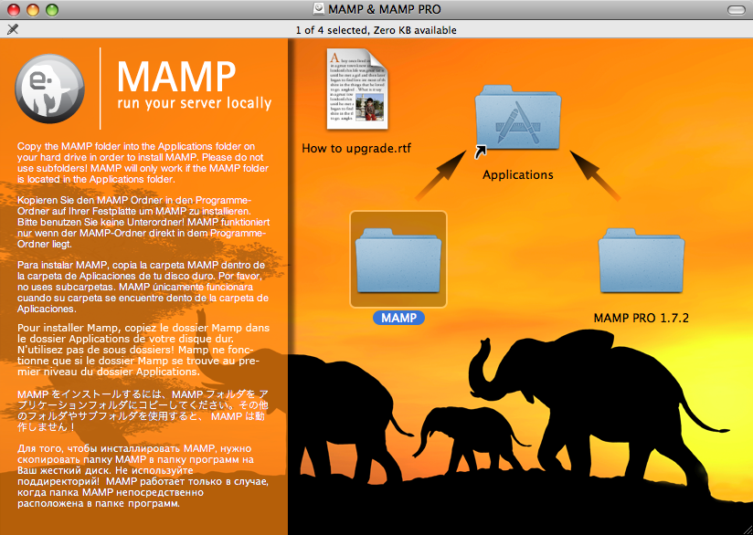
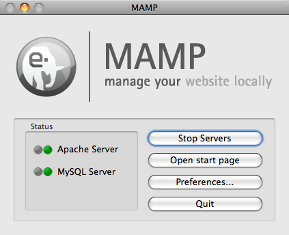
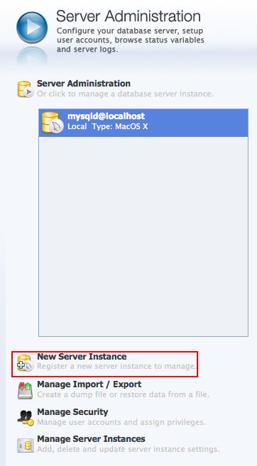
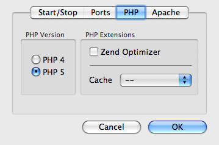

// 
//     Licensed to the Apache Software Foundation (ASF) under one
//     or more contributor license agreements.  See the NOTICE file
//     distributed with this work for additional information
//     regarding copyright ownership.  The ASF licenses this file
//     to you under the Apache License, Version 2.0 (the
//     "License"); you may not use this file except in compliance
//     with the License.  You may obtain a copy of the License at
// 
//       http://www.apache.org/licenses/LICENSE-2.0
// 
//     Unless required by applicable law or agreed to in writing,
//     software distributed under the License is distributed on an
//     "AS IS" BASIS, WITHOUT WARRANTIES OR CONDITIONS OF ANY
//     KIND, either express or implied.  See the License for the
//     specific language governing permissions and limitations
//     under the License.
//

= Configurando PHP, Apache, MySQL e Xdebug para desenvolvimento de PHP no MAC OS X
:jbake-type: tutorial
:jbake-tags: tutorials 
:jbake-status: published
:icons: font
:syntax: true
:source-highlighter: pygments
:toc: left
:toc-title:
:description: Configurando PHP, Apache, MySQL e Xdebug para desenvolvimento de PHP no MAC OS X - Apache NetBeans
:keywords: Apache NetBeans, Tutorials, Configurando PHP, Apache, MySQL e Xdebug para desenvolvimento de PHP no MAC OS X

Este tutorial mostra como configurar o PHP no pacote link:http://www.mamp.info/en/index.php[+MAMP+] (*M*acintosh,* A*pache, *M*ySQL, *P*HP), que inclui o servidor web Apache, o servidor de banco de dados MySQL e o mecanismo PHP. O MAMP destina-se a um ambiente de desenvolvimento de PHP para o Mac, que pode funcionar perfeitamente com o NetBeans IDE.

link:http://www.Xdebug.org/[+Xdebug+] é uma extensão para PHP que ajuda a fornecer informações valiosas para depuração de scripts PHP. O depurador do NetBeans funciona sobre a extensão Xdebug, fornecendo uma ferramenta de depuração eficiente no ambiente de desenvolvimento.

*Para concluir este tutorial, você precisa dos seguintes recursos e softwares.*

|===
|Software ou Recurso |Versão Necessária 

|link:https://netbeans.org/downloads/index.html[+NetBeans IDE+] |Pacote de download do PHP 

|link:http://www.oracle.com/technetwork/java/javase/downloads/index.html[+JDK (Java Development Kit)+] |7 ou 8 

|link:http://www.mamp.info/en/download.html[+MAMP+] |1.7.x 

|link:http://www.Xdebug.org/download.php[+Xdebug+] (opcional) |2.x 
|===

NOTE: o pacote MAMP inclui o servidor web Apache, o mecanismo PHP e o banco de dados MySQL. O Mac OS X 10.5 e mais recente incluem o banco de dados MySQL e o servidor Apache com suporte PHP. Embora certamente seja possível configurar o banco de dados e o servidor incorporado com o IDE, o pacote tudo em um do MAMP oferece uma solução prática e facilmente configurável.

== Instalando e Configurando o MAMP

1. Faça o download da versão mais recente do link:http://www.mamp.info/en/download.html[+MAMP+].
2. Extraia o arquivo de download e execute o arquivo `.dmg`. Quando o instalador for exibido, arraste o MAMP para a pasta `/Applications`. 

. Navegue até `/Applications/MAMP` e clique duas vezes em `MAMP.app`. É aberto o Painel de Controle do MAMP. 

Você também pode instalar o widget do painel de controle do MAMP conforme descrito em `MAMP/README.rtf`, que permite iniciar e interromper servidores. 

. Clique em Preferências para abrir o painel Preferências; em seguida, selecione a guia Portas.

. Clique em Definir como Padrão as portas do Apache e MySQL. A porta do Apache é redefinida como 80 e a do MySQL como 3306. 

image::images/mamp-control-panel-preferences-ports.png[title="Painel de controle do MAMP com a guia Portas, depois que as portas foram alteradas para os valores padrão"]

== Registrando o Banco de Dados MySQL do MAMP

O banco de dados MySQL do MAMP por padrão está localizado em `/Applications/MAMP/db/MySQL`. O nome de usuário e a senha padrão são `root`, o que pode ser visto nos detalhes da página de boas-vindas do MAMP que é aberta em um browser quando você executa o MAMP.

As interfaces do IDE com bancos de dados na janela Serviços (⌘-5). Você pode registrar o banco de dados MySQL do MAMP da seguinte forma:

1. Clique com o botão direito do mouse no nó Bancos de Dados > MySQL Server e escolha Propriedades. A caixa de diálogo Propriedades do MySQL Server é exibida. É possível configurar todas as definições do MySQL nessa caixa de diálogo.
2. Informe o nome do host e o número da porta do servidor de banco de dados, bem como o nome de usuário e a senha. Todas essas informações são exibidas na página de boas-vindas do MAMP quando você executa o servidor e o banco de dados. As definições padrão para executar o MAMP localmente são: 

* *Nome do Host do Servidor: *`localhost`
* *Número da Porta do Servidor: *`3306`
* *Nome do Usuário Administrador: *`root`
* *Senha de Administrador: *`root`

image::images/mysql-basic-properties.png[title="Caixa de diálogo Propriedades Básicas do MySQL contendo as definições de conectividade padrão do MAMP"]

. Selecione a guia Propriedades de Admin para exibir as definições que permitem a você iniciar e interromper o servidor de banco de dados no IDE. O MAMP mantém os scripts de shell na pasta `bin`. Nessa pasta, você encontra os scripts para iniciar e interromper os servidores. Para o caminho até a ferramenta Admin, você tem uma opção: pode estabelecer um link com `MAMP.app` de modo que possa usar o IDE para abrir o painel de controle do MAMP. Para isso, digite `/Applications/MAMP/MAMP.app`. Entretanto, uma opção alternativa seria usar o link:http://dev.mysql.com/downloads/workbench/[+MySQL Workbench+], que oferece uma interface GUI intuitiva para a execução de operações administrativas (isto é, configurar e monitorar o servidor MySQL, gerenciar usuários e conexões, fazer backups etc.). Para usar o MySQL Workbench, faça primeiramente o download e instale-o; em seguida, especifique as seguintes definições na caixa de diálogo: 

* *Caminho/URL para a ferramenta admin: *`/Applications/MySQL Tools/MySQLWorkbench.app` _(instalação padrão do MySQL Workbench)_
* *Caminho para o comando de início: *`/Applications/MAMP/bin/startMysql.sh`
* *Caminho para o comando de interrupção: *`/Applications/MAMP/bin/stopMysql.sh`

image::images/mysql-admin-props.png[title="Caixa de diálogo Propriedades de Admin do MySQL contendo definições de administração de amostra"]

. Se você optar por usar o MySQL Workbench como sua ferramenta admin do MySQL, especifique o soquete para conexão com o banco de dados do MAMP. Inicie o MySQL Workbench e, na página principal, clique em Nova Instância do Servidor, na coluna Administração do Servidor.

. A caixa de diálogo Criar Perfil da Nova Instância do Servidor é aberta. Selecione o método de conexão Soquete/Pipe Local e adicione o caminho para o arquivo do soquete na guia Parâmetros. O local padrão do soquete é: `/Applications/MAMP/tmp/mysql/mysql.sock`. 

image::images/socket-path.png[]

[[phpProject]]
== Criando Projetos PHP

Quando você criar um projeto PHP no IDE usando recursos do MAMP, especifique para que o IDE copie os códigos-fonte na pasta `htdocs` do Apache. Dessa forma, depois de salvar seus arquivos após fazer alterações, os códigos-fonte sejam atualizados automaticamente na versão implantada.

Por exemplo, ao criar um novo projeto PHP, use o Assistente de Novo Projeto (clique no ícone Novo Projeto, na barra de ferramentas do IDE (  ). Na terceira etapa do assistente, Executar Configuração, selecione a opção Copiar arquivos da Pasta de Códigos-fonte para outro local, e digite o caminho para a pasta `htdocs`.

[.feature]
--

image::images/new-php-project.png[role="left", link="images/new-php-project.png"]

--

O IDE se lembrará desse local nos projetos futuros. Para obter instruções adicionais sobre como criar projetos PHP no NetBeans IDE, consulte link:project-setup.html[+Configurando um Projeto PHP+].

== Ativando o Xdebug com MAMP

O MAMP contém um arquivo  ``xdebug.so``  pré-compilado. Para usar esse arquivo, ative-o no  ``php.ini``  do MAMP. O Xdebug não funciona com o Zend Optimizer; por isso, desative também o Zend Optimizer no arquivo  ``php.ini`` .

*Para ativar o Xdebug com o MAMP:*

1. Abra o arquivo `php.ini` em um editor de texto. Esse arquivo se encontra em 

`/Applications/MAMP/conf/php5/php.ini`.

. Localize a seção  ``[Zend]``  e transforme cada linha em comentário.

[source,ini]
----

;[Zend]
;zend_optimizer.optimization_level=15
;zend_extension_manager.optimizer=/Applications/MAMP/bin/php5/zend/lib/Optimizer-3.3.3
;zend_optimizer.version=3.3.3
 
;zend_extension=/Applications/MAMP/bin/php5/zend/lib/ZendExtensionManager.so
----

. Localize a seção  ``[xdebug]``  e ative o Xdebug (substitua `xxxxxxxx` pelo número real). Adicione essa seção ao final de  ``php.ini``  se não estiver lá.

[source,ini]
----

[xdebug]
 
xdebug.default_enable=1
 
xdebug.remote_enable=1
xdebug.remote_handler=dbgp
xdebug.remote_host=localhost
xdebug.remote_port=9000
xdebug.remote_autostart=1
 
zend_extension="/Applications/MAMP/bin/php5/lib/php/extensions/no-debug-non-zts-xxxxxxxx/xdebug.so"
----
Para obter uma explicação dessas propriedades, consulte Related Settings na documentação link:http://www.Xdebug.org/docs/remote[+Xdebug Remote Debugging+].

. Observe que a porta remota especificada para o Xdebug na etapa anterior é 9000. Essa é a porta do depurador padrão usada no NetBeans. Para confirmar, escolha NetBeans > Preferências no menu principal e selecione PHP na janela Opções. 

image::images/php-options68.png[title="A porta de depuração pode ser definida na janela Opções PHP"] 

Se for necessário, você poderá alterar a porta do depurador aqui.

. Abra o painel de controle do MAMP e selecione a guia PHP. Desmarque Zend Optimizer. 

. Inicie (ou reinicie) o servidor Apache do MAMP.

== Depurando Projetos PHP

Para depurar um projeto PHP no IDE, clique com o botão direito do mouse no projeto, na janela Projetos, e escolha Depurar. Como alternativa, se o projeto estiver destacado na janela Projetos, você poderá clicar no ícone Depurar Projeto ( image:images/debug-icon.png[] ) na barra de ferramentas principal.

Você pode definir o depurador para ser suspenso na primeira linha de código, ativando essa opção na <<phpOptions,janela Opções PHP>>.

Quando uma sessão do depurador está ativa, a barra de ferramentas do depurador é exibida acima do editor.

image::images/debugger-toolbar.png[title="A barra de ferramentas do depurador em um estado suspenso"]

Você também pode abrir a janela Sessões para confirmar se uma sessão de depuração PHP está ativa. No menu principal, escolha Janela > Depuração > Sessões.

image::images/debugger-sessions-win.png[title="A janela Sessões indica que uma sessão do depurador Xdebug está ativa"]

link:/about/contact_form.html?to=3&subject=Feedback:%20Configuring%20PHP%20on%20Mac%20OS[+Enviar Feedback neste Tutorial+]

== Consulte Também

Para obter mais informações sobre a tecnologia PHP no link:https://netbeans.org/[+netbeans.org+], consulte os seguintes recursos:

* link:project-config-screencast.html[+O Editor PHP no NetBeans IDE 6.9-7.0+]. Um screencast demonstrando o novo suporte do editor PHP.
* link:debugging.html[+Depurando Código-fonte PHP+]. Um documento que descreve como depurar no IDE usando o Xdebug.
* link:wish-list-tutorial-main-page.html[+Criando uma Aplicação CRUD+]. Um tutorial em 9 partes que demonstra como criar uma aplicação CRUD usando o editor PHP do IDE.
* link:remote-hosting-and-ftp-account.html[+Implantando uma Aplicação PHP em um Servidor Web Remoto+]. Um documento que fornece diretrizes de como implantar uma aplicação PHP em um servidor remoto onde você tem uma conta de hospedagem.

Para enviar comentários e sugestões, obter suporte e manter-se informado sobre os desenvolvimentos mais recentes das funcionalidades de desenvolvimento PHP do NetBeans IDE, link:../../../community/lists/top.html[+junte-se à lista de correspondência users@php.netbeans.org+].

