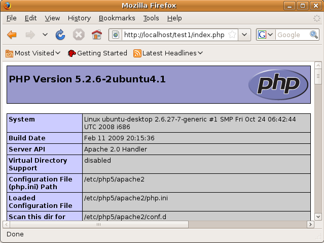

// 
//     Licensed to the Apache Software Foundation (ASF) under one
//     or more contributor license agreements.  See the NOTICE file
//     distributed with this work for additional information
//     regarding copyright ownership.  The ASF licenses this file
//     to you under the Apache License, Version 2.0 (the
//     "License"); you may not use this file except in compliance
//     with the License.  You may obtain a copy of the License at
// 
//       http://www.apache.org/licenses/LICENSE-2.0
// 
//     Unless required by applicable law or agreed to in writing,
//     software distributed under the License is distributed on an
//     "AS IS" BASIS, WITHOUT WARRANTIES OR CONDITIONS OF ANY
//     KIND, either express or implied.  See the License for the
//     specific language governing permissions and limitations
//     under the License.
//

= Configuring the PHP Development Environment in Linux Ubuntu
:jbake-type: tutorial
:jbake-tags: tutorials 
:jbake-status: published
:syntax: true
:icons: font
:source-highlighter: pygments
:toc: left
:toc-title:
:description: Configuring the PHP Development Environment in Linux Ubuntu - Apache NetBeans
:keywords: Apache NetBeans, Tutorials, Configuring the PHP Development Environment in Linux Ubuntu
:reviewed: 2019-02-02

This tutorial shows how to configure the PHP development environment in the Ubuntu operating system (7.10 and later). This involves installing and configuring the PHP engine, a MySQL database, an Apache web server, and the XDebug debugger.

== Requirements

To follow this tutorial, you need the following software and resources.

|===
|Software or Resource |Version Required 

|A PHP engine |Version 5. 

|A web server |Apache HTTP Server 2.2 is recommended.
 

|A database server |MySQL Server 5.0 is recommended.
 

|A PHP debugger (optional) |XDebug 2.0 or later 
|===

Typically, development and debugging is performed on a local web server, while the production environment is located on a remote web server. Setting up a remote web server is described in xref:remote-hosting-and-ftp-account.adoc[+ Deploying a PHP Application on a Remote Web Server Using the NetBeans IDE+]. This tutorial has you set up a local web server. PHP support can be added to a number of local web servers (IIS, Xitami, and so on), but most commonly link:http://httpd.apache.org/download.cgi[+Apache HTTP Server+] is used.

=== Installing the Software

This tutorial shows how to configure the PHP development environment in Ubuntu 7.04 and later. You need to:

1. Install the Apache2 HTTP server, the PHP5 engine, the MySQL 5.0 database server, and the PHP5-MySQL module. These packages can be <<lamp,installed together as the LAMP stack>>, or they can be <<separate-packages,installed separately>>.
2. <<specifyDocumentRoot,Specify the Document Root for the Apache2 HTTP server>>
3. <<configureMySQL,Configure the MySQL database server>>
4. <<installXDebug,Install and enable the XDebug 2.0 debugger>>

See the link:https://help.ubuntu.com/community/ApacheMySQLPHP[+Ubuntu community+] for more information on installing Apache, MySQL, and PHP.

[[lamp]]
==== Installing the Software Packages Together

Ubuntu provides a Linux AMP (LAMP) package that contains all the necessary packages for your PHP environment. You can install the software by executing the following command at the command prompt in the Terminal window:

[source,bash]
----

sudo tasksel install lamp-server
----

The  ``lamp-server``  package includes the most suitable version of PHP, Apache 2, MySQL, and PHP5-MySQL.

[[separate-packages]]
==== Installing the Software Packages Separately

Instead of installing the entire set of LAMP packages, you can also install the packages individually. This is useful if you already have installed one of the components, such as the Apache server or MySQL database server. You can use command-line tools or the Synaptic Package Manager GUI.

The individual packages to install are the following:

* apache2
* php5
* mysql-server
* php5-mysql

==== Checking the Installation

After you set up your PHP web stack, check that it is installed correctly and that your Apache server recognizes your PHP engine.

To check that Apache and PHP are installed and running, open NetBeans IDE and xref:project-setup.adoc[+create a PHP project+]. In the  ``index.php``  file, enter the PHP method  ``phpinfo()`` . Run the file. The standard PHP information page should display. 

[[troubleshooting]]
==== Troubleshooting

The following are some frequently encountered problems when checking the installation of your PHP stack in Ubuntu:

* The browser window displays a Not Found error for  ``~USER/PROJECT/index.php``. Remove the  ``~USER``  string from the URL. For example, if this error appears for the URL  ``~ubuntu/test1/index.php`` , change the URL to  ``test1/index.php`` . Note that you can set the URL for a PHP project in NetBeans IDE either when you create the project, or by right-clicking the project node and going to Properties > Run Configuration.
* The browser shows you a popup asking you to open the file, as if the PHP engine is not recognized. There's a problem with your  ``php5-common``  package. Replace it with  ``php5``  and  ``phpmyadmin`` . To replace  ``php5-common`` , run the following two commands:

[source,bash]
----

apt-get --purge remove php5-commonapt-get install php5 phpmyadmin
----

=== Specifying the Document Root for the Apache2 HTTP Server

The Document Root is the directory where the Apache HTTP server takes files for displaying in the browser. The Document Root is specified in the file that defines your virtual host. The default virtual host configuration file is

[source,bash]
----

/etc/apache2/sites-available/default
----

with the document root

[source,bash]
----

/var/www/
----

We recommend that you create your own virtual host and enable it instead of editing the default one.

==== Creating the Document Root Location

1. Choose Places > Home Folder.
2. From the context menu, choose Create Folder.
3. Enter the name of the folder, for example, public_html.

==== Creating a New Virtual Host

1. To launch the Terminal, choose Applications > Accessories > Terminal. The Terminal window opens.
2. To copy the configuration file of the default virtual host to a new file ( ``mysite`` ), type the following command at the command prompt:

[source,bash]
----

sudo cp /etc/apache2/sites-available/default /etc/apache2/sites-available/mysite
----

. Run the  ``gedit``  application and edit the new configuration file ( ``mysite`` ) in it:

[source,bash]
----

gksudo gedit /etc/apache2/sites-available/mysite 
----
If asked, enter the password that you specified for the root user during the installation of your operating system.

. Change the Document Root to point to the new location:

[source,bash]
----

/home/<user>/public_html/
----

. Change the Directory directive, replace

[source,ini]
----

<Directory /var/www/>
----
with

[source,ini]
----

<Directory /home/user/public_html/>
----

image::images/ubuntu-change-directory-root.png[]

. Save the file  ``mysite`` 

==== Activating the New Virtual Host

1. To deactivate the default host and activate the new host, <<launchTerminal,launch the Terminal >>and run the following two utilities in the Terminal window:

[source,bash]
----

sudo a2dissite default &amp;&amp; sudo a2ensite mysite
----

. Restart the Apache HTTP server:

[source,bash]
----

sudo /etc/init.d/apache2 reload
----

=== Configuring the MySQL Database Server

During the installation of the MySQL database server, a root user is created. A dialog opens during installation in which you set a root user password. If this dialog did not open, or you did not set a password in this dialog, you need to create a MySQL root user password now. You will need the password for creating other MySQL server users.

1. To connect to the MySQL server,<<launchTerminal, launch the Terminal>> and in the Terminal window enter the following command:

[source,bash]
----

mysql -u root -p
----
The MySQL command prompt appears.

. At the command prompt enter the following command and press Enter:

[source,sql]
----

SET PASSWORD FOR 'root'@'localhost' = PASSWORD('<yourpassword>');
----
If the command is executed successfully, the following message is displayed:

[source,bash]
----

Query OK, 0 rows affected (0.00 sec)
----

=== Installing and Enabling the XDebug Debugger

The following steps are required only if you want to use XDebug, which is optional for PHP development. XDebug is an extension to PHP. NetBeans IDE uses it automatically when it is configured correctly for your PHP web stack. For more information on XDebug and NetBeans IDE, see xref:debugging.adoc[+Debugging PHP Source Code in the NetBeans IDE+]. Also see the link:http://wiki.netbeans.org/HowToConfigureXDebug[+NetBeans wiki page on XDebug+].

[[xdebug-package]]
==== Installing the XDebug Package (Ubuntu 8.05 and later)

Starting in Ubuntu 8.05, an XDebug package is available, named  ``php5-xdebug`` . The supported version of XDebug is 2.0.3-1. You can install it with command-line tools or through the Synaptic Package Manager UI. After you install XDebug, you have to modify  ``php.ini``  as described in <<enableXDebug,Enabling XDebug>>.

==== Building XDebug from Sources (Ubuntu 7.10)

To build XDebug from sources you need two additional modules: PHP5 Development and PEAR.

1. Start the <<startSynapticPackageManager,Synaptic Package Manager>>.
2. Switch to the Installed panel to check that the make module is already installed.
3. Switch to the All tab and click the check boxes next to the following packages:
* php5-dev
* php-pear
For each item, from the context menu choose Mark for installation.

. The Mark additional required changes dialog box opens with a list of dependent packages that should be also installed to enable the work of the software. Click Mark.
. The system returns to the Synaptic Package Manager panel where the selected packages are marked for installation.
. Choose Apply on the toolbar. The Apply the following changes summary panel opens with a list of packages selected for installation. Click Apply.
. When the download and installation are completed successfully, the Changes applied panel opens. Click Close.

NOTE: You can also install the modules by running the following command in the Terminal window:  ``aptitude install php5-dev php-pear`` 

. You can now download and install XDebug. Enter the following command in the Terminal window:

[source,bash]
----

sudo pecl install xdebug
----

==== Enabling XDebug

To enable XDebug, you need to edit the php.ini file in the <<gedit, ``gedit`` >> text processor.

1. To start the  ``gedit``  text processor, launch the <<launchTerminal,Terminal>> and type the following command at the command prompt:

[source,bash]
----

gksudo gedit
----
If asked, enter the password specified for the root user during the installation of your operating system.

. Open the file  ``/etc/php5/apache2/php.ini``  .
. Add the following lines to the file:

[source,ini]
----

zend_extension=/usr/lib/php5/<DATE+lfs>/xdebug.so
xdebug.remote_enable=on

----

Check link:http://2bits.com/articles/setting-up-xdebug-dbgp-for-php-on-debian-ubuntu.html[+ here+] for more details on configuring XDebug.

