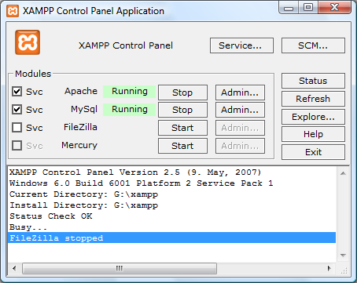

// 
//     Licensed to the Apache Software Foundation (ASF) under one
//     or more contributor license agreements.  See the NOTICE file
//     distributed with this work for additional information
//     regarding copyright ownership.  The ASF licenses this file
//     to you under the Apache License, Version 2.0 (the
//     "License"); you may not use this file except in compliance
//     with the License.  You may obtain a copy of the License at
// 
//       http://www.apache.org/licenses/LICENSE-2.0
// 
//     Unless required by applicable law or agreed to in writing,
//     software distributed under the License is distributed on an
//     "AS IS" BASIS, WITHOUT WARRANTIES OR CONDITIONS OF ANY
//     KIND, either express or implied.  See the License for the
//     specific language governing permissions and limitations
//     under the License.
//

= Configuring PHP Development Environment in Windows
:jbake-type: tutorial
:jbake-tags: tutorials 
:jbake-status: published
:syntax: true
:icons: font
:source-highlighter: pygments
:toc: left
:toc-title:
:description: Configuring PHP Development Environment in Windows - Apache NetBeans
:keywords: Apache NetBeans, Tutorials, Configuring PHP Development Environment in Windows
:reviewed: 2019-02-02

This tutorial shows you two ways of configuring your PHP development environment on the Windows operating system. The first and most convenient way is to install and configure an AMP (Apache, MySQL, PHP) package. This tutorial shows you how to install the XAMPP package. The second way is to install and configure each component separately.

== Requirements

To follow this tutorial, you need the following software and resources.

|===
|Software or Resource |Version Required 

|A PHP engine |Version 5. Included in link:http://www.apachefriends.org/en/xampp-windows.html[+XAMPP-Windows+]. 

|A web server |link:http://httpd.apache.org/download.cgi[+Apache HTTP Server 2.2+] is recommended.
Included in XAMPP Windows. 

|A database server |link:http://dev.mysql.com/downloads/mysql/5.1.html[+MySQL Server 5.0+] is recommended.
Included in XAMPP Windows. 

|A PHP debugger (optional) |link:http://www.xdebug.org[+XDebug 2.0 or later.+]
 
|===

Typically, development and debugging is performed on a local web server, while the production environment is located on a remote web server. Setting up a remote web server is described in xref:remote-hosting-and-ftp-account.adoc[+ Deploying a PHP Application on a Remote Web Server Using the NetBeans IDE+]. This tutorial has you set up a local web server. PHP support can be added to a number of local web servers (IIS, Xitami, and so on), but most commonly link:http://httpd.apache.org/download.cgi[+Apache HTTP Server+] is used. Apache HTTP server is included in the XAMPP AMP package used in this tutorial. For information on installing and configuring Apache HTTP server standalone, click link:http://httpd.apache.org/docs/2.2/install.html[+here+].

=== Required Software

To create, run, and debug your PHP projects you need the following software:

* A web server. Typically development and debugging is performed on a local web server, while the production environment is located on a remote web server. The current version enables using a local server. Using a remote server with FTP access will be supported in future versions. PHP support can be added to a number of web servers (IIS, Xitami, and so on), but most commonly link:http://httpd.apache.org/download.cgi[+Apache HTTP Server+] is used. Click link:http://httpd.apache.org/docs/2.2/install.html[+here+] for information on how to install and configure Apache 2.2. 

* The PHP engine. The supported version is PHP5. Downloads are available link:http://www.php.net/downloads.php[+here+].
* The PHP debugger. The NetBeans IDE for PHP allows you to use link:http://www.xdebug.org[+XDebug+], but using a debugger is optional. The recommended version is XDebug 2.0 or higher as it is compatible with PHP5.
* A database server. You can use various database servers while one of the most popular ones is the MySQL server. Downloads are available link:http://dev.mysql.com/downloads/mysql/5.1.html[+here+]. 

NOTE: The recommended version of the product is MySQL Server 5.0. The provided documents describe the work with this version.

After the installation, you need to set up the environment that all the software components work properly with each other.

You can use a <<XAMPP, Package>>, that contains the required software, or <<installComponentsSeparately,install each component separately>>.

=== Using an AMP Package

To have all the configuration settings for the PHP engine, the Apache HTTP Server, and the MySQL database server specified automatically, use an AMP package. This tutorial gives instructions only for the link:http://www.apachefriends.org/en/xampp-windows.html[+XAMPP-Windows+] package. For help with the WAMP package, please see the link:http://wiki.netbeans.org/HowToConfigureXDebug[+NetBeans XDebug Wiki+].

[[XAMPP]]
==== Installing and Configuring the XAMPP Package

The section describes how to download, install, and configure the XAMPP package.

WARNING: Do NOT use XAMPP 1.7.0. There are significant problems with XDebug in this version. Use version 1.7.1 or later, where these problems are fixed.

NOTE: Starting with XAMPP 1.7.2, XAMPP comes with PHP 5.3, not PHP 5.2.x. NetBeans IDE for PHP version 6.7.x does not support the new PHP 5.3 functions. NetBeans IDE for PHP 6.8, currently available as a development build, fully supports PHP 5.3. Also note that Xdebug installation differs between PHP 5.2.x and PHP 5.3.

1. Download the link:http://www.apachefriends.org/en/xampp-windows.html[+XAMPP+] installer package. (XAMPP Lite does not include XDebug.)
2. When the download is completed, run the  `` .exe `` file.

On Microsoft Vista, the User Access Control feature blocks the PHP installer from updating the Apache httpd configuration. Disable UAC while you are installing XAMPP. See link:http://support.microsoft.com/kb/922708[+Microsoft support+] for more information.

. You are given the option to install the Apache server and the MySQL database server as services. If you install the Apache Server and MySQL as services, you will not have to start them manually through the XAMP Control Panel. Note that you have the option to install or uninstall these services in the <<xamppConstolPanel,XAMPP Control Panel>>.
. If you are using the self-extracting archive, after the archive is extracted, run the file  ``setup-xampp.bat``  to configure the components of the package. (The XAMPP installer runs this file automatically.)
. After configuration, open the XAMP Control Panel. (You can open it manually by running the file  ``XAMPP_HOME/xampp-control.exe``  or from the Xampp Control Panel icon that is automatically placed on your desktop.) When you open the XAMPP Control Panel, note that the modules that are installed as services are already running.

WARNING: On Windows Vista sometimes  ``xampp-control.exe``  will not run. You can run  ``xampp-start.exe``  instead.

WARNING: The  ``winmysqladmin.exe file`` , which is launched by the Admin button for MySQL, does not work. A cascade of error messages appears, which can only be stopped by manually terminating the  ``winmysqladmin``  process. You cannot launch  ``winmysqladmin.exe``  from the command line, either. See link:http://bugs.xampp.org/view.php?id=71[+http://bugs.xampp.org/view.php?id=71+].

. The Svc checkboxes indicate that a module is installed as a Windows service and will start automatically on system startup. You can install or uninstall Windows services by selecting or unselecting the Svc checkbox. Uninstalling a Windows service does not uninstall the module, but it does require you to start the module manually. The XAMPP control panel includes buttons for stopping and starting modules and opening their administration consoles.

==== Checking XAMPP Installation

1. Run your browser and enter the following URL:  ``http://localhost`` . The XAMPP welcome page opens:

image::images/xampp-welcome-page.png[]

. To ensure that the Apache and MySQL servers have been installed as system services, restart your operating system, run the browser, and enter the  ``http://localhost``  URL again. The XAMPP welcome page opens. Note that the XAMPP welcome page includes a menu in the left margin through which you can check the status of XAMPP components and run  ``phpinfo()`` , among other useful features.  ``phpinfo()``  returns a screen with configuration information about your XAMPP components. 

image::images/xampp-phpinfo.png[]

==== Installing and Enabling the XDebug Debugger

You need to configure your PHP stack to use XDebug. The process differs if you are using <<xdebug-xampp-171,XAMPP 1.7.1>>, which bundles PHP 5.2.6, or <<xdebug-xampp-172,XAMPP 1.7.2>>, which bundles PHP 5.3.

Many users have experienced difficulties in getting XDebug to work on their systems. Please see link:http://wiki.netbeans.org/HowToConfigureXDebug[+our wiki+] and the link:http://forums.netbeans.org/viewforum.php?f=13&sid=5b63e6774fe7859b5edd35b1192d8efd[+NetBeans PHP Editor Users' Forum+] for assistance.

[[xdebug-xampp-171]]
===== XDebug on XAMPP 1.7.1 (PHP 5.2)

You must download XDebug, place the .dll file in your php extensions directory, and configure php.ini to find and use this file.

1. Download the latest _thread-safe_ link:http://www.xdebug.org/download.php[+XDebug+] compatible with your version of PHP. The download links are listed under Releases. Copy the  ``.dll``  file to your  ``XAMP_HOME/php/ext``  directory. ( ``XAMPP_HOME``  refers to your XAMPP or XAMPP Lite installation directory, such as  ``C:\Program Files\xampp``  or  ``C:\xampplite`` .)
2. Locate and open the active  ``php.ini``  file for your XAMPP. This is located by default in the `` XAMPP_HOME/apache/bin``  directory. Confirm which  ``php.ini``  file is active by running  ``phpinfo()``  and searching for Loaded Configuration File.
3. Because Zend optimizer blocks XDebug, you need to disable Zend optimizer. In the active  ``php.ini `` file, locate the following lines and delete them or mark as comments (To be safe, search for and comment out all properties related to Zend):

[source,ini]
----

[Zend]
;zend_extension_ts = "C:\Program Files\xampp\php\zendOptimizer\lib\ZendExtensionManager.dll"
;zend_extension_manager.optimizer_ts = "C:\Program Files\xampplite\php\zendOptimizer\lib\Optimizer"
;zend_optimizer.enable_loader = 0
;zend_optimizer.optimization_level=15
;zend_optimizer.license_path =

----

. To attach
 XDebug to the PHP engine, uncomment the following lines in the  ``php.ini``  files (directly beneath the [Zend] section, add them if not there). Some additional notes have been added.

[source,ini]
----

[XDebug]; Only Zend OR (!) XDebug
zend_extension_ts = "./php/ext/php_xdebug<-version-number>.dll"
; XAMPP and XAMPP Lite 1.7.0 and later come with a bundled xdebug at <XAMPP_HOME>/php/ext/php_xdebug.dll, without a version number.xdebug.remote_enable=1xdebug.remote_host=127.0.0.1xdebug.remote_port=9000
; Port number must match debugger port number in NetBeans IDE Tools > Options > PHPxdebug.remote_handler=dbgpxdebug.profiler_enable=1xdebug.profiler_output_dir="<XAMPP_HOME>\tmp"
----

Set the  ``xdebug.remote_enable``  property to 1, not "true" or any other value.

NOTE: Make sure the paths you specify match the location of the corresponding files as determined during your installation.

. Save  ``php.ini`` .
. Run the <<xamppConstolPanel,XAMPP Control Panel Application>> and restart the Apache server.
See link:http://wiki.netbeans.org/HowToConfigureXDebug[+our wiki+] and the link:http://www.xdebug.org/docs/install[+XDebug documentation+] for more information on how to configure XDebug.

[[xdebug-xampp-172]]
===== Xdebug on XAMPP 1.7.2 (PHP 5.3)

XAMPP 1.7.2 comes bundled with the appropriate Xdebug .dll file. You only have to configure  ``php.ini``  to use it. Note that all Xdebug settings have text explaining them.

1. Locate and open  ``XAMPP_HOME\php\php.ini``  for editing. This is the only  ``php.ini``  file in XAMPP 1.7.2.
2. Find and uncomment the line  ``zend_extension = "XAMPP_HOME\php\ext\php_xdebug.dll"`` .
3. Find and uncomment the line  ``xdebug.remote_host=localhost`` . Change the value of the setting from  ``localhost``  to  ``127.0.0.1`` .
4. Find and uncomment the line  ``xdebug.remote_enable = 0`` . Change 0 to 1.
5. Find and uncomment the line  ``xdebug.remote_handler = "dbgp"`` .
6. Find and uncomment the line  ``xdebug.remote_port = 9000`` .
7. Save  ``php.ini`` .
8. Run the <<xamppConstolPanel,XAMPP Control Panel Application>> and restart the Apache server.

See link:http://wiki.netbeans.org/HowToConfigureXDebug[+our wiki+] and the link:http://www.xdebug.org/docs/install[+XDebug documentation+] for more information on how to configure XDebug.

=== Installing the Components Separately

==== Apache HTTP Server

1. Download the link:http://httpd.apache.org/download.cgi[+Apache2 HTTP server+].
2. Run the installation file  ``.msi`` . The installation wizard starts. Follow the instructions.

On Microsoft Vista, do not install the Apache Server to the default location, which is in Program Files. All files in Program Files are write-protected.

. When the installation is completed, restart the Apache server.
. To check that the installation is successful, run the browser and enter the following URL:

[source,ini]
----

  http://localhost/
----
The Apache welcome test page opens: 

image::images/install-apache-it-works-port80.png[]

===== Troubleshooting

By default, the Apache server listens to port 80. This port can be already used by other services, for example Skype. To solve the issue, change the port which the server listens to:

1. Open the Apache web server configuration file  ``httpd.conf`` . By default the file is located in  ``C:\Program Files\Apache Software Foundation\Apache<version>\conf\`` 
2. Locate the line  ``Listen 80``  and change the port number, for example  ``8080`` . Save the file.
3. Restart the Apache web server.
4. To check that the web server works, run the browser and enter the URL and specify the port number explicitly:  ``http://localhost:8080`` 

You can also stop the processes that possibly listen to port 80. In the Task Manager, select the relevant file name and click End Process.

Find more information on installing and configuring the server link:http://httpd.apache.org/docs/2.2/install.html[+here+].

==== PHP Engine

1. Download the link:http://windows.php.net/download/[+Windows binary installer+] for the PHP5 version of your choice.

NOTE: If there is no installer available for the version of PHP you want to install, you have to install it manually from the .zip file. See link:http://php.net/manual/en/install.windows.manual.php[+Manual Instruction Steps+] in the php.net documentation.

. When the download is complete, run the  ``.msi``  installation file. The installation wizard starts.
. On the Apache Configuration Directory panel, specify the directory where the  ``httpd.conf``  file is located, the default setting is  ``C:\Program Files\Apache Software Foundation\Apache<version>\conf\`` . The PHP processing will be enabled automatically.
. If you want to use the MySQL database server, choose the Complete installation option or select the MySQL and MySQLi items in the Extensions list.
. After the installation is completed, restart the Apache server.
. To check that the PHP engine has been installed successfully and PHP processing has been enabled in the Apache configuration:
* Open Notepad or another text editor. Create a file and type the following text:

[source,php]
----

<?php 
     echo "PHP has been installed successfully!";
?>
----

* Save the file in the htdocs folder as `test.php`. The default path is  ``C:\Program Files\Apache Software Foundation\Apache<version>\htdocs\test.php`` 
* Run the browser and enter the following URL:  ``http://localhost:<port>/test.php`` . The following page opens:

image::images/install-php-test.png[]

===== Troubleshooting

If the page does not open:

1. Restart the Apache server.
2. Check that the Apache server configuration file httpd.conf contains the following lines:

[source,ini]
----

  AddType Application/x-httpd-php .php 
  LoadModule php5_module "c:/php/sapi/php5apache2_2.dll"
----

. If the lines are missing, add them, save  ``httpd.conf`` , and restart Apache.
. Refresh the pass:[http://localhost:<port>/test.php] page.

==== MySQL Database Server

Find detailed information on xref:../ide/install-and-configure-mysql-server.adoc[+installing and configuring the MySQL+] database server.

==== XDebug

1. Download link:http://www.xdebug.org[+XDebug+].
2. Install XDebug into the  ``php/``  folder. You will need the path to it to <<settingUpEnvironment,configure your environment>>.

==== Setting Up the Environment

1. If your installation follows the default settings, PHP processing will be enabled automatically.
2. To attach
 XDebug to the PHP engine, locate the  ``php.ini``  file and add the following lines to it:

For a *thread-safe* PHP 5.2 engine:

[source,ini]
----

zend_extension_ts="<path to the php folder>/php_xdebug-<version-number>.dll"
xdebug.remote_enable=1
----

For a *non-thread-safe* PHP 5.2 engine:

[source,ini]
----

zend_extension_nts="<path to the php folder>/php_xdebug-<version-number>.dll"
xdebug.remote_enable=1
----

For *any* PHP 5.3 engine:

[source,ini]
----

zend_extension="<path to the php folder>/php_xdebug-<version-number>.dll"
xdebug.remote_enable=1
----

Some users also find that they need to include the following lines, although other users do not:

[source,ini]
----

xdebug.remote_host=127.0.0.1xdebug.remote_port=9000
; Port number must match debugger port number in NetBeans IDE Tools > Options > PHPxdebug.remote_handler=dbgp
----

Click link:http://www.xdebug.org/docs/install[+here+] for more information on how to configure XDebug.

NOTE: Make sure the paths you specify match the names and locations of the corresponding files as determined during your installation.

. To be sure that previously installed PHP engine supports using the MySQL database server:

1. Click Start > Control Panel.
2. On the Control Panel, choose Add or Remove Programs.
3. On the Add or Remove Programs panel, select the PHP <version number> area and click Change. The PHP Setup Wizard starts. Click Next.
4. On the Change, repair or remove installation panel, choose Change and click Next.
5. On the Web Server Setup panel, choose the version of the Apache server - in our example it is Apache 2.2.x Module. Click Next.
6. On the Apache Configuration Directory panel, specify the directory where the Apache configuration file  ``httpd.conf``  is located. Click Next.
7. On the Choose Items to Install panel, expand the Extensions node and choose the MySQL and MySQLi items. Click Next.
8. On the Ready to change PHP <version number> panel, click Change.
9. On the Completed the PHP <version number> Setup Wizard panel, click Finish.

