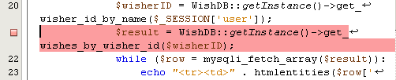
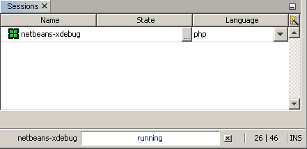
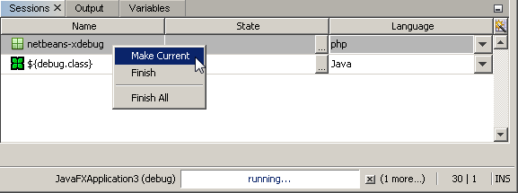
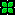
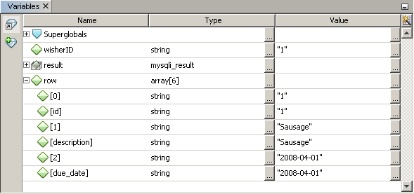
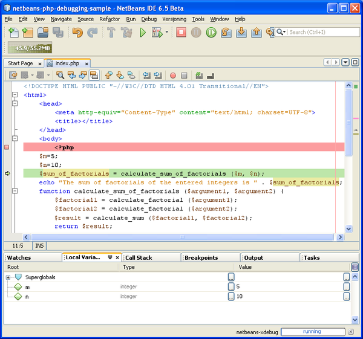
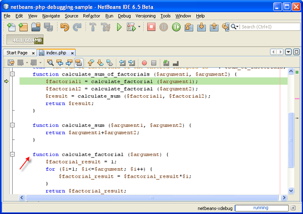
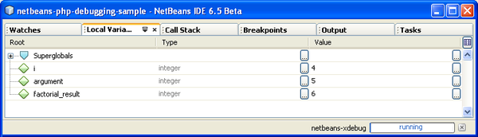
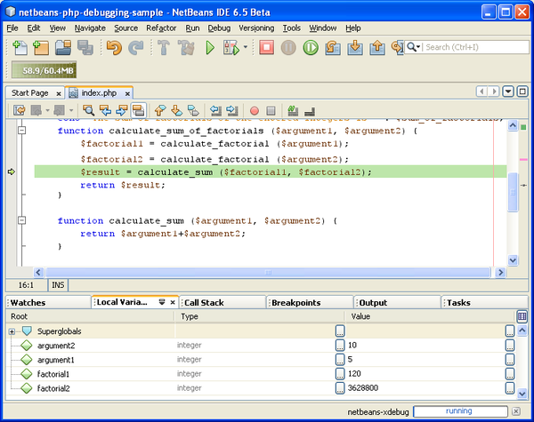

// 
//     Licensed to the Apache Software Foundation (ASF) under one
//     or more contributor license agreements.  See the NOTICE file
//     distributed with this work for additional information
//     regarding copyright ownership.  The ASF licenses this file
//     to you under the Apache License, Version 2.0 (the
//     "License"); you may not use this file except in compliance
//     with the License.  You may obtain a copy of the License at
// 
//       http://www.apache.org/licenses/LICENSE-2.0
// 
//     Unless required by applicable law or agreed to in writing,
//     software distributed under the License is distributed on an
//     "AS IS" BASIS, WITHOUT WARRANTIES OR CONDITIONS OF ANY
//     KIND, either express or implied.  See the License for the
//     specific language governing permissions and limitations
//     under the License.
//

= Debugging PHP Source Code in the NetBeans IDE
:jbake-type: tutorial
:jbake-tags: tutorials 
:jbake-status: published
:syntax: true
:icons: font
:source-highlighter: pygments
:toc: left
:toc-title:
:description: Debugging PHP Source Code in the NetBeans IDE - Apache NetBeans
:keywords: Apache NetBeans, Tutorials, Debugging PHP Source Code in the NetBeans IDE

*To follow this tutorial, you need the following software and resources.*

|===
|Software or Resource |Version Required 

|A PHP engine |Version 5 

|A web server |link:http://httpd.apache.org/download.cgi[+Apache HTTP Server 2.2+] is recommended.
 

|A PHP debugger |link:http://www.xdebug.org/[+XDebug 2.0 or later+] 
|===

== Getting Ready

To successfully debug PHP applications in the NetBeans IDE for PHP, you need to have the PHP engine, the Apache local web server, and the XDebug debugger xref:../php.adoc#configuration[+installed and configured for PHP development+]. If you have difficulties getting XDebug to work, see the link:http://wiki.netbeans.org/HowToConfigureXDebug[+NetBeans wiki on XDebug+] and/or ask the community at users@php.netbeans.org.

== How PHP Debugging with XDebug Works in NetBeans IDE

When you run XDebug from NetBeans IDE, PHP program execution pauses at every line where you set a breakpoint. When the program execution is paused, XDebug can retrieve information about the current program state, such as the values of the program variables. Practically, this means the following workflow:

1. Set a breakpoint at each line where PHP source code execution should pause.
2. Start a debugging session.
3. When a line with a breakpoint is reached, execute the script one line after another by pressing F7 and F8. Monitor the state of the application in the <<editorLayout,debugger windows>>.
4. Close the debugging session.

For a detailed workflow of using XDebug with NetBeans IDE, see <<debuggingSession,Debugging Session>>.

NetBeans IDE provides a debugging toolbar that helps you step through your files. See <<work,Working with the Toolbar and Editor>>.

== Debugging Options

The NetBeans IDE Options include a tab for changing certain default settings for debugging PHP. To open these options, go to Tools > Options (NetBeans > Preferences on Mac), select the PHP options, and select the Debugging tab.

*Note: *The Debugging tab was introduced in NetBeans IDE version 7.1. Earlier versions of NetBeans have debugging options in the General PHP tab. Not all options in version 7.1 are available in earlier versions.

image::images/php-debugging-options.png[]

You can change the following options in this panel:

* *Debugger port *This is the port that XDebug uses, as set in php.ini. By default it is port 9000. _The port number in this dialog must be the same as the debugger port you set in php.ini. You cannot affect the port that XDebug uses in this dialog. You only inform NetBeans IDE of the port that XDebug uses._
* *Session ID* Arbitrary name of the debugging session. By default it is netbeans-xdebug. This value is important to note in cases where you have to set the  ``xdebug.idekey``  property in php.ini, such as some remote debugging scenarios.
* *Stop at First Line* Tick this option for the debugger session to stop at the first line of code instead of at the first breakpoint. This keeps your screen focused in the IDE instead of switching to a browser window when you launch a debugging session.
* *Watches and Balloon Evaluation* Watches and balloon evaluation is disabled by default. Watches and ballon evaluation destabilizes XDebug.
* *Maximum Depth of Structures.* Sets the visibility of nested structures (such as nested arrays, objects in objects, etc.)
* *Maximum Number of Children.* Sets the visibility of array items during Watch evaluation. (If you set Maximum Number of Children to 1 you will see only the first item of an array even if the array has more then one item.)
* *Show Requested URLs.* Opens new Output window during debugging. This Output window is named PHP Requested Urls and it shows currently processed URLs. The URLs are clickable. Click on a URL in the Output window to open the URL in a browser window.
* *PHP Debugger Console.* Opens new Output window that shows the output of debugged scripts.

NOTE: Set  ``output_buffering = Off``  in your  ``php.ini``  file. Otherwise there will be a delay in seeing script output in the Output window.

For the purposes of this tutorial you do not need to change any of these settings, except optionally to enable watches.

[[work]]
== Working with the Toolbar and Editor

The editor enables you to view the contents of files. So when you are debugging, the editor, in combination with the debugger toolbar, provides you with the ability to step through your code during execution in order to see how the contents of your files affect what is happening in a browser.

* <<toolbar,Using the Debugger Toolbar>>
* <<editorBreakpoints,Setting Breakpoints>>
* <<editorTooltips,Examining Tooltips>>

=== Using the Debugger Toolbar

When you run a debugging session, the debugger toolbar displays above the editor.

image::images/debugger-toolbar2.png[title="Debugger toolbar in suspended state"]

The toolbar provides you with the following actions:

|===
|*Finish Session* (  ) |Finish debugging session 

|*Pause* ( image:images/pause-button.png[] ) |Suspend debugging session 

|*Resume* (  ) |Resume debugging session 

|*Step Over* ( image:images/step-over-button.png[] ) |Step over an execution statement 

|*Step Into* ( image:images/step-into-button.png[] ) |Step into a function call 

|*Step Out* (  ) |Step out of the current function call 

|*Run to Cursor* ( image:images/run-to-cursor-button.png[] ) |Run execution to the position of the cursor 
|===

 

=== Setting Breakpoints

Set breakpoints in your files to tell the debugger where to stop during execution.

*Important:* You _must_ set breakpoints in your PHP code to use XDebug.

To set a breakpoint, click in the left margin of the editor on the line where you want the breakpoint to be set.

You can remove the breakpoint by clicking on the breakpoint badge ( image:images/breakpoint-badge.png[] ).

It is also possible to temporarily disable breakpoints. To do so, right-click on a breakpoint badge and unselect Breakpoint > ✔Enabled. This toggles the breakpoint into a disabled state, resulting in a grey badge ( image:images/disabled-breakpoint-badge.png[] ) displaying in the left margin.

If the debugger encounters a breakpoint upon executing, it stops on the breakpoint, enabling you to examine variables in the debugging windows, and step through any code following the breakpoint.

image::images/stop-on-breakpoint.png[title="Debugger suspends on breakpoints"] 

=== Examining Tooltips

When the debugger is suspended during a debugging session, you can hover your mouse over a PHP identifier in the editor to display a tooltip. If the identifier is valid in the selected call stack frame, its value is displayed. You can also select PHP expressions. The value of the expression is shown in a tooltip.

image::images/tool-tip.png[title="Tool tips display in the editor"]

==  Debugger Windows

When you start a debugging session, a set of Debugger windows opens below the main editor window. The debugger windows enable you to keep track of variable and expression values as you step through code, examine the call stack of an executing thread, verify source URL's, and switch between sessions if you are running concurrent debugging sessions.

* <<sessions,Sessions Window>>
* <<localVar,Variables Window>>
* <<watches,Watches Window>>
* <<callStack,Call Stack Window>>
* <<threads,Threads Window>>
* <<sources,Sources Window>>
* <<breakpoints,Breakpoints Window>>

All debugger windows can be accessed from the IDE's Window > Debugging menu. Once a debugging session is active, you can begin making use of the debugger windows.

image::images/debugger-menu.png[title="Debugger menu accessed from the IDE's main menu"]

=== Sessions Window

The Sessions window shows any debugging sessions that are currently active. When you start a PHP debugging session, you can see an entry for the PHP debugger in the Sessions window.

The NetBeans IDE also enables you to run multiple debugger sessions simultaneously. For example, you can debug a Java and a PHP project at the same time. In this case, you can identify two sessions listed in the Sessions window.

The current session (i.e., the session that you can control using the debugger toolbar) is indicated by the more prominent icon (  ). To switch sessions, you can double-click on the session you want to make current, or right-click a non-current session and choose Make Current.

*Note: *It is not recommended to switch sessions if the session you are currently working in is suspended.

You can also use the right-click pop-up window to terminate a session (right-click and choose Finish), or toggle between debugging the current thread or all threads within the session (right-click and choose Scope > Debug All Threads or Debug Current Thread).

=== Variables Window

When the debugger is suspended, the Variables window displays the variables of the current `window` object for the selected callstack frame. A node is displayed for every variable in the current window. Superglobals are grouped under a separate node.

 

As you step through the code, the values of some local variables may change. Such local variables are shown in bold in the Local variables window. You can also click directly into the Value column and manually change variable values.

=== Watches Window

Setting watches destabilizes XDebug and is not recommended. Watches are disabled by default. However if you want to set watches, see <<usingAdditionalWatches,Using Additional Watches>>.

=== Call Stack Window

The Call Stack window lists the sequence of calls made during execution. When the debugger is suspended, the Call Stack window shows the sequence of function calls (i.e., the _call stack_). On initial suspension, the top-most stack frame is selected automatically. Double-click on a function call in the window to go to that line in the editor. If the call is made to a PHP class, the Navigator window will also go to that line when you double-click the call.

image::images/call-stack-win.png[]

You can double-click on a call stack frame to select it, then explore any variable or expression values for that frame in the <<localVar, Variables>> and <<watches,Watches>> windows.

=== Threads Window

The Threads window indicates which PHP script is currently active and whether it is suspended at a breakpoint or running. If the script is running, you need to go to the browser window and interact with the script.

image::images/threads-win.png[] 

=== Sources Window

The Sources window displays all the files and scripts loaded for the debugging session. The Sources window does not currently function for PHP projects.

=== Breakpoints Window

You can use the Breakpoints window to view all breakpoints that you have set in the IDE.

image::images/breakpoints-win.png[]

From the Breakpoints window you can enable or disable breakpoints in the Context window. You can also create breakpoint groups.

== Debugging Session

The following procedure is the workflow of a typical debugging session.

*To run a debugging session:*

1. Start the ide and open the file that contains the source code that you want to debug.
2. Set a breakpoint at each line where you want the debugger to pause. To set a breakpoint, place the cursor at the beginning of a line and press Ctrl-F8/⌘-F8 or choose Debug > Toggle Line Breakpoint.
3. In the Projects window, navigate to the current project node, click the right mouse button, and choose Debug from the popup menu. The IDE opens the Debugger windows and runs the project in the debugger until the breakpoint is reached. 
NOTE: If the current project is set as Main, you can choose Debug  > Debug Main Project, or press Ctrl-F5, or click image:images/debug-main-project-button.png[].

. Switch to the Local Variables window. The window shows all the variables that have been initialized within the current function, their types, and values.

. To view the value of a variable outside the function, bring the cursor on an occurrence of the variable. The tooltip shows the variable value.

. To execute the program line by line including the lines within all the called functions, press F7 or choose Debug > Step Into and watch the changes to the variables' values in the Local Variables window.

. To check the logic of the program by watching the changes of expressions, define a new watch:

.. To open the Watches window, choose Window > Debugging > Watches or press Ctrl-Shift-2. The Watches window opens.
.. Anywhere inside the Watches window, click the right mouse button and choose New Watch from the popup menu. The New Watch window opens.
.. Enter the watch expression and click OK.

Now you can make an additional check during debugging.

*Important:* You must enable watches in the <<options,Debugging tab of PHP Options>> in order to set watches.

. To cancel the line by line execution of the code within a function and spring to the next line after the function call, press Ctrl-F7/⌘-F7 or choose Debug > Step Out.

. To skip the line by line execution of the code in a function, get the value returned by the function, and spring to the next line after the function call, press F8 or choose Debug > Step Over.

. To pause the debugging session, choose Debug > Pause.

. To continue the debugging session, choose Debug > Continue or press .

. To cancel the debugging session, press image:images/stop-debugging-session.png[].

. 
When the program reaches the end, the debugger windows close.

== Sample Debugging Session

The sample in this section illustrates the basic debugger functions, including stepping into and over functions. It also shows typical debugger window output.

1. Create a new PHP project with the following parameters:
* Project type - PHP application
* Sources location - the default  ``htdocs``  folder location
* Run configuration - Local Web Site
Find more details about setting up a PHP project in the document xref:project-setup.adoc[+Setting Up a PHP Project+].

. To enable the use of hotkeys during the session, position the cursor on the project node and choose Set as Main Project from the popup menu.

. In the  ``index.php``  file, enter the following code:

[source,php]
----
  <!DOCTYPE HTML PUBLIC "-//W3C//DTD HTML 4.01 Transitional//EN">
<html>
    <head>
        <meta http-equiv="Content-Type" content="text/html; charset=UTF-8">
        <title>NetBeans PHP debugging sample</title>
    </head>
<body>
<?php
    $m=5;
    $n=10;
    $sum_of_factorials = calculate_sum_of_factorials ($m, $n);
    echo "The sum of factorials of the entered integers is " . $sum_of_factorials;
    function calculate_sum_of_factorials ($argument1, $argument2) {
        $factorial1 = calculate_factorial ($argument1);
        $factorial2 = calculate_factorial ($argument2);
        $result = calculate_sum ($factorial1, $factorial2);
        return $result;
    }
    function calculate_factorial ($argument) {
        $factorial_result = 1;
        for ($i=1; $i<=$argument; $i++) {
            $factorial_result = $factorial_result*$i;
        }
        return $factorial_result;
    }
    function calculate_sum ($argument1, $argument2) {
        return $argument1 + $argument2;
    }	
?>
</body>
</html>

----
The code contains three functions:
* The  ``calculate_factorial ()``  function
* The  ``calcualte_sum ()``  function
* The  ``calculate_sum_of_factorials ()``  function that calls the  ``calculate_factorial``  function twice, then calls the  ``calcualte_sum ()``  function once, and returns the calculated sum of factorials.

. Set a breakpoint (Ctrl-F8/⌘-F8) at the beginning of the PHP block:

[source,php]
----

<?php
----

. To start debugging, click image:images/debug-main-project-button.png[]. The debugger stops at the breakpoint.

. Press F7 three times. The debugger stops at the line where the function  ``calculate_sum_of_factorials ()``  is called. The Local Variables window shows the variables  ``$m``  and  ``$n``  with their values:

. To step into the function  ``calculate_sum_of_factorials()`` , press F7. The debugger starts to execute the code within the function  ``calculate_sum_of_factorials ()``  and stops at the call of the function  ``calculate_factorial()`` . 

 

The Local Variables window now shows the local variables  ``$argument1``  and  ``$argument2``  that are declared within the function  ``calculate_sum_of_factorials ()`` . 

image::images/variables-inside-function-call-another-function.png[]

. Press F7. The debugger starts to execute the code with the function  ``calculate_factorial()`` . The Call Stack window shows the stack of calls to the functions in the reverse order with the last called function at the top of the list: 

image::images/call-stack.png[]

. Press F7 to step into the loop. View the values of the variables in the Variables window. 

. When you make sure that the code works correctly, press Ctrl-F7/⌘-F7 to cancel the function execution. The program returns to the line next after the call of the function  ``calculate_factorial()`` . 
NOTE: Alternatively, you can press F7 until the program completes execution of the function  ``calculate_factorial()`` . You will also return to the line next after its call. 

image::images/call-of-embedded-function-second-time.png[]

. Because you have just checked the function  ``calculate_factorial()``  and know that it works correctly, you can skip its execution ("step over"). To step over, press F8. The program stops at the call of the function  ``calculate_sum()`` . 

. To step into the function  ``calculate_sum()`` , press F7.

. To step over, press F8. In either case the debugger stops at the last line in the function  ``calculate_sum_of_factorials()`` .

image::images/return-result.png[]

. Press F7. The debugger moves to the line with the  ``echo``  statement.

. Press F7 till the debugger exits the program. The browser window opens and shows the result of program execution:

image::images/program-output.png[]

== Using Additional Watches

You can define an additional watch expression to follow up your program execution. This may help you catch an error.

*Warning:* Setting additional watches destabilizes XDebug. Watches are disabled by default in <<options,Debugging Options>>.

1. Update the code as follows (replace a plus with a minus):

[source,php]
----
function calculate_sum ($argument1, $argument2) {return $argument1 - argument2;}
----
Suppose that this resulted from misspelling but actually you need to calculate sum.

. Choose Debug > New Watch or press Ctrl/⌘-shift-F7. The New Watch window opens.

. Enter the following expression and click OK.

[source,php]
----

$factorial1+$factorial2
----
The new expression appears in the Watches window.

. Run the debugging session. When the debugger stops at the line

[source,php]
----

return $result;
----
compare the value of the expression in the Watches window and the value of $result in the Local Variables window. They should be the same but they differ. 

image::images/watches.png[]

This example is very simple and is supposed to give some general notion of using watches.

== Mixed PHP and HTML Cases

You can debug code that contains both PHP and HTML blocks. In the example from the <<sampleDebuggingSession,Sample Debugging Session>> section the values are hardcoded. Expand the code with an HTML input form for entering values.

1. Add the following HTML code above the <?php ?> block:

[source,html]
----
 <form action="index.php" method="POST">
    Enter the first integer, please:<input type="text" name="first_integer"/>
     
    Enter the second integer, please:<input type="text" name="second_integer"/>
     
    <input type="submit" name="enter" value="Enter"/>
 </form>
----

Find more information about xref:wish-list-lesson2.adoc#htmlForm[+HTML input forms+].

. Replace the following lines at the top of the <?php ?> block:

[source,php]
----
$m=5;
$n=10;
$sum_of_factorials = calculate_sum_of_factorials ($m, $n);
echo "The sum of factorials of the entered integers is " . $sum_of_factorials;
----
with the following code:

[source,php]
----
if (array_key_exists ("first_integer", $_POST) &amp;&amp; array_key_exists ("second_integer", $_POST)) {
    $result = calculate_sum_of_factorials ($_POST["first_integer"], $_POST["second_integer"]);
    echo "Sum of factorials is " . $result;
}
----

. Set a breakpoint at the beginning of the <?php ?> block and start the <<debuggingSession,debugging session>>.

. Press F7. The debugger steps into the program. The browser window opens but the input form is not displayed. This is correct behavior of the debugger because it has to pass through the entire source code of a web page before the page can be displayed. Practically, this means that the debugger passes through the code twice. First time the debugger processes the code to display the HTML input form. The second time the debugger executes PHP code step by step.

. Press F7 till the debugger reaches the end of the program and the input form opens.

. Fill in the form and click Enter. The debugging session continues as described in section <<sampleDebuggingSession,Sample Debugging Session>>.

== [[ Path Mapping, Debugger Proxy, and Starting a Debug Session on a Custom URL]] 

It is possible to debug both scripts and web pages, and web pages can be debugged either locally or remotely. For Remote Debugging, unfortunately the debugged php file on the remote server isn't the same as the file opened in NetBeans IDE running on a local machine. Debugger support in NetBeans must thus be able to map server paths to local paths. However, due to many complications, path mapping cannot be resolved automatically for every individual scenario. Therefore, starting in NetBeans 6.7 you can manually define path mapping through the link:https://netbeans.org/kb/docs/php/project-setup.html[+project setup+] for individual run configurations. You can also specify the proxy server, if any, and the URL at which the debugging session starts. If you do not specify this URL, debugging starts at your index file.

*To set up path mapping and enable custom debugging URLs:*

1. Right-click the project's node in the Projects window and open the project's Properties from the context menu.
2. In the Project Properties dialog, go to the Run Configuration category.
3. Click the Advanced button. The Advanced Web Configuration dialog opens.
4. Add the server path and the project path for path mapping.
5. Under "Debug URL", select one of the following (do not leave the default selected): 

* Ask Every Time, which has the IDE prompt you for the URL when you start a debugging session.
* Do Not Open Web Browser, which requires you to open the browser and enter the URL manually (you need the GET/POST XDEBUG_SESSION_START variable).

. If you are using a proxy server for debugging, enter the server's host name and port in the Debugger Proxy section.

For more information, please see the link:http://blogs.oracle.com/netbeansphp/entry/path_mapping_in_php_debugger[+Path Mapping in PHP Debugger+] post in the Net Beans for PHP blog.

