// 
//     Licensed to the Apache Software Foundation (ASF) under one
//     or more contributor license agreements.  See the NOTICE file
//     distributed with this work for additional information
//     regarding copyright ownership.  The ASF licenses this file
//     to you under the Apache License, Version 2.0 (the
//     "License"); you may not use this file except in compliance
//     with the License.  You may obtain a copy of the License at
// 
//       http://www.apache.org/licenses/LICENSE-2.0
// 
//     Unless required by applicable law or agreed to in writing,
//     software distributed under the License is distributed on an
//     "AS IS" BASIS, WITHOUT WARRANTIES OR CONDITIONS OF ANY
//     KIND, either express or implied.  See the License for the
//     specific language governing permissions and limitations
//     under the License.
//

= Testing with PHPUnit and Selenium
:jbake-type: tutorial
:jbake-tags: tutorials 
:jbake-status: published
:syntax: true
:icons: font
:source-highlighter: pygments
:toc: left
:toc-title:
:description: Testing with PHPUnit and Selenium - Apache NetBeans
:keywords: Apache NetBeans, Tutorials, Testing with PHPUnit and Selenium

NetBeans IDE for PHP supports link:http://www.phpunit.de[+PHPUnit+] automated tests. Thanks to PHPUnit, NetBeans IDE provides code coverage for PHP, similar to the code coverage the IDE provides for Python. Test output appears in the same feature-rich output window that the IDE's JUnit and Python test runners use.

NetBeans IDE also supports the Selenium portable test framework, in combination with PHPUnit. A Selenium plug-in is available from the Update Center. Installing this plugin adds a Selenium server to the IDE's registered servers and adds Selenium test options to the PHP menus.

*To follow this tutorial, you need the following software and resources.*

|===
|Software or Resource |Version Required 

|A PHP engine, including PEAR |Version 5. 

|A web server |Apache HTTP Server 2.2 is recommended.
 

|link:http://www.phpunit.de[+PHPUnit+] |Version 3.4.0 or later. 

|link:http://www.phpunit.de/manual/current/en/skeleton-generator.html[+PHPUnit's Skeleton Generator+] |As version of PHPUnit. 
|===

[[installing-phpunit]]
== Installing PHPUnit

Use PEAR to install PHPUnit as described in the link:http://www.phpunit.de/manual/current/en/installation.html[+PHPUnit documentation+] and PHPUnit's Skeleton Generator as described in the link:http://www.phpunit.de/manual/current/en/skeleton-generator.html[+Skeleton Generator documentation+]. Install PHPUnit version 3.4.0 or later. No special setup is needed. After PHPUnit is installed, NetBeans can recognize it. Note that you need to have PEAR installed with your PHP engine. Also note that PHPUnit documentation says PHPUnit is usually installed to the local PEAR directory. They give a path of  ``/usr/lib/php/PHPUnit`` , but on XAMPP for Windows it is  ``XAMPP_HOME\php\PEAR\PHPUnit`` .

To check that NetBeans IDE recognizes your PHPUnit installation, open Tools > Options (On Mac, open NetBeans Preferences) and look at the PHP window. Open the Unit Testing tab. The paths to your PHPUnit and Skeleton Generator scripts should appear. If a script is not there, click Search next to the empty field. The IDE searches you local system for the script. Alternatively, click Browse and browse for the script.

image::images/unittesting-options.png[]

[[create-test]]
== Creating and Running PHPUnit Tests

NetBeans IDE can create and run PHPUnit tests on all PHP classes in a file. To be sure that the test generator will work, give the PHP file the same name as the first class in the file.

*To create and run PHPUnit tests for a class:*

1. Create a PHP project named Calculator. In this project, create a file named  ``calculator.php`` . In this file, type or paste the Calculator class from the link:http://www.phpunit.de/manual/current/en/skeleton-generator.html[+Skeleton Generator chapter of the PHPUnit documentation+].

[source,php]
----

<?php
class Calculator
{
    public function add($a, $b)
    {
        return $a + $b;
    }
}
?>
----

. Add a comment block with the link:http://sebastian-bergmann.de/archives/628-Improved-Skeleton-Generator-in-PHPUnit-3.html[+@assert annotation+] and some sample input and output. Note that one incorrect assertion is included in this example.

[source,php]
----

<?php
class Calculator
{
    /**
     * @assert (0, 0) == 0
     * @assert (0, 1) == 1
     * @assert (1, 0) == 1
     * @assert (1, 1) == 2
     * @assert (1, 2) == 4
     */
    public function add($a, $b)
    {
        return $a + $b;
    }
}
?>
----

NOTE: You can use annotation code completion to add `@assert` annotations. Navigate between parameters with the Tab key, or click Enter after filling in a parameter value.

image::images/assert-cc.png[]image::images/assert-cc-complete.png[]

. In the Projects window, right-click the Calculator.php node and select Tools > Create PHPUnit Tests. Note that you can create tests for all files in a project in the context menu for the Source Files node.

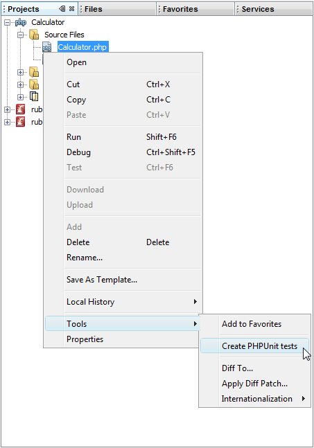

. The first time you create tests, a dialog opens asking you for the directory in which you want to store test files. In this example, the Browse function was used to create a  ``tests``  directory. 

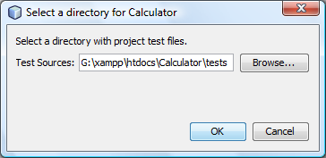

NOTE: You can manually write multiple tests for a project. If you write multiple tests, you can sort them into subfolders of the test file directory, such as "important" or "quick." You can then run tests in a subfolder by right-clicking that folder and selecting Run Tests.

image::images/test-in-folder.png[]

. The IDE generates a skeleton test class in a file called CalculatorTest.php, which appears in your Projects window and opens in the editor. 

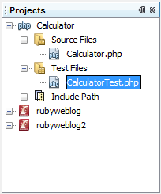

Note that a test is created for each  ``@assert``  annotation.

[source,php]
----

    /**
     * Generated from @assert (1, 1) == 2.
     */
    public function testAdd4()
    {
        $this->assertEquals(
          2,
          $this->object->add(1, 1)
        );
    }
----

. You can test either an individual file or the entire project. To test the project, right-click the project's parent node and select Test, or press Alt-F6. To test the Calculator.php file, right-clict the file's node and select Test, or press Ctrl-F6/⌘-F6. This example has only one class in one file, so the results are the same. The IDE runs the tests and displays the results in the Test Results window. 

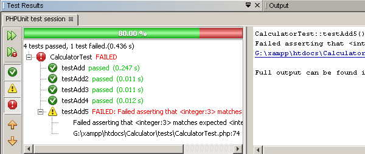

A more verbose textual version of the results is displayed in the Output window.

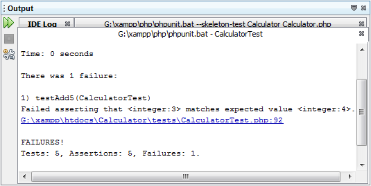

== Using Test Groups

You can select which groups of tests to execute when the test suite is run. For example, you could have some tests you want to run only in a production environment and other tests that you want to run in both production and development environments. You would place the former tests in a  ``production``  group and the latter tests in both  ``production``  and  ``development``  groups. When you run the test suite in your development environment, you select only the  ``development``  test group to execute.

You must enable test groups for a PHP project before you use test groups on any file in that project.

To mark a test as part of a test group, annotate the test method with  ``@group [group name]`` .

*To create and run test groups:*

1. In the Projects window, right-click the Calculator node and select Properties. The Project Properties open.
2. In the Project Properties, select the PhpUnit category. Select Ask for Test Groups Before Running Tests. Click OK.

image::images/test-group-properties.png[]

. Open  ``CalculatorTest.php``  in the editor.

. For the methods  ``testAdd`` ,  ``testAdd3``  and  ``testAdd5`` , add the annotation  ``@group production`` .

image::images/production-group-annotation.png[]

. For the methods  ``testAdd2``  and  ``testAdd4`` , add the annotations  ``@group production``  and  ``@group development`` . 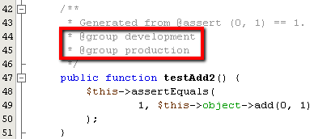

. Right-click the  ``Calculator.php``  node and select Test. A dialog opens, asking you which test groups to run. Select "development" and click OK. The IDE only runs the tests that are annotated with  ``@group development`` .

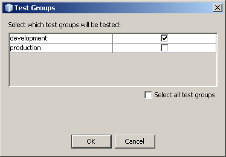

For more information about PhpUnit test groups in NetBeans IDE, see the NetBeans IDE for PHP blog post link:http://blogs.oracle.com/netbeansphp/entry/using_phpunit_test_groups[+Using PHP Unit Test Groups+].

[[result-windows]]
== Test Results and IDE Output

The results of PHPUnit tests are displayed in two of the IDE's windows, Test Results and Output. The Test Results window has a graphic pane and a short text pane. The Output window gives a more verbose textual version of the output. In this section, you explore the Test Results and Output windows in detail.

In the Test Results window, you get information about failed tests from these locations:

* Messages in the UI pane attached to the tree entry for the failed test
* Text in the right-side pane, including links to the lines of test code that failed
* Tooltip text that appears when you hover the cursor over a failed test in the UI pane

image::images/test-results-tooltip.png[]

The Test Results window includes the following buttons on the left side:

* Rerun the test image:images/rerun-button.png[]
* Show failed tests 
* Show passed tests 
* Show tests that passed but with errors 
* Navigate between showing the next test result image:images/next-test-button.png[] or the previous test result image:images/previous-test-button.png[]

The Output window shows the full output of the PHPUnit script. It can be useful when you cannot identify the cause of an error with the information in the Test Results window. Like Test Results, the Output window includes links to the test class line that failed. It also includes buttons on the left side for rerunning the test and for opening the PHP Options window. image:images/options-link-button.png[]

[[code-coverage]]
== Code Coverage

NetBeans IDE for PHP offers code coverage along with PHPUnit support. (The IDE also offers code coverage for Python). Code coverage checks whether all your methods are covered by PHPUnit tests. In this section, you see how code coverage works with your existing Calculator class.

*To use code coverage:*

1. Open Calculator.php and add a duplicate  ``add``  function, called  ``add2`` . The  ``Calculator``  class now looks like the following:

[source,php]
----

<?php
class Calculator {
    /**
     * @assert (0, 0) == 0
     * @assert (0, 1) == 1
     * @assert (1, 0) == 1
     * @assert (1, 1) == 2
     * @assert (1, 2) == 4
     */
    public function add($a, $b) {
        return $a + $b;
    }

    public function add2($a, $b) {
        return $a + $b;
    }

}    
?>

----

. Right-click the project node. From the context menu, select Code Coverage > Collect and Display Code Coverage. By default, Show Editor Bar is also selected. 

image::images/turn-on-code-coverage.png[]

. The editor now has a code coverage editor bar across the bottom. Because code coverage has not been tested, the editor bar reports 0% coverage. (It also displays this after you click Clear to clear test results.) 

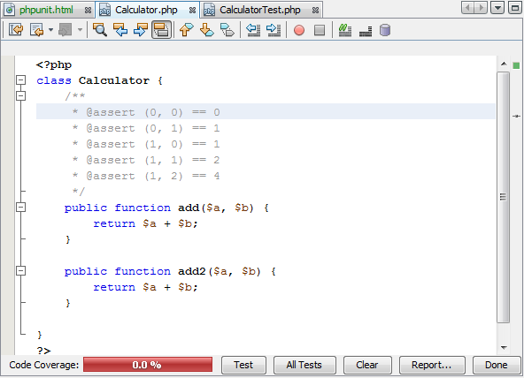

. Click Test to test the open file or All Tests to run all tests for the project. The Test Results display. In addition, the Code Coverage bar tells you what percentage of your executable code statements is covered by tests. In the editor window, covered code is highlighted in green and uncovered code is highlighted in red.

WARNING: If you re-generate the test files AFTER adding the add2 function, the PHPUnit tests will not run. This is because PHPUnit creates two conflicting testAdd2 functions. Do not differentiate functions by appending numbers at the end if you plan to use PHPUnit on more than one such function. See the link:http://www.phpunit.de/ticket/701[+the PHPUnit documentation+].

image::images/editor-bar-after.png[]

. In the Editor Bar, click on Report... The Code Coverage report opens, showing the results of all tests run on your project. Buttons in the report let you clear the results, run all the tests again, or deactivate code coverage (click Done). 

image::images/code-coverage-report.png[]

. You can add another class to your project, delete and recreate the test files and look at the code coverage report again. Your new class is listed. In the following report, the  ``Calculator``  class again has a function that is not included in the tests. 

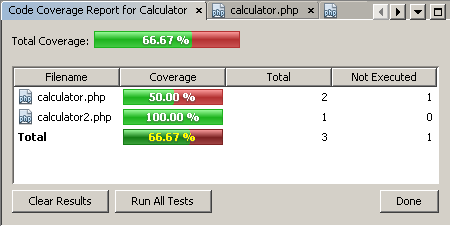

[[project-specific-configurations]]
== Using Project-Specific Configurations

In the IDE, you can select the following custom configurations for your project:

* A bootstrap file
* An XML configuration file
* A test suite
* A custom PHPUnit script

*To set a project-specific configuration:*

1. Right-click the project's node or the project's Test Files node and select Properties. This opens the Properties dialog.

image::images/project-ctxmenu.png[]

. Select the PHPUnit category. A dialog opens in which you can select a custom bootstrap, XML configuration, PHPUnit script, or test suite file.

image::images/proj-properties.png[]

. If you are not familiar with the structure of bootstrap or XML configuration files, you can use NetBeans IDE to generate a skeleton for you. You can also find instructions about using the dialog by clicking Help. 

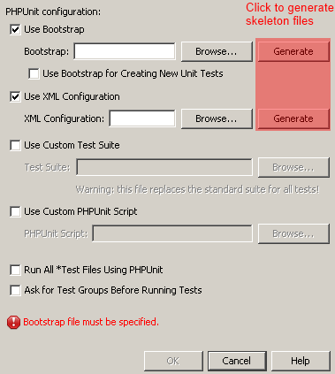

The _bootstrap option_ is required for projects that use a custom class loader, for example by implementing the  ``__autoload()``  magic function. You also use the bootstrap option if you need to include a file in advance, such as a file that defines global constants used by multiple classes in your project.

The _XML configuration file_ allows you to define options that you use in a command line call. There is a complete introduction in the link:http://www.phpunit.de/manual/3.3/en/appendixes.configuration.html[+PHPUnit manual+]. You can also use the XML configuration file to define  ``php.ini``  settings and global vars for your test cases. You can set the bootstrap option in the XML configuration file too.

If you set a _custom test suite,_ you run that suite whenever you select Run >Test Project. This is particularly useful when you wish to run only a subset of your tests, or if you want to use recently added features of PHPUnit that you have to add manually, such as Data Providers. Note that you may of course define as many test suites as you want and run them separately by right-clicking the file in your project explorer and choosing "run". To prevent confusion, NetBeans notifies you if you are using a custom Test Suite. The notification can be found in the Test Results and in the Output window.

You can use a _custom PHPUnit script_ for a project, instead of the default script selected in Tools > Options. The custom PHPUnit script can include any command-line switches described in the link:http://www.phpunit.de/manual/3.7/en/textui.html[+PHPUnit manual+].

 

[[selenium]]
== Running Tests on the Selenium Framework

Selenium is a portable software testing framework for web applications. The tests can be written as HTML tables or coded in a number of popular programming languages and can be run directly in most modern web browsers. Selenium can be deployed on Windows, Linux, and Macintosh. For more details see the link:http://docs.seleniumhq.org[+Selenium web site+].

NetBeans IDE has a plugin that includes a Selenium server. With this plugin, you can run Selenium tests on PHP, Web Application, or Maven projects. To run Selenium tests on PHP, you need to install the Testing Selenium package to your PHP engine.

*To run Selenium tests on PHP:*

1. Open a command prompt and run the command  ``pear install Testing_Selenium-beta`` . You need `` PHP_HOME/php/PEAR``  on your Path. If the command is successful, the prompt will display  ``install ok: channel://pear.php.net/Testing_Selenium-0.4.3`` .
2. In the IDE, open Tools > Plugins and install the Selenium Module for PHP.
3. In the Projects window, right-click the project node for your Calculator project. Select New > Other. The New File wizard opens. Select Selenium and click Next. 

image::images/new-selenium.png[]

. The first time you create a Selenium test, a dialog opens asking you to set a directory for Selenium test files. This should be a separate directory from PHPUnit test files. Otherwise, the Selenium tests run every time you run unit tests. Running functional tests like Selenium usually takes more time than running unit tests, therefore you will probably not want to run these tests every time you run unit tests.

. Accept the defaults in the Name and Location page and click Finish. The new Selenium test file opens in the editor and appears in the Projects window. 

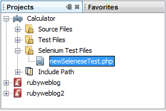

. The Run Selenium Tests item is now added to the project's context menu. Click this item, and the Selenium test results display in the Test Results window, the same as PHPUnit tests.

[[more-exercises]]
== More Exercises

Here are a few more ideas for you to explore:

* Add a second class to Calculator.php, such as a  ``Calculator2``  class that multiplies $a and $b. Delete and regenerate the tests.
* If you try the multi-part xref:wish-list-tutorial-main-page.adoc[+Creating a CRUD Application tutorial+], create a Selenium test for the final project.

