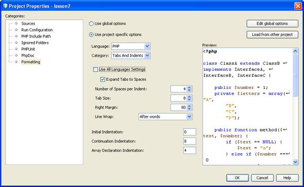

// 
//     Licensed to the Apache Software Foundation (ASF) under one
//     or more contributor license agreements.  See the NOTICE file
//     distributed with this work for additional information
//     regarding copyright ownership.  The ASF licenses this file
//     to you under the Apache License, Version 2.0 (the
//     "License"); you may not use this file except in compliance
//     with the License.  You may obtain a copy of the License at
// 
//       http://www.apache.org/licenses/LICENSE-2.0
// 
//     Unless required by applicable law or agreed to in writing,
//     software distributed under the License is distributed on an
//     "AS IS" BASIS, WITHOUT WARRANTIES OR CONDITIONS OF ANY
//     KIND, either express or implied.  See the License for the
//     specific language governing permissions and limitations
//     under the License.
//

= Setting Up a PHP Project
:jbake-type: tutorial
:jbake-tags: tutorials 
:jbake-status: published
:syntax: true
:icons: font
:source-highlighter: pygments
:toc: left
:toc-title:
:description: Setting Up a PHP Project - Apache NetBeans
:keywords: Apache NetBeans, Tutorials, Setting Up a PHP Project
:reviewed: 2019-02-02

This tutorial shows you how to set up a PHP project in NetBeans IDE.

== Requirements

To follow this tutorial, you need the following software and resources.

|===
|Software or Resource |Version Required 

|A PHP engine |Version 5 

|A web server |link:http://httpd.apache.org/download.cgi[+Apache HTTP Server 2.2+] is recommended.
 

|A PHP debugger |link:http://www.xdebug.org[+XDebug 2.0 or later+] 
|===

== Getting Ready

Before creating a PHP project, you need to download and install the xref:../../../download/index.adoc[NetBeans IDE for PHP] and xref:../php.adoc#configuration[+prepare your environment+] for PHP development.

To set up a PHP project:

* <<location,Specify the project name and the location for the project's source files>>
* <<runConfiguration,Specify the way to deploy your project>>

To change the settings of an existing project, position the cursor on the project node and choose Properties from the popup menu. Proceed as described in section <<managingProjectSetup,Customizing the Project Setup>>.

== Specifying the Project Name and Location of the Source Files

1. Start the IDE and switch to the Projects window.
2. Choose File > New Project. The Choose Project panel opens.
3. In the Categories list, choose PHP.

Depending on your needs, you can create a completely new PHP project <<projectNoExistingSources,without any previously developed source files>>, or <<importSources,import an existing local PHP application>> or remote PHP application into a new project.

=== Project without Previously Developed Source Files

1. In the Projects area, choose PHP Application and click Next. The New PHP Project > Name and Location panel opens.
2. In the Project Name text field, enter the name of the project.
3. In the Sources Folder field, specify the subfolder of your document root where you want to store your source files.

The document root is the folder where the local web server looks for files to open in the browser. The document root is specified in the web server xref:../php.adoc#configuration[+configuration file+]. After installation, the New Project wizard locates the document root and by default specifies the following path:  ``<Document Root>\<New PHP Project>`` .

A copy of the source files must be kept in a subfolder of the document root. However, you can have your Sources Folder in a different location than the document root and copy source files from this location to the document root. See <<copy-sources,Specifying the Run Configuration>>.

. From the Default Encoding dropdown list, choose the default encoding for your project.
. If you want to store NetBeans metadata in a different location than your source files, select "Put NetBeans metadata into a separate directory." For example, you might want to store your sources in your document root but the NetBeans metadata in your NetBeansProjects directory. 

image::images/new-php-project-m1.png[]

. Click Next. The Run Configuration panel opens.

=== Importing Existing Local Source Files into a Project

1. In the Projects area, choose PHP Application with Existing Sources and click Next. The New PHP Project > Name and Location panel opens.
2. In the Project Name text field, enter the name of the project.
3. In the Sources Folder field, specify the folder from where you want to import the source files.

NOTE: If you are going to run the <<localServer,project on a local web server>>, do not forget to specify <<copyFilesFromSourcesFolder,copying the source files>> to it.

. From the Default Encoding dropdown list, choose the default encoding for your project.
. If you want to store NetBeans metadata in a different location than your source files, select "Put NetBeans metadata into a separate directory." For example, you might want to store your sources in your document root but the NetBeans metadata in your NetBeansProjects directory. 

image::images/new-php-project-with-ssources.png[]

. Click Next. The Run Configuration panel opens.

=== Importing Existing Remote Source Files into a Project

1. In the Projects area, choose PHP Application from Remote Server and click Next. The New PHP Project > Name and Location panel opens.
2. In the Project Name text field, enter the name of the project.
3. In the Sources Folder field, specify the subfolder of your _local_ document root where you want to store your source files.

The document root is the folder where the local web server looks for files to open in the browser. The document root is specified in the web server xref:../php.adoc#configuration[+configuration file+]. After installation, the New Project wizard locates the document root and by default specifies the following path:  ``<Document Root>\<New PHP Project>`` . Note that it is useful to be able to test the project on a local server.

. If you want to store NetBeans metadata in a different location than your source files, select "Put NetBeans metadata into a separate directory." For example, you might want to store your sources in your document root but the NetBeans metadata in your NetBeansProjects directory.
. Click Next. The Remote Connection panel opens. The tutorial xref:remote-hosting-and-ftp-account.adoc[+Deploying a PHP Application to a Remote Web Server+] describes how to set up remote connections.

== Specifying the Default Run Configuration of the New Project

A run configuration is a stored setting for running a PHP project. You can define several configurations for one project and switch between them back and forth. For example, if an application has been developed locally and needs to be uploaded to a remote production server, you only need to choose another run configuration. Run configurations apply to both running and debugging. Run configurations accommodate the following common use cases:

* Developing PHP web pages on a local machine with a local web server.
* Executing PHP scripts using a local PHP engine. This approach is applied to PHP files that are not intended for outputting HTML. Therefore such scripts can be run without a browser.
* Remote Development. The PHP source code and other application files are uploaded to a remote web server via FTP. This use case is common when the development is shared across multiple people.
* A combination of the above use cases: an application is developed locally and deployed on a remote production server upon completion. During development, PHP scripts are executed if necessary.

When you create a new PHP project, you create the project's default run configuration. To set the default run configuration for your project, choose the relevant option from the Run As dropdown list on the Run Configuration panel. The following options are available:

* <<localServer,Local Web Site>>. To use this run configuration, you need the xref:../php.adoc#configuration[+Apache http server installed+] and running.
* xref:remote-hosting-and-ftp-account.adoc[+Remote Web Site (FTP/SFTP) (Separate tutorial)+]. To use this configuration, you need a xref:remote-hosting-and-ftp-account.adoc#registerHostingAccount[+hosting account+] on a remote server and an xref:remote-hosting-and-ftp-account.adoc#createFTPAccount[+FTP account+] on this server.
* <<scriptCommandLine,Script>>. This run configuration does not require that a web server be installed and running. You only need a xref:../php.adoc#configuration[+PHP engine+].

The process for creating additional run configurations, or editing the default run configuration, is described in <<runConfiguration,Customizing the Project Setup: Run Configuration>>. It is almost identical to the process for creating the default run configuration, except that you use the Properties dialog of the existing project instead of the new project wizard.

=== Local Web Site

A local web site configuration involves a copy of your PHP source folders in the Web folder of the Apache web server installed on your machine. It is common practice for a project to have both a local and a remote web site configuration. Note that the procedure for setting up the local web site run configuration differs slightly depending on whether you are creating a project from existing sources or without existing sources.

To set up a local web site configuration:

1. From the Run As dropdown list, choose Local Web Site.
2. In the Project URL field, check the automatically generated URL address. Make sure that the Apache HTTP server listens to the default port 80. If not, specify the port number explicitly, in the format  ``localhost:<port number>`` .

image::images/run-configuration-local-server-project-with-existing-sources.png[]

. If you are creating the project from existing sources, you can choose which source file to use as the index file.
. To store the project's source files in a different directory than the NetBeans IDE project, select "Copy files from Sources Folder to another location". _If you are creating a project from existing sources, this is a required step, unless the existing sources were already in the web folder of your Apache server._
The field by default specifies the following path: `` <Document Root>\<New PHP Project>`` . Use the Browse button to specify a different path, if necessary.
The document root is the folder where the web server looks for files to open in the browser. The document root is specified in the web server xref:../php.adoc#configuration[+configuration file+]. 
The wizard detects the Apache installation type, either a component or within a package, and provides the path to the default location of the  ``htdocs``  folder for the current installation type. Therefore, if you accepted the default settings during the installation of the Apache server or the AMP package, choose the path from the dropdown list.

. Click Finish. The IDE creates your PHP project.

=== Remote Web Site

See the tutorial xref:remote-hosting-and-ftp-account.adoc[+Deploying a PHP Application to a Remote Web Server+].

=== Script

1. From the Run As dropdown list, choose Script.

image::images/project-properties-script.png[]

. To specify the location of the PHP engine, click the Configure button next to the Use Default PHP Interpreter box. The PHP Options dialog opens on the General tab.

image::images/run-config-script-options-m1.png[]

. In the PHP 5 Interpreter field, specify the path to the  ``php.exe``  file. Use the Browse or Search... button, if necessary.
. To specify how the script execution results will be shown, select the relevant checkbox in the Open Result In area. The following options are available:

* Output Window. The results of executing a script will appear in the output window in the bottom of the NetBeans IDE window.
* Web Browser. The default browser window will open with the results of executing a script in the form of an HTML file.
* Editor. The results of executing a script will open as an HTML file in the IDE editor window.

. Click OK. The Options dialog box closes and the system returns to the Run Configuration panel. 
. Add any arguments, such as  ``debug=true`` , and any link:http://www.php.net/manual/en/features.commandline.options.php[+PHP command-line options+].

== Customizing the Project Setup

During the project creation, the basic project settings are defined: the project type, location of the project source files, and the default run configuration. To expand the project setup with new settings, customize the project. Position the cursor on the project node and choose Properties from the popup menu. The Project Properties panel opens with a list of settings categories.

=== Sources

On the Sources panel:

1. The Web Root field shows the root folder of your application site. By default, the field shows the Sources folder. To change the web root, click Browse and select another folder.
2. Select the <<location,Copy files from Sources Folder>> to another location, if necessary, and specify the path to the storage folder.
3. Change the encoding, if necessary 

image::images/pprop-sources.png[]

. To complete the project customization, click OK.

=== Run Configuration

On the Run Configuration panel, modify the default run configuration and/or define new run configurations, if necessary. 

1. To modify the default settings, <<runConfiguration,update the fields as during the project creation>>.
2. To define a new run configuration, click New next to the Configuration dropdown list. The Create New Configuration dialog box opens.
3. In the Configuration Name field, enter the name of the new run configuration and click OK. You return to the Run Configuration panel.
4. Define the run configuration settings in the same way as you defined the <<runConfiguration,default run configuration>> during the project creation and click OK. The new configuration is added to the Configuration dropdown list.
5. To remove a configuration, select it from the Configuration dropdown list and click Delete. 

image::images/pprop-runconfig.png[]

. To complete the project customization, click OK.

=== PHP Include Path

On the Include Path panel, specify the location of the files that you need to use in the project but do not need to locate together with the source files.

1. To add a folder, click Add Folder. The Select Folder(s) dialog box opens.
2. Select the relevant folders and click Open. You return to the PHP Include Path panel. The new folder is added to the list.
3. To navigate through the list, use the buttons Move Up and Move Down.
4. To remove a folder from the list of included folder, select the folder and click Remove.

image::images/pprop-include-path.png[]

. To complete the project customization, click OK.

=== Formatting

On the Formatting panel, define the formatting style you want to apply to your source files in the editor. You may define either global or project-specific formatting.

==== To define global IDE formatting:

1. Choose "Use global options".
2. Click Edit Global Options. The IDE Options dialog opens, on the Editor > Formatting tab. 

image::images/global-formatting.png[]

. From the Language dropdown list, select the language to which the settings should be applied.
. From the Categories dropdown list, select the format items to which the setting will be applied.
. Set your desired formatting and click OK.
. Click the Help button for detailed information.

==== To define project-specific formatting:

1. Choose "Use project-specific options". The hidden area displays. 
2. From the Language dropdown list, select All Languages or PHP. In this case, All Languages means PHP and all other languages you have in your PHP project.
3. From the Categories dropdown list, select the format items to which the setting will be applied.
4. Set your desired formatting and click OK.
5. Click the Help button for detailed information.

=== Adding JavaScript Libraries

Built-in JavaScript libraries were removed in NetBeans IDE 6.7 because they were very large and slowed performance and it is easy to add libraries manually. Manually adding JavaScript libraries to your project enables Code Completion and all other JavaScript-related functionality in the IDE for your project.

==== To add JavaScript Libraries to your project:

1. Download the JavaScript libraries you need, or locate them if you already have them.
2. Copy the JavaScript libraries to your PHP project folder, using the IDE or a file explorer.

If your project properties are set so that project sources are copied to another location (see <<sources,Sources>>), the JavaScript libraries are also copied to this location. If your project is deployed on a remote server, the JavaScript libraries are uploaded to that server the next time your project sources are uploaded to the server.

