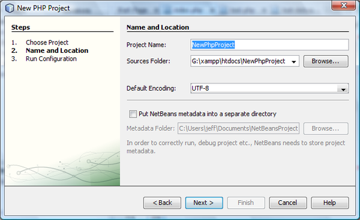
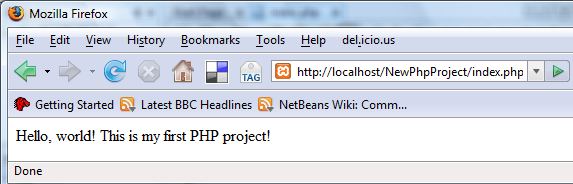

// 
//     Licensed to the Apache Software Foundation (ASF) under one
//     or more contributor license agreements.  See the NOTICE file
//     distributed with this work for additional information
//     regarding copyright ownership.  The ASF licenses this file
//     to you under the Apache License, Version 2.0 (the
//     "License"); you may not use this file except in compliance
//     with the License.  You may obtain a copy of the License at
// 
//       http://www.apache.org/licenses/LICENSE-2.0
// 
//     Unless required by applicable law or agreed to in writing,
//     software distributed under the License is distributed on an
//     "AS IS" BASIS, WITHOUT WARRANTIES OR CONDITIONS OF ANY
//     KIND, either express or implied.  See the License for the
//     specific language governing permissions and limitations
//     under the License.
//

= Getting Started with PHP Applications
:jbake-type: tutorial
:jbake-tags: tutorials 
:jbake-status: published
:syntax: true
:icons: font
:source-highlighter: pygments
:toc: left
:toc-title:
:description: NetBeans IDE PHP Quick Start Tutorial - Apache NetBeans
:keywords: Apache NetBeans, Tutorials, NetBeans IDE PHP Quick Start Tutorial
:reviewed: 2019-02-02

This document provides general guidelines for preparing the environment for PHP development, setting up a PHP project, and developing and running your first PHP application in the NetBeans IDE for PHP.

== Requirements

To follow this tutorial, you need the following software and resources.

|===
|Software or Resource |Version Required 

|A PHP engine |Version 5 

|A web server |link:http://httpd.apache.org/download.cgi[+Apache HTTP Server 2.2+] is recommended.
 

|A PHP debugger |link:http://www.xdebug.org[+XDebug 2.0 or later+] 
|===

You can install the PHP engine, web server and database separately or use AMP (Apache, MySQL, PHP) packages.

== Installation and Configuration

The following documents contain instructions for one or two ways to set up a PHP web stack on your operating system. These instructions are not definitive. The web stack consists of third-party software, your environment may differ, and you might prefer a different AMP package or another way to set up PHP. You might need to supplement our instructions with your own investigations.

* xref:configure-php-environment-windows.adoc[+Configuring PHP Development Environment in Windows+]
* xref:configure-php-environment-ubuntu.adoc[+Configuring PHP Development Environment in the Ubuntu Linux Distribution+]
* xref:configure-php-environment-mac-os.adoc[+Configuring PHP Development Environment in Mac Operating System (Mac OS X)+]

== Setting up a PHP Project in the NetBeans IDE for PHP

For help in installing and starting NetBeans IDE, please see the link:https://netbeans.org/community/releases/73/install.html[+installation documentation+].

To start PHP development in the NetBeans IDE for PHP, you first need to create a project. A project contains the information on the location of the project files and the way you want to run and debug your application (run configuration).

1. Start the IDE, switch to the Projects window, and choose File > New Project. The Choose Project panel opens.
2. In the Categories list, choose PHP.
3. In the Projects area, choose PHP Application and click Next. The New PHP Project > Name and Location panel opens. 

. In the Project Name text field, enter  ``NewPHPProject`` .
. In the Sources Folder field, browse for your PHP document root and create a subfolder there called  ``NewPHPProject`` . The document root is the folder where the web server looks for files to open in the browser. The document root is specified in the web server xref:index.adoc#configuration[+configuration file+]. For example, on Xampp, the document root is XAMPP_HOME/htdocs.
. Leave all other fields with their default values. Click Next. The Run Configuration window opens. 

image::images/new-project-run-config.png[]

. In the Run As drop-down list, select Local Web Site. The project will run on your local Apache server. Your other options are to run the project remotely via FTP and to run it from the command line.
. Leave the Project URL at default.
. Click Finish. The IDE creates the project.

Learn more about xref:project-setup.adoc[+Setting up a PHP project in NetBeans+].

== Running Your First PHP Project

1. Start the IDE, choose File > Open Project. The Open Project dialog box opens.
2. Select  ``NewPHPProject``  and click Open Project. The NewPHPProject tree appears in the Projects window and the project's  ``index.php``  file opens in the editor and in the Navigator window. 

image::images/getting-started-open-new-project.png[]

. Enter the following code inside the  ``<?php ?>``  block:

[source,php]
----

 echo "Hello, world! This is my first PHP project!";
----

. To run the project, position the cursor on the NewPHPProject node and choose Run from the context menu. The figure below shows what you should see in the browser window:

Congratulations! Your program works!

== Using Database Servers with NetBeans IDE for PHP

You can use various database servers with the NetBeans IDE for PHP, although the most popular is the MySQL server. Downloads are available link:http://dev.mysql.com/downloads/mysql/5.1.html[+here+]. 
