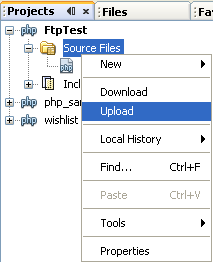
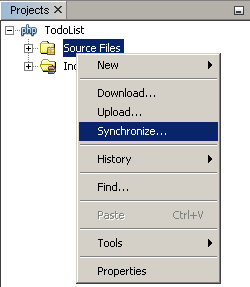
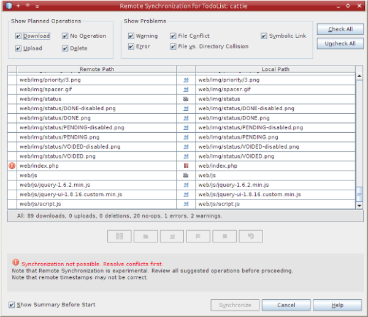
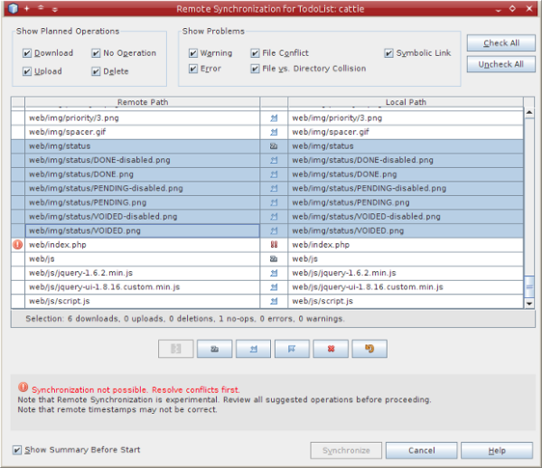
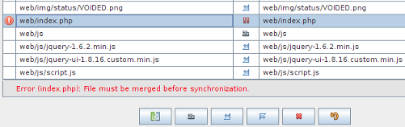

// 
//     Licensed to the Apache Software Foundation (ASF) under one
//     or more contributor license agreements.  See the NOTICE file
//     distributed with this work for additional information
//     regarding copyright ownership.  The ASF licenses this file
//     to you under the Apache License, Version 2.0 (the
//     "License"); you may not use this file except in compliance
//     with the License.  You may obtain a copy of the License at
// 
//       http://www.apache.org/licenses/LICENSE-2.0
// 
//     Unless required by applicable law or agreed to in writing,
//     software distributed under the License is distributed on an
//     "AS IS" BASIS, WITHOUT WARRANTIES OR CONDITIONS OF ANY
//     KIND, either express or implied.  See the License for the
//     specific language governing permissions and limitations
//     under the License.
//

= Deploying a PHP Application on a Remote Web Server Using the NetBeans IDE
:jbake-type: tutorial
:jbake-tags: tutorials 
:jbake-status: published
:syntax: true
:source-highlighter: pygments
:icons: font
:toc: left
:toc-title:
:description: Deploying a PHP Application on a Remote Web Server Using the NetBeans IDE - Apache NetBeans
:keywords: Apache NetBeans, Tutorials, Deploying a PHP Application on a Remote Web Server Using the NetBeans IDE

Normally, a real-life PHP application is run on a remote server. Remote applications are accessed either through a version control system or through File Transfer Protocol (FTP).

NOTE: NetBeans provides basic support for FTP/SFTP, sufficient for a lone developer to work on a simple project. If you are working on a complex project or with multiple developers, you should use a version control system. NetBeans IDE supports a number of version control systems. See our xref:../ide/subversion.adoc[+Subversion+] and xref:../ide/git.adoc[+Git+] tutorials, for example. If you must use FTP/SFTP with a complex project, consider using the IDE in combination with a full-featured FTP client, and editing the PHP project in the IDE as a local web site.

*JDK 7 + Windows 7/Vista:* Windows 7 and Windows Vista firewall blocks some FTP operations that are launched by JDK 7. See link:http://forums.netbeans.org/post-115176.html#113923[+NetBeans forum+] for workaround.

To deploy your PHP application on a remote server, you will need to register an account on a hosting provider. You can also deploy a MySQL database on the remote server where you have a hosting account.

All the user names, passwords, and email addresses are fake and used as examples only. The administration of the hosting blocks an account if the user does not show up on the forum for more than a week. So you may fail to apply exactly the same user names, passwords, email addresses, and other credentials from the tutorial.

*To follow this tutorial, you need the following software and resources.*

|===
|Software or Resource |Version Required 

|A PHP engine |Version 5 

|A hosting account and 
an FTP account on a remote server |For example, link:http://x10hosting.com/[+x10Hosting+] 
provides free FTP account hosting. 

|A PHP debugger (optional) |link:http://www.xdebug.org[+XDebug 2.0 or later+] 
|===

== Setting Up Run Configuration for PHP Projects to be Hosted Remotely

If you have a hosting account on a remote Web server and an FTP account to transfer your source files to the remote server, you can create and debug your PHP project locally and then deploy it on the remote server. With the concept of Run Configurations, you can switch between these workflows within the same NetBeans PHP project by changing the Run Configuration type from Local Web Site to Remote Web Site.

To enable running a PHP application on a remote web server, you need to set up a run configuration that contains an FTP connection profile.

If you already have a project with a default run configuration and you want to add a new remote run configuration, xref:project-setup.adoc#managingProjectSetup[+customize your project+]:

1. Click the right mouse button on the project node and choose Properties from the popup menu. The Project Properties panel opens.
2. From the Categories list, choose Run Configuration. The Run Configurations panel opens.
3. <<chooisngRunConfigurationType,Choose the run configuration type>> and <<specifyFTPConnectionSettings,specify the (S)FTP connection settings>> as described in the sections below.

To create a NetBeans project for a PHP application on a remote server, or to create a new project that uses a remote run configuration as default:

1. Start the IDE, choose File -> New Project. The New Project panel opens.
2. Choose PHP from the Categories and choose the PHP Application from Remote Server. Then click Next. The Name and Location panel opens.
3. Specify the project name, the location of the application source files, and the location of the project internal files (optional). Click Next. The Run Configuration panel opens.
4. <<specifyFTPConnectionSettings,Specify the FTP connection settings>> as described in the section below.

=== Choosing the Run Configuration Type

On the Run Configurations panel, choose Remote Web Site (FTP, SFTP) from the Run As dropdown list. The hidden area for setting up the configuration displays.

If you are creating a new project with the PHP Application from Remote Server wizard, you do not need to choose from the Run As dropdown list. The wizard automatically takes you to the Remote Connection panel. This panel has only Project URL, Remote Connections and Upload Directory fields.

image::images/ftp-run-config-blank.png[]

=== Specifying the (S)FTP Connection Settings

To create an FTP connection:

1. Click Manage next to the FTP Connection dropdown list. The Manage Remote Connections dialog box displays.
2. Click Add. The Create New Connection dialog box opens. (It may open automatically if you are defining your first connection.)
3. In the Connection Name field, enter the name of the new connection. In this example the connection name is  ``x10hosting`` . From the Type dropdown list, choose FTP or SFTP. Click OK. The Manage Remote Connections dialog box displays with the name of the new connection in the Connection Name display field.
4. In the Host Name field, enter the FTP Server name as it is written in the FTP account creation confirmation message. In this example, the FTP server is  ``nbuser.x10.mx`` .
5. In the Port field, specify 21.
6. In the User Name field, enter your FTP Username as it is written in the FTP account creation confirmation message. In this example, the FTP username is  ``nbuser`` .
7. Fill in the Password field. In this example the password is  ``qwerty1234`` .
8. In the Initial Directory field, enter the name of your account directory on the FTP server. In this example, no account directory is specified, enter a slash in the field. 

image::images/manageremoteconnections.png[]

. Click OK. You return to the Run Configuration panel.

. In the Upload Directory field, enter the name of the subfolder in the initial directory where the source files will be uploaded. The prompt below the field shows the FTP host URL.

. To complete setting up a new project, click Finish.

== Uploading the Source Files to a Remote Server

After you choose the remote connection for your project, select whether to upload your source files on run, on save, or manually.

*On Run:* Source files are uploaded to the server when you run the project.
*On Save:* Every change (create, edit, rename, delete) is immediately propagated to your remote server. If the operation takes more than 1 second, a progress bar is shown.
*Manually:* Files are never uploaded automatically. You must use the IDE's manual upload function, described in this section.

image::images/ftp-run-config.png[]

To manually upload files from your project to your FTP server, right-click the Source Files node of your project and select Upload. Note that you can also download files from your FTP server in the same menu.

When you start to upload files, a dialog opens with a tree view of the source files. In this dialog, you can select individual files to upload or not upload. For more information, see the link:http://blogs.oracle.com/netbeansphp/entry/new_download_upload_dialog[+NetBeans PHP blog entry+] on the File Upload dialog.

image::images/file-upload-dialog.png[]

While you upload files, the results of your upload appear in an output tab.

image::images/upload-output.png[]

[[remote-synchronization]]
== Remote Synchronization

For developers who must work over (S)FTP in multiple developer environments without proper version control, NetBeans IDE provides remote synchronization. Remote synchronization allows you to compare your local copy of project files with the copies on the (S)FTP server. You can upload your local copy to the server or download the server's copy to your local machine. When the copy on the server was updated after you began work on your local copy, NetBeans IDE warns you of a file conflict. When there is a file conflict, NetBeans IDE lets you diff your local version with the version on the server and decide which version to accept on a line-by-line basis.

*Warning:* Remote synchronization is never 100% reliable because the timestamps on FTP servers are not 100% reliable. Version control is a safer solution.

*Caution:* Remote synchronization works more reliably when you perform it on an entire project. You can perform remote synchronization on individual files but this has higher risk.

*To perform remote synchronization:*

1. In the Projects window (Ctrl-1), expand the node for the PHP project that you want to synchronize. Right-click the Source Files node. The context menu appears, including the Synchronize option. 

. Select Synchronize. The IDE retrieves the file names and paths from the remote server and opens the Remote Synchronization dialog.

The Remote Synchronization dialog shows a table of project files. The remote versions on the file are on the left and the local versions are on the right. In the center column is an icon showing the operation that the IDE will perform on synchronization. Warning icons are on the far left. A summary of operations and problems appears at the bottom of the table. A verbose description of any errors appears below the table. Above the table are sets of checkboxes for filtering which problems and operations the dialog shows. For detailed information about this dialog, click Help.

. Select multiple items in the table. At the bottom of the table the summary now only includes those items.

. Right-click the selected items. A context menu of possible operations appears. 

image::images/context-menu.png[]

. If an item has a Resolve Conflicts error icon, select that item. A description of the error appears at the bottom of the table.

. Select the item with an error. Select Diff... image:images/diff-icon.png[] from either the row of buttons or from the context menu. The Diff dialog opens. In this dialog, scroll down to each difference between the remote and local versions of the file. In the graphics view, you can apply or refuse to apply the remote change to your local file. If you want to edit the file manually, switch to the Textual tab. When you are finished with the diff, click OK. You return to the Remote Synchronization dialog. The operation for the file changes to Upload and the file is marked with an asterisk, because you changed it.

image::images/diff.png[]

. If you have no conflict, click Synchronize. If you selected Show Summary Before Start, the Synchronize summary appears so you can review the operations one more time before performing the synchronization. If you approve of the operations, click OK.

image::images/sync-summary.png[]

The IDE performs the synchronization. You can follow the progress of the synchronization in a window that the IDE opens.

image::images/sync-progress.png[]

== Running a PHP Application

To run a PHP application on a remote server:

1. On the Properties panel, make sure that the Remote Web Site is chosen from the <<chooisngRunConfigurationType,Run As dropdown list>>.
2. Check the Run Configuration settings.
3. If the project is set as main, click image:images/run-main-project-button.png[] on the toolbar.
4. If the project is not set as main, position the cursor on the project node and choose Run from the popup menu.

[[remote-mysql-database]]
== Using a Remote MySQL Database

Remote hosting services such as x10Hosting.com usually allow you to set up a MySQL database on their servers. You can create databases, manage users, and copy, read, update, or delete (CRUD) data with the tools provided by the remote hosting service.

For example, if you are using x10Hosting.com, you create a MySQL database by logging onto the x10Hosting cPanel and then opening the MySQL Databases panel. You can also create users, assign users to databases, and grant privileges to users in the MySQL Databases panel. You then can use the CRUD tools in the phpMyAdmin panel.

An alternative to working with remote database CRUD tools is to use NetBeans IDE's CRUD features to work with a local database. Then you can copy or dump the local database to the remote database. On x10Hosting.com, you can use their phpMyAdmin panel to upload the local database.
