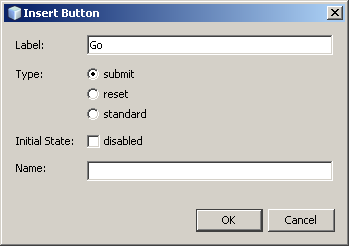
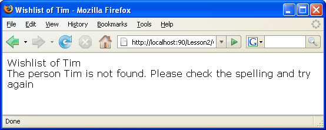

// 
//     Licensed to the Apache Software Foundation (ASF) under one
//     or more contributor license agreements.  See the NOTICE file
//     distributed with this work for additional information
//     regarding copyright ownership.  The ASF licenses this file
//     to you under the Apache License, Version 2.0 (the
//     "License"); you may not use this file except in compliance
//     with the License.  You may obtain a copy of the License at
// 
//       http://www.apache.org/licenses/LICENSE-2.0
// 
//     Unless required by applicable law or agreed to in writing,
//     software distributed under the License is distributed on an
//     "AS IS" BASIS, WITHOUT WARRANTIES OR CONDITIONS OF ANY
//     KIND, either express or implied.  See the License for the
//     specific language governing permissions and limitations
//     under the License.
//

= Lesson 2: Designing the Application. Reading from the Database
:jbake-type: tutorial
:jbake-tags: tutorials 
:jbake-status: published
:syntax: true
:icons: font
:source-highlighter: pygments
:toc: left
:toc-title:
:description: Lesson 2: Designing the Application. Reading from the Database - Apache NetBeans
:keywords: Apache NetBeans, Tutorials, Creating a Database Driven Application With PHP
include::../../../inc/database.adoc[]

In this lesson you create and configure the PHP project to develop your application, create a list of pages in the application, and define the relations between them. You also develop basic application functionality and test it against the data you entered in the sample database in lesson 1.

The PHP code you write in this lesson performs the following functions:

1. Gets the name of a person that the user types in.
2. Checks whether that person is really in the database. Exits with an error message if the person is not in the database.
3. Displays a table of that person's wishes.

The current document is a part of the Creating a Database-Driven Application in the NetBeans IDE for PHP tutorial.

== Creating a PHP Project

Select File > New Project (Ctrl-Shift-N on Windows and Linux, ⌘-Shift-N on MacOS). Create a new PHP project named "wishlist". When you create a PHP project, it contains the index file  ``index.php``  by default. For information on creating and configuring a PHP project, see xref:project-setup.adoc[+Setting Up a PHP Project+].

== Defining a Page Flow Diagram

The scope of your application covers the following use cases:

1. The user views the wish list of a person.
2. The user registers as a new wisher.
3. The user logs in and creates her/his wish list.
4. The user logs in and edits his/her wish list.

To cover this basic functionality, you will need to implement the following PHP files:

1. The "front" page index.php for logging in, registering, and switching to wish lists of other users.
2. The wishlist.php page for viewing the wish list of a particular wisher.
3. The createNewWisher.php page for registering as a wisher.
4. The editWishList.php page for editing a wish list by its owner.
5. The editWish.php page for creating and editing wishes.

image::images/page-flow-diagram.png[]

Now that you have finished the preliminary steps, you can start implementing the basic functionality of your application. Start with viewing the wish list of a wisher. This feature does not involve any validations and can be easily tested as you have already entered the test data into the database. The feature's functionality will be implemented on two pages, index.php and wishlist.php.

== Adding a Form To index.php

The index.php file will not contain any PHP code so you can easily remove the following block:

The  ``index.php``  file is used for two purposes:

* Displaying a page with controls for entering data.
* Transferring the entered data to another PHP file, where the data is processed. In this tutorial, the data is passed to a file named  ``wishlist.php`` , which you create and code in the next section.

These actions are performed using an HTML form. Each HTML form contains:

* A set of fields that correspond to the controls on the page.
* The "action" that is performed after the user submits the data on the form. The action is represented by the path to the page that processes the data.

*To add a form to index.php:*

1. Switch to the Projects window, expand your project node and the Source Files node, and double click the  ``index.php``  file. The  ``index.php``  file opens in the main IDE editor area. The file contains a template for entering HTML and PHP code.

NOTE: You can ignore warnings from the HTML validator.

. Remove the PHP block. The index.php file will not contain any PHP code.

image::images/remove-php-block.png[]

. Open the Palette from the Window menu or by pressing Ctrl-Shift-8.

. From the Palette's* HTML Forms* section, drag and drop a Form into the <body> section of  ``index.php`` . 

image::images/form-dnd.png[]

. The Insert Form dialog opens. In the Action field, type the path to the file to which the form will transfer data. In this case, type in  ``wishlist.php`` . (You will create this file in the same location as  ``index.php`` . See <<createNewFile,Creating wishlist.php and Testing the Application>>.) Select the GET method for transferring data. Give the form an arbitrary name, such as  ``wishList`` . Click OK when you are done.

image::images/insert-form-dialog.png[]

The file now looks like this:

image::images/blank-form.png[]

. Between the opening and closing tags of the form, type the text "Show wish list of: ".

. Drag a Text Input component from the *HTML Forms* section of the Palette to the space after the text "Show wish list of: ". The Insert Text Input dialog opens.

. Name the input  ``user`` . Select input type  ``text`` . Leave all other fields empty and click OK.

image::images/insert-text-input.png[]

The file now looks like this:

image::images/form-with-text-input.png[]

. Add a blank line above the </form> tag. Into this blank line, drag and drop a Button component from the* HTML Forms* section of the Palette.

. The Insert Button dialog opens. Type  ``Go``  into the Label field and click OK.

. The form now looks like the code below, with one difference. In the code below, the  ``method``  attribute is explicit in the `<form>` tag. NetBeans IDE did not add a method attribute to your form because GET is the default value of this attribute. However, you might understand the code more easily if the  ``method``  attribute is explicit.

[source,html]
----
<form action="wishlist.php" method="GET" name="wishList">
    Show wish list of: 
    <input type="text" name="user" value=""/>
    <input type="submit" value="Go" />
</form>
----

Note the following elements of the form:

* The opening <form> tag contains the  ``action``  attribute. The action attribute specifies the file to which the form transfers data. In this case, the file is named  ``wishlist.php``  and it is in the same folder as  ``index.php`` . (You will create this file in the section <<createNewFile,Creating wishlist.php and Testing the Application>>.)
* The opening <form> tag also contains the method to be applied to transferring data (GET). PHP uses a  ``$_GET``  or  ``$_POST``  array for the values passed by this form depending on the value of the  ``method``  attribute. In this case, PHP uses  ``$_GET`` .
* A  ``text``  input component. This component is a text field for entering the name of the user whose wish list one wants to view. The starting value of the text field is an empty string. The name of this field is  ``user`` . PHP uses the name of the field when creating an array for the values of the field. In this case, the array for the values of this field is  ``htmlentities($_GET["user"])`` .
* A  ``submit``  input component with the value "Go". The "submit" type means that the input field appears on the page as a button. The value "Go" is the label of the button. When the user clicks the button, the data in the  ``text``  component is transferred to the file specified in the  ``action``  attribute.

== Creating wishlist.php and Testing the Application

In <<transferDataFromIndexToWishlist,Adding a Form To index.php>> you created a form in which the user submits the name of someone whose wish list the user wants to see. The name is passed to the page  ``wishlist.php`` . However, this page does not exist. If you run  ``index.php`` , you will get a 404: File Not Found error when you submit a name. In this section, you create  ``wishlist.php``  then test the application.

*To create wishlist.php and test the application:*

1. Inside the "wishlist" project you created, click the right mouse button on the Source files node and from the context menu choose New > PHP Web Page. The New PHP Web Page wizard opens.
2. Type  ``wishlist``  in the File Name field and press Finish.
3. Click the right mouse button on the Sources node and choose Run Project from the context menu or click the Run Main Project icon image:images/run-main-project-button.png[]on the toolbar if you have set your project as Main. 

image::images/index-php-works.png[]

. In the Show wish list of: edit box, enter Tom and click Go. An empty page with the following URL appears: http://localhost:90/Lesson2/wishlist.php?user=tom. This URL indicates that your main page works properly.

== Establishing the Connection and Getting the Wisher ID

In this section, you first add code to  ``wishlist.php``  that creates a connection to the database. You then add code to retrieve the ID number of the wisher whose name was typed into the  ``index.php``  form.

1. Double click the wishlist.php file. The template that opens is different from index.php. Begin and end the file with <html></html> and <body></body> tags as the file will contain HTML code too.

[source,php]
----
<!DOCTYPE html>
<html>
    <head>
        <meta http-equiv="Content-Type" content="text/html; charset=UTF-8">
        <title></title>
    </head>
    <body>
        <?php
            // put your code here
        ?>
    </body>
</html>
----

. To display the title, enter the following code block immediately after the opening <body> tag, before the generated <?php tag:

[source,html]
----
 Wish List of <?php echo htmlentities($_GET["user"])." ";?>
----

The code now looks like this:

[source,php]
----
<body>
    Wish List of <?php echo htmlentities($_GET["user"])." "; ?>
    <?php
        // put your code here
    ?>
</body>

----

The PHP code block displays the data that is received through the method GET in the field "user". This data is transferred from  ``index.php``  where the name of the wish list owner Tom was entered in the text field "user". Repeat the steps from <<createNewFile,Testing index.php>> to see that wishlist.php works properly. 

image::images/wishlist-php-title-works.png[]

. Delete the commented section in the template PHP block. In its place, type or paste in the following code. This code opens the connection to the database.

*For the MySQL database:*

[source,php]
----
$con = mysqli_connect("localhost", "phpuser", "phpuserpw");
if (!$con) {
    exit('Connect Error (' . mysqli_connect_errno() . ') '. mysqli_connect_error());
}
//set the default client character 
set mysqli_set_charset($con, 'utf-8');
----

*For the Oracle database:*

[source,php]
----
$con = oci_connect("phpuser", "phpuserpw", "localhost/XE", "AL32UTF8");
if (!$con) {
    $m = oci_error();
    exit('Connect Error ' . $m['message']);
}
----

The code attempts to open a connection to the database and gives an error message if there is a failure.

NOTE:  You may need to alter the database connection in the  ``oci_connect``  command. The standard syntax is "hostname/service name". The connection to an Oracle XE database in this snippet is "localhost/XE" to follow that syntax.

NOTE: You can use NetBeans IDE's code completion for either mysqli or OCI8 functions.

image::images/codecompletion.png[]image::images/codecompletion-oci.png[]

.  Beneath the code to open the connection to the database, in the same PHP block, type or paste the following code. This code retrieves the ID of the wisher whose wish list was requested. If the wisher is not in the database, the code kills/exits the process and displays an error message.

*For the MySQL database:*

[source,php]
----

mysqli_select_db($con, "wishlist");
$user = mysqli_real_escape_string($con, htmlentities($_GET["user"]));
$wisher = mysqli_query($con, "SELECT id FROM wishers WHERE name='" . $user . "'");
if (mysqli_num_rows($wisher) < 1) {
    exit("The person " . htmlentities($_GET["user"]) . " is not found. Please check the spelling and try again");
}
$row = mysqli_fetch_row($wisher);
$wisherID = $row[0];
mysqli_free_result($wisher);
----

*For the Oracle database:* (Note that oci8 does not have an equivalent to  ``mysqli_num_rows`` )

[source,php]
----
$query = "SELECT id FROM wishers WHERE NAME = :user_bv";
$stid = oci_parse($con, $query);
$user = $_GET['user'];

oci_bind_by_name($stid, ':user_bv', $user);
oci_execute($stid);

//Because user is a unique value I only expect one row
$row = oci_fetch_array($stid, OCI_ASSOC);
if (!$row) {
    exit("The person " . $user . " is not found. Please check the spelling and try again" );
}
$wisherID = $row['ID'];
oci_free_statement($stid);
----

The data is selected from the  ``wishlist``  database through the $con connection. The selection criterion is the name received from the index.php as "user".

The syntax of a  ``SELECT``  SQL statement can be briefly described as follows:

* After SELECT, specify the fields from which you want to get data. An asterisk (*) stands for all fields.
* After FROM clause, specify the name of the table from which the data must be retrieved.
* The WHERE clause is optional. Specify the filter conditions in it.

The mysqli query returns a result object. OCI8 returns an executed statement. In either case, you fetch a row from the result of the executed query and extract the value of the ID row, storing it in the variable  ``$wisherID`` .

Lastly, you free the mysqli result or OCI8 statement. You need to free all resources that use a connection before the connection will physically be closed. Otherwise PHP's internal refcounting system will keep the underlying DB connection open even if  ``$con``  is not usable following a  ``mysqli_close()``  or  ``oci_close()``  call.

WARNING: Security Note: For MySQL, the  ``htmlentities($_GET["user"])``  parameter is escaped in order to prevent SQL injection attacks. See link:{wikipedia}SQL_injection[Wikipedia on SQL injections] and the link:http://us3.php.net/mysql_real_escape_string[+mysql_real_escape_string documentation+]. Although in the context of this tutorial you are not at risk of harmful SQL injections, it is best practice to escape strings in MySQL queries that would be at risk of such an attack. OCI8 avoids this through bind variables.

This PHP block is now complete. If you are using a MySQL database, the  ``wishlist.php``  file now looks like this:

[source,php]
----

Wish List of <?php echo htmlentities($_GET["user"]) . " "; ?><?php$con = mysqli_connect("localhost", "phpuser", "phpuserpw");
  if (!$con) {
     exit('Connect Error (' . mysqli_connect_errno() . ') ' . mysqli_connect_error());
  }//set the default client character set 
  mysqli_set_charset($con, 'utf-8');
  mysqli_select_db($con, "wishlist");
  $user = mysqli_real_escape_string($con, htmlentities($_GET["user"]));
  $wisher = mysqli_query($con, "SELECT id FROM wishers WHERE name='" . $user . "'");
  if (mysqli_num_rows($wisher) < 1) {
     exit("The person " . htmlentities($_GET["user"]) . " is not found. Please check the spelling and try again");
  }
  $row = mysqli_fetch_row($wisher);
  $wisherID = $row[0];
  mysqli_free_result($wisher);
  ?>
----

If you are using an Oracle database, the  ``wishlist.php``  file now looks like this:

[source,php]
----
Wish List of <?php echo htmlentities($_GET["user"]) . " "; ?>
  <?php
  $con = oci_connect("phpuser", "phpuserpw", "localhost/XE", "AL32UTF8");
  if (!$con) {
     $m = oci_error();
     exit('Connect Error ' . $m['message'];
     exit;
  }
  $query = "SELECT id FROM wishers WHERE name = :user_bv";
  $stid = oci_parse($con, $query);
  $user = htmlentities($_GET["user"]);
  oci_bind_by_name($stid, ':user_bv', $user);
  oci_execute($stid);//Because user is a unique value I only expect one row
  $row = oci_fetch_array($stid, OCI_ASSOC);
  if (!$row) {
     exit("The person " . $user . " is not found. Please check the spelling and try again" );
  }
  $wisherID = $row["ID"]; 
  oci_free_statement($stid);
  ?>
----

If you test the application and enter an invalid user, the following message appears.

== Displaying a Table of Wishes

In this section, you add code that displays an HTML table of the wishes associated with the wisher. The wisher is identified by the ID you retrieved in the code in the previous section.

1. Beneath the PHP block, type or paste the following HTML code block. This code opens a table, specifies the color of its borders (black), and "draws" the table header with the columns "Item" and "Due Date."

[source,html]
----
<table border="black">
    <tr>
        <th>Item</th>
        <th>Due Date</th>
    </tr>
</table>
----
The </table> tag closes the table.

. Enter the following PHP code block above the closing </table> tag.

*For the MySQL database:*

[source,php]
----
<?php
    $result = mysqli_query($con, "SELECT description, due_date FROM wishes WHERE wisher_id=" . $wisherID);
    while ($row = mysqli_fetch_array($result)) {
        echo "<tr><td>" . htmlentities($row["description"]) . "</td>";
        echo "<td>" . htmlentities($row["due_date"]) . "</td></tr>\n";
    }
    mysqli_free_result($result);mysqli_close($con);
?>
----

*For the Oracle database:*

[source,php]
----
<?php
    $query = "SELECT description, due_date FROM wishes WHERE wisher_id = :id_bv";
    $stid = oci_parse($con, $query);
    oci_bind_by_name($stid, ":id_bv", $wisherID);
    oci_execute($stid);
	while ($row = oci_fetch_array($stid)) {
        echo "<tr><td>" . htmlentities($row["DESCRIPTION"]) . "</td>";
	    echo "<td>" . htmlentities($row["DUE_DATE"]) . "</td></tr>\n";
	}
    oci_free_statement($stid);
	oci_close($con);
?>
----

Within the code:

* The SELECT query retrieves the wishes with their due dates for the specified wisher by his ID, which was retrieved in step 4, and stores the wishes and due dates in an array $result.
* A loop displays the items of the $result array as rows in the table while the array is not empty.
* The `<tr></tr>` tags form rows, the `<td></td>` tags form cells within rows, and `\n` starts a new line.
* The  ``htmlentities``  function converts all characters that have HTML entity equivalents into HTML entities. This helps to prevent link:{wikipedia}Cross-site_scripting[cross-site scripting].
* Functions at the end free all resources (mysqli results and OCI8 statements) and close the database connection. Note you need to free all resources that use a connection before the connection can physically be closed. Otherwise PHP's internal refcounting system keeps the underlying DB connection open even if the connection is not usable following an  ``oci_close()``  or  ``mysqli_close()``  call.

WARNING: Make sure you type the names of database fields exactly as they are specified during the database table creation. For Oracle, column names are returned as uppercase by default.

. To test the application, run the project as described in the section <<createNewFile,Testing index.php>>.

image::images/wishlist-php-works.png[]

== Application Source Code after the Current Lesson Is Completed

MySQL users: Click link:https://netbeans.org/files/documents/4/1928/lesson2.zip[+ here+] to download the source code that reflects the project state after the lesson is completed.

Oracle Database users: Click link:https://netbeans.org/projects/www/downloads/download/php%252Foracle-lesson2.zip[+here+] to download the source code that reflects the project state after the lesson is completed.

== Next Step

xref:wish-list-lesson1.adoc[+<< Previous lesson+]

xref:wish-list-lesson3.adoc[+Next lesson >>+]

xref:wish-list-tutorial-main-page.adoc[+Back to the Tutorial Main page+]
