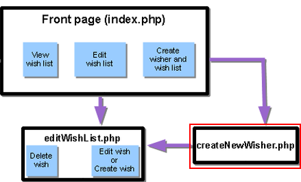
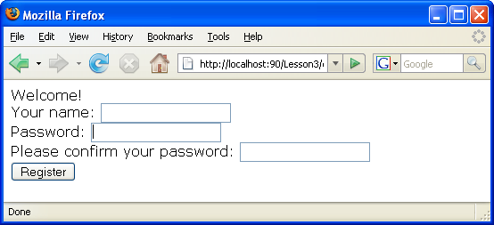

// 
//     Licensed to the Apache Software Foundation (ASF) under one
//     or more contributor license agreements.  See the NOTICE file
//     distributed with this work for additional information
//     regarding copyright ownership.  The ASF licenses this file
//     to you under the Apache License, Version 2.0 (the
//     "License"); you may not use this file except in compliance
//     with the License.  You may obtain a copy of the License at
// 
//       http://www.apache.org/licenses/LICENSE-2.0
// 
//     Unless required by applicable law or agreed to in writing,
//     software distributed under the License is distributed on an
//     "AS IS" BASIS, WITHOUT WARRANTIES OR CONDITIONS OF ANY
//     KIND, either express or implied.  See the License for the
//     specific language governing permissions and limitations
//     under the License.
//

= Lesson 3: Creating a New Application User
:jbake-type: tutorial
:jbake-tags: tutorials 
:jbake-status: published
:syntax: true
:icons: font
:source-highlighter: pygments
:toc: left
:toc-title:
:description: Lesson 3: Creating a New Application User - Apache NetBeans
:keywords: Apache NetBeans, Tutorials, Lesson 3: Creating a New Application User

In this lesson you expand the application with the Create a New Wisher functionality.

The implementation will affect the index.php file and two new files will be created named  `createNewWisher.php`  and  `editWishList.php` .

The Create a New Wisher use case consists of three steps:

1. <<addLinkNewWisher,The user opens the front page index.php and clicks the link to register>>.
2. <<implementCreateNewWisher,The user switches to the createNewWisher.php page for creating a new wisher>>.
3. After creating a new wisher, the user switches to editWishList.php, where he creates a wish list for the user.

The current document is a part of the Creating a Database Application in the NetBeans IDE for PHP tutorial.

== Application Source Code from the Previous Lesson

MySQL users: Click link:https://netbeans.org/files/documents/4/1928/lesson2.zip[+here+] to download the source code that reflects the project state after the previous lesson is completed.

Oracle Database users: Click link:https://netbeans.org/projects/www/downloads/download/php%252Foracle-lesson2.zip[+here+] to download the source code that reflects the project state after the previous lesson is completed.

== Adding a Link to Start Creating a New Wisher

Open  `index.php` . Add a blank line below the closing </form> tag. In that blank line, enter the following code block:

[source,html]
----

  Still don't have a wish list?! <a href="createNewWisher.php">Create now</a>
----

Where:

*  `Still don't have a wish list?! `  is the text that will be displayed on the page next to the link.
*  ``  is the code that implements a link that opens the createNewWisher.php page.
*  `Create now`  is the text that will be displayed as a link.

== Creating New PHP Web Pages

Create two new PHP web pages in your project's Source Files, as xref:wish-list-lesson2.adoc#createNewFile[+described+] in Lesson 2.

*  `createNewWisher.php` 
*  `editWishList.php` 

In  `editWishList.php` , add the text "Hello!" to the HTML body and otherwise leave it with its default content. You will modify this file in later lessons, but you need it to exist now because  `createNewWisher.php`  references it. For the remainder of this lesson, you modify  `createNewWisher.php` .

== Adding an HTML Form for Entering the Data of a New Wisher

Type or paste the following HTML block into  `createNewWisher.php` , beneath the PHP block:

[source,html]
----

<html>
    <head>
        <meta http-equiv="content-type" content="text/html; charset=UTF-8">
        <title></title>
    </head>
    <body>Welcome! <form action="createNewWisher.php" method="POST">Your name: <input type="text" name="user"/> Password: <input type="password" name="password"/> Please confirm your password: <input type="password" name="password2"/> <input type="submit" value="Register"/></form></body>
</html>
----

NOTE: The  `password`  type is a special type of a text field where characters are replaced with asterisks. The code presents an xref:wish-list-lesson3.adoc#htmlForm[+HTML form+] for a user to enter the name and password of the new wisher in the text fields. When the user clicks the "Register" button, the entered data is transferred for validation to the same page,  `createNewWisher.php` .

NOTE: You can ignore warnings from the HTML validator.

=== Validating Data and Adding It to the Database

In this section you add PHP code to  `createNewWisher.php` . Add this code to the PHP block at the top of the file. The PHP block must be above *all* HTML code, empty lines, or whitespace. The position of the PHP code block is important to enable correct functioning of the redirection statement. Within the PHP block, type or paste the code blocks described below in this section, in the order they are written.

*Add the following code to validate data:*

1. Initialize variables. The first variables pass database credentials and the others are the variables that will be used in the PHP operations.

[source,php]
----

/** database connection credentials */
$dbHost="localhost"; 
//on MySql
$dbXeHost="localhost/XE"; 
$dbUsername="phpuser";
$dbPassword="phpuserpw";

/** other variables */
$userNameIsUnique = true;
$passwordIsValid = true;				
$userIsEmpty = false;					
$passwordIsEmpty = false;				
$password2IsEmpty = false;	

			
----

. Below the variables, add an  `if ` clause. The parameter of the  `if`  clause checks that the page was requested from itself via the POST method. If not, the further validations are not performed and the page is shown with empty fields as described above.

[source,php]
----

/** Check that the page was requested from itself via the POST method. */
if ($_SERVER["REQUEST_METHOD"] == "POST") {

}
----

. Within the curly braces of the  `if `  clause, add another  `if `  clause that checks whether the user has filled in the wisher's name. If the text field "user" is empty, the value of  `$userIsEmpty`  is changed to true.

[source,php]
----

/** Check that the page was requested from itself via the POST method. */
if ($_SERVER["REQUEST_METHOD"] == "POST") {

/** Check whether the user has filled in the wisher's name in the text field "user" */    *
    if ($_POST["user"]=="") {
    $userIsEmpty = true;
    }*
}
----

. Add code that establishes a database connection. If the connection cannot be established, the MySQL or Oracle OCI8 error is sent to the output.

*For the MySQL database:*

[source,php]
----

/** Check that the page was requested from itself via the POST method. */
if ($_SERVER["REQUEST_METHOD"] == "POST") {

/** Check whether the user has filled in the wisher's name in the text field "user" */    
    if ($_POST["user"]=="") {
        $userIsEmpty = true;
    }

    /** Create database connection */*$con = mysqli_connect($dbHost, $dbUsername, $dbPassword);
if (!$con) {
exit('Connect Error (' . mysqli_connect_errno() . ') '
. mysqli_connect_error());
}
//set the default client character set 
mysqli_set_charset($con, 'utf-8');*
} 
----

*For the Oracle database:*

[source,php]
----

/** Check that the page was requested from itself via the POST method. */
if ($_SERVER['REQUEST_METHOD'] == "POST") {

/** Check whether the user has filled in the wisher's name in the text field "user" */
    if ($_POST['user'] == "") {
        $userIsEmpty = true;
    }

    /** Create database connection */*$con = oci_connect($dbUsername, $dbPassword, $dbXeHost, "AL32UTF8");
    if (!$con) {
        $m = oci_error();
        exit('Connect Error' . $m['message']);

    }*
}
----

. Add code that checks whether a user whose name matches the "user" field already exists. The code does this by trying to find a wisher ID number for a name matching the name in the "user" field. If such an ID number exists, the value of  `$userNameIsUnique`  is changed to "false."

*For the MySQL database:*

[source,php]
----

/** Check that the page was requested from itself via the POST method. */
if ($_SERVER["REQUEST_METHOD"] == "POST") {

/** Check whether the user has filled in the wisher's name in the text field "user" */

    if ($_POST["user"]=="") {
        $userIsEmpty = true;
    }/** Create database connection */$con = mysqli_connect($dbHost, $dbUsername, $dbPassword);if (!$con) {exit('Connect Error (' . mysqli_connect_errno() . ') '. mysqli_connect_error());}*/**set the default client character set */ 
mysqli_set_charset($con, 'utf-8');*
   */** Check whether a user whose name matches the "user" field already exists */**mysqli_select_db($con, "wishlist");
    $user = mysqli_real_escape_string($con, $_POST["user"]);
$wisher = mysqli_query($con, "SELECT id FROM wishers WHERE name='".$user."'");
$wisherIDnum=mysqli_num_rows($wisher);
if ($wisherIDnum) {
$userNameIsUnique = false;
}*
} 
----

*For the Oracle database:*

[source,php]
----

/** Check that the page was requested from itself via the POST method. */
if ($_SERVER['REQUEST_METHOD'] == "POST") {
/** Check whether the user has filled in the wisher's name in the text field "user" */
    if ($_POST['user'] == "") {
        $userIsEmpty = true;
    }
    /** Create database connection */$con = oci_connect($dbUsername, $dbPassword, $dbXeHost, "AL32UTF8");
    if (!$con) {
        $m = oci_error();
        exit('Connection Error ' . $m['message']);

    }

   */** Check whether a user whose name matches the "user" field already exists */*
    *$query = "SELECT id FROM wishers WHERE name = :user_bv";
    $stid = oci_parse($con, $query);
    $user = $_POST['user'];
    $wisherID = null;
    oci_bind_by_name($stid, ':user_bv', $user);
    oci_execute($stid);

// Each user name should be unique. Check if the submitted user already exists.
    $row = oci_fetch_array($stid, OCI_ASSOC);
    if ($row){
        $userNameIsUnique = false;
    }*
}
----

. After the code that checks if the user is unique, add a series of  `if ` clauses that check whether the user entered and confirmed a password correctly. The code checks that the Password ("password") and Confirm Password ('password2) fields are not empty in the form and that they are identical. Otherwise the values of the corresponding boolean variables are changed accordingly.

[source,php]
----

if ($_POST["password"]=="") {$passwordIsEmpty = true;
}if ($_POST["password2"]=="") {$password2IsEmpty = true;
}if ($_POST["password"]!=$_POST["password2"]) {$passwordIsValid = false;
} 
----

.  Complete the  `if ($_SERVER['REQUEST_METHOD'] == "POST")`  clause by adding code that inserts a new entry into the "wishers" database. The code checks that the name of the wisher is specified uniquely and that the password is entered and confirmed validly. If the conditions are met, the code takes the "user" and "password" values from the HTML form and inserts them into the Name and Password columns, respectively, of a new row in the wishers database. After creating the row, the code closes the database connection and redirects the application to the page  `editWishList.php` .

*For the MySQL database:*

[source,php]
----

/** Check that the page was requested from itself via the POST method. */
if ($_SERVER['REQUEST_METHOD'] == "POST") {
    /** Check whether the user has filled in the wisher's name in the text field "user" */
    if ($_POST['user'] == "") {
        $userIsEmpty = true;
    }

    /** Create database connection */
    $con = mysqli_connect($dbHost, $dbUsername, $dbPassword);
    if (!$con) {
        exit('Connect Error (' . mysqli_connect_errno() . ') '
                . mysqli_connect_error());
    }
    //set the default client character set 
    mysqli_set_charset($con, 'utf-8');

    /** Check whether a user whose name matches the "user" field already exists */
    mysqli_select_db($con, "wishlist");
    $user = mysqli_real_escape_string($con, $_POST['user']);
    $wisher = mysqli_query($con, "SELECT id FROM wishers WHERE name='".$user."'");
    $wisherIDnum=mysqli_num_rows($wisher);
    if ($wisherIDnum) {
        $userNameIsUnique = false;
    }

    /** Check whether a password was entered and confirmed correctly */
    if ($_POST['password'] == "") {
        $passwordIsEmpty = true;
    }
    if ($_POST['password2'] == "") {
        $password2IsEmpty = true;
    }
    if ($_POST['password'] != $_POST['password2']) {
        $passwordIsValid = false;
    }

    /** Check whether the boolean values show that the input data was validated successfully.
     * If the data was validated successfully, add it as a new entry in the "wishers" database.
     * After adding the new entry, close the connection and redirect the application to editWishList.php.
     */
    *if (!$userIsEmpty &amp;&amp; $userNameIsUnique &amp;&amp; !$passwordIsEmpty &amp;&amp; !$password2IsEmpty &amp;&amp; $passwordIsValid) {
        $password = mysqli_real_escape_string($con, $_POST['password']);
        mysqli_select_db($con, "wishlist");
        mysqli_query($con, "INSERT wishers (name, password) VALUES ('" . $user . "', '" . $password . "')");
        mysqli_free_result($wisher);
        mysqli_close($con);
        header('Location: editWishList.php');
        exit;
    }*
}
----

*For the Oracle database:*

[source,php]
----

/** Check that the page was requested from itself via the POST method. */
if ($_SERVER['REQUEST_METHOD'] == "POST") {

/** Check whether the user has filled in the wisher's name in the text field "user" */
    if ($_POST['user'] == "")
        $userIsEmpty = true;

    /** Create database connection */
    $con = oci_connect($dbUsername, $dbPassword, $dbXeHost, "AL32UTF8");
    if (!$con) {
        $m = oci_error();
        echo $m['message'], "\n";
        exit;
    }
    
    /** Check whether a user whose name matches the "user" field already exists */
    $query = "select ID from wishers where name = :user_bv";
    $stid = oci_parse($con, $query);
    $user = $_POST['user'];
    $wisherID = null;
    oci_bind_by_name($stid, ':user_bv', $user);
    oci_execute($stid);

/**Each user name should be unique. Check if the submitted user already exists. */
    $row = oci_fetch_array($stid, OCI_ASSOC);
    if ($row) {
    $wisherID = $row['ID']; 
    }
    if ($wisherID != null) {
        $userNameIsUnique = false;
    }
    //Check for the existence and validity of the password
    if ($_POST['password'] == "") {
        $passwordIsEmpty = true;
    }
    if ($_POST['password2'] == "") {
        $password2IsEmpty = true;
    }
    if ($_POST['password'] != $_POST['password2']) {
        $passwordIsValid = false;
    }
    /** Check whether the boolean values show that the input data was validated successfully.
     * If the data was validated successfully, add it as a new entry in the "wishers" database.
     * After adding the new entry, close the connection and redirect the application to editWishList.php.
     */
    *if (!$userIsEmpty &amp;&amp; $userNameIsUnique &amp;&amp; !$passwordIsEmpty &amp;&amp; !$password2IsEmpty &amp;&amp; $passwordIsValid) {

        $query = "INSERT INTO wishers (name, password) VALUES (:user_bv, :pwd_bv)";
        $stid = oci_parse($con, $query);
        $pwd = $_POST['password'];
        oci_bind_by_name($stid, ':user_bv', $user);
        oci_bind_by_name($stid, ':pwd_bv', $pwd);
        oci_execute($stid);
        oci_free_statement($stid);
        oci_close($con);
        header('Location: editWishList.php');
        exit;
    }*
}
----

== Displaying Error Messages in the Input Form

Now you implement the display of error messages when the entered data is invalid. The implementation is based on the validations and changes to the values of the boolean variables described in <<validatinDataBeforeAddingToDatabase,Validating Data and Adding It to the Database>>.

1. Enter the following PHP code block inside the HTML input form, below the wisher's name input:

[source,php]
----

Welcome! <form action="createNewWisher.php" method="POST">Your name: <input type="text" name="user"/> 

*<?php
    if ($userIsEmpty) {
        echo ("Enter your name, please!");
        echo (" ");
    }                
    if (!$userNameIsUnique) {
        echo ("The person already exists. Please check the spelling and try again");
        echo (" ");
    }
    ?> *
----

. Enter the following PHP code block inside the HTML input form below the code for the password input:

[source,php]
----

Password: <input type="password" name="password"/> 
*<?php
 if ($passwordIsEmpty) {
     echo ("Enter the password, please!");
     echo (" ");
 }                
 ?>*
----

. Enter the following PHP code blocks inside the HTML input form below the code for password confirmation:

[source,php]
----

Please confirm your password: <input type="password" name="password2"/> 

*<?php
 if ($password2IsEmpty) {
     echo ("Confirm your password, please");
     echo (" ");    
 }                
 if (!$password2IsEmpty &amp;&amp; !$passwordIsValid) {
     echo  ("The passwords do not match!");
     echo (" ");  
 }                 
?>*
----

=== Testing the Create New Wisher Functionality

1. Run the application. The index page opens.

image::images/index-php-3.png[]

. On the index page, click the link next to the text Still don't have a wish list? The following form opens:

. Leave the fields empty and click Register. An error message displays.

image::images/create-new-wisher-name-empty.png[]

. Enter the name of a registered wisher, for example, Tom in the Your name field, fill in the other fields correctly, and click Register. An error message displays.

. Fill in the Password and Please confirm your password fields with different values and click Register. An error message displays.

. Enter Bob in the Your name field, specify the same password in both password fields and click Register. The page that opens is empty but the redirection passed correctly as the URL ends with editWishList.php:

image::images/edit-wish-list-empty.png[]

. To check that the data is stored in the database, navigate to wishers on the Services window below the wislist1 node and from the context menu choose View Data 

image::images/wishers.png[]

== Application Source Code after the Current Lesson Is Completed

MySQL users: Click link:https://netbeans.org/files/documents/4/1929/lesson3.zip[+here+] to download the source code that reflects the project state after the lesson is completed.

Oracle Database users: Click link:https://netbeans.org/projects/www/downloads/download/php%252Foracle-lesson3.zip[+here+] to download the source code that reflects the project state after the lesson is completed.

== Next Steps

xref:wish-list-lesson2.adoc[+<< Previous lesson+]

xref:wish-list-lesson4.adoc[+Next lesson >>+]

xref:wish-list-tutorial-main-page.adoc[+Back to the Tutorial main page+]
