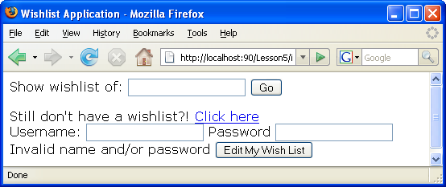
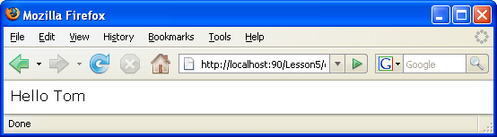

// 
//     Licensed to the Apache Software Foundation (ASF) under one
//     or more contributor license agreements.  See the NOTICE file
//     distributed with this work for additional information
//     regarding copyright ownership.  The ASF licenses this file
//     to you under the Apache License, Version 2.0 (the
//     "License"); you may not use this file except in compliance
//     with the License.  You may obtain a copy of the License at
// 
//       http://www.apache.org/licenses/LICENSE-2.0
// 
//     Unless required by applicable law or agreed to in writing,
//     software distributed under the License is distributed on an
//     "AS IS" BASIS, WITHOUT WARRANTIES OR CONDITIONS OF ANY
//     KIND, either express or implied.  See the License for the
//     specific language governing permissions and limitations
//     under the License.
//

= Lição 5: Adicionando Segurança. Implementando o Log-in do Usuário da Aplicação
:jbake-type: tutorial
:jbake-tags: tutorials 
:jbake-status: published
:icons: font
:syntax: true
:source-highlighter: pygments
:toc: left
:toc-title:
:description: Lição 5: Adicionando Segurança. Implementando o Log-in do Usuário da Aplicação - Apache NetBeans
:keywords: Apache NetBeans, Tutorials, Lição 5: Adicionando Segurança. Implementando o Log-in do Usuário da Aplicação

Nesta lição, você implementará a funcionalidade de log-in para um wisher. Isso afeta os seguintes arquivos:

*  `index.php` 
*  `createnewwisher.php` 
*  `editWishlist.php` 
*  `db.php` 

Implementar a funcionalidade de log-in consiste nas seguintes etapas:

1. <<_saving_the_wisher_s_id_in_the_session_upon_creation,Salvar o wisher ID na Sessão em criação de um wisher>>
2. <<_validating_user_logon,Validar se o usuário que tenta editar um desejo está conectado>>
3. <<_html_form_for_logon_on_index_php,Fazer log-in do wisher na página index.php>>

O documento atual é uma parte do tutorial Criando uma Aplicação CRUD no NetBeans IDE para PHP.

[[_application_source_code_from_the_previous_lesson]]
== Código-fonte da Aplicação da Lição Anterior

Usuários MySQL: clique link:https://netbeans.org/files/documents/4/1930/lesson4.zip[+aqui+] para fazer o download do código-fonte que reflete o estado do projeto depois que a lição anterior estiver concluída.

Usuários do banco de dados Oracle: clique link:https://netbeans.org/projects/www/downloads/download/php%252Foracle-lesson4.zip[+aqui+] para fazer o download do código-fonte que reflete o estado do projeto depois que a lição anterior for concluída.

[[_saving_the_wisher_s_id_in_the_session_upon_creation]]
== Salvando o wisher ID na Sessão Em Criação

Uma link:http://us2.php.net/manual/en/ref.session.php[+Sessão+] é um armazenamento duradouro para transferir informações de uma página para outra sem usar um link:wish-list-lesson5.html#htmlForm[+form de entrada HTML+]. Essa funcionalidade tem suporte por meio de um array PHP predefinido  `$_SESSION` .

Por motivos de segurança, depois que um novo wisher é criado, ele deve se conectar automaticamente sem preencher um form. Portanto, você precisa modificar o arquivo  `createNewWisher.php`  para implementar a seguinte funcionalidade:

* Adicione um novo wisher ao banco de dados.
* Abra uma sessão.
* Armazene o nome do wisher na sessão.
* Transfira o nome do wisher na sessão quando ele for redirecionado para a página  `editWishList.php` .

No arquivo  `createNewWisher.php` , localize a linha:

[source,php]
----

WishDB::getInstance()->create_wisher($_POST['user'], $_POST['password']);
----

e insira o seguinte bloco de código abaixo:

[source,php]
----

session_start();
$_SESSION['user'] = $_POST['user'];
----

O bloco de código inicia uma sessão, o que significa abrir o array  `$_SESSION`  para inserir ou recuperar dados. Em seguida, o código adiciona um elemento ao array  `$_SESSION` . O elemento adicionado contém um valor e um identificador (chave). O valor é o nome dos wishers recém-criados e o identificador é "user". Em seguida, o programa redireciona o wisher para a página  `editWishList.php` .

[[_validating_user_logon]]
== Validando o Log-in do Usuário

Quando um usuário chega à página  `editWishList.php` , a aplicação deve confirmar que a página foi acessada pela mesma pessoa que acabou de se registrar na página  `createNewWisher.php` .

Implementar essa funcionalidade consiste em duas etapas:

* <<_retrieving_the_wisher_s_name_from_the_session,Recuperando o nome do wisher na Sessão>>
* <<_logging_in_from_the_index_php_page,Redirecionar o usuário para o index.php, caso a recuperação do nome do wisher na sessão tenha falhado>>

[[_retrieving_the_wisher_s_name_from_the_session]]
=== Recuperando o Nome do Wisher da Sessão

Substitua o código default no bloco PHP de  `editWishList.php`  pelo seguinte:

[source,php]
----

session_start();
if (array_key_exists("user", $_SESSION)) {
  echo "Hello " . $_SESSION['user'];
}
----

O bloco de código abre o array  `$_SESSION`  para recuperar dados e verifica se  `$_SESSION`  contém um elemento com o identificador "user". Se a verificação for bem-sucedida, o código imprime uma mensagem de boas-vindas.

Para verificar se a sessão foi implementada corretamente:

1. Execute o arquivo  `createNewWisher.php`  e crie um novo wisher, por exemplo, Jack.
O  `editWishList.php`  abre com "Hello Jack" (Olá, Jack).

. Limpe os cookies da sessão em seu browser ou termine a sessão e execute  `editWishList.php`  no IDE.
O arquivo  `editWishList.php`  abre com Hello porque nenhum usuário foi transferido a uma sessão. Isso não é correto, porque permite que alguém que não esteja conectado e não esteja registrado crie ou edite uma lista de desejos. Para evitar isso, o usuário precisa ser redirecionado para a página  `index.php` .

[[_logging_in_from_the_index_php_page]]
=== Redirecionando um Usuário Que Não Está Conectado

Adicione o bloco de código seguinte ao  `editWishList.php` , abaixo da cláusula  `if` :

[source,php]
----

else {
  header('Location: index.php');
  exit;
}
----

O código redireciona o usuário para a página index.php e cancela a execução do código PHP.

Para verificar se a funcionalidade foi implementada corretamente, execute o arquivo  `editWishList.php` . O resultado esperado é que a página  `index.php`  abra.

[[_html_form_for_logon_on_index_php]]
== Fazendo log-in na página index.php

O log-in na página index.php consiste em duas etapas:

* <<_html_form_for_logon_on_index_php,Indicando o nome e a senha do usuário em um form de entrada HTML e enviando os dados para validação à página index.php.>>
* <<_logon_validation,Validando o log-in>>

=== Form HTML para Log-in em index.php

No arquivo  `index.php` , insira o código a seguir antes de fechar a tag  `</body>` :

[source,xml]
----

<form name="logon" action="index.php" method="POST" >
  Username: <input type="text" name="user">
  Password  <input type="password" name="userpassword">
  <input type="submit" value="Edit My Wish List">
</form>
----

*Observação: *você pode ignorar as advertências do validador HTML.

O código apresenta um link:wish-list-lesson3.html#htmlForm[+form HTML+] que permite inserir o nome e a senha do usuário nos campos de texto. Quando o usuário clica em Editar Minha Lista de Desejos, os dados são transferidos para a mesma página, index.php.

[[_logon_validation]]
=== Validação de Log-in

A validação do log-in envolve:

* <<_logon_validation,Verificação de onde o usuário foi redirecionado>>.
* <<_logon_validation,Verificação do nome e senha do usuário>>.
* Salvar o nome do usuário na Sessão e redirecionar o usuário para a página editWishList.php ou <<_logon_validation,Exibir uma mensagem de erro.>>

Um usuário pode acessar a página  `index.php`  ao iniciar a aplicação, ou na página<<_function_verify_wisher_credentials, editWishList.php>>, ou quando redirecionado da página  `index.php`  depois de inserir o nome e a senha.

Como o link:http://www.htmlcodetutorial.com/forms/_FORM_METHOD.html[+método de solicitação HTML+] POST é usado somente em último caso, você sempre pode saber onde o usuário estava localizado quando acessou o  `index.php` .

No arquivo index.php, crie um bloco <?php ?> acima do bloco HTML, com o seguinte código:

[source,php]
----

<?php
require_once("Includes/db.php");
$logonSuccess = false;

// verify user's credentials
if ($_SERVER['REQUEST_METHOD'] == "POST") {
    $logonSuccess = (WishDB::getInstance()->verify_wisher_credentials($_POST['user'], $_POST['userpassword']));
    if ($logonSuccess == true) {
      session_start();
      $_SESSION['user'] = $_POST['user'];
      header('Location: editWishList.php');
      exit;
    }
}
?>
----

O início do código permite que o usuário use o arquivo  `db.php`  e inicialize a variável  `$log-inSuccess`  com o valor  `false` . Se a validação ocorrer, esse valor mudará para  `true` .

O código que verifica as credenciais do usuário verifica primeiro se o método de solicitação é POST. Se o método for POST, o usuário foi redirecionado depois de enviar o <<_html_form_for_logon_on_index_php,form de log-in>>. Nesse caso, o bloco de código chama a função  `verify_wisher_credentials`  com o nome e a senha inseridas no form de log-in.

A função  `verify_wisher_credentials` , que você escreverá <<_function_verify_wisher_credentials,na próxima seção>>, verifica se há um registro na tabela de  `wishers`  em que o usuário e a senha são confrontados com os valores enviados no <<verify_wisher_credentials,form de log-in>>. Se a função  `verify_wisher_credentials`  retornar  `true` , um wisher com a combinação de nome e senha será registrado no banco de dados. Isso significa que a validação ocorreu e que  `$log-inSuccess`  muda o valor para  `true` . Nesse caso, a seção é iniciada e o array  `$_SESSION`  abre. O código adiciona um novo elemento ao array  `$_SESSION` . O elemento contém um valor e um identificador (chave). O valor é o nome do wisher e o identificador é "user". Em seguida, o código redireciona o usuário para a página  `editWishList.php`  para editar a lista de desejos.

Se a função  `verify_wisher_credentials`  retornar  `false` , o valor da variável  `$log-inSuccess`  permanece falso. O valor da variável é usado em <<_displaying_error_messages,exibindo uma mensagem de erro>>.

[[_function_verify_wisher_credentials]]
=== Função verify_wisher_credentials

Para implementar a verificação das credenciais do wisher, você precisa adicionar uma nova função à classe  `WishDB`  no arquivo  `db.php` . A função requer um nome e uma senha como parâmetros de entrada e retorna 0 ou 1.

*Para o banco de dados MySQL*, insira o seguinte bloco de código:

[source,php]
----

public function verify_wisher_credentials($name, $password) {
  $name = $this->real_escape_string($name);
  $password = $this->real_escape_string($password);
  $result = $this->query("SELECT 1 FROM wishers WHERE name = '"
                  . $name . "' AND password = '" . $password . "'");
  return $result->data_seek(0);
}
----

*Para o banco de dados Oracle*, insira o seguinte bloco de código (como o OCI8 não tem equivalente para  `mysql_num_rows` , este código é uma forma modificada de  `get_wisher_id_by_name` ):

[source,php]
----

public function verify_wisher_credentials($name, $password) {
  $query = "SELECT 1 FROM wishers WHERE name = :name_bv AND password = :pwd_bv";
  $stid = oci_parse($this->con, $query);
  oci_bind_by_name($stid, ':name_bv', $name);
  oci_bind_by_name($stid, ':pwd_bv', $password);
  oci_execute($stid);

//Because name is a unique value I only expect one row
  $row = oci_fetch_array($stid, OCI_ASSOC);
  if ($row)
    return true;
  else
    return false;
}
----

O bloco de código executa a consulta  ` "SELECT 1 FROM wishers WHERE Name = '" . $name . "' AND Password = '". $password. "'"`  e retorna o número de registros que atendam à consulta especificada. Se o registro for encontrado, a função retorna  `true` . Se não houver registro no banco de dados, a função retornará  `false` .

[[_displaying_error_messages]]
=== Exibindo Mensagens de Erro

Para permitir que a aplicação exiba mensagens de erro, insira o seguinte bloco de código <? php?> no form de log-in em  `index.php` , abaixo dos campos de entrada, mas acima do botão:

[source,php]
----

<?php
if ($_SERVER['REQUEST_METHOD'] == "POST") {
  if (!$logonSuccess)
    echo "Invalid name and/or password";
}
?>
----

O bloco de código verifica o valor da variável $log-inSuccess e se ele for falso, exibe uma mensagem de erro.

[[_testing_the_logon_from_the_index_php_page]]
== Testando o Log-in na Página index.php

Para verificar se a funcionalidade de log-in funciona corretamente na página inicial  `index.php` :

1. Execute a aplicação.
2. Na página  `index.php` , digite Tom na caixa de edição Nome do Usuário e Tim na caixa de edição Senha.
3. Pressione Editar Minha Lista de Desejos. É exibida uma mensagem de erro (observe que a janela de browser abaixo é reduzida para 600 px de largura, o que acrescenta algumas quebras de linha): 

. Digite Tom na caixa de edição Nome de Usuário e tomcat na caixa de edição Senha.

. Clique em Editar Minha Lista de Desejos. É exibida a página editWishList.php: 

[[application_source_code_after_the_current_lesson_is_completed]]
== O código-fonte da Aplicação após a Lição Atual está Concluído

Usuários MySQL: clique link:https://netbeans.org/files/documents/4/1931/lesson5.zip[+aqui+] para fazer o download do código-fonte que reflete o estado do projeto depois que a lição estiver concluída.

Usuários do banco de dados Oracle: clique link:https://netbeans.org/projects/www/downloads/download/php%252Foracle-lesson5.zip[+aqui+] para fazer o download do código-fonte que reflete o estado do projeto depois que a lição for concluída.

[[_next_steps]]
== Próximas Etapas

link:wish-list-lesson4.html[+<< Lição anterior+]

link:wish-list-lesson6.html[+Próxima lição >>+]

link:wish-list-tutorial-main-page.html[+Voltar à página principal do Tutorial+]

link:/about/contact_form.html?to=3&subject=Feedback:%20PHP%20Wish%20List%20CRUD%205:%20Implementing%20Security[+Enviar Feedback neste Tutorial+]

Para enviar comentários e sugestões, obter suporte e manter-se informado sobre os desenvolvimentos mais recentes das funcionalidades de desenvolvimento PHP do NetBeans IDE, link:../../../community/lists/top.html[+junte-se à lista de correspondência users@php.netbeans.org+].

link:../../trails/php.html[+Voltar à Trilha do Aprendizado PHP+]

