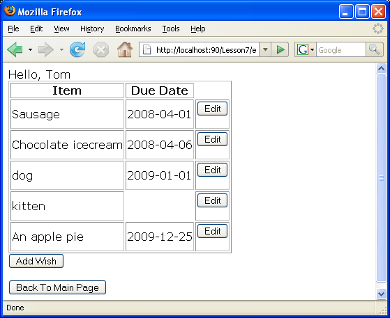

// 
//     Licensed to the Apache Software Foundation (ASF) under one
//     or more contributor license agreements.  See the NOTICE file
//     distributed with this work for additional information
//     regarding copyright ownership.  The ASF licenses this file
//     to you under the Apache License, Version 2.0 (the
//     "License"); you may not use this file except in compliance
//     with the License.  You may obtain a copy of the License at
// 
//       http://www.apache.org/licenses/LICENSE-2.0
// 
//     Unless required by applicable law or agreed to in writing,
//     software distributed under the License is distributed on an
//     "AS IS" BASIS, WITHOUT WARRANTIES OR CONDITIONS OF ANY
//     KIND, either express or implied.  See the License for the
//     specific language governing permissions and limitations
//     under the License.
//

= 第 7 课：更新和删除数据库中的条目
:jbake-type: tutorial
:jbake-tags: tutorials 
:jbake-status: published
:icons: font
:syntax: true
:source-highlighter: pygments
:toc: left
:toc-title:
:description: 第 7 课：更新和删除数据库中的条目 - Apache NetBeans
:keywords: Apache NetBeans, Tutorials, 第 7 课：更新和删除数据库中的条目

在本课中，将使用以下两个功能扩展应用程序功能：

要实现这些功能，请编辑  `editWishList.php`  和  `editWish.php`  文件。您还会创建一个名为  `deleteWish.php`  的新文件。

image::images/page-flow-diagram-l7.png[]

当前文档是“在适用于 PHP 的 NetBeans IDE 中创建 CRUD 应用程序”教程的一部分。

== 来自上一课的应用程序源代码

MySQL 用户：单击link:https://netbeans.org/files/documents/4/1932/lesson6.zip[+此处+]以下载源代码，该代码反映了在完成上一课之后的项目状态。

Oracle 数据库用户：单击link:https://netbeans.org/projects/www/downloads/download/php%252Foracle-lesson6.zip[+此处+]以下载源代码，该代码反映了在完成上一课之后的项目状态。

== 编辑愿望

该功能支持以下用例：

* 在  `editWishList.php`  页上，用户按愿望右侧的 "Edit" 按钮。包含选定愿望数据的  `editWish.php`  页打开。
* 用户更改愿望说明和/或截止日期，然后按 "Save Changes" 按钮。
* 如果_未_填写说明，则会显示一条错误消息，且用户将返回到  `editWish.php`  页。
* 如果填写了说明，应用程序将返回到  `editWishList.php`  页，将在其中更新愿望。

该实现包括以下步骤：

* <<_implementing_the_edit_button,在 editWishList 页上添加 "Edit" 按钮>>
* <<_expanding_the_code_wish_code_array,在 editWish.php 页上更新 $wish 数组以存储愿望数据>>
* <<_updating_the_html_input_form,在 editWish.php 页上更新输入窗体>>
* <<_updating_the_wish_in_the_database,验证提交的数据并更新数据库中的愿望>>

=== 实现 "Edit" 按钮

在  `editWishList.php`  中，通过一个循环（ `while`  语句）实现包含许愿者愿望的表；从数据库中选择愿望时，该循环将显示包含愿望的行。添加 "Edit" 按钮作为行中最右侧的单元格。

1. 要通过 HTML 输入窗体传输愿望 ID，请将其存储在变量中。在  `while ` 循环末尾，输入以下代码行：

[source,php]
----
while ($row = mysqli_fetch_array($result)):
    echo "<tr><td>" . htmlentities($row['description']) . "</td>";
    echo "<td>" . htmlentities($row['due_date']) . "</td>";
    $wishID = $row['id'];
    echo "<td>WishID=" . $wishID . "</td>";
    //The loop is left open
    ?>
----

. 实现 "Edit" 按钮。在结束 </table> 标记前面，使用 editWish 窗体添加另一个窗体元格。该窗体包含一个按钮组件和一个隐藏组件；在单击该按钮时，该隐藏组件将发送  `$wishID`  值。（显示的是 MySQL 数据库代码，但为 Oracle 数据库添加的代码是相同的并位于相同的位置。）

[source,php]
----

Hello <?php echo $_SESSION["user"]; ?> 
<table border="black">
    <tr><th>Item</th><th>Due Date</th></tr>
    <?php
    require_once("Includes/db.php");
    $wisherID = WishDB::getInstance()->get_wisher_id_by_name($_SESSION["user"]);
    $result = WishDB::getInstance()->get_wishes_by_wisher_id($wisherID);
    while ($row = mysqli_fetch_array($result)) {
        echo "<tr><td>" . htmlentities($row["description"]) . "</td>";
        echo "<td>" . htmlentities($row["due_date"]) . "</td></tr>\n";
    }
    mysqli_free_result($result);
    ?>
    <td>
        <form name="editWish" action="editWish.php" method="GET">
            <input type="hidden" name="wishID" value="<?php echo $wishID; ?>">
            <input type="submit" name="editWish" value="Edit">
        </form>
    </td>
</table>
----

. 更改  `while`  循环以使用link:http://www.php.net/manual/en/control-structures.alternative-syntax.php[+替代语法+]。这可简化在  `while`  循环中执行 HTML 块的过程。在替代  `while`  循环语法中，左花括号 { 将替换为冒号 (:)，右花括号 } 将替换为  `endwhile;`  语句。将左花括号替换为冒号，删除右花括号，然后在结束 </table> 标记前面使用  `endwhile;`  语句添加一个新 PHP 块。这会将新表单元格包含在  `while`  循环中。将释放结果/释放语句代码移到  `endwhile;`  语句后面。（同样，显示的是 MySQL 数据库代码，但 Oracle 数据库的代码更改和位置是相同的。）

[source,php]
----

   while ($row = mysqli_fetch_array($result)){:
        echo "<tr><td>" . htmlentities($row["description"]) . "</td>";
        echo "<td>" . htmlentities($row["due_date"]) . "</td></tr>\n";
    }
    mysqli_free_result($result);
    ?>
    <td>
        <form name="editWish" action="editWish.php" method="GET">
           <input type="hidden" name="wishID" value="<?php echo $wishID; ?>">
           <input type="submit" name="editWish" value="Edit">
        </form>
    </td>
    <?php
    endwhile;
    mysqli_free_result($result);
    ?>
</table>
----

. 
修复表行语法。将行结束 </tr>\n 字符从截止日期回显语句移到新回显语句（紧靠  `endwhile;`  上面）。

[source,php]
----

    while ($row = mysqli_fetch_array($result)):
        echo "<tr><td>" . htmlentities($row["description"]) . "</td>";
        echo "<td>" . htmlentities($row["due_date"]) . "</td></tr>\n";
    ?>
    <td>
        <form name="editWish" action="editWish.php" method="GET">
           <input type="hidden" name="wishID" value="<?php echo $wishID; ?>">
           <input type="submit" name="editWish" value="Edit">
        </form>
    </td>
    <?php
    echo "</tr>\n";
    endwhile;
    mysqli_free_result($result);
    ?>
</table>
----

. 
整个表（包括将 "Edit" 按钮放在  `while`  循环内的窗体）现在显示如下：

*对于 MySQL 数据库：*

[source,php]
----

<table border="black">
    <tr><th>Item</th><th>Due Date</th></tr>
    <?php
    require_once("Includes/db.php");
    $wisherID = WishDB::getInstance()->get_wisher_id_by_name($_SESSION["user"]);
    $result = WishDB::getInstance()->get_wishes_by_wisher_id($wisherID);
    while($row = mysqli_fetch_array($result)):
        echo "<tr><td>" . htmlentities($row['description']) . "</td>";
        echo "<td>" . htmlentities($row['due_date']) . "</td>";
        $wishID = $row["id"];
    ?>
    <td>
        <form name="editWish" action="editWish.php" method="GET">
            <input type="hidden" name="wishID" value="<?php echo $wishID; ?>"/>
            <input type="submit" name="editWish" value="Edit"/>
        </form>
    </td>
    <?php
    echo "</tr>\n";
    endwhile;
    mysqli_free_result($result);
    ?>
</table>
----

*对于 Oracle 数据库：*

[source,php]
----

<table border="black">
    <tr><th>Item</th><th>Due Date</th></tr>
    <?php
    require_once("Includes/db.php");
    $wisherID = WishDB::getInstance()->get_wisher_id_by_name($_SESSION["user"]);
    $stid = WishDB::getInstance()->get_wishes_by_wisher_id($wisherID);
    while ($row = oci_fetch_array($stid)):
        echo "<tr><td>" . htmlentities($row["DESCRIPTION"]) . "</td>";
        echo "<td>" . htmlentities($row["DUE_DATE"]) . "</td>";
        $wishID = $row["ID"];
    ?>
    <td>
        <form name="editWish" action="editWish.php" method="GET">
            <input type="hidden" name="wishID" value="<?php echo $wishID; ?>"/>
            <input type="submit" name="editWish" value="Edit"/>
        </form>
    </td>
    <td>
        <form name="deleteWish" action="deleteWish.php" method="POST">
            <input type="hidden" name="wishID" value="<?php echo $wishID; ?>"/>
            <input type="submit" name="deleteWish" value="Delete"/>
        </form>
    </td>
    <?php
    echo "</tr>\n";
    endwhile;
    oci_free_statement($stid);
   ?>
</table>
----

=== 扩充  `$wish`  数组

在  `editWishList.php`  页上按 "Edit" 按钮时，选定愿望的 ID 将通过服务器请求方法 GET 传输到  `editWish.php`  页。要存储愿望 ID，您需要在  `$wish`  数组中添加新元素。

与添加新愿望一样，保存尝试失败后可以从  `editWishList.php`  页和  `editWish.php`  页访问输入窗体。因此，可通过传输数据时使用的服务器请求方法来区分这两种情况。GET 表示在用户第一次通过按 "Edit Wish" 访问页面时显示窗体。POST 表示在尝试保存没有说明的愿望后将用户重定向到窗体。

在  `editWish.php`  中，将  `EditWish`  输入窗体上面 HTML <body> 中的 PHP 块替换为扩展的  `$wish`  数组代码。

*对于 MySQL 数据库：*

[source,php]
----

<?php
if ($_SERVER["REQUEST_METHOD"] == "POST")
    $wish = array("id" => $_POST["wishID"], "description" => 
            $_POST["wish"], "due_date" => $_POST["dueDate"]);
else if (array_key_exists("wishID", $_GET))
    $wish = mysqli_fetch_array(WishDB::getInstance()->get_wish_by_wish_id($_GET["wishID"]));
else
    $wish = array("id" => "", "description" => "", "due_date" => "");
?>
----

*对于 Oracle 数据库：*

[source,php]
----

<?php
if ($_SERVER["REQUEST_METHOD"] == "POST")
    $wish = array("id" => $_POST["wishID"], "description" =>
                $_POST["wish"], "due_date" => $_POST["dueDate"]);
else if (array_key_exists("wishID", $_GET)) {
    $stid = WishDB::getInstance()->get_wish_by_wish_id($_GET["wishID"]);
    $row = oci_fetch_array($stid, OCI_ASSOC);
    $wish = array("id" => $row["ID"], "description" =>
                $row["DESCRIPTION"], "due_date" => $row["DUE_DATE"]);
    oci_free_statement($stid);
} else
    $wish = array("id" => "", "description" => "", "due_date" => "");
?>
----

该代码使用以下三个元素初始化  `$wish`  数组： `id` 、 `description`  和  `due_date` 。这些元素的值取决于服务器请求方法。如果服务器请求方法是 POST，则从输入窗体中接收这些值。否则，如果服务器请求方法是 GET，并且 $_GET 数组包含具有 "wishID" 键的元素，则通过 get_wish_by_wish_id 函数从数据库中检索这些值。最后，如果服务器请求方法既不是 "POST" 也不是 "GET"（表示是“添加新的愿望”用例），则这些元素为空。

前面的代码涉及创建和编辑愿望的用例。现在，您需要更新输入窗体，以便将其用于这两种情况。

=== 更新 HTML 输入窗体

目前，输入窗体适用于以下情况：您要创建新的愿望，并且没有愿望 ID。要使窗体适用于编辑现有愿望的情况，您需要添加一个隐藏字段以传输愿望 ID。必须从 $wish 数组中检索隐藏字段的值。在创建新的愿望期间，该值必须是一个空字符串。如果编辑了愿望，则必须将隐藏字段的值更改为愿望 ID。要创建该隐藏字段，请在  `editWish.php`  中的  `EditWish`  输入窗体上面添加以下行：

[source,php]
----

<input type="hidden" name="wishID" value="<?php echo  `$wish` ["id"];?>" />
----

=== 更新数据库中的愿望

现在，您需要更新用于验证输入数据和将愿望插入到数据库的代码。当前代码不区分创建新的愿望和更新现有愿望的情况。在当前实现中，始终将新记录添加到数据库中，因为该代码不验证从输入窗体传输的愿望 ID 值。

您需要添加以下函数：

* 如果传输的元素 "wishID" 是一个空字符串，则创建一个新愿望。
* 否则，如果元素 "wishID" 不是空字符串，则更新该愿望。

*更新 editWish.php 以验证愿望是否为新愿望并在愿望不是新愿望时进行更新：*

1. 将  `update_wish`  函数添加到  `db.php`  中。

*对于 MySQL 数据库：*

[source,php]
----

public function update_wish($wishID, $description, $duedate) {
    $description = $this->real_escape_string($description);
    if ($duedate==''){
        $this->query("UPDATE wishes SET description = '" . $description . "',
            due_date = NULL WHERE id = " . $wishID);
    } else
        $this->query("UPDATE wishes SET description = '" . $description .
            "', due_date = " . $this->format_date_for_sql($duedate)
            . " WHERE id = " . $wishID);
}
----

*对于 Oracle 数据库：*

[source,php]
----

public function update_wish($wishID, $description, $duedate) {
    $query = "UPDATE wishes SET description = :desc_bv, due_date = to_date(:due_date_bv, 'YYYY-MM-DD') 
                WHERE id = :wish_id_bv";
    $stid = oci_parse($this->con, $query);
    oci_bind_by_name($stid, ':wish_id_bv', $wishID);
    oci_bind_by_name($stid, ':desc_bv', $description);
    oci_bind_by_name($stid, ':due_date_bv', $this->format_date_for_sql($duedate));
    oci_execute($stid);

}
----

. 
将  `get_wish_by_wish_id`  函数添加到  `db.php`  中。

*对于 MySQL 数据库：*

[source,php]
----

public function get_wish_by_wish_id ($wishID) {
    return $this->query("SELECT id, description, due_date FROM wishes WHERE id = " . $wishID);
}
----

*对于 Oracle 数据库：*

[source,php]
----

public function get_wish_by_wish_id($wishID) {
    $query = "SELECT id, description, due_date FROM wishes WHERE id = :wish_id_bv";
    $stid = oci_parse($this->con, $query);
    oci_bind_by_name($stid, ':wish_id_bv', $wishID);
    oci_execute($stid);
    return $stid;
}
----

. 在  `editWish.php`  顶部的主 PHP 块中，在最终的 `else` 语句中添加一个条件。这是将愿望插入到数据库的  `else`  语句。将其更改为  `else if`  语句：

[source,php]
----

else if ($_POST["wishID"]=="") {
    WishDB::getInstance()->insert_wish($wisherID, $_POST["wish"], $_POST["dueDate"]);
    header('Location: editWishList.php' );
    exit;
}
----

. 在刚编辑的语句下面，键入或粘贴另一个  `else if`  语句：

[source,php]
----

else if ($_POST["wishID"]!="") {
    WishDB::getInstance()->update_wish($_POST["wishID"], $_POST["wish"], $_POST["dueDate"]);
    header('Location: editWishList.php' );
    exit;
} 
----

该代码检查  `$_POST`  数组中的  `wishID`  元素是否为空字符串，这意味着通过按 "Edit" 按钮从  `editWishList.php`  页重定向了用户，并且用户填写了愿望说明。如果检查成功，则该代码将使用输入参数  `wishID` 、 `description`  和  `dueDate`  调用函数  `update_wish` 。通过 POST 方法从 HTML 输入窗体接收这些参数。在调用  `update_wish`  后，应用程序将重定向到  `editWishList.php`  页并取消 PHP 处理。

== 测试编辑愿望功能

1. 运行应用程序。在 index.php 页上，填写以下字段：在 "Username" 字段中输入 "Tom"，在 "Password" 字段中输入 "tomcat"。

image::images/user-logon-to-edit-wish-list.png[]

. 按 "Edit My Wish List" 按钮。 `editWishList.php`  页打开。

image::images/edit-wish-list-edit-wish.png[]

. 单击 Icecream 旁边的 "Edit"。 `editWish.php`  页打开。

image::images/edit-wish.png[]

. 编辑这些字段，然后按 "Back to the List"。 `editWishList.php`  页打开，但未保存更改。

. 按 Icecream 旁边的 "Edit"。清除 "Describe your wish" 字段，然后按 "Save Changes"。将显示一条错误消息。

image::images/editWishEmptyDescription.png[]

. 在 "Describe your wish" 字段中输入 Chocolate icecream，然后按 "Save Changes"。 `editWishList.php`  页打开，并更新列表。

== 删除愿望

现在，您可以创建、读取和更新愿望，添加一个用于删除愿望的方法。

*允许用户删除愿望：*

1. 将  `delete_wish`  函数添加到  `db.php`  中。

*对于 MySQL 数据库：*

[source,php]
----

function delete_wish ($wishID){
    $this->query("DELETE FROM wishes WHERE id = " . $wishID);
}

----

*对于 Oracle 数据库：*

[source,php]
----

public function delete_wish($wishID) {
    $query = "DELETE FROM wishes WHERE id = :wish_id_bv";
    $stid = oci_parse($this->con, $query);
    oci_bind_by_name($stid, ':wish_id_bv', $wishID);
    oci_execute($stid); 
}
----

. 创建一个名为  `deleteWish.php`  的新 PHP 文件，然后在 <? php ?> 块下键入或粘贴以下代码：

[source,php]
----

require_once("Includes/db.php");
WishDB::getInstance()->delete_wish ($_POST["wishID"]);
header('Location: editWishList.php' );
----
该代码允许使用  `db.php`  文件。然后，它会从 WishDB 实例中调用  `delete_wish`  函数，并将  `wishID`  作为输入参数。最后，应用程序将重定向到  `editWishList.php`  页。

. 要实现 "Delete" 按钮，请在  `editWishList.php`  的  `while`  循环中添加另一个 HTML 表单元格，紧靠  `editWish`  按钮的代码块下面。HTML 输入窗体包含  `wishID`  隐藏字段以及一个标记为 "Delete" 的提交按钮。（显示的是 MySQL 数据库代码，但为 Oracle 数据库添加的代码是相同的并位于相同的位置。）

[source,php]
----

    while ($row = mysqli_fetch_array($result)):
        echo "<tr><td>" . htmlentities($row["description"]) . "</td>";
        echo "<td>" . htmlentities($row["due_date"]) . "</td></tr>\n";
    ?>
    <td>
        <form name="editWish" action="editWish.php" method="GET">
           <input type="hidden" name="wishID" value="<?php echo $wishID; ?>">
           <input type="submit" name="editWish" value="Edit">
        </form>
    </td>
    <td>
        <form name="deleteWish" action="deleteWish.php" method="POST">
            <input type="hidden" name="wishID" value="<?php echo $wishID; ?>"/>
            <input type="submit" name="deleteWish" value="Delete"/>
        </form>
    </td>
    <?php
    echo "</tr>\n";
    endwhile;
    mysqli_free_result($result);
    ?>
</table>
----

整个表（包括将 "Edit" 按钮放在  `while`  循环内的窗体）现在显示如下：

*对于 MySQL 数据库：*

[source,php]
----

<table border="black">
    <tr><th>Item</th><th>Due Date</th></tr>
    <?php
    require_once("Includes/db.php");
    $wisherID = WishDB::getInstance()->get_wisher_id_by_name($_SESSION["user"]);
    $result = WishDB::getInstance()->get_wishes_by_wisher_id($wisherID);
    while($row = mysqli_fetch_array($result)):
        echo "<tr><td>" . htmlentities($row['description']) . "</td>";
        echo "<td>" . htmlentities($row['due_date']) . "</td>";
        $wishID = $row["id"];
    ?>
    <td>
        <form name="editWish" action="editWish.php" method="GET">
            <input type="hidden" name="wishID" value="<?php echo $wishID; ?>"/>
            <input type="submit" name="editWish" value="Edit"/>
        </form>
    </td>
    <td>
        <form name="deleteWish" action="deleteWish.php" method="POST">
            <input type="hidden" name="wishID" value="<?php echo $wishID; ?>"/>
            <input type="submit" name="deleteWish" value="Delete"/>
        </form>
    </td>
    <?php
    echo "</tr>\n";
    endwhile;
    mysqli_free_result($result);
    ?>
</table>
----

*对于 Oracle 数据库：*

[source,php]
----

<table border="black">
    <tr><th>Item</th><th>Due Date</th></tr>
    <?php
    require_once("Includes/db.php");
    $wisherID = WishDB::getInstance()->get_wisher_id_by_name($_SESSION["user"]);
    $stid = WishDB::getInstance()->get_wishes_by_wisher_id($wisherID);
    while ($row = oci_fetch_array($stid)):
        echo "<tr><td>" . htmlentities($row["DESCRIPTION"]) . "</td>";
        echo "<td>" . htmlentities($row["DUE_DATE"]) . "</td>";
        $wishID = $row["ID"];
    ?>
    <td>
        <form name="editWish" action="editWish.php" method="GET">
            <input type="hidden" name="wishID" value="<?php echo $wishID; ?>"/>
            <input type="submit" name="editWish" value="Edit"/>
        </form>
    </td>
    <td>
        <form name="deleteWish" action="deleteWish.php" method="POST">
            <input type="hidden" name="wishID" value="<?php echo $wishID; ?>"/>
            <input type="submit" name="deleteWish" value="Delete"/>
        </form>
    </td>
    <?php
    echo "</tr>\n";
    endwhile;
    oci_free_statement($stid);
   ?>
</table>
----

== 测试删除愿望功能

要检查是否正确实现了该功能，请在  `editWishList.php`  页上按任何项目旁边的 "Delete"。该项目将不再出现在列表中。

image::images/deleteWish.png[]

== 完成当前课程后的应用程序源代码

MySQL 用户：单击link:https://netbeans.org/files/documents/4/1933/lesson7.zip[+此处+]以下载源代码，该代码反映了在完成课程后的项目状态。

Oracle 数据库用户：单击link:https://netbeans.org/projects/www/downloads/download/php%252Foracle-lesson7.zip[+此处+]以下载源代码，该代码反映了在完成课程后的项目状态。

== 后续步骤

link:wish-list-lesson6.html[+<< 上一课+] 

link:wish-list-lesson8.html[+下一课 >>+] 

link:wish-list-tutorial-main-page.html[+返回到教程主页+]

link:/about/contact_form.html?to=3&subject=Feedback:%20PHP%20Wish%20List%20CRUD%207:%20Updating%20and%20Deleting%20DB%20Entries[+发送有关此教程的反馈意见+]

要发送意见和建议、获得支持以及随时了解 NetBeans IDE PHP 开发功能的最新开发情况，请link:../../../community/lists/top.html[+加入 users@php.netbeans.org 邮件列表+]。

link:../../trails/php.html[+返回至 PHP 学习资源+]

