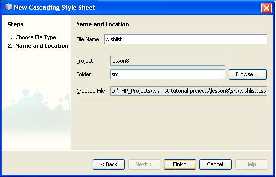

// 
//     Licensed to the Apache Software Foundation (ASF) under one
//     or more contributor license agreements.  See the NOTICE file
//     distributed with this work for additional information
//     regarding copyright ownership.  The ASF licenses this file
//     to you under the Apache License, Version 2.0 (the
//     "License"); you may not use this file except in compliance
//     with the License.  You may obtain a copy of the License at
// 
//       http://www.apache.org/licenses/LICENSE-2.0
// 
//     Unless required by applicable law or agreed to in writing,
//     software distributed under the License is distributed on an
//     "AS IS" BASIS, WITHOUT WARRANTIES OR CONDITIONS OF ANY
//     KIND, either express or implied.  See the License for the
//     specific language governing permissions and limitations
//     under the License.
//

= Lesson 8: Making the Application Look Better Using CSS
:jbake-type: tutorial
:jbake-tags: tutorials 
:jbake-status: published
:syntax: true
:icons: font
:source-highlighter: pygments
:toc: left
:toc-title:
:description: Lesson 8: Making the Application Look Better Using the CSS Technology - Apache NetBeans
:keywords: Apache NetBeans, Tutorials, Lesson 8: Making the Application Look Better Using the CSS Technology

In this lesson you learn how to do the following:

* <<_hiding_forms,Hide input forms when they are not used by implementing JavaScript functions >>
* <<_defining_styles_using_the_cascading_style_sheet,Define the styles and positioning of page elements by applying Cascading Style Sheet>>
* <<_implementing_the_design_using_html_divs,Implement the application design using divs>>.

The current document is a part of the Creating a CRUD Application in the NetBeans IDE for PHP tutorial.

== Application Source Code from the Previous Lesson

MySQL users: Click link:https://netbeans.org/files/documents/4/1933/lesson7.zip[+here+] to download the source code that reflects the project state after the previous lesson is completed.

Oracle Database users: Click link:https://netbeans.org/projects/www/downloads/download/php%252Foracle-lesson7.zip[+here+] to download the source code that reflects the project state after the previous lesson is completed.

== Hiding Forms

Presently, the main  `index.php`  page of your application always displays the entire logon and showWishList forms. To improve the appearance of your application, you can hide the forms and replace them with buttons. When the user presses a button the corresponding hidden form expands.

To implement this behavior:

1. Add a  block to the  `index.php`  file right above the closing </body> tag.
2. <<javaScriptFunctions,Develop two JavaScript functions inside the  tags>>.
3. <<showHideLogonInIndex,Make some minor changes to the index.php file>>

=== JavaScript Functions

JavaScript functions do not require any input parameters and do not return any result. The following code checks the visibility status of the corresponding form and changes it to the opposite status. It also changes the text on the button. To accomplish these changes, enter the following code inside the  tags:

[source,xml]
----

	
----

=== Updating `index.php` 

1. Add a  `style`  attribute to the logon form:

[source,php]
----

<form name="logon" action="index.php" method="POST" 
        style="visibility:<?php if ($logonSuccess) echo "hidden";
        else echo "visible";?>">
----
The  `style`  attribute defines whether the form is hidden or visible. The <?php ?> block is used to keep the form visible until the user logs on successfully.

. Enter the following code above the logon input form code:

[source,php]
----

<input type="submit" name="myWishList" value="My Wishlist"> onclick="javascript:showHideLogonForm()"/>
----
The code implements a button with the text "My Wishlist >>". The button stands in place of the logon form. Pressing the button calls the showHideLogonForm function.

. Add a  `style`  attribute to the wishList form:

[source,xml]
----

<form name="wishList" action="wishlist.php" method="GET" style="visibility:hidden">
Show wish list of: <input type="text" name="user"/>
            <input type="submit" value="Go" />
</form>
----

. Enter the following code above the wishList form:

[source,xml]
----

<input type="submit" name="showWishList" value="Show Wish List of" onclick="javascript:showHideShowWishListForm()"/>
----

. Remove the following code from the form because it is already placed on the button:

[source,php]
----

Show wishlist of: 
----

== Defining Styles Using the Cascading Style Sheet

Presently the controls in your application "stick" to each other and are usually placed in the upper left-hand corner of the screen. To improve the appearance of your application's pages, specify the size, position, color, font, and other parameters of controls by defining styles and assigning these styles to particular controls. Styles are defined in a separate Cascading Style Sheet (CSS) file.

All the recommendations and suggestions concerning the application design are optional. The style definitions below are intended just to give you an example of improving the application appearance. The settings are appropriate for screen resolution 1024x768 pixel or higher.

=== Creating a CSS File

1. Click the right mouse button on the Source Files node and from the context menu choose New > Cascading Style Sheet.
2. On the Cascading Style Sheet panel, in the File Name edit box enter wishlist. Click Finish. 

The new file  `wishlist.css`  is shown in the project tree.

=== Defining CSS Styles

Open the wishlist.css file. The file already contains a "root" class, which you can remove. You can get a copy of  `wishlist.css`  by downloading a completed version of this tutorial, available link:https://netbeans.org/files/documents/4/1934/lesson8.zip[+here+]. The code is intuitively clear and contains:

* Two styles: "body" and "input" - that are automatically applied inside any  `<body></body>`  or  `<input/>`  tag.
* CSS classes that are applied when explicitly specified. The names of classes have dots in preposition, for example, `.createWishList` . Some classes are used several times, for example, the ".error" class is applied to all error messages in the application. Other classes are used only once, for example, ".showWishList", ".logon".

== Implementing the Design Using HTML Divs

All the recommendations and suggestions concerning the application design are optional. Like the style definitions above they are intended just to give you an example of how to improve the application's appearance.

The example below shows how you can improve the appearance of the  `index.php`  page.

1. To enable using the CSS classes that you defined, enter the following code inside the  `<head></head>`  block:

[source,html]
----

<link href="wishlist.css" type="text/css" rel="stylesheet" media="all" />
----
The styles "body" and "input" are automatically applied inside the corresponding tags so you do need to indicate them explicitly.

. To apply any other style (class) to an area, enclose the code that implements the area in the  `

`  tags:

[source,html]
----

    <input type="submit" name="showWishList" value="Show Wish List of >>" onclick="javascript:showHideShowWishListForm()"/>
    
    <form name="wishList" action="wishlist.php" method="GET" style="visibility:hidden">
       <input type="text" name="user"/>
       <input type="submit" value="Go" />
    </form>

----

NOTE: When a class is specified within a 
 tag, no dot is required in preposition.

. You can use embedded 
 tags:

[source,html]
----

    <input type="submit" name="myWishList" value="My Wishlist" onclick="javascript:showHideLogonForm()"/>
    <form name="logon" action="index.php" method="POST" 
              style="visibility:<?php if ($logonSuccess) echo "hidden"; else echo "visible";?>">
        Username: <input type="text" name="user"/>
        Password:  <input type="password" name="userpassword"/> 
        

          <?php
             if (!$logonSuccess) echo "Invalid name and/or password";
           ?>
        

        <input type="submit" value="Edit My Wish List"/>
    </form>

  
----
The class "logon" is applied to the entire form, and the class "error" is applied to an error message within the form.

For more details on using Cascading Style Sheets (CSS), see link:http://www.htmlpedia.org/wiki/List_of_CSS_Properties[+http://www.htmlpedia.org/wiki/List_of_CSS_Properties+]

== Application Source Code after the Current Lesson Is Completed

MySQL users: Click link:https://netbeans.org/files/documents/4/1934/lesson8.zip[+here+] to download the source code that includes a sample design and CSS file.

Oracle Database users: Click link:https://netbeans.org/projects/www/downloads/download/php%252Foracle-lesson8.zip[+here+] to download the source code that includes a sample design and CSS file.

PDO: Goran Miskovic, a community member, has kindly provided a PDO version of the complete tutorial, available link:https://netbeans.org/projects/www/downloads/download/php/wishlist-pdo.zip[+here+]. In this project, you can switch between Oracle XE and MySQL databases simply by changing the DSN parameter. The project includes all SQL scripts you need and is documented in the code. Note however that PDO_OCI is experimental.

The NetBeans IDE team would like to thank Ozan Hazer for contributing the CSS and improving the code in the completed sample.

== Next Steps

xref:wish-list-lesson7.adoc[+<< Previous lesson+]

xref:wish-list-lesson9.adoc[+Next lesson >>+]

xref:wish-list-tutorial-main-page.adoc[+Back to the Tutorial main page+]
